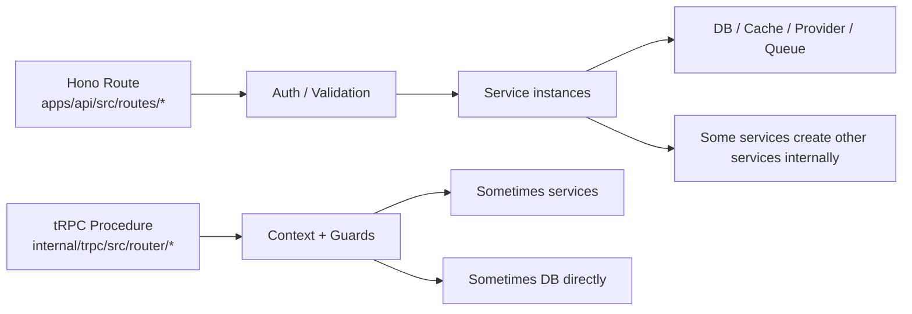
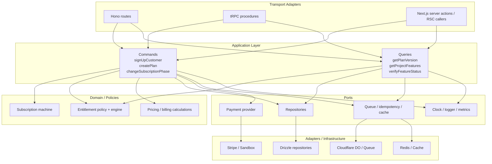
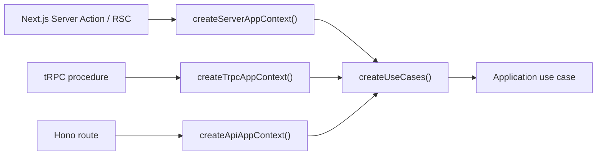

# API Orthogonal Architecture

## Goal

Move the backend toward a lightweight clean architecture where:

- Hono and tRPC are transport adapters, not the place where business rules live.
- Use cases are shared between the public API and the dashboard API.
- Dependencies are wired in one place per request, without a DI framework.
- The codebase can evolve feature by feature instead of through a rewrite.

## What already looks good

The repo already has a strong base for this direction:

- `apps/api` behaves like a composition root for the public API.
- `internal/services` already contains most business orchestration.
- `internal/trpc` already has a request-scoped context for the dashboard API.
- `internal/services/src/tests/workflow.test.ts` shows you are already thinking in workflows, not just CRUD.
- `internal/services/src/subscriptions/machine.ts` and the entitlements helpers are close to a domain core.

So the problem is not "missing architecture". The problem is that the architecture is present in pieces, but not applied consistently across all entrypoints.

## Current picture



## Where the architecture breaks today

### 1. Two application styles exist at the same time

- Public API routes often call services.
- Dashboard tRPC procedures often talk to the database directly.

That means your application rules are split across transport layers.

### 2. Composition happens in more than one place

You already compose request-scoped dependencies in `apps/api/src/middleware/init.ts` and `internal/trpc/src/trpc.ts`.

That is good. The problem is that some routes and services still instantiate dependencies deeper inside the call stack.

### 3. Services hide dependencies by constructing siblings

Examples:

- `SubscriptionService` creates `CustomerService` and `BillingService`.
- `BillingService` creates `CustomerService` and `GrantsManager`.
- `EntitlementService` creates `CustomerService` and sometimes `BillingService`.

This makes the services convenient in the short term, but it weakens the boundary between orchestration and infrastructure wiring.

### 4. Transport DTOs are still close to business logic

OpenAPI route schemas, tRPC inputs, and application logic are still tightly coupled in places. This makes it harder to reuse the same use case from multiple transports cleanly.

## The target shape

The simplest version of orthogonal architecture for this repo is:

1. Domain
2. Application use cases
3. Adapters
4. Composition roots



## The missing part

The missing part is not injectables. It is a shared application layer.

You need one thin layer between transport and infrastructure:

- `commands`: state-changing workflows
- `queries`: read workflows
- `ports`: interfaces for external dependencies
- `context`: request-scoped dependency bag

That gives you the clean architecture behavior you want without adopting a framework container.

## What to keep

Keep these ideas:

- request-scoped context
- feature services where they already hold real business logic
- state machine style for subscriptions
- result-style error handling
- workflow tests

## What to change

Change the shape of the interaction:

- routes/procedures should call use cases, not raw DB
- services should stop creating sibling services internally
- infra should be passed in from the edge
- shared logic should be callable from Hono, tRPC, and Next.js server code

## Recommended folder strategy

Do not rename the whole repo at once. Add a new layer and migrate feature by feature.

```text
internal/
  app/
    context.ts
    use-cases.ts
  modules/
    plans/
      application/
        queries/
          get-plan-version.ts
          list-plan-versions.ts
        commands/
          create-plan.ts
          update-plan.ts
      domain/
      ports.ts
      adapters/
        drizzle-plan-repository.ts
    customers/
      application/
      domain/
      ports.ts
      adapters/
    subscriptions/
      application/
      domain/
      ports.ts
      adapters/
```

If you want an even more incremental path, keep `internal/services` and make it the legacy facade while new code goes into `internal/modules`.

## Lightweight workflow

This is the workflow I would use in this repo.

### Step 1. Build one request-scoped application context

Create a plain object, not a DI container:

```ts
export type AppContext = {
  db: Database
  cache: Cache
  analytics: Analytics
  logger: AppLogger
  metrics: Metrics
  waitUntil: (p: Promise<unknown>) => void
  clock: {
    now: () => number
  }
  queues: {
    pipelineEvents: Pick<Queue<unknown>, "send">
  }
}
```

Then expose:

- `createApiAppContext(c)` for Hono
- `createTrpcAppContext(ctx)` for tRPC
- later `createServerAppContext()` for Next.js server actions or RSC

### Step 2. Turn "services" into explicit use cases

Good candidates:

- `signUpCustomer`
- `verifyFeatureStatus`
- `ingestEvent`
- `getPlanVersion`
- `listPlanVersions`
- `createPlan`
- `createSubscription`
- `changeSubscriptionPhase`

Each use case should accept:

- a small dependency object
- an input object

And return:

- a typed result
- or a domain/application error

### Step 3. Move DB access behind per-feature ports

Do not create a giant `RepositoryFactory`.

Use small ports per module:

```ts
export interface PlanReadRepository {
  getPublishedVersion(input: {
    projectId?: string
    planVersionId: string
  }): Promise<PlanVersionView | null>
}
```

Then create adapters:

- `DrizzlePlanReadRepository`
- `DrizzleCustomerRepository`
- `CloudflareEntitlementWindowPort`
- `StripePaymentProviderPort`

### Step 4. Make transports very thin

Hono:

```ts
const appCtx = createApiAppContext(c)
const useCases = createUseCases(appCtx)
const result = await useCases.plans.getPlanVersion({
  projectId,
  planVersionId,
})
return c.json(result)
```

tRPC:

```ts
const appCtx = createTrpcAppContext(opts.ctx)
const useCases = createUseCases(appCtx)
return await useCases.plans.create({
  projectId: opts.ctx.project.id,
  input: opts.input,
})
```

### Step 5. Put transactions at the use-case boundary

This is important for billing and subscriptions.

The use case owns:

- transaction start
- loading aggregates
- domain transitions
- persistence
- event publication

Not the route, and not a low-level repository helper.

## How to get a Next.js-like experience

You already have half of it.

Today, `apps/nextjs/src/trpc/server.tsx` gives you a very good server-side DX because server code can call typed procedures directly.

To extend that experience to the whole backend, use this split:

### For client components

Keep tRPC.

It is good for:

- type-safe client calls
- caching
- hydration
- dashboard UX

### For server components and server actions

Call the application use cases directly.

That gives you the real Next.js feeling:

- no HTTP hop
- no transport ceremony
- request-scoped context
- plain async functions

### For the public API

Keep Hono + OpenAPI, but make it a pure transport adapter.

So the public API becomes:

- validation
- auth
- mapping input/output
- error translation

And nothing else.



That is the cleanest way to get the "Next.js experience" without turning the codebase into framework-driven DI.

## Concrete migration order for this repo

I would migrate in this order:

1. `plans`
2. `project features`
3. `customer sign up`
4. `entitlements / verify`
5. `subscriptions`
6. `billing`
7. `ingestion`

Why this order:

- `plans` and `project features` are simpler query flows.
- `customer sign up` is a good first command flow.
- `subscriptions`, `billing`, and `ingestion` are the most coupled, so move them after the pattern is proven.

## How I would map your current code

### Keep as domain/application core

- `internal/services/src/subscriptions/machine.ts`
- `internal/services/src/entitlements/engine.ts`
- `internal/services/src/entitlements/policy.ts`
- pricing and billing calculations in `@unprice/db/validators`

### Treat as composition roots

- `apps/api/src/middleware/init.ts`
- `internal/trpc/src/trpc.ts`

### Treat as transport adapters

- `apps/api/src/routes/**`
- `internal/trpc/src/router/**`

### Refactor first

- `internal/services/src/subscriptions/service.ts`
- `internal/services/src/billing/service.ts`
- `internal/services/src/entitlements/service.ts`
- any tRPC procedure that writes directly through `ctx.db`

## Guardrails

To keep the architecture clean without overengineering:

- Do not introduce interfaces for everything.
- Introduce ports only where the dependency is outside the use case boundary.
- Prefer function factories over classes for new use cases.
- Keep domain code framework-free.
- Keep one source of truth for authorization rules when possible.
- Prefer feature modules over global "shared service" buckets.

## Suggested decision

Use "feature modules + use cases + request-scoped context" as the architectural standard for new API work.

In practice that means:

- no DI framework
- no decorators
- no injectable graph
- plain TypeScript objects and functions
- one application layer shared by Hono, tRPC, and server-side Next.js code

## Short version

If you want orthogonal architecture here, the simplest answer is:

1. Keep Hono and tRPC.
2. Add a shared use-case layer.
3. Move infrastructure wiring to the edge.
4. Stop creating services inside services.
5. Let Next.js server code call use cases directly.

That gives you clean architecture with very little ceremony.
