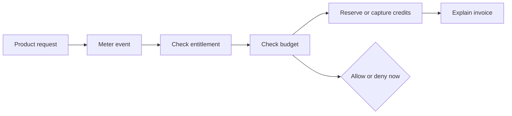

# Product

Date: 2026-06-30

This is the app-level product source of truth. Detailed brand and design rules live in
[`docs/brand`](/Users/jhonsfran/repos/unprice/docs/brand/README.md).

## Product Definition

Unprice is open-source PriceOps infrastructure for usage-based SaaS. It helps developer-led teams
meter usage, enforce entitlements, reserve credits, cap expensive workloads, and explain invoices
without hardcoding revenue logic into product code.

The wedge is spend safety: stop over-budget usage before it runs. Everything else (metering,
entitlements, credits, invoices) is the supporting money path.

Unprice is not an agent platform, tracing system, payment processor, tax engine, accounting system,
or generic pricing-page builder.

## Primary Market

The first market is developer-led AI/API SaaS teams with expensive per-request usage and hybrid
subscription plus usage/credit pricing.

Best-fit early users:

- SaaS founders and founding engineers launching usage-based pricing.
- CTOs and platform engineers who own request-path usage enforcement.
- AI/API teams that need per-customer or per-run spend caps.

Primary buyers are engineering owners: CTOs, founding engineers, and platform/product engineers who
own billing, metering, or entitlements. The economic actor in the product is the team's customer,
not the Unprice buyer.

Bad-fit early users:

- Pure seat-based SaaS with simple billing.
- Enterprises looking for full revenue recognition, tax, and accounting replacement.
- Teams that only need a pricing table.
- Buyers who need broad payment-provider portability on day one.

## Product Purpose

Pricing is not only a page or an invoice calculation. For usage-based products, pricing is a
runtime decision.

The dashboard and API work together:

- The dashboard makes plans, features, customers, subscriptions, usage, wallets, runs, invoices,
  and ingestion state understandable.
- The API makes access checks, usage reporting, synchronous consumption, budgeted runs, wallet
  balances, and analytics easy to integrate into production request paths.

Success means a founder or engineer can support new pricing models, enforce real-time spend and
access gates, and change packaging without rewriting the application money path.

## Positioning

Canonical source: [`positioning-and-messaging.md`](positioning-and-messaging.md). Keep this section
in sync with it.

Category: open-source PriceOps runtime for usage-based SaaS. PriceOps means operating pricing as
live infrastructure (metering, entitlements, budgets, credits, invoice evidence) in the request
path.

One-liner: Unprice lets developer-led SaaS teams stop over-budget usage before it runs, then meter,
gate, credit, and explain every invoice from the same runtime system.

Homepage headline: Stop runaway usage before it runs.

Homepage subheadline: Unprice is open-source PriceOps infrastructure for usage-based SaaS. Put a
real-time budget around your most expensive action, reject over-budget work in the request path, and
explain every invoice line from the same money path.

Name meaning: "Unprice" means un-hardcoding pricing — moving plan logic, counters, and limits out of
application code into one inspectable runtime — not removing price.

## Core Product Model

## Product Pillars

1. Spend safety (wedge): customers, jobs, workflows, tools, agents, and custom workloads can be
   budgeted so over-budget work is rejected before it runs, without Unprice owning the workload
   itself.
2. Runtime control: access and usage decisions happen before expensive work runs.
3. Explainable money flow: every charge, denial, replay, and wallet movement should have evidence.
4. Open PriceOps infrastructure: pricing logic should be inspectable and owned by the builder.
5. Pricing flexibility: flat, package, tiered, usage-based, and hybrid models share one mental
   model.

Note: the marketing message hierarchy in `positioning-and-messaging.md` lists a sixth item, "bring
your own payments." That is a positioning boundary (see Payments And Business Model below), not a
sixth product pillar. These five are product capabilities; payments is the boundary around them.

## Claim Boundaries

Use:

- "Open-source PriceOps infrastructure."
- "Stop over-budget usage before it runs."
- "Meter usage, enforce entitlements, reserve credits, and explain invoices."
- "Budgeted runs for agents, workflows, jobs, tools, and custom workloads."
- "Stripe-first today, provider-extensible by design."
- "Designed for request-path usage enforcement."

Avoid until proven:

- Exact latency claims such as "<100ms".
- Exact throughput claims such as "100k+ events/sec".
- Live Paddle, Lemon Squeezy, or Square integrations (the provider model is extensible by design,
  but Stripe is the only supported provider today).
- Enterprise revenue recognition, tax, or accounting replacement.
- "AI agent platform" or ownership of prompts, tools, memory, traces, or deployments.

## Payments And Business Model

Unprice owns the runtime money path (metering, entitlements, budgets, credits, invoice evidence).
The payment provider still captures payment. Stripe is the first supported provider; the provider
model is designed to extend to Paddle, Lemon Squeezy, and others without rewriting the app. This is
a deliberate boundary: bring your own payments, keep one pricing runtime.

Unprice is open-core: an AGPL-3.0 open-source core plus a Commercial License for teams that cannot
open-source their modifications or want dedicated support.

## Brand Personality

Precise, open, fast, calm, and opinionated.

The product should feel like trustworthy infrastructure: technical enough for developers, legible
enough for founders, and transparent enough for revenue-critical workflows. Favor exact language,
direct state, and obvious next actions over decorative SaaS gloss.

## UX Principles

1. Show the money path. Connect request, meter, entitlement, budget, wallet, and invoice state.
2. Keep the developer path short. API keys, SDK examples, event ingestion, entitlement checks,
   budgeted runs, and replay actions should be easy to find and hard to misread.
3. Make state explicit. Use concrete lifecycle labels instead of vague analytics language.
4. Support pricing flexibility without ambiguity. Usage features should clearly expose meter,
   limit, reset, billing, and overage behavior.
5. Prefer calm density. This is operational infrastructure; compact, consistent, token-driven UI is
   better than decorative emphasis.

## Anti-References

Avoid black-box billing-tool aesthetics, vague "growth platform" language, decorative gradients,
purple AI cliches, and dashboards that hide operational state behind glossy metrics.

Do not make the API feel secondary to the dashboard. Developer experience is part of the product
surface.

## Accessibility And Inclusion

Target WCAG AA for contrast, focus visibility, keyboard navigation, and form labeling. Respect
reduced motion. Do not rely on color alone for pricing, entitlement, success, warning, danger, or
failure states.
