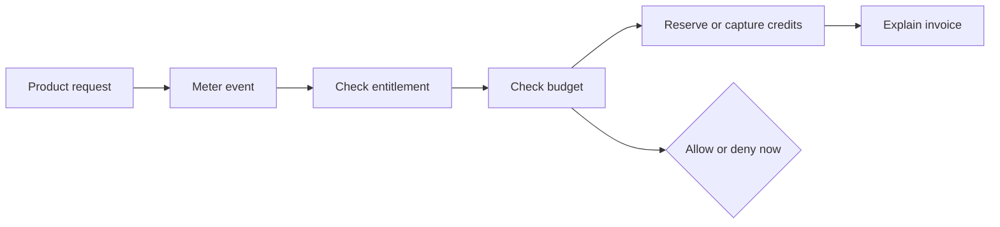

# Product

Date: 2026-06-30

This is the app-level product source of truth. Detailed brand and design rules live in
[`docs/brand`](/Users/jhonsfran/repos/unprice/docs/brand/README.md).

## Product Definition

Unprice is open-source PriceOps infrastructure for usage-based SaaS. It helps developer-led teams
meter usage, enforce entitlements, reserve credits, cap expensive workloads, and explain invoices
without hardcoding revenue logic into product code.

Unprice is not an agent platform, tracing system, payment processor, tax engine, accounting system,
or generic pricing-page builder.

## Primary Market

The first market is developer-led AI/API SaaS teams with expensive per-request usage and hybrid
subscription plus usage/credit pricing.

Best-fit early users:

- SaaS founders and founding engineers launching usage-based pricing.
- CTOs and platform engineers who own request-path usage enforcement.
- AI/API teams that need per-customer or per-run spend caps.
- Small revenue teams that need usage evidence for customer conversations.

Bad-fit early users:

- Pure seat-based SaaS with simple billing.
- Enterprises looking for full revenue recognition, tax, and accounting replacement.
- Teams that only need a pricing table.
- Buyers who need broad payment-provider portability on day one.

## Product Purpose

Pricing is not only a page or an invoice calculation. For usage-based products, pricing is a
runtime decision.

The dashboard and API work together:

- The dashboard makes plans, features, customers, subscriptions, usage, wallets, runs, invoices,
  and ingestion state understandable.
- The API makes access checks, usage reporting, synchronous consumption, budgeted runs, wallet
  balances, and analytics easy to integrate into production request paths.

Success means a founder or engineer can support new pricing models, enforce real-time spend and
access gates, and change packaging without rewriting the application money path.

## Positioning

Category: open-source PriceOps runtime for usage-based SaaS.

One-liner: Unprice lets developer-led SaaS teams meter usage, enforce spend limits, and produce
explainable invoices from the same runtime system.

Homepage headline: Runtime pricing control for usage-based SaaS.

Homepage subheadline: Meter events, enforce entitlements, reserve customer credits, cap expensive
runs, and explain every invoice line without hardcoding revenue logic into your app.

## Core Product Model

## Product Pillars

1. Runtime control: access and usage decisions happen before expensive work runs.
2. Explainable money flow: every charge, denial, replay, and wallet movement should have evidence.
3. Open PriceOps infrastructure: pricing logic should be inspectable and owned by the builder.
4. Pricing flexibility: flat, package, tiered, usage-based, and hybrid models share one mental
   model.
5. Spend safety: customers, jobs, workflows, tools, agents, and custom workloads can be budgeted
   without Unprice owning the workload itself.

## Claim Boundaries

Use:

- "Open-source PriceOps infrastructure."
- "Meter usage, enforce entitlements, reserve credits, and explain invoices."
- "Budgeted runs for agents, workflows, jobs, tools, and custom workloads."
- "Stripe-first payment-provider integration."
- "Designed for request-path usage enforcement."

Avoid until proven:

- Exact latency claims such as "<100ms".
- Exact throughput claims such as "100k+ events/sec".
- Broad provider freedom across Stripe, Paddle, Square, and others.
- Enterprise revenue recognition, tax, or accounting replacement.
- "AI agent platform" or ownership of prompts, tools, memory, traces, or deployments.

## Brand Personality

Precise, open, fast, calm, and opinionated.

The product should feel like trustworthy infrastructure: technical enough for developers, legible
enough for founders, and transparent enough for revenue-critical workflows. Favor exact language,
direct state, and obvious next actions over decorative SaaS gloss.

## UX Principles

1. Show the money path. Connect request, meter, entitlement, budget, wallet, and invoice state.
2. Keep the developer path short. API keys, SDK examples, event ingestion, entitlement checks,
   budgeted runs, and replay actions should be easy to find and hard to misread.
3. Make state explicit. Use concrete lifecycle labels instead of vague analytics language.
4. Support pricing flexibility without ambiguity. Usage features should clearly expose meter,
   limit, reset, billing, and overage behavior.
5. Prefer calm density. This is operational infrastructure; compact, consistent, token-driven UI is
   better than decorative emphasis.

## Anti-References

Avoid black-box billing-tool aesthetics, vague "growth platform" language, decorative gradients,
purple AI cliches, and dashboards that hide operational state behind glossy metrics.

Do not make the API feel secondary to the dashboard. Developer experience is part of the product
surface.

## Accessibility And Inclusion

Target WCAG AA for contrast, focus visibility, keyboard navigation, and form labeling. Respect
reduced motion. Do not rely on color alone for pricing, entitlement, success, warning, danger, or
failure states.
