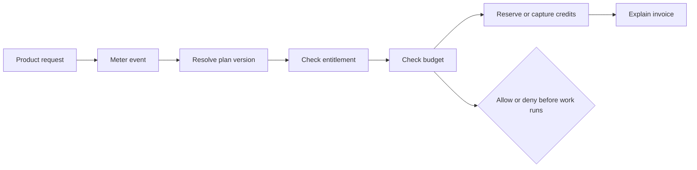

# Product

Date: 2026-07-03

Status: pre-validation refresh (July 2026 market audit). Lock after the customer interviews in
`jobs-to-be-done.md`.

This is the app-level product source of truth. Detailed brand and design rules live in
[`docs/brand`](/Users/jhonsfran/repos/unprice/docs/brand/README.md).

## Product Definition

Unprice is the open-source customer money path for usage-based SaaS. It helps developer-led teams sell
credits and usage-based plans without eating the cost when a customer overspends: authorize in the
request path, explain on the invoice, and own the money path in open source.

PriceOps is the operating model behind that promise: plan versions, subscriptions, entitlements,
meters, budgets, credits, usage evidence, and invoice evidence stay separate but connected.
Entitlements are not hardcoded into subscriptions; customers can remain on the plan version they
bought while new pricing experiments ship safely for future customers.

The wedge is customer spend authorization with invoice evidence: decide whether a customer's paid
work is allowed before cost is created, and preserve the evidence needed to explain the charge,
credit, denial, or invoice line after the fact.

Unprice is not an agent platform, tracing system, payment processor, tax engine, accounting system,
or generic pricing-page builder. Stated positively: it is the budget, wallet, and authorization
layer for products whose customers burn credits — including when an agent triggers the spend.

## Primary Market

The first market is developer-led usage-based SaaS teams with paid product actions, hybrid
subscription plus usage/credit pricing, customer-facing budgets, and a need to explain invoice
outcomes. AI/API and workflow products are the sharpest early slice because one
customer-triggered action can create real marginal cost.

Best-fit early users:

- SaaS founders and founding engineers launching usage-based pricing.
- CTOs and platform engineers who own request-path usage enforcement.
- AI/API and workflow teams that need per-customer or per-run spend caps.

Primary buyers are engineering owners: CTOs, founding engineers, and platform/product engineers who
own billing, metering, entitlements, or request-path authorization. The economic actor in the
product is the team's customer, not the Unprice buyer.

Bad-fit early users:

- Pure seat-based SaaS with simple billing.
- Enterprises looking for full revenue recognition, tax, and accounting replacement.
- Teams that only need a pricing table.
- Buyers who need broad payment-provider portability on day one.

## Product Purpose

Pricing is not only a page or an invoice calculation. For usage-based products, the customer's
commercial limit has to be checked while the request is still in flight, and the evidence has to
survive until the invoice exists.

The dashboard and API work together:

- The dashboard makes plans, plan versions, features, customers, subscriptions, entitlements, usage,
  wallets, runs, invoices, and ingestion state understandable.
- The API makes access checks, usage reporting, synchronous consumption, budgeted runs, wallet
  balances, and analytics easy to integrate into production request paths.

Success means a founder or engineer can support new pricing models, authorize customer spend in the
request path, explain invoices after the fact, and change packaging without rewriting the
application money path.

## Positioning

Canonical source: [`positioning-and-messaging.md`](strategic/positioning-and-messaging.md). Keep this section
in sync with it.

Public frame: open-source customer money path for usage-based SaaS. PriceOps is the internal
operating model: plan versions, subscriptions, entitlements, meters, budgets, credits, usage
evidence, and invoice evidence stay separate but connected.

One-liner: Unprice lets developer-led SaaS teams sell credits and usage-based plans without eating
the cost when a customer overspends: authorize in the request path, explain on the invoice, and own
the money path in open source.

Homepage headline (the h1): Sell credits and usage. Keep the margin.

Homepage subheadline: Authorize customer spend before paid work runs. Open source, for SaaS that
sells credits, API calls, or agent runs.

Slot rule (2026-07-27): the mechanism sentence leads the subheadline verbatim rather than taking the
h1. Launch traffic is link traffic, so the string in the HN title, `<title>`, and OG card has to be
recognizable above the fold — but a benefit reads as a short declarative and degrades into a negative
subordinate clause when the mechanism takes the headline slot. Keep plan versions, separated
entitlements, request-path budgets, and invoice evidence for the first scroll section, not the first
breath.

Name meaning: "Unprice" means un-hardcoding pricing — moving plan logic, counters, and limits out of
application code into one inspectable runtime — not removing price.

## Core Product Model

```mermaid
flowchart LR
  Request["Product request"] --> Meter["Meter event"]
  Meter --> Version["Resolve plan version"]
  Version --> Entitlement["Check entitlement"]
  Entitlement --> Budget["Check budget"]
  Budget --> Wallet["Reserve or capture credits"]
  Wallet --> Invoice["Explain invoice"]
  Budget --> Decision{"Allow or deny before work runs"}
```

## Product Pillars

1. Customer spend authorization (wedge): paid work is checked against entitlement, customer budget,
   wallet credits, and meter rules before expensive work runs.
2. Budgeted workloads: customers, jobs, workflows, tools, agents, and custom workloads can be
   budgeted without Unprice owning the workload itself. (Promoted in the 2026-07 refresh: credits
   are the dominant AI pricing abstraction and no vendor owns the workload-budget layer.)
3. Evidence after the fact: every allow, deny, charge, credit, replay, and invoice line should have
   an explainable trail.
4. Open, independent money-path infrastructure: pricing logic should be inspectable and owned by
   the builder — not subject to a vendor's acquisition or sunset.
5. Versioned pricing model: plans and entitlements stay separated so existing customers can remain
   on a plan version while new pricing experiments ship.
6. Pricing flexibility: flat, package, tiered, usage-based, credit-based, and hybrid models share one
   mental model.

Note: the marketing message hierarchy in `positioning-and-messaging.md` also includes "bring your
own payments." That is a positioning boundary (see Payments And Business Model below), not a product
pillar. These six are product capabilities; payments is the boundary around them.

## Claim Boundaries

Use:

- "Open-source money path for usage-based SaaS."
- "Authorize customer spend before paid work runs."
- "Explain every allow, deny, charge, credit, and invoice line from one money path."
- "Meter usage, enforce entitlements, reserve credits, budget workloads, and explain invoices."
- "Budgeted runs for agents, workflows, jobs, tools, and custom workloads."
- "Plan versions keep customers on the pricing they bought while new pricing experiments ship."
- "Stripe-first today, provider-extensible by design."
- "Designed for request-path usage enforcement."
- "Wallet credits ride a double-entry ledger."
- "The money path is yours to read, fork, and run in your own Cloudflare account — it cannot be
  acquired out from under you."

Avoid until proven:

- Exact latency claims such as "<100ms".
- Exact throughput claims such as "100k+ events/sec".
- Live Paddle, Lemon Squeezy, or Square integrations (the provider model is extensible by design,
  but Stripe is the only supported provider today).
- Enterprise revenue recognition, tax, or accounting replacement.
- "AI agent platform" or ownership of prompts, tools, memory, traces, or deployments.
- Infrastructure-agnostic self-hosting (VPS, docker-compose, Kubernetes) — the runtime deploys to
  the buyer's own Cloudflare account today (Workers, Durable Objects, Queues, Pipelines) and uses
  Tinybird for usage analytics.

## Payments And Business Model

Unprice owns the customer money path (plan versions, entitlements, metering, budgets, wallet
credits, usage evidence, invoice evidence). The payment provider still captures payment. Stripe is
the first supported provider; the provider model is designed to extend without rewriting the app.
This is a deliberate boundary: bring your own payments, keep one money path.

Unprice is open-core: an AGPL-3.0 open-source core plus a Commercial License for teams that cannot
open-source their modifications or want dedicated support.

Hosting boundary: the runtime deploys to the buyer's own Cloudflare account (Workers, Durable
Objects, Queues, Pipelines); usage analytics run on Tinybird. Say "run it in your own Cloudflare
account," not unqualified "self-host," until a portable runtime ships.

## Brand Personality

Precise, open, fast, calm, and opinionated.

The product should feel like trustworthy infrastructure: technical enough for developers, legible
enough for founders, and transparent enough for revenue-critical workflows. Favor exact language,
direct state, and obvious next actions over decorative SaaS gloss.

## UX Principles

1. Show the customer money path. Connect request, meter, entitlement, budget, wallet, plan version, and
   invoice state.
2. Keep the developer path short. API keys, SDK examples, event ingestion, entitlement checks,
   budgeted runs, and replay actions should be easy to find and hard to misread.
3. Make state explicit. Use concrete lifecycle labels instead of vague analytics language.
4. Support pricing flexibility without ambiguity. Usage features should clearly expose meter,
   limit, reset, billing, and overage behavior.
5. Prefer calm density. This is operational infrastructure; compact, consistent, token-driven UI is
   better than decorative emphasis.

## Anti-References

Avoid black-box billing-tool aesthetics, vague "growth platform" language, decorative gradients,
purple AI cliches, and dashboards that hide operational state behind glossy metrics.

Do not make the API feel secondary to the dashboard. Developer experience is part of the product
surface.

## Accessibility And Inclusion

Target WCAG AA for contrast, focus visibility, keyboard navigation, and form labeling. Respect
reduced motion. Do not rely on color alone for pricing, entitlement, success, warning, danger, or
failure states.
