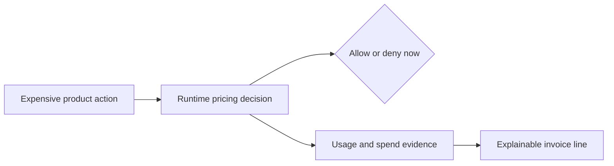

# Brand Narrative

Date: 2026-06-30

This document defines the core Unprice story for developer-led AI/API SaaS founders and founding
engineers. The primary action it should drive is product trial and SDK integration.

## Narrative Intent

Unprice should make a technical founder think:

> I know the expensive action in my product, and I can put pricing control in that request path
> today.

The builder — the developer-led team — is the hero. Unprice is the tool that helps them meter, gate,
budget, reserve, and explain usage without scattering revenue logic through product code.

Terminology: "builder"/"team"/"you" is the Unprice buyer; "customer"/"account" is the buyer's
economic actor that holds budgets, wallets, and invoices.

## Core Story

A customer is about to trigger the most expensive action in your product.

Your app needs to know, right now:

- Is this customer entitled to the feature?
- Is this request inside their budget?
- Should credits be reserved or captured?
- If this becomes an invoice line, can you explain it later?

That is the shift: for usage-based SaaS, pricing is no longer just a page, a plan table, or an
invoice calculation. Pricing is a runtime decision.

Unprice gives developer-led teams an open-source PriceOps runtime for that decision. It connects
meter events, entitlement checks, budgeted runs, wallet credits, ingestion state, and invoice
evidence in one inspectable money path.

## The Five-Second Moment

The realization:

> The expensive work should not run until pricing has made a decision.

Everything else in the story should create context for that moment.

## Rallying Cry

Put a budget around the expensive action.

This is the most repeatable buyer mission. It is concrete, technical, and action-oriented. It also
keeps Unprice out of vague billing-platform language.

## Narrative Model

## Story Spine

Once, pricing lived mostly in plan pages, checkout flows, and invoices.

Every day, developer-led SaaS teams shipped usage-based products with Stripe, custom usage tables,
database counters, Redis limits, cron reconciliation, and hardcoded plan logic.

One day, usage became expensive enough that a customer, job, workflow, tool, or agent could cross a
budget before anyone reached the invoice.

Because of that, teams needed pricing to make decisions while requests were still flowing.

Because of that, the money path had to connect usage, entitlements, budgets, credits, denials,
replays, and invoices.

Until finally, pricing became runtime infrastructure.

Ever since then, teams building usage-based products do not only calculate invoices after usage
happens. They decide whether expensive usage should happen in the first place.

## Long-Form Narrative

A customer clicks the button that runs the expensive part of your product. It might call an LLM,
process a data job, hit a costly API, start an automation, or run a workflow for several minutes.

At that moment, billing is already too late.

If the request should have been blocked, the cost is already created. If the customer later disputes
the invoice, engineering has to reconstruct the path from product event to usage counter to billing
line by hand. If the team wants to change packaging, plan logic is spread across the application,
billing scripts, counters, and support workflows.

This is the real pricing problem for usage-based AI/API SaaS: the product needs a money decision
while the request is still in flight.

Unprice is open-source PriceOps infrastructure for that request path. Your app can check access,
consume usage, start and consume budgeted runs, reserve wallet credits, and keep evidence for the
invoice that comes later. The dashboard makes the state visible. The API and SDK make the decision
easy to place inside the product.

The product still owns the customer experience. Your payment provider still captures payment: Stripe
today, with a provider model designed to extend to Paddle, Lemon Squeezy, and others. Unprice
connects the runtime money path between product usage and invoice evidence.

The result is simple: when the expensive action is about to run, your app can ask Unprice whether it
should happen now, under which budget, against which credits, and with what evidence.

## Short Pitch

Unprice is open-source PriceOps infrastructure for usage-based SaaS.

It helps developer-led AI/API teams put pricing control in the request path: cap expensive runs and
reject over-budget work before it runs, then meter usage, enforce entitlements, reserve credits, and
explain invoice lines from the same usage trail.

## Thirty-Second Version

Usage-based pricing breaks when pricing only happens on a page or at invoice time. By then, the
expensive work already ran.

Unprice puts pricing control in the request path. Your app can check access, consume usage, enforce
budgets, reserve credits, and preserve invoice evidence before expensive usage becomes margin
damage.

## Homepage Narrative

Headline:

Stop runaway usage before it runs.

Subheadline:

Unprice is open-source PriceOps infrastructure for usage-based SaaS. Put a real-time budget around
your most expensive action, reject over-budget work in the request path, and explain every invoice
line from the same money path.

Supporting story:

Pick the expensive action in your product. Unprice helps you put a customer budget around it, reject
over-budget calls before they cost you money, and keep the usage evidence needed to explain the
invoice later.

Primary CTA:

Put Unprice in the request path.

Secondary CTA:

Explore the SDK.

## Demo Script

Open with the buyer's product, not Unprice:

> Show me the expensive action in your product.

Then demonstrate:

1. Create or identify the usage feature and meter.
2. Call `access.check` before the action runs.
3. Call `usage.consume` or `runs.start` / `runs.consume` for usage that should affect spend.
4. Show an over-budget or wallet-empty denial before the expensive work runs.
5. Show the usage, wallet, run, ingestion, and invoice evidence in the dashboard.

The demo should end with:

> The same event trail that protects margin in the request path also explains the invoice later.

## Repeatable Lines

- Pricing is not a page. Pricing is a runtime decision.
- Put a budget around the expensive action.
- Stop expensive usage before it becomes margin damage.
- The request path is the new pricing surface.
- Usage, credits, budgets, and invoices should share one evidence trail.
- Revenue logic should be inspectable when it allows, denies, charges, credits, or replays customer
  activity.

## Proof Points

Use proof that exists in the product and docs:

- SDK/API methods for `access.check`, `usage.record`, `usage.consume`, `runs.start`,
  `runs.consume`, `runs.end`, `runs.get`, wallet balances, analytics, and ingestion replay.
- Usage features with event-native meter configuration.
- Wallet credits that are distinct from entitlement grants.
- Budgeted runs for agents, workflows, jobs, tools, and custom workloads.
- Invoice explanation that connects charges back to rated usage events and ledger captures.
- Open-source infrastructure with explicit contracts for pricing-critical behavior.

## Guardrails

Do:

- Lead with the wedge: put a budget around the expensive action and reject over-budget work before
  it runs.
- Start with the expensive product action.
- Make the founder or engineer (the builder) the hero.
- Show the path from request to meter to entitlement to budget to wallet to invoice evidence.
- Emphasize open-source inspectability and clear failure paths.
- Use calm urgency: name the cost-before-invoice risk with mechanism, not fear adjectives.
- Drive toward SDK integration.

Do not:

- Start with "we are a billing platform."
- Present Unprice as a Stripe replacement.
- Claim live multi-provider payments. "Stripe-first today, provider-extensible by design" is fine;
  live Paddle/Lemon Squeezy/Square integrations are not, until they ship.
- Claim tax, accounting, or enterprise revenue recognition coverage.
- Use exact latency or throughput claims without benchmarks.
- Present Unprice as an AI agent platform.
- Hide the product behind vague words like growth, effortless, magical, or all-in-one.

## Copy Test

Before publishing copy, ask:

- Does the first screen show an expensive action or request-path decision?
- Does the reader know what to integrate first?
- Does the story make pricing feel urgent before invoice time?
- Does it connect runtime control to later invoice evidence?
- Does every claim have product evidence?
