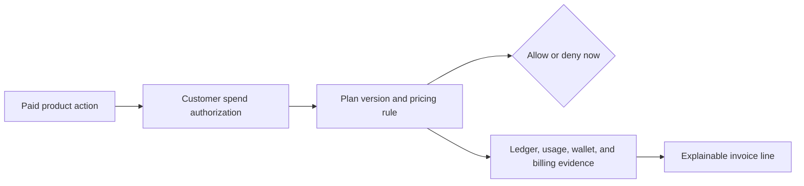

# Brand Narrative

Date: 2026-07-06

Status: pre-validation refresh (July 2026 market audit). Lock after the customer interviews in
`jobs-to-be-done.md`.

This document defines the core Unprice story for founders and engineers building AI products that
sell credits, agent runs, or paid workflows. The primary action is SDK integration.

## Narrative Intent

Unprice should make a technical founder think:

> I know which agent run spends customer credits. I can authorize it before it creates cost and
> trace the settled usage to the invoice, starting with one action in one afternoon.

The builder — the developer-led team — is the hero. Unprice is the tool that helps them version,
meter, authorize, budget, reserve, rate, invoice, and explain pricing without scattering revenue
logic through product code.

Terminology: "builder"/"team"/"you" is the Unprice buyer; "customer"/"account" is the buyer's
economic actor that holds budgets, wallets, and invoices.

## Core Story

A customer is about to trigger an agent run or paid workflow.

Maybe it is an LLM call, a tool loop, a data job, or a multi-step workflow. The work is about to
happen now. The invoice that explains it may not exist for weeks.
If the decision is wrong, the team does not find out in a dashboard. They find out when the margin is
gone, support is asking for an explanation, and an engineer has to stop building product to defend a
charge.

Your app needs to know, right now:

- Is this customer entitled to the feature?
- Which plan version and pricing rule apply?
- Is this request inside their budget?
- Should credits be reserved or captured?
- If this becomes an invoice line, what evidence will prove why?

That is the shift for AI products: every charge starts with an authorization. The product must
decide before the run, then keep the decision through settlement and invoicing.

Unprice gives developer-led teams an open-source customer money path for that decision. It connects
plan versions, feature pricing, meter events, entitlement checks, customer budgets, budgeted runs,
wallet credits, ledger captures, ingestion state, and invoice evidence in one inspectable path.

## The five-second moment

The realization:

> An agent should not spend customer credits until the commercial decision is made. Every invoice
> line should trace to that authorization.

The sharper version for selling:

> The invoice is too late. The work already ran.

Everything else in the story should create context for that moment.

## Rallying cry

Every AI charge starts with an authorization.

This is the most repeatable buyer mission. It is concrete, technical, and action-oriented. It also
keeps Unprice out of vague billing-platform and gateway language.

For broader selling copy, the fuller promise is:

> Pick the paid action in your product that can burn a customer's credits, budget, or usage
> allowance. Unprice puts customer spend authorization and evidence around it: authorize it before it
> runs, budget it when it can overspend, and prove every invoice line after it bills. Start with one
> action in one afternoon.

## Narrative Model

```mermaid
flowchart LR
  Action["Paid product action"] --> Check["Customer spend authorization"]
  Check --> Rule["Plan version and pricing rule"]
  Rule --> Allowed{"Allow or deny now"}
  Rule --> Evidence["Ledger, usage, wallet, and billing evidence"]
  Evidence --> Invoice["Explainable invoice line"]
```

## Story Spine

Once, pricing lived mostly in plan pages, checkout flows, and invoices.

Every day, developer-led SaaS teams shipped usage-based products with Stripe, custom usage tables,
database counters, Redis limits, cron reconciliation, and hardcoded plan logic.

One day, the paid action became expensive enough that a customer, job, workflow, tool, or agent could
cross a budget before anyone reached the invoice.

Because of that, teams needed pricing to make decisions while requests were still flowing, before the
cost was created and before the customer asked why they were charged.

Because of that, the money path had to connect plan versions, feature pricing, usage, entitlements,
budgets, credits, denials, ledger captures, replays, and invoices.

Until finally, pricing became runtime infrastructure.

Ever since then, teams building usage-based and hybrid products do not only calculate invoices after
work happens. They decide whether paid work should happen in the first place, and they keep the proof
for every invoice line that follows.

## Long-Form Narrative

A customer clicks the button that runs the expensive part of your product. It might call an LLM,
process a data job, hit a costly API, start an automation, unlock a package, or move through a usage
tier.

At that moment, billing is already too late.

If the request should have been blocked, the cost is already created. If the customer later disputes
the invoice, engineering has to reconstruct the path from product event to usage counter to billing
line by hand. The customer waits. Support has no satisfying answer. A founder or senior engineer
opens logs instead of shipping the next feature.

That is the quiet tax of DIY pricing: not only lost margin, but lost confidence. The team starts to
fear its own pricing system. A packaging change feels risky. A usage limit feels brittle. An invoice
question feels like a forensic project. The product can keep moving fast, but the money path becomes
the part everyone avoids touching.

This is the real pricing problem for usage-based and hybrid SaaS: the product needs a money decision
while the request is still in flight, and a money explanation after the invoice exists.

Unprice is the open-source customer money path for that flow. Your app can check access,
consume usage, start and consume budgeted runs, reserve wallet credits, pin customers to plan
versions, apply flat, tiered, package, and usage pricing, and keep evidence for the invoice that
comes later. The dashboard makes the state visible. The API and SDK make the decision easy to place
inside the product.

The product still owns the customer experience. Your payment provider still captures payment: Stripe
today, with a provider model designed to extend to Paddle, Lemon Squeezy, and others. Unprice
connects the runtime money path between product usage, pricing rules, ledger movement, and invoice
evidence.

The result is simple: when the paid action is about to run, your app can ask Unprice whether it
should happen now, under which entitlement, plan version, budget, and credits — and with what
evidence if it becomes an invoice line.

And it does not require a leap of faith. The first proof is small: one paid action, one afternoon,
one shadow check beside the code you already trust, one Sandbox path that shows the invoice evidence
before real money moves.

## Short pitch

Unprice is open-source billing for AI credits and agent usage.

It helps AI products authorize each agent run or paid workflow before it creates cost, reserve
customer credits up front, and trace settled usage to the invoice. Start with one paid action in one
afternoon.

## Thirty-second version

AI billing breaks when the first commercial decision happens at invoice time. By then, the agent
already ran, the cost is real, and the explanation is scattered across counters, logs, and billing
records.

Unprice puts customer spend authorization in the request path. Your app can check access, consume
usage, enforce customer budgets, reserve credits, and preserve invoice evidence before paid usage
becomes margin damage or a support dispute — and before the invoice becomes a forensic project.

The first integration is deliberately small: create one plan, install the SDK, run one action in
shadow, and prove it on Sandbox.

## Homepage narrative

Headline:

Sell AI credits and usage. Keep the margin.

Subheadline:

Authorize every agent run and paid workflow before it creates cost. Reserve customer credits up
front, then trace the decision through usage and the invoice.

Supporting story:

Pick the paid action in your product that can burn a customer's credits, budget, or usage allowance.
Unprice helps you authorize it before it runs, budget it when it can overspend, and prove every
invoice line after it bills. Start with one action in one afternoon, in shadow, before you enforce
anything.

Primary CTA:

Start with one paid action.

Secondary CTA:

Watch the workflow demo.

## Demo Script

Open with the buyer's product, not Unprice:

> Show me the paid action in your product that creates cost or invoice confusion.

Then demonstrate the one-afternoon workflow-app proof:

1. Identify one workflow action that creates cost or invoice confusion.
2. Create or identify the plan version, feature, pricing rule, and meter when usage-based.
3. Install the SDK and provision or map one customer.
4. Call `access.check` beside the current product logic as a shadow decision.
5. Run the workflow and show what Unprice would allow, deny, budget, or reserve.
6. Simulate the same path on Sandbox.
7. Show the usage, wallet, run, plan version, pricing rule, ledger, ingestion, and invoice evidence
   in the dashboard.

The demo should end with:

> One paid action. One afternoon. The same money path that protects margin in the request path also
> explains the invoice later.

## Repeatable Lines

- Pricing is not a page. Pricing is a runtime decision and an evidence trail.
- Sell AI credits and usage. Keep the margin.
- Every AI charge starts with an authorization.
- Reserve customer credits before the agent runs, then settle actual usage.
- Trace each invoice line to the decision that allowed the work.
- Authorize customer spend before paid work runs.
- Prove every invoice line after it bills.
- One paid action in one afternoon.
- Put a budget and evidence trail around the expensive action.
- Stop over-budget customer work before it becomes margin damage.
- The invoice is too late to be the first commercial decision.
- The invoice is too late. The work already ran.
- The request path is the new pricing surface.
- Usage, pricing rules, credits, customer budgets, ledger captures, and invoices should share one evidence
  trail.
- Entitlements should not be trapped inside subscriptions.
- Revenue logic should be inspectable when it allows, denies, charges, credits, or replays customer
  activity.
- AI gateways cap provider spend; Unprice governs customer spend and invoice evidence.
- Your customers' agents can burn a month of credits in an afternoon. Budget the run before it
  starts.
- The billing layer you rent can be acquired. The money path you own cannot. (Consolidation angle;
  verify dated market facts before external use.)
- Read the code that guards your money — or have your agent read it.
- Both gates say no. Only a ledger proves why.
- Counters gate. Ledgers testify.
- A balance that syncs to the database is a counter. A ledger is the database.
- An invoice line should be a ledger projection, not a description pushed to your payment
  provider.

## Proof Points

Use proof that exists in the product and docs:

- SDK/API methods for `access.check`, `usage.record`, `usage.consume`, `runs.start`,
  `runs.consume`, `runs.end`, `runs.get`, wallet balances, analytics, and ingestion replay.
- Plan versions that keep existing customers on the pricing they bought while new pricing
  experiments ship.
- Flat, tiered, package, and usage feature pricing, with event-native meter configuration for usage
  features.
- Wallet credits that are distinct from entitlement grants.
- Budgeted runs for agents, workflows, jobs, tools, and custom workloads.
- Invoice explanation that connects lines back to plan versions, billing periods, pricing rules,
  rated usage events when present, wallet movement, and ledger captures.
- Open-source infrastructure with explicit contracts for pricing-critical behavior.

## Guardrails

Do:

- Lead with the wedge: sell AI credits and usage without paying for unfunded agent work.
- Explain the mechanism: authorize the run before cost, then trace the decision to the invoice.
- Start with the paid product action, then narrow to the expensive action when selling the first
  integration.
- Make the founder or engineer (the builder) the hero.
- Show the path from request to plan version to pricing rule to meter to entitlement to budget to
  wallet to ledger to invoice evidence when the plan version affects the decision.
- Emphasize open-source inspectability and clear failure paths.
- Use calm urgency: name the cost-before-invoice risk with mechanism, not fear adjectives.
- Drive toward SDK integration.

Do not:

- Start with "we are a billing platform."
- Present Unprice as a Stripe replacement.
- Claim live multi-provider payments. "Stripe-first today, provider-extensible by design" is fine;
  live Paddle/Lemon Squeezy/Square integrations are not, until they ship.
- Claim tax, accounting, or enterprise revenue recognition coverage.
- Use exact latency or throughput claims without benchmarks.
- Present Unprice as an AI agent platform.
- Hide the product behind vague words like growth, effortless, magical, or all-in-one.
- Claim a competitor lacks request-path checks, credit reservation, spend limits, or plan pinning
  without a dated code audit. Autumn has all four (2026-07-06 audit); contrast on the ledger,
  stored invoice explanation, processor independence, and workload budgets instead — see the
  discipline note in `brand-identity.md`.

## Copy Test

Before publishing copy, ask:

- Does the first screen show a paid action, request-path decision, or invoice explanation?
- Does the reader know what to integrate first?
- Does the story make pricing feel urgent before invoice time?
- Does it connect customer spend authorization to later invoice evidence?
- Does it make clear that invoice evidence covers usage and non-usage pricing lines?
- Does every claim have product evidence?
