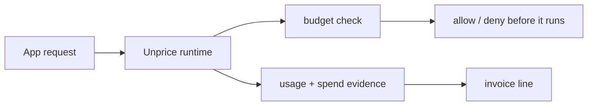

# Design System Guidelines

Date: 2026-06-30

## Design Objective

Unprice should feel like trustworthy operational infrastructure for money-adjacent workflows. The
interface should help engineers and founders understand current state, make pricing decisions, and
recover from failures quickly.

The product should not feel like a marketing dashboard that hides complexity. Pricing, entitlement,
budget, wallet, and invoice details are the product.

## Design Principles

1. Show the money path.
   Every important flow should make the path from request to meter to entitlement to budget to
   wallet to invoice visible.

2. Prefer calm density.
   Use compact tables, clear rows, status chips, and concise metrics. Avoid oversized cards for
   operational data.

3. Make state explicit.
   Use direct labels such as `processed`, `rejected`, `running`, `budget_exceeded`, `reserved`,
   `consumed`, `draft`, `finalized`, and `paid`.

4. Keep developer actions close.
   API keys, SDK snippets, event slugs, feature slugs, idempotency keys, replay actions, and error
   recovery should be easy to find near the state they affect.

5. Use visual emphasis only when it changes a decision.
   Color, motion, and hierarchy should explain state or next action, not decorate.

## Layout

- Use full-width dashboard sections with constrained inner content.
- Use cards for repeated items, metrics, modals, and framed tools.
- Do not put cards inside cards.
- Keep card radius at 8px or less unless the existing UI package requires otherwise.
- Use stable dimensions for tables, status chips, counters, toolbars, and icon buttons so loading,
  hover, and dynamic text do not shift layout.
- Prefer tabbed workflows for customer detail areas: overview, subscriptions, wallet, invoices,
  runs, events.
- Use diagrams for complex concepts in docs and onboarding. Product UI should prefer actual state
  over explanatory diagrams.

## Color

Use color semantically and sparingly.

- Neutral base: surfaces, borders, text, and dense tables.
- Amber (`primary`): brand and primary actions. Not a status color.
- Blue: live request path, selected technical context, developer actions.
- Green: accepted, processed, paid, healthy, available.
- Orange: near-limit, pending, delayed, warning, retryable.
- Red: denied, rejected, failed, budget exceeded, destructive.
- Muted gray: inactive, empty, archived, historical.

Avoid:

- Purple-dominant AI gradients.
- Decorative blobs or bokeh.
- One-note monochrome color systems.
- Using color as the only status indicator.

Every status color needs a text label or icon.

## Typography

- Use crisp sans-serif text for product UI and docs.
- Use monospace only for event slugs, feature slugs, IDs, run IDs, ledger facts, API paths, and
  code.
- Keep headings proportional to their container. Avoid hero-scale text inside dashboards, sheets,
  cards, and sidebars.
- Do not scale font size with viewport width.
- Letter spacing should be normal except for tiny uppercase labels already established in the UI.

## Component Vocabulary

Use:

- Status badges for lifecycle state.
- Metric rows for usage, budget, wallet, and invoice totals.
- Timeline or event rows for ingestion and run activity.
- Tables for customer, invoice, event, wallet-credit, and run lists.
- Sheets for explainability, charge details, event details, and drilldowns.
- Segmented controls or tabs for switching operational views.
- Icon buttons with tooltips for replay, inspect, copy, refresh, explain, download, and open.
- Progress bars only for limits, budgets, wallet runway, or ingestion freshness.

Avoid:

- Marketing cards for operational state.
- Decorative illustrations inside dashboards.
- Vague labels like "Insights", "Growth", or "Performance" when the state is actually usage,
  spend, rejections, replay, or invoice evidence.

## Product Area Rules

### Dashboard Overview

Lead with operational health: ingestion status, usage evidence, spend, and failures. Do not lead
with vanity analytics.

### Plans And Features

Show the relationship between feature, feature type, meter, limit, billing cadence, reset cadence,
and overage behavior. Usage features should make meter configuration unavoidable and legible.

### Events And Ingestion

Show processed, rejected, failed, and replayable states. Failed events need a clear recovery action
and a reason.

### Customers

Treat the customer as the economic actor. Show subscriptions, entitlements, wallet balances,
invoices, and runs as connected state, not separate product silos.

### Wallet And Credits

Always distinguish purchased, granted, reserved, and consumed balances. Credits should show source,
expiry, remaining amount, and consumption.

### Budgeted Runs

Show budget, consumed, remaining, status, workload type, workload ID, trace ID, and timestamps. Do
not imply Unprice owns the workload. It only labels and controls spend.

### Invoices

Every charge should have an explain action when evidence exists. Explain views should show pricing
rule, usage quantity, rated facts, ledger captures, and event evidence.

## Empty, Loading, And Error States

- Empty states should say what will appear and what action creates it.
- Loading states should preserve table/card dimensions.
- Error states should include the failing operation and recovery path when possible.
- Rejections are not always errors. Distinguish business denials from system failures.

## Motion

Use motion only for state change, freshness, progress, or request-path education.

Good:

- Subtle loading indicators.
- Freshness pulse on recently updated metrics.
- Short request-path animation in a marketing hero.

Bad:

- Decorative looping background motion.
- Animated gradients.
- Motion that makes operational state harder to scan.

Respect reduced motion.

## Marketing Pages

The first viewport should show product truth, not abstract category art.

Signature visual: the money path is Unprice's one ownable visual idea. Render request -> meter ->
entitlement -> budget -> wallet -> invoice as a literal, inspectable flow, with the budget
allow/deny decision as the hero moment. Reuse it across hero, docs, empty states, and explainers so
the brand is recognizable by its legibility of state, not by decoration.

Implemented as a reusable component:
[`apps/nextjs/src/components/landing/money-path.tsx`](/Users/jhonsfran/repos/unprice/apps/nextjs/src/components/landing/money-path.tsx)
(`MoneyPath`), currently rendered in the "Built for the request path" section. It is static and
token-driven (no decorative motion) and renders the allow/deny decision as two outcome states. Reuse
this component rather than re-drawing the path; extend it for docs and empty states.

Recommended hero concept:

Recommended hero copy:

- Headline: Stop runaway usage before it runs.
- Subheadline: Open-source PriceOps infrastructure for usage-based SaaS. Put a real-time budget
  around your most expensive action, reject over-budget work in the request path, and explain every
  invoice line from the same money path.

Hero copy should make the brand/product explicit. Prefer product screenshots, generated product
scenes, or request-path visuals over generic SaaS illustrations.

## Accessibility

- Target WCAG AA contrast.
- Keep focus states visible.
- Do not rely on color alone for status.
- Ensure table actions have accessible labels and tooltips.
- Keep text inside buttons, badges, and cards from wrapping awkwardly or clipping.
- Preserve keyboard access for filters, tabs, command menus, sheets, and dialogs.

## Design Review Checklist

- Does the screen show the current state and the next useful action?
- Can a developer identify the relevant ID, slug, or API call?
- Can an operator tell whether a denial is expected business logic or a system failure?
- Is money displayed with the correct currency and precision?
- Are wallet credits, entitlement grants, and usage quantities visually distinct?
- Are claims and labels code-backed?
- Does the UI stay dense and scannable on mobile and desktop?
