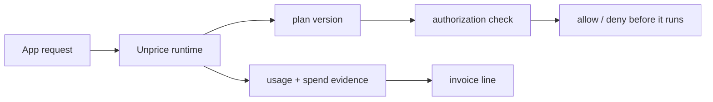

# Design System Guidelines

Date: 2026-07-09

## Design Objective

Unprice should feel like trustworthy operational infrastructure for money-adjacent workflows. The
interface should help engineers and founders understand current state, authorize customer spend,
explain invoice outcomes, and recover from failures quickly.

The product should not feel like a marketing dashboard that hides complexity. Pricing, entitlement,
budget, wallet, and invoice details are the product.

## Design Principles

1. Show the money path.
   Every important flow should make the path from request to plan version to meter to entitlement to
   budget to wallet to invoice visible.

2. Prefer calm density.
   Use compact tables, clear rows, status chips, and concise metrics. Avoid oversized cards for
   operational data.

3. Make state explicit.
   Use direct labels such as `processed`, `rejected`, `running`, `budget_exceeded`, `reserved`,
   `consumed`, `draft`, `finalized`, and `paid`.

4. Keep developer actions close.
   API keys, SDK snippets, event slugs, feature slugs, plan version IDs, idempotency keys, replay
   actions, and error recovery should be easy to find near the state they affect.

5. Use visual emphasis only when it changes a decision.
   Color, motion, and hierarchy should explain state or next action, not decorate.

## Elevation

The surface model (2026-07-08): the page is a desk, panels are receipts lying on it. Tokens and
per-mode values live in `design-tokens.md` ("Elevation & Material Tokens"); the rules:

- Three tiers only: `surface-page` < `surface-panel` < `surface-raised`. Grounds use page, cards
  and stage panels use panel, artifacts-on-a-panel (tickets, invoice lines) use raised.
- Never place a `bgSubtle` surface directly on the page — in light mode they are the same color
  and the panel disappears. `bgSubtle`/`bg` are for wells *inside* a panel.
- Light mode: panels get tight contact shadows (`shadow-ambient`; `shadow-raised` only for the
  signature panels — money path, pricing stage, system-map center). Receipts lie flat; nothing
  floats.
- Dark mode: no drop shadows. Lifted = lighter surface + 1px lit top edge (built into the shadow
  tokens) + translucent white hairlines. Never port a light shadow value to dark.
- Chrome sits above ground: the dashboard sidebar/header stay on the body surface while the
  content well drops to `surface-page`.

## Layout

- Use full-width dashboard sections with constrained inner content.
- Use cards for repeated items, metrics, modals, and framed tools.
- Do not put cards inside cards.
- Keep card radius at 8px or less unless the existing UI package requires otherwise.
- Use stable dimensions for tables, status chips, counters, toolbars, and icon buttons so loading,
  hover, and dynamic text do not shift layout.
- Prefer tabbed workflows for customer detail areas: overview, subscriptions, wallet, invoices,
  runs, events.
- Use diagrams for complex concepts in docs and onboarding. Product UI should prefer actual state
  over explanatory diagrams.

## Color

Use color semantically and sparingly.

- Neutral base: surfaces, borders, text, and dense tables.
- Amber (`primary`): brand and primary actions. Not a status color.
- **One solid amber per viewport** (2026-07-08). The solid primary button is the page-scale logo
  dot; when a hero or panel owns it, sibling CTAs demote to outline/ghost. Two solid ambers in one
  viewport means one of them is wrong.
- Blue: live request path, selected technical context, developer actions.
- Green: accepted, processed, paid, healthy, available.
- Orange: near-limit, pending, delayed, warning, retryable.
- Red: denied, rejected, failed, budget exceeded, destructive.
- Muted gray: inactive, empty, archived, historical.

Avoid:

- Purple-dominant AI gradients.
- Decorative blobs or bokeh.
- One-note monochrome color systems.
- Using color as the only status indicator.

Every status color needs a text label or icon.

## Typography

- Use crisp sans-serif text for product UI and docs.
- **Mono is where the facts live — in both directions.** Monospace for event slugs, feature
  slugs, IDs, run IDs, plan versions, amounts, timestamps, status codes, ledger facts, API paths,
  and code. And the inverse: a fact rendered in sans is a bug, and a full sentence or paragraph
  rendered in mono is a bug (mono states facts; it does not narrate).
- Marketing display type uses the `text-display-1/2/3` tokens (`design-tokens.md`): bigger means
  **lighter** (weight 540–560), never heavier. `font-extrabold` display headings are banned.
  Two-tone emphasis (muted setup clause → ink operative clause) is the sanctioned way to make a
  headline carry; one split per headline.
- Keep headings proportional to their container. Avoid hero-scale text inside dashboards, sheets,
  cards, and sidebars — dashboards never use the display tokens.
- Do not scale font size with viewport width outside the display tokens (they clamp internally).
- Letter spacing should be normal except for tiny uppercase labels already established in the UI.

## Component Vocabulary

Use:

- Status badges for lifecycle state.
- Metric rows for usage, budget, wallet, and invoice totals.
- Timeline or event rows for ingestion and run activity.
- Tables for customer, invoice, event, wallet-credit, and run lists.
- Sheets for explainability, charge details, event details, and drilldowns.
- Segmented controls or tabs for switching operational views.
- Icon buttons with tooltips for replay, inspect, copy, refresh, explain, download, and open.
- Progress bars only for limits, budgets, wallet runway, or ingestion freshness.

Avoid:

- Marketing cards for operational state.
- Decorative illustrations inside dashboards.
- Vague labels like "Insights", "Growth", or "Performance" when the state is actually usage,
  spend, rejections, replay, or invoice evidence.

## Product Area Rules

### Dashboard Overview

Lead with operational health: ingestion status, usage evidence, spend, and failures. Do not lead
with vanity analytics.

### Plans And Features

Show the relationship between plan version, feature, feature type, meter, entitlement, limit,
billing cadence, reset cadence, and overage behavior. Usage features should make meter configuration
unavoidable and legible.

### Events And Ingestion

Show processed, rejected, failed, and replayable states. Failed events need a clear recovery action
and a reason.

### Customers

Treat the customer as the economic actor. Show subscriptions, plan versions, entitlements, wallet
balances, invoices, and runs as connected state, not separate product silos.

### Wallet And Credits

Always distinguish purchased, granted, reserved, and consumed balances. Credits should show source,
expiry, remaining amount, and consumption.

### Budgeted Runs

Show budget, consumed, remaining, status, workload type, workload ID, trace ID, and timestamps. Do
not imply Unprice owns the workload. It only labels and controls spend.

### Invoices

Every charge should have an explain action when evidence exists. Explain views should show plan
version, pricing rule, usage quantity, rated facts, ledger captures, and event evidence.

## Empty, Loading, And Error States

- Empty states should say what will appear and what action creates it.
- Loading states should preserve table/card dimensions.
- Error states should include the failing operation and recovery path when possible.
- Rejections are not always errors. Distinguish business denials from system failures.
- **Zero-state compression.** A metric band whose every tile reads zero collapses to one quiet
  line ("No events in this window. Health tiles appear once traffic arrives."). Five tiles saying
  "0" five ways is noise, not evidence. Filter facets with nothing to pick and nothing picked
  disappear; keep one anchor group.
- Empty-state code CTAs are outline buttons, one per state. When an action has sync/async or
  method variants, offer one CTA and let the sheet expose the variants — an implementation fork
  is not the user's first decision.

## Dashboard Patterns

These rules came out of the July 2026 dashboard audit and fix pass. They are binding for new
dashboard surfaces.

### Table Grammar

- Chips mean lifecycle state and nothing else. A column where every row shows the same chip
  (`USD`, `UTC`, `active` on every customer) carries zero signal — render it as plain mono text
  or drop it from the default view.
- The healthy state stays quiet: a small success dot + muted text ("● Active"). Only exceptional
  states (inactive, past_due, failed, disabled) earn a filled chip.
- Money is right-aligned tabular mono text, never a chip. Chips imply state; money is a fact.
- Low-signal columns (timezone, currency, provider, plan type) ship hidden via
  `initialColumnVisibility`; the View menu opts them back in.
- No selection checkboxes without a visible bulk action. "0 of N selected" is a promise the UI
  must keep; the footer shows a plain row count otherwise.
- The table primitive owns the edge gutter (`first:pl-4 last:pr-4` on `TableHead`/`TableCell`).
  Never fake it with per-column padding — it breaks the moment columns change.
- One tooltip affordance per column, not per cell. Repeating ⓘ icons down a column is noise;
  put the definition on the header or make the cell text itself the trigger (dotted underline).
- Filter placeholders speak human ("Filter by customer or plan"), never column ids
  ("Filter by customerId").
- A page already scoped to one entity never re-asks for that scope: hide the entity column and
  retarget the filter.
- Two-line cells (name over mono email) beat one wide `email - name` cell.

### Emphasis Budget

- One solid amber primary per viewport. Everything else demotes to outline or ghost.
- The primary segment is the lifecycle's next action. Secondary actions (add, duplicate,
  refresh) are outline; never full-width amber.
- Preview artifacts (pricing-card preview) render their CTA as part of the artifact — outline,
  non-interactive — so the page keeps a single live primary.
- Control accents appear on interaction, not at rest: checkboxes are neutral until checked.
- Internal/test markers are small mono text (`internal`, `test mode`), not red-bordered boxes.
  Destructive color is reserved for destructive state and destructive actions.

### Split-Button Actions

When a record header has more than one action, use the split button, never a lone primary plus a
detached `⋮`:

```
<div className="button-primary flex items-center space-x-1 rounded-md">
  <Button variant="custom">{primary lifecycle action}</Button>
  <DropdownMenu>… ChevronDown trigger, remaining actions …</DropdownMenu>
</div>
```

- The primary segment is the state's next step: draft → Publish, published → Duplicate,
  customer → Edit customer.
- Destructive items go last in the menu with the destructive item treatment.
- If the menu would be empty, render the primary segment alone — no dead chevron.

### Records: Read View First

- A record's detail route is a read view, not an edit form. Lead with a receipt-style facts
  panel (label muted left, mono value right): who, which plan, current cycle, renews, timezone,
  and links to related evidence.
- Immutable facts never render as disabled form controls — a disabled select is a question the
  user can't answer.
- Editing happens per section (sheets/dialogs on the mutable parts), not as one whole-page form.
- Destructive record actions (cancel, delete) live in the header action cluster behind a confirm
  dialog. Settings pages with multiple destructive operations use the framed danger zone, ordered
  by severity with delete last.
- Identifiers are for copying, not wayfinding: breadcrumbs resolve `cus_/pv_/sub_` ids to names
  (hrefs keep the id); the H1 is the name; the id sits beside it behind a copy affordance.

### Context Stack

- One H1 + one-line subtitle, then the toolbar. Tabs are the section heading — don't repeat the
  page title as a section title inside a tab.
- Section explainers are a single muted line, not heading + paragraph.
- Budget: the first data row should be visible above ~400px of viewport.
- The workspace plan chip renders once (workspace switcher). Project chrome only marks
  project-specific state.

### Dialogs

- Dialogs size to content: the primitive caps at `max-h-[85vh]` with internal scroll and keeps a
  16px margin on small screens. Never full-height, never edge-to-edge.
- Width: `max-w-lg` default, `max-w-xl` for wide forms. Never `max-w-screen-md` for a simple form.
- In-modal form rhythm: `space-y-5` between fields; `FormDescription` is `text-xs`. Descriptions
  above inputs make every field ~110px tall — keep them one line.
- Modals are for small, focused edits. A form that needs scrolling inside an 85vh dialog wants a
  sheet or a page instead.

### Workbench Layout (multi-pane editors)

- On `lg`, the grid owns the height (`lg:h-[max(560px,calc(100vh-16rem))]`); each pane is
  `overflow-hidden` and its list scrolls internally. Long lists must never stretch the page.
- On mobile, panes stack and each list is bounded (`max-h-[45vh]`–`[60vh]`) with internal scroll
  so later panes stay reachable.
- A pane that is read-only in the current state collapses instead of rendering fully disabled
  (feature library on a published version).

### Meters

- Track/fill split: the track is neutral rail (`bg-background-bgHover`); only the fill carries
  color, sized to consumption. An untouched allowance must read as empty, never full.
- Escalation by threshold: primary below 80%, warning at 80%+, danger at 100%.

### Server Data And Client Forms

- After any mutation that changes server-rendered facts, call `router.refresh()` in `onSuccess`.
- A client form initialized from server props does not re-read them: key the form component on a
  server snapshot (`key={id + phase ids + updatedAt}`) so a refresh remounts it with fresh data.
  "Works after a manual reload" is a broken interaction, not a working one.

### Motion Hazards

- Never wrap interactive controls in a height-animated `overflow-hidden` container — a stuck
  transition clips the control invisibly. Animate opacity, or don't animate.
- Content is visible by default; reveals only enhance.

### Navigation

- Gated features stay in the nav with a lock marker and route to the upgrade explanation.
  Features that vanish are features nobody upgrades for.
- No permanent "new" dots. An indicator that never resolves is crying wolf.
- Gate copy names what the visitor came for, not just the feature that backs it.

### Headings And Empty-State Titles

- Headings and empty-state titles use ink (`text-background-textContrast`, Radix step 12). The
  low-contrast text step (11) is for body and secondary text — a muted headline buries the one
  sentence that explains the screen.

## Motion

Use motion only for state change, freshness, progress, or request-path education.

Good:

- Subtle loading indicators.
- Freshness pulse on recently updated metrics.
- Short request-path animation in a marketing hero.

Bad:

- Decorative looping background motion.
- Animated gradients.
- Motion that makes operational state harder to scan.

Respect reduced motion.

Motion system (2026-07-08): all timing comes from the tokens (`duration-quick/regular/deliberate`,
`ease-out-quad/cubic/expo` — see `design-tokens.md`); no ad-hoc `duration-300` or hand-rolled
beziers in new components. Exactly three motion mechanisms are sanctioned:

1. The money path's WAAPI choreography (measured waypoints, one rAF clock) — the request-path
   education.
2. Station-header IntersectionObserver lighting — scroll position as the request walking the page.
3. The `Reveal` entrance primitive (`components/landing/reveal.tsx`) — rows written into the
   ledger: fade-rise ≤ 8px, 45ms stagger in ledger order, fires once, only for content that starts
   below the fold, **visible by default** (SSR, no-JS, reduced-motion, and in-viewport-on-load all
   render the final state — never gate visibility on a transition).

Do not add a fourth mechanism; extend one of these.

## Marketing Pages

The first viewport should show product truth, not abstract category art.

Signature visual: the money path is Unprice's one ownable visual idea. Render request -> plan
version -> meter -> entitlement -> budget -> wallet -> invoice as a literal, inspectable flow, with
the authorization decision and invoice explanation as the hero moments. Reuse it across hero, docs,
empty states, and explainers so the brand is recognizable by its legibility of state, not by
decoration.

Implemented as a reusable component:
[`apps/nextjs/src/components/landing/money-path.tsx`](/Users/jhonsfran/repos/unprice/apps/nextjs/src/components/landing/money-path.tsx)
(`MoneyPath`), currently rendered in the "Built for the request path" section. It is token-driven
and renders one request traced end to end: receipt-style stations with monospace facts, the budget
decision framed by the logo's bracket motif, and a literal fork — the allow branch settles and
explains while the deny branch shows the same stations untouched (no wallet movement, no ledger
entry, no invoice line). Motion is the sanctioned request-path education: a dot walks the path in
two alternating passes (denied first, then allowed through to the invoice), lighting each station
title it touches in the live-request `info` color; it starts only in view and is removed under
`prefers-reduced-motion`. Reuse this component rather than re-drawing the path; extend it for docs
and empty states.

Companion visual — the system map (2026-07-06): where the money path answers "what happens?",
the system map answers "where does Unprice sit?" in one glance. Implemented as
[`apps/nextjs/src/components/landing/system-map.tsx`](/Users/jhonsfran/repos/unprice/apps/nextjs/src/components/landing/system-map.tsx)
(`SystemMap`): your application → Unprice (the center panel carries the logo's bracket corners in
`primary`, with the wedge — "Spend authorization · in the request path" — as the emphasized top
row) → payment provider, joined by dashed connectors labeled with what crosses each boundary
(request/decision, invoice/capture). Provider pluggability renders as a ghost row ("Next provider
· extensible by design") — never as named unshipped providers. Boundary caption states the
funds-flow rule. Static by design; reuse it in docs and onboarding rather than re-drawing boxes.

Terminal moment rule (2026-07-06): every money-path render should end in a receipt. The allow pass
terminates in an invoice line with an explain affordance (plan version, pricing rule, ledger
capture); the deny pass terminates in a denial receipt — the same stations shown untouched: no
wallet movement, no ledger entry, no invoice line. The receipt is the proof-in-hero moment; a path
that ends in a checkmark is decoration.

Problem sections: render the pain as artifacts. Show the DIY stack as literal, recognizable
artifacts — a support ticket asking "why was I charged?", a Slack thread pulling an engineer into
invoice forensics, a cron route like `/api/cron/reset-usage`, a Redis counter snippet — then show
the money path replacing them. This is the render-state-literally principle applied to the
problem, not just the product. Keep artifacts plausible and calm; no fear adjectives.

Hero copy compression: the subheadline is one loss-framed sentence plus the category frame. Noun
enumerations (versioned plans, separate entitlements, budgets, evidence) belong in the first
scroll section, not the hero. If the subheadline needs a second sentence, it is carrying body-copy
weight. Canonical rule lives in `positioning-and-messaging.md`.

Utility pages are brand surfaces: 404, 500, and empty states should carry the money-path motif —
for example a denial receipt ("This page was not authorized. No ledger entry was written."). A
default 404 breaks the operational-infrastructure feel exactly where trust is cheapest to keep.

Differentiation guard (2026-07-06): do not adopt code-comment section labels ("// THE PROBLEM"),
pixel-dither textures, or purple-dark panels — that is Autumn's visual territory (see
`brand-identity.md` Visual Direction). Unprice section markers come from the receipt/ledger
vocabulary: monospace facts, numbered stations, ruled dividers, version markers.

Ledger dressing (2026-07-08) — the page-scale material system, all shipped on the landing and
manifesto:

- **The page is one ruled ledger sheet.** `SectionShell` carries hairline side rails on the
  content column with `+` registration ticks where section rules cross them; stacked sections read
  as cells. No section breaks the frame — the interactive demo joined it as station 03
  (2026-07-09, see below).
- **Ledger paper**: the `.ledger-dots` utility puts the faint dot grid (the OG image's ground)
  behind the hero and closing bands, fading out. Texture is material, not decoration — use it on
  bands, never inside panels.
- **Numbered stations**: `StationHeader` takes an `index` ("01"…) because the page is a real
  sequence — the request path in reading order. Numbers are earned by sequence; never number
  sections that are not a path.
- **Edges imply continuation**: long traces end with a ghost continuation row ("⋯ 38 more log
  lines · unindexed") rather than pretending the trace is complete.
- **Center of gravity**: in any diagram, exactly one panel is lifted (`surface-panel` +
  `shadow-raised`) — the one Unprice owns. Endpoints stay flat. Same scarcity logic as amber.
- The screenshot test for any new section, both themes: "is this a receipt lying on a desk?" If
  the panel floats, blends, or glows, a rule above was broken.

Interactive demo (2026-07-09) —
[`apps/nextjs/src/components/landing/decision-demo.tsx`](/Users/jhonsfran/repos/unprice/apps/nextjs/src/components/landing/decision-demo.tsx)
(`DecisionDemo`, replaced `pricing-hero.tsx`): station 03, the money path driven by hand. Two
panels joined by the system map's labeled boundary connector (request/decision): the plan sheet
(paid actions as clickable ledger rows with live meters; guardrails edited inline per row, no
separate config panel) and the decision receipt (bracket corners in `primary` — the decision
moment — with `shadow-raised` as the lifted center of gravity; the plan sheet stays
`shadow-ambient`). The receipt reuses the money path's outcome-chip grammar and proves the deny by
absence: "work · never ran / cost created · none / invoice line · no line" as ghost rows. Views
are two text tabs styled as the panel title (decision trail / invoice) — never icon-only
switchers, and controls live in the panel they affect. Each click sends one `info` dot from the
row's station dot across the connector (fade at the panel edge, re-emerge on the rail, fade before
the chip — the chip highlight carries the arrival). Guardrail limits are demo-scale so the deny is
reachable in a few clicks; a deny auto-opens that row's rule editor because raising the limit is
the product's answer. Headlines never mutate with demo state — state lives on the receipt.

Recommended hero concept:


```mermaid
flowchart LR
  App["App request"] --> Unprice["Unprice runtime"]
  Unprice --> Version["plan version"]
  Version --> Budget["authorization check"]
  Budget --> Decision["allow / deny before it runs"]
  Unprice --> Evidence["usage + spend evidence"]
  Evidence --> Invoice["invoice line"]
```

Recommended hero copy:

- Headline: Authorize customer spend before paid work runs.
- Subheadline: Open-source money path for usage-based SaaS. Keep plans versioned, entitlements
  separate, customer budgets in the request path, and invoice evidence tied to the same decision
  that allowed or denied the work.

Hero copy should make the brand/product explicit. Prefer product screenshots, generated product
scenes, or request-path visuals over generic SaaS illustrations.

## Accessibility

- Target WCAG AA contrast.
- Keep focus states visible.
- Do not rely on color alone for status.
- Ensure table actions have accessible labels and tooltips.
- Keep text inside buttons, badges, and cards from wrapping awkwardly or clipping.
- Preserve keyboard access for filters, tabs, command menus, sheets, and dialogs.

## Design Review Checklist

- Is there exactly one solid amber in the viewport?
- Do panels sit on the correct surface tier — checked in **both** themes? (Light: does anything
  blend into the page? Dark: does anything float on a drop shadow?)
- Are all facts in mono and all prose in sans?
- Does new motion use the tokens and one of the three sanctioned mechanisms?
- Does the screen show the current state and the next useful action?
- Can a developer identify the relevant ID, slug, plan version, or API call?
- Can an operator tell whether a denial is expected business logic or a system failure?
- Is money displayed with the correct currency and precision?
- Are wallet credits, entitlement grants, plan versions, and usage quantities visually distinct?
- Are claims and labels code-backed?
- Does the UI stay dense and scannable on mobile and desktop?
- Do tables follow the grammar: lifecycle-only chips, quiet healthy states, mono money, hidden
  low-signal columns, no dead checkboxes?
- Do multi-action headers use the split button, with the lifecycle's next action as primary?
- Do dialogs size to content (≤85vh, internal scroll) with `space-y-5` form rhythm?
- Do long lists scroll inside their pane instead of stretching the page — on mobile too?
- After a mutation, does the screen reflect the change without a manual reload?
- Are record details read views (facts panel + per-section edits), not whole-page edit forms?
