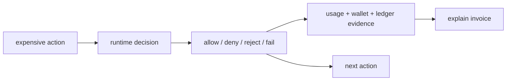

# Language And Vocabulary

Date: 2026-06-30

Status: proposed internal standard. This document defines how Unprice should speak in product UI,
marketing pages, docs, SDK examples, emails, support copy, and sales material. It complements the
canonical positioning and product docs; it does not replace them.

## Purpose

Unprice needs one language system across the dashboard, landing page, docs, and API surfaces. The
same object should have the same name everywhere. The same state should use the same verb
everywhere. The same buyer should hear the same promise everywhere.

The governing sentence:

> Unprice speaks like an engineer explaining a money decision: what was checked, what was decided,
> what evidence exists, and what happens next.

This is the verbal version of the brand system:

## Canonical Sources

- Positioning, category, and message hierarchy:
  [`positioning-and-messaging.md`](positioning-and-messaging.md).
- Product model, pillars, and claim boundaries: [`PRODUCT.md`](PRODUCT.md).
- Voice, personality, archetype, and claims policy: [`brand-identity.md`](brand-identity.md).
- Narrative, pitch lines, CTAs, and demo angle: [`brand-narrative.md`](brand-narrative.md).
- UI and visual language: [`design-system-guidelines.md`](design-system-guidelines.md).

When this document conflicts with a canonical fact, the canonical source wins. Update this document
after fixing the wording.

## Language Principles

1. Lead with the wedge: stop over-budget usage before it runs.
2. Prefer mechanism over adjective. Say what Unprice checks, reserves, rejects, captures, replays,
   or explains.
3. Use exact product nouns. `wallet credit`, `entitlement`, `budgeted run`, `invoice evidence`, and
   `meter event` are different things.
4. Distinguish business decisions from system failures. A denial is not a crash.
5. Make the buyer the builder. The buyer is `you`, `team`, or `builder`; the buyer's economic actor
   is the `customer`.
6. Keep claims code-backed. If the product cannot prove it, the copy should not promise it.
7. Use calm urgency. Name the risk plainly, then show the control point.

## Brand Voice

Unprice is precise, open, fast, calm, and opinionated.

Use this voice everywhere:

- Precise: name objects and states directly.
- Open: show the evidence path and failure mode.
- Fast: emphasize request-path decisions and short integration paths.
- Calm: no fear stacking, no hype.
- Opinionated: pricing is a runtime decision, not a page.

Good:

- "Reject over-budget work before it runs."
- "Explain an invoice line from rated usage events and ledger captures."
- "Retry with the same idempotency key."
- "A run labels workload spend; the customer remains the economic actor."

Bad:

- "Unlock growth."
- "Billing made simple."
- "Magically monetize agents."
- "All-in-one revenue platform."

## Audience Terms

| Term | Meaning | Use | Avoid |
| --- | --- | --- | --- |
| `you` | The developer-led team using Unprice | Marketing, docs, onboarding | Using `customer` for the Unprice buyer |
| `team` | The buyer organization | Product UI, docs, billing settings | `client` |
| `builder` | Founder or engineer integrating Unprice | Narrative, landing, launch content | Overusing in dense product UI |
| `customer` | The buyer's end customer and economic actor | Dashboard, API docs, invoices, wallets, subscriptions | Calling the Unprice buyer a customer |
| `account` | A customer when the economic/account container matters | Support, sales, account-level budget copy | Using when `customer` is clearer |
| `user` | A human in the buyer's app, only when distinct from the customer | Rare docs examples | Generic substitute for buyer or customer |
| `workload` | Generic unit of expensive work under a customer | Budgeted runs, docs, dashboard | Treating Unprice as the workload owner |
| `agent`, `job`, `workflow`, `tool`, `run` | Workload labels from the buyer's system | Examples and filters | "AI agent platform" |

Rule: never call the Unprice buyer "the customer." In Unprice copy, `customer` means the buyer's
economic actor that holds subscriptions, budgets, wallets, and invoices.

## Proper Nouns And Capitalization

| Write | Do not write | Notes |
| --- | --- | --- |
| `Unprice` | `unprice` in prose | Product name is capitalized. Package names and URLs stay literal. |
| `PriceOps` | `price ops`, `PricingOps` | Category term. Define on first cold touch. |
| `open-source PriceOps infrastructure` | `open source billing platform` | Use when describing category. |
| `request path` | `request-path` as a noun | Hyphenate only as modifier: `request-path decision`. |
| `money path` | `revenue flow` | The inspectable path from usage to invoice evidence. |
| `budgeted run` | `agent run` as the generic term | Agents are one possible workload label. |
| `wallet credit` | `credit` when ambiguous | Credits are wallet funds, not entitlement grants. |
| `entitlement grant` | `credit` | Grants define access/quantity; credits fund spend. |
| `invoice evidence` | `analytics` when evidence is meant | Evidence explains charges and denials. |
| `Sandbox` | `sandbox` when naming the provider | Capitalize the built-in payment provider mode. |
| `Stripe-first today` | `Stripe replacement` | Payment provider boundary. |
| `AGPL-3.0` | `AGPL` only | Use full license name on first mention. |
| `SDK`, `API`, `OpenAPI` | `Sdk`, `api` in headings | Keep developer acronyms uppercase. |

## Core Noun System

Use these nouns consistently.

| Noun | Meaning | Recommended copy |
| --- | --- | --- |
| `expensive action` | The buyer's product action that can create real cost | "Put a budget around the expensive action." |
| `runtime decision` | The allow/deny decision made while a request is in flight | "Pricing is a runtime decision." |
| `request path` | The path where the buyer's app calls Unprice before work runs | "Check budget in the request path." |
| `money path` | The connected path from request to meter, entitlement, budget, wallet, ledger, and invoice | "Explain invoices from the same money path." |
| `plan` | Commercial package authored by the team | "Create a plan to define features and defaults." |
| `plan version` | Publishable version of a plan | "Publish a plan version before customer signup." |
| `feature` | Sellable or gateable capability in a plan | "Attach meter configuration to usage features." |
| `meter` | Configuration for turning events into usage facts | "Meter usage by event slug." |
| `event` | Reported usage occurrence | "Replay failed ingestion events." |
| `entitlement` | Customer's right or limit for a feature | "Check entitlement before expensive work runs." |
| `budget` | Spend cap for a customer or workload | "Reject over-budget work before it runs." |
| `budgeted run` | Temporary budget reservation and spend label for a workload | "Start a budgeted run for a job, workflow, tool, or agent." |
| `wallet` | Customer-level balance container | "Reserve wallet credits before capturing usage." |
| `wallet credit` | Purchased or granted spend unit in the wallet | "Show purchased, granted, reserved, and consumed credits separately." |
| `invoice` | Billable customer document | "Explain invoice lines from rated facts and ledger captures." |
| `ledger capture` | Evidence that reserved wallet funds were consumed | "Group invoice evidence from ledger captures." |
| `ingestion` | Pipeline that receives and processes usage events | "Show processed, rejected, failed, and replayable events." |
| `replay` | Queue a failed event for processing again | "Replay failed events from stored payloads." |
| `payment provider` | System that captures payment | "Stripe-first today, provider-extensible by design." |

## Verb System

These are the primary Unprice verbs.

| Verb | Use for | Example |
| --- | --- | --- |
| `meter` | Convert product activity into usage | "Meter usage events." |
| `check` | Ask for entitlement, budget, or access state | "Check access before the LLM call." |
| `enforce` | Apply limits or entitlements | "Enforce entitlements in the request path." |
| `budget` | Put a spend cap around a customer or workload | "Budget the expensive action." |
| `reserve` | Hold wallet funds before usage is final | "Reserve credits before the run starts." |
| `capture` | Consume reserved funds after usage happens | "Capture usage against the reservation." |
| `consume` | Synchronously apply usage | "Consume usage while the request is in flight." |
| `record` | Asynchronously report usage | "Record usage events for async ingestion." |
| `allow` | Let a request continue | "Allow within budget." |
| `deny` | Stop a runtime request from continuing | "Deny over-budget work before it runs." |
| `reject` | Refuse an event or action as a business outcome | "Rejected because the customer exceeded budget." |
| `fail` | System or pipeline failure | "Failed during rating." |
| `explain` | Show evidence behind a charge or decision | "Explain this invoice line." |
| `replay` | Queue failed ingestion again | "Replay selected failed events." |
| `retry` | Client repeats the same request safely | "Retry with the same idempotency key." |
| `version` | Create a new plan state | "Version plans without rewriting the app." |
| `publish` | Make a plan version usable | "Publish the plan version." |
| `migrate` | Move customers between plan versions | "Migrate customers to the new plan version." |
| `bind` | Attach a key to a default customer | "Bind this API key to a default customer." |
| `revoke` | Invalidate access | "Revoke the API key." |

Avoid vague verbs:

- `unlock`
- `streamline`
- `optimize`
- `leverage`
- `empower`
- `monetize` unless the sentence names the mechanism
- `transform`
- `supercharge`
- `simplify` without saying what becomes simpler

## Decision And State Language

Use state language as a contract.

| State | Meaning | Good copy | Avoid |
| --- | --- | --- | --- |
| `allowed` | Runtime check passed | "Allowed because the run is within budget." | "Successful" when the decision matters |
| `denied` | Runtime check stopped work | "Denied before any cost was created." | "Errored" |
| `processed` | Event was accepted and applied | "Processed in the last hour." | "Completed" if ingestion state is `processed` |
| `rejected` | Event/action was refused by business logic | "Rejected: budget exceeded." | "Failed" |
| `failed` | System or pipeline could not complete | "Pipeline failure. Replay is available." | "Rejected" |
| `replayable` | Failed event has a stored payload | "Replayable: yes." | "Retryable" in dashboard action labels |
| `queued` | Replay or background work is scheduled | "Replay queued." | "Started" |
| `running` | Budgeted run is active | "Run is still consuming budget." | "Live" when exact state is available |
| `completed` | Run ended normally | "Completed after wallet capture." | "Closed" unless the state is named `closed` |
| `budget_exceeded` | Run stopped at budget | "Budget exceeded." | "Out of funds" if the budget, not wallet, is the cause |
| `reserved` | Wallet funds are held | "Reserved for active usage." | "Spent" |
| `consumed` | Funds or usage have been spent/applied | "Already spent from the wallet." | "Used" when money semantics matter |
| `expired` | Credit or run is no longer valid by time | "Expired wallet credit." | "Inactive" |
| `draft` | Not publishable/live yet | "Draft plan version." | "Pending" |
| `published` | Plan version can be used | "Published plan version." | "Active" when publish state matters |
| `finalized` | Invoice is locked | "Finalized invoice." | "Done" |
| `paid` | Invoice settled | "Paid." | "Complete" |

Rule: `failed` is for system failure. `denied` or `rejected` is for expected business enforcement.
This distinction is central to the brand because it shows control instead of panic.

## Message Hierarchy

Do not present the product as five equal features. The order matters.

1. Spend safety: cap runaway usage before it runs.
2. Runtime pricing control: pricing decisions happen in the request path.
3. One inspectable money path: usage, entitlements, budgets, credits, ingestion, and invoices share
   evidence.
4. Open PriceOps infrastructure: the team owns inspectable revenue logic.
5. Pricing flexibility: plan versions and feature configuration change without rewriting the app.
6. Bring your own payments: Stripe-first today, provider-extensible by design.

When space is tight, lead with the first two and mention evidence if there is room:

> Put a budget around the expensive action. Reject over-budget work before it runs, then explain the
> invoice from the same money path.

## Surface Guidelines

### Landing Page

Landing copy should start with the expensive action and the request-path decision.

Use:

- "Stop runaway usage before it runs."
- "Put a budget around the expensive action."
- "Pricing is a runtime decision."
- "Your Redis counter is not a budget."
- "Explain every invoice line from usage and ledger evidence."
- "Stripe-first today, provider-extensible by design."

Avoid:

- "Start pricing."
- "Billing made simple."
- "Global monetization."
- "Unlock growth."
- "All-in-one revenue platform."
- "AI agent monetization."

### Dashboard

Dashboard copy should be state-first and action-close. It should answer: what happened, who it
affected, what limit or balance was involved, and what the operator can do next.

Use:

- "Processed", "Rejected", "Failed", "Replayable".
- "Budgeted runs for this customer."
- "Wallet credits for this customer."
- "Why this costs $X."
- "Replay selected failed events."
- "Create a customer or send one through the API to start recording usage."

Avoid:

- "Insights" when the screen shows evidence.
- "Performance" when the screen shows usage, spend, or failures.
- "Manage" as the whole description.
- "Growth levers."
- "Adaptive model."

### Docs

Docs copy should be imperative, exact, and sequenced. Prefer "Call X before Y" over conceptual
prose when explaining integration.

Use:

- "Call `access.check` before the expensive action runs."
- "Use `usage.consume` when the request path needs a synchronous decision."
- "Use `usage.record` for async usage ingestion."
- "Retry with the same idempotency key."
- "A bound API key cannot spend for a different customer."

Avoid:

- "Simply", "just", or "easily" when money logic is involved.
- "Magic", "automatic" without naming what is derived.
- "Get insights" for evidence or replay workflows.

### API Reference And SDK Examples

API copy should describe the contract, not the marketing benefit.

Use:

- "Start a budgeted run."
- "Apply usage to a running budgeted run."
- "End a budgeted run and release unused reservation funds."
- "Resolve whether a feature is usable for a customer."
- "Return the current wallet balance plus active holds and credits."

Avoid:

- "Get the price of a product" as a generic API-sheet description.
- "Verify entitlement" when the method is `access.check` and also returns usage or spend context.
- "Track usage" when the action is billing-relevant; prefer "record usage" or "consume usage."

### Forms And Settings

Forms should name the object and explain the effect of the field.

Pattern:

> Label: object noun.
> Description: what this value controls.

Examples:

- "Plan title: Display name for this plan."
- "Plan slug: Stable identifier used by API calls."
- "Default customer: Used when requests with this API key omit `customerId`."
- "Expiration date: After this date, the API key can no longer call this project."

### Empty States

Empty states should say what will appear and what creates it.

Pattern:

> No [object] yet. [Object] will appear after [trigger]. [Action if available].

Good:

- "No wallet credits. Wallet credits will appear after this customer receives purchased or granted
  funds."
- "No budgeted runs. Runs will appear after your app starts a budgeted workload for this customer."
- "No invoices. Invoices will appear after this customer has billable subscriptions."

Avoid:

- "Nothing here yet."
- "Your growth levers are waiting."
- "Launch your first adaptive model to begin."

### Errors, Denials, And Recovery

Errors should identify the operation, reason, and recovery path.

Pattern:

> [Operation] could not [verb]. [Reason if known]. [Recovery action].

Examples:

- "Events could not be loaded. Refresh or narrow the date range."
- "Pipeline failure. Replay is available from the stored payload."
- "Denied: budget exceeded. Increase the run budget or stop the workload."
- "This failed event is not replayable, so no replay payload is stored."

Do not soften important money states. Be direct.

## CTA System

Primary CTAs should name the concrete first step.

| Context | Preferred CTA | Avoid |
| --- | --- | --- |
| Homepage primary | "Budget my expensive action" | "Start pricing" |
| Homepage secondary | "Explore the request-path SDK" | "Learn more" |
| Docs secondary | "Read the integration guide" | "Read more" |
| GitHub/community | "Star on GitHub" | "Join us" |
| Dashboard empty plan state | "Create plan" | "Launch model" |
| Dashboard API sheet | "See API reference" | "Learn more" |
| Events recovery | "Replay selected" | "Try again" |
| Invoice detail | "Explain charge" | "View insights" |
| Payment setup | "Connect Stripe" | "Enable payments" when only Stripe is live |
| Sandbox setup | "Test on Sandbox" | "Start taking payments" |

CTA formula:

> Verb + specific object.

Examples:

- "Create plan"
- "Publish plan version"
- "Replay selected"
- "Explain charge"
- "Bind default customer"
- "Rotate API key"
- "Connect Stripe"

## Phrase Bank

### One-Liners

- Unprice is open-source PriceOps infrastructure for usage-based SaaS.
- Stop runaway usage before it runs.
- Put a budget around the expensive action.
- Pricing is not a page. Pricing is a runtime decision.
- The request path is the new pricing surface.
- Your Redis counter is not a budget.
- Usage, credits, budgets, and invoices should share one evidence trail.
- Revenue logic should be inspectable when it allows, denies, charges, credits, or replays customer
  activity.

### Product Headers

- Events
- Customers
- Wallet & Credits
- Invoices
- Budgeted Runs
- API Keys
- Plans
- Plan Versions
- Usage Evidence
- Invoice Evidence
- Payment Provider

### Section Headers

- Built for the request path
- One inspectable money path
- Budget the expensive action
- Explain the charge
- Replay failed events
- Wallet credits by source
- Customer spend state
- Plan features and meters

### Status Descriptions

- "Processed in the last hour."
- "Rejected by entitlement, budget, or wallet rules."
- "Failed during ingestion."
- "Replay queued."
- "Reserved for active usage."
- "Consumed from wallet credits."
- "Budget exceeded."
- "No replay payload is stored."

## Replacement Dictionary

Use this table when reviewing existing copy.

| Replace | With | Why |
| --- | --- | --- |
| "Start pricing" | "Budget my expensive action" or "Create plan" | Names the first valuable action. |
| "Learn more" | "Explore the SDK", "Read the docs", "See API reference" | Says what the user gets. |
| "Manage your customers" | "Create customers and inspect subscriptions, wallets, invoices, and runs." | Shows customer as economic actor. |
| "Revenue architecture" | "plans, features, meters, and limits" | Uses product nouns. |
| "Growth levers" | "plans, features, meters, and budgets" | Avoids vague growth language. |
| "Adaptive model" | "usage-based, tiered, package, or hybrid plan" | Specific pricing language. |
| "Analytics" | "usage evidence", "ingestion status", or "invoice evidence" | Matches operational truth. |
| "Performance" | "usage", "spend", "latency" only if measured, or "failures" | Avoids generic dashboards. |
| "Global low latency" | "request-path checks" | Avoids unproven latency claims. |
| "Subscription billing" | "subscriptions and payment-provider settlement" | Keeps payment boundary clear. |
| "Verify entitlement" | "Check access" | Matches `access.check`. |
| "Track usage" | "Record usage" or "Consume usage" | Usage is billing-relevant. |
| "AI agent platform" | "budgeted runs for agents, jobs, workflows, tools, and custom workloads" | Avoids false category. |
| "Stripe replacement" | "Stripe-first runtime money path" | Preserves payment-provider boundary. |
| "No-code pricing" | "pricing flexibility without rewriting the request path" | Audience is developer-led. |
| "Magic billing" | "one inspectable money path" | Sage/Ruler, not Magician. |

## Example Rewrites

### Landing CTA

Before:

> Start pricing

After:

> Budget my expensive action

Alternative:

> Put Unprice in the request path

### Plans Empty State

Before:

> Your growth levers are waiting. Launch your first adaptive model to begin.

After:

> No plans yet. Create a plan to define features, meters, limits, and billing behavior.

### Plans Header

Before:

> Design and iterate on your revenue architecture.

After:

> Define plans, features, meters, and limits without hardcoding the money path.

### API Sheet

Before:

> Use the code API to get the price of a product.

After:

> Use the SDK to check access, record usage, start budgeted runs, and inspect customer money state.

### Feature Card

Before:

> Any pricing model. Report usage, metering, usage-based pricing, etc.

After:

> Usage and hybrid pricing. Meter events, enforce limits, and explain charges from the same money
> path.

### Global Section

Before:

> Global low latency. Tier caching for low-latency global access.

After:

> Request-path checks. Put entitlement and budget decisions where expensive work starts.

## Claim Boundaries

Allowed:

- "Open-source PriceOps infrastructure."
- "Stop over-budget usage before it runs."
- "Meter usage, enforce entitlements, reserve credits, and explain invoices."
- "Budgeted runs for agents, workflows, jobs, tools, and custom workloads."
- "Stripe-first today, provider-extensible by design."
- "Designed for request-path usage enforcement."

Avoid until proven:

- Exact latency claims such as "<100ms".
- Exact throughput claims such as "100k+ events/sec".
- Live Paddle, Lemon Squeezy, or Square integrations.
- Enterprise revenue recognition, tax, or accounting replacement.
- "AI agent platform."
- Customer quotes, case-study numbers, or ROI claims without evidence.

## Review Checklist

Use this before publishing app copy, marketing copy, docs, examples, or emails.

- Does the copy use `team`, `builder`, or `you` for the Unprice buyer?
- Does `customer` refer only to the buyer's economic actor?
- Does the first screen or first paragraph name the expensive action, request path, budget, or
  invoice evidence?
- Does the sentence use a concrete Unprice verb: meter, check, enforce, budget, reserve, capture,
  consume, record, allow, deny, reject, explain, replay, version, publish?
- Are wallet credits, entitlement grants, usage quantities, budgets, and invoices kept distinct?
- Are business denials separated from system failures?
- Is every CTA a verb plus a specific object?
- Does every claim have product evidence or a canonical source?
- Does the copy avoid `growth`, `magic`, `effortless`, `all-in-one`, `no-code`, and `Stripe
  replacement`?
- If the surface is cold, does it define or contextualize `PriceOps`?

## Governance

Use this document when changing:

- landing-page copy
- dashboard headers, empty states, filters, toasts, sheets, and button labels
- docs and SDK examples
- API operation descriptions
- onboarding and emails
- sales or launch copy

Owner: founder/brand lead. Review quarterly and whenever the positioning, ICP, payment-provider
boundary, or product nouns change.

Open questions to validate with customer interviews:

- Whether buyers prefer "runaway usage", "customer budget", or "runtime pricing control" as the
  first phrase.
- Whether "PriceOps" lands quickly enough or needs the DevOps/FinOps analogy on every cold surface.
- Which proof point matters most: budget rejection, invoice explanation, or pricing changes without
  rewrites.
