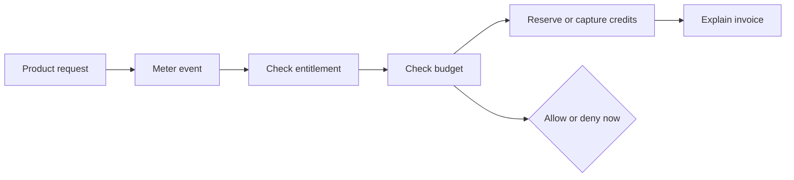

# Positioning And Messaging

Date: 2026-06-30

This document is the canonical source for Unprice positioning, category, headline, message
hierarchy, and competitor contrast. Other brand docs should defer to this file for these facts.

## Executive Position

Unprice should not launch as a broad billing platform. That market is crowded and the product would
be forced to compete on provider coverage, tax/compliance, enterprise procurement, and brand trust.

The first market should be developer-led AI/API SaaS teams that need runtime spend control and
explainable usage billing.

The wedge leads with spend safety: stop over-budget usage before it runs. Everything else (metering,
entitlements, credits, invoices) is the supporting money path, not the headline.

## Positioning Statement

For developer-led AI/API SaaS teams — CTOs, founding engineers, and platform engineers —

Who ship expensive per-request usage and cannot stop a customer or workload from blowing past budget
before the invoice arrives,

Unprice is the open-source PriceOps runtime

That puts a real-time spend budget in the request path — rejecting over-budget work before it runs,
then metering, gating, crediting, and explaining every invoice line from one inspectable money path.

Unlike billing and metering platforms (Stripe Billing, Metronome, Orb, Lago, OpenMeter) that rate
and invoice usage after it happens, or entitlement layers (Stigg) that gate access but not spend,

Only Unprice decides — at runtime, in open source — whether expensive usage is allowed to happen at
all, before the cost is created.

> Status: internal positioning hypothesis. Validate the "only Unprice" claim with real customer
> interviews before treating it as proven (see `jobs-to-be-done.md` evidence limits).

## Category

Open-source PriceOps runtime for usage-based SaaS.

### PriceOps Defined

PriceOps is the practice of operating pricing as live infrastructure: metering, entitlements,
budgets, credits, and invoice evidence run as one inspectable system in the request path — the way
DevOps operates deploys and FinOps operates cloud spend. Unprice is the open-source runtime for
PriceOps.

### What "Unprice" Means

Unprice does not mean removing price. It means un-hardcoding pricing: decoupling plan logic,
counters, and limits from application code and moving them into one inspectable runtime. You
"un-price" your codebase so pricing can change without a rewrite.

## One-Liner

Unprice lets developer-led SaaS teams stop over-budget usage before it runs, then meter, gate,
credit, and explain every invoice from the same runtime system.

## Homepage Headline

Stop runaway usage before it runs.

## Homepage Subheadline

Unprice is open-source PriceOps infrastructure for usage-based SaaS. Put a real-time budget around
your most expensive action, reject over-budget work in the request path, and explain every invoice
line from the same money path.

Supporting capability line (secondary, not the hero): meter events, enforce entitlements, reserve
customer credits, cap expensive runs, and explain every invoice line without hardcoding revenue
logic into your app.

## Terminology

Use these terms consistently across all copy:

- "team", "builder", or "you" = the developer-led SaaS team using Unprice (the buyer).
- "customer" or "account" = that team's end customer, the economic actor that holds subscriptions,
  budgets, wallets, and invoices.
- Runs, jobs, workflows, tools, and agents = workload labels under a customer. The customer remains
  the economic actor.

Never call the Unprice buyer "the customer." The buyer is the team or builder.

## Payments Boundary

Unprice owns the runtime money path: metering, entitlements, budgets, credits, and invoice evidence.
The payment provider still captures the payment. Stripe is the first supported provider today; the
provider model is designed to extend to Paddle, Lemon Squeezy, and others without rewriting the app.
This is a deliberate boundary, not a limitation: bring your own payments, keep one pricing runtime.

Claim discipline: say "Stripe-first today, provider-extensible by design." Do not claim live
Paddle/Lemon Squeezy/Square integrations until they ship.

## Primary Beachhead

Developer-led AI/API SaaS teams with expensive per-request usage and hybrid subscription plus
usage/credit pricing.

### Company Profile

- 5-50 employees.
- Seed to Series A.
- B2B SaaS, API, infrastructure, automation, data, or AI product.
- Usage directly affects gross margin.
- Engineering owns the pricing integration.

### Buyer

- CTO.
- Founding engineer.
- Head of platform.
- Product engineer owning billing, metering, or entitlements.

### Current Workaround

- Stripe for invoices.
- Custom usage tables.
- Redis or database counters for limits.
- Cron jobs for billing reconciliation.
- Manual debugging when customers dispute usage.

### Trigger Events

- AI or API costs spike after a customer overuses the product.
- A new usage-based pricing model is blocked by hardcoded plan logic.
- The team needs credits, prepaid balances, or per-run spend caps.
- Support cannot explain a disputed invoice line.
- A customer wants usage limits before signing a larger contract.

## Core Narrative

Pricing is not a page. For usage-based products, pricing is a runtime decision.

Modern SaaS and AI/API products need to price usage, gate access, control spend, and explain
invoices while requests are still flowing. Unprice gives builders an open-source PriceOps runtime
so pricing can change as fast as the product without hiding revenue logic inside application code
or a black-box billing vendor.

## Strategic Diagram

## Supporting Claims

- Cap customer or workload spend with budgeted runs — reject over-budget work before it runs.
- Enforce access and usage before expensive work runs.
- Model plans, usage meters, wallets, credits, and invoices together.
- Keep billing evidence inspectable and replayable.
- Own monetization logic with open-source infrastructure.

## Proof Points To Emphasize

- Public SDK methods for `access.check`, `usage.record`, `usage.consume`, `runs.start`,
  `runs.consume`, `runs.end`, `runs.get`, wallet balances, analytics, and ingestion replay.
- Usage features require event-native meter configuration.
- Wallet credits are distinct from entitlement grants.
- Budget runs are generic workload labels, not agent objects.
- Invoice explanation connects charges back to rated usage events and ledger captures.

## Things Not To Claim Yet

- Full replacement for Stripe Billing.
- Live Paddle, Lemon Squeezy, or Square integrations (the provider model is extensible by design,
  but Stripe is the only supported provider today).
- Enterprise revenue recognition suite.
- Guaranteed throughput or latency numbers.
- AI agent platform.

## Competitor Contrast

- Stripe Billing and Metronome: broad commercial billing and metering. They rate and invoice usage
  after it happens.
- Orb: advanced usage billing for enterprise pricing models. Post-usage rating, not request-path
  spend rejection.
- Stigg: monetization control layer with strong entitlements. Gates access, but not real-time spend
  budgets and wallet reservations on expensive workloads.
- OpenMeter and Lago: open-source metering and billing. Open source, but post-hoc; not a runtime
  budget that rejects work before it runs.
- Unprice: the only open-source runtime that decides whether expensive usage is allowed to happen at
  all — in the request path, before the cost is created — then explains the invoice from the same
  money path.

Only-we test: the ownable wedge is real-time, pre-spend budget rejection inside the request path,
in open source. Generic "runtime pricing control" alone is not ownable; lead with the budget cap.

### The Real Incumbent: The DIY Stack

Before a buyer compares Unprice to Metronome or Orb, their actual day-one alternative is what they
already run: Stripe for invoices, a usage table, Redis or database counters for limits, cron
reconciliation, and plan logic hardcoded in product code. The honest first objection is not "why not
Orb?" — it is "I can just check a counter before I call the LLM."

Answer that objection directly. A homegrown pre-check breaks down because:

- The counter and the real cost live in different systems, so budgets drift from spend and races let
  over-budget work through under concurrency.
- Credits, entitlement grants, and usage quantities get conflated in ad hoc columns, so a denial
  cannot be explained after the fact.
- Every packaging change edits product code, billing scripts, and reconciliation jobs at once.
- When a customer disputes a charge, there is no single evidence trail from request to invoice line.

Unprice is the one runtime where the budget check, the credit reservation, and the invoice evidence
are the same money path — so the pre-check is correct under concurrency and explainable later. Lead
competitive copy against the DIY stack first; position against vendors second.

## Message Hierarchy

Lead with the wedge. Do not present these as five equal verbs; tier 1 is the headline, the rest are
supporting depth.

1. Spend safety — cap runaway usage before it runs. (Wedge.)
   Real-time budgets reject over-budget customer and workload spend in the request path, before
   expensive work executes.
   Proof: budgeted runs (`runs.start` / `runs.consume` / `runs.end`), run-level budget rejection,
   wallet reservations, `access.check`.

2. Runtime pricing control.
   Pricing is a runtime decision, not a page or an end-of-cycle job. Decide while the request is in
   flight.
   Proof: `access.check`, `usage.consume`, synchronous consumption.

3. One inspectable money path.
   Usage, entitlements, budgets, credits, ingestion, and invoices share one evidence trail.
   Proof: invoice explanation from rated events and ledger captures; ingestion replay.

4. Open PriceOps infrastructure.
   Revenue logic is inspectable and owned by you, not trapped in a black box. AGPL-3.0 core plus a
   commercial license.
   Proof: open source, explicit schemas, generated SDK from OpenAPI.

5. Pricing flexibility without rewrites.
   Flat, tier, package, usage, and hybrid models share one mental model; change packaging without
   rewriting the money path.
   Proof: plan versions, feature and meter configuration.

6. Bring your own payments — Stripe-first, provider-extensible.
   Unprice owns the runtime money path; your provider still captures payment. Stripe today; the
   provider model is designed to extend to Paddle, Lemon Squeezy, and others.
   Proof: payment-provider abstraction.

## Demo Script Angle

"Show me the expensive action in your product. We will put a customer budget around it, reject
over-budget calls before they cost you money, and produce invoice evidence from the same usage
stream."

## First Content Topics

- How to stop runaway LLM usage per customer.
- Credits, entitlements, and invoices are three different systems.
- Why usage billing needs request-path enforcement.
- How to explain a usage invoice from event evidence.
- How to launch usage pricing without rewriting product code.

## Business Model

Unprice is open-core: an AGPL-3.0 open-source core plus a Commercial License for teams that cannot
open-source their modifications or want dedicated support. The brand should treat Unprice's own
pricing page as its best demo of explainable, usage-aware pricing.

## Open Questions

- Define the commercial/hosted offering and its pricing tiers, then make the public pricing page an
  exemplar of the product.
- Validate the "only Unprice" positioning claim and the lead phrase ("runaway usage", "customer
  budgets", or "runtime pricing control") with real customer interviews before treating either as
  proven.
