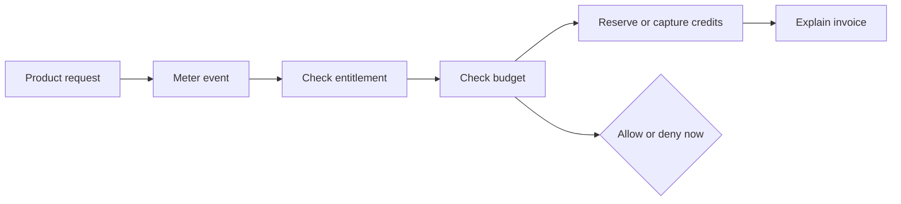

# Positioning And Messaging

Date: 2026-06-30

## Executive Position

Unprice should not launch as a broad billing platform. That market is crowded and the product would
be forced to compete on provider coverage, tax/compliance, enterprise procurement, and brand trust.

The first market should be developer-led AI/API SaaS teams that need runtime spend control and
explainable usage billing.

## Category

Open-source PriceOps runtime for usage-based SaaS.

## One-Liner

Unprice lets developer-led SaaS teams meter usage, enforce spend limits, and produce explainable
invoices from the same runtime system.

## Homepage Headline

Runtime pricing control for usage-based SaaS.

## Homepage Subheadline

Meter events, enforce entitlements, reserve customer credits, cap expensive runs, and explain every
invoice line without hardcoding revenue logic into your app.

## Primary Beachhead

Developer-led AI/API SaaS teams with expensive per-request usage and hybrid subscription plus
usage/credit pricing.

### Company Profile

- 5-50 employees.
- Seed to Series A.
- B2B SaaS, API, infrastructure, automation, data, or AI product.
- Usage directly affects gross margin.
- Engineering owns the pricing integration.

### Buyer

- CTO.
- Founding engineer.
- Head of platform.
- Product engineer owning billing, metering, or entitlements.

### Current Workaround

- Stripe for invoices.
- Custom usage tables.
- Redis or database counters for limits.
- Cron jobs for billing reconciliation.
- Manual debugging when customers dispute usage.

### Trigger Events

- AI or API costs spike after a customer overuses the product.
- A new usage-based pricing model is blocked by hardcoded plan logic.
- The team needs credits, prepaid balances, or per-run spend caps.
- Support cannot explain a disputed invoice line.
- A customer wants usage limits before signing a larger contract.

## Core Narrative

Pricing is not a page. For usage-based products, pricing is a runtime decision.

Modern SaaS and AI/API products need to price usage, gate access, control spend, and explain
invoices while requests are still flowing. Unprice gives builders an open-source PriceOps runtime
so pricing can change as fast as the product without hiding revenue logic inside application code
or a black-box billing vendor.

## Strategic Diagram

## Supporting Claims

- Enforce access and usage before expensive work runs.
- Model plans, usage meters, wallets, credits, and invoices together.
- Cap customer or workload spend with budgeted runs.
- Keep billing evidence inspectable and replayable.
- Own monetization logic with open-source infrastructure.

## Proof Points To Emphasize

- Public SDK methods for `access.check`, `usage.record`, `usage.consume`, `runs.start`,
  `runs.consume`, `runs.end`, `runs.get`, wallet balances, analytics, and ingestion replay.
- Usage features require event-native meter configuration.
- Wallet credits are distinct from entitlement grants.
- Budget runs are generic workload labels, not agent objects.
- Invoice explanation connects charges back to rated usage events and ledger captures.

## Things Not To Claim Yet

- Full replacement for Stripe Billing.
- Broad multi-provider payment portability.
- Enterprise revenue recognition suite.
- Guaranteed throughput or latency numbers.
- AI agent platform.

## Competitor Contrast

- Stripe Billing and Metronome: broad commercial billing and metering platform.
- Orb: advanced usage billing for enterprise pricing models.
- Stigg: monetization control layer with strong entitlements positioning.
- OpenMeter and Lago: open-source metering and billing infrastructure.
- Unprice: open-source runtime money control for builders who need pricing flexibility and spend
  enforcement inside the product request path.

## Message Hierarchy

1. Runtime pricing control.
2. Usage, entitlements, budgets, credits, and invoices in one flow.
3. Open-source and inspectable.
4. Developer-first SDK/API path.
5. Stripe-first billing integration, not provider overclaiming.

## Demo Script Angle

"Show me the expensive action in your product. We will put a customer budget around it, reject
over-budget calls before they cost you money, and produce invoice evidence from the same usage
stream."

## First Content Topics

- How to stop runaway LLM usage per customer.
- Credits, entitlements, and invoices are three different systems.
- Why usage billing needs request-path enforcement.
- How to explain a usage invoice from event evidence.
- How to launch usage pricing without rewriting product code.
