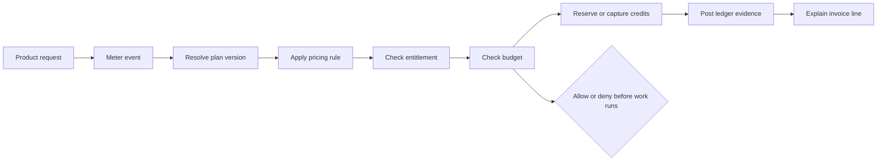

# Positioning And Messaging

Date: 2026-07-03

Status: pre-validation refresh. Updated after the July 2026 market audit (processor consolidation,
Stigg's AI-runtime pivot, agent-billing white space). The wedge remains a hypothesis until the
customer interviews in `jobs-to-be-done.md` run; lock this document after those interviews.

This document is the canonical source for Unprice positioning, category, headline, message
hierarchy, and competitor contrast. Other brand docs should defer to this file for these facts.

## Executive Position

Unprice should not launch as a broad billing platform, an AI gateway, or a generic spend-control
tool. Those markets already have clear buyers and stronger incumbents.

The first market is developer-led usage-based SaaS teams that sell credits, usage, or hybrid plans
and need the customer's commercial limit enforced before paid work runs. AI/API and workflow
products are the sharpest early slice because one customer-triggered action can create real
marginal cost before the invoice exists.

The wedge is the open-source customer money path: authorize customer spend before paid work runs,
then explain the charge, credit, denial, replay, or invoice line from the same evidence trail. The
gateway caps what the team spends with providers; Unprice governs what the team's customer is
allowed to spend and turns that decision into billing evidence.

## Market Context (Dated Snapshot: July 2026)

Time-sensitive facts. Verify before reusing in external copy; refresh this section quarterly.

The independent billing middle market consolidated into payment processors: Stripe acquired
Metronome (~$1B, closed January 2026), Adyen agreed to acquire Orb ($335M, announced June 2026),
Kong acquired OpenMeter (September 2025), Zuora went private (Silver Lake, February 2025), and
Amberflo pivoted out of metering. Every independent metering-first company was acquired or pivoted.

Consequences for Unprice:

1. "Independent, open-source money path" is now a scarce position with a market-event narrative:
   billing logic should not live inside a payment processor, and a closed runtime can be acquired
   out from under its buyers. Lago runs this play for the billing-engine layer; nobody runs it for
   the request-path authorization layer.
2. Stigg repositioned onto the wedge ("Every AI request is a spend decision. Make it in
   milliseconds," with per-agent budget caps and credits, sold up-market). Authorization alone is
   now a contested claim; the open, forkable authorization runtime is not. Contrast accordingly.
3. The Seed-to-Series-A tier Metronome and Orb served before going enterprise is under-served —
   exactly Unprice's ICP.
4. Public buyer language validates the mechanism: complaints that Stripe Billing has "no way to
   check a customer's balance before they use the product, no way to enforce spend caps" state the
   wedge in the buyer's own words. Sourced verbatims live in `jobs-to-be-done.md`; they are market
   evidence, not Unprice customer proof.

## Positioning Statement

For developer-led usage-based SaaS teams — CTOs, founding engineers, and platform engineers —

Who ship paid product actions that can create cost before the invoice exists — sharpest where
customers buy credits for AI, API, and workflow actions,

Unprice is the open-source customer money path

That sells credits and usage-based plans without eating over-budget customer work — checking
entitlement, customer budget, wallet credits, and meter rules before work runs — then preserving the
evidence that explains every allow, deny, charge, credit, and invoice line.

Unlike billing platforms that rate and invoice after usage and are consolidating into payment
processors, AI gateways that cap provider cost, closed usage runtimes that cannot be inspected or
forked, and open-source billing engines that do not authorize in the request path,

Unprice keeps the customer spend decision, the double-entry ledger, and the invoice explanation in
one open money path you can read, self-host, and fork: the same path that authorizes paid usage
before cost is created also proves why the charge came out that way — and the layer that guards
your margin cannot be acquired out from under you.

## Category

Public frame: open-source customer money path for usage-based SaaS.

Internal category: PriceOps runtime.

### PriceOps Defined

PriceOps is the practice of operating pricing as versioned commercial infrastructure: plan
versions, subscriptions, entitlements, meters, budgets, credits, usage evidence, and invoice
evidence stay separate but connected. Entitlements do not live inside a subscription blob; customers
can stay pinned to the plan version they bought while new pricing experiments ship safely for future
customers. Use PriceOps to explain the operating model, not as the cold headline.

### What "Unprice" Means

Unprice does not mean removing price. It means un-hardcoding pricing: decoupling plan logic,
counters, and limits from application code and moving them into one inspectable runtime. You
"un-price" your codebase so pricing can change without a rewrite.

## One-Liner

Unprice lets developer-led SaaS teams sell credits and usage-based plans without eating
over-budget customer work: authorize in the request path, explain on the invoice, and own the money
path in open source.

## Homepage Headline

Authorize customer spend before paid work runs.

## Homepage Subheadline

Unprice is the open-source customer money path for usage-based SaaS. Keep plans versioned,
entitlements separate, customer budgets in the request path, and invoice evidence tied to the same
decision that allowed or denied the work.

Supporting capability line (secondary, not the hero): meter events, enforce entitlements, reserve
customer credits, cap customer and workload spend, price flat, tiered, package, and usage features,
preserve invoice evidence, and ship pricing experiments without hardcoding revenue logic into your
app.

## Terminology

Use these terms consistently across all copy:

- "team", "builder", or "you" = the developer-led SaaS team using Unprice (the buyer).
- "customer" or "account" = that team's end customer, the economic actor that holds subscriptions,
  budgets, wallets, and invoices.
- Runs, jobs, workflows, tools, and agents = workload labels under a customer. The customer remains
  the economic actor.

Never call the Unprice buyer "the customer." The buyer is the team or builder.

## Payments Boundary

Unprice owns the customer money path: plan versions, entitlements, metering, budgets, wallet
credits, usage evidence, and invoice evidence. The payment provider still captures the payment.
Stripe is the first supported provider today; the provider model is designed to extend to other
providers without rewriting the app. This is a deliberate boundary: bring your own payments, keep
one money path.

Claim discipline: say "Stripe-first today, provider-extensible by design." Do not claim live
Paddle/Lemon Squeezy/Square integrations until they ship.

## Primary Beachhead

Developer-led usage-based SaaS teams with paid product actions, hybrid subscription plus
usage/credit pricing, customer-facing budgets, and a need to explain invoice outcomes. AI/API and
workflow products are the highest-signal early slice.

### Company Profile

- 5-50 employees.
- Seed to Series A.
- B2B SaaS, API, infrastructure, automation, data, or AI product.
- Usage directly affects gross margin.
- Engineering owns the pricing integration.

### Buyer

- CTO.
- Founding engineer.
- Head of platform.
- Product engineer owning billing, metering, or entitlements.

### Current Workaround

- Stripe for invoices.
- Custom usage tables.
- Redis or database counters for limits.
- Cron jobs for billing reconciliation.
- Manual debugging when customers dispute usage.

### Trigger Events

- A customer-triggered action creates cost before billing catches it.
- A customer can burn through credits, budget, or usage allowance before the invoice exists.
- A new usage-based pricing model is blocked by hardcoded plan logic.
- The team needs credits, prepaid balances, or per-run spend caps.
- Support cannot explain a disputed invoice line.
- A customer wants usage limits before signing a larger contract.

## Core Narrative

Pricing is not a page. For usage-based and hybrid products, pricing is a runtime decision and an
evidence trail.

Modern usage-based products need to authorize customer spend while requests are still flowing, then
explain every invoice line after the fact. Unprice gives builders an open-source customer money path
so pricing can change as fast as the product without hiding revenue logic inside application code,
gateway config, or a black-box vendor.

## Strategic Diagram

```mermaid
flowchart LR
  Request["Product request"] --> Meter["Meter event"]
  Meter --> Version["Resolve plan version"]
  Version --> Pricing["Apply pricing rule"]
  Pricing --> Entitlement["Check entitlement"]
  Entitlement --> Budget["Check budget"]
  Budget --> Wallet["Reserve or capture credits"]
  Wallet --> Ledger["Post ledger evidence"]
  Ledger --> Invoice["Explain invoice line"]
  Budget --> Decision{"Allow or deny before work runs"}
```

## Supporting Claims

- Authorize customer spend before paid work creates cost.
- Explain every allow, deny, charge, credit, and invoice line from one evidence trail.
- Cap customer or workload spend with budgeted runs.
- Keep plans, plan versions, subscriptions, entitlements, pricing rules, usage meters, wallets,
  credits, ledger captures, and invoices connected but separate.
- Keep billing evidence inspectable and replayable.
- Keep wallet credits on a double-entry ledger so reservations, captures, and refunds balance by
  construction.
- Own the request-to-invoice money path with open-source infrastructure that cannot be acquired
  out from under you.

## Proof Points To Emphasize

- Public SDK methods for `access.check`, `usage.record`, `usage.consume`, `runs.start`,
  `runs.consume`, `runs.end`, `runs.get`, wallet balances, analytics, and ingestion replay.
- Plan versions let pricing change without rewriting or silently moving existing customers.
- Flat, tiered, package, and usage features share one plan-version model; usage features require
  event-native meter configuration.
- Wallet credits are distinct from entitlement grants.
- Budget runs are generic workload labels, not agent objects.
- Invoice explanation connects lines back to plan versions, billing periods, pricing rules, rated
  usage events when present, wallet movement, and ledger captures.

## Things Not To Claim Yet

- Full replacement for Stripe Billing.
- Live Paddle, Lemon Squeezy, or Square integrations (the provider model is extensible by design,
  but Stripe is the only supported provider today).
- Enterprise revenue recognition suite.
- Guaranteed throughput or latency numbers.
- AI agent platform.

## Competitor Contrast

- Stripe Billing (acquired Metronome, January 2026) and Orb (acquired by Adyen, June 2026): strong
  billing, rating, invoicing, credits, and commercial workflows — now owned by or folding into
  payment processors, and focused on the enterprise/AI-lab tier. Unprice complements them when the
  product needs customer spend authorization before usage reaches the invoice, and contrasts on
  independence: the money path should not belong to the processor. Known buyer-voiced Stripe
  Billing gaps: no balance check or spend cap before usage, cycle-end billing, line-item caps.
- AI gateways and model gateways: strong provider-cost controls, virtual keys, routing, and model
  spend caps. They cap what the team spends; Unprice governs what the team's customer is allowed to
  spend and connects that decision to plan versions, credits, and invoice evidence.
- Stigg: now leads with "Every AI request is a spend decision. Make it in milliseconds" — a closed
  usage runtime with request-path credits, per-agent budget caps, governance, BYOC, and invoicing,
  sold up-market (Miro, Webflow, PagerDuty). It validates the category and directly contests the
  authorization claim. Contrast on inspectable, forkable, self-hostable open-source ownership of
  the request-to-invoice money path and on the under-served Seed-to-Series-A tier — not on a claim
  that Stigg cannot enforce runtime usage.
- Lago and OpenMeter/Kong-style open billing/metering: strong open-source or self-hostable
  metering, billing, and monetization infrastructure. Post-consolidation, Lago also claims the
  "independent, forkable billing" position. Unprice contrasts on the single path from request-time
  customer budget/credit authorization to invoice evidence: an open billing engine rates and
  invoices; it does not authorize in the request path.
- The 2024-2026 cohort — Autumn ("billing infrastructure for AI startups," open source over
  Stripe), Flowglad (open-source zero-webhook payments), Paid.ai (outcome-based billing for teams
  selling agents): validation that the generational wedge is AI monetization. None owns the
  wallet + entitlement + budget runtime for products whose customers burn credits. Watch Autumn
  most closely; it sells to the same builder at the same stage.
- Workflow and AI infrastructure: runs jobs, agents, model calls, and automations. It owns
  execution, not the full customer money path.
- The DIY stack: Stripe for invoices, custom usage tables, Redis or database counters, cron
  reconciliation, and plan logic in product code.
- Unprice: the open-source customer money path focused on tying the commercial decision and the
  explanation together. It authorizes customer spend before paid work creates cost, while preserving
  the evidence needed to explain the charge, denial, credit, and invoice line later.

Ownable wedge: customer budget, credit reservation, entitlement decision, pricing version, ledger
capture, and invoice evidence share one inspectable money path.

### The Real Incumbent: The DIY Stack

Before a buyer compares Unprice to Metronome or Orb, their actual day-one alternative is what they
already run: Stripe for invoices, a usage table, Redis or database counters for limits, cron
reconciliation, and plan logic hardcoded in product code. The honest first objection is not "why not
Orb?" — it is "I can just check a counter before I call the LLM."

Answer that objection directly. A homegrown pre-check breaks down because:

- The counter and the real cost live in different systems, so budgets drift from spend and races let
  over-budget work through under concurrency.
- Credits, entitlement grants, and usage quantities get conflated in ad hoc columns, so a denial
  cannot be explained after the fact.
- Every packaging change edits product code, billing scripts, and reconciliation jobs at once.
- When a customer disputes a charge, there is no single evidence trail from request to pricing rule to
  invoice line.

Unprice keeps the entitlement check, customer budget check, credit reservation, pricing version,
ledger capture, and invoice evidence on the same money path — so the pre-check is not just a loose
counter and the invoice is not a forensic project. Lead competitive copy against the DIY stack
first; use vendor contrasts only when the buyer asks.

## Message Hierarchy

Lead with the wedge. Do not present these as five equal verbs; tier 1 is the headline, the rest are
supporting depth.

1. Customer spend authorization — authorize customer spend before paid work runs. (Wedge.)
   Entitlement, customer budget, wallet credit, and meter decisions happen in the request path
   before expensive work executes.
   Proof: `access.check`, `usage.consume`, budgeted runs (`runs.start` / `runs.consume` /
   `runs.end`), wallet reservations.

2. Budgeted workloads. (Promoted in the 2026-07 refresh: credits are the dominant AI pricing
   abstraction and no vendor owns the workload-budget layer.)
   Customer, workflow, job, tool, agent, and custom workloads carry budget envelopes without
   Unprice owning execution. Boundary, stated positively: not an agent platform — the budget,
   wallet, and authorization layer for products whose customers burn credits, including when an
   agent triggers the spend.
   Proof: budgeted runs with up-front wallet reservation, run-level budget rejection, generic
   workload labels.

3. Evidence after the fact.
   Every allow, deny, charge, credit, replay, and invoice line should be explainable from the same
   money path.
   Proof: invoice explanation from plan versions, billing periods, pricing rules, rated events when
   present, wallet movement, ledger captures, ingestion status, and replay.

4. Open, independent money-path infrastructure.
   Revenue logic is inspectable and owned by you — not trapped in a black box, and not subject to a
   vendor's acquisition or sunset. AGPL-3.0 core plus a commercial license.
   Proof: open source, explicit schemas, generated SDK from OpenAPI, a double-entry ledger you can
   read — or have your agent read — before you trust it.

5. Versioned PriceOps model.
   Plans, plan versions, subscriptions, entitlements, meters, credits, budgets, and invoices stay
   separate but connected; pricing experiments do not silently move existing customers.
   Proof: plan versions, feature and meter configuration, customer subscriptions tied to published
   plan versions.

6. Pricing flexibility without rewrites.
   Flat, tier, package, usage, credit-based, and hybrid models share one mental model; change
   packaging without rewriting the money path.
   Proof: plan versions, feature and meter configuration.

7. Bring your own payments — Stripe-first, provider-extensible.
   Unprice owns the customer money path; your provider still captures payment. Stripe today; the
   provider model is designed to extend without rewriting the app. The 2026 consolidation is the
   cautionary tale: keep the money path independent of the processor.
   Proof: payment-provider abstraction.

## Demo Script Angle

"Show me the paid action in your product that can burn a customer's credits, budget, or usage
allowance. We will authorize it before it runs, put a budget around it when needed, and produce
invoice evidence from the same money path."

## First Content Topics

- How to authorize customer spend before paid work runs.
- Why usage billing needs an evidence trail after the fact.
- Credits, entitlements, and invoices are three different systems.
- Why usage billing needs request-path authorization.
- Why AI gateways cap provider spend but do not own customer billing evidence.
- How to explain a usage invoice from event evidence.
- How to launch usage pricing without rewriting product code.
- Your Redis counter is not a budget (the DIY-stack teardown; strongest launch candidate).
- Your billing layer just got acquired. Now what? (the 2026 consolidation piece; dated — verify
  facts at publish time.)

## Business Model

Unprice is open-core: an AGPL-3.0 open-source core plus a Commercial License for teams that cannot
open-source their modifications or want dedicated support. The brand should treat Unprice's own
pricing page as its best demo of explainable, usage-aware pricing.

## Open Questions

- Define the commercial/hosted offering and its pricing tiers, then make the public pricing page an
  exemplar of the product. Market anchors from the July 2026 audit: Stripe Billing charges 0.7% of
  billing volume (price flat or credit-based against the percentage), Lago gates needed features
  behind roughly $1,500/month (price under that cliff), Autumn is free for builders (open-core
  cloud convenience is the answer). Even "early access, starts at $X" beats silence — a pricing
  company with no public pricing undermines its own authority.
- Validate the lead phrase ("authorize customer spend", "prove every charge", or "budget the paid
  action") with real customer interviews before scaling spend. Recruit with the buyer's own words
  ("can you check a balance or enforce a spend cap before the request runs today?"), not Unprice
  vocabulary. Lock this document after those interviews.
- Decide how loudly campaign surfaces name the AI-credits slice. The category frame stays
  "usage-based SaaS"; launch campaigns should name credits and AI/API/workflow products explicitly
  (see `jobs-to-be-done.md` campaign angles).
