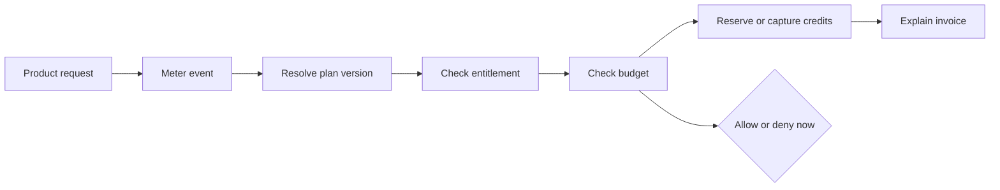

# Positioning And Messaging

Date: 2026-06-30

This document is the canonical source for Unprice positioning, category, headline, message
hierarchy, and competitor contrast. Other brand docs should defer to this file for these facts.

## Executive Position

Unprice should not launch as a broad billing platform. That market is crowded and the product would
be forced to compete on provider coverage, tax/compliance, enterprise procurement, and brand trust.

The first market should be developer-led usage-based SaaS teams that need request-path commercial
authorization and explainable usage billing. AI/API and workflow products are the sharpest early
examples because their customer-triggered actions can create real marginal cost.

The wedge leads with commercial authorization plus evidence: authorize paid usage before it runs,
then prove why every event was allowed, denied, charged, credited, or invoiced. Spend safety is the
first obvious pain; explainability is what makes the money path trustworthy after the fact.

## Positioning Statement

For developer-led usage-based SaaS teams — CTOs, founding engineers, and platform engineers —

Who ship paid product actions that can create cost before the invoice exists,

Unprice is the open-source PriceOps runtime

That authorizes usage in the request path — checking entitlement, budget, credits, and meter rules
before work runs — then preserves the evidence that explains every allow, deny, charge, credit, and
invoice line from one inspectable money path.

Unlike billing and metering platforms that primarily rate, invoice, and collect usage after it
happens, entitlement layers that gate feature access, or workflow and AI infrastructure that runs
the work,

Unprice ties the commercial decision and the after-the-fact explanation together: the same open
money path that authorizes paid usage before cost is created also proves why the invoice came out
that way.

> Status: internal positioning hypothesis. Validate whether buyers feel the before/after promise
> ("authorize before; explain after") as sharper than pure spend control before scaling GTM spend.

## Category

Open-source PriceOps runtime for usage-based SaaS.

### PriceOps Defined

PriceOps is the practice of operating pricing as versioned commercial infrastructure: plan
versions, subscriptions, entitlements, meters, budgets, credits, usage evidence, and invoice
evidence stay separate but connected. Entitlements do not live inside a subscription blob; customers
can stay pinned to the plan version they bought while new pricing experiments ship safely for future
customers. Unprice is the open-source runtime for PriceOps.

### What "Unprice" Means

Unprice does not mean removing price. It means un-hardcoding pricing: decoupling plan logic,
counters, and limits from application code and moving them into one inspectable runtime. You
"un-price" your codebase so pricing can change without a rewrite.

## One-Liner

Unprice lets developer-led SaaS teams authorize paid usage before it runs, then prove why every
event was allowed, denied, charged, credited, or invoiced from the same runtime system.

## Homepage Headline

Authorize paid usage before it runs.

## Homepage Subheadline

Unprice is open-source PriceOps infrastructure for usage-based SaaS. Keep plans versioned,
entitlements separate, and budgets in the request path so paid usage is authorized before it runs
and every invoice line can be explained after.

Supporting capability line (secondary, not the hero): meter events, enforce entitlements, reserve
customer credits, cap expensive runs, preserve invoice evidence, and ship pricing experiments
without hardcoding revenue logic into your app.

## Terminology

Use these terms consistently across all copy:

- "team", "builder", or "you" = the developer-led SaaS team using Unprice (the buyer).
- "customer" or "account" = that team's end customer, the economic actor that holds subscriptions,
  budgets, wallets, and invoices.
- Runs, jobs, workflows, tools, and agents = workload labels under a customer. The customer remains
  the economic actor.

Never call the Unprice buyer "the customer." The buyer is the team or builder.

## Payments Boundary

Unprice owns the runtime money path: plan versions, entitlements, metering, budgets, credits, usage
evidence, and invoice evidence. The payment provider still captures the payment. Stripe is the first
supported provider today; the provider model is designed to extend to Paddle, Lemon Squeezy, and
others without rewriting the app. This is a deliberate boundary, not a limitation: bring your own
payments, keep one PriceOps runtime.

Claim discipline: say "Stripe-first today, provider-extensible by design." Do not claim live
Paddle/Lemon Squeezy/Square integrations until they ship.

## Primary Beachhead

Developer-led usage-based SaaS teams with paid product actions, hybrid subscription plus
usage/credit pricing, and a need to explain invoice outcomes. AI/API and workflow products are the
highest-signal early slice, not the whole category.

### Company Profile

- 5-50 employees.
- Seed to Series A.
- B2B SaaS, API, infrastructure, automation, data, or AI product.
- Usage directly affects gross margin.
- Engineering owns the pricing integration.

### Buyer

- CTO.
- Founding engineer.
- Head of platform.
- Product engineer owning billing, metering, or entitlements.

### Current Workaround

- Stripe for invoices.
- Custom usage tables.
- Redis or database counters for limits.
- Cron jobs for billing reconciliation.
- Manual debugging when customers dispute usage.

### Trigger Events

- A customer-triggered action creates cost before billing catches it.
- AI/API/workflow costs spike after a customer overuses the product.
- A new usage-based pricing model is blocked by hardcoded plan logic.
- The team needs credits, prepaid balances, or per-run spend caps.
- Support cannot explain a disputed invoice line.
- A customer wants usage limits before signing a larger contract.

## Core Narrative

Pricing is not a page. For usage-based products, pricing is a runtime decision and an evidence
trail.

Modern usage-based products need to authorize paid usage while requests are still flowing, then
explain the invoice after the fact. Unprice gives builders an open-source PriceOps runtime so
pricing can change as fast as the product without hiding revenue logic inside application code or a
black-box billing vendor.

## Strategic Diagram

```mermaid
flowchart LR
  Request["Product request"] --> Meter["Meter event"]
  Meter --> Version["Resolve plan version"]
  Version --> Entitlement["Check entitlement"]
  Entitlement --> Budget["Check budget"]
  Budget --> Wallet["Reserve or capture credits"]
  Wallet --> Invoice["Explain invoice"]
  Budget --> Decision{"Allow or deny now"}
```

## Supporting Claims

- Authorize paid usage before cost is created.
- Explain every allow, deny, charge, credit, and invoice line from one evidence trail.
- Cap customer or workload spend with budgeted runs.
- Keep plans, plan versions, subscriptions, entitlements, usage meters, wallets, credits, and
  invoices connected but separate.
- Keep billing evidence inspectable and replayable.
- Own monetization logic with open-source infrastructure.

## Proof Points To Emphasize

- Public SDK methods for `access.check`, `usage.record`, `usage.consume`, `runs.start`,
  `runs.consume`, `runs.end`, `runs.get`, wallet balances, analytics, and ingestion replay.
- Plan versions let pricing change without rewriting or silently moving existing customers.
- Usage features require event-native meter configuration.
- Wallet credits are distinct from entitlement grants.
- Budget runs are generic workload labels, not agent objects.
- Invoice explanation connects charges back to rated usage events and ledger captures.

## Things Not To Claim Yet

- Full replacement for Stripe Billing.
- Live Paddle, Lemon Squeezy, or Square integrations (the provider model is extensible by design,
  but Stripe is the only supported provider today).
- Enterprise revenue recognition suite.
- Guaranteed throughput or latency numbers.
- AI agent platform.

## Competitor Contrast

- Stripe Billing, Metronome, and Orb: strong billing, rating, invoicing, credits, and commercial
  workflows. They are the payment and billing center of gravity.
- Stigg and OpenMeter: strong monetization, entitlements, metering, and usage-control language.
  They validate the market; do not claim they lack runtime concepts.
- Workflow and AI infrastructure: runs jobs, agents, model calls, and automations. It owns
  execution, not the full customer money path.
- The DIY stack: Stripe for invoices, custom usage tables, Redis or database counters, cron
  reconciliation, and plan logic in product code.
- Unprice: the open-source PriceOps runtime focused on tying the commercial decision and the
  explanation together. It authorizes paid usage before cost is created, while preserving the
  evidence needed to explain the charge, denial, credit, and invoice later.

Only-we test: the ownable wedge is not generic "runtime pricing control." It is the before/after
money path: authorize paid usage in the request path, then explain the invoice from the same
evidence trail.

### The Real Incumbent: The DIY Stack

Before a buyer compares Unprice to Metronome or Orb, their actual day-one alternative is what they
already run: Stripe for invoices, a usage table, Redis or database counters for limits, cron
reconciliation, and plan logic hardcoded in product code. The honest first objection is not "why not
Orb?" — it is "I can just check a counter before I call the LLM."

Answer that objection directly. A homegrown pre-check breaks down because:

- The counter and the real cost live in different systems, so budgets drift from spend and races let
  over-budget work through under concurrency.
- Credits, entitlement grants, and usage quantities get conflated in ad hoc columns, so a denial
  cannot be explained after the fact.
- Every packaging change edits product code, billing scripts, and reconciliation jobs at once.
- When a customer disputes a charge, there is no single evidence trail from request to invoice line.

Unprice is the one runtime where the entitlement check, budget check, credit reservation, pricing
version, and invoice evidence are the same money path — so the pre-check is correct under
concurrency and explainable later. Lead competitive copy against the DIY stack first; position
against vendors second.

## Message Hierarchy

Lead with the wedge. Do not present these as five equal verbs; tier 1 is the headline, the rest are
supporting depth.

1. Commercial authorization — authorize paid usage before it runs. (Wedge.)
   Entitlement, budget, credit, and meter decisions happen in the request path before expensive work
   executes.
   Proof: `access.check`, `usage.consume`, budgeted runs (`runs.start` / `runs.consume` /
   `runs.end`), wallet reservations.

2. Evidence after the fact.
   Every allow, deny, charge, credit, replay, and invoice line should be explainable from the same
   money path.
   Proof: invoice explanation from rated events and ledger captures; ingestion status and replay.

3. Versioned PriceOps model.
   Plans, plan versions, subscriptions, entitlements, meters, credits, budgets, and invoices stay
   separate but connected; pricing experiments do not silently move existing customers.
   Proof: plan versions, feature and meter configuration, customer subscriptions tied to published
   plan versions.

4. Budgeted workloads.
   Customer, workflow, job, tool, agent, and custom workloads can carry budget envelopes without
   Unprice owning execution.
   Proof: generic budgeted runs and workload labels.

5. Open PriceOps infrastructure.
   Revenue logic is inspectable and owned by you, not trapped in a black box. AGPL-3.0 core plus a
   commercial license.
   Proof: open source, explicit schemas, generated SDK from OpenAPI.

6. Pricing flexibility without rewrites.
   Flat, tier, package, usage, credit-based, and hybrid models share one mental model; change
   packaging without rewriting the money path.
   Proof: plan versions, feature and meter configuration.

7. Bring your own payments — Stripe-first, provider-extensible.
   Unprice owns the runtime money path; your provider still captures payment. Stripe today; the
   provider model is designed to extend to Paddle, Lemon Squeezy, and others.
   Proof: payment-provider abstraction.

## Demo Script Angle

"Show me the paid action in your product that creates cost or invoice confusion. We will authorize
it before it runs, put a budget around it when needed, and produce invoice evidence from the same
usage stream."

## First Content Topics

- How to authorize paid usage before it runs.
- Why usage billing needs an evidence trail after the fact.
- Credits, entitlements, and invoices are three different systems.
- Why usage billing needs request-path authorization.
- How to explain a usage invoice from event evidence.
- How to launch usage pricing without rewriting product code.

## Business Model

Unprice is open-core: an AGPL-3.0 open-source core plus a Commercial License for teams that cannot
open-source their modifications or want dedicated support. The brand should treat Unprice's own
pricing page as its best demo of explainable, usage-aware pricing.

## Open Questions

- Define the commercial/hosted offering and its pricing tiers, then make the public pricing page an
  exemplar of the product.
- Validate the "authorize before; explain after" positioning claim and the lead phrase ("authorize
  paid usage", "prove every charge", or "budget the expensive action") with real customer interviews
  before treating either as proven.
