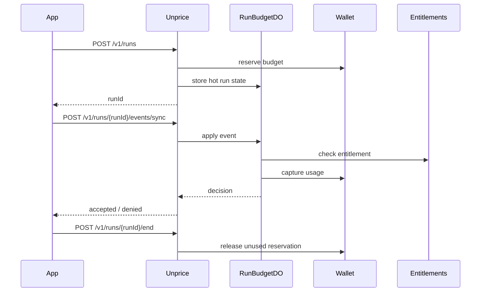

# Budgeted Run Metering

Unprice does not own your agents. Use `agentId` to label usage from your own system. Entitlements, budgets, invoices, and wallet reservations are evaluated at the customer level.

## API Overview

### Start a budgeted run

`POST /v1/runs`

A run is a temporary budget reservation against a customer. No agent registration is required.

### Apply a sync metered event

`POST /v1/runs/{runId}/events/sync`

Apply usage to a running budget. The customer and project are resolved from the stored run.

### End a run

`POST /v1/runs/{runId}/end`

End a running budget run and release unused reservation funds.

### Get a run

`GET /v1/runs/{runId}`

Get the current status and budget of a run.

## API Key Customer Binding

- If an API key has `defaultCustomerId`, it is bound to that customer
- A bound key cannot spend for a different customer (403)
- An unbound key requires explicit `customerId` in the request

## `agentId` Attribution

`agentId` is an optional string label on budget runs. Unprice does not validate or store agents. Use it to attribute usage to your own agent system.

## Sequence Diagram

