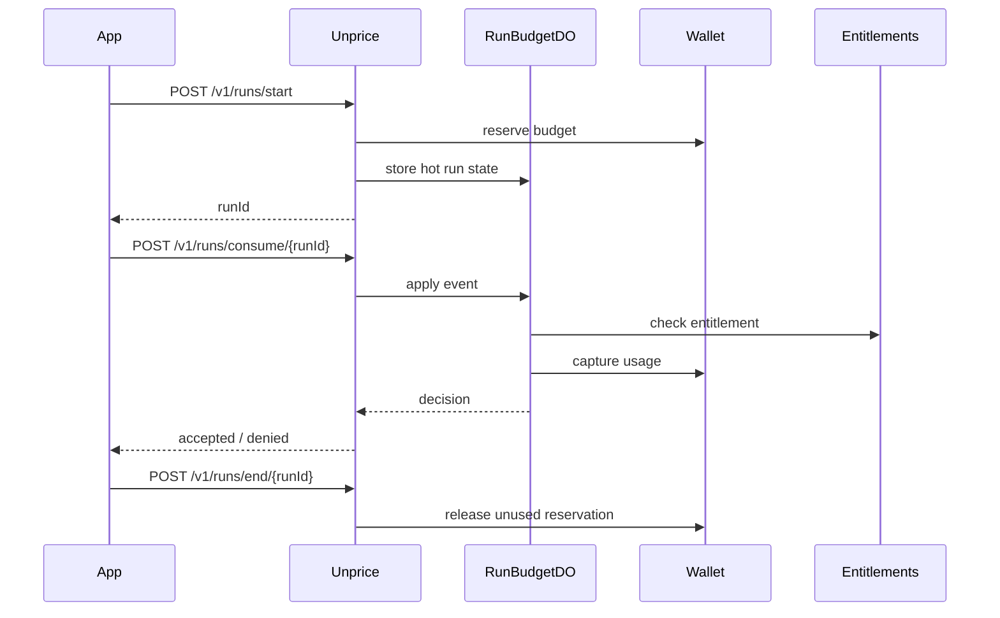

# Budgeted Run Metering

Unprice does not own your workloads. Use `workloadType` and `workloadId` to label usage from your own system. Entitlements, budgets, invoices, and wallet reservations are evaluated at the customer level.

## API Overview

### Start a budgeted run

`POST /v1/runs/start`

A run is a temporary budget reservation against a customer. No agent registration is required.

### Apply a sync metered event

`POST /v1/runs/consume/{runId}`

Apply usage to a running budget. The customer and project are resolved from the stored run.

### End a run

`POST /v1/runs/end/{runId}`

End a running budget run and release unused reservation funds.

### Get a run

`GET /v1/runs/get/{runId}`

Get the current status and budget of a run.

## API Key Customer Binding

- If an API key has `defaultCustomerId`, it is bound to that customer
- A bound key cannot spend for a different customer (403)
- An unbound key requires explicit `customerId` in the request

## Workload Attribution

`workloadType` and `workloadId` are optional string labels on budget runs. Unprice does not validate or store workloads. Use them to attribute usage to your own agent, job, workflow, or trace system.

## Reporting And Replay

Budget-run sync events use the ingestion reporting queue for analytics. The route waits until the reporting envelope is accepted by `INGESTION_REPORTING_QUEUE`; then the reporting consumer writes status rows and meter facts to Tinybird.

Budget-run sync events do not write the raw request payload to the raw async ingestion R2 path. Raw payload archival belongs to `/v1/usage/record`, where accepted events are queued for asynchronous processing and may need replay from raw storage. Run sync events are already synchronously applied behind a run idempotency key. Processed and rejected run sync outcomes are not replayable and therefore use `payload_json = null`.

If a run sync request fails before a final processed or rejected decision is returned, the client should retry with the same run id and idempotency key. `RunBudgetDO` and `EntitlementWindowDO` replay their idempotent result.

## Sequence Diagram

