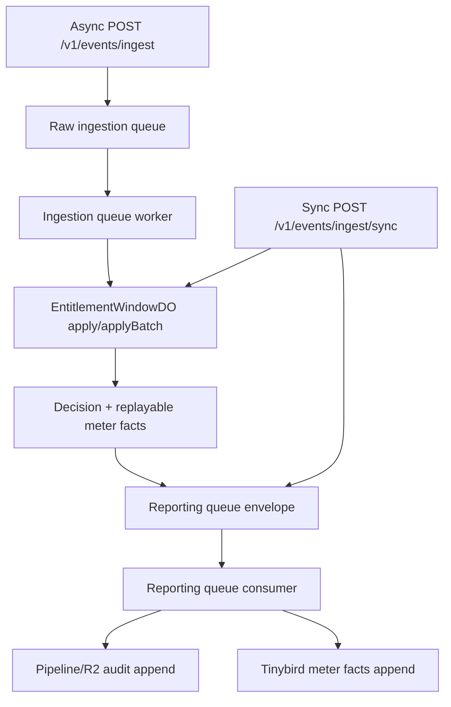

# Ingestion Reporting Observability

Use the API Axiom dataset configured by `AXIOM_DATASET`.

## Paths



`EntitlementWindowDO` is the only quota, wallet, compact usage, and idempotency state
machine. Reporting is append-only and at-least-once; duplicate delivery is handled by
deterministic audit identities and Tinybird `argMax(..., tuple(timestamp, created_at))`
reads.

## 1M Event Queue Cost

Current Cloudflare Queues pricing charges one operation per 64 KB chunk written, read, or
deleted. A successful queue delivery is usually three operations.

Assuming messages are under 64 KB and the account has no other Queue usage:

```text
sync 1M events:
  reporting queue = 1M messages * 3 operations = 3M operations
  billable operations = 3M - 1M included = 2M
  queue cost = 2M * $0.40/M = $0.80

async 1M events:
  raw queue = 1M messages * 3 operations = 3M operations
  reporting queue = reporting_envelope_count * 3 operations

  if batches average 100 raw events per reporting envelope:
    reporting envelopes ~= 10,000
    total operations ~= 3,030,000
    queue cost ~= (3.03M - 1M included) * $0.40/M = $0.81

  worst case, one reporting envelope per raw event:
    total operations = 6M
    queue cost = (6M - 1M included) * $0.40/M = $2.00
```

This is only the Queue line item. Worker requests/CPU, Durable Object requests/storage rows,
Pipeline sinks, and Tinybird compute/storage are workload-dependent. Track the ratios below to
replace assumptions with observed costs.

## Efficiency Query

Filter to ingestion reporting events:

```text
message in (
  "raw ingestion customer group",
  "ingestion reporting queue batch",
  "ingestion reporting enqueue failed",
  "ingestion reporting queue batch will retry"
)
```

Compute the cost and completeness ratios from the wide-event fields emitted by the
ingestion worker and reporting consumer:

```text
raw_events_per_reporting_envelope =
  sum(raw_event_count) / max(sum(reporting_envelope_count), 1)

meter_facts_per_tinybird_request =
  sum(reporting_meter_fact_count) / max(sum(reporting_tinybird_request_count), 1)

pipeline_records_per_pipeline_send =
  sum(reporting_pipeline_record_count) / max(count(reporting_pipeline_record_count > 0), 1)
```

Alert when `reporting_retry_count` or `reporting_enqueue_failure_count` is non-zero over the
same window.
