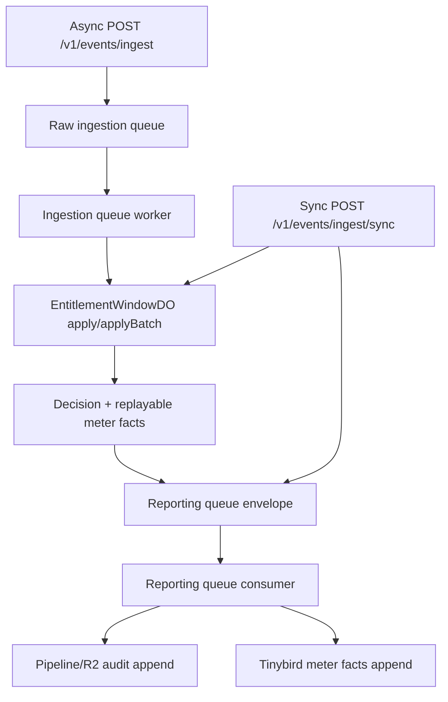

# Ingestion Reporting Observability

Use the API Axiom dataset configured by `AXIOM_DATASET`.

## Paths


```mermaid
flowchart TD
  Async["Async POST /v1/events/ingest"] --> RawQueue["Raw ingestion queue"]
  RawQueue --> Worker["Ingestion queue worker"]
  Worker --> EntitlementDO["EntitlementWindowDO apply/applyBatch"]
  EntitlementDO --> Decision["Decision + replayable meter facts"]
  Decision --> ReportingQueue["Reporting queue envelope"]
  ReportingQueue --> ReportingConsumer["Reporting queue consumer"]
  ReportingConsumer --> AuditLake["Pipeline/R2 audit append"]
  ReportingConsumer --> Tinybird["Tinybird meter facts append"]

  Sync["Sync POST /v1/events/ingest/sync"] --> EntitlementDO
  Sync --> ReportingQueue
```

`EntitlementWindowDO` is the only quota, wallet, compact usage, and idempotency state
machine. Reporting is append-only and at-least-once; duplicate delivery is handled by
deterministic audit identities and Tinybird `argMax(..., tuple(handled_at, created_at))`
reads.

## 1M Event Queue Cost

Current Cloudflare Queues pricing charges one operation per 64 KB chunk written, read, or
deleted. A successful queue delivery is usually three operations.

Assuming messages are under 64 KB and the account has no other Queue usage:

```text
sync 1M events:
  reporting queue = 1M messages * 3 operations = 3M operations
  billable operations = 3M - 1M included = 2M
  queue cost = 2M * $0.40/M = $0.80

async 1M events:
  raw queue = 1M messages * 3 operations = 3M operations
  reporting queue = reporting_envelope_count * 3 operations

  if batches average 100 raw events per reporting envelope:
    reporting envelopes ~= 10,000
    total operations ~= 3,030,000
    queue cost ~= (3.03M - 1M included) * $0.40/M = $0.81

  worst case, one reporting envelope per raw event:
    total operations = 6M
    queue cost = (6M - 1M included) * $0.40/M = $2.00
```

This is only the Queue line item. Worker requests/CPU, Durable Object requests/storage rows,
Pipeline sinks, and Tinybird compute/storage are workload-dependent. Track the ratios below to
replace assumptions with observed costs.

## Efficiency Query

Filter to ingestion reporting events:

```text
message in (
  "raw ingestion customer group",
  "ingestion reporting queue batch",
  "ingestion reporting enqueue failed",
  "ingestion reporting queue batch will retry"
)
```

Compute the cost and completeness ratios from the wide-event fields emitted by the
ingestion worker and reporting consumer:

```text
raw_events_per_reporting_envelope =
  sum(raw_event_count) / max(sum(reporting_envelope_count), 1)

meter_facts_per_tinybird_request =
  sum(reporting_meter_fact_count) / max(sum(reporting_tinybird_request_count), 1)

pipeline_records_per_pipeline_send =
  sum(reporting_pipeline_record_count) / max(count(reporting_pipeline_record_count > 0), 1)
```

## Reliability Controls

Queue consumers in production and preview use separate DLQs for raw ingestion and reporting
delivery. They also use `retry_delay = 60` so transient Cloudflare, Durable Object, Pipeline, or
Tinybird issues do not burn all retry attempts immediately.

Rejected ingestion rows are business outcomes. They should be queryable in the Events UI, but they
should not page an operator by default. The high-priority loss alerts and operator actions are
centralized under [Dead-letter Behavior](#dead-letter-behavior). Use these as supplemental early or
stalled-consumer signals:

- Cloudflare Queue backlog alert for `unprice-api-ingestion-dlq-prod`: fire when
  `backlog_count > 0` for two consecutive checks.
- Cloudflare Queue backlog alert for `unprice-api-ingestion-reporting-dlq-prod`: fire when
  `backlog_count > 0` for two consecutive checks.
- Axiom warning for raw queue retries:
  `message = "ingestion queue group processing failed"`.
- Axiom warning for reporting queue retries:
  `message = "ingestion reporting queue batch will retry"`.
- Axiom warning for Tinybird delivery failures:
  `error_message` contains `Tinybird entitlement meter facts ingestion failed` or
  `Tinybird ingestion events ingestion failed`.

Cloudflare Queue metrics expose backlog fields (`backlog_count`, `backlog_bytes`,
`oldest_message_timestamp_ms`) through the Queue metrics API. Use the prod DLQ queue IDs for the
two backlog alerts. If queue IDs are not stable in the alerting tool, match by queue name and keep
the policy names explicit.

Treat retry warnings without a DLQ backlog as low-priority signals that retries are absorbing a
transient issue. A DLQ backlog across two checks indicates that its consumer may be stalled.

## Dead-letter Behavior

- **Raw ingestion DLQ** (`unprice-api-ingestion-dlq-*`): consumed by the API worker
  (`IngestionDlqConsumer`). Each valid raw message is reported as a `failed`, `replayable: true`
  outcome with `failure_stage: raw_ingestion` and
  `failure_reason: dead_letter_exhausted_retries`. It appears in the Events UI with the standard
  Replay action only after the reporting enqueue succeeds. The `ingestion events dead-lettered`
  error event is sampled at 100%, so it is not sampled out.
- **Reporting DLQ** (`unprice-api-ingestion-reporting-dlq-*`): consumed by
  `ReportingDlqConsumer`. Envelopes are re-driven into the reporting queue up to 3
  times with growing delay (60s/120s/180s). After the cap the full envelope is logged
  at error level as `ingestion reporting envelope permanently failed` with
  `envelope_json`. Redrive failures also retain `envelope_json` for manual recovery.

Both DLQ consumers have `max_retries = 3` and no downstream DLQ. Persistent downstream failures
can exhaust those retries, and malformed messages are acknowledged to stop poison-message loops;
either path can discard the message.

### High-priority Alerts

Configure these exact selectors as page or high-priority Slack alerts:

- `message = "ingestion events dead-lettered"`: confirm valid raw failures reached the Events UI,
  then use the standard Replay action. If a row is absent, correlate the reporting-enqueue alert
  and recover or re-send the event from the original source.
- `message = "ingestion reporting envelope permanently failed"`: recover the retained
  `envelope_json` with the procedure below. This means customer-visible ingestion status was lost
  until recovery succeeds.
- `service = ingestion_dlq AND operation = "ingestion_dlq_reporting_enqueue"`: fix reporting
  enqueue immediately. These errors do not currently retain the full raw payload; page before
  retries are exhausted and recover or re-send the event from the original source if necessary.
- `service = ingestion_reporting_dlq AND operation = "ingestion_reporting_dlq_redrive"`: fix the
  main reporting queue and recover the retained `envelope_json` with the procedure below.
- `code = "MALFORMED_INGESTION_QUEUE_MESSAGE"`: fix the producer or schema mismatch and recover or
  re-send a corrected message from the original source; the malformed message is acknowledged and
  can be discarded.

### Duplicate Handling

A redriven reporting envelope can re-publish records to multiple sinks. Ingestion status endpoints
dedupe immediately at query time by `(project_id, customer_id, canonical_audit_id)` using `argMax`
with `tuple(handled_at, created_at)`. `unprice_ingestion_events` ReplacingMergeTree compaction is
eventual and uses its full sorting key.

Meter facts use the separate business identity `(project, customer, entitlement, period, feature,
grant, idempotency_key)` and eventual ReplacingMergeTree compaction; they do not dedupe on
`canonical_audit_id`. R2/Iceberg audit consumers MUST dedupe on `canonical_audit_id` at query time.

### DLQ Recovery

Use the [Cloudflare Queues HTTP Push API](https://developers.cloudflare.com/queues/examples/publish-to-a-queue-via-http/)
to recover a retained reporting envelope. Do not synthesize Tinybird status or meter fact rows.

1. Fix the root cause before re-sending the envelope.
2. Choose the environment and its destination main queue:
   `unprice-api-ingestion-reporting-{environment}`.
3. Obtain the Cloudflare account ID, the destination queue ID, and an API token with `Queues Edit`
   permission.
4. Read `envelope_json` from the terminal or redrive error and parse it into a JSON object.
5. Send an authenticated request:

   ```text
   POST https://api.cloudflare.com/client/v4/accounts/<account-id>/queues/<queue-id>/messages
   Authorization: Bearer <api-token>
   Content-Type: application/json

   { "body": <envelope-object> }
   ```

   Do not send `envelope_json` as a JSON string. The queue consumer expects an object, and schema
   parsing would acknowledge a string body as malformed.
6. Require HTTP `200` and a response body with `{ "success": true }` before treating the send as
   successful.
7. Verify that the DLQ backlog drains, redrive and terminal errors stop, Tinybird and reporting
   sinks update, and the expected Events UI status appears.

## Failed Event Replay

Replay uses Tinybird as the recovery index. The raw ingestion worker reports unexpected apply/rate
failures through the reporting queue as `state=failed`, `replayable=true`, and no meter facts. The
failed Tinybird row stores `payload_json` so replay does not wait for R2/Pipeline visibility.

`unprice_ingestion_events` keeps 60 days of Tinybird visibility so operators have enough room to
inspect failed and rejected customer-visible outcomes. Replay remains bounded by the 30-day
ingestion event-age window; extending Tinybird retention does not make old events safe to requeue.

The reporting queue remains the single writer for ingestion status rows. Rejected rows are business
outcomes and are not replayable by default. Failed rows are system outcomes and can be replayed from
the Events UI. R2 stores the accepted raw queue message once before enqueue as audit provenance;
replay still reads Tinybird `payload_json` for the immediate recovery path.
