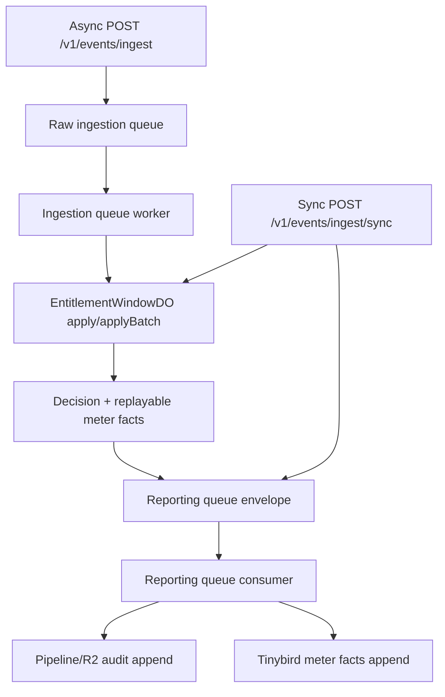

# Ingestion Reporting Observability

Use the API Axiom dataset configured by `AXIOM_DATASET`.

## Paths


```mermaid
flowchart TD
  Async["Async POST /v1/events/ingest"] --> RawQueue["Raw ingestion queue"]
  RawQueue --> Worker["Ingestion queue worker"]
  Worker --> EntitlementDO["EntitlementWindowDO apply/applyBatch"]
  EntitlementDO --> Decision["Decision + replayable meter facts"]
  Decision --> ReportingQueue["Reporting queue envelope"]
  ReportingQueue --> ReportingConsumer["Reporting queue consumer"]
  ReportingConsumer --> AuditLake["Pipeline/R2 audit append"]
  ReportingConsumer --> Tinybird["Tinybird meter facts append"]

  Sync["Sync POST /v1/events/ingest/sync"] --> EntitlementDO
  Sync --> ReportingQueue
```

`EntitlementWindowDO` is the only quota, wallet, compact usage, and idempotency state
machine. Reporting is append-only and at-least-once; duplicate delivery is handled by
deterministic audit identities and Tinybird `argMax(..., tuple(handled_at, created_at))`
reads.

## 1M Event Queue Cost

Current Cloudflare Queues pricing charges one operation per 64 KB chunk written, read, or
deleted. A successful queue delivery is usually three operations.

Assuming messages are under 64 KB and the account has no other Queue usage:

```text
sync 1M events:
  reporting queue = 1M messages * 3 operations = 3M operations
  billable operations = 3M - 1M included = 2M
  queue cost = 2M * $0.40/M = $0.80

async 1M events:
  raw queue = 1M messages * 3 operations = 3M operations
  reporting queue = reporting_envelope_count * 3 operations

  if batches average 100 raw events per reporting envelope:
    reporting envelopes ~= 10,000
    total operations ~= 3,030,000
    queue cost ~= (3.03M - 1M included) * $0.40/M = $0.81

  worst case, one reporting envelope per raw event:
    total operations = 6M
    queue cost = (6M - 1M included) * $0.40/M = $2.00
```

This is only the Queue line item. Worker requests/CPU, Durable Object requests/storage rows,
Pipeline sinks, and Tinybird compute/storage are workload-dependent. Track the ratios below to
replace assumptions with observed costs.

## Efficiency Query

Filter to ingestion reporting events:

```text
message in (
  "raw ingestion customer group",
  "ingestion reporting queue batch",
  "ingestion reporting enqueue failed",
  "ingestion reporting queue batch will retry"
)
```

Compute the cost and completeness ratios from the wide-event fields emitted by the
ingestion worker and reporting consumer:

```text
raw_events_per_reporting_envelope =
  sum(raw_event_count) / max(sum(reporting_envelope_count), 1)

meter_facts_per_tinybird_request =
  sum(reporting_meter_fact_count) / max(sum(reporting_tinybird_request_count), 1)

pipeline_records_per_pipeline_send =
  sum(reporting_pipeline_record_count) / max(count(reporting_pipeline_record_count > 0), 1)
```

## Reliability Controls

Queue consumers in production and preview use separate DLQs for raw ingestion and reporting
delivery. They also use `retry_delay = 60` so transient Cloudflare, Durable Object, Pipeline, or
Tinybird issues do not burn all retry attempts immediately.

Rejected ingestion rows are business outcomes. They should be queryable in the Events UI, but they
should not page an operator by default. Alert on failed delivery signals instead:

- Cloudflare Queue backlog alert for `unprice-api-ingestion-dlq-prod`: fire when
  `backlog_count > 0` for two consecutive checks.
- Cloudflare Queue backlog alert for `unprice-api-ingestion-reporting-dlq-prod`: fire when
  `backlog_count > 0` for two consecutive checks.
- Axiom warning for raw queue retries:
  `message = "ingestion queue group processing failed"`.
- Axiom warning for reporting queue retries:
  `message = "ingestion reporting queue batch will retry"`.
- Axiom warning for Tinybird delivery failures:
  `error_message` contains `Tinybird entitlement meter facts ingestion failed` or
  `Tinybird ingestion events ingestion failed`.

Cloudflare Queue metrics expose backlog fields (`backlog_count`, `backlog_bytes`,
`oldest_message_timestamp_ms`) through the Queue metrics API. Use the prod DLQ queue IDs for the
two backlog alerts. If queue IDs are not stable in the alerting tool, match by queue name and keep
the policy names explicit.

Recommended notification severity:

```text
DLQ backlog > 0:
  page or high-priority Slack; this is possible silent data loss until recovered.

Retry warnings without DLQ backlog:
  low-priority Slack; this is early signal that retries are absorbing a transient issue.
```

## DLQ Recovery

Do not add an automatic DLQ consumer yet. Recovery should be deliberate until failure modes are
boring and well classified.

1. Identify which DLQ has backlog.
2. Check the matching Axiom service:
   - `service = ingestion_queue` for `unprice-api-ingestion-dlq-prod`
   - `service = ingestion_reporting_queue` for `unprice-api-ingestion-reporting-dlq-prod`
3. Fix the root cause first: schema mismatch, Tinybird/Pipeline outage, Durable Object failure, or
   malformed message.
4. For reporting DLQ messages, requeue the original reporting envelope after the downstream sink is
   healthy. Do not manually synthesize Tinybird status or meter fact rows.
5. For raw ingestion DLQ messages, prefer the existing Events UI replay when the failed row is
   visible and replayable. If no failed row exists because reporting also failed, inspect and
   requeue the raw DLQ message only after the reporting path is healthy.
6. After recovery, confirm DLQ backlog returns to zero and the Events UI shows processed, rejected,
   or failed status rows for the affected time window.

## Failed Event Replay

Replay uses Tinybird as the recovery index. The raw ingestion worker reports unexpected apply/rate
failures through the reporting queue as `state=failed`, `replayable=true`, and no meter facts. The
failed Tinybird row stores `payload_json` so replay does not wait for R2/Pipeline visibility.

`unprice_ingestion_events` keeps 60 days of Tinybird visibility so operators have enough room to
inspect failed and rejected customer-visible outcomes. Replay remains bounded by the 30-day
ingestion event-age window; extending Tinybird retention does not make old events safe to requeue.

The reporting queue remains the single writer for ingestion status rows. Rejected rows are business
outcomes and are not replayable by default. Failed rows are system outcomes and can be replayed from
the Events UI. R2 stores the accepted raw queue message once before enqueue as audit provenance;
replay still reads Tinybird `payload_json` for the immediate recovery path.
