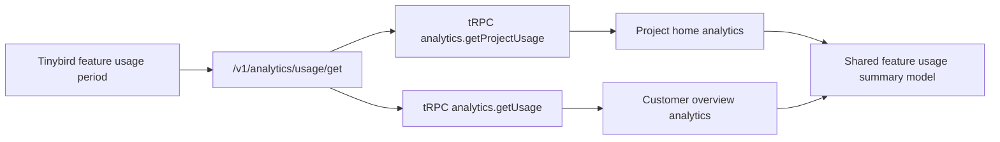

# Frontend Analytics Dashboards Implementation Plan

> **For agentic workers:** REQUIRED SUB-SKILL: Use superpowers:subagent-driven-development (recommended) or superpowers:executing-plans to implement this plan task-by-task. Steps use checkbox (`- [ ]`) syntax for tracking.

**Goal:** Replace the legacy project dashboard with a project home analytics dashboard, show feature usage and consumed spend, improve the customer analytics view, and remove the old lakehouse dashboard surface for now.

**Architecture:** Keep analytics reads behind existing tRPC adapters and the public `/v1/analytics/usage/get` SDK contract. The frontend owns presentation only: project home and customer overview both render the same feature-usage model, while old lakehouse pages/plans analytics routes and their tRPC/service adapters are removed when no longer referenced. No new Tinybird endpoints are needed because the current usage endpoint already returns `usage` plus `spending`.

**Tech Stack:** Next.js App Router, React Server Components, TanStack Query, tRPC, `@unprice/api`, `@unprice/analytics`, shadcn/ui components, Recharts, TypeScript, Vitest for existing non-Next test packages.

---

## Current State

- `apps/nextjs/src/app/(root)/dashboard/[workspaceSlug]/[projectSlug]/(overview)/page.tsx` redirects project home to `/<workspace>/<project>/dashboard`.
- `apps/nextjs/src/app/(root)/dashboard/[workspaceSlug]/[projectSlug]/dashboard/page.tsx` renders the current usage dashboard.
- `apps/nextjs/src/app/(root)/dashboard/[workspaceSlug]/[projectSlug]/dashboard/plans/page.tsx` and `dashboard/pages/page.tsx` are old lakehouse-style analytics surfaces.
- `internal/trpc/src/router/lambda/analytics/getProjectUsage.ts` and `getUsage.ts` call `unprice.analytics.usage.get`.
- `apps/api/src/routes/analytics/getUsageV1.ts` maps Tinybird `amount_after` to customer-facing `spending`, so the frontend should display this instead of recomputing money.
- `apps/nextjs/src/app/(root)/dashboard/[workspaceSlug]/[projectSlug]/customers/[customerId]/_components/usage/customer-metrics-panel.tsx` already renders customer usage but ignores `spending`.

## Target Data Flow



## File Structure

Create:

- `apps/nextjs/src/components/analytics/feature-usage-model.ts`  
  Pure frontend helpers for sorting usage rows, totaling usage, totaling display spend by currency, and deriving top feature rows.
- `apps/nextjs/src/components/analytics/feature-usage-panel.tsx`  
  Shared presentational client component used by project and customer analytics dashboards.
- `internal/trpc/src/router/lambda/analytics/getProjectUsage.test.ts`  
  Focused contract test that `getProjectUsage` still exposes SDK usage rows with `spending`.

Modify:

- `apps/nextjs/src/app/(root)/dashboard/[workspaceSlug]/[projectSlug]/(overview)/page.tsx`  
  Stop redirecting and render project home analytics directly.
- `apps/nextjs/src/app/(root)/dashboard/[workspaceSlug]/[projectSlug]/customers/[customerId]/(overview)/page.tsx`  
  Keep server loading, pass usage rows into the shared usage panel, and keep existing customer tabs/actions.
- `apps/nextjs/src/app/(root)/dashboard/[workspaceSlug]/[projectSlug]/customers/[customerId]/_components/usage/customer-metrics-panel.tsx`  
  Replace bespoke table/cards with the shared usage panel.
- `apps/nextjs/src/app/(root)/dashboard/[workspaceSlug]/_components/project-card.tsx`  
  Link project cards to `/<workspace>/<project>`.
- `apps/nextjs/src/app/(root)/dashboard/_components/project-switcher.tsx`  
  Route project switcher selections to `/<workspace>/<project>`.
- `apps/nextjs/src/constants/projects.ts`  
  Change project nav overview href from `/dashboard` to `/`.
- `internal/trpc/src/router/lambda/analytics/index.ts`  
  Remove old lakehouse procedures after deleting their frontend routes.
- `internal/services/src/analytics/service.ts` and `internal/services/src/context.ts`  
  Remove old page/plans analytics service methods and the now-unused `AnalyticsService` analytics client dependency.
- `internal/trpc/src/test.test.ts`  
  Strengthen the lakehouse cleanup test so removed procedure names cannot return.

Delete:

- `apps/nextjs/src/app/(root)/dashboard/[workspaceSlug]/[projectSlug]/dashboard/page.tsx`
- `apps/nextjs/src/app/(root)/dashboard/[workspaceSlug]/[projectSlug]/dashboard/plans/page.tsx`
- `apps/nextjs/src/app/(root)/dashboard/[workspaceSlug]/[projectSlug]/dashboard/pages/page.tsx`
- `apps/nextjs/src/app/(root)/dashboard/[workspaceSlug]/[projectSlug]/dashboard/_components/browsers.tsx`
- `apps/nextjs/src/app/(root)/dashboard/[workspaceSlug]/[projectSlug]/dashboard/_components/countries.tsx`
- `apps/nextjs/src/app/(root)/dashboard/[workspaceSlug]/[projectSlug]/dashboard/_components/page-visits.tsx`
- `apps/nextjs/src/app/(root)/dashboard/[workspaceSlug]/[projectSlug]/dashboard/_components/plans-convertion.tsx`
- `apps/nextjs/src/app/(root)/dashboard/[workspaceSlug]/[projectSlug]/dashboard/_components/plans-stats.tsx`
- `apps/nextjs/src/app/(root)/dashboard/[workspaceSlug]/[projectSlug]/dashboard/_components/plans/columns.tsx`
- `apps/nextjs/src/app/(root)/dashboard/[workspaceSlug]/[projectSlug]/dashboard/_components/plans/data-table-row-actions.tsx`
- `apps/nextjs/src/app/(root)/dashboard/[workspaceSlug]/[projectSlug]/dashboard/_components/tabs-dashboard.tsx`
- `apps/nextjs/src/app/(root)/dashboard/[workspaceSlug]/[projectSlug]/dashboard/_components/usage-stats.tsx`
- `internal/trpc/src/router/lambda/analytics/getBrowserVisits.ts`
- `internal/trpc/src/router/lambda/analytics/getCountryVisits.ts`
- `internal/trpc/src/router/lambda/analytics/getLatestEvents.ts`
- `internal/trpc/src/router/lambda/analytics/getPagesOverview.ts`
- `internal/trpc/src/router/lambda/analytics/getPlanClickBySessionId.ts`
- `internal/trpc/src/router/lambda/analytics/getPlansConversion.ts`
- `internal/trpc/src/router/lambda/analytics/getPlansStats.ts`

## Tasks

### Task 1: Lock The Usage Contract

**Files:**

- Create: `internal/trpc/src/router/lambda/analytics/getProjectUsage.test.ts`
- Modify: `internal/trpc/src/test.test.ts`

- [ ] **Step 1: Add the failing contract test**

Create `internal/trpc/src/router/lambda/analytics/getProjectUsage.test.ts` with:

```ts
import { readFileSync } from "node:fs"
import path from "node:path"
import { describe, expect, it } from "vitest"

describe("project usage analytics contract", () => {
  it("keeps project usage backed by the public usage endpoint with spending", () => {
    const projectUsageSource = readFileSync(path.resolve(__dirname, "getProjectUsage.ts"), "utf-8")
    const apiUsageSource = readFileSync(
      path.resolve(__dirname, "../../../../../../apps/api/src/routes/analytics/getUsageV1.ts"),
      "utf-8"
    )

    expect(projectUsageSource).toContain("unprice.analytics.usage.get")
    expect(projectUsageSource).toContain("project_id: projectId")
    expect(apiUsageSource).toContain("spending:")
    expect(apiUsageSource).toContain("display_amount")
  })
})
```

- [ ] **Step 2: Run the focused test and verify the path is wrong before fixing it**

Run:

```bash
pnpm --filter @unprice/trpc test -- src/router/lambda/analytics/getProjectUsage.test.ts
```

Expected: FAIL if the relative path to `apps/api/src/routes/analytics/getUsageV1.ts` is not correct from `internal/trpc/src/router/lambda/analytics`.

- [ ] **Step 3: Fix the API file path in the test**

Replace the `apiUsageSource` path with this computed repo-root path:

```ts
    const apiUsageSource = readFileSync(
      path.resolve(process.cwd(), "../../apps/api/src/routes/analytics/getUsageV1.ts"),
      "utf-8"
    )
```

- [ ] **Step 4: Run the focused test**

Run:

```bash
pnpm --filter @unprice/trpc test -- src/router/lambda/analytics/getProjectUsage.test.ts
```

Expected: PASS.

- [ ] **Step 5: Commit**

```bash
git add internal/trpc/src/router/lambda/analytics/getProjectUsage.test.ts
git commit -m "test: lock project usage analytics contract"
```

### Task 2: Create The Shared Feature Usage Model

**Files:**

- Create: `apps/nextjs/src/components/analytics/feature-usage-model.ts`

- [ ] **Step 1: Add the pure helper module**

Create `apps/nextjs/src/components/analytics/feature-usage-model.ts`:

```ts
import { nFormatter } from "@unprice/db/utils"

export type FeatureUsageSpending = {
  amount: string
  currency: string
  display_amount: string
}

export type FeatureUsageRow = {
  project_id: string
  customer_id?: string
  feature_slug: string
  usage: number
  spending?: FeatureUsageSpending
}

export type FeatureUsageSummary = {
  featureCount: number
  totalUsage: number
  topFeatureSlug: string
  topFeatureUsage: number
  totalSpendingByCurrency: { currency: string; amount: number; displayAmount: string }[]
}

export function sortFeatureUsageRows(rows: FeatureUsageRow[]): FeatureUsageRow[] {
  return [...rows].sort((a, b) => {
    if (b.usage !== a.usage) {
      return b.usage - a.usage
    }

    return a.feature_slug.localeCompare(b.feature_slug)
  })
}

export function summarizeFeatureUsage(rows: FeatureUsageRow[]): FeatureUsageSummary {
  const sortedRows = sortFeatureUsageRows(rows)
  const totals = new Map<string, number>()

  for (const row of sortedRows) {
    if (!row.spending) {
      continue
    }

    const parsedAmount = Number(row.spending.amount)

    if (!Number.isFinite(parsedAmount)) {
      continue
    }

    totals.set(row.spending.currency, (totals.get(row.spending.currency) ?? 0) + parsedAmount)
  }

  return {
    featureCount: sortedRows.length,
    totalUsage: sortedRows.reduce((sum, row) => sum + row.usage, 0),
    topFeatureSlug: sortedRows[0]?.feature_slug ?? "No feature",
    topFeatureUsage: sortedRows[0]?.usage ?? 0,
    totalSpendingByCurrency: [...totals.entries()].map(([currency, amount]) => ({
      currency,
      amount,
      displayAmount: `${new Intl.NumberFormat(undefined, {
        style: "currency",
        currency,
        maximumFractionDigits: 2,
      }).format(amount)}`,
    })),
  }
}

export function formatUsageValue(value: number): string {
  return nFormatter(value, { digits: 1 })
}

export function formatSpendingValue(row: FeatureUsageRow): string {
  return row.spending?.display_amount ?? "No spend"
}
```

- [ ] **Step 2: Typecheck the app**

Run:

```bash
pnpm --filter nextjs typecheck
```

Expected: PASS.

- [ ] **Step 3: Commit**

```bash
git add apps/nextjs/src/components/analytics/feature-usage-model.ts
git commit -m "feat: add shared feature usage model"
```

### Task 3: Create The Shared Feature Usage Panel

**Files:**

- Create: `apps/nextjs/src/components/analytics/feature-usage-panel.tsx`

- [ ] **Step 1: Add the shared panel component**

Create `apps/nextjs/src/components/analytics/feature-usage-panel.tsx`:

```tsx
"use client"

import { Badge } from "@unprice/ui/badge"
import { Card, CardContent, CardDescription, CardHeader, CardTitle } from "@unprice/ui/card"
import { BarChart3, Coins, Layers3, TriangleAlert } from "lucide-react"
import { EmptyPlaceholder } from "~/components/empty-placeholder"
import {
  type FeatureUsageRow,
  formatSpendingValue,
  formatUsageValue,
  sortFeatureUsageRows,
  summarizeFeatureUsage,
} from "./feature-usage-model"

type FeatureUsagePanelProps = {
  title: string
  description: string
  rows: FeatureUsageRow[]
  error?: string
  emptyTitle: string
  emptyDescription: string
}

export function FeatureUsagePanel(props: FeatureUsagePanelProps) {
  const { title, description, rows, error, emptyTitle, emptyDescription } = props
  const sortedRows = sortFeatureUsageRows(rows)
  const summary = summarizeFeatureUsage(sortedRows)
  const totalSpendLabel =
    summary.totalSpendingByCurrency.length === 0
      ? "No spend"
      : summary.totalSpendingByCurrency.map((item) => item.displayAmount).join(" + ")

  return (
    <Card className="overflow-hidden border-muted/60">
      <CardHeader>
        <CardTitle>{title}</CardTitle>
        <CardDescription>{description}</CardDescription>
      </CardHeader>
      <CardContent className="space-y-6">
        {error ? (
          <EmptyPlaceholder className="min-h-[260px] border border-dashed">
            <EmptyPlaceholder.Icon>
              <TriangleAlert className="h-8 w-8 opacity-60" />
            </EmptyPlaceholder.Icon>
            <EmptyPlaceholder.Title>Unable to load usage</EmptyPlaceholder.Title>
            <EmptyPlaceholder.Description>{error}</EmptyPlaceholder.Description>
          </EmptyPlaceholder>
        ) : sortedRows.length === 0 ? (
          <EmptyPlaceholder className="min-h-[260px] border border-dashed">
            <EmptyPlaceholder.Icon>
              <BarChart3 className="h-8 w-8 opacity-40" />
            </EmptyPlaceholder.Icon>
            <EmptyPlaceholder.Title>{emptyTitle}</EmptyPlaceholder.Title>
            <EmptyPlaceholder.Description>{emptyDescription}</EmptyPlaceholder.Description>
          </EmptyPlaceholder>
        ) : (
          <>
            <div className="grid gap-3 md:grid-cols-4">
              <div className="rounded-md border border-border bg-card p-4">
                <div className="mb-2 flex items-center justify-between">
                  <p className="text-muted-foreground text-xs">Features</p>
                  <Layers3 className="h-4 w-4 text-muted-foreground" />
                </div>
                <p className="font-semibold text-xl">{summary.featureCount}</p>
              </div>

              <div className="rounded-md border border-border bg-card p-4">
                <div className="mb-2 flex items-center justify-between">
                  <p className="text-muted-foreground text-xs">Usage</p>
                  <BarChart3 className="h-4 w-4 text-muted-foreground" />
                </div>
                <p className="font-semibold text-xl">{formatUsageValue(summary.totalUsage)}</p>
              </div>

              <div className="rounded-md border border-border bg-card p-4">
                <div className="mb-2 flex items-center justify-between">
                  <p className="text-muted-foreground text-xs">Consumed amount</p>
                  <Coins className="h-4 w-4 text-muted-foreground" />
                </div>
                <p className="truncate font-semibold text-xl">{totalSpendLabel}</p>
              </div>

              <div className="rounded-md border border-border bg-card p-4">
                <p className="text-muted-foreground text-xs">Top feature</p>
                <p className="mt-1 truncate font-semibold text-xl">{summary.topFeatureSlug}</p>
                <p className="text-muted-foreground text-xs">
                  {formatUsageValue(summary.topFeatureUsage)} used
                </p>
              </div>
            </div>

            <div className="overflow-hidden rounded-md border border-border">
              <div className="grid grid-cols-[minmax(0,1fr)_auto_auto] items-center gap-4 bg-muted/40 px-4 py-2.5">
                <p className="text-muted-foreground text-xs uppercase">Feature</p>
                <p className="text-right text-muted-foreground text-xs uppercase">Usage</p>
                <p className="text-right text-muted-foreground text-xs uppercase">Spend</p>
              </div>
              <div className="divide-y divide-border">
                {sortedRows.map((row) => (
                  <div
                    key={`${row.project_id}:${row.customer_id ?? "project"}:${row.feature_slug}`}
                    className="grid grid-cols-[minmax(0,1fr)_auto_auto] items-center gap-4 px-4 py-3"
                  >
                    <div className="flex min-w-0 items-center gap-2">
                      <BarChart3 className="h-4 w-4 shrink-0 text-muted-foreground" />
                      <span className="truncate font-medium text-sm">{row.feature_slug}</span>
                    </div>
                    <Badge variant="outline" className="justify-self-end font-mono text-xs">
                      {formatUsageValue(row.usage)}
                    </Badge>
                    <Badge variant="secondary" className="justify-self-end font-mono text-xs">
                      {formatSpendingValue(row)}
                    </Badge>
                  </div>
                ))}
              </div>
            </div>
          </>
        )}
      </CardContent>
    </Card>
  )
}
```

- [ ] **Step 2: Typecheck the app**

Run:

```bash
pnpm --filter nextjs typecheck
```

Expected: PASS.

- [ ] **Step 3: Commit**

```bash
git add apps/nextjs/src/components/analytics/feature-usage-panel.tsx
git commit -m "feat: add feature usage analytics panel"
```

### Task 4: Move Project Analytics To The Project Home

**Files:**

- Modify: `apps/nextjs/src/app/(root)/dashboard/[workspaceSlug]/[projectSlug]/(overview)/page.tsx`
- Modify: `apps/nextjs/src/app/(root)/dashboard/[workspaceSlug]/_components/project-card.tsx`
- Modify: `apps/nextjs/src/app/(root)/dashboard/_components/project-switcher.tsx`
- Modify: `apps/nextjs/src/constants/projects.ts`
- Delete: `apps/nextjs/src/app/(root)/dashboard/[workspaceSlug]/[projectSlug]/dashboard/page.tsx`
- Delete: `apps/nextjs/src/app/(root)/dashboard/[workspaceSlug]/[projectSlug]/dashboard/_components/overview-stats.tsx`
- Delete: `apps/nextjs/src/app/(root)/dashboard/[workspaceSlug]/[projectSlug]/dashboard/_components/usage-stats.tsx`
- Delete: `apps/nextjs/src/app/(root)/dashboard/[workspaceSlug]/[projectSlug]/dashboard/_components/tabs-dashboard.tsx`

- [ ] **Step 1: Replace the redirect with server-loaded analytics**

Replace `apps/nextjs/src/app/(root)/dashboard/[workspaceSlug]/[projectSlug]/(overview)/page.tsx` with:

```tsx
import { prepareInterval } from "@unprice/analytics"
import type { SearchParams } from "nuqs/server"
import { IntervalFilter } from "~/components/analytics/interval-filter"
import { FeatureUsagePanel } from "~/components/analytics/feature-usage-panel"
import { DashboardShell } from "~/components/layout/dashboard-shell"
import { intervalParams } from "~/lib/searchParams"
import { api } from "~/trpc/server"

export const dynamic = "force-dynamic"

export default async function ProjectOverviewPage(props: {
  params: { workspaceSlug: string; projectSlug: string }
  searchParams: SearchParams
}) {
  const filter = intervalParams(props.searchParams)
  const interval = prepareInterval(filter.intervalFilter)

  const usageSnapshot = await api.analytics
    .getProjectUsage({
      range: filter.intervalFilter,
    })
    .catch((error) => ({
      usage: [],
      error: error instanceof Error ? error.message : "Failed to load project usage",
    }))

  return (
    <DashboardShell>
      <div className="flex flex-col gap-3 md:flex-row md:items-center md:justify-between">
        <div>
          <h1 className="font-semibold text-xl">Project analytics</h1>
          <p className="text-muted-foreground text-sm">
            Feature consumption and rated spend for this project.
          </p>
        </div>
        <IntervalFilter className="md:ml-auto" />
      </div>

      <FeatureUsagePanel
        title="Feature usage"
        description={`Usage and consumed amount for the last ${interval.label}.`}
        rows={usageSnapshot.usage ?? []}
        error={usageSnapshot.error}
        emptyTitle="No project usage yet"
        emptyDescription="Feature consumption appears here once this project reports usage events."
      />
    </DashboardShell>
  )
}
```

- [ ] **Step 2: Point project cards at the project home**

In `apps/nextjs/src/app/(root)/dashboard/[workspaceSlug]/_components/project-card.tsx`, replace:

```tsx
<SuperLink href={`/${props.workspaceSlug}/${project.slug}/dashboard`}>
```

with:

```tsx
<SuperLink href={`/${props.workspaceSlug}/${project.slug}`}>
```

- [ ] **Step 3: Point project switcher selections at the project home**

In `apps/nextjs/src/app/(root)/dashboard/_components/project-switcher.tsx`, replace:

```ts
router.push(`/${project.workspace.slug}/${project.slug}/dashboard`)
```

with:

```ts
router.push(`/${project.workspace.slug}/${project.slug}`)
```

- [ ] **Step 4: Point the sidebar overview item at the project home**

In `apps/nextjs/src/constants/projects.ts`, replace:

```ts
    href: "/dashboard",
```

with:

```ts
    href: "/",
```

- [ ] **Step 5: Delete the old overview dashboard route and moved components**

Delete:

```text
apps/nextjs/src/app/(root)/dashboard/[workspaceSlug]/[projectSlug]/dashboard/page.tsx
apps/nextjs/src/app/(root)/dashboard/[workspaceSlug]/[projectSlug]/dashboard/_components/overview-stats.tsx
apps/nextjs/src/app/(root)/dashboard/[workspaceSlug]/[projectSlug]/dashboard/_components/usage-stats.tsx
apps/nextjs/src/app/(root)/dashboard/[workspaceSlug]/[projectSlug]/dashboard/_components/tabs-dashboard.tsx
```

- [ ] **Step 6: Verify no app code links to the deleted dashboard route**

Run:

```bash
rg -n "/dashboard|dashboard/" apps/nextjs/src/app/'(root)'/dashboard apps/nextjs/src/constants apps/nextjs/src/components/onboarding
```

Expected: No remaining project navigation links to `/${workspaceSlug}/${projectSlug}/dashboard`. Text such as “dashboard” in descriptions can remain.

- [ ] **Step 7: Typecheck the app**

Run:

```bash
pnpm --filter nextjs typecheck
```

Expected: PASS.

- [ ] **Step 8: Commit**

```bash
git add apps/nextjs/src/app/'(root)'/dashboard/'[workspaceSlug]'/'[projectSlug]'/'(overview)'/page.tsx apps/nextjs/src/app/'(root)'/dashboard/'[workspaceSlug]'/_components/project-card.tsx apps/nextjs/src/app/'(root)'/dashboard/_components/project-switcher.tsx apps/nextjs/src/constants/projects.ts apps/nextjs/src/app/'(root)'/dashboard/'[workspaceSlug]'/'[projectSlug]'/dashboard
git commit -m "feat: make project home the analytics dashboard"
```

### Task 5: Improve Customer Analytics

**Files:**

- Modify: `apps/nextjs/src/app/(root)/dashboard/[workspaceSlug]/[projectSlug]/customers/[customerId]/(overview)/page.tsx`
- Modify: `apps/nextjs/src/app/(root)/dashboard/[workspaceSlug]/[projectSlug]/customers/[customerId]/_components/usage/customer-metrics-panel.tsx`

- [ ] **Step 1: Replace the customer metrics panel implementation**

Replace `apps/nextjs/src/app/(root)/dashboard/[workspaceSlug]/[projectSlug]/customers/[customerId]/_components/usage/customer-metrics-panel.tsx` with:

```tsx
import type { RouterOutputs } from "@unprice/trpc/routes"
import { FeatureUsagePanel } from "~/components/analytics/feature-usage-panel"

type UsageRow = RouterOutputs["analytics"]["getUsage"]["usage"][number]

type CustomerMetricsPanelProps = {
  usageRows: UsageRow[]
  error?: string
}

export function CustomerMetricsPanel(props: CustomerMetricsPanelProps) {
  return (
    <FeatureUsagePanel
      title="Customer analytics"
      description="Feature usage and consumed amount for this customer over the last 30 days."
      rows={props.usageRows}
      error={props.error}
      emptyTitle="No customer usage yet"
      emptyDescription="Customer usage appears here after this customer reports feature consumption."
    />
  )
}
```

- [ ] **Step 2: Keep the customer page server load**

No route contract change is needed in `customers/[customerId]/(overview)/page.tsx`; keep this call:

```ts
  const usageSnapshot = await api.analytics
    .getUsage({
      customerId,
      range: "30d",
    })
    .catch((error) => ({
      usage: [],
      error: error instanceof Error ? error.message : "Failed to load usage metrics",
    }))
```

- [ ] **Step 3: Typecheck the app**

Run:

```bash
pnpm --filter nextjs typecheck
```

Expected: PASS.

- [ ] **Step 4: Commit**

```bash
git add apps/nextjs/src/app/'(root)'/dashboard/'[workspaceSlug]'/'[projectSlug]'/customers/'[customerId]'/_components/usage/customer-metrics-panel.tsx
git commit -m "feat: show customer usage spend"
```

### Task 6: Remove The Old Lakehouse Dashboard Frontend

**Files:**

- Delete: `apps/nextjs/src/app/(root)/dashboard/[workspaceSlug]/[projectSlug]/dashboard/plans/page.tsx`
- Delete: `apps/nextjs/src/app/(root)/dashboard/[workspaceSlug]/[projectSlug]/dashboard/pages/page.tsx`
- Delete: `apps/nextjs/src/app/(root)/dashboard/[workspaceSlug]/[projectSlug]/dashboard/_components/browsers.tsx`
- Delete: `apps/nextjs/src/app/(root)/dashboard/[workspaceSlug]/[projectSlug]/dashboard/_components/countries.tsx`
- Delete: `apps/nextjs/src/app/(root)/dashboard/[workspaceSlug]/[projectSlug]/dashboard/_components/page-visits.tsx`
- Delete: `apps/nextjs/src/app/(root)/dashboard/[workspaceSlug]/[projectSlug]/dashboard/_components/plans-convertion.tsx`
- Delete: `apps/nextjs/src/app/(root)/dashboard/[workspaceSlug]/[projectSlug]/dashboard/_components/plans-stats.tsx`
- Delete: `apps/nextjs/src/app/(root)/dashboard/[workspaceSlug]/[projectSlug]/dashboard/_components/plans/columns.tsx`
- Delete: `apps/nextjs/src/app/(root)/dashboard/[workspaceSlug]/[projectSlug]/dashboard/_components/plans/data-table-row-actions.tsx`

- [ ] **Step 1: Delete the old lakehouse route files and components**

Remove every file listed in this task.

- [ ] **Step 2: Verify the deleted frontend components are not imported**

Run:

```bash
rg -n "PlansConversion|PlansStats|PageVisits|Browsers|Countries|getPagesOverview|getCountryVisits|getBrowserVisits|getPlansConversion|getPlansStats" apps/nextjs/src
```

Expected: no matches.

- [ ] **Step 3: Typecheck the app**

Run:

```bash
pnpm --filter nextjs typecheck
```

Expected: PASS.

- [ ] **Step 4: Commit**

```bash
git add apps/nextjs/src/app/'(root)'/dashboard/'[workspaceSlug]'/'[projectSlug]'/dashboard
git commit -m "chore: remove legacy lakehouse dashboard frontend"
```

### Task 7: Remove Old Lakehouse tRPC And Service Adapters

**Files:**

- Modify: `internal/trpc/src/router/lambda/analytics/index.ts`
- Modify: `internal/services/src/analytics/service.ts`
- Modify: `internal/services/src/context.ts`
- Modify: `internal/trpc/src/test.test.ts`
- Delete: `internal/trpc/src/router/lambda/analytics/getBrowserVisits.ts`
- Delete: `internal/trpc/src/router/lambda/analytics/getCountryVisits.ts`
- Delete: `internal/trpc/src/router/lambda/analytics/getLatestEvents.ts`
- Delete: `internal/trpc/src/router/lambda/analytics/getPagesOverview.ts`
- Delete: `internal/trpc/src/router/lambda/analytics/getPlanClickBySessionId.ts`
- Delete: `internal/trpc/src/router/lambda/analytics/getPlansConversion.ts`
- Delete: `internal/trpc/src/router/lambda/analytics/getPlansStats.ts`

- [ ] **Step 1: Reduce the analytics router to active procedures**

Replace `internal/trpc/src/router/lambda/analytics/index.ts` with:

```ts
import { createTRPCRouter } from "#trpc"
import { getOverviewStats } from "./getOverviewStats"
import { getProjectUsage } from "./getProjectUsage"
import { getRealtimeTicket } from "./getRealtimeTicket"
import { getUsage } from "./getUsage"

export const analyticsRouter = createTRPCRouter({
  getUsage: getUsage,
  getProjectUsage: getProjectUsage,
  getOverviewStats: getOverviewStats,
  getRealtimeTicket: getRealtimeTicket,
})
```

- [ ] **Step 2: Delete old tRPC procedure files**

Delete every `internal/trpc/src/router/lambda/analytics/get*` file listed in this task.

- [ ] **Step 3: Remove old page/plans service methods**

In `internal/services/src/analytics/service.ts`, remove these methods:

```text
getPlansStats
getCountryVisits
getBrowserVisits
getPagesOverview
```

Then remove unused imports and constructor dependency so the top of the file starts like this:

```ts
import { type Interval, prepareInterval, type statsSchema } from "@unprice/analytics"
import type { Database } from "@unprice/db"
import { subscriptions } from "@unprice/db/schema"
import { calculateFlatPricePlan } from "@unprice/db/validators"
import { Err, FetchError, Ok, type Result, wrapResult } from "@unprice/error"
import type { Logger } from "@unprice/logs"
import { currencySymbol } from "@unprice/money"
import { type Dinero, add, dinero, toDecimal } from "dinero.js"
import * as currencies from "dinero.js/currencies"
import type { z } from "zod"
import { toErrorContext } from "../utils/log-context"
```

and the constructor starts like this:

```ts
export class AnalyticsService {
  private readonly db: Database
  private readonly logger: Logger

  constructor({ db, logger }: { db: Database; logger: Logger }) {
    this.db = db
    this.logger = logger
  }
```

- [ ] **Step 4: Update service graph construction**

In `internal/services/src/context.ts`, replace:

```ts
  const analytics = new AnalyticsService({
    db: deps.db,
    logger: deps.logger,
    analytics: deps.analytics,
  })
```

with:

```ts
  const analytics = new AnalyticsService({
    db: deps.db,
    logger: deps.logger,
  })
```

- [ ] **Step 5: Strengthen the existing lakehouse cleanup test**

Replace `internal/trpc/src/test.test.ts` with:

```ts
import { readFileSync } from "node:fs"
import path from "node:path"
import { describe, expect, it } from "vitest"

describe("analytics router", () => {
  it("registers analytics router without legacy lakehouse procedures", () => {
    const source = readFileSync(
      path.resolve(__dirname, "router/lambda/analytics/index.ts"),
      "utf-8"
    )

    expect(source).toContain("analyticsRouter")

    for (const deletedProcedureName of [
      "getLakehouseFilePlan",
      "getBrowserVisits",
      "getCountryVisits",
      "getLatestEvents",
      "getPagesOverview",
      "getPlanClickBySessionId",
      "getPlansConversion",
      "getPlansStats",
    ]) {
      expect(source).not.toContain(deletedProcedureName)
    }
  })
})
```

- [ ] **Step 6: Verify no deleted procedure names remain**

Run:

```bash
rg -n "getBrowserVisits|getCountryVisits|getLatestEvents|getPagesOverview|getPlanClickBySessionId|getPlansConversion|getPlansStats" internal/trpc/src internal/services/src apps/nextjs/src
```

Expected: no matches except the negative assertions in `internal/trpc/src/test.test.ts`.

- [ ] **Step 7: Run focused tests and typechecks**

Run:

```bash
pnpm --filter @unprice/trpc test
pnpm --filter @unprice/trpc typecheck
pnpm --filter @unprice/services typecheck
```

Expected: all PASS.

- [ ] **Step 8: Commit**

```bash
git add internal/trpc/src/router/lambda/analytics internal/trpc/src/test.test.ts internal/services/src/analytics/service.ts internal/services/src/context.ts
git commit -m "chore: remove legacy lakehouse analytics adapters"
```

### Task 8: Final Verification

**Files:**

- Verify: full changed set

- [ ] **Step 1: Search for dead dashboard links**

Run:

```bash
rg -n "/dashboard|dashboard/" apps/nextjs/src/app/'(root)'/dashboard apps/nextjs/src/constants
```

Expected: no project overview links to the deleted `/<workspace>/<project>/dashboard` route.

- [ ] **Step 2: Run targeted package checks**

Run:

```bash
pnpm --filter nextjs typecheck
pnpm --filter @unprice/trpc test
pnpm --filter @unprice/trpc typecheck
pnpm --filter @unprice/services typecheck
```

Expected: all PASS.

- [ ] **Step 3: Run repo validation**

Run:

```bash
pnpm validate
```

Expected: PASS. If it writes formatting changes, review them and commit only files related to this plan.

- [ ] **Step 4: Manual browser verification**

Start the app:

```bash
pnpm --filter nextjs dev
```

Open these routes with a real workspace and project:

```text
http://localhost:3000/<workspaceSlug>/<projectSlug>
http://localhost:3000/<workspaceSlug>/<projectSlug>/customers/<customerId>
```

Expected:

- Project home renders analytics without redirecting to `/dashboard`.
- Project feature table shows usage and consumed amount.
- Customer overview shows the same usage and consumed amount language.
- Visiting `http://localhost:3000/<workspaceSlug>/<projectSlug>/dashboard` returns the normal Next.js 404 for a deleted route.
- Sidebar Overview points to `/<workspaceSlug>/<projectSlug>`.

- [ ] **Step 5: Final commit**

```bash
git status --short
git commit -m "feat: redesign frontend analytics dashboards"
```

Use this final commit only if there are uncommitted changes from verification or formatting.

## Tradeoffs

- Keeping the public usage API as the source of truth avoids duplicating Tinybird money logic in the frontend. The tradeoff is that project home analytics still depends on the internal SDK key and API availability through tRPC.
- Deleting old lakehouse routes now reduces dashboard ambiguity. The tradeoff is losing pages/plans analytics until a new lakehouse product surface is designed.
- A shared feature usage panel keeps project and customer analytics consistent. The tradeoff is that any project-specific visualization has to be added through explicit props instead of local one-off markup.

## Self-Review

- Spec coverage: project home analytics is covered in Task 4, customer analytics in Task 5, old lakehouse removal in Tasks 6 and 7, amount consumed from features in Tasks 2 and 3.
- Placeholder scan: no deferred implementation markers are present.
- Type consistency: usage rows use the existing `project_id`, `customer_id`, `feature_slug`, `usage`, and `spending.display_amount` fields from `@unprice/analytics`.
