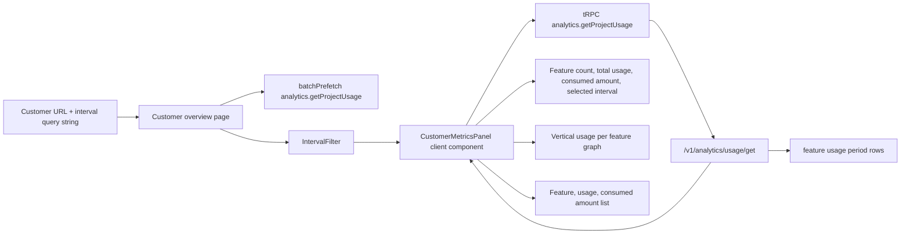

# Customer Usage Dashboard Implementation Plan

> **For agentic workers:** REQUIRED SUB-SKILL: Use superpowers:subagent-driven-development (recommended) or superpowers:executing-plans to implement this plan task-by-task. Steps use checkbox (`- [ ]`) syntax for tracking.

**Goal:** Build a simple, reactive customer usage dashboard that shows usage per feature, consumed amount per feature, and interval-filtered data for the selected customer.

**Architecture:** Keep the customer overview page as the owner of customer context, navigation, and the interval filter. Move usage rendering into a client component that calls the existing project-scoped `analytics.getProjectUsage` tRPC procedure with `customerId`, so the query is scoped by both active project and selected customer. Do not change Tinybird pipes, public API contracts, SDK contracts, project dashboards, subscription pages, invoice pages, or realtime panels.

**Tech Stack:** Next.js App Router, React client components, Suspense, TanStack Query, tRPC, `@unprice/analytics` interval filters, shadcn/ui components, Recharts, TypeScript.

---

## Scope

Keep:

- `apps/nextjs/src/app/(root)/dashboard/[workspaceSlug]/[projectSlug]/customers/[customerId]/(overview)/page.tsx` as the customer overview route.
- `apps/nextjs/src/app/(root)/dashboard/[workspaceSlug]/[projectSlug]/customers/[customerId]/_components/usage/customer-metrics-panel.tsx` as the only dashboard component changed for this pass.
- The existing tRPC procedure `analytics.getProjectUsage`; it already accepts `customerId` and uses the active project from `protectedProjectProcedure`.
- The existing public API response shape from `/v1/analytics/usage/get`, including `usage` and `spending`.

Delete from this plan:

- Project overview dashboard changes.
- Dashboard plans analytics.
- Dashboard pages analytics.
- Top-consumers analytics.
- Customer realtime analytics.
- Invoice analytics.
- Subscription analytics.
- Tinybird pipe changes.
- API SDK contract changes.

Do not delete source files. "Delete" here means remove the unrelated work from this implementation plan.

## Current State

- The customer overview page fetches usage on the server with:

```ts
api.analytics.getUsage({
  customerId,
  range: "30d",
})
```

- That is fixed to 30 days, not reactive to the dashboard interval filter, and does not use the active project-scoped analytics procedure.
- `CustomerMetricsPanel` receives static `usageRows` props and renders summary cards plus a feature usage list.
- `analytics.getProjectUsage` already has the right customer-scoped input:

```ts
z.object({
  customerId: z.string().optional(),
  range: analyticsIntervalSchema,
})
```

- `analytics.getProjectUsage` calls the public API with:

```ts
unprice.analytics.usage.get({
  ...(customerId ? { customer_id: customerId } : {}),
  project_id: projectId,
  range,
})
```

## Target Data Flow



## File Structure

Modify:

- `apps/nextjs/src/app/(root)/dashboard/[workspaceSlug]/[projectSlug]/customers/[customerId]/(overview)/page.tsx`  
  Add `searchParams`, interval parsing, server prefetch for the customer-scoped project usage query, `IntervalFilter`, `HydrateClient`, and a Suspense fallback.

- `apps/nextjs/src/app/(root)/dashboard/[workspaceSlug]/[projectSlug]/customers/[customerId]/_components/usage/customer-metrics-panel.tsx`  
  Convert to a client component. Query `analytics.getProjectUsage` with `customerId` and the active interval, then render summary cards, a usage-per-feature chart, and a feature usage plus consumed amount list.

Verify only:

- `internal/trpc/src/router/lambda/analytics/getProjectUsage.ts`  
  Confirm it remains the canonical customer-scoped project usage RPC.

- `apps/api/src/routes/analytics/getUsageV1.ts`  
  Confirm it still returns `spending.display_amount`.

Create:

- No new files.

Delete:

- No source files.

## Tasks

### Task 1: Verify Existing Customer-Scoped Usage Contract

**Files:**

- Verify: `internal/trpc/src/router/lambda/analytics/getProjectUsage.ts`
- Verify: `apps/api/src/routes/analytics/getUsageV1.ts`
- Verify: `apps/nextjs/src/app/(root)/dashboard/[workspaceSlug]/[projectSlug]/customers/[customerId]/(overview)/page.tsx`
- Verify: `apps/nextjs/src/app/(root)/dashboard/[workspaceSlug]/[projectSlug]/customers/[customerId]/_components/usage/customer-metrics-panel.tsx`

- [ ] **Step 1: Select the repo Node version**

Run:

```bash
nvm use
```

Expected: the shell switches to the Node version declared for the workspace.

- [ ] **Step 2: Confirm the existing project-scoped usage RPC accepts `customerId`**

Run:

```bash
rg -n "customerId|customer_id|project_id: projectId|unprice.analytics.usage.get" internal/trpc/src/router/lambda/analytics/getProjectUsage.ts
```

Expected: output includes `customerId: z.string().optional()`, `customer_id: customerId`, and `project_id: projectId`.

- [ ] **Step 3: Confirm the public API returns spending**

Run:

```bash
rg -n "spending|display_amount|amount_after|formatMoney" apps/api/src/routes/analytics/getUsageV1.ts
```

Expected: output includes `spending`, `display_amount`, `amount_after`, and `formatMoney`.

- [ ] **Step 4: Confirm the current customer page still has the fixed server usage call**

Run:

```bash
rg -n "getUsage|range: \"30d\"|CustomerMetricsPanel" apps/nextjs/src/app/'(root)'/dashboard/'[workspaceSlug]'/'[projectSlug]'/customers/'[customerId]'/'(overview)'/page.tsx
```

Expected: output includes `getUsage`, `range: "30d"`, and `CustomerMetricsPanel`.

- [ ] **Step 5: Confirm the current customer panel receives static usage rows**

Run:

```bash
rg -n "usageRows|RouterOutputs|CustomerMetricsPanelProps" apps/nextjs/src/app/'(root)'/dashboard/'[workspaceSlug]'/'[projectSlug]'/customers/'[customerId]'/_components/usage/customer-metrics-panel.tsx
```

Expected: output includes `usageRows: UsageRow[]`.

- [ ] **Step 6: Commit**

No commit is needed for verification-only work.

### Task 2: Make The Customer Overview Page Filter-Aware

**Files:**

- Modify: `apps/nextjs/src/app/(root)/dashboard/[workspaceSlug]/[projectSlug]/customers/[customerId]/(overview)/page.tsx`
- Modify: `apps/nextjs/src/app/(root)/dashboard/[workspaceSlug]/[projectSlug]/customers/[customerId]/_components/usage/customer-metrics-panel.tsx`

- [ ] **Step 1: Replace the customer overview page**

Replace the full contents of `apps/nextjs/src/app/(root)/dashboard/[workspaceSlug]/[projectSlug]/customers/[customerId]/(overview)/page.tsx` with:

```tsx
import { Button } from "@unprice/ui/button"
import { TabNavigation, TabNavigationLink } from "@unprice/ui/tabs-navigation"
import { Code } from "lucide-react"
import { notFound } from "next/navigation"
import type { SearchParams } from "nuqs/server"
import { Suspense } from "react"
import { CodeApiSheet } from "~/components/code-api-sheet"
import { IntervalFilter } from "~/components/analytics/interval-filter"
import { DashboardShell } from "~/components/layout/dashboard-shell"
import HeaderTab from "~/components/layout/header-tab"
import { SuperLink } from "~/components/super-link"
import { intervalParams } from "~/lib/searchParams"
import { api, batchPrefetch, HydrateClient, trpc } from "~/trpc/server"
import { ANALYTICS_CONFIG_REALTIME } from "~/trpc/shared"
import { CustomerActions } from "../../_components/customers/customer-actions"
import {
  CustomerMetricsPanel,
  CustomerMetricsPanelSkeleton,
} from "../_components/usage/customer-metrics-panel"

export const dynamic = "force-dynamic"

export default async function CustomerUsagePage({
  params,
  searchParams,
}: {
  params: {
    workspaceSlug: string
    projectSlug: string
    customerId: string
  }
  searchParams: SearchParams
}) {
  const { workspaceSlug, projectSlug, customerId } = params
  const baseUrl = `/${workspaceSlug}/${projectSlug}/customers/${customerId}`
  const filter = intervalParams(searchParams)

  const { customer } = await api.customers.getSubscriptions({
    customerId,
  })

  if (!customer) {
    notFound()
  }

  batchPrefetch([
    trpc.analytics.getProjectUsage.queryOptions(
      {
        customerId,
        range: filter.intervalFilter,
      },
      {
        ...ANALYTICS_CONFIG_REALTIME,
      }
    ),
  ])

  return (
    <DashboardShell
      header={
        <HeaderTab
          title={customer.email}
          description={customer.description}
          label={customer.active ? "active" : "inactive"}
          id={customer.id}
          action={
            <div className="flex items-center gap-2">
              <CodeApiSheet defaultMethod="getUsage">
                <Button variant={"ghost"}>
                  <Code className="mr-2 h-4 w-4" />
                  API
                </Button>
              </CodeApiSheet>
              <CustomerActions customer={customer} />
            </div>
          }
        />
      }
    >
      <div className="flex flex-col gap-4 md:flex-row md:items-center md:justify-between">
        <TabNavigation>
          <div className="flex items-center">
            <TabNavigationLink asChild active>
              <SuperLink href={`${baseUrl}`}>Overview</SuperLink>
            </TabNavigationLink>
            <TabNavigationLink asChild>
              <SuperLink href={`${baseUrl}/subscriptions`}>Subscriptions</SuperLink>
            </TabNavigationLink>
            <TabNavigationLink asChild>
              <SuperLink href={`${baseUrl}/invoices`}>Invoices</SuperLink>
            </TabNavigationLink>
          </div>
        </TabNavigation>

        <IntervalFilter className="md:ml-auto" />
      </div>

      <HydrateClient>
        <Suspense fallback={<CustomerMetricsPanelSkeleton />}>
          <CustomerMetricsPanel customerId={customerId} />
        </Suspense>
      </HydrateClient>
    </DashboardShell>
  )
}
```

- [ ] **Step 2: Replace the customer metrics panel with a reactive baseline**

Replace the full contents of `apps/nextjs/src/app/(root)/dashboard/[workspaceSlug]/[projectSlug]/customers/[customerId]/_components/usage/customer-metrics-panel.tsx` with:

```tsx
"use client"

import { useSuspenseQuery } from "@tanstack/react-query"
import { nFormatter } from "@unprice/db/utils"
import { Badge } from "@unprice/ui/badge"
import { Card, CardContent, CardDescription, CardHeader, CardTitle } from "@unprice/ui/card"
import { Skeleton } from "@unprice/ui/skeleton"
import { BarChart3, CalendarRange, Layers3, TriangleAlert } from "lucide-react"
import { EmptyPlaceholder } from "~/components/empty-placeholder"
import { useIntervalFilter } from "~/hooks/use-filter"
import { useQueryInvalidation } from "~/hooks/use-query-invalidation"
import { useTRPC } from "~/trpc/client"
import { ANALYTICS_CONFIG_REALTIME } from "~/trpc/shared"

type CustomerMetricsPanelProps = {
  customerId: string
}

function formatUsage(value: number): string {
  return nFormatter(value, { digits: 1 })
}

export function CustomerMetricsPanelSkeleton() {
  return (
    <Card>
      <CardHeader>
        <CardTitle>Customer usage</CardTitle>
        <CardDescription>Loading customer usage metrics...</CardDescription>
      </CardHeader>
      <CardContent className="space-y-6">
        <div className="grid gap-4 md:grid-cols-3">
          {["features", "usage", "interval"].map((item) => (
            <div key={`customer-usage-skeleton-${item}`} className="rounded-lg border p-4">
              <Skeleton className="h-4 w-28" />
              <Skeleton className="mt-3 h-8 w-20" />
            </div>
          ))}
        </div>
        <Skeleton className="h-[220px] w-full" />
      </CardContent>
    </Card>
  )
}

function CustomerMetricsErrorState({ error }: { error: string }) {
  return (
    <Card>
      <CardHeader>
        <CardTitle>Customer usage</CardTitle>
        <CardDescription>Usage analytics could not be loaded right now.</CardDescription>
      </CardHeader>
      <CardContent>
        <EmptyPlaceholder className="h-[220px] w-auto border border-dashed">
          <EmptyPlaceholder.Icon>
            <TriangleAlert className="h-8 w-8 opacity-60" />
          </EmptyPlaceholder.Icon>
          <EmptyPlaceholder.Title>Unable to load usage</EmptyPlaceholder.Title>
          <EmptyPlaceholder.Description>{error}</EmptyPlaceholder.Description>
        </EmptyPlaceholder>
      </CardContent>
    </Card>
  )
}

function CustomerMetricsEmptyState({ intervalLabel }: { intervalLabel: string }) {
  return (
    <Card>
      <CardHeader>
        <CardTitle>Customer usage</CardTitle>
        <CardDescription>Usage for this customer in the {intervalLabel}.</CardDescription>
      </CardHeader>
      <CardContent>
        <EmptyPlaceholder className="h-[220px] w-auto border border-dashed">
          <EmptyPlaceholder.Icon>
            <BarChart3 className="h-8 w-8 opacity-30" />
          </EmptyPlaceholder.Icon>
          <EmptyPlaceholder.Title>No usage metrics yet</EmptyPlaceholder.Title>
          <EmptyPlaceholder.Description>
            No usage data was reported for this customer in the selected window.
          </EmptyPlaceholder.Description>
        </EmptyPlaceholder>
      </CardContent>
    </Card>
  )
}

export function CustomerMetricsPanel({ customerId }: CustomerMetricsPanelProps) {
  const [intervalFilter] = useIntervalFilter()
  const trpc = useTRPC()
  const isNearRealtime = intervalFilter.intervalDays === 1

  const {
    data: usage,
    dataUpdatedAt,
    isFetching,
  } = useSuspenseQuery(
    trpc.analytics.getProjectUsage.queryOptions(
      {
        customerId,
        range: intervalFilter.name,
      },
      {
        ...ANALYTICS_CONFIG_REALTIME,
        staleTime: isNearRealtime ? 30 * 1000 : 0,
        refetchInterval: isNearRealtime ? 60 * 1000 : (false as const),
        refetchOnWindowFocus: false,
      }
    )
  )

  useQueryInvalidation({
    paramKey: intervalFilter.name,
    dataUpdatedAt,
    isFetching,
    getQueryKey: (param) => [
      ["analytics", "getProjectUsage"],
      {
        input: {
          customerId,
          range: param,
        },
        type: "query",
      },
    ],
  })

  if (usage.error) {
    return <CustomerMetricsErrorState error={usage.error} />
  }

  const sortedUsage = [...usage.usage].sort((a, b) => {
    if (b.usage !== a.usage) {
      return b.usage - a.usage
    }

    return a.feature_slug.localeCompare(b.feature_slug)
  })

  if (sortedUsage.length === 0) {
    return <CustomerMetricsEmptyState intervalLabel={intervalFilter.label} />
  }

  const featureCount = sortedUsage.length
  const totalLatestUsage = sortedUsage.reduce((sum, row) => sum + row.usage, 0)

  return (
    <Card>
      <CardHeader>
        <CardTitle>Customer usage</CardTitle>
        <CardDescription>Usage for this customer in the {intervalFilter.label}.</CardDescription>
      </CardHeader>

      <CardContent className="space-y-6">
        <div className="grid gap-4 md:grid-cols-3">
          <div className="rounded-lg border border-border bg-card p-4">
            <div className="flex items-center justify-between">
              <p className="text-muted-foreground text-sm">Features with usage</p>
              <Layers3 className="h-4 w-4 text-muted-foreground" />
            </div>
            <p className="mt-1 font-semibold text-2xl text-foreground">{featureCount}</p>
          </div>

          <div className="rounded-lg border border-border bg-card p-4">
            <div className="flex items-center justify-between">
              <p className="text-muted-foreground text-sm">Total latest usage</p>
              <BarChart3 className="h-4 w-4 text-muted-foreground" />
            </div>
            <p className="mt-1 font-semibold text-2xl text-foreground">
              {formatUsage(totalLatestUsage)}
            </p>
          </div>

          <div className="rounded-lg border border-border bg-card p-4">
            <div className="flex items-center justify-between">
              <p className="text-muted-foreground text-sm">Selected interval</p>
              <CalendarRange className="h-4 w-4 text-muted-foreground" />
            </div>
            <p className="mt-1 font-semibold text-foreground text-xl capitalize">
              {intervalFilter.label}
            </p>
          </div>
        </div>

        <div className="overflow-hidden rounded-lg border border-border">
          <div className="grid grid-cols-[minmax(0,1fr)_auto] items-center bg-muted/40 px-4 py-2.5">
            <p className="text-muted-foreground text-xs uppercase tracking-wide">Feature</p>
            <p className="text-right text-muted-foreground text-xs uppercase tracking-wide">
              Usage
            </p>
          </div>

          <div className="divide-y divide-border">
            {sortedUsage.map((row) => (
              <div
                key={`${row.project_id}:${row.customer_id ?? customerId}:${row.feature_slug}`}
                className="grid grid-cols-[minmax(0,1fr)_auto] items-center gap-4 px-4 py-3"
              >
                <div className="flex min-w-0 items-center gap-2">
                  <BarChart3 className="h-4 w-4 shrink-0 text-muted-foreground" />
                  <span className="truncate font-medium text-sm">{row.feature_slug}</span>
                </div>
                <Badge variant="outline" className="justify-self-end font-mono text-xs">
                  {formatUsage(row.usage)}
                </Badge>
              </div>
            ))}
          </div>
        </div>
      </CardContent>
    </Card>
  )
}
```

- [ ] **Step 3: Typecheck the reactive baseline**

Run:

```bash
pnpm --filter nextjs typecheck
```

Expected: PASS.

- [ ] **Step 4: Commit**

```bash
git add apps/nextjs/src/app/'(root)'/dashboard/'[workspaceSlug]'/'[projectSlug]'/customers/'[customerId]'/'(overview)'/page.tsx apps/nextjs/src/app/'(root)'/dashboard/'[workspaceSlug]'/'[projectSlug]'/customers/'[customerId]'/_components/usage/customer-metrics-panel.tsx
git commit -m "feat: make customer usage dashboard reactive"
```

### Task 3: Add The Usage Graph And Consumed Amounts

**Files:**

- Modify: `apps/nextjs/src/app/(root)/dashboard/[workspaceSlug]/[projectSlug]/customers/[customerId]/_components/usage/customer-metrics-panel.tsx`

- [ ] **Step 1: Replace the customer metrics panel with the final simple dashboard**

Replace the full contents of `apps/nextjs/src/app/(root)/dashboard/[workspaceSlug]/[projectSlug]/customers/[customerId]/_components/usage/customer-metrics-panel.tsx` with:

```tsx
"use client"

import { useSuspenseQuery } from "@tanstack/react-query"
import { nFormatter } from "@unprice/db/utils"
import { formatMoney } from "@unprice/money"
import type { RouterOutputs } from "@unprice/trpc/routes"
import { Card, CardContent, CardDescription, CardHeader, CardTitle } from "@unprice/ui/card"
import {
  type ChartConfig,
  ChartContainer,
  ChartTooltip,
  ChartTooltipContent,
} from "@unprice/ui/chart"
import { Skeleton } from "@unprice/ui/skeleton"
import { BarChart3, CalendarRange, Coins, Layers3, TriangleAlert } from "lucide-react"
import { Bar, BarChart, LabelList, XAxis, YAxis } from "recharts"
import { EmptyPlaceholder } from "~/components/empty-placeholder"
import { useIntervalFilter } from "~/hooks/use-filter"
import { useQueryInvalidation } from "~/hooks/use-query-invalidation"
import { useTRPC } from "~/trpc/client"
import { ANALYTICS_CONFIG_REALTIME } from "~/trpc/shared"

type UsageRow = RouterOutputs["analytics"]["getProjectUsage"]["usage"][number]

type CustomerMetricsPanelProps = {
  customerId: string
}

type SpendingSummary = {
  currency: string
  amount: number
  displayAmount: string
}

const chartConfig = {
  usage: {
    label: "Usage",
    color: "var(--chart-4)",
  },
} satisfies ChartConfig

function formatUsage(value: number): string {
  return nFormatter(value, { digits: 1 })
}

function parseSpendingAmount(row: UsageRow): number {
  const amount = Number(row.spending.amount)
  return Number.isFinite(amount) ? amount : 0
}

function roundToTwoDecimals(value: string): string {
  const num = Number.parseFloat(value)

  if (!Number.isFinite(num)) {
    return value
  }

  return num.toFixed(2)
}

function summarizeSpending(rows: UsageRow[]): SpendingSummary[] {
  const totalsByCurrency = new Map<string, number>()

  for (const row of rows) {
    const currency = row.spending.currency
    totalsByCurrency.set(currency, (totalsByCurrency.get(currency) ?? 0) + parseSpendingAmount(row))
  }

  return [...totalsByCurrency.entries()].map(([currency, amount]) => ({
    currency,
    amount,
    displayAmount: formatMoney(roundToTwoDecimals(amount.toString()), currency),
  }))
}

function formatSpendingSummary(summary: SpendingSummary[]): string {
  if (summary.length === 0) {
    return "No spend"
  }

  return summary.map((item) => item.displayAmount).join(" + ")
}

function formatFeatureSpending(row: UsageRow): string {
  return formatMoney(roundToTwoDecimals(row.spending.amount), row.spending.currency)
}

export function CustomerMetricsPanelSkeleton() {
  return (
    <Card>
      <CardHeader>
        <CardTitle>Customer usage</CardTitle>
        <CardDescription>Loading customer usage metrics...</CardDescription>
      </CardHeader>
      <CardContent className="space-y-6">
        <div className="grid gap-4 md:grid-cols-4">
          {["features", "usage", "consumed", "interval"].map((item) => (
            <div key={`customer-usage-skeleton-${item}`} className="rounded-lg border p-4">
              <Skeleton className="h-4 w-28" />
              <Skeleton className="mt-3 h-8 w-20" />
            </div>
          ))}
        </div>
        <Skeleton className="h-[260px] w-full" />
        <Skeleton className="h-[220px] w-full" />
      </CardContent>
    </Card>
  )
}

function CustomerMetricsErrorState({ error }: { error: string }) {
  return (
    <Card>
      <CardHeader>
        <CardTitle>Customer usage</CardTitle>
        <CardDescription>Usage analytics could not be loaded right now.</CardDescription>
      </CardHeader>
      <CardContent>
        <EmptyPlaceholder className="h-[220px] w-auto border border-dashed">
          <EmptyPlaceholder.Icon>
            <TriangleAlert className="h-8 w-8 opacity-60" />
          </EmptyPlaceholder.Icon>
          <EmptyPlaceholder.Title>Unable to load usage</EmptyPlaceholder.Title>
          <EmptyPlaceholder.Description>{error}</EmptyPlaceholder.Description>
        </EmptyPlaceholder>
      </CardContent>
    </Card>
  )
}

function CustomerMetricsEmptyState({ intervalLabel }: { intervalLabel: string }) {
  return (
    <Card>
      <CardHeader>
        <CardTitle>Customer usage</CardTitle>
        <CardDescription>Usage for this customer in the {intervalLabel}.</CardDescription>
      </CardHeader>
      <CardContent>
        <EmptyPlaceholder className="h-[220px] w-auto border border-dashed">
          <EmptyPlaceholder.Icon>
            <BarChart3 className="h-8 w-8 opacity-30" />
          </EmptyPlaceholder.Icon>
          <EmptyPlaceholder.Title>No usage metrics yet</EmptyPlaceholder.Title>
          <EmptyPlaceholder.Description>
            No usage data was reported for this customer in the selected window.
          </EmptyPlaceholder.Description>
        </EmptyPlaceholder>
      </CardContent>
    </Card>
  )
}

export function CustomerMetricsPanel({ customerId }: CustomerMetricsPanelProps) {
  const [intervalFilter] = useIntervalFilter()
  const trpc = useTRPC()
  const isNearRealtime = intervalFilter.intervalDays === 1

  const {
    data: usage,
    dataUpdatedAt,
    isFetching,
  } = useSuspenseQuery(
    trpc.analytics.getProjectUsage.queryOptions(
      {
        customerId,
        range: intervalFilter.name,
      },
      {
        ...ANALYTICS_CONFIG_REALTIME,
        staleTime: isNearRealtime ? 30 * 1000 : 0,
        refetchInterval: isNearRealtime ? 60 * 1000 : (false as const),
        refetchOnWindowFocus: false,
      }
    )
  )

  useQueryInvalidation({
    paramKey: intervalFilter.name,
    dataUpdatedAt,
    isFetching,
    getQueryKey: (param) => [
      ["analytics", "getProjectUsage"],
      {
        input: {
          customerId,
          range: param,
        },
        type: "query",
      },
    ],
  })

  if (usage.error) {
    return <CustomerMetricsErrorState error={usage.error} />
  }

  const sortedUsage = [...usage.usage].sort((a, b) => {
    if (b.usage !== a.usage) {
      return b.usage - a.usage
    }

    return a.feature_slug.localeCompare(b.feature_slug)
  })

  if (sortedUsage.length === 0) {
    return <CustomerMetricsEmptyState intervalLabel={intervalFilter.label} />
  }

  const totalLatestUsage = sortedUsage.reduce((sum, row) => sum + row.usage, 0)
  const spendingSummary = summarizeSpending(sortedUsage)
  const consumedAmountLabel = formatSpendingSummary(spendingSummary)
  const chartData = sortedUsage.map((row) => ({
    feature: row.feature_slug,
    usage: row.usage,
    spending: formatFeatureSpending(row),
  }))
  const chartHeight = Math.max(220, Math.min(chartData.length * 58, 420))

  return (
    <Card>
      <CardHeader>
        <CardTitle>Customer usage</CardTitle>
        <CardDescription>Usage for this customer in the {intervalFilter.label}.</CardDescription>
      </CardHeader>

      <CardContent className="space-y-6">
        <div className="grid gap-4 md:grid-cols-4">
          <div className="rounded-lg border border-border bg-card p-4">
            <div className="flex items-center justify-between">
              <p className="text-muted-foreground text-sm">Features with usage</p>
              <Layers3 className="h-4 w-4 text-muted-foreground" />
            </div>
            <p className="mt-1 font-semibold text-2xl text-foreground">{sortedUsage.length}</p>
          </div>

          <div className="rounded-lg border border-border bg-card p-4">
            <div className="flex items-center justify-between">
              <p className="text-muted-foreground text-sm">Total latest usage</p>
              <BarChart3 className="h-4 w-4 text-muted-foreground" />
            </div>
            <p className="mt-1 font-semibold text-2xl text-foreground">
              {formatUsage(totalLatestUsage)}
            </p>
          </div>

          <div className="rounded-lg border border-border bg-card p-4">
            <div className="flex items-center justify-between">
              <p className="text-muted-foreground text-sm">Consumed amount</p>
              <Coins className="h-4 w-4 text-muted-foreground" />
            </div>
            <p className="mt-1 truncate font-semibold text-foreground text-xl">
              {consumedAmountLabel}
            </p>
          </div>

          <div className="rounded-lg border border-border bg-card p-4">
            <div className="flex items-center justify-between">
              <p className="text-muted-foreground text-sm">Selected interval</p>
              <CalendarRange className="h-4 w-4 text-muted-foreground" />
            </div>
            <p className="mt-1 font-semibold text-foreground text-xl capitalize">
              {intervalFilter.label}
            </p>
          </div>
        </div>

        <div className="overflow-hidden rounded-lg border border-border p-3 sm:p-4">
          <p className="mb-3 text-muted-foreground text-xs uppercase tracking-wide">
            Usage per feature
          </p>
          <ChartContainer config={chartConfig} height={chartHeight} className="w-full">
            <BarChart
              accessibilityLayer
              data={chartData}
              layout="vertical"
              margin={{
                left: 0,
                right: 80,
                top: 10,
                bottom: 10,
              }}
              barGap={5}
              barCategoryGap={3}
            >
              <YAxis
                dataKey="feature"
                type="category"
                tickLine={false}
                tickMargin={10}
                width={120}
                axisLine={false}
                tickFormatter={(value) =>
                  value?.length > 15 ? `${value.slice(0, 15)}...` : value
                }
              />
              <XAxis dataKey="usage" type="number" hide />
              <ChartTooltip cursor={false} content={<ChartTooltipContent indicator="dot" />} />
              <Bar
                dataKey="usage"
                layout="vertical"
                radius={5}
                fill="var(--color-usage)"
                maxBarSize={25}
                activeBar={{
                  opacity: 0.5,
                }}
              >
                <LabelList
                  dataKey="usage"
                  position="right"
                  offset={8}
                  className="fill-foreground"
                  fontSize={12}
                  formatter={(value: number) => formatUsage(value)}
                />
              </Bar>
            </BarChart>
          </ChartContainer>
        </div>

        <div className="overflow-hidden rounded-lg border border-border">
          <div className="grid grid-cols-[minmax(0,1fr)_6rem_7rem] items-center gap-4 bg-muted/40 px-4 py-2.5">
            <p className="text-muted-foreground text-xs uppercase tracking-wide">Feature</p>
            <p className="text-right text-muted-foreground text-xs uppercase tracking-wide">
              Usage
            </p>
            <p className="text-right text-muted-foreground text-xs uppercase tracking-wide">
              Consumed
            </p>
          </div>

          <div className="divide-y divide-border">
            {chartData.map((row) => (
              <div
                key={`${customerId}:${row.feature}`}
                className="grid grid-cols-[minmax(0,1fr)_6rem_7rem] items-center gap-4 px-4 py-3"
              >
                <div className="flex min-w-0 items-center gap-2">
                  <BarChart3 className="h-4 w-4 shrink-0 text-muted-foreground" />
                  <span className="truncate font-medium text-sm">{row.feature}</span>
                </div>
                <span className="text-right font-mono text-muted-foreground text-sm tabular-nums">
                  {formatUsage(row.usage)}
                </span>
                <span className="text-right font-mono text-sm tabular-nums">{row.spending}</span>
              </div>
            ))}
          </div>
        </div>
      </CardContent>
    </Card>
  )
}
```

- [ ] **Step 2: Typecheck the final customer dashboard**

Run:

```bash
pnpm --filter nextjs typecheck
```

Expected: PASS.

- [ ] **Step 3: Commit**

```bash
git add apps/nextjs/src/app/'(root)'/dashboard/'[workspaceSlug]'/'[projectSlug]'/customers/'[customerId]'/_components/usage/customer-metrics-panel.tsx
git commit -m "feat: show customer usage and consumed amounts"
```

### Task 4: Verify Scope And Behavior

**Files:**

- Verify: `apps/nextjs/src/app/(root)/dashboard/[workspaceSlug]/[projectSlug]/customers/[customerId]/(overview)/page.tsx`
- Verify: `apps/nextjs/src/app/(root)/dashboard/[workspaceSlug]/[projectSlug]/customers/[customerId]/_components/usage/customer-metrics-panel.tsx`
- Verify: `internal/trpc/src/router/lambda/analytics/getProjectUsage.ts`

- [ ] **Step 1: Confirm only the customer dashboard source files changed**

Run:

```bash
git diff --name-status -- apps/nextjs/src/app/'(root)'/dashboard/'[workspaceSlug]'/'[projectSlug]'
```

Expected: output includes only these source files:

```text
M	apps/nextjs/src/app/(root)/dashboard/[workspaceSlug]/[projectSlug]/customers/[customerId]/(overview)/page.tsx
M	apps/nextjs/src/app/(root)/dashboard/[workspaceSlug]/[projectSlug]/customers/[customerId]/_components/usage/customer-metrics-panel.tsx
```

- [ ] **Step 2: Confirm project dashboard files are untouched**

Run:

```bash
git diff --name-status -- apps/nextjs/src/app/'(root)'/dashboard/'[workspaceSlug]'/'[projectSlug]'/dashboard
```

Expected: no output.

- [ ] **Step 3: Confirm the customer usage query is project-scoped and customer-filtered**

Run:

```bash
rg -n "getProjectUsage.queryOptions|customerId|range: intervalFilter.name" apps/nextjs/src/app/'(root)'/dashboard/'[workspaceSlug]'/'[projectSlug]'/customers/'[customerId]'/_components/usage/customer-metrics-panel.tsx
```

Expected: output includes `getProjectUsage.queryOptions`, `customerId`, and `range: intervalFilter.name`.

- [ ] **Step 4: Run the focused typecheck**

Run:

```bash
pnpm --filter nextjs typecheck
```

Expected: PASS.

- [ ] **Step 5: Run repository validation**

Run:

```bash
pnpm validate
```

Expected: PASS.

- [ ] **Step 6: Manual browser verification**

Start the app:

```bash
pnpm --filter nextjs dev
```

Open:

```text
http://localhost:3000/<workspaceSlug>/<projectSlug>/customers/<customerId>
```

Expected:

- The page still shows the customer header, API button, customer actions, and tabs.
- The interval filter is visible next to the customer tabs.
- Changing the interval updates the URL query string and refetches the panel data.
- The panel shows `Features with usage`, `Total latest usage`, `Consumed amount`, and `Selected interval`.
- The graph shows usage per feature for the selected customer.
- The list shows each feature with usage and consumed amount.
- `/customers/<customerId>/subscriptions` and `/customers/<customerId>/invoices` still open.
- The project dashboard at `/<workspaceSlug>/<projectSlug>/dashboard` is unchanged.

- [ ] **Step 7: Commit validation fixes only if needed**

If `pnpm validate` rewrites formatting for the two intended source files, commit those source changes:

```bash
git add apps/nextjs/src/app/'(root)'/dashboard/'[workspaceSlug]'/'[projectSlug]'/customers/'[customerId]'/'(overview)'/page.tsx apps/nextjs/src/app/'(root)'/dashboard/'[workspaceSlug]'/'[projectSlug]'/customers/'[customerId]'/_components/usage/customer-metrics-panel.tsx
git commit -m "chore: format customer usage dashboard"
```

Expected: no commit is created when validation makes no source changes.

## Tradeoffs

- Reusing `analytics.getProjectUsage` is the smallest reliable path because it already applies the active project scope and can pass `customerId` to the public usage API. The tradeoff is that this dashboard remains a current-window feature summary, not a deeper drilldown.
- Keeping the graph as usage-only avoids mixing units and money on one chart axis. The tradeoff is that consumed amount appears in the summary card and list rather than as a second chart series.
- Leaving Tinybird, API, and SDK contracts untouched keeps the change frontend-focused. The tradeoff is that any future richer customer analytics, such as timeseries spend, should get a separate plan.
- Keeping the work inside the customer overview avoids churn in project dashboards, pages analytics, plans analytics, invoices, subscriptions, and realtime panels.

## Self-Review

- Spec coverage: the plan focuses only on the customer dashboard, adds reactive tRPC usage loading, applies the selected customer scope, adds interval filters, shows a usage graph, and lists usage plus consumed amount per feature.
- Placeholder scan: no deferred implementation markers are present.
- Type consistency: page props pass `customerId`; `CustomerMetricsPanelProps` accepts `customerId`; the query uses `analytics.getProjectUsage` with `customerId` and `range`; usage rows use `feature_slug`, `usage`, and `spending`.
- Scope check: unrelated dashboards are removed from this plan and verified as untouched source paths.
