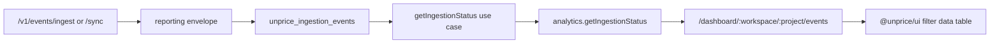

# Ingestion Events Analytics Implementation Plan

> **For agentic workers:** REQUIRED SUB-SKILL: Use superpowers:subagent-driven-development (recommended) or superpowers:executing-plans to implement this plan task-by-task. Steps use checkbox (`- [ ]`) syntax for tracking.

**Goal:** Add a simple project-level dashboard page where customers can see recently ingested events and whether each event was processed or rejected.

**Architecture:** Use the existing ingestion reporting path as the source of truth: reporting envelopes -> `unprice_ingestion_events` in Tinybird -> `getIngestionStatus` use case -> tRPC -> Next.js dashboard. Widen the current customer-scoped ingestion status contract so a sidebar page can show project-wide events, with optional filters for customer, state, source, and event slug. Use the OpenStatus shadcn data-table block as the reference implementation, then adapt the smallest useful version into `@unprice/ui` as a reusable filterable table shell; keep URL state, tRPC, and project-specific data fetching in `apps/nextjs`.

**Tech Stack:** Tinybird pipes/tests, `@unprice/analytics`, Zod, Hono OpenAPI route, `@unprice/services` use case, tRPC, Next.js App Router, TanStack Query, TanStack Table, `nuqs`, shadcn/ui components, OpenStatus data-table registry reference.

---

## Source Notes

- Current source of truth already exists: `internal/analytics/datasources/unprice_ingestion_events.datasource`.
- Current API route already exists: `apps/api/src/routes/analytics/getIngestionStatusV1.ts`.
- Current service use case already exists: `internal/services/src/use-cases/analytics/get-ingestion-status.ts`.
- Current app table foundation already exists: `apps/nextjs/src/components/data-table/data-table.tsx` and `apps/nextjs/src/hooks/use-data-table-url-state.ts`.
- Current design-system table foundation already exists: `internal/ui/src/data-table.tsx`, exported as `@unprice/ui/data-table`.
- OpenStatus registry block to inspect: `pnpm dlx shadcn@latest add https://data-table.openstatus.dev/r/data-table.json`. The registry block includes more than this feature needs: search, checkbox, slider, date range filters, sorting, infinite scroll, virtualization, and in-memory state management. For this pass, keep only search, checkbox filters, date range control, sorting, row tinting, and a filter rail.
- UI target from the referenced screenshot: keep the left filter rail, top search field, dense event rows, status color, and rejected-row tint. Skip histogram bars, live toggle, timing phases, regions, and advanced controls for the first version.
- Use `pnpm dlx`, not `npx`, when implementing in this repo.
- Do not touch `internal/lakehouse`, `apps/api/src/ingestion`, or lakehouse pipeline generation. Cleanup is limited to frontend lakehouse/DuckDB surfaces and stale references.
- Realtime cleanup is frontend/package-only for this plan: remove the customer realtime panel, realtime interval filter/query-state helpers, and `@unprice/react` realtime exports. Do not remove backend realtime ticket routes or public API endpoints in this pass.
- Removing `@unprice/react` realtime exports is a breaking package surface change. Keep that change explicit by updating package exports, dependencies, and README in the same cleanup commit.

## File Structure

**Tinybird and analytics contract**
- Modify: `internal/analytics/src/validators.ts`
- Modify: `internal/analytics/endpoints/v1_get_ingestion_live.pipe`
- Modify: `internal/analytics/endpoints/v1_get_ingestion_recent.pipe`
- Modify: `internal/analytics/endpoints/v1_get_ingestion_rejections.pipe`
- Modify: `internal/analytics/tests/v1_get_ingestion_live.yaml`
- Modify: `internal/analytics/tests/v1_get_ingestion_recent.yaml`
- Modify: `internal/analytics/tests/v1_get_ingestion_rejections.yaml`

**Service and API**
- Modify: `internal/services/src/use-cases/analytics/get-ingestion-status.ts`
- Modify: `internal/services/src/use-cases/analytics/get-ingestion-status.test.ts`
- Modify: `apps/api/src/routes/analytics/getIngestionStatusV1.ts`
- Modify: `apps/api/src/routes/analytics/getIngestionStatusV1.test.ts`
- Regenerate or update: `packages/api/src/openapi.d.ts`
- Regenerate or update: `apps/docs/openapi.json`

**tRPC**
- Create: `internal/trpc/src/router/lambda/analytics/getIngestionStatus.ts`
- Modify: `internal/trpc/src/router/lambda/analytics/index.ts`
- Modify: `internal/trpc/src/test.test.ts`

**Design system table**
- Create: `internal/ui/src/filter-data-table.tsx`
- Modify: `internal/ui/package.json`

**Frontend**
- Create: `apps/nextjs/src/app/(root)/dashboard/[workspaceSlug]/[projectSlug]/events/page.tsx`
- Create: `apps/nextjs/src/app/(root)/dashboard/[workspaceSlug]/[projectSlug]/events/_components/ingestion-events-panel.tsx`
- Create: `apps/nextjs/src/app/(root)/dashboard/[workspaceSlug]/[projectSlug]/events/_components/ingestion-events-table-schema.tsx`
- Modify: `apps/nextjs/src/constants/projects.ts`
- Modify: `apps/nextjs/src/lib/searchParams.ts` only if typed filter parsing needs a helper export.
- Delete if tracked or populated during implementation: `apps/nextjs/src/app/(root)/dashboard/[workspaceSlug]/[projectSlug]/lakehouse/**`
- Delete: `apps/nextjs/src/app/(root)/dashboard/[workspaceSlug]/[projectSlug]/customers/[customerId]/_components/realtime/realtime-panel.tsx`
- Delete: `apps/nextjs/src/components/analytics/realtime-interval-filter.tsx`

**React package realtime cleanup**
- Delete: `packages/react/src/realtime.tsx`
- Delete: `packages/react/src/provider.tsx`
- Delete: `packages/react/src/feature.tsx`
- Modify: `packages/react/src/index.ts`
- Modify: `packages/react/src/context.tsx`
- Modify: `packages/react/package.json`
- Modify: `packages/react/README.md`

## Data Flow



---

### Task 1: Make Tinybird Ingestion Status Project-Scoped

**Files:**
- Modify: `internal/analytics/src/validators.ts`
- Modify: `internal/analytics/endpoints/v1_get_ingestion_live.pipe`
- Modify: `internal/analytics/endpoints/v1_get_ingestion_recent.pipe`
- Modify: `internal/analytics/endpoints/v1_get_ingestion_rejections.pipe`
- Modify: `internal/analytics/tests/v1_get_ingestion_live.yaml`
- Modify: `internal/analytics/tests/v1_get_ingestion_recent.yaml`
- Modify: `internal/analytics/tests/v1_get_ingestion_rejections.yaml`

- [ ] **Step 1: Add failing Tinybird tests for project-wide reads**

Append these cases to `internal/analytics/tests/v1_get_ingestion_recent.yaml`:

```yaml
- name: ingestion_recent_project_wide_returns_multiple_customers
  description: Returns recent ingestion rows across customers when customer_id is omitted
  parameters: project_id=proj_1&from_ts=4070908800000&to_ts=4070995200000&limit=10
  expected_result: |
    {"event_id":"evt_ing_004","canonical_audit_id":"audit_ing_004","customer_id":"cus_2","event_slug":"usage.recorded","source_type":"api_key","source_id":"key_2","state":"processed","rejection_reason":null,"timestamp":4070908804000,"received_at":4070908804100,"handled_at":4070908804200}
    {"event_id":"evt_ing_003","canonical_audit_id":"audit_ing_003","customer_id":"cus_1","event_slug":"entitlement.checked","source_type":"system","source_id":"system","state":"rejected","rejection_reason":"customer_not_found","timestamp":4070908803000,"received_at":4070908803100,"handled_at":4070908803200}
    {"event_id":"evt_ing_002_duplicate_delivery","canonical_audit_id":"audit_ing_002","customer_id":"cus_1","event_slug":"usage.recorded","source_type":"api_key","source_id":"key_1","state":"rejected","rejection_reason":"missing_required_property","timestamp":4070908802000,"received_at":4070908802100,"handled_at":4070908802200}
    {"event_id":"evt_ing_001","canonical_audit_id":"audit_ing_001","customer_id":"cus_1","event_slug":"usage.recorded","source_type":"api_key","source_id":"key_1","state":"processed","rejection_reason":null,"timestamp":4070908801000,"received_at":4070908801100,"handled_at":4070908801200}

- name: ingestion_recent_filters_by_state
  description: Returns only rejected rows when state=rejected
  parameters: project_id=proj_1&from_ts=4070908800000&to_ts=4070995200000&state=rejected&limit=10
  expected_result: |
    {"event_id":"evt_ing_003","canonical_audit_id":"audit_ing_003","customer_id":"cus_1","event_slug":"entitlement.checked","source_type":"system","source_id":"system","state":"rejected","rejection_reason":"customer_not_found","timestamp":4070908803000,"received_at":4070908803100,"handled_at":4070908803200}
    {"event_id":"evt_ing_002_duplicate_delivery","canonical_audit_id":"audit_ing_002","customer_id":"cus_1","event_slug":"usage.recorded","source_type":"api_key","source_id":"key_1","state":"rejected","rejection_reason":"missing_required_property","timestamp":4070908802000,"received_at":4070908802100,"handled_at":4070908802200}
```

Append this case to `internal/analytics/tests/v1_get_ingestion_live.yaml`:

```yaml
- name: ingestion_live_project_wide_counts
  description: Returns processed and rejected counts across customers when customer_id is omitted
  parameters: project_id=proj_1&from_ts=4070908800000&to_ts=4070995200000
  expected_result: |
    {"second":"2099-01-01 00:00:01.000","processed":1,"rejected":0,"total":1}
    {"second":"2099-01-01 00:00:02.000","processed":0,"rejected":1,"total":1}
    {"second":"2099-01-01 00:00:03.000","processed":0,"rejected":1,"total":1}
    {"second":"2099-01-01 00:00:04.000","processed":1,"rejected":0,"total":1}
```

Append this case to `internal/analytics/tests/v1_get_ingestion_rejections.yaml`:

```yaml
- name: ingestion_rejections_project_wide
  description: Returns rejection groups across customers when customer_id is omitted
  parameters: project_id=proj_1&from_ts=4070908800000&to_ts=4070995200000
  expected_result: |
    {"rejection_reason":"customer_not_found","event_slug":"entitlement.checked","source_id":"system","source_type":"system","event_count":1,"last_seen_at":4070908803200}
    {"rejection_reason":"missing_required_property","event_slug":"usage.recorded","source_id":"key_1","source_type":"api_key","event_count":1,"last_seen_at":4070908802200}
```

- [ ] **Step 2: Run Tinybird tests and confirm they fail**

Run from the repo root:

```bash
cd internal/analytics && tb test run v1_get_ingestion_recent
cd internal/analytics && tb test run v1_get_ingestion_live
cd internal/analytics && tb test run v1_get_ingestion_rejections
```

Expected: the new project-wide cases fail because the pipes require `customer_id`.

- [ ] **Step 3: Update analytics query validators**

In `internal/analytics/src/validators.ts`, replace the ingestion status query schemas with this shape:

```ts
export const ingestionStatusWindowQuerySchema = z.object({
  project_id: z.string(),
  customer_id: z.string().optional(),
  from_ts: z.number().int(),
  to_ts: z.number().int(),
})

export const ingestionStateFilterSchema = z.enum(["processed", "rejected"])

export const ingestionLiveQuerySchema = ingestionStatusWindowQuerySchema.extend({
  source_id: z.string().optional(),
  event_slug: z.string().optional(),
  state: ingestionStateFilterSchema.optional(),
})

export const ingestionRejectionsQuerySchema = ingestionStatusWindowQuerySchema.extend({
  source_id: z.string().optional(),
  event_slug: z.string().optional(),
  state: ingestionStateFilterSchema.optional(),
  limit: z.number().int().min(1).max(100).default(50),
})

export const ingestionRecentQuerySchema = ingestionStatusWindowQuerySchema.extend({
  source_id: z.string().optional(),
  event_slug: z.string().optional(),
  state: ingestionStateFilterSchema.optional(),
  limit: z.number().int().min(1).max(100).default(50),
})
```

Ensure `ingestionRecentEventRowSchema` keeps `customer_id` by adding it to the `pick` list:

```ts
export const ingestionRecentEventRowSchema = ingestionEventSchemaV1
  .pick({
    event_id: true,
    canonical_audit_id: true,
    customer_id: true,
    event_slug: true,
    source_type: true,
    source_id: true,
    state: true,
    rejection_reason: true,
    timestamp: true,
    received_at: true,
    handled_at: true,
  })
  .extend({
    rejection_reason: z.string().nullable(),
  })
```

- [ ] **Step 4: Update Tinybird pipes**

In all three ingestion pipes, replace the hard customer filter:

```sql
AND customer_id = {{ String(customer_id) }}
```

with this optional filter:

```sql
 AND customer_id = {{ String(customer_id) }} 
```

In `internal/analytics/endpoints/v1_get_ingestion_live.pipe`, add `state` to the inner query and outer filter:

```sql
argMax(state, created_at) AS state,
```

```sql
 AND state = {{ String(state) }} 
```

In `internal/analytics/endpoints/v1_get_ingestion_recent.pipe`, add this outer filter after the existing `event_slug` filter:

```sql
 AND state = {{ String(state) }} 
```

In `internal/analytics/endpoints/v1_get_ingestion_rejections.pipe`, add this outer filter after `AND state = 'rejected'`:

```sql
 AND state = {{ String(state) }} 
```

- [ ] **Step 5: Run Tinybird tests and typecheck**

Run:

```bash
cd internal/analytics && tb test run v1_get_ingestion_recent
cd internal/analytics && tb test run v1_get_ingestion_live
cd internal/analytics && tb test run v1_get_ingestion_rejections
pnpm --filter @unprice/analytics typecheck
```

Expected: all three Tinybird test files pass, and `@unprice/analytics` typecheck passes.

- [ ] **Step 6: Commit Tinybird contract work**

```bash
git add internal/analytics/src/validators.ts internal/analytics/endpoints/v1_get_ingestion_live.pipe internal/analytics/endpoints/v1_get_ingestion_recent.pipe internal/analytics/endpoints/v1_get_ingestion_rejections.pipe internal/analytics/tests/v1_get_ingestion_live.yaml internal/analytics/tests/v1_get_ingestion_recent.yaml internal/analytics/tests/v1_get_ingestion_rejections.yaml
git commit -m "feat: support project ingestion status filters"
```

---

### Task 2: Widen the Service and Public API Contract

**Files:**
- Modify: `internal/services/src/use-cases/analytics/get-ingestion-status.ts`
- Modify: `internal/services/src/use-cases/analytics/get-ingestion-status.test.ts`
- Modify: `apps/api/src/routes/analytics/getIngestionStatusV1.ts`
- Modify: `apps/api/src/routes/analytics/getIngestionStatusV1.test.ts`
- Regenerate or update: `packages/api/src/openapi.d.ts`
- Regenerate or update: `apps/docs/openapi.json`

- [ ] **Step 1: Add failing service tests**

In `internal/services/src/use-cases/analytics/get-ingestion-status.test.ts`, add this test inside the existing `describe` block:

```ts
it("queries project-wide ingestion status when customerId is omitted", async () => {
  const { deps, analytics } = makeDeps({
    now: () => fromTs + 9_000,
    liveRows: [
      {
        second: "2099-01-01 00:00:04.000",
        processed: 1,
        rejected: 0,
        total: 1,
      },
    ],
    recentRows: [
      recentEvent({
        event_id: "evt_project",
        customer_id: "cus_2",
        handled_at: fromTs + 4_000,
      }),
    ],
  })

  const result = await getIngestionStatus(deps, {
    ...baseInput(),
    customerId: undefined,
    filter: {
      state: "processed",
    },
  })

  expect(result.err).toBeUndefined()
  expect(analytics.getIngestionLive).toHaveBeenCalledWith({
    project_id: "proj_1",
    from_ts: fromTs,
    to_ts: toTs,
    state: "processed",
  })
  expect(analytics.getIngestionRecent).toHaveBeenCalledWith({
    project_id: "proj_1",
    from_ts: fromTs,
    to_ts: toTs,
    state: "processed",
    limit: 50,
  })
  expect(result.val?.recentEvents).toEqual([
    expect.objectContaining({
      eventId: "evt_project",
      customerId: "cus_2",
      state: "processed",
    }),
  ])
  expect(result.val?.answer).toContain("project proj_1")
})
```

Update the `recentEvent` helper to include `customer_id`:

```ts
function recentEvent(overrides: Partial<IngestionRecentEventRow> = {}): IngestionRecentEventRow {
  return {
    event_id: "evt_1",
    canonical_audit_id: "audit_1",
    customer_id: "cus_1",
    event_slug: "usage.recorded",
    source_type: "api_key",
    source_id: "src_1",
    state: "processed",
    rejection_reason: null,
    timestamp: fromTs + 1_000,
    received_at: fromTs + 1_100,
    handled_at: fromTs + 1_200,
    ...overrides,
  }
}
```

- [ ] **Step 2: Run service test and confirm it fails**

Run:

```bash
pnpm --filter @unprice/services test src/use-cases/analytics/get-ingestion-status.test.ts
```

Expected: FAIL because `customerId` is required and `customerId` is missing from recent event output.

- [ ] **Step 3: Update service schemas and mapper**

In `internal/services/src/use-cases/analytics/get-ingestion-status.ts`, change the input schema:

```ts
export const getIngestionStatusInputSchema = z.object({
  projectId: z.string(),
  customerId: z.string().optional(),
  window: getIngestionStatusWindowSchema,
  filter: z
    .object({
      sourceId: z.string().optional(),
      eventSlug: z.string().optional(),
      state: z.enum(["processed", "rejected"]).optional(),
    })
    .default({}),
  limit: z.number().int().min(1).max(100).default(50),
})
```

Add `customerId` to recent event output:

```ts
recentEvents: z.array(
  z.object({
    eventId: z.string(),
    canonicalAuditId: z.string(),
    customerId: z.string(),
    eventSlug: z.string(),
    sourceType: z.string(),
    sourceId: z.string(),
    state: z.enum(["processed", "rejected"]),
    rejectionReason: z.string().nullable(),
    timestamp: z.number().int(),
    receivedAt: z.number().int(),
    handledAt: z.number().int(),
  })
),
```

Build the Tinybird query with optional `customer_id`:

```ts
const baseWindowQuery = {
  project_id: input.projectId,
  ...(input.customerId ? { customer_id: input.customerId } : {}),
  from_ts: input.window.from,
  to_ts: input.window.to,
}
```

Update the mapper:

```ts
function mapRecentEventRow(
  row: IngestionRecentEventRow
): GetIngestionStatusOutput["recentEvents"][number] {
  return {
    eventId: row.event_id,
    canonicalAuditId: row.canonical_audit_id,
    customerId: row.customer_id,
    eventSlug: row.event_slug,
    sourceType: row.source_type,
    sourceId: row.source_id,
    state: row.state,
    rejectionReason: row.rejection_reason,
    timestamp: row.timestamp,
    receivedAt: row.received_at,
    handledAt: row.handled_at,
  }
}
```

Update the filter conversion:

```ts
function toTinybirdFilter(filter: IngestionStatusFilter): {
  source_id?: string
  event_slug?: string
  state?: "processed" | "rejected"
} {
  return {
    ...(filter.sourceId ? { source_id: filter.sourceId } : {}),
    ...(filter.eventSlug ? { event_slug: filter.eventSlug } : {}),
    ...(filter.state ? { state: filter.state } : {}),
  }
}
```

Update `matchesFilter`:

```ts
function matchesFilter(
  row: { source_id: string; event_slug: string; state?: "processed" | "rejected" },
  filter: IngestionStatusFilter
): boolean {
  if (filter.sourceId && row.source_id !== filter.sourceId) {
    return false
  }

  if (filter.eventSlug && row.event_slug !== filter.eventSlug) {
    return false
  }

  if (filter.state && row.state && row.state !== filter.state) {
    return false
  }

  return true
}
```

For rejection rows, return an empty list when the user filters for processed events:

```ts
const rejections =
  input.filter.state === "processed"
    ? []
    : (rejectionsResponse.data ?? [])
        .filter((row) => matchesFilter({ ...row, state: "rejected" }, input.filter))
        .slice(0, input.limit)
        .map((row) => ({
          rejectionReason: row.rejection_reason,
          eventSlug: row.event_slug,
          sourceId: row.source_id,
          sourceType: row.source_type,
          eventCount: row.event_count,
          lastSeenAt: row.last_seen_at,
        }))
```

Update `buildAnswer` inputs to accept optional `customerId` and include the project when project-wide:

```ts
function buildAnswer({
  projectId,
  customerId,
  window,
  totals,
  successRate,
}: {
  projectId: string
  customerId?: string
  window: GetIngestionStatusInput["window"]
  totals: GetIngestionStatusOutput["totals"]
  successRate: number
}): string {
  const scope = customerId ? `customer ${customerId}` : `project ${projectId}`

  if (totals.total === 0) {
    return `No events were observed in the requested window for ${scope}.`
  }

  const successPercent = Math.round(successRate * 10_000) / 100

  return `${totals.total} events were observed in the requested window for ${scope} (${window.from} to ${window.to}). ${totals.processed} were processed and ${totals.rejected} were rejected, for a ${successPercent}% success rate.`
}
```

Call it with `projectId`:

```ts
answer: buildAnswer({
  projectId: input.projectId,
  customerId: input.customerId,
  window: input.window,
  totals,
  successRate,
}),
```

Use a stable evidence id when customer is omitted:

```ts
id: `${input.projectId}:${input.customerId ?? "all-customers"}:${input.window.from}:${input.window.to}`,
```

- [ ] **Step 4: Update API route request schema**

In `apps/api/src/routes/analytics/getIngestionStatusV1.ts`, change the request schema:

```ts
export const getIngestionStatusApiRequestSchema = z
  .object({
    customer_id: z.string().optional(),
    from_ts: z.number().int(),
    to_ts: z.number().int(),
    source_id: z.string().optional(),
    event_slug: z.string().optional(),
    state: z.enum(["processed", "rejected"]).optional(),
    limit: z.number().int().min(1).max(100).optional().default(50),
  })
  .refine((input) => input.from_ts < input.to_ts, {
    message: "to_ts must be greater than from_ts",
    path: ["to_ts"],
  })
```

Update the route description:

```ts
description: "Get live ingestion status for a project or customer in a requested window.",
```

Pass `state` into the use case:

```ts
const {
  customer_id: customerId,
  from_ts: fromTs,
  to_ts: toTs,
  source_id: sourceId,
  event_slug: eventSlug,
  state,
  limit,
} = c.req.valid("json")
```

```ts
filter: {
  sourceId,
  eventSlug,
  state,
},
```

- [ ] **Step 5: Add failing API route test for project-wide request**

In `apps/api/src/routes/analytics/getIngestionStatusV1.test.ts`, add this test inside the existing route `describe`:

```ts
it("returns project-wide ingestion status when customer_id is omitted", async () => {
  const { app, env, executionCtx, getIngestionLive, getIngestionRecent } = createTestApp({
    liveRows: [
      {
        second: "2026-06-05 12:00:00",
        processed: 1,
        rejected: 0,
        total: 1,
      },
    ],
    recentRows: [
      makeRecentEvent({
        event_id: "evt_project",
        customer_id: "cus_456",
        state: "processed",
        handled_at: fromTs + 5_500,
      }),
    ],
  })

  const response = await app.fetch(
    buildRequest({
      from_ts: fromTs,
      to_ts: toTs,
      state: "processed",
      limit: 5,
    }),
    env,
    executionCtx
  )

  expect(response.status).toBe(200)
  const body = await response.json()
  expect(body.recentEvents).toEqual([
    expect.objectContaining({
      eventId: "evt_project",
      customerId: "cus_456",
      state: "processed",
    }),
  ])
  expect(body.answer).toContain("project proj_123")
  expect(getIngestionLive).toHaveBeenCalledWith({
    project_id: "proj_123",
    from_ts: fromTs,
    to_ts: toTs,
    state: "processed",
  })
  expect(getIngestionRecent).toHaveBeenCalledWith({
    project_id: "proj_123",
    from_ts: fromTs,
    to_ts: toTs,
    state: "processed",
    limit: 5,
  })
})
```

Update `makeRecentEvent` in the same test file to include `customer_id`:

```ts
function makeRecentEvent(overrides: Record<string, unknown> = {}) {
  return {
    event_id: "evt_1",
    canonical_audit_id: "audit_1",
    customer_id: "cus_123",
    event_slug: "usage.recorded",
    source_type: "api_key",
    source_id: "src_1",
    state: "processed",
    rejection_reason: null,
    timestamp: fromTs - 100,
    received_at: fromTs + 100,
    handled_at: fromTs + 1_000,
    ...overrides,
  }
}
```

- [ ] **Step 6: Run focused service and API tests**

Run:

```bash
pnpm --filter @unprice/services test src/use-cases/analytics/get-ingestion-status.test.ts
pnpm --filter api test src/routes/analytics/getIngestionStatusV1.test.ts
```

Expected: both pass.

- [ ] **Step 7: Regenerate OpenAPI-derived API client types**

Start the API in a separate terminal:

```bash
pnpm --filter api dev
```

Then run:

```bash
pnpm --filter @unprice/api generate
pnpm --filter @unprice/api typecheck
```

Expected: `packages/api/src/openapi.d.ts` reflects optional `customer_id`, optional `state`, and `recentEvents[].customerId`.

Update `apps/docs/openapi.json` from the same running API:

```bash
curl http://localhost:8787/openapi.json -o apps/docs/openapi.json
```

Expected: `apps/docs/openapi.json` contains the same ingestion status schema changes.

- [ ] **Step 8: Commit service and API work**

```bash
git add internal/services/src/use-cases/analytics/get-ingestion-status.ts internal/services/src/use-cases/analytics/get-ingestion-status.test.ts apps/api/src/routes/analytics/getIngestionStatusV1.ts apps/api/src/routes/analytics/getIngestionStatusV1.test.ts packages/api/src/openapi.d.ts apps/docs/openapi.json
git commit -m "feat: expose project ingestion status contract"
```

---

### Task 3: Add tRPC Ingestion Status Procedure

**Files:**
- Create: `internal/trpc/src/router/lambda/analytics/getIngestionStatus.ts`
- Modify: `internal/trpc/src/router/lambda/analytics/index.ts`
- Modify: `internal/trpc/src/test.test.ts`

- [ ] **Step 1: Add failing router registration test**

In `internal/trpc/src/test.test.ts`, add this test:

```ts
it("registers project ingestion status analytics procedure", () => {
  const source = readFileSync(
    path.resolve(__dirname, "router/lambda/analytics/index.ts"),
    "utf-8"
  )

  expect(source).toContain("getIngestionStatus")
})
```

- [ ] **Step 2: Run tRPC tests and confirm failure**

Run:

```bash
pnpm --filter @unprice/trpc test src/test.test.ts
```

Expected: FAIL because `getIngestionStatus` is not registered in the analytics router.

- [ ] **Step 3: Create the tRPC procedure**

Create `internal/trpc/src/router/lambda/analytics/getIngestionStatus.ts`:

```ts
import { TRPCError } from "@trpc/server"
import {
  getIngestionStatus as getIngestionStatusUseCase,
  getIngestionStatusOutputSchema,
} from "@unprice/services/use-cases"
import { z } from "zod"
import { protectedProjectProcedure } from "#trpc"

export const getIngestionStatus = protectedProjectProcedure
  .input(
    z.object({
      customerId: z.string().optional(),
      window: z
        .object({
          from: z.number().int(),
          to: z.number().int(),
        })
        .refine((window) => window.from < window.to, {
          message: "window.to must be greater than window.from",
          path: ["to"],
        }),
      filter: z
        .object({
          sourceId: z.string().optional(),
          eventSlug: z.string().optional(),
          state: z.enum(["processed", "rejected"]).optional(),
        })
        .optional()
        .default({}),
      limit: z.number().int().min(1).max(100).optional().default(100),
    })
  )
  .output(getIngestionStatusOutputSchema)
  .query(async (opts) => {
    const result = await getIngestionStatusUseCase(
      {
        analytics: opts.ctx.analytics,
      },
      {
        projectId: opts.ctx.project.id,
        customerId: opts.input.customerId,
        window: opts.input.window,
        filter: opts.input.filter,
        limit: opts.input.limit,
      }
    )

    if (result.err) {
      opts.ctx.logger.error(result.err, {
        context: "getIngestionStatus failed",
        project_id: opts.ctx.project.id,
        ...(opts.input.customerId ? { customer_id: opts.input.customerId } : {}),
      })

      throw new TRPCError({
        code: "INTERNAL_SERVER_ERROR",
        message: result.err.message,
      })
    }

    return result.val
  })
```

- [ ] **Step 4: Register the procedure**

Modify `internal/trpc/src/router/lambda/analytics/index.ts`:

```ts
import { getIngestionStatus } from "./getIngestionStatus"
```

Add it to `analyticsRouter`:

```ts
export const analyticsRouter = createTRPCRouter({
  explainCharge: explainCharge,
  getUsage: getUsage,
  getProjectUsage: getProjectUsage,
  getProjectUsageTimeseries: getProjectUsageTimeseries,
  getIngestionStatus: getIngestionStatus,
  getTopConsumers: getTopConsumers,
  getBrowserVisits: getBrowserVisits,
  getCountryVisits: getCountryVisits,
  getOverviewStats: getOverviewStats,
  getPlansConversion: getPlansConversion,
  getPlansStats: getPlansStats,
  getPagesOverview: getPagesOverview,
  getPlanClickBySessionId: getPlanClickBySessionId,
  getLatestEvents: getLatestEvents,
})
```

- [ ] **Step 5: Run tRPC test and typecheck**

Run:

```bash
pnpm --filter @unprice/trpc test src/test.test.ts
pnpm --filter @unprice/trpc typecheck
```

Expected: both pass.

- [ ] **Step 6: Commit tRPC work**

```bash
git add internal/trpc/src/router/lambda/analytics/getIngestionStatus.ts internal/trpc/src/router/lambda/analytics/index.ts internal/trpc/src/test.test.ts
git commit -m "feat: add ingestion status trpc procedure"
```

---

### Task 4: Add a Reusable Filter Data Table and Events Table

**Files:**
- Create: `internal/ui/src/filter-data-table.tsx`
- Modify: `internal/ui/package.json`
- Create: `apps/nextjs/src/app/(root)/dashboard/[workspaceSlug]/[projectSlug]/events/_components/ingestion-events-table-schema.tsx`
- Create: `apps/nextjs/src/app/(root)/dashboard/[workspaceSlug]/[projectSlug]/events/_components/ingestion-events-panel.tsx`

- [ ] **Step 1: Inspect the OpenStatus shadcn block**

Run the registry command in a scratch location first so the implementation can copy the concepts without blindly committing the whole block:

```bash
mkdir -p /private/tmp/unprice-openstatus-table
cd /private/tmp/unprice-openstatus-table
pnpm dlx shadcn@latest init
pnpm dlx shadcn@latest add https://data-table.openstatus.dev/r/data-table.json
```

Expected: generated OpenStatus table files are available in `/private/tmp/unprice-openstatus-table` for reference. Copy the interaction model, not the full implementation. Do not add `nuqs`, tRPC, query fetching, infinite scroll, or virtualization to `@unprice/ui` in this task.

- [ ] **Step 2: Create the reusable design-system component**

Create `internal/ui/src/filter-data-table.tsx`:

```tsx
"use client"

import type {
  ColumnDef,
  ColumnFiltersState,
  SortingState,
  Table as TanStackTable,
  VisibilityState,
} from "@tanstack/react-table"
import {
  flexRender,
  getCoreRowModel,
  getFacetedRowModel,
  getFacetedUniqueValues,
  getFilteredRowModel,
  getSortedRowModel,
  useReactTable,
} from "@tanstack/react-table"
import { CalendarDays, Search, SlidersHorizontal, X } from "lucide-react"
import * as React from "react"
import type { DateRange } from "react-day-picker"
import { Badge } from "./badge"
import { Button } from "./button"
import { Calendar } from "./calendar"
import { Checkbox } from "./checkbox"
import { Input } from "./input"
import { Popover, PopoverContent, PopoverTrigger } from "./popover"
import { Table, TableBody, TableCell, TableHead, TableHeader, TableRow } from "./table"
import { cn } from "./utils"

export type FilterDataTableOption = {
  label: string
  value: string
  count?: number
  className?: string
}

export type FilterDataTableFilter =
  | {
      type: "checkbox"
      id: string
      label: string
      options: FilterDataTableOption[]
      defaultOpen?: boolean
    }
  | {
      type: "date"
      id: string
      label: string
      value?: DateRange
      onChange?: (range: DateRange | undefined) => void
      defaultOpen?: boolean
    }

export interface FilterDataTableProps<TData, TValue> {
  columns: ColumnDef<TData, TValue>[]
  data: TData[]
  filters?: FilterDataTableFilter[]
  searchColumn?: string
  searchPlaceholder?: string
  emptyTitle?: string
  emptyDescription?: string
  getRowClassName?: (row: TData) => string | undefined
  toolbarActions?: React.ReactNode
}

export function FilterDataTable<TData, TValue>({
  columns,
  data,
  filters = [],
  searchColumn,
  searchPlaceholder = "Search data table...",
  emptyTitle = "No results",
  emptyDescription = "There are no rows for the selected filters.",
  getRowClassName,
  toolbarActions,
}: FilterDataTableProps<TData, TValue>) {
  const [columnFilters, setColumnFilters] = React.useState<ColumnFiltersState>([])
  const [sorting, setSorting] = React.useState<SortingState>([])
  const [columnVisibility, setColumnVisibility] = React.useState<VisibilityState>({})
  const [rowSelection, setRowSelection] = React.useState({})

  const table = useReactTable({
    data,
    columns,
    state: {
      columnFilters,
      sorting,
      columnVisibility,
      rowSelection,
    },
    onColumnFiltersChange: setColumnFilters,
    onSortingChange: setSorting,
    onColumnVisibilityChange: setColumnVisibility,
    onRowSelectionChange: setRowSelection,
    getCoreRowModel: getCoreRowModel(),
    getFilteredRowModel: getFilteredRowModel(),
    getSortedRowModel: getSortedRowModel(),
    getFacetedRowModel: getFacetedRowModel(),
    getFacetedUniqueValues: getFacetedUniqueValues(),
  })

  const searchValue =
    searchColumn && table.getColumn(searchColumn)
      ? String(table.getColumn(searchColumn)?.getFilterValue() ?? "")
      : ""

  return (
    <div className="overflow-hidden rounded-md border bg-background">
      <div className="grid min-h-[520px] md:grid-cols-[260px_minmax(0,1fr)]">
        <aside className="border-border border-b bg-muted/30 md:border-r md:border-b-0">
          <div className="border-b px-4 py-3 font-medium text-sm">Filters</div>
          <div className="space-y-1 p-2">
            {filters.map((filter) =>
              filter.type === "checkbox" ? (
                <CheckboxFilter key={filter.id} table={table} filter={filter} />
              ) : (
                <DateFilter key={filter.id} filter={filter} />
              )
            )}
          </div>
        </aside>
        <section className="min-w-0">
          <div className="flex items-center gap-2 border-b p-2">
            {searchColumn && table.getColumn(searchColumn) ? (
              <div className="relative min-w-0 flex-1">
                <Search className="-translate-y-1/2 absolute top-1/2 left-3 size-4 text-muted-foreground" />
                <Input
                  value={searchValue}
                  onChange={(event) =>
                    table.getColumn(searchColumn)?.setFilterValue(event.target.value)
                  }
                  placeholder={searchPlaceholder}
                  className="h-10 pl-9"
                />
              </div>
            ) : null}
            {toolbarActions}
            <Button
              type="button"
              variant="outline"
              size="icon"
              onClick={() => {
                table.resetColumnFilters()
                table.resetSorting()
              }}
              aria-label="Reset table filters"
            >
              <SlidersHorizontal className="size-4" />
            </Button>
          </div>
          <div className="overflow-auto">
            <Table>
              <TableHeader>
                {table.getHeaderGroups().map((headerGroup) => (
                  <TableRow key={headerGroup.id}>
                    {headerGroup.headers.map((header) => (
                      <TableHead key={header.id} style={{ width: header.getSize() }}>
                        {header.isPlaceholder ? null : (
                          <button
                            type="button"
                            className={cn(
                              "flex w-full items-center gap-2 text-left font-medium",
                              header.column.getCanSort() && "cursor-pointer"
                            )}
                            onClick={header.column.getToggleSortingHandler()}
                          >
                            {flexRender(header.column.columnDef.header, header.getContext())}
                            {header.column.getIsSorted() ? (
                              <span className="text-muted-foreground text-xs">
                                {header.column.getIsSorted() === "desc" ? "desc" : "asc"}
                              </span>
                            ) : null}
                          </button>
                        )}
                      </TableHead>
                    ))}
                  </TableRow>
                ))}
              </TableHeader>
              <TableBody>
                {table.getRowModel().rows.length > 0 ? (
                  table.getRowModel().rows.map((row) => (
                    <TableRow
                      key={row.id}
                      data-state={row.getIsSelected() && "selected"}
                      className={getRowClassName?.(row.original)}
                    >
                      {row.getVisibleCells().map((cell) => (
                        <TableCell key={cell.id}>
                          {flexRender(cell.column.columnDef.cell, cell.getContext())}
                        </TableCell>
                      ))}
                    </TableRow>
                  ))
                ) : (
                  <TableRow>
                    <TableCell colSpan={columns.length} className="h-48 text-center">
                      <div className="space-y-1">
                        <p className="font-medium text-sm">{emptyTitle}</p>
                        <p className="text-muted-foreground text-sm">{emptyDescription}</p>
                      </div>
                    </TableCell>
                  </TableRow>
                )}
              </TableBody>
            </Table>
          </div>
        </section>
      </div>
    </div>
  )
}

function CheckboxFilter<TData>({
  table,
  filter,
}: {
  table: TanStackTable<TData>
  filter: Extract<FilterDataTableFilter, { type: "checkbox" }>
}) {
  const column = table.getColumn(filter.id)
  const selectedValues = new Set((column?.getFilterValue() as string[] | undefined) ?? [])

  return (
    <div className="border-b py-3">
      <div className="mb-2 px-2 font-medium text-sm">{filter.label}</div>
      <div className="space-y-1">
        {filter.options.map((option) => {
          const checked = selectedValues.has(option.value)
          return (
            <button
              key={option.value}
              type="button"
              className="flex w-full items-center gap-2 rounded-sm px-2 py-1 text-left text-sm hover:bg-muted/60"
              onClick={() => {
                if (checked) {
                  selectedValues.delete(option.value)
                } else {
                  selectedValues.add(option.value)
                }
                const next = Array.from(selectedValues)
                column?.setFilterValue(next.length > 0 ? next : undefined)
              }}
            >
              <Checkbox checked={checked} aria-label={option.label} />
              <span className={cn("min-w-0 flex-1 truncate", option.className)}>
                {option.label}
              </span>
              {typeof option.count === "number" ? (
                <Badge variant="secondary" className="font-mono text-xs">
                  {option.count}
                </Badge>
              ) : null}
            </button>
          )
        })}
      </div>
    </div>
  )
}

function DateFilter({ filter }: { filter: Extract<FilterDataTableFilter, { type: "date" }> }) {
  return (
    <div className="border-b py-3">
      <div className="mb-2 px-2 font-medium text-sm">{filter.label}</div>
      <Popover>
        <PopoverTrigger asChild>
          <Button variant="outline" className="mx-2 w-[calc(100%-1rem)] justify-start">
            <CalendarDays className="mr-2 size-4" />
            {formatDateRange(filter.value)}
          </Button>
        </PopoverTrigger>
        <PopoverContent className="w-auto p-0" align="start">
          <Calendar
            mode="range"
            selected={filter.value}
            onSelect={filter.onChange}
            numberOfMonths={2}
          />
        </PopoverContent>
      </Popover>
      {filter.value?.from || filter.value?.to ? (
        <Button
          type="button"
          variant="ghost"
          size="sm"
          className="mx-2 mt-2 h-7 px-2"
          onClick={() => filter.onChange?.(undefined)}
        >
          <X className="mr-1 size-3" />
          Clear
        </Button>
      ) : null}
    </div>
  )
}

function formatDateRange(range?: DateRange): string {
  if (!range?.from) {
    return "Pick a date"
  }

  const from = range.from.toLocaleDateString()
  if (!range.to) {
    return from
  }

  return `${from} - ${range.to.toLocaleDateString()}`
}
```

- [ ] **Step 3: Export the reusable component**

Modify `internal/ui/package.json` exports:

```json
"./filter-data-table": "./src/filter-data-table.tsx",
```

Add it near the existing `./data-table` export:

```json
"./data-table": "./src/data-table.tsx",
"./filter-data-table": "./src/filter-data-table.tsx",
"./dialog": "./src/dialog.tsx",
```

- [ ] **Step 4: Typecheck the design-system component**

Run:

```bash
pnpm --filter @unprice/ui typecheck
```

Expected: PASS.

- [ ] **Step 5: Create the events table schema file**

Create `apps/nextjs/src/app/(root)/dashboard/[workspaceSlug]/[projectSlug]/events/_components/ingestion-events-table-schema.tsx`:

```tsx
"use client"

import type { ColumnDef } from "@tanstack/react-table"
import { Badge } from "@unprice/ui/badge"
import type { FilterDataTableFilter } from "@unprice/ui/filter-data-table"
import { formatDate } from "~/lib/dates"
import type { RouterOutputs } from "@unprice/trpc/routes"

export type IngestionStatus = RouterOutputs["analytics"]["getIngestionStatus"]
export type IngestionEventRow = IngestionStatus["recentEvents"][number]

const statusOptions = [
  {
    label: "Processed",
    value: "processed",
    className: "text-emerald-600 dark:text-emerald-400",
  },
  {
    label: "Rejected",
    value: "rejected",
    className: "text-destructive",
  },
]

const sourceTypeOptions = [
  {
    label: "API key",
    value: "api_key",
  },
  {
    label: "System",
    value: "system",
  },
  {
    label: "Unknown",
    value: "unknown",
  },
]

function statusBadgeVariant(state: IngestionEventRow["state"]): "success" | "destructive" {
  return state === "processed" ? "success" : "destructive"
}

export const ingestionEventsColumns: ColumnDef<IngestionEventRow>[] = [
  {
    accessorKey: "handledAt",
    header: "Handled",
    cell: ({ row }) => (
      <span className="whitespace-nowrap font-mono text-xs">
        {formatDate(row.original.handledAt, undefined, "yyyy-MM-dd HH:mm:ss")}
      </span>
    ),
    enableSorting: true,
    size: 180,
  },
  {
    accessorKey: "state",
    header: "Status",
    cell: ({ row }) => (
      <Badge variant={statusBadgeVariant(row.original.state)}>
        {row.original.state === "processed" ? "processed" : "rejected"}
      </Badge>
    ),
    filterFn: (row, id, value) => Array.isArray(value) && value.includes(row.getValue(id)),
    size: 120,
  },
  {
    accessorKey: "eventSlug",
    header: "Event",
    cell: ({ row }) => (
      <span className="whitespace-nowrap font-mono text-xs">{row.original.eventSlug}</span>
    ),
    filterFn: (row, id, filterValue) => {
      const value = String(row.getValue(id)).toLowerCase()
      return value.includes(String(filterValue).toLowerCase())
    },
    size: 220,
  },
  {
    accessorKey: "customerId",
    header: "Customer",
    cell: ({ row }) => (
      <span className="whitespace-nowrap font-mono text-xs">{row.original.customerId}</span>
    ),
    filterFn: (row, id, filterValue) => {
      const value = String(row.getValue(id)).toLowerCase()
      return value.includes(String(filterValue).toLowerCase())
    },
    size: 200,
  },
  {
    accessorKey: "sourceType",
    header: "Source",
    cell: ({ row }) => <Badge variant="outline">{row.original.sourceType}</Badge>,
    filterFn: (row, id, value) => Array.isArray(value) && value.includes(row.getValue(id)),
    size: 130,
  },
  {
    accessorKey: "sourceId",
    header: "Source ID",
    cell: ({ row }) => (
      <span className="whitespace-nowrap font-mono text-xs">{row.original.sourceId}</span>
    ),
    size: 180,
  },
  {
    accessorKey: "rejectionReason",
    header: "Rejection reason",
    cell: ({ row }) => (
      <span className="whitespace-nowrap text-muted-foreground text-xs">
        {row.original.rejectionReason ?? "none"}
      </span>
    ),
    size: 220,
  },
  {
    accessorKey: "eventId",
    header: "Event ID",
    cell: ({ row }) => (
      <span className="whitespace-nowrap font-mono text-xs">{row.original.eventId}</span>
    ),
    size: 220,
  },
]

export function buildIngestionEventsFilters(
  rows: IngestionEventRow[],
  dateFilter: Extract<FilterDataTableFilter, { type: "date" }>
): FilterDataTableFilter[] {
  const customerOptions = Array.from(new Set(rows.map((row) => row.customerId)))
    .sort()
    .map((customerId) => ({
      label: customerId,
      value: customerId,
    }))

  return [
    {
      type: "checkbox",
      id: "state",
      label: "Status",
      defaultOpen: true,
      options: statusOptions,
    },
    dateFilter,
    {
      type: "checkbox",
      id: "sourceType",
      label: "Source",
      options: sourceTypeOptions,
    },
    {
      type: "checkbox",
      id: "customerId",
      label: "Customer",
      options: customerOptions,
    },
  ]
}
```

- [ ] **Step 6: Create the client panel**

Create `apps/nextjs/src/app/(root)/dashboard/[workspaceSlug]/[projectSlug]/events/_components/ingestion-events-panel.tsx`:

```tsx
"use client"

import { Card, CardContent, CardHeader, CardTitle } from "@unprice/ui/card"
import { FilterDataTable } from "@unprice/ui/filter-data-table"
import type { DateRange } from "react-day-picker"
import { useMemo } from "react"
import { useFilterDataTable } from "~/hooks/use-filter-datatable"
import { manipulateDate } from "~/lib/dates"
import { useTRPC } from "~/trpc/client"
import { useQuery } from "@tanstack/react-query"
import {
  buildIngestionEventsFilters,
  ingestionEventsColumns,
} from "./ingestion-events-table-schema"

const DEFAULT_WINDOW_MS = 60 * 60 * 1000

function resolveWindow(from: number | null, to: number | null): { from: number; to: number } {
  const now = Date.now()
  return {
    from: from ?? now - DEFAULT_WINDOW_MS,
    to: to ?? now,
  }
}

export function IngestionEventsPanel() {
  const trpc = useTRPC()
  const [filters, setFilters] = useFilterDataTable()
  const window = useMemo(() => resolveWindow(filters.from, filters.to), [filters.from, filters.to])
  const dateRange = useMemo<DateRange | undefined>(
    () => ({
      from: filters.from ? new Date(filters.from) : undefined,
      to: filters.to ? new Date(filters.to) : undefined,
    }),
    [filters.from, filters.to]
  )

  const query = useQuery(
    trpc.analytics.getIngestionStatus.queryOptions(
      {
        window,
        limit: 100,
      },
      {
        refetchInterval: 15 * 1000,
        refetchOnWindowFocus: true,
      }
    )
  )

  const rows = query.data?.recentEvents ?? []
  const filterOptions = useMemo(
    () =>
      buildIngestionEventsFilters(rows, {
        type: "date",
        id: "handledAt",
        label: "Date",
        value: dateRange,
        defaultOpen: true,
        onChange: (range) => {
          const next = manipulateDate(range)
          void setFilters({
            from: next.from,
            to: next.to,
          })
        },
      }),
    [dateRange, rows, setFilters]
  )

  return (
    <div className="space-y-4">
      <div className="grid gap-3 md:grid-cols-3">
        <StatusCard title="Processed" value={query.data?.totals.processed ?? 0} />
        <StatusCard title="Rejected" value={query.data?.totals.rejected ?? 0} />
        <StatusCard title="Total" value={query.data?.totals.total ?? 0} />
      </div>
      <FilterDataTable
        columns={ingestionEventsColumns}
        data={rows}
        filters={filterOptions}
        searchColumn="eventSlug"
        searchPlaceholder="Search events..."
        emptyTitle={query.error ? "Events could not be loaded" : "No events"}
        emptyDescription={
          query.error?.message ?? "No ingestion events were found for the selected filters."
        }
        getRowClassName={(row) => (row.state === "rejected" ? "bg-destructive/10" : undefined)}
      />
    </div>
  )
}

function StatusCard({ title, value }: { title: string; value: number }) {
  return (
    <Card>
      <CardHeader className="pb-2">
        <CardTitle className="font-medium text-muted-foreground text-sm">{title}</CardTitle>
      </CardHeader>
      <CardContent>
        <div className="font-semibold text-2xl tabular-nums">{value}</div>
      </CardContent>
    </Card>
  )
}
```

- [ ] **Step 7: Typecheck the design-system and frontend components**

Run:

```bash
pnpm --filter @unprice/ui typecheck
pnpm --filter nextjs typecheck
```

Expected: PASS. If it fails, fix only the mismatched import path, tRPC output type, or local UI variant identified by TypeScript.

- [ ] **Step 8: Commit reusable table and events panel**

```bash
git add internal/ui/src/filter-data-table.tsx internal/ui/package.json 'apps/nextjs/src/app/(root)/dashboard/[workspaceSlug]/[projectSlug]/events/_components/ingestion-events-table-schema.tsx' 'apps/nextjs/src/app/(root)/dashboard/[workspaceSlug]/[projectSlug]/events/_components/ingestion-events-panel.tsx'
git commit -m "feat: add reusable ingestion events table"
```

---

### Task 5: Add the Project Events Page and Sidebar Link

**Files:**
- Create: `apps/nextjs/src/app/(root)/dashboard/[workspaceSlug]/[projectSlug]/events/page.tsx`
- Modify: `apps/nextjs/src/constants/projects.ts`

- [ ] **Step 1: Create the page route**

Create `apps/nextjs/src/app/(root)/dashboard/[workspaceSlug]/[projectSlug]/events/page.tsx`:

```tsx
import type { SearchParams } from "nuqs/server"
import { Suspense } from "react"
import { DashboardShell } from "~/components/layout/dashboard-shell"
import HeaderTab from "~/components/layout/header-tab"
import { HydrateClient } from "~/trpc/server"
import { IngestionEventsPanel } from "./_components/ingestion-events-panel"

export const dynamic = "force-dynamic"

export default async function ProjectEventsPage(_props: {
  params: { workspaceSlug: string; projectSlug: string }
  searchParams: SearchParams
}) {
  return (
    <DashboardShell
      header={
        <HeaderTab
          title="Events"
          description="Recent ingestion events and processing outcomes"
        />
      }
    >
      <HydrateClient>
        <Suspense fallback={<div className="h-[420px] rounded-md border" />}>
          <IngestionEventsPanel />
        </Suspense>
      </HydrateClient>
    </DashboardShell>
  )
}
```

- [ ] **Step 2: Add sidebar navigation**

Modify `apps/nextjs/src/constants/projects.ts`:

```ts
import { Activity, Calculator, Key, Link, Settings, Sticker, Users } from "lucide-react"
```

Add this route after `Overview`:

```ts
{
  name: "Events",
  icon: Activity,
  href: "/events",
},
```

The top of `PROJECT_NAV` should read:

```ts
export const PROJECT_NAV: DashboardRoute[] = [
  {
    name: "Overview",
    icon: Dashboard,
    href: "/dashboard",
  },
  {
    name: "Events",
    icon: Activity,
    href: "/events",
  },
  {
    name: "Plans",
    icon: Calculator,
    href: "/plans",
    disabled: false,
    isNew: true,
    featureSlug: "plans",
  },
```

- [ ] **Step 3: Run frontend typecheck**

Run:

```bash
pnpm --filter nextjs typecheck
```

Expected: PASS.

- [ ] **Step 4: Commit page and nav**

```bash
git add 'apps/nextjs/src/app/(root)/dashboard/[workspaceSlug]/[projectSlug]/events/page.tsx' apps/nextjs/src/constants/projects.ts
git commit -m "feat: expose ingestion events page"
```

---

### Task 6: Remove Frontend Lakehouse, Realtime, and DuckDB Surface

**Files:**
- Delete if tracked: `apps/nextjs/src/app/(root)/dashboard/[workspaceSlug]/[projectSlug]/lakehouse/**`
- Delete: `apps/nextjs/src/app/(root)/dashboard/[workspaceSlug]/[projectSlug]/customers/[customerId]/_components/realtime/realtime-panel.tsx`
- Delete: `apps/nextjs/src/components/analytics/realtime-interval-filter.tsx`
- Modify: `apps/nextjs/src/hooks/use-filter.ts`
- Modify: `apps/nextjs/src/lib/searchParams.ts`
- Delete: `packages/react/src/realtime.tsx`
- Delete: `packages/react/src/provider.tsx`
- Delete: `packages/react/src/feature.tsx`
- Modify: `packages/react/src/index.ts`
- Modify: `packages/react/src/context.tsx`
- Modify: `packages/react/package.json`
- Modify: `packages/react/README.md`
- Modify if references exist: `apps/nextjs/src/constants/projects.ts`
- Modify if references exist: `apps/nextjs/src/app/(root)/dashboard/@sidebar/[...all]/page.tsx`
- Modify if references exist: any frontend file under `apps/nextjs/src/**` that imports a lakehouse, DuckDB stats panel, realtime customer panel, or realtime interval filter
- Do not modify: `internal/lakehouse/**`
- Do not modify: `apps/api/src/ingestion/**`
- Do not modify: `internal/services/src/ingestion/**`
- Do not modify in this task: `apps/api/src/routes/realtime/**`, `internal/trpc/src/router/lambda/analytics/getRealtimeTicket.ts`, `packages/api/src/client.ts`, or generated OpenAPI realtime ticket types

- [ ] **Step 1: Search for frontend lakehouse, DuckDB, and realtime references**

Run:

```bash
rg -n "lakehouse|Lakehouse|duckdb|DuckDB|getLakehouse|FilePlan|RealtimePanel|RealtimeIntervalFilter|useRealtimeIntervalFilter|realtimeInterval|UnpriceEntitlementsRealtimeProvider|useUnpriceEntitlementsRealtime|partysocket|./realtime|./provider|./feature" apps/nextjs/src internal/trpc/src packages/api/src packages/react || true
```

Expected before cleanup:

- Frontend realtime hits in `apps/nextjs/src/components/analytics/realtime-interval-filter.tsx`, `apps/nextjs/src/hooks/use-filter.ts`, `apps/nextjs/src/lib/searchParams.ts`, and the customer realtime panel file.
- Package realtime hits in `packages/react/src/realtime.tsx`, `packages/react/src/provider.tsx`, `packages/react/src/feature.tsx`, `packages/react/src/index.ts`, `packages/react/package.json`, and `packages/react/README.md`.
- Backend/API realtime ticket hits may still exist; leave them alone in this task.

- [ ] **Step 2: Delete frontend realtime UI and interval filter files**

Run:

```bash
git rm 'apps/nextjs/src/app/(root)/dashboard/[workspaceSlug]/[projectSlug]/customers/[customerId]/_components/realtime/realtime-panel.tsx' apps/nextjs/src/components/analytics/realtime-interval-filter.tsx
```

Expected: both files are staged for deletion.

- [ ] **Step 3: Remove realtime URL parser and hook exports**

In `apps/nextjs/src/lib/searchParams.ts`, remove these exports:

```ts
export const realtimeIntervalValues = [300, 3600, 86400, 604800] as const
export type RealtimeWindowSeconds = (typeof realtimeIntervalValues)[number]

export const realtimeIntervalKeys = realtimeIntervalValues.map((value) => String(value)) as string[]

export const realtimeIntervalParser = {
  realtimeInterval: parseAsStringEnum(realtimeIntervalKeys).withDefault("300"),
}

export const realtimeIntervalParams = createLoader(realtimeIntervalParser)
```

The bottom of `apps/nextjs/src/lib/searchParams.ts` should keep only the non-realtime loaders:

```ts
export const intervalParams = createLoader(intervalParser)
export const dataTableParams = createLoader(filtersDataTableParsers)
export const pageParams = createLoader(pageParser)
```

In `apps/nextjs/src/hooks/use-filter.ts`, change the imports to:

```ts
import { prepareInterval, preparePage } from "@unprice/analytics"
import { useQueryStates } from "nuqs"
import { useMemo } from "react"
import { intervalParser, pageParser } from "~/lib/searchParams"
```

Remove the entire `useRealtimeIntervalFilter` function:

```ts
export function useRealtimeIntervalFilter() {
  const [realtimeIntervalFilter, setRealtimeIntervalFilter] = useQueryStates(
    realtimeIntervalParser,
    {
      history: "replace",
      shallow: true,
      scroll: false,
      clearOnDefault: true,
      throttleMs: 1000,
    }
  )

  const parsedWindowSeconds = useMemo<RealtimeWindowSeconds>(() => {
    return Number(realtimeIntervalFilter.realtimeInterval) as RealtimeWindowSeconds
  }, [realtimeIntervalFilter.realtimeInterval])

  return [parsedWindowSeconds, setRealtimeIntervalFilter] as const
}
```

- [ ] **Step 4: Delete package React realtime implementation files**

Run:

```bash
git rm packages/react/src/realtime.tsx packages/react/src/provider.tsx packages/react/src/feature.tsx
```

Expected: all three realtime-backed package files are staged for deletion.

- [ ] **Step 5: Update package React exports and client-provider error**

Replace `packages/react/src/index.ts` with:

```ts
"use client"

export * from "./context"
export * from "./usage-buffer"
```

In `packages/react/src/context.tsx`, update the missing-provider error:

```ts
throw new Error("useUnpriceClient must be used within UnpriceClientProvider")
```

- [ ] **Step 6: Remove the realtime package dependency**

In `packages/react/package.json`, remove `partysocket` from `dependencies`.

The dependency block should read:

```json
"dependencies": {
  "@unprice/api": "^0.1.4"
},
```

- [ ] **Step 7: Replace the package React README with non-realtime docs**

Replace `packages/react/README.md` with:

````md
# @unprice/react

React utilities for Unprice browser clients and buffered usage delivery.

## Installation

```bash
pnpm add @unprice/react
```

## Client Provider

Use `UnpriceClientProvider` when browser code needs a configured API client.

```tsx
import { UnpriceClientProvider, useUnpriceClient } from "@unprice/react"

function App() {
  return (
    <UnpriceClientProvider options={{ token: "unprice_public_token" }}>
      <UsageButton />
    </UnpriceClientProvider>
  )
}

function UsageButton() {
  const { client } = useUnpriceClient()

  return (
    <button
      onClick={() => {
        void client.events.ingest({
          customerId: "cus_123",
          eventSlug: "api_call",
        })
      }}
    >
      Track usage
    </button>
  )
}
```

## Buffered Usage Utility

`UsageBuffer` is a lightweight queue with batching and coalescing. It can buffer usage events during network instability or throughput spikes.

```ts
import { UsageBuffer } from "@unprice/react"

const buffer = new UsageBuffer({
  maxQueueSize: 5000,
  maxBatchSize: 200,
  flushIntervalMs: 1000,
  dropPolicy: "drop_oldest",
})

buffer.enqueue({
  featureSlug: "api-calls",
  usage: 1,
  action: "request",
  timestamp: Date.now(),
})

buffer.startAutoFlush(async (batch) => {
  return { accepted: batch.length, rejected: 0 }
})
```
````

- [ ] **Step 8: Delete only frontend lakehouse files if any are tracked**

If `git ls-files 'apps/nextjs/src/app/(root)/dashboard/[workspaceSlug]/[projectSlug]/lakehouse'` prints files, delete those files with `git rm`.

Run:

```bash
git ls-files 'apps/nextjs/src/app/(root)/dashboard/[workspaceSlug]/[projectSlug]/lakehouse'
```

Expected in the current repo: no output, because the directory is empty and untracked.

If there is output, run:

```bash
git rm 'apps/nextjs/src/app/(root)/dashboard/[workspaceSlug]/[projectSlug]/lakehouse'/*
```

- [ ] **Step 9: Remove stale nav references if the search finds them**

If `apps/nextjs/src/constants/projects.ts` contains a route named `Lakehouse`, `DuckDB`, or old stats wording, remove that route and keep the new `Events` route from Task 5. The project nav should contain no lakehouse item after cleanup:

```ts
export const PROJECT_NAV: DashboardRoute[] = [
  {
    name: "Overview",
    icon: Dashboard,
    href: "/dashboard",
  },
  {
    name: "Events",
    icon: Activity,
    href: "/events",
  },
  {
    name: "Plans",
    icon: Calculator,
    href: "/plans",
    disabled: false,
    isNew: true,
    featureSlug: "plans",
  },
  {
    name: "Pages",
    icon: Sticker,
    href: "/pages",
    featureSlug: "pages",
  },
  {
    name: "API Keys",
    href: "/apikeys",
    icon: Key,
    featureSlug: "apikeys",
  },
  {
    name: "Customers",
    href: "/customers",
    icon: Users,
    featureSlug: "customers",
  },
  {
    name: "Settings",
    href: "/settings",
    icon: Settings,
    sidebar: [
      {
        name: "Danger",
        href: "/settings/danger",
      },
      {
        name: "Infrastructure",
        href: "/settings/payment",
      },
    ],
  },
]
```

- [ ] **Step 10: Confirm frontend and package realtime references are gone**

Run:

```bash
rg -n "RealtimePanel|RealtimeIntervalFilter|useRealtimeIntervalFilter|realtimeInterval|UnpriceEntitlementsRealtimeProvider|useUnpriceEntitlementsRealtime|partysocket|./realtime|./provider|./feature" apps/nextjs/src packages/react/src packages/react/package.json packages/react/README.md
```

Expected: no output.

- [ ] **Step 11: Preserve backend lakehouse and realtime code**

Run:

```bash
git diff --name-only | rg "internal/lakehouse|apps/api/src/ingestion|internal/services/src/ingestion" || true
git diff --name-only | rg "apps/api/src/routes/realtime|internal/trpc/src/router/lambda/analytics/getRealtimeTicket|packages/api/src" || true
```

Expected: no output from either command for this task.

- [ ] **Step 12: Run frontend and package typechecks**

Run:

```bash
pnpm --filter nextjs typecheck
pnpm --filter @unprice/react typecheck
```

Expected: both pass.

- [ ] **Step 13: Commit cleanup**

If Task 6 changed files, run:

```bash
git add apps/nextjs/src packages/react
git commit -m "chore: remove frontend realtime and lakehouse surfaces"
```

If Task 6 changed no files, record that in the implementation summary and do not create an empty commit.

---

### Task 7: Final Verification

**Files:**
- No new files.

- [ ] **Step 1: Run focused tests**

Run:

```bash
pnpm --filter @unprice/services test src/use-cases/analytics/get-ingestion-status.test.ts
pnpm --filter api test src/routes/analytics/getIngestionStatusV1.test.ts
pnpm --filter @unprice/trpc test src/test.test.ts
```

Expected: all pass.

- [ ] **Step 2: Run typechecks**

Run:

```bash
pnpm --filter @unprice/analytics typecheck
pnpm --filter @unprice/services typecheck
pnpm --filter api type-check
pnpm --filter @unprice/trpc typecheck
pnpm --filter nextjs typecheck
pnpm --filter @unprice/api typecheck
pnpm --filter @unprice/react typecheck
```

Expected: all pass.

- [ ] **Step 3: Run full validation**

Run:

```bash
pnpm validate
```

Expected: PASS. If `pnpm validate` rewrites formatting, inspect `git diff` and keep only formatting related to changed files.

- [ ] **Step 4: Manual local UI check**

Start the app stack using the repo's normal local startup flow. Then open:

```text
http://localhost:3000/dashboard/<workspaceSlug>/<projectSlug>/events
```

Verify:

- Sidebar contains `Events`.
- The page renders summary counts.
- The table renders recent event rows.
- Date range picker changes the request window.
- Status and source filters narrow visible rows.
- Rejected rows show `rejectionReason`.
- Empty state says there are no results for selected filters.
- No DuckDB or lakehouse UI entry remains in the project sidebar.
- No customer realtime panel or realtime interval filter remains in the customer dashboard.

- [ ] **Step 5: Final diff check**

Run:

```bash
git status --short
git diff --stat
rg -n "duckdb|DuckDB|getLakehouse|FilePlan" apps/nextjs/src internal/trpc/src packages/api/src packages/react/src
rg -n "RealtimePanel|RealtimeIntervalFilter|useRealtimeIntervalFilter|realtimeInterval|UnpriceEntitlementsRealtimeProvider|useUnpriceEntitlementsRealtime|partysocket|./realtime|./provider|./feature" apps/nextjs/src packages/react/src packages/react/package.json packages/react/README.md
```

Expected:

- `git status --short` shows only intentional files.
- `git diff --stat` matches the tasks above.
- The `rg` command only shows the intentional regression guard in `internal/trpc/src/test.test.ts`, or no output if that guard was renamed.
- The realtime `rg` command has no output in frontend or `packages/react`.

---

## Self-Review

**Spec coverage:** The plan adds a project-level events page, uses existing ingestion reporting/Tinybird evidence, shows processed/rejected events, adds future-friendly schema-driven filters, replaces frontend lakehouse/DuckDB surface with analytics, removes the frontend/package realtime surface, and exposes the page in the sidebar.

**Placeholder scan:** No placeholder sections remain. Each task lists exact files, concrete code snippets, commands, and expected results.

**Type consistency:** The event row shape is consistent across Tinybird `customer_id`, service `customerId`, tRPC `recentEvents`, and the frontend table schema. The filter state uses the same `"processed" | "rejected"` values from analytics validators through UI filters.
