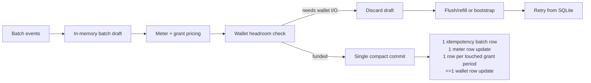

# Entitlement Window Complexity Reduction Implementation Plan

> **For agentic workers:** REQUIRED SUB-SKILL: Use superpowers:subagent-driven-development (recommended) or superpowers:executing-plans to implement this plan task-by-task. Steps use checkbox (`- [ ]`) syntax for tracking.

**Goal:** Reduce `EntitlementWindowDO.ts` complexity without changing behavior, while preserving optimized batch write compaction.

**Architecture:** Keep `EntitlementWindowDO` as the Cloudflare Durable Object boundary and move cohesive internal responsibilities into local modules under `apps/api/src/ingestion/entitlements`. Batch processing must remain a draft-then-commit pipeline: process many events in memory, perform wallet I/O only between discarded drafts and retries, then write one compact idempotency batch row, one final meter state, one write per touched grant period, and at most one wallet reservation state write per successful optimized pass.

**Tech Stack:** TypeScript, Cloudflare Durable Objects, Drizzle durable SQLite, Vitest, `@unprice/services/entitlements`, `@unprice/services/wallet`.

---

## First Principles

The batching path is a notepad, not a ledger. Each event writes to an in-memory draft. Only the final compressed draft is durable.



Do not extract batching into a loop that calls single-event `applyInner`. That reduces code duplication but creates write amplification: per event idempotency writes, per event wallet writes, repeated grant-window merges, and repeated alarm scheduling. The complexity worth keeping is the in-memory draft. The complexity to reduce is raw mutation spread across `EntitlementWindowDO`.

## File Structure

- Create `apps/api/src/ingestion/entitlements/optimized-batch-draft.ts`
  - Owns `OptimizedBatchProcessingState`, draft mutation helpers, staged result lookup, write metric calculation, and conversion into a commit payload.
  - No SQLite, no wallet service, no logger, no Durable Object context.

- Create `apps/api/src/ingestion/entitlements/optimized-batch-draft.test.ts`
  - Unit tests for compact draft behavior and write metric calculation.

- Create `apps/api/src/ingestion/entitlements/entitlement-window-store.ts`
  - Owns durable SQLite row mapping and compact persistence helpers currently embedded in the DO: entitlement config, grants, grant states, meter state, wallet reservation snapshot, idempotency batches, and cleanup.
  - Accepts `DrizzleSqliteDODatabase<typeof schema>` explicitly. Keeps transactions caller-owned.

- Create `apps/api/src/ingestion/entitlements/entitlement-window-store.test.ts`
  - Unit tests for idempotency cache hydration, malformed row tolerance, wallet row mapping, and compact grant-state grouping.

- Create `apps/api/src/ingestion/entitlements/wallet-reservation-flow.ts`
  - Owns wallet reservation state transitions that are currently scattered: pending flush detection, invoice context checks, growth readiness, growth planning, bootstrap planning, and common wallet log money fields.
  - Does not construct `WalletService`; the DO still owns external service construction and passes command functions in.

- Modify `apps/api/src/ingestion/entitlements/EntitlementWindowDO.ts`
  - Keep public RPCs, `runDoOperation`, `ctx.waitUntil`, alarm scheduling, migration readiness, and external wallet I/O calls.
  - Replace raw batch state mutation with `OptimizedBatchDraft`.
  - Replace direct SQLite row mapping calls with `EntitlementWindowStore`.

- Modify `apps/api/src/ingestion/entitlements/EntitlementWindowDO.test.ts`
  - Keep existing characterization tests.
  - Add one focused compact-batch regression test that mixes cached, allowed, denied, and wallet-touched events while asserting bounded writes.

- Modify `lessons.md`
  - Add a tiny dated lesson only if implementation discovers a repeatable repo-specific rule not already covered by the existing EntitlementWindowDO batch lessons.

## Non-Negotiable Invariants

- `applyBatch` must not call `applyInner` per event.
- Wallet bootstrap/refill that needs external I/O must discard the current staged draft, do the I/O, then retry optimized processing from SQLite.
- No `await` inside `this.db.transaction`.
- A successful optimized batch should still commit compactly:
  - one `idempotencyKeyBatchesTable` row for all new event outcomes,
  - zero local fact outbox rows,
  - one final meter state write when meter state is dirty,
  - one grant-window write per touched period key,
  - one wallet row write for the final staged wallet state.
- Existing tests named `uses compact async batch rows for idempotency and returned meter facts`, `keeps compact write shape after optimized reservation growth retry`, and `grows optimized batch when staged spend makes the reservation underfunded` must keep passing.

## Task 1: Add Batch Draft Module And Unit Tests

**Files:**
- Create: `apps/api/src/ingestion/entitlements/optimized-batch-draft.ts`
- Create: `apps/api/src/ingestion/entitlements/optimized-batch-draft.test.ts`
- Modify: `apps/api/src/ingestion/entitlements/EntitlementWindowDO.ts`

- [ ] **Step 1: Write the failing test**

Create `apps/api/src/ingestion/entitlements/optimized-batch-draft.test.ts`:

```ts
import { describe, expect, it } from "vitest"
import type { BatchIdempotencyEntry } from "./contracts"
import {
  createOptimizedBatchDraft,
  createOptimizedBatchWriteMetrics,
} from "./optimized-batch-draft"

function entry(eventId: string, allowed = true): BatchIdempotencyEntry {
  return {
    allowed,
    createdAt: 1_717_000_000_000,
    deniedReason: allowed ? null : "WALLET_EMPTY",
    denyMessage: allowed ? null : "Wallet empty",
    eventId,
    meterFacts: [],
  }
}

describe("optimized batch draft", () => {
  it("stages many event outcomes as one commit payload", () => {
    const draft = createOptimizedBatchDraft({
      grantStates: [],
      meterState: {
        createdAt: 1_717_000_000_000,
        dirty: false,
        exists: true,
        meterKey: "meter:tokens",
        updatedAt: null,
        usage: 0,
      },
      wallet: null,
    })

    draft.stageIdempotencyEntry(entry("evt_1"))
    draft.stageIdempotencyEntry(entry("evt_2", false))

    expect(draft.lookupStagedResult("evt_1")).toMatchObject({ eventId: "evt_1" })
    expect(draft.lookupStagedResult("evt_2")).toMatchObject({ allowed: false })
    expect(draft.hasDurableMutations()).toBe(true)
    expect(draft.toCommitPayload().idempotencyEntries).toHaveLength(2)
  })

  it("computes compact write metrics from the final draft shape", () => {
    const metrics = createOptimizedBatchWriteMetrics({
      idempotencyEntryCount: 100,
      meterStateDirty: true,
      meterStateExists: false,
      touchedGrantPeriodKeys: ["period_a", "period_a", "period_b"],
      walletDirty: true,
      walletPresent: true,
    })

    expect(metrics).toEqual({
      grant_window_write_count: 2,
      idempotency_event_count: 100,
      idempotency_insert_count: 1,
      meter_state_write_count: 2,
      outbox_fact_count: 0,
      outbox_insert_count: 0,
      wallet_reservation_write_count: 1,
    })
  })
})
```

- [ ] **Step 2: Run test to verify it fails**

Run:

```bash
source ~/.nvm/nvm.sh
nvm use
pnpm --filter api test -- src/ingestion/entitlements/optimized-batch-draft.test.ts
```

Expected: FAIL because `./optimized-batch-draft` does not exist.

- [ ] **Step 3: Create the draft module**

Create `apps/api/src/ingestion/entitlements/optimized-batch-draft.ts` with the state currently embedded near the top of `EntitlementWindowDO.ts`. Keep it dependency-light:

```ts
import type { GrantConsumptionState } from "@unprice/services/entitlements"
import type {
  ApplyBatchMetrics,
  ApplyBatchResultRow,
  BatchIdempotencyEntry,
  RefillTrigger,
  WalletReservationSnapshot,
} from "./contracts"
import type { ReservationCloseReason } from "@unprice/services/wallet"
import { createApplyBatchMetrics } from "./contracts"
import type { MeterStateDraft } from "./meter-state-adapter"
import { unique } from "./utils"

export type OptimizedBatchWriteMetrics = Pick<
  ApplyBatchMetrics,
  | "grant_window_write_count"
  | "idempotency_event_count"
  | "idempotency_insert_count"
  | "meter_state_write_count"
  | "outbox_fact_count"
  | "outbox_insert_count"
  | "wallet_reservation_write_count"
>

export type OptimizedBatchCommitPayload = {
  idempotencyEntries: BatchIdempotencyEntry[]
  meterState: MeterStateDraft
  refillTrigger: RefillTrigger | null
  reservationCloseReason: ReservationCloseReason | null
  touchedGrantStates: Map<string, GrantConsumptionState>
  wallet: WalletReservationSnapshot
  walletDirty: boolean
}

export type OptimizedBatchDraft = {
  grantStates: GrantConsumptionState[]
  meterState: MeterStateDraft
  metrics: ApplyBatchMetrics
  results: ApplyBatchResultRow[]
  touchedGrantStates: Map<string, GrantConsumptionState>
  wallet: WalletReservationSnapshot
  walletDirty: boolean
  refillTrigger: RefillTrigger | null
  reservationCloseReason: ReservationCloseReason | null
  lookupStagedResult(eventId: string): BatchIdempotencyEntry | undefined
  stageIdempotencyEntry(entry: BatchIdempotencyEntry): void
  hasDurableMutations(): boolean
  toCommitPayload(): OptimizedBatchCommitPayload
}

export function createOptimizedBatchDraft(params: {
  grantStates: GrantConsumptionState[]
  meterState: MeterStateDraft
  wallet: WalletReservationSnapshot
}): OptimizedBatchDraft {
  const stagedResultsByKey = new Map<string, BatchIdempotencyEntry>()
  const idempotencyEntries: BatchIdempotencyEntry[] = []
  const draft: OptimizedBatchDraft = {
    grantStates: params.grantStates.map((state) => ({ ...state })),
    meterState: { ...params.meterState },
    metrics: createApplyBatchMetrics(),
    results: [],
    touchedGrantStates: new Map<string, GrantConsumptionState>(),
    wallet: params.wallet ? { ...params.wallet } : null,
    walletDirty: false,
    refillTrigger: null,
    reservationCloseReason: null,
    lookupStagedResult(eventId) {
      return stagedResultsByKey.get(eventId)
    },
    stageIdempotencyEntry(entry) {
      idempotencyEntries.push(entry)
      stagedResultsByKey.set(entry.eventId, entry)
    },
    hasDurableMutations() {
      return (
        idempotencyEntries.length > 0 ||
        draft.meterState.dirty ||
        draft.touchedGrantStates.size > 0 ||
        draft.walletDirty
      )
    },
    toCommitPayload() {
      return {
        idempotencyEntries,
        meterState: draft.meterState,
        refillTrigger: draft.refillTrigger,
        reservationCloseReason: draft.reservationCloseReason,
        touchedGrantStates: draft.touchedGrantStates,
        wallet: draft.wallet,
        walletDirty: draft.walletDirty,
      }
    },
  }
  return draft
}

export function createOptimizedBatchWriteMetrics(params: {
  idempotencyEntryCount: number
  meterStateDirty: boolean
  meterStateExists: boolean
  touchedGrantPeriodKeys: string[]
  walletDirty: boolean
  walletPresent: boolean
}): OptimizedBatchWriteMetrics {
  return {
    meter_state_write_count: params.meterStateDirty ? (params.meterStateExists ? 1 : 2) : 0,
    grant_window_write_count: unique(params.touchedGrantPeriodKeys).length,
    wallet_reservation_write_count: params.walletDirty && params.walletPresent ? 1 : 0,
    outbox_insert_count: 0,
    outbox_fact_count: 0,
    idempotency_insert_count: params.idempotencyEntryCount > 0 ? 1 : 0,
    idempotency_event_count: params.idempotencyEntryCount,
  }
}
```

- [ ] **Step 4: Wire the DO to use the draft**

In `EntitlementWindowDO.ts`, replace `OptimizedBatchProcessingState`, `createOptimizedBatchProcessingState`, and `hasOptimizedBatchStagedMutations` with imports from `optimized-batch-draft.ts`. Keep method order and behavior unchanged:

```ts
import {
  type OptimizedBatchCommitPayload,
  type OptimizedBatchDraft,
  type OptimizedBatchWriteMetrics,
  createOptimizedBatchDraft,
  createOptimizedBatchWriteMetrics,
} from "./optimized-batch-draft"
```

Then make these mechanical substitutions:

```ts
const state = createOptimizedBatchDraft({
  grantStates: setup.grantStates,
  meterState: setup.meterState,
  wallet: setup.wallet,
})
```

```ts
const staged =
  state.lookupStagedResult(event.idempotencyKey) ?? setup.cachedResults.get(event.idempotencyKey)
```

```ts
if (state.hasDurableMutations()) {
  // existing bootstrap-required branch remains unchanged
}
```

```ts
const commit = state.toCommitPayload()
Object.assign(
  state.metrics,
  this.commitOptimizedBatch({
    createdAt,
    idempotencyEntries: commit.idempotencyEntries,
    meter: setup.meter,
    meterState: commit.meterState,
    touchedGrantStates: commit.touchedGrantStates,
    wallet: commit.wallet,
    walletDirty: commit.walletDirty,
  })
)
```

- [ ] **Step 5: Run focused tests**

Run:

```bash
source ~/.nvm/nvm.sh
nvm use
pnpm --filter api test -- src/ingestion/entitlements/optimized-batch-draft.test.ts src/ingestion/entitlements/EntitlementWindowDO.test.ts
```

Expected: PASS. Existing optimized batch write-count assertions must remain unchanged.

- [ ] **Step 6: Commit**

```bash
git add apps/api/src/ingestion/entitlements/optimized-batch-draft.ts apps/api/src/ingestion/entitlements/optimized-batch-draft.test.ts apps/api/src/ingestion/entitlements/EntitlementWindowDO.ts
git commit -m "refactor: extract entitlement optimized batch draft"
```

## Task 2: Add A Mixed Compact Batch Regression Test

**Files:**
- Modify: `apps/api/src/ingestion/entitlements/EntitlementWindowDO.test.ts`

- [ ] **Step 1: Add the regression test**

Add this test near the existing optimized batch write-count tests:

```ts
it("keeps optimized batch writes bounded for mixed allowed denied and duplicate events", async () => {
  const EntitlementWindowDO = await loadEntitlementWindowDO()
  const state = createDurableObjectState()
  const db = createFakeDbState()
  testState.db = db
  seedWalletReservation(db, {
    reservationId: "res_mixed_compact_batch",
    allocationAmount: 20 * 100_000_000,
    targetReservationAmount: 20 * 100_000_000,
    maxEventCostAmount: 100_000_000,
  })
  testState.engineApply.mockImplementation((event: unknown, options?: PersistOptions) => {
    const eventId = (event as { id: string }).id
    const valueAfter = eventId === "evt_mixed_limit" ? 30 : 1
    const facts = [{ delta: valueAfter, meterKey: DEFAULT_METER_KEY, valueAfter }]
    options?.beforePersist?.(facts)
    return facts
  })

  const durableObject = new EntitlementWindowDO(state, createEnv())
  const baseInput = createApplyInput({ enforceLimit: true, limit: 25 })
  const first = await durableObject.applyBatch({
    customerId: baseInput.customerId,
    entitlement: baseInput.entitlement,
    enforceLimit: true,
    events: [
      {
        ...baseInput.event,
        correlationKey: "allowed",
        id: "evt_mixed_allowed",
        idempotencyKey: "idem_mixed_allowed",
        now: BASE_NOW,
        timestamp: BASE_NOW,
      },
      {
        ...baseInput.event,
        correlationKey: "limit",
        id: "evt_mixed_limit",
        idempotencyKey: "idem_mixed_limit",
        now: BASE_NOW + 1,
        timestamp: BASE_NOW + 1,
      },
    ],
    grants: baseInput.grants,
    projectId: baseInput.projectId,
  })

  expect(first.results).toEqual([
    expect.objectContaining({ allowed: true, correlationKey: "allowed" }),
    expect.objectContaining({
      allowed: false,
      correlationKey: "limit",
      deniedReason: "LIMIT_EXCEEDED",
    }),
  ])

  const second = await durableObject.applyBatch({
    customerId: baseInput.customerId,
    entitlement: baseInput.entitlement,
    enforceLimit: true,
    events: [
      {
        ...baseInput.event,
        correlationKey: "allowed_replay",
        id: "evt_mixed_allowed_replay",
        idempotencyKey: "idem_mixed_allowed",
        now: BASE_NOW + 2,
        timestamp: BASE_NOW + 2,
      },
      {
        ...baseInput.event,
        correlationKey: "new_allowed",
        id: "evt_mixed_new_allowed",
        idempotencyKey: "idem_mixed_new_allowed",
        now: BASE_NOW + 3,
        timestamp: BASE_NOW + 3,
      },
    ],
    grants: baseInput.grants,
    projectId: baseInput.projectId,
  })

  expect(second.results).toEqual([
    expect.objectContaining({ allowed: true, correlationKey: "allowed_replay" }),
    expect.objectContaining({ allowed: true, correlationKey: "new_allowed" }),
  ])
  expect(db.idempotencyBatchRows).toHaveLength(2)
  expect(readIdempotencyMeterFacts(db)).toHaveLength(2)
  expect(db.writeCounts.outboxBatchRows).toBe(0)
  expect(db.writeCounts.idempotencyBatchRows).toBe(2)
  expect(db.writeCounts.walletRows).toBeLessThanOrEqual(3)
})
```

- [ ] **Step 2: Run test before additional extraction**

Run:

```bash
source ~/.nvm/nvm.sh
nvm use
pnpm --filter api test -- src/ingestion/entitlements/EntitlementWindowDO.test.ts -t "keeps optimized batch writes bounded for mixed allowed denied and duplicate events"
```

Expected: PASS. This is a characterization test; it guards behavior before deeper extraction.

- [ ] **Step 3: Commit**

```bash
git add apps/api/src/ingestion/entitlements/EntitlementWindowDO.test.ts
git commit -m "test: characterize compact mixed entitlement batches"
```

## Task 3: Extract Durable SQLite Store

**Files:**
- Create: `apps/api/src/ingestion/entitlements/entitlement-window-store.ts`
- Create: `apps/api/src/ingestion/entitlements/entitlement-window-store.test.ts`
- Modify: `apps/api/src/ingestion/entitlements/EntitlementWindowDO.ts`

- [ ] **Step 1: Write store tests**

Create `apps/api/src/ingestion/entitlements/entitlement-window-store.test.ts`:

```ts
import { describe, expect, it, vi } from "vitest"
import { compactGrantConsumptionStateListSchema } from "./contracts"
import { parseCompactGrantStates, replaceGrantConsumptionState } from "./entitlement-window-store"

describe("entitlement window store helpers", () => {
  it("keeps the newest compact grant state per bucket key", () => {
    const states = [
      {
        bucketKey: "grant_a:period",
        consumedUnits: 1,
        grantId: "grant_a",
        periodEndAt: 20,
        periodKey: "period",
        periodStartAt: 10,
      },
    ]

    replaceGrantConsumptionState(states, {
      bucketKey: "grant_a:period",
      consumedUnits: 5,
      grantId: "grant_a",
      periodEndAt: 20,
      periodKey: "period",
      periodStartAt: 10,
    })

    expect(states).toHaveLength(1)
    expect(states[0]?.consumedUnits).toBe(5)
  })

  it("returns an empty list and logs a warning for malformed compact grant state", () => {
    const logger = { warn: vi.fn() }
    const parsed = parseCompactGrantStates("{bad json", compactGrantConsumptionStateListSchema, logger)

    expect(parsed).toEqual([])
    expect(logger.warn).toHaveBeenCalledWith(
      "skipping unparsable compact entitlement period state",
      expect.objectContaining({ error: expect.any(String) })
    )
  })
})
```

- [ ] **Step 2: Run test to verify it fails**

Run:

```bash
source ~/.nvm/nvm.sh
nvm use
pnpm --filter api test -- src/ingestion/entitlements/entitlement-window-store.test.ts
```

Expected: FAIL because `./entitlement-window-store` does not exist.

- [ ] **Step 3: Create store helper exports**

Create `apps/api/src/ingestion/entitlements/entitlement-window-store.ts` and first move pure helpers exactly:

```ts
import type { GrantConsumptionState } from "@unprice/services/entitlements"
import type { z } from "zod"

export type WarningLogger = {
  warn(message: string, fields: Record<string, unknown>): void
}

export function parseCompactGrantStates(
  raw: string,
  schema: z.ZodType<GrantConsumptionState[]>,
  logger: WarningLogger
): GrantConsumptionState[] {
  let parsed: unknown
  try {
    parsed = JSON.parse(raw)
  } catch (error) {
    logger.warn("skipping unparsable compact entitlement period state", {
      error: error instanceof Error ? error.message : String(error),
    })
    return []
  }

  const result = schema.safeParse(parsed)
  if (!result.success) {
    logger.warn("skipping malformed compact entitlement period state", {
      error: result.error.message,
    })
    return []
  }

  return result.data
}

export function replaceGrantConsumptionState(
  states: GrantConsumptionState[],
  state: GrantConsumptionState
): void {
  const index = states.findIndex((candidate) => candidate.bucketKey === state.bucketKey)
  if (index >= 0) {
    states[index] = state
    return
  }

  states.push(state)
}
```

- [ ] **Step 4: Move store methods in small groups**

Move these methods from `EntitlementWindowDO.ts` to an `EntitlementWindowStore` class in `entitlement-window-store.ts`. Keep method bodies unchanged except replacing `this.logger` with constructor-injected `logger`, `this.db` with constructor-injected `db`, and `this.invalidateEnforcementStateCache()` with constructor-injected `onStateChanged`.

Move in this order:

```ts
ensureMeterState
ensureWalletReservation
syncEntitlementConfig
assertImmutableEntitlementConfig
readEntitlementConfig
syncGrants
readGrants
readGrantStatesForActiveGrants
readGrantStatesForBatch
readGrantStatesForPeriodKeys
selectGrantStatesForActiveGrants
readMeterStateDraft
writeGrantConsumptions
readLifecycleEndAt
readWalletReservation
lookupCachedIdempotencyResult
lookupCachedIdempotencyResults
hydrateBatchIdempotencyResults
recordBatchIdempotencyResults
writeBatchIdempotencyResults
cleanupStaleIdempotencyKeys
```

The constructor shape should be:

```ts
export class EntitlementWindowStore {
  private batchIdempotencyResults: Map<string, BatchIdempotencyEntry> | null = null

  constructor(
    private readonly db: DrizzleSqliteDODatabase<typeof schema>,
    private readonly logger: WarningLogger,
    private readonly onStateChanged: () => void
  ) {}
}
```

- [ ] **Step 5: Wire the DO to store**

In `EntitlementWindowDO.ts`, add:

```ts
private readonly store: EntitlementWindowStore
```

After `this.db = drizzle(...)` in the constructor:

```ts
this.store = new EntitlementWindowStore(this.db, this.logger, () =>
  this.invalidateEnforcementStateCache()
)
```

Replace method calls mechanically:

```ts
this.readWalletReservation(this.db)
```

becomes:

```ts
this.store.readWalletReservation(this.db)
```

For methods that no longer need a transaction argument after the store owns `db`, keep the explicit `tx` parameter in the store method. This keeps transaction boundaries visible and avoids accidental awaits inside transactions.

- [ ] **Step 6: Run focused tests**

Run:

```bash
source ~/.nvm/nvm.sh
nvm use
pnpm --filter api test -- src/ingestion/entitlements/entitlement-window-store.test.ts src/ingestion/entitlements/EntitlementWindowDO.test.ts
```

Expected: PASS.

- [ ] **Step 7: Commit**

```bash
git add apps/api/src/ingestion/entitlements/entitlement-window-store.ts apps/api/src/ingestion/entitlements/entitlement-window-store.test.ts apps/api/src/ingestion/entitlements/EntitlementWindowDO.ts
git commit -m "refactor: extract entitlement window durable store"
```

## Task 4: Extract Wallet Reservation Flow Helpers

**Files:**
- Create: `apps/api/src/ingestion/entitlements/wallet-reservation-flow.ts`
- Create: `apps/api/src/ingestion/entitlements/wallet-reservation-flow.test.ts`
- Modify: `apps/api/src/ingestion/entitlements/EntitlementWindowDO.ts`

- [ ] **Step 1: Write wallet flow helper tests**

Create `apps/api/src/ingestion/entitlements/wallet-reservation-flow.test.ts`:

```ts
import { describe, expect, it } from "vitest"
import {
  hasPendingWalletFlush,
  isReservationInvoiceContextMissing,
  requireReservationInvoiceContext,
} from "./wallet-reservation-flow"

describe("wallet reservation flow helpers", () => {
  it("detects pending flush state from persisted sequence fields", () => {
    expect(
      hasPendingWalletFlush({
        flushSeq: 1,
        pendingFlushSeq: 2,
        refillInFlight: false,
        reservationId: "res_123",
      })
    ).toBe(true)

    expect(
      hasPendingWalletFlush({
        flushSeq: 2,
        pendingFlushSeq: 2,
        refillInFlight: false,
        reservationId: "res_123",
      })
    ).toBe(false)
  })

  it("requires billing invoice context before wallet capture or refill", () => {
    expect(
      isReservationInvoiceContextMissing({
        billingPeriodId: "bp_123",
        cycleEndAt: 20,
        cycleStartAt: 10,
        featurePlanVersionItemId: "item_123",
        featureSlug: "api_calls",
        statementKey: "stmt_123",
      })
    ).toBe(false)

    expect(() =>
      requireReservationInvoiceContext({
        billingPeriodId: null,
        cycleEndAt: 20,
        cycleStartAt: 10,
        featurePlanVersionItemId: "item_123",
        featureSlug: "api_calls",
        reservationId: "res_123",
        statementKey: "stmt_123",
      })
    ).toThrow("Wallet reservation res_123 is missing billing invoice context")
  })
})
```

- [ ] **Step 2: Run test to verify it fails**

Run:

```bash
source ~/.nvm/nvm.sh
nvm use
pnpm --filter api test -- src/ingestion/entitlements/wallet-reservation-flow.test.ts
```

Expected: FAIL because `./wallet-reservation-flow` does not exist.

- [ ] **Step 3: Create wallet helper module**

Create `apps/api/src/ingestion/entitlements/wallet-reservation-flow.ts`:

```ts
import type { WalletReservationSnapshot } from "./contracts"

export type ReservationInvoiceContext = {
  billingPeriodId: string
  cycleEndAt: number
  cycleStartAt: number
  featurePlanVersionItemId: string
  featureSlug: string
  sourceId: string
  statementKey: string
}

export function hasPendingWalletFlush(
  window: Pick<
    NonNullable<WalletReservationSnapshot>,
    "flushSeq" | "pendingFlushSeq" | "refillInFlight" | "reservationId"
  > | null
): boolean {
  return Boolean(
    window?.reservationId &&
      (window.refillInFlight ||
        (window.pendingFlushSeq !== null &&
          window.pendingFlushSeq !== undefined &&
          window.pendingFlushSeq > window.flushSeq))
  )
}

export function isReservationInvoiceContextMissing(
  window: Pick<
    NonNullable<WalletReservationSnapshot>,
    | "billingPeriodId"
    | "cycleEndAt"
    | "cycleStartAt"
    | "featurePlanVersionItemId"
    | "featureSlug"
    | "statementKey"
  >
): boolean {
  return (
    !window.billingPeriodId ||
    window.cycleEndAt === null ||
    window.cycleStartAt === null ||
    !window.featurePlanVersionItemId ||
    !window.featureSlug ||
    !window.statementKey
  )
}

export function requireReservationInvoiceContext(
  window: Pick<
    NonNullable<WalletReservationSnapshot>,
    | "billingPeriodId"
    | "cycleEndAt"
    | "cycleStartAt"
    | "featurePlanVersionItemId"
    | "featureSlug"
    | "reservationId"
    | "statementKey"
  >
): ReservationInvoiceContext {
  const {
    billingPeriodId,
    cycleEndAt,
    cycleStartAt,
    featurePlanVersionItemId,
    featureSlug,
    statementKey,
  } = window

  if (
    !billingPeriodId ||
    cycleEndAt === null ||
    cycleStartAt === null ||
    !featurePlanVersionItemId ||
    !featureSlug ||
    !statementKey
  ) {
    throw new Error(`Wallet reservation ${window.reservationId} is missing billing invoice context`)
  }

  return {
    billingPeriodId,
    cycleEndAt,
    cycleStartAt,
    featurePlanVersionItemId,
    featureSlug,
    sourceId: `${billingPeriodId}:${featurePlanVersionItemId}`,
    statementKey,
  }
}
```

- [ ] **Step 4: Replace duplicated helpers in the DO**

In `EntitlementWindowDO.ts`, import:

```ts
import {
  hasPendingWalletFlush,
  isReservationInvoiceContextMissing,
  requireReservationInvoiceContext,
} from "./wallet-reservation-flow"
```

Then delete the private DO methods with those names and replace every `this.hasPendingWalletFlush(window)`, `this.isReservationInvoiceContextMissing(window)`, and `this.requireReservationInvoiceContext(window)` call with `hasPendingWalletFlush(window)`, `isReservationInvoiceContextMissing(window)`, and `requireReservationInvoiceContext(window)`.

- [ ] **Step 5: Move growth planning helpers after the small helper extraction passes**

Move calculation helpers into `wallet-reservation-flow.ts` only when their inputs can be passed as values or callbacks. Keep direct SQLite reads in the DO or store. Start with these helpers:

```ts
resolveReservationGrowthReadiness
planReservationGrowthForCurrentEvent
createReservationBootstrapPlan
computeProjectedCurrentEventCostMinor
computeProjectedBatchEventCostMinor
priceProjectedFact
```

If `priceProjectedFact` still needs `readGrantStatesForActiveGrants`, pass a function parameter named `readGrantStatesForActiveGrants` instead of importing the store into `wallet-reservation-flow.ts`. Keep `growReservationForCurrentEvent`, `growReservationForBatchHeadroom`, `requestFlushAndRefill`, `bootstrapReservationForProjectedCost`, and close/finalize methods in the DO until the store extraction is stable, because those perform external I/O or schedule `ctx.waitUntil`.

- [ ] **Step 6: Run wallet and DO tests**

Run:

```bash
source ~/.nvm/nvm.sh
nvm use
pnpm --filter api test -- src/ingestion/entitlements/wallet-reservation-flow.test.ts src/ingestion/entitlements/EntitlementWindowDO.test.ts
```

Expected: PASS.

- [ ] **Step 7: Commit**

```bash
git add apps/api/src/ingestion/entitlements/wallet-reservation-flow.ts apps/api/src/ingestion/entitlements/wallet-reservation-flow.test.ts apps/api/src/ingestion/entitlements/EntitlementWindowDO.ts
git commit -m "refactor: extract wallet reservation flow helpers"
```

## Task 5: Simplify Optimized Batch Orchestration Around Draft Boundaries

**Files:**
- Modify: `apps/api/src/ingestion/entitlements/EntitlementWindowDO.ts`
- Modify: `apps/api/src/ingestion/entitlements/optimized-batch-draft.ts`
- Modify: `apps/api/src/ingestion/entitlements/optimized-batch-draft.test.ts`

- [ ] **Step 1: Add a draft reset/retry test**

Append to `optimized-batch-draft.test.ts`:

```ts
it("keeps retry-required wallet work outside the durable draft", () => {
  const draft = createOptimizedBatchDraft({
    grantStates: [],
    meterState: {
      createdAt: 1_717_000_000_000,
      dirty: false,
      exists: true,
      meterKey: "meter:tokens",
      updatedAt: null,
      usage: 0,
    },
    wallet: {
      allocationAmount: 100,
      billingPeriodId: "bp_123",
      consumedAmount: 80,
      consumedQuantity: 8,
      currency: "USD",
      customerId: "cus_123",
      cycleEndAt: 200,
      cycleStartAt: 100,
      deletionRequested: false,
      featurePlanVersionItemId: "item_123",
      featureSlug: "api_calls",
      flushedAmount: 0,
      flushedQuantity: 0,
      flushSeq: 1,
      lastEventAt: null,
      lastFlushedAt: null,
      lastRateSampledAtMs: null,
      maxEventCostAmount: 10,
      pendingFlushAmount: null,
      pendingFlushFinal: false,
      pendingFlushQuantity: null,
      pendingFlushSeq: null,
      pendingRefillAmount: 0,
      projectId: "proj_123",
      recoveryRequired: false,
      refillChunkAmount: 0,
      refillInFlight: false,
      refillThresholdBps: 5000,
      reservationEndAt: 200,
      reservationId: "res_123",
      spendEwmaAmount: 0,
      statementKey: "stmt_123",
      targetReservationAmount: 100,
    },
  })

  draft.walletDirty = true
  draft.stageIdempotencyEntry(entry("evt_before_retry"))

  expect(draft.hasDurableMutations()).toBe(true)
  expect(draft.toCommitPayload().idempotencyEntries).toHaveLength(1)
})
```

- [ ] **Step 2: Run the draft tests**

Run:

```bash
source ~/.nvm/nvm.sh
nvm use
pnpm --filter api test -- src/ingestion/entitlements/optimized-batch-draft.test.ts
```

Expected: PASS.

- [ ] **Step 3: Rename batch methods to expose the two-phase model**

In `EntitlementWindowDO.ts`, rename methods without changing logic:

```ts
applyBatchOptimized -> applyBatchWithCompactDraft
processOptimizedBatchEvent -> stageBatchEventIntoDraft
applyAndPriceOptimizedBatchEvent -> stageMeterAndPriceFactsIntoDraft
commitOptimizedBatch -> commitCompactBatchDraft
```

The resulting top-level shape should read:

```ts
const setup = this.prepareOptimizedBatch(input, createdAt, idempotencyKeys)
const draft = createOptimizedBatchDraft({
  grantStates: setup.grantStates,
  meterState: setup.meterState,
  wallet: setup.wallet,
})

for (const event of input.events) {
  await this.stageBatchEventIntoDraft({
    createdAt,
    event,
    input,
    options,
    setup,
    state: draft,
  })
}

const commit = draft.toCommitPayload()
Object.assign(
  draft.metrics,
  this.commitCompactBatchDraft({
    createdAt,
    idempotencyEntries: commit.idempotencyEntries,
    meter: setup.meter,
    meterState: commit.meterState,
    touchedGrantStates: commit.touchedGrantStates,
    wallet: commit.wallet,
    walletDirty: commit.walletDirty,
  })
)
```

- [ ] **Step 4: Keep retry behavior outside durable commit**

In the `EntitlementWindowBatchReservationBootstrapRequired` and `EntitlementWindowBatchReservationUnderfundedError` catch branches, keep this exact behavior:

```ts
// The staged draft from the failed pass must be abandoned. External wallet I/O
// happens here, then the optimized pass rereads SQLite and stages a fresh draft.
const retry = await this.applyBatchWithCompactDraft(input, {
  refillAttemptedEventIds,
  walletDiagnostics,
})
```

Do not pass the old draft into the retry.

- [ ] **Step 5: Run focused compactness tests**

Run:

```bash
source ~/.nvm/nvm.sh
nvm use
pnpm --filter api test -- src/ingestion/entitlements/EntitlementWindowDO.test.ts -t "compact|optimized batch|underfunded|staged spend"
```

Expected: PASS. If Vitest does not match multiple `-t` alternatives in this environment, run the full file:

```bash
source ~/.nvm/nvm.sh
nvm use
pnpm --filter api test -- src/ingestion/entitlements/EntitlementWindowDO.test.ts
```

Expected: PASS.

- [ ] **Step 6: Commit**

```bash
git add apps/api/src/ingestion/entitlements/EntitlementWindowDO.ts apps/api/src/ingestion/entitlements/optimized-batch-draft.ts apps/api/src/ingestion/entitlements/optimized-batch-draft.test.ts
git commit -m "refactor: clarify compact batch draft orchestration"
```

## Task 6: Final Verification And Lesson Update

**Files:**
- Modify: `lessons.md` only if a new repeatable repo-specific rule was discovered.

- [ ] **Step 1: Run focused API test suite**

Run:

```bash
source ~/.nvm/nvm.sh
nvm use
pnpm --filter api test -- src/ingestion/entitlements/optimized-batch-draft.test.ts src/ingestion/entitlements/entitlement-window-store.test.ts src/ingestion/entitlements/wallet-reservation-flow.test.ts src/ingestion/entitlements/EntitlementWindowDO.test.ts
```

Expected: PASS.

- [ ] **Step 2: Run API typecheck**

Run:

```bash
source ~/.nvm/nvm.sh
nvm use
pnpm --filter api type-check
```

Expected: PASS.

- [ ] **Step 3: Run repository validation when the focused suite is clean**

Run:

```bash
source ~/.nvm/nvm.sh
nvm use
pnpm validate
```

Expected: PASS.

- [ ] **Step 4: Update lessons only when needed**

If implementation reveals a new durable rule, add one dated bullet under `Cloudflare, API, And Ingestion`. Use this exact shape:

```md
- 2026-06-13: EntitlementWindowDO optimized batch refactors must keep event processing as an
  in-memory draft and commit compact rows once; never route batch events through per-event
  `applyInner` or write amplification returns.
```

Do not add this lesson if the implementation only confirms the rule already captured by existing batch lessons.

- [ ] **Step 5: Commit final verification notes or lesson**

If `lessons.md` changed:

```bash
git add lessons.md
git commit -m "docs: record entitlement batch refactor invariant"
```

If `lessons.md` did not change, skip this commit.

## Complexity And Write Amplification Tradeoffs

- Extracting `OptimizedBatchDraft` reduces cognitive load without changing the important optimization. The draft is the abstraction that hides mutation bookkeeping, not a new persistence layer.
- Extracting `EntitlementWindowStore` reduces file size and makes SQLite mapping testable. The tradeoff is one extra class, but transaction ownership stays explicit.
- Extracting pure wallet helpers reduces duplicated pending-flush and invoice-context reasoning. The tradeoff is that the DO still owns some wallet orchestration until there is enough safety to move I/O-heavy flows.
- Keeping single apply and batch apply separate preserves performance. The tradeoff is some duplicated domain calls, but the batch path avoids per-event durable writes.

## Self-Review

- Spec coverage: The plan reduces complexity through store, draft, and wallet-helper extraction; it explicitly preserves behavior; it includes a batching strategy that avoids write amplification.
- Placeholder scan: No task relies on unspecified future work. Each new module has concrete tests and initial code.
- Type consistency: Names used across tasks are stable: `OptimizedBatchDraft`, `createOptimizedBatchDraft`, `createOptimizedBatchWriteMetrics`, `EntitlementWindowStore`, and wallet helper function names match their imports.
