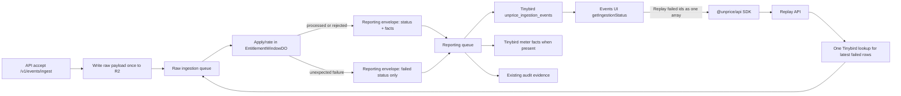

# Tinybird Ingestion Replay Implementation Plan

> **For agentic workers:** REQUIRED SUB-SKILL: Use superpowers:subagent-driven-development (recommended) or superpowers:executing-plans to implement this plan task-by-task. Steps use checkbox (`- [ ]`) syntax for tracking.

**Goal:** Let admins replay failed ingestion events from the Events UI using Tinybird as the recovery index and `payload_json` as the replay payload source.

**Architecture:** Raw accepted events are written to R2 once before enqueue, but replay uses Tinybird `payload_json` because R2/Pipeline visibility can lag. Raw ingestion failures become reporting envelopes with `state=failed`, `replayable=true`, and no meter facts; the existing reporting queue remains the only writer to Tinybird status. The dashboard reads `getIngestionStatus`, shows failed rows, and calls the API through `@unprice/api` SDK to re-enqueue raw ingestion.

**Tech Stack:** Cloudflare Workers Queues, Hono, Tinybird, tRPC, Next.js App Router, `@unprice/api`, `@unprice/money`, Vitest.

---

## System Shape



Rules:

- `processed`: event applied and facts, when any, were reported.
- `rejected`: pipeline worked, but business rules denied the event. Not replayable by default.
- `failed`: pipeline/system failed before a final event outcome. Replayable when `payload_json` is present.
- The UI can only replay rows where `state = failed` and `replayable = true`.
- Replay requests accept an array of canonical ids, dedupe that array, and do one Tinybird lookup per batch.
- Tinybird reads must dedupe by `canonical_audit_id` and select the latest `created_at`; replay must not double count old failed rows plus new processed rows.

## File Structure

Create:

- `internal/analytics/endpoints/v1_get_ingestion_replay_payloads.pipe` - fetch latest replayable failed rows by canonical ids.
- `apps/api/src/routes/events/replayIngestionEventsV1.ts` - public authenticated replay endpoint.
- `internal/trpc/src/router/lambda/analytics/replayIngestionEvents.ts` - dashboard mutation that calls the SDK.

Modify:

- `internal/analytics/datasources/unprice_ingestion_events.datasource` - add nullable failure/replay fields.
- `internal/analytics/src/validators.ts` - widen ingestion event state and replay fields.
- `internal/analytics/src/analytics.ts` - add replay payload Tinybird pipe.
- `internal/analytics/endpoints/v1_get_ingestion_recent.pipe` - latest status rows by canonical id.
- `internal/analytics/endpoints/v1_get_ingestion_live.pipe` - latest live counts by canonical id.
- `internal/analytics/endpoints/v1_get_ingestion_rejections.pipe` - latest rejection groups by canonical id.
- `internal/services/src/ingestion/interface.ts` - add failed outcome types.
- `internal/services/src/ingestion/message.ts` - add optional `rawStorage` provenance if missing.
- `internal/services/src/ingestion/message-outcomes.ts` - build failed outcomes with replay payload.
- `internal/services/src/ingestion/reporting.ts` - add failure/replay fields to reporting audit records.
- `internal/services/src/ingestion/reporting-envelope.ts` - include failed status payloads in reporting envelopes.
- `internal/services/src/ingestion/customer-group-processor.ts` - report unexpected apply/rate failures instead of only retrying raw queue messages.
- `apps/api/src/ingestion/reporting/consumer.ts` - write new fields to Tinybird.
- `apps/api/src/routes/events/ingestEventsV1.ts` - keep R2 write-before-queue and attach raw storage when available.
- `apps/api/src/index.ts` - register replay route.
- `packages/api/src/client.ts` - add SDK method for replay.
- `packages/api/src/openapi.d.ts` - regenerated from OpenAPI.
- `internal/trpc/src/router/lambda/analytics/index.ts` - register replay mutation.
- `internal/ui/src/filter-data-table.tsx` - expose selected rows to toolbar actions for bulk replay.
- `apps/nextjs/src/app/(root)/dashboard/[workspaceSlug]/[projectSlug]/events/_components/ingestion-events-table-schema.tsx` - show failed state and replay action.
- `apps/nextjs/src/app/(root)/dashboard/[workspaceSlug]/[projectSlug]/events/_components/ingestion-events-panel.tsx` - wire replay mutation and refresh.
- `docs/observability/ingestion-reporting.md` - document Tinybird replay semantics.
- `lessons.md` - verify SDK communication and Tinybird replay lessons are present.

Do not create a Postgres recovery table. Do not add a DLQ consumer for the primary UI path.

---

### Task 1: Tinybird Status Contract

**Files:**
- Modify: `internal/analytics/datasources/unprice_ingestion_events.datasource`
- Modify: `internal/analytics/src/validators.ts`
- Modify: `internal/analytics/fixtures/unprice_ingestion_events.ndjson`
- Modify: `internal/analytics/tests/v1_get_ingestion_recent.yaml`
- Modify: `internal/analytics/tests/v1_get_ingestion_live.yaml`
- Modify: `internal/analytics/tests/v1_get_ingestion_rejections.yaml`
- Create: `internal/analytics/tests/v1_get_ingestion_replay_payloads.yaml`
- Create: `internal/analytics/endpoints/v1_get_ingestion_replay_payloads.pipe`

- [ ] **Step 1: Add nullable replay fields to the datasource**

Add these fields after `rejection_reason` in `internal/analytics/datasources/unprice_ingestion_events.datasource`:

```sql
    `failure_stage` LowCardinality(Nullable(String)) `json:$.failure_stage`,
    `failure_reason` LowCardinality(Nullable(String)) `json:$.failure_reason`,
    `replayable` Bool `json:$.replayable`,
    `payload_json` Nullable(String) `json:$.payload_json`,
    `r2_object_key` Nullable(String) `json:$.r2_object_key`,
```

- [ ] **Step 2: Widen analytics validators**

In `internal/analytics/src/validators.ts`, change `ingestionEventSchemaV1` fields:

```ts
state: z.enum(["processed", "rejected", "failed"]),
rejection_reason: z.string().nullable().optional(),
failure_stage: z
  .enum(["raw_ingestion", "rating_fact", "reporting_delivery"])
  .nullable()
  .optional(),
failure_reason: z.string().nullable().optional(),
replayable: z.boolean().default(false),
payload_json: z.string().nullable().optional(),
r2_object_key: z.string().nullable().optional(),
```

In `ingestionRecentEventRowSchema`, include:

```ts
failure_stage: true,
failure_reason: true,
replayable: true,
r2_object_key: true,
```

Do not include `payload_json` in normal recent status rows.

- [ ] **Step 3: Add one failed replayable fixture row**

Append this NDJSON row to `internal/analytics/fixtures/unprice_ingestion_events.ndjson`:

```json
{"event_id":"evt_ing_failed_001","canonical_audit_id":"audit_ing_failed_001","payload_hash":"hash_ing_failed_001","workspace_id":"ws_1","project_id":"proj_1","customer_id":"cus_1","environment":"test","api_key_id":"key_1","source_type":"api_key","source_id":"key_1","source_name":"Production key","event_slug":"usage.recorded","idempotency_key":"idem_ing_failed_001","state":"failed","rejection_reason":null,"failure_stage":"rating_fact","failure_reason":"raw_ingestion_queue_processing_failed","replayable":true,"payload_json":"{\"version\":1,\"workspaceId\":\"ws_1\",\"projectId\":\"proj_1\",\"customerId\":\"cus_1\",\"requestId\":\"req_failed_001\",\"receivedAt\":4070908806100,\"idempotencyKey\":\"idem_ing_failed_001\",\"id\":\"evt_ing_failed_001\",\"slug\":\"usage.recorded\",\"timestamp\":4070908806000,\"properties\":{\"amount\":42},\"source\":{\"environment\":\"test\",\"apiKeyId\":\"key_1\",\"sourceType\":\"api_key\",\"sourceId\":\"key_1\",\"sourceName\":\"Production key\"}}","r2_object_key":"ingestion/raw/test/proj_1/cus_1/idem_ing_failed_001/evt_ing_failed_001.json","timestamp":4070908806000,"received_at":4070908806100,"handled_at":4070908806200,"created_at":4070908806300}
```

- [ ] **Step 4: Update status tests to include failed rows**

In `internal/analytics/tests/v1_get_ingestion_recent.yaml`, add a case:

```yaml
- name: ingestion_recent_returns_failed_replayable_rows
  description: Returns failed ingestion rows with replay metadata but without payload_json
  parameters: project_id=proj_1&customer_id=cus_1&from_ts=4070908800000&to_ts=4070995200000&state=failed&limit=10
  expected_result: |
    {"event_id":"evt_ing_failed_001","canonical_audit_id":"audit_ing_failed_001","customer_id":"cus_1","event_slug":"usage.recorded","source_type":"api_key","source_id":"key_1","state":"failed","rejection_reason":null,"failure_stage":"rating_fact","failure_reason":"raw_ingestion_queue_processing_failed","replayable":true,"r2_object_key":"ingestion/raw/test/proj_1/cus_1/idem_ing_failed_001/evt_ing_failed_001.json","timestamp":4070908806000,"received_at":4070908806100,"handled_at":4070908806200}
```

In `internal/analytics/tests/v1_get_ingestion_live.yaml`, add the failed count to the project-wide test expectation:

```yaml
    {"second":"2099-01-01 00:00:06.000","processed":0,"rejected":0,"failed":1,"total":1}
```

In `internal/analytics/tests/v1_get_ingestion_rejections.yaml`, keep failed events out of rejection groups.

- [ ] **Step 5: Add replay payload endpoint**

Create `internal/analytics/endpoints/v1_get_ingestion_replay_payloads.pipe`:

```sql
TOKEN "web-apps" READ

TAGS "ingestion,status,replay"

NODE replay_payloads_node
SQL >
    %
    WITH latest_events AS (
      SELECT
        project_id,
        customer_id,
        canonical_audit_id,
        argMax(event_id, created_at) AS event_id,
        argMax(state, created_at) AS state,
        argMax(failure_stage, created_at) AS failure_stage,
        argMax(failure_reason, created_at) AS failure_reason,
        argMax(replayable, created_at) AS replayable,
        argMax(payload_json, created_at) AS payload_json,
        argMax(r2_object_key, created_at) AS r2_object_key,
        argMax(handled_at, created_at) AS handled_at
      FROM unprice_ingestion_events
      WHERE project_id = {{ String(project_id) }}
        AND has(splitByChar(',', {{ String(canonical_audit_ids) }}), canonical_audit_id)
      GROUP BY project_id, customer_id, canonical_audit_id
    )
    SELECT
      event_id,
      canonical_audit_id,
      customer_id,
      failure_stage,
      failure_reason,
      payload_json,
      r2_object_key,
      handled_at
    FROM latest_events
    WHERE state = 'failed'
      AND replayable = true
      AND payload_json IS NOT NULL
    ORDER BY handled_at DESC, canonical_audit_id DESC

TYPE endpoint
```

Create `internal/analytics/tests/v1_get_ingestion_replay_payloads.yaml`:

```yaml
- name: ingestion_replay_payloads_returns_failed_payloads_only
  description: Returns payload JSON for replayable failed events by canonical id
  parameters: project_id=proj_1&canonical_audit_ids=audit_ing_failed_001,audit_ing_001
  expected_result: |
    {"event_id":"evt_ing_failed_001","canonical_audit_id":"audit_ing_failed_001","customer_id":"cus_1","failure_stage":"rating_fact","failure_reason":"raw_ingestion_queue_processing_failed","payload_json":"{\"version\":1,\"workspaceId\":\"ws_1\",\"projectId\":\"proj_1\",\"customerId\":\"cus_1\",\"requestId\":\"req_failed_001\",\"receivedAt\":4070908806100,\"idempotencyKey\":\"idem_ing_failed_001\",\"id\":\"evt_ing_failed_001\",\"slug\":\"usage.recorded\",\"timestamp\":4070908806000,\"properties\":{\"amount\":42},\"source\":{\"environment\":\"test\",\"apiKeyId\":\"key_1\",\"sourceType\":\"api_key\",\"sourceId\":\"key_1\",\"sourceName\":\"Production key\"}}","r2_object_key":"ingestion/raw/test/proj_1/cus_1/idem_ing_failed_001/evt_ing_failed_001.json","handled_at":4070908806200}
```

- [ ] **Step 6: Add analytics client pipe**

In `internal/analytics/src/validators.ts`, add:

```ts
export const ingestionReplayPayloadQuerySchema = z.object({
  project_id: z.string(),
  canonical_audit_ids: z.string(),
})

export const ingestionReplayPayloadRowSchema = z.object({
  event_id: z.string(),
  canonical_audit_id: z.string(),
  customer_id: z.string(),
  failure_stage: z.string().nullable(),
  failure_reason: z.string().nullable(),
  payload_json: z.string(),
  r2_object_key: z.string().nullable().optional(),
  handled_at: z.number().int(),
})
```

In `internal/analytics/src/analytics.ts`, import those schemas and add:

```ts
public get getIngestionReplayPayloads() {
  return this.readClient.buildPipe({
    pipe: "v1_get_ingestion_replay_payloads",
    parameters: ingestionReplayPayloadQuerySchema,
    data: ingestionReplayPayloadRowSchema,
    opts: {
      cache: "no-store",
      retries: 2,
      timeout: 5000,
    },
  })
}
```

- [ ] **Step 7: Run Tinybird tests**

Run:

```bash
cd internal/analytics && tb test run v1_get_ingestion_recent
cd internal/analytics && tb test run v1_get_ingestion_live
cd internal/analytics && tb test run v1_get_ingestion_rejections
cd internal/analytics && tb test run v1_get_ingestion_replay_payloads
```

Expected: tests fail before endpoint/query changes are complete, then pass after the task is complete.

- [ ] **Step 8: Commit Tinybird contract**

```bash
git add internal/analytics/datasources/unprice_ingestion_events.datasource internal/analytics/src/validators.ts internal/analytics/src/analytics.ts internal/analytics/fixtures/unprice_ingestion_events.ndjson internal/analytics/tests/v1_get_ingestion_recent.yaml internal/analytics/tests/v1_get_ingestion_live.yaml internal/analytics/tests/v1_get_ingestion_rejections.yaml internal/analytics/tests/v1_get_ingestion_replay_payloads.yaml internal/analytics/endpoints/v1_get_ingestion_replay_payloads.pipe
git commit -m "feat: add replayable failed ingestion status"
```

### Task 2: Latest Status Queries

**Files:**
- Modify: `internal/analytics/endpoints/v1_get_ingestion_recent.pipe`
- Modify: `internal/analytics/endpoints/v1_get_ingestion_live.pipe`
- Modify: `internal/analytics/endpoints/v1_get_ingestion_rejections.pipe`
- Modify: `internal/services/src/use-cases/analytics/get-ingestion-status.ts`
- Modify: `apps/api/src/routes/analytics/getIngestionStatusV1.ts`
- Modify: `internal/trpc/src/router/lambda/analytics/getIngestionStatus.ts`

- [ ] **Step 1: Change recent query to dedupe by canonical id first**

Replace the inner grouping in `v1_get_ingestion_recent.pipe` with:

```sql
WITH latest_events AS (
  SELECT
    project_id,
    customer_id,
    canonical_audit_id,
    argMax(event_id, created_at) AS event_id,
    argMax(event_slug, created_at) AS event_slug,
    argMax(source_type, created_at) AS source_type,
    argMax(source_id, created_at) AS source_id,
    argMax(state, created_at) AS state,
    argMax(rejection_reason, created_at) AS rejection_reason,
    argMax(failure_stage, created_at) AS failure_stage,
    argMax(failure_reason, created_at) AS failure_reason,
    argMax(replayable, created_at) AS replayable,
    argMax(r2_object_key, created_at) AS r2_object_key,
    argMax(timestamp, created_at) AS timestamp,
    argMax(received_at, created_at) AS received_at,
    argMax(handled_at, created_at) AS handled_at
  FROM unprice_ingestion_events
  WHERE project_id = {{ String(project_id) }}
     AND customer_id = {{ String(customer_id) }} 
  GROUP BY project_id, customer_id, canonical_audit_id
)
```

Then filter on `handled_at` outside the CTE and select the new fields.

- [ ] **Step 2: Add failed counts to live query**

In `v1_get_ingestion_live.pipe`, dedupe with the same CTE pattern and return:

```sql
countIf(state = 'processed') AS processed,
countIf(state = 'rejected') AS rejected,
countIf(state = 'failed') AS failed,
count() AS total
```

- [ ] **Step 3: Keep rejections limited to latest rejected rows**

In `v1_get_ingestion_rejections.pipe`, dedupe with the same CTE pattern and keep:

```sql
WHERE state = 'rejected'
```

- [ ] **Step 4: Widen API and use-case schemas**

In `internal/services/src/use-cases/analytics/get-ingestion-status.ts`, change state filters and outputs:

```ts
state: z.enum(["processed", "rejected", "failed"]).optional(),
```

Add `failed` to totals and live rows:

```ts
failed: z.number().int(),
```

Add recent event fields:

```ts
failureStage: z.string().nullable(),
failureReason: z.string().nullable(),
replayable: z.boolean(),
r2ObjectKey: z.string().nullable(),
```

Update `mapLiveRow`, `mapRecentEventRow`, `deriveTotals`, and `successRate` so failed rows count in `total` but not in `processed`.

- [ ] **Step 5: Widen API route and tRPC route input filters**

In `apps/api/src/routes/analytics/getIngestionStatusV1.ts` and `internal/trpc/src/router/lambda/analytics/getIngestionStatus.ts`, change:

```ts
state: z.enum(["processed", "rejected", "failed"]).optional(),
```

- [ ] **Step 6: Run targeted tests**

Run:

```bash
cd internal/analytics && tb test run v1_get_ingestion_recent
cd internal/analytics && tb test run v1_get_ingestion_live
cd internal/analytics && tb test run v1_get_ingestion_rejections
pnpm --filter @unprice/services exec vitest run src/use-cases/analytics/get-ingestion-status.test.ts
pnpm --filter api test src/routes/analytics/getIngestionStatusV1.test.ts
pnpm --filter @unprice/trpc typecheck
```

Expected: all pass.

- [ ] **Step 7: Commit latest status semantics**

```bash
git add internal/analytics/endpoints/v1_get_ingestion_recent.pipe internal/analytics/endpoints/v1_get_ingestion_live.pipe internal/analytics/endpoints/v1_get_ingestion_rejections.pipe internal/services/src/use-cases/analytics/get-ingestion-status.ts apps/api/src/routes/analytics/getIngestionStatusV1.ts internal/trpc/src/router/lambda/analytics/getIngestionStatus.ts
git commit -m "fix: read latest ingestion status by canonical id"
```

### Task 3: Failed Reporting From Raw Ingestion

**Files:**
- Modify: `internal/services/src/ingestion/interface.ts`
- Modify: `internal/services/src/ingestion/message.ts`
- Modify: `internal/services/src/ingestion/message-outcomes.ts`
- Modify: `internal/services/src/ingestion/reporting.ts`
- Modify: `internal/services/src/ingestion/reporting-envelope.ts`
- Modify: `internal/services/src/ingestion/customer-group-processor.ts`
- Modify: `apps/api/src/ingestion/reporting/consumer.ts`
- Modify: `internal/services/src/ingestion/customer-group-processor.test.ts`
- Modify: `internal/services/src/ingestion/reporting-envelope.test.ts`
- Modify: `apps/api/src/ingestion/reporting/consumer.test.ts`

- [ ] **Step 1: Add failed outcome types**

In `internal/services/src/ingestion/interface.ts`, add:

```ts
export const INGESTION_FAILURE_STAGES = [
  "raw_ingestion",
  "rating_fact",
  "reporting_delivery",
] as const

export type IngestionFailureStage = (typeof INGESTION_FAILURE_STAGES)[number]

export type IngestionOutcome =
  | {
      rejectionReason?: IngestionRejectionReason
      state: "processed" | "rejected"
    }
  | {
      failureReason: string
      failureStage: IngestionFailureStage
      replayable: true
      state: "failed"
    }
```

- [ ] **Step 2: Add optional raw storage provenance**

In `internal/services/src/ingestion/message.ts`, add:

```ts
export const rawIngestionStorageSchema = z.object({
  bucketName: z.string().min(1),
  objectKey: z.string().min(1),
})
```

Extend `ingestionQueueMessageSchema`:

```ts
rawStorage: rawIngestionStorageSchema.optional(),
```

- [ ] **Step 3: Build failed outcomes with payload JSON**

In `internal/services/src/ingestion/message-outcomes.ts`, add:

```ts
export function serializeReplayPayload(message: IngestionQueueMessage): string {
  return JSON.stringify(message)
}
```

Add method to `IngestionMessageOutcomes`:

```ts
public buildFailedOutcomes(params: {
  customerId: string
  failureReason: string
  failureStage: "raw_ingestion" | "rating_fact" | "reporting_delivery"
  messages: IngestionQueueMessage[]
  projectId: string
}): MessageOutcome[] {
  return params.messages.map((message) => ({
    message,
    outcome: {
      state: "failed",
      failureStage: params.failureStage,
      failureReason: params.failureReason,
      replayable: true,
    },
  }))
}
```

- [ ] **Step 4: Extend reporting audit record schema**

In `internal/services/src/ingestion/reporting.ts`, extend `ingestionReportingAuditRecordSchema`:

```ts
status: z.enum(["processed", "rejected", "failed"]),
failureStage: z.enum(["raw_ingestion", "rating_fact", "reporting_delivery"]).nullable(),
failureReason: z.string().nullable(),
replayable: z.boolean(),
payloadJson: z.string().nullable(),
r2ObjectKey: z.string().nullable(),
```

- [ ] **Step 5: Include failed fields in reporting envelope records**

In `internal/services/src/ingestion/reporting-envelope.ts`, when building a record:

```ts
const isFailed = outcome.state === "failed"

return {
  ...
  status: outcome.state,
  rejectionReason: outcome.state === "rejected" ? outcome.rejectionReason : undefined,
  failureStage: isFailed ? outcome.failureStage : null,
  failureReason: isFailed ? outcome.failureReason : null,
  replayable: isFailed ? outcome.replayable : false,
  payloadJson: isFailed ? JSON.stringify(message) : null,
  r2ObjectKey: message.rawStorage?.objectKey ?? null,
  ...
}
```

Also include these snake_case fields in `buildIngestionAuditPayload`:

```ts
failure_stage: isFailed ? outcome.failureStage : null,
failure_reason: isFailed ? outcome.failureReason : null,
replayable: isFailed ? outcome.replayable : false,
payload_json: isFailed ? JSON.stringify(message) : null,
r2_object_key: message.rawStorage?.objectKey ?? null,
```

- [ ] **Step 6: Report unexpected raw processing failures**

In `internal/services/src/ingestion/customer-group-processor.ts`, replace the `catch` return path with:

```ts
const failedOutcomes = this.messageOutcomes.buildFailedOutcomes({
  customerId,
  failureReason: error instanceof Error ? error.message : String(error),
  failureStage: "rating_fact",
  messages,
  projectId,
})

try {
  await this.enqueueOutcomesToReporting(projectId, customerId, failedOutcomes)
  return mapOutcomesToAckResults(failedOutcomes)
} catch (reportingError) {
  this.logger.error("raw ingestion failure reporting enqueue failed", {
    projectId,
    customerId,
    error: reportingError,
  })
  return messages.map((message) => retryMessage(message))
}
```

This acks raw queue messages only after the failed status has been durably handed to the reporting queue.

- [ ] **Step 7: Write failed fields to Tinybird**

In `apps/api/src/ingestion/reporting/consumer.ts`, extend `auditPayloadForIngestionEventSchema`:

```ts
failure_stage: z.enum(["raw_ingestion", "rating_fact", "reporting_delivery"]).nullable().optional(),
failure_reason: z.string().nullable().optional(),
replayable: z.boolean().optional(),
payload_json: z.string().nullable().optional(),
r2_object_key: z.string().nullable().optional(),
```

Return these fields from `buildIngestionEvent`:

```ts
failure_stage: record.failureStage,
failure_reason: record.failureReason,
replayable: record.replayable,
payload_json: record.payloadJson,
r2_object_key: record.r2ObjectKey,
```

- [ ] **Step 8: Add targeted tests**

Add assertions:

```ts
it("reports unexpected raw processing failures as replayable failed outcomes", async () => {
  // Make preparedMessageProcessor.process throw.
  // Expect reportingDispatcher.enqueueOutcomes to receive one failed outcome.
  // Expect processCustomerGroup to return ack dispositions after reporting enqueue succeeds.
})

it("retries raw messages when failed status reporting cannot be enqueued", async () => {
  // Make preparedMessageProcessor.process throw and reportingDispatcher.enqueueOutcomes reject.
  // Expect processCustomerGroup to return retry dispositions.
})

it("includes payload_json only for failed reporting audit records", async () => {
  // Build one failed outcome and one processed outcome.
  // Expect failed audit record payloadJson to parse as IngestionQueueMessage.
  // Expect processed audit record payloadJson to be null.
})
```

- [ ] **Step 9: Run tests**

```bash
pnpm --filter @unprice/services exec vitest run src/ingestion/customer-group-processor.test.ts src/ingestion/reporting-envelope.test.ts src/ingestion/message.test.ts
pnpm --filter api test src/ingestion/reporting/consumer.test.ts
pnpm --filter @unprice/services typecheck
pnpm --filter api type-check
```

Expected: all pass.

- [ ] **Step 10: Commit failed reporting path**

```bash
git add internal/services/src/ingestion/interface.ts internal/services/src/ingestion/message.ts internal/services/src/ingestion/message-outcomes.ts internal/services/src/ingestion/reporting.ts internal/services/src/ingestion/reporting-envelope.ts internal/services/src/ingestion/customer-group-processor.ts internal/services/src/ingestion/customer-group-processor.test.ts internal/services/src/ingestion/reporting-envelope.test.ts internal/services/src/ingestion/message.test.ts apps/api/src/ingestion/reporting/consumer.ts apps/api/src/ingestion/reporting/consumer.test.ts
git commit -m "feat: report raw ingestion failures as replayable events"
```

### Task 4: Replay API And SDK

**Files:**
- Create: `apps/api/src/routes/events/replayIngestionEventsV1.ts`
- Modify: `apps/api/src/index.ts`
- Modify: `packages/api/src/client.ts`
- Modify: `packages/api/src/openapi.d.ts`
- Test: `apps/api/src/routes/events/replayIngestionEventsV1.test.ts`
- Test: `packages/api/src/client.test.ts`

- [ ] **Step 1: Add replay API route**

Create `apps/api/src/routes/events/replayIngestionEventsV1.ts`:

```ts
import { createRoute, z } from "@hono/zod-openapi"
import { ingestionQueueMessageSchema } from "@unprice/services/ingestion"
import { jsonContent, jsonContentRequired } from "stoker/openapi/helpers"
import { keyAuth } from "~/auth/key"
import { UnpriceApiError } from "~/errors"
import { openApiErrorResponses } from "~/errors/openapi-responses"
import type { App } from "~/hono/app"
import * as HttpStatusCodes from "~/util/http-status-codes"

const replayRequestSchema = z.object({
  canonical_audit_ids: z.array(z.string()).min(1).max(50),
})

const replayResponseSchema = z.object({
  replayed: z.number().int(),
  skipped: z.number().int(),
})

export const route = createRoute({
  path: "/v1/events/ingest/replay",
  operationId: "events.ingest.replay",
  summary: "replay failed ingestion events",
  method: "post",
  tags: ["events"],
  request: {
    body: jsonContentRequired(replayRequestSchema, "Replay failed ingestion events"),
  },
  responses: {
    [HttpStatusCodes.OK]: jsonContent(replayResponseSchema, "Replay result"),
    ...openApiErrorResponses,
  },
})

export const registerReplayIngestionEventsV1 = (app: App) =>
  app.openapi(route, async (c) => {
    const key = await keyAuth(c)
    const body = c.req.valid("json")
    const canonicalAuditIds = Array.from(new Set(body.canonical_audit_ids))
    const response = await c.get("analytics").getIngestionReplayPayloads({
      project_id: key.projectId,
      canonical_audit_ids: canonicalAuditIds.join(","),
    })
    const rows = response.data ?? []

    let replayed = 0
    for (const row of rows) {
      const message = ingestionQueueMessageSchema.parse(JSON.parse(row.payload_json))
      if (message.projectId !== key.projectId) {
        throw new UnpriceApiError({
          code: "BAD_REQUEST",
          message: "Replay payload project does not match API key project",
        })
      }
      await c.env.QUEUE_SHARD_0.send({
        ...message,
        requestId: c.get("requestId"),
      })
      replayed++
    }

    return c.json(
      {
        replayed,
        skipped: canonicalAuditIds.length - replayed,
      },
      HttpStatusCodes.OK
    )
  })
```

- [ ] **Step 2: Register route**

In `apps/api/src/index.ts`, import and register:

```ts
import { registerReplayIngestionEventsV1 } from "./routes/events/replayIngestionEventsV1"
```

```ts
registerReplayIngestionEventsV1(app)
```

- [ ] **Step 3: Add SDK method**

After `ingestEvents` methods in `packages/api/src/client.ts`, add a typed method:

```ts
async replayFailedIngestionEvents(
  body: PostBody<"/v1/events/ingest/replay">
): Promise<ApiResult<PostResponse<"/v1/events/ingest/replay">>> {
  return this.toResult(
    this.openapi.POST("/v1/events/ingest/replay", {
      body,
    })
  )
}
```

Run API generation before this step if `PostBody<"/v1/events/ingest/replay">` does not exist yet:

```bash
pnpm --filter @unprice/api generate
pnpm --filter @unprice/api build
```

- [ ] **Step 4: Test API replay guardrails**

In `apps/api/src/routes/events/replayIngestionEventsV1.test.ts`, cover:

```ts
it("re-enqueues only latest failed replayable Tinybird rows", async () => {
  // Send canonical_audit_ids: ["audit_1", "audit_2"].
  // Mock analytics.getIngestionReplayPayloads to receive canonical_audit_ids "audit_1,audit_2".
  // Mock the pipe to return two failed payloads.
  // Assert QUEUE_SHARD_0.send receives two IngestionQueueMessage payloads.
  // Assert response is { replayed: 2, skipped: 0 }.
})

it("skips canonical ids that are no longer failed or replayable", async () => {
  // Send canonical_audit_ids: ["audit_1", "audit_2"].
  // Mock analytics.getIngestionReplayPayloads to return one row.
  // Assert one queue send.
  // Assert response is { replayed: 1, skipped: 1 }.
})

it("dedupes canonical ids before querying Tinybird", async () => {
  // Send canonical_audit_ids: ["audit_1", "audit_1"].
  // Assert analytics.getIngestionReplayPayloads receives canonical_audit_ids "audit_1".
  // Mock analytics.getIngestionReplayPayloads to return no rows.
  // Assert queue send is not called.
  // Assert response is { replayed: 0, skipped: 1 }.
})

it("rejects payloads from a different project", async () => {
  // Mock payload projectId different from key.projectId.
  // Expect BAD_REQUEST and no queue send.
})
```

- [ ] **Step 5: Test SDK method**

In `packages/api/src/client.test.ts`, add:

```ts
it("calls replay failed ingestion endpoint", async () => {
  // Mock fetch and instantiate Unprice.
  // Call replayFailedIngestionEvents({ canonical_audit_ids: ["audit_1"] }).
  // Assert POST /v1/events/ingest/replay with Authorization header.
})
```

- [ ] **Step 6: Run checks**

```bash
pnpm --filter api test src/routes/events/replayIngestionEventsV1.test.ts
pnpm --filter @unprice/api test
pnpm --filter api type-check
pnpm --filter @unprice/api build
```

Expected: all pass.

- [ ] **Step 7: Commit API and SDK**

```bash
git add apps/api/src/routes/events/replayIngestionEventsV1.ts apps/api/src/routes/events/replayIngestionEventsV1.test.ts apps/api/src/index.ts packages/api/src/client.ts packages/api/src/client.test.ts packages/api/src/openapi.d.ts
git commit -m "feat: replay failed ingestion events through sdk"
```

### Task 5: Events UI Batch Replay Action

**Files:**
- Create: `internal/trpc/src/router/lambda/analytics/replayIngestionEvents.ts`
- Modify: `internal/trpc/src/router/lambda/analytics/index.ts`
- Modify: `internal/ui/src/filter-data-table.tsx`
- Modify: `apps/nextjs/src/app/(root)/dashboard/[workspaceSlug]/[projectSlug]/events/_components/ingestion-events-table-schema.tsx`
- Modify: `apps/nextjs/src/app/(root)/dashboard/[workspaceSlug]/[projectSlug]/events/_components/ingestion-events-panel.tsx`

- [ ] **Step 1: Add tRPC mutation that uses the SDK**

Create `internal/trpc/src/router/lambda/analytics/replayIngestionEvents.ts`:

```ts
import { TRPCError } from "@trpc/server"
import { z } from "zod"
import { protectedProjectProcedure } from "#trpc"
import { unprice } from "../../../utils/unprice"

export const replayIngestionEvents = protectedProjectProcedure
  .input(
    z.object({
      canonicalAuditIds: z.array(z.string()).min(1).max(50),
    })
  )
  .output(
    z.object({
      replayed: z.number().int(),
      skipped: z.number().int(),
    })
  )
  .mutation(async (opts) => {
    opts.ctx.verifyRole(["OWNER", "ADMIN"])

    const result = await unprice.replayFailedIngestionEvents({
      canonical_audit_ids: Array.from(new Set(opts.input.canonicalAuditIds)),
    })

    if (result.error) {
      throw new TRPCError({
        code: "INTERNAL_SERVER_ERROR",
        message: result.error.message,
      })
    }

    return result.result
  })
```

- [ ] **Step 2: Register mutation**

In `internal/trpc/src/router/lambda/analytics/index.ts`, add:

```ts
import { replayIngestionEvents } from "./replayIngestionEvents"
```

and:

```ts
replayIngestionEvents,
```

- [ ] **Step 3: Expose selected rows from FilterDataTable**

In `internal/ui/src/filter-data-table.tsx`, change the prop type:

```ts
toolbarActions?:
  | React.ReactNode
  | ((ctx: { clearSelection: () => void; selectedRows: TData[] }) => React.ReactNode)
```

After `const canLoadMore = Boolean(hasMore && onLoadMore)`, add:

```ts
const selectedRows = table.getFilteredSelectedRowModel().rows.map((row) => row.original)
const toolbarActionsNode =
  typeof toolbarActions === "function"
    ? toolbarActions({
        clearSelection: () => setRowSelection({}),
        selectedRows,
      })
    : toolbarActions
```

Render `toolbarActionsNode` where `toolbarActions` is currently rendered.

- [ ] **Step 4: Add replay action to event rows**

In `ingestion-events-table-schema.tsx`, add a `RotateCcw` icon action column that renders only when:

```ts
row.original.state === "failed" && row.original.replayable
```

The action calls:

```ts
onReplay(row.original.canonicalAuditId)
```

- [ ] **Step 5: Wire bulk replay in the panel**

In `ingestion-events-panel.tsx`, add:

```tsx
const replayMutation = useMutation(
  trpc.analytics.replayIngestionEvents.mutationOptions({
    onSuccess: async () => {
      await query.refetch()
    },
  })
)

const replayFailedCanonicalIds = useCallback(
  (canonicalAuditIds: string[]) => {
    const uniqueIds = Array.from(new Set(canonicalAuditIds)).slice(0, 50)
    if (uniqueIds.length === 0) {
      return
    }
    replayMutation.mutate({ canonicalAuditIds: uniqueIds })
  },
  [replayMutation]
)

const handleReplay = useCallback(
  (canonicalAuditId: string) => {
    replayFailedCanonicalIds([canonicalAuditId])
  },
  [replayFailedCanonicalIds]
)
```

Pass `handleReplay` into `buildIngestionEventsColumns`.

Add this import:

```tsx
import { Button } from "@unprice/ui/button"
```

Pass a function to `FilterDataTable.toolbarActions`:

```tsx
toolbarActions={({ selectedRows, clearSelection }) => {
  const replayableIds = selectedRows
    .filter((row) => row.state === "failed" && row.replayable)
    .map((row) => row.canonicalAuditId)

  if (replayableIds.length === 0) {
    return null
  }

  return (
    <Button
      type="button"
      variant="outline"
      size="sm"
      disabled={replayMutation.isPending}
      onClick={() => {
        replayFailedCanonicalIds(replayableIds)
        clearSelection()
      }}
    >
      Replay selected
    </Button>
  )
}}
```

- [ ] **Step 6: Run checks**

```bash
pnpm --filter @unprice/ui typecheck
pnpm --filter @unprice/trpc typecheck
pnpm --filter nextjs typecheck
```

Expected: pass.

- [ ] **Step 7: Commit UI replay action**

```bash
git add internal/trpc/src/router/lambda/analytics/replayIngestionEvents.ts internal/trpc/src/router/lambda/analytics/index.ts internal/ui/src/filter-data-table.tsx apps/nextjs/src/app/\(root\)/dashboard/\[workspaceSlug\]/\[projectSlug\]/events/_components/ingestion-events-table-schema.tsx apps/nextjs/src/app/\(root\)/dashboard/\[workspaceSlug\]/\[projectSlug\]/events/_components/ingestion-events-panel.tsx
git commit -m "feat: replay failed ingestion events from dashboard"
```

### Task 6: R2 Write-Once Provenance

**Files:**
- Modify: `apps/api/src/routes/events/ingestEventsV1.ts`
- Modify: `apps/api/src/routes/events/ingestEventsV1.test.ts`

- [ ] **Step 1: Keep R2 write-before-queue**

In `apps/api/src/routes/events/ingestEventsV1.ts`, ensure the raw accepted payload is written before `safeSendToQueue`. The queued message must include:

```ts
rawStorage: {
  bucketName,
  objectKey,
}
```

The replay path does not read this object; it exists for audit and eventual reconciliation.

- [ ] **Step 2: Test write ordering**

In `apps/api/src/routes/events/ingestEventsV1.test.ts`, add or keep:

```ts
it("writes the accepted raw payload before enqueueing", async () => {
  // Mock R2 put and QUEUE_SHARD_0.send.
  // Assert put is called before send.
  // Assert queued message has rawStorage.objectKey.
})

it("does not enqueue when raw payload persistence fails", async () => {
  // Mock R2 put to reject.
  // Assert QUEUE_SHARD_0.send is not called.
})
```

- [ ] **Step 3: Run tests**

```bash
pnpm --filter api test src/routes/events/ingestEventsV1.test.ts
pnpm --filter api type-check
```

Expected: pass.

- [ ] **Step 4: Commit R2 provenance**

```bash
git add apps/api/src/routes/events/ingestEventsV1.ts apps/api/src/routes/events/ingestEventsV1.test.ts
git commit -m "fix: preserve raw ingestion payload before queueing"
```

### Task 7: Docs And Lessons

**Files:**
- Modify: `docs/observability/ingestion-reporting.md`
- Modify: `lessons.md`

- [ ] **Step 1: Document replay semantics**

Add to `docs/observability/ingestion-reporting.md`:

```md
## Failed Event Replay

Replay uses Tinybird as the recovery index. The raw ingestion worker reports unexpected apply/rate failures through the reporting queue as `state=failed`, `replayable=true`, and no meter facts. The failed Tinybird row stores `payload_json` so replay does not wait for R2/Pipeline visibility.

The reporting queue remains the single writer for ingestion status rows. Rejected rows are business outcomes and are not replayable by default. Failed rows are system outcomes and can be replayed from the Events UI.
```

- [ ] **Step 2: Verify durable lessons**

Confirm `lessons.md` contains these entries under `Cloudflare, API, And Ingestion`:

```md
- 2026-06-13: Dashboard-to-API workflows should use the `@unprice/api` SDK path; avoid bespoke
  internal fetches for public API operations such as ingestion replay.
- 2026-06-13: Ingestion replay uses Tinybird failed rows as the recovery index and
  `payload_json` as the immediate replay source; R2 remains write-once audit storage.
```

- [ ] **Step 3: Commit docs**

```bash
git add docs/observability/ingestion-reporting.md lessons.md
git commit -m "docs: define tinybird ingestion replay"
```

### Task 8: Production Verification

**Files:**
- No new files.

- [ ] **Step 1: Run Tinybird tests**

```bash
cd internal/analytics && tb test run v1_get_ingestion_recent
cd internal/analytics && tb test run v1_get_ingestion_live
cd internal/analytics && tb test run v1_get_ingestion_rejections
cd internal/analytics && tb test run v1_get_ingestion_replay_payloads
```

Expected: all pass.

- [ ] **Step 2: Run targeted package tests**

```bash
pnpm --filter @unprice/services exec vitest run src/ingestion/customer-group-processor.test.ts src/ingestion/reporting-envelope.test.ts src/ingestion/message.test.ts src/use-cases/analytics/get-ingestion-status.test.ts
pnpm --filter api test src/ingestion/reporting/consumer.test.ts src/routes/events/replayIngestionEventsV1.test.ts src/routes/events/ingestEventsV1.test.ts src/routes/analytics/getIngestionStatusV1.test.ts
pnpm --filter @unprice/api build
pnpm --filter @unprice/trpc typecheck
pnpm --filter nextjs typecheck
pnpm --filter api type-check
```

Expected: all pass.

- [ ] **Step 3: Run full validation**

```bash
pnpm validate
git diff --check
```

Expected: pass with no whitespace errors.

## Self-Review

Spec coverage:

- Failed apply/rate events go to the reporting queue as failed status envelopes.
- Reporting queue remains the single status writer and acks after Tinybird/fact/audit writes.
- Events UI continues to use `getIngestionStatus`.
- UI replay is limited to `state=failed` and `replayable=true`.
- Replay API fetches latest Tinybird failed rows and re-enqueues raw ingestion from `payload_json`.
- Replay API accepts an array of canonical ids and performs one Tinybird lookup per batch.
- Frontend/API workflow uses `@unprice/api` SDK through tRPC.
- No Postgres recovery table and no primary-path DLQ consumer are introduced.

Placeholder scan:

- No forbidden placeholder markers remain.

Type consistency:

- Status state is `processed | rejected | failed`.
- Failure stage is `raw_ingestion | rating_fact | reporting_delivery`.
- Public replay input uses `canonical_audit_ids`; UI uses `canonicalAuditIds`.

## Execution Handoff

Plan complete and saved to `docs/superpowers/plans/2026-06-13-tinybird-ingestion-replay.md`. Two execution options:

**1. Subagent-Driven (recommended)** - dispatch a fresh subagent per task, review between tasks, fast iteration

**2. Inline Execution** - execute tasks in this session using executing-plans, batch execution with checkpoints

Which approach?
