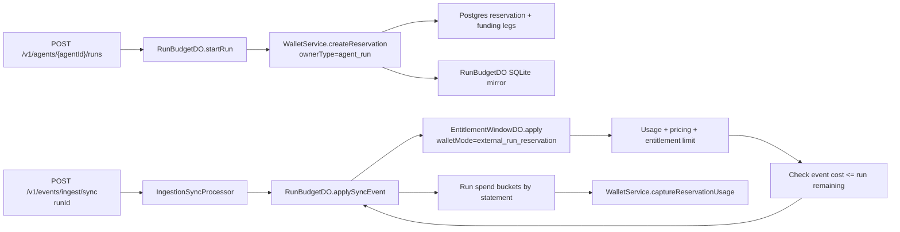

# Agent Run Budget Durable Object Implementation Plan

> **For agentic workers:** REQUIRED SUB-SKILL: Use superpowers:subagent-driven-development (recommended) or superpowers:executing-plans to implement this plan task-by-task. Steps use checkbox (`- [ ]`) syntax for tracking.

**Goal:** Add native project-owned agents, customer agent runs, run-scoped wallet reservations, and a `RunBudgetDO` that hard-gates synchronous run usage while preserving record-first async attribution.

**Architecture:** Postgres and pgledger remain the source of truth for reserved funds; Durable Objects keep hot-path mirrors and serialize spend decisions. `EntitlementWindowDO` keeps ownership of entitlement usage, pricing, and limit checks, while `RunBudgetDO` owns run budget admission, run-level spend aggregation, and reservation capture grouped by entitlement billing bucket. Existing non-run sync and async ingestion paths stay compatible.

**Tech Stack:** TypeScript, Cloudflare Durable Objects, Drizzle Postgres, Drizzle durable SQLite, Hono OpenAPI routes, tRPC, Vitest, Tinybird, `@unprice/services`, `@unprice/db`, `@unprice/analytics`.

---

## Thread Context Summary

The market split is useful: Stripe-style metering records usage after it happened, while gateway-style spend limits block before work is forwarded. Unprice should support both:

```text
sync ingestion = admission control
async ingestion = accounting truth and notification
```

The current wallet reservation model is already the right financial primitive. In code today:

- `internal/services/src/wallet/service.ts` creates, captures, extends, and releases reservations.
- `internal/db/src/schema/entitlementReservations.ts` stores the Postgres reservation and funding legs.
- `apps/api/src/ingestion/entitlements/db/schema.ts` stores only the `EntitlementWindowDO` hot mirror.
- `EntitlementWindowDO` prices events, enforces entitlement limits, checks wallet runway, and flushes captured usage to Postgres.

The design decisions for this feature:

- Agents are project-owned templates.
- Runs are customer-scoped executions of an agent.
- Run groups are reporting-only through `traceId` and `parentRunId`; no shared group budget in this plan.
- Sync run events are hard gated by `RunBudgetDO`.
- Async run events are attributed to the run and can trigger notifications, but they are not hard gated by `RunBudgetDO`.
- Financial reservations stay in Postgres and pgledger. `RunBudgetDO` stores a durable local mirror and pending capture intents.
- `RunBudgetDO` must not capture one opaque run total. It must capture by entitlement billing bucket so invoice and charge explanation still have feature/statement attribution.



## Scope

This plan implements the backend primitives, public API surface, ingestion routing, Durable Object, wallet reservation mapping, analytics attribution, and focused dashboard/tRPC management endpoints for agents and runs.

This plan does not implement model-provider proxying, group-level shared budgets, nested run budgets, long-lived workflow schedulers, or a full notification delivery product. The notification behavior in this plan is represented by durable run status fields, reporting fields, and a first-class wide event that downstream notification delivery can consume.

## File Structure

- Modify `internal/db/src/utils/id.ts`
  - Add `agent` and `agent_run` ID prefixes.

- Create `internal/db/src/schema/agents.ts`
  - Owns `agents` and `agent_runs` Postgres tables.
  - `agents` are project-owned templates.
  - `agent_runs` are customer-owned executions with budget, reservation, trace, and lifecycle fields.

- Modify `internal/db/src/schema/entitlementReservations.ts`
  - Add explicit wallet reservation ownership fields: `ownerType`, `ownerId`.
  - Keep the existing table and funding legs to avoid duplicating reservation accounting.
  - Keep `entitlementId` for compatibility, but make new code use owner fields.

- Modify `internal/db/src/schema.ts`
  - Export the new agents schema.

- Create `internal/db/src/validators/agents.ts`
  - Zod contracts for agents and agent runs.

- Modify `internal/db/src/validators/wallets.ts`
  - Add Zod contract for reservation owner fields.

- Modify `internal/db/src/validators.ts`
  - Export agent validators.

- Modify generated database migrations through `bin/migrate.dev`
  - Do not hand-write migration SQL.

- Modify `internal/services/src/wallet/service.ts`
  - Extend reservation creation to accept `ownerType`, `ownerId`, and `minimumAllocationAmount`.
  - Preserve current entitlement reservation callers through compatibility input.

- Modify `internal/services/src/wallet/service.test.ts`
  - Prove entitlement reservations still dedupe by owner.
  - Prove agent-run reservations reserve by run owner.
  - Prove `minimumAllocationAmount` rejects before moving funds.

- Create `internal/services/src/agents/service.ts`
  - CRUD/read methods for agent templates and run records.

- Create `internal/services/src/agents/index.ts`
  - Export `AgentService`.

- Create `internal/services/src/agents/service.test.ts`
  - Unit tests for service contracts with Drizzle fakes.

- Create `internal/services/src/use-cases/agents/start-run.ts`
  - Business orchestration for validating the agent and starting a run through `RunBudgetDO`.

- Create `internal/services/src/use-cases/agents/end-run.ts`
  - Business orchestration for ending a run through `RunBudgetDO`.

- Modify `internal/services/src/use-cases/index.ts`
  - Export agent run use cases.

- Modify `internal/services/src/context.ts`
  - Wire `AgentService` into the service graph.

- Modify `apps/api/src/hono/env.ts`
  - Add `agents` to the Hono service context.

- Create `apps/api/src/ingestion/run-budget/contracts.ts`
  - Shared RPC schemas for `RunBudgetDO`.

- Create `apps/api/src/ingestion/run-budget/db/schema.ts`
  - Durable SQLite schema for run state, entitlement spend buckets, pending capture intents, and idempotency.

- Create `apps/api/src/ingestion/run-budget/RunBudgetDO.ts`
  - Cloudflare Durable Object that starts runs, gates sync events, records run spend, flushes reservation captures, releases unused budget, and exposes status.

- Create `apps/api/src/ingestion/run-budget/client.ts`
  - Cloudflare client used by services to get the correct `RunBudgetDO` stub by project/customer/run.

- Create `apps/api/src/ingestion/run-budget/RunBudgetDO.test.ts`
  - Unit tests for run budget admission, flush intents, replay, and release behavior.

- Modify `apps/api/src/env.ts`
  - Add the `runbudget` Durable Object binding.

- Modify `apps/api/src/index.ts`
  - Export `RunBudgetDO`.

- Modify `apps/api/wrangler.jsonc`
  - Add the `runbudget` binding and migrations in dev, preview, and prod.

- Modify `apps/api/src/ingestion/service.ts`
  - Inject `CloudflareRunBudgetClient` into `IngestionService`.

- Modify `internal/services/src/ingestion/message.ts`
  - Add optional run context to ingestion messages.

- Modify `internal/services/src/ingestion/interface.ts`
  - Add `RUN_BUDGET_EXCEEDED`.

- Modify `internal/services/src/ingestion/entitlement-window-applier.ts`
  - Accept wallet mode and run budget context.

- Modify `internal/services/src/ingestion/sync-processor.ts`
  - Route only messages with `runContext.runId` through `RunBudgetDO`; keep ordinary sync unchanged.

- Modify `apps/api/src/ingestion/entitlements/contracts.ts`
  - Add `walletMode`, `RunBudgetUsageBucket`, and `RUN_BUDGET_EXCEEDED`.

- Modify `apps/api/src/ingestion/entitlements/EntitlementWindowDO.ts`
  - Skip entitlement wallet reservation in external run mode.
  - Check run remaining after pricing and before commit.
  - Return run capture bucket data to `RunBudgetDO`.

- Modify `apps/api/src/routes/events/ingestEventsV1.ts`
  - Accept optional run attribution on async ingestion.

- Modify `apps/api/src/routes/events/ingestEventsSyncV1.ts`
  - Accept optional `runId` on sync ingestion.

- Create `apps/api/src/routes/agents/createAgentV1.ts`
  - Public API route for project-owned agent templates.

- Create `apps/api/src/routes/agents/listAgentsV1.ts`
  - Public API route for project agent templates.

- Create `apps/api/src/routes/agents/startAgentRunV1.ts`
  - Public API route for starting a customer run.

- Create `apps/api/src/routes/agents/endAgentRunV1.ts`
  - Public API route for ending and releasing a run.

- Create `apps/api/src/routes/agents/getAgentRunV1.ts`
  - Public API route for run status and spend summary.

- Modify `internal/analytics/src/validators.ts`
  - Add optional `agent_id`, `run_id`, `trace_id`, `parent_run_id`, and `funding_status` fields.

- Modify `internal/analytics/datasources/unprice_entitlement_meter_facts.datasource`
  - Add nullable run attribution columns.

- Modify `internal/analytics/datasources/unprice_ingestion_events.datasource`
  - Add nullable run attribution columns.

- Modify `internal/services/src/ingestion/reporting.ts`
  - Include run context in reporting audit records.

- Modify `internal/services/src/ingestion/reporting-envelope.ts`
  - Include run context in event audit payloads.

- Modify `apps/api/scripts/schemas/events.json`
  - Regenerate through `pnpm --filter api scripts:lakehouse-schemas`.

- Create `internal/trpc/src/router/lambda/agents/index.ts`
  - Dashboard tRPC router for agent list/create/run list.

- Modify `internal/trpc/src/router/lambda/index.ts`
  - Register the agents router.

- Modify `apps/nextjs/src/constants/projects.ts`
  - Add a project nav item for Agents.

- Create `apps/nextjs/src/app/(root)/dashboard/[workspaceSlug]/[projectSlug]/agents/page.tsx`
  - Minimal project Agents page showing templates and recent runs.

---

## Task 1: Add Agent And Run Database Contracts

**Files:**
- Modify: `internal/db/src/utils/id.ts`
- Create: `internal/db/src/schema/agents.ts`
- Modify: `internal/db/src/schema.ts`
- Create: `internal/db/src/validators/agents.ts`
- Modify: `internal/db/src/validators.ts`
- Modify: generated migration files from `bin/migrate.dev`

- [ ] **Step 1: Add ID prefixes**

Modify `internal/db/src/utils/id.ts`:

```ts
export const prefixes = {
  workspace: "ws",
  request: "req",
  project: "proj",
  user: "usr",
  feature: "ft",
  event: "evt",
  feature_version: "fv",
  plan: "plan",
  apikey: "api",
  apikey_key: "unprice_live",
  page: "page",
  customer: "cus",
  customer_session: "cs",
  customer_provider: "cp",
  customer_entitlement: "ce",
  subscription: "sub",
  subscription_item: "si",
  subscription_phase: "sp",
  domain: "dom",
  plan_version: "pv",
  usage: "usage",
  log: "log",
  invoice: "inv",
  billing_period: "bp",
  payment_provider_config: "ppc",
  isolate: "iso",
  session: "sess",
  subscription_lock: "slock",
  entitlement: "ent",
  grant: "grnt",
  ledger: "ldg",
  ledger_entry: "le",
  ledger_settlement: "lset",
  ledger_settlement_line: "lsl",
  entitlement_reservation: "eres",
  entitlement_reservation_funding_leg: "erfl",
  wallet_topup: "wtup",
  wallet_credit: "wcr",
  agent: "agent",
  agent_run: "run",
} as const
```

- [ ] **Step 2: Create agent schema**

Create `internal/db/src/schema/agents.ts`:

```ts
import { relations, sql } from "drizzle-orm"
import {
  bigint,
  foreignKey,
  index,
  integer,
  jsonb,
  primaryKey,
  text,
  timestamp,
  uniqueIndex,
} from "drizzle-orm/pg-core"

import { pgTableProject } from "../utils/_table"
import { cuid, timestamps } from "../utils/fields"
import { projectID } from "../utils/sql"
import { customers } from "./customers"
import { projects } from "./projects"

export type AgentMetadata = Record<string, unknown>
export type AgentRunMetadata = Record<string, unknown>
export type AgentRunStatus =
  | "running"
  | "completed"
  | "expired"
  | "canceled"
  | "budget_exceeded"
  | "failed"

export const agents = pgTableProject(
  "agents",
  {
    ...projectID,
    ...timestamps,
    slug: text("slug").notNull(),
    name: text("name").notNull(),
    description: text("description"),
    instructions: text("instructions"),
    metadata: jsonb("metadata").$type<AgentMetadata>().notNull().default({}),
    archivedAt: timestamp("archived_at", { withTimezone: true }),
  },
  (table) => ({
    primary: primaryKey({
      columns: [table.id, table.projectId],
      name: "agents_pkey",
    }),
    slug: uniqueIndex("agents_project_slug_idx").on(table.projectId, table.slug),
    active: index("agents_active_idx")
      .on(table.projectId, table.archivedAt)
      .where(sql`${table.archivedAt} IS NULL`),
    projectfk: foreignKey({
      columns: [table.projectId],
      foreignColumns: [projects.id],
      name: "agents_project_id_fkey",
    }).onDelete("cascade"),
  })
)

export const agentRuns = pgTableProject(
  "agent_runs",
  {
    ...projectID,
    agentId: cuid("agent_id").notNull(),
    customerId: cuid("customer_id").notNull(),
    reservationId: cuid("reservation_id"),
    status: text("status").$type<AgentRunStatus>().notNull().default("running"),
    currency: text("currency").notNull(),
    requestedBudgetAmount: bigint("requested_budget_amount", { mode: "number" }).notNull(),
    reservedBudgetAmount: bigint("reserved_budget_amount", { mode: "number" }).notNull(),
    consumedAmount: bigint("consumed_amount", { mode: "number" }).notNull().default(0),
    flushedAmount: bigint("flushed_amount", { mode: "number" }).notNull().default(0),
    traceId: text("trace_id").notNull(),
    parentRunId: cuid("parent_run_id"),
    expiresAt: timestamp("expires_at", { withTimezone: true }).notNull(),
    startedAt: timestamp("started_at", { withTimezone: true }).notNull().default(sql`now()`),
    endedAt: timestamp("ended_at", { withTimezone: true }),
    lastEventAt: timestamp("last_event_at", { withTimezone: true }),
    metadata: jsonb("metadata").$type<AgentRunMetadata>().notNull().default({}),
  },
  (table) => ({
    primary: primaryKey({
      columns: [table.id, table.projectId],
      name: "agent_runs_pkey",
    }),
    agent: index("agent_runs_agent_idx").on(table.projectId, table.agentId, table.startedAt),
    customer: index("agent_runs_customer_idx").on(
      table.projectId,
      table.customerId,
      table.startedAt
    ),
    trace: index("agent_runs_trace_idx").on(table.projectId, table.traceId, table.startedAt),
    activeExpiry: index("agent_runs_active_expiry_idx")
      .on(table.projectId, table.expiresAt)
      .where(sql`${table.endedAt} IS NULL`),
    agentfk: foreignKey({
      columns: [table.agentId, table.projectId],
      foreignColumns: [agents.id, agents.projectId],
      name: "agent_runs_agent_id_fkey",
    }).onDelete("cascade"),
    customerfk: foreignKey({
      columns: [table.customerId, table.projectId],
      foreignColumns: [customers.id, customers.projectId],
      name: "agent_runs_customer_id_fkey",
    }).onDelete("cascade"),
    parentRunfk: foreignKey({
      columns: [table.parentRunId, table.projectId],
      foreignColumns: [table.id, table.projectId],
      name: "agent_runs_parent_run_id_fkey",
    }).onDelete("set null"),
  })
)

export const agentsRelations = relations(agents, ({ many, one }) => ({
  project: one(projects, {
    fields: [agents.projectId],
    references: [projects.id],
  }),
  runs: many(agentRuns),
}))

export const agentRunsRelations = relations(agentRuns, ({ one }) => ({
  project: one(projects, {
    fields: [agentRuns.projectId],
    references: [projects.id],
  }),
  agent: one(agents, {
    fields: [agentRuns.agentId, agentRuns.projectId],
    references: [agents.id, agents.projectId],
  }),
  customer: one(customers, {
    fields: [agentRuns.customerId, agentRuns.projectId],
    references: [customers.id, customers.projectId],
  }),
  parentRun: one(agentRuns, {
    fields: [agentRuns.parentRunId, agentRuns.projectId],
    references: [agentRuns.id, agentRuns.projectId],
  }),
}))
```

- [ ] **Step 3: Export agent schema**

Modify `internal/db/src/schema.ts`:

```ts
export * from "./schema/agents"
```

- [ ] **Step 4: Add agent validators**

Create `internal/db/src/validators/agents.ts`:

```ts
import { createInsertSchema, createSelectSchema } from "drizzle-zod"
import { z } from "zod"

import * as schema from "../schema"

export const agentSlugSchema = z
  .string()
  .min(1)
  .max(64)
  .regex(/^[a-z0-9._-]+$/, {
    message: "Slug must contain only lowercase letters, numbers, dots, dashes, and underscores",
  })

export const agentRunStatusSchema = z.enum([
  "running",
  "completed",
  "expired",
  "canceled",
  "budget_exceeded",
  "failed",
])

export const agentMetadataSchema = z.record(z.string(), z.unknown())
export const agentRunMetadataSchema = z.record(z.string(), z.unknown())

export const agentSelectSchema = createSelectSchema(schema.agents, {
  slug: agentSlugSchema,
  name: z.string().min(1).max(120),
  description: z.string().max(500).nullable(),
  instructions: z.string().max(20_000).nullable(),
  metadata: agentMetadataSchema,
})

export const agentInsertSchema = createInsertSchema(schema.agents, {
  slug: agentSlugSchema,
  name: z.string().min(1).max(120),
  description: z.string().max(500).nullable().optional(),
  instructions: z.string().max(20_000).nullable().optional(),
  metadata: agentMetadataSchema.optional(),
}).omit({
  createdAtM: true,
  updatedAtM: true,
})

export const agentRunSelectSchema = createSelectSchema(schema.agentRuns, {
  status: agentRunStatusSchema,
  metadata: agentRunMetadataSchema,
})

export const agentRunInsertSchema = createInsertSchema(schema.agentRuns, {
  status: agentRunStatusSchema.optional(),
  metadata: agentRunMetadataSchema.optional(),
})

export type Agent = z.infer<typeof agentSelectSchema>
export type InsertAgent = z.infer<typeof agentInsertSchema>
export type AgentRun = z.infer<typeof agentRunSelectSchema>
export type InsertAgentRun = z.infer<typeof agentRunInsertSchema>
export type AgentRunStatus = z.infer<typeof agentRunStatusSchema>
```

- [ ] **Step 5: Export agent validators**

Modify `internal/db/src/validators.ts`:

```ts
export * from "./validators/agents"
```

- [ ] **Step 6: Generate the Postgres migration**

Run:

```bash
bin/migrate.dev
```

Expected: a generated Drizzle migration includes `agents` and `agent_runs`.

- [ ] **Step 7: Run DB package typecheck**

Run:

```bash
pnpm --filter @unprice/db typecheck
```

Expected: PASS.

- [ ] **Step 8: Commit**

```bash
git add internal/db/src/utils/id.ts internal/db/src/schema.ts internal/db/src/schema/agents.ts internal/db/src/validators.ts internal/db/src/validators/agents.ts internal/db/drizzle
git commit -m "feat: add agent run database contracts"
```

## Task 2: Generalize Wallet Reservations To Explicit Owners

**Files:**
- Modify: `internal/db/src/schema/entitlementReservations.ts`
- Modify: `internal/db/src/validators/wallets.ts`
- Modify: `internal/services/src/wallet/service.ts`
- Modify: `internal/services/src/wallet/service.test.ts`
- Modify: generated migration files from `bin/migrate.dev`

- [ ] **Step 1: Add reservation owner fields to schema**

Modify `internal/db/src/schema/entitlementReservations.ts`:

```ts
export type WalletReservationOwnerType = "entitlement_window" | "agent_run"
```

Inside `entitlementReservations` columns, keep `entitlementId` for compatibility and add owner fields:

```ts
entitlementId: cuid("entitlement_id"),
ownerType: text("owner_type")
  .$type<WalletReservationOwnerType>()
  .notNull()
  .default("entitlement_window"),
ownerId: cuid("owner_id").notNull(),
```

Replace the active unique index with owner uniqueness:

```ts
ownerPeriod: uniqueIndex("entitlement_reservations_owner_period_idx")
  .on(table.projectId, table.ownerType, table.ownerId, table.periodStartAt)
  .where(sql`${table.reconciledAt} IS NULL`),
owner: index("entitlement_reservations_owner_idx").on(
  table.projectId,
  table.ownerType,
  table.ownerId
),
```

- [ ] **Step 2: Add wallet validator owner schema**

Modify `internal/db/src/validators/wallets.ts`:

```ts
export const walletReservationOwnerTypeSchema = z.enum(["entitlement_window", "agent_run"])
export const walletReservationOwnerSchema = z.object({
  type: walletReservationOwnerTypeSchema,
  id: z.string().min(1),
})
export type WalletReservationOwnerType = z.infer<typeof walletReservationOwnerTypeSchema>
export type WalletReservationOwner = z.infer<typeof walletReservationOwnerSchema>
```

- [ ] **Step 3: Write failing wallet tests**

Append these tests to `internal/services/src/wallet/service.test.ts`:

```ts
it("creates an entitlement-window reservation with explicit owner fields", async () => {
  const state = createState()
  const service = createService(state)
  seedPurchasedBalance(state, 10_000_000_000)

  const result = await service.createReservation({
    projectId: "proj_123",
    customerId: "cus_123",
    currency: "USD",
    entitlementId: "ce_123",
    owner: { type: "entitlement_window", id: "ce_123" },
    requestedAmount: 1_000_000_000,
    minimumAllocationAmount: 1_000_000_000,
    refillThresholdBps: 2000,
    refillChunkAmount: 0,
    periodStartAt: new Date("2026-06-01T00:00:00.000Z"),
    periodEndAt: new Date("2026-07-01T00:00:00.000Z"),
    idempotencyKey: "do_lazy:ce_123:2026-06",
  })

  expect(result.err).toBeUndefined()
  const insert = state.inserts.find((entry) => entry.table === "entitlementReservations")
  expect(insert?.values).toMatchObject({
    entitlementId: "ce_123",
    ownerType: "entitlement_window",
    ownerId: "ce_123",
    allocationAmount: 1_000_000_000,
  })
})

it("creates an agent-run reservation without an entitlement id", async () => {
  const state = createState()
  const service = createService(state)
  seedPurchasedBalance(state, 10_000_000_000)

  const result = await service.createReservation({
    projectId: "proj_123",
    customerId: "cus_123",
    currency: "USD",
    owner: { type: "agent_run", id: "run_123" },
    requestedAmount: 2_000_000_000,
    minimumAllocationAmount: 2_000_000_000,
    refillThresholdBps: 0,
    refillChunkAmount: 0,
    periodStartAt: new Date("2026-06-15T10:00:00.000Z"),
    periodEndAt: new Date("2026-06-15T11:00:00.000Z"),
    idempotencyKey: "agent_run:run_123:start",
  })

  expect(result.err).toBeUndefined()
  const insert = state.inserts.find((entry) => entry.table === "entitlementReservations")
  expect(insert?.values).toMatchObject({
    entitlementId: null,
    ownerType: "agent_run",
    ownerId: "run_123",
    allocationAmount: 2_000_000_000,
  })
})

it("rejects strict reservations before moving funds when available balance is short", async () => {
  const state = createState()
  const service = createService(state)
  seedPurchasedBalance(state, 500_000_000)

  const result = await service.createReservation({
    projectId: "proj_123",
    customerId: "cus_123",
    currency: "USD",
    owner: { type: "agent_run", id: "run_123" },
    requestedAmount: 2_000_000_000,
    minimumAllocationAmount: 2_000_000_000,
    refillThresholdBps: 0,
    refillChunkAmount: 0,
    periodStartAt: new Date("2026-06-15T10:00:00.000Z"),
    periodEndAt: new Date("2026-06-15T11:00:00.000Z"),
    idempotencyKey: "agent_run:run_123:start",
  })

  expect(result.err?.message).toBe("WALLET_EMPTY")
  expect(state.transfers).toEqual([])
  expect(state.inserts.filter((entry) => entry.table === "entitlementReservations")).toEqual([])
})
```

- [ ] **Step 4: Verify wallet tests fail**

Run:

```bash
pnpm --filter @unprice/services test src/wallet/service.test.ts
```

Expected: FAIL because `owner`, `minimumAllocationAmount`, `seedPurchasedBalance`, or owner insert fields are not implemented.

- [ ] **Step 5: Extend wallet reservation input**

Modify `internal/services/src/wallet/service.ts`:

```ts
export type WalletReservationOwner =
  | { type: "entitlement_window"; id: string }
  | { type: "agent_run"; id: string }

export interface CreateReservationInput {
  projectId: string
  customerId: string
  currency: Currency
  entitlementId?: string
  owner?: WalletReservationOwner
  requestedAmount: number
  minimumAllocationAmount?: number
  refillThresholdBps: number
  refillChunkAmount: number
  periodStartAt: Date
  periodEndAt: Date
  metadata?: Record<string, unknown>
  idempotencyKey: string
  effectiveAt?: Date
}

function resolveReservationOwner(input: Pick<CreateReservationInput, "entitlementId" | "owner">): {
  entitlementId: string | null
  owner: WalletReservationOwner
} {
  if (input.owner) {
    return {
      entitlementId: input.owner.type === "entitlement_window" ? input.owner.id : null,
      owner: input.owner,
    }
  }

  if (!input.entitlementId) {
    throw new Error("Reservation owner is required")
  }

  return {
    entitlementId: input.entitlementId,
    owner: { type: "entitlement_window", id: input.entitlementId },
  }
}
```

- [ ] **Step 6: Deduplicate by owner**

Inside `createReservation`, resolve owner and replace the existing query:

```ts
const resolvedOwner = resolveReservationOwner(input)

const existing = await (tx as Transaction).query.entitlementReservations.findFirst({
  where: and(
    eq(entitlementReservations.projectId, input.projectId),
    eq(entitlementReservations.ownerType, resolvedOwner.owner.type),
    eq(entitlementReservations.ownerId, resolvedOwner.owner.id),
    eq(entitlementReservations.periodStartAt, input.periodStartAt),
    isNull(entitlementReservations.reconciledAt)
  ),
})
```

- [ ] **Step 7: Add strict minimum allocation check**

Before calling `drainGrantedFIFO`, add:

```ts
const minimumAllocationAmount = input.minimumAllocationAmount ?? 0
if (minimumAllocationAmount > 0) {
  const availableAmount = await this.readDrainableReservationAmount(tx as Transaction, {
    customerId: input.customerId,
    projectId: input.projectId,
    effectiveAt: input.effectiveAt ?? new Date(),
    purchasedAccountKey: keys.purchased,
  })

  if (availableAmount < minimumAllocationAmount) {
    return Err(new UnPriceWalletError({ message: "WALLET_EMPTY" }))
  }
}
```

Add the helper near `drainGrantedFIFO`:

```ts
private async readDrainableReservationAmount(
  tx: Transaction,
  params: {
    customerId: string
    effectiveAt: Date
    projectId: string
    purchasedAccountKey: string
  }
): Promise<number> {
  const activeGrants = await tx.query.walletCredits.findMany({
    where: and(
      eq(walletCredits.customerId, params.customerId),
      eq(walletCredits.projectId, params.projectId),
      isNull(walletCredits.expiredAt),
      isNull(walletCredits.voidedAt),
      gt(walletCredits.remainingAmount, 0),
      or(isNull(walletCredits.expiresAt), gt(walletCredits.expiresAt, params.effectiveAt))
    ),
  })

  const granted = activeGrants.reduce((sum, grant) => sum + grant.remainingAmount, 0)
  const purchased = await this.readBalance(tx, params.purchasedAccountKey)
  return granted + purchased
}
```

- [ ] **Step 8: Insert owner fields and metadata**

In the reservation insert:

```ts
await tx.insert(entitlementReservations).values({
  id: reservationId,
  projectId: input.projectId,
  customerId: input.customerId,
  entitlementId: resolvedOwner.entitlementId,
  ownerType: resolvedOwner.owner.type,
  ownerId: resolvedOwner.owner.id,
  allocationAmount,
  consumedAmount: 0,
  ...(reservationMetadata ? { metadata: reservationMetadata } : {}),
  refillThresholdBps: input.refillThresholdBps,
  refillChunkAmount: input.refillChunkAmount,
  periodStartAt: input.periodStartAt,
  periodEndAt: input.periodEndAt,
})
```

In reserve transfer metadata, replace entitlement-only metadata with owner metadata:

```ts
reservation_owner_type: resolvedOwner.owner.type,
reservation_owner_id: resolvedOwner.owner.id,
...(resolvedOwner.entitlementId ? { entitlement_id: resolvedOwner.entitlementId } : {}),
```

- [ ] **Step 9: Generate migration**

Run:

```bash
bin/migrate.dev
```

Expected: generated migration adds `owner_type`, `owner_id`, nullable `entitlement_id`, and owner indexes.

- [ ] **Step 10: Run wallet tests**

Run:

```bash
pnpm --filter @unprice/services test src/wallet/service.test.ts
```

Expected: PASS.

- [ ] **Step 11: Commit**

```bash
git add internal/db/src/schema/entitlementReservations.ts internal/db/src/validators/wallets.ts internal/services/src/wallet/service.ts internal/services/src/wallet/service.test.ts internal/db/drizzle
git commit -m "feat: add owner-scoped wallet reservations"
```

## Task 3: Add Agent Service And Run Use Cases

**Files:**
- Create: `internal/services/src/agents/service.ts`
- Create: `internal/services/src/agents/index.ts`
- Create: `internal/services/src/agents/service.test.ts`
- Create: `internal/services/src/use-cases/agents/start-run.ts`
- Create: `internal/services/src/use-cases/agents/end-run.ts`
- Modify: `internal/services/src/use-cases/index.ts`
- Modify: `internal/services/src/context.ts`
- Modify: `apps/api/src/hono/env.ts`

- [ ] **Step 1: Create agent service contract**

Create `internal/services/src/agents/service.ts`:

```ts
import { type Database, and, desc, eq, isNull } from "@unprice/db"
import { agentRuns, agents } from "@unprice/db/schema"
import { newId } from "@unprice/db/utils"
import type { Agent, AgentRun, InsertAgent } from "@unprice/db/validators"
import { Err, FetchError, Ok, type Result, wrapResult } from "@unprice/error"
import type { Logger } from "@unprice/logs"

export class AgentService {
  private readonly db: Database
  private readonly logger: Logger

  constructor(deps: { db: Database; logger: Logger }) {
    this.db = deps.db
    this.logger = deps.logger
  }

  public async createAgent(input: {
    description?: string | null
    instructions?: string | null
    metadata?: Record<string, unknown>
    name: string
    projectId: string
    slug: string
  }): Promise<Result<Agent, FetchError>> {
    const result = await wrapResult(
      this.db
        .insert(agents)
        .values({
          id: newId("agent"),
          projectId: input.projectId,
          name: input.name,
          slug: input.slug,
          description: input.description ?? null,
          instructions: input.instructions ?? null,
          metadata: input.metadata ?? {},
        } satisfies InsertAgent)
        .returning()
        .then((rows) => rows[0] ?? null),
      (error) => new FetchError({ message: `error creating agent: ${error.message}`, retry: false })
    )

    if (result.err) {
      this.logger.error(result.err, { context: "error creating agent", projectId: input.projectId })
      return Err(result.err)
    }

    if (!result.val) {
      return Err(new FetchError({ message: "error creating agent", retry: false }))
    }

    return Ok(result.val as Agent)
  }

  public async getAgentById(input: {
    agentId: string
    projectId: string
  }): Promise<Result<Agent | null, FetchError>> {
    const result = await wrapResult(
      this.db.query.agents.findFirst({
        where: and(eq(agents.id, input.agentId), eq(agents.projectId, input.projectId)),
      }),
      (error) => new FetchError({ message: `error getting agent: ${error.message}`, retry: false })
    )

    if (result.err) return Err(result.err)
    return Ok((result.val ?? null) as Agent | null)
  }

  public async listAgentsByProject(input: {
    projectId: string
  }): Promise<Result<Agent[], FetchError>> {
    const result = await wrapResult(
      this.db.query.agents.findMany({
        where: and(eq(agents.projectId, input.projectId), isNull(agents.archivedAt)),
        orderBy: [desc(agents.updatedAtM)],
      }),
      (error) => new FetchError({ message: `error listing agents: ${error.message}`, retry: false })
    )

    if (result.err) return Err(result.err)
    return Ok(result.val as Agent[])
  }

  public async getRunById(input: {
    projectId: string
    runId: string
  }): Promise<Result<AgentRun | null, FetchError>> {
    const result = await wrapResult(
      this.db.query.agentRuns.findFirst({
        where: and(eq(agentRuns.id, input.runId), eq(agentRuns.projectId, input.projectId)),
      }),
      (error) =>
        new FetchError({ message: `error getting agent run: ${error.message}`, retry: false })
    )

    if (result.err) return Err(result.err)
    return Ok((result.val ?? null) as AgentRun | null)
  }
}
```

- [ ] **Step 2: Export service**

Create `internal/services/src/agents/index.ts`:

```ts
export * from "./service"
```

- [ ] **Step 3: Add focused service test**

Create `internal/services/src/agents/service.test.ts`:

```ts
import { describe, expect, it, vi } from "vitest"
import { AgentService } from "./service"

describe("AgentService", () => {
  it("creates a project-owned agent template", async () => {
    const returning = vi.fn(async () => [
      {
        id: "agent_123",
        projectId: "proj_123",
        slug: "support-agent",
        name: "Support Agent",
        description: null,
        instructions: "Answer support questions",
        metadata: {},
        archivedAt: null,
        createdAtM: 1,
        updatedAtM: 1,
      },
    ])
    const values = vi.fn(() => ({ returning }))
    const insert = vi.fn(() => ({ values }))

    const service = new AgentService({
      db: { insert } as never,
      logger: { error: vi.fn() } as never,
    })

    const result = await service.createAgent({
      projectId: "proj_123",
      slug: "support-agent",
      name: "Support Agent",
      instructions: "Answer support questions",
    })

    expect(result.err).toBeUndefined()
    expect(result.val).toMatchObject({
      id: expect.stringMatching(/^agent_/),
      projectId: "proj_123",
      slug: "support-agent",
      name: "Support Agent",
    })
    expect(values).toHaveBeenCalledWith(
      expect.objectContaining({
        projectId: "proj_123",
        slug: "support-agent",
        name: "Support Agent",
        metadata: {},
      })
    )
  })
})
```

- [ ] **Step 4: Wire service graph**

Modify `internal/services/src/context.ts`:

```ts
import { AgentService } from "./agents/service"
```

Add to `ServiceContext`:

```ts
agents: AgentService
```

Construct before return:

```ts
const agents = new AgentService({
  db: deps.db,
  logger: deps.logger,
})
```

Return it:

```ts
return {
  analytics,
  apikeys,
  agents,
  customers,
  domains,
  events,
  features,
  pages,
  projects,
  workspaces,
  grantsManager,
  paymentProviderResolver,
  rating,
  ledger,
  billing,
  subscriptions,
  entitlements,
  plans,
  wallet,
}
```

- [ ] **Step 5: Wire Hono service context**

Modify `apps/api/src/hono/env.ts`:

```ts
import type { AgentService } from "@unprice/services/agents"
```

Add:

```ts
agents: AgentService
```

- [ ] **Step 6: Add start/end use-case contracts**

Create `internal/services/src/use-cases/agents/start-run.ts`:

```ts
import { z } from "zod"

export const startAgentRunInputSchema = z.object({
  agentId: z.string().min(1),
  budgetAmount: z.number().int().positive(),
  currency: z.string().length(3),
  customerId: z.string().min(1),
  expiresAt: z.date(),
  metadata: z.record(z.string(), z.unknown()).optional(),
  parentRunId: z.string().min(1).nullable().optional(),
  projectId: z.string().min(1),
  traceId: z.string().min(1).optional(),
})

export const startAgentRunOutputSchema = z.object({
  agentId: z.string(),
  budgetAmount: z.number().int(),
  consumedAmount: z.number().int(),
  currency: z.string().length(3),
  customerId: z.string(),
  expiresAt: z.date(),
  reservationId: z.string(),
  runId: z.string(),
  status: z.literal("running"),
  traceId: z.string(),
})

export type StartAgentRunInput = z.infer<typeof startAgentRunInputSchema>
export type StartAgentRunOutput = z.infer<typeof startAgentRunOutputSchema>
```

Create `internal/services/src/use-cases/agents/end-run.ts`:

```ts
import { z } from "zod"

export const endAgentRunInputSchema = z.object({
  projectId: z.string().min(1),
  runId: z.string().min(1),
})

export const endAgentRunOutputSchema = z.object({
  releasedAmount: z.number().int(),
  runId: z.string(),
  status: z.enum(["completed", "expired", "canceled", "budget_exceeded", "failed"]),
})

export type EndAgentRunInput = z.infer<typeof endAgentRunInputSchema>
export type EndAgentRunOutput = z.infer<typeof endAgentRunOutputSchema>
```

- [ ] **Step 7: Export use cases**

Modify `internal/services/src/use-cases/index.ts`:

```ts
export * from "./agents/start-run"
export * from "./agents/end-run"
```

- [ ] **Step 8: Run service tests**

Run:

```bash
pnpm --filter @unprice/services test src/agents/service.test.ts
```

Expected: PASS.

- [ ] **Step 9: Commit**

```bash
git add internal/services/src/agents internal/services/src/use-cases/agents internal/services/src/use-cases/index.ts internal/services/src/context.ts apps/api/src/hono/env.ts
git commit -m "feat: add agent service contracts"
```

## Task 4: Add RunBudgetDO Contracts, Storage, Binding, And Client

**Files:**
- Create: `apps/api/src/ingestion/run-budget/contracts.ts`
- Create: `apps/api/src/ingestion/run-budget/db/schema.ts`
- Create: `apps/api/src/ingestion/run-budget/client.ts`
- Create: `apps/api/src/ingestion/run-budget/RunBudgetDO.ts`
- Create: `apps/api/src/ingestion/run-budget/RunBudgetDO.test.ts`
- Modify: `apps/api/src/env.ts`
- Modify: `apps/api/src/index.ts`
- Modify: `apps/api/wrangler.jsonc`

- [ ] **Step 1: Add RunBudgetDO RPC contracts**

Create `apps/api/src/ingestion/run-budget/contracts.ts`:

```ts
import { entitlementApplyMeterFactSchema } from "../entitlements/contracts"
import { z } from "zod"

export const runBudgetContextSchema = z.object({
  agentId: z.string().min(1),
  parentRunId: z.string().nullable().optional(),
  runId: z.string().min(1),
  traceId: z.string().min(1),
})

export const runBudgetStartInputSchema = z.object({
  agentId: z.string().min(1),
  budgetAmount: z.number().int().positive(),
  currency: z.string().length(3),
  customerId: z.string().min(1),
  expiresAt: z.number().int(),
  metadata: z.record(z.string(), z.unknown()).optional(),
  parentRunId: z.string().min(1).nullable().optional(),
  projectId: z.string().min(1),
  runId: z.string().min(1),
  traceId: z.string().min(1),
})

export const runBudgetUsageBucketSchema = z.object({
  amount: z.number().int(),
  billingPeriodId: z.string().nullable(),
  currency: z.string().length(3),
  customerEntitlementId: z.string(),
  featurePlanVersionItemId: z.string().nullable(),
  featureSlug: z.string(),
  quantity: z.number(),
  statementKey: z.string().nullable(),
})

export const runBudgetApplySyncInputSchema = z.object({
  customerId: z.string().min(1),
  entitlementApplyInput: z.record(z.string(), z.unknown()),
  featureSlug: z.string().min(1),
  projectId: z.string().min(1),
  runId: z.string().min(1),
})

export const runBudgetApplySyncResultSchema = z.object({
  allowed: z.boolean(),
  deniedReason: z
    .enum(["LIMIT_EXCEEDED", "WALLET_EMPTY", "LATE_EVENT_CLOSED_PERIOD", "RUN_BUDGET_EXCEEDED"])
    .optional(),
  message: z.string().optional(),
  meterFacts: z.array(entitlementApplyMeterFactSchema).optional(),
  runContext: runBudgetContextSchema,
})

export const runBudgetEndInputSchema = z.object({
  closeReason: z.enum(["manual", "inactivity", "limit_reached", "wallet_empty", "period_close"]),
  projectId: z.string().min(1),
  runId: z.string().min(1),
})

export type RunBudgetContext = z.infer<typeof runBudgetContextSchema>
export type RunBudgetStartInput = z.infer<typeof runBudgetStartInputSchema>
export type RunBudgetApplySyncInput = z.infer<typeof runBudgetApplySyncInputSchema>
export type RunBudgetApplySyncResult = z.infer<typeof runBudgetApplySyncResultSchema>
export type RunBudgetEndInput = z.infer<typeof runBudgetEndInputSchema>
export type RunBudgetUsageBucket = z.infer<typeof runBudgetUsageBucketSchema>
```

- [ ] **Step 2: Add DO SQLite schema**

Create `apps/api/src/ingestion/run-budget/db/schema.ts`:

```ts
import { index, integer, real, sqliteTable, text } from "drizzle-orm/sqlite-core"

export const runStateTable = sqliteTable("run_state", {
  id: text("id").primaryKey(),
  agentId: text("agent_id").notNull(),
  projectId: text("project_id").notNull(),
  customerId: text("customer_id").notNull(),
  reservationId: text("reservation_id").notNull(),
  currency: text("currency").notNull(),
  status: text("status").notNull(),
  requestedBudgetAmount: integer("requested_budget_amount").notNull(),
  reservedBudgetAmount: integer("reserved_budget_amount").notNull(),
  consumedAmount: integer("consumed_amount").notNull().default(0),
  flushedAmount: integer("flushed_amount").notNull().default(0),
  flushSeq: integer("flush_seq").notNull().default(0),
  traceId: text("trace_id").notNull(),
  parentRunId: text("parent_run_id"),
  startedAt: integer("started_at").notNull(),
  expiresAt: integer("expires_at").notNull(),
  endedAt: integer("ended_at"),
  lastEventAt: integer("last_event_at"),
  metadataJson: text("metadata_json").notNull().default("{}"),
})

export const runSpendBucketTable = sqliteTable(
  "run_spend_buckets",
  {
    bucketKey: text("bucket_key").primaryKey(),
    runId: text("run_id").notNull(),
    customerEntitlementId: text("customer_entitlement_id").notNull(),
    featureSlug: text("feature_slug").notNull(),
    featurePlanVersionItemId: text("feature_plan_version_item_id"),
    statementKey: text("statement_key"),
    billingPeriodId: text("billing_period_id"),
    currency: text("currency").notNull(),
    consumedAmount: integer("consumed_amount").notNull().default(0),
    flushedAmount: integer("flushed_amount").notNull().default(0),
    consumedQuantity: real("consumed_quantity").notNull().default(0),
    flushedQuantity: real("flushed_quantity").notNull().default(0),
    updatedAt: integer("updated_at").notNull(),
  },
  (table) => ({
    run: index("idx_run_spend_buckets_run_id").on(table.runId),
  })
)

export const runCaptureIntentTable = sqliteTable(
  "run_capture_intents",
  {
    flushSeq: integer("flush_seq").primaryKey(),
    runId: text("run_id").notNull(),
    bucketKey: text("bucket_key").notNull(),
    amount: integer("amount").notNull(),
    quantity: real("quantity").notNull(),
    statementKey: text("statement_key"),
    billingPeriodId: text("billing_period_id"),
    featureSlug: text("feature_slug").notNull(),
    customerEntitlementId: text("customer_entitlement_id").notNull(),
    status: text("status").notNull(),
    createdAt: integer("created_at").notNull(),
    capturedAt: integer("captured_at"),
  },
  (table) => ({
    pending: index("idx_run_capture_intents_pending").on(table.runId, table.status),
  })
)

export const runIdempotencyTable = sqliteTable(
  "run_idempotency",
  {
    idempotencyKey: text("idempotency_key").primaryKey(),
    resultJson: text("result_json").notNull(),
    createdAt: integer("created_at").notNull(),
  },
  (table) => ({
    createdAt: index("idx_run_idempotency_created_at").on(table.createdAt),
  })
)

export const schema = {
  runCaptureIntentTable,
  runIdempotencyTable,
  runSpendBucketTable,
  runStateTable,
}
```

- [ ] **Step 3: Create RunBudgetDO skeleton**

Create `apps/api/src/ingestion/run-budget/RunBudgetDO.ts`:

```ts
import { DurableObject } from "cloudflare:workers"
import { createConnection } from "@unprice/db"
import { agentRuns } from "@unprice/db/schema"
import { LedgerGateway } from "@unprice/services/ledger"
import { WalletService } from "@unprice/services/wallet"
import { and, eq } from "drizzle-orm"
import { type DrizzleSqliteDODatabase, drizzle } from "drizzle-orm/durable-sqlite"
import type { Env } from "~/env"
import { createDoLogger, runDoOperation } from "~/observability"
import { CloudflareEntitlementWindowClient } from "../entitlements/client"
import {
  type RunBudgetApplySyncInput,
  type RunBudgetApplySyncResult,
  type RunBudgetEndInput,
  type RunBudgetStartInput,
  runBudgetApplySyncInputSchema,
  runBudgetEndInputSchema,
  runBudgetStartInputSchema,
} from "./contracts"
import { runCaptureIntentTable, runSpendBucketTable, runStateTable, schema } from "./db/schema"

export class RunBudgetDO extends DurableObject<Env> {
  private readonly db: DrizzleSqliteDODatabase<typeof schema>
  private readonly runtimeEnv: Env

  constructor(state: DurableObjectState, env: Env) {
    super(state, env as unknown as Cloudflare.Env)
    this.runtimeEnv = env
    this.db = drizzle(this.ctx.storage, { schema, logger: false })
  }

  public async startRun(rawInput: RunBudgetStartInput) {
    const input = runBudgetStartInputSchema.parse(rawInput)
    return runDoOperation(
      {
        requestId: this.ctx.id.toString(),
        service: "runbudget",
        operation: "start_run",
        waitUntil: (promise) => this.ctx.waitUntil(promise),
      },
      async () => this.startRunInner(input)
    )
  }

  public async applySyncEvent(rawInput: RunBudgetApplySyncInput): Promise<RunBudgetApplySyncResult> {
    const input = runBudgetApplySyncInputSchema.parse(rawInput)
    return runDoOperation(
      {
        requestId: this.ctx.id.toString(),
        service: "runbudget",
        operation: "apply_sync_event",
        waitUntil: (promise) => this.ctx.waitUntil(promise),
      },
      async () => this.applySyncEventInner(input)
    )
  }

  public async endRun(rawInput: RunBudgetEndInput) {
    const input = runBudgetEndInputSchema.parse(rawInput)
    return runDoOperation(
      {
        requestId: this.ctx.id.toString(),
        service: "runbudget",
        operation: "end_run",
        waitUntil: (promise) => this.ctx.waitUntil(promise),
      },
      async () => this.endRunInner(input)
    )
  }

  private async startRunInner(input: RunBudgetStartInput) {
    const existing = this.db.select().from(runStateTable).get()
    if (existing) return existing

    const postgres = createConnection(this.runtimeEnv)
    const wallet = new WalletService({
      db: postgres,
      logger: createDoLogger(this.ctx.id.toString()),
      ledgerGateway: new LedgerGateway({ db: postgres, logger: createDoLogger(this.ctx.id.toString()) }),
    })

    const reservation = await wallet.createReservation({
      projectId: input.projectId,
      customerId: input.customerId,
      currency: input.currency,
      owner: { type: "agent_run", id: input.runId },
      requestedAmount: input.budgetAmount,
      minimumAllocationAmount: input.budgetAmount,
      refillThresholdBps: 0,
      refillChunkAmount: 0,
      periodStartAt: new Date(Date.now()),
      periodEndAt: new Date(input.expiresAt),
      effectiveAt: new Date(),
      idempotencyKey: `agent_run:${input.runId}:start`,
      metadata: {
        requestedBy: "run_budget_do",
        durableObjectId: this.ctx.id.toString(),
        agentId: input.agentId,
        runId: input.runId,
        traceId: input.traceId,
      },
    })

    if (reservation.err) throw reservation.err

    this.db.insert(runStateTable).values({
      id: input.runId,
      agentId: input.agentId,
      projectId: input.projectId,
      customerId: input.customerId,
      reservationId: reservation.val.reservationId,
      currency: input.currency,
      status: "running",
      requestedBudgetAmount: input.budgetAmount,
      reservedBudgetAmount: reservation.val.allocationAmount,
      consumedAmount: 0,
      flushedAmount: 0,
      flushSeq: 0,
      traceId: input.traceId,
      parentRunId: input.parentRunId ?? null,
      startedAt: Date.now(),
      expiresAt: input.expiresAt,
      endedAt: null,
      lastEventAt: null,
      metadataJson: JSON.stringify(input.metadata ?? {}),
    }).run()

    await postgres
      .insert(agentRuns)
      .values({
        id: input.runId,
        projectId: input.projectId,
        agentId: input.agentId,
        customerId: input.customerId,
        reservationId: reservation.val.reservationId,
        status: "running",
        currency: input.currency,
        requestedBudgetAmount: input.budgetAmount,
        reservedBudgetAmount: reservation.val.allocationAmount,
        consumedAmount: 0,
        flushedAmount: 0,
        traceId: input.traceId,
        parentRunId: input.parentRunId ?? null,
        expiresAt: new Date(input.expiresAt),
        metadata: input.metadata ?? {},
      })

    await this.ctx.storage.setAlarm(input.expiresAt)
    return this.db.select().from(runStateTable).get()
  }

  private async applySyncEventInner(input: RunBudgetApplySyncInput): Promise<RunBudgetApplySyncResult> {
    throw new Error(`RunBudgetDO.applySyncEvent not wired for ${input.runId}`)
  }

  private async endRunInner(input: RunBudgetEndInput) {
    throw new Error(`RunBudgetDO.endRun not wired for ${input.runId}`)
  }
}
```

This skeleton intentionally fails for apply/end so the next tasks can test-drive the behavior.

- [ ] **Step 4: Add Cloudflare client**

Create `apps/api/src/ingestion/run-budget/client.ts`:

```ts
import type {
  RunBudgetApplySyncInput,
  RunBudgetApplySyncResult,
  RunBudgetEndInput,
  RunBudgetStartInput,
} from "./contracts"
import type { Env } from "~/env"

export type RunBudgetController = {
  applySyncEvent(input: RunBudgetApplySyncInput): Promise<RunBudgetApplySyncResult>
  endRun(input: RunBudgetEndInput): Promise<unknown>
  startRun(input: RunBudgetStartInput): Promise<unknown>
}

export interface RunBudgetClient {
  getRunBudgetStub(params: {
    customerId: string
    projectId: string
    runId: string
  }): RunBudgetController
}

export function buildRunBudgetName(params: {
  appEnv: string
  customerId: string
  projectId: string
  runId: string
}): string {
  return [params.appEnv, params.projectId, params.customerId, params.runId].join(":")
}

export class CloudflareRunBudgetClient implements RunBudgetClient {
  private readonly appEnv: Env["APP_ENV"]
  private readonly runbudget: Env["runbudget"]

  constructor(env: Pick<Env, "APP_ENV" | "runbudget">) {
    this.appEnv = env.APP_ENV
    this.runbudget = env.runbudget
  }

  public getRunBudgetStub(params: {
    customerId: string
    projectId: string
    runId: string
  }): RunBudgetController {
    return this.runbudget.getByName(
      buildRunBudgetName({
        appEnv: this.appEnv,
        customerId: params.customerId,
        projectId: params.projectId,
        runId: params.runId,
      })
    )
  }
}
```

- [ ] **Step 5: Bind the DO in runtime env**

Modify `apps/api/src/env.ts`:

```ts
import type { RunBudgetDO } from "~/ingestion/run-budget/RunBudgetDO"
```

Add server binding:

```ts
runbudget: z.custom<DurableObjectNamespace<RunBudgetDO>>((ns) => typeof ns === "object"),
```

- [ ] **Step 6: Export DO class**

Modify `apps/api/src/index.ts`:

```ts
export { RunBudgetDO } from "~/ingestion/run-budget/RunBudgetDO"
```

- [ ] **Step 7: Add wrangler bindings and migrations**

Modify each `durable_objects.bindings` array in `apps/api/wrangler.jsonc`:

```jsonc
{
  "name": "runbudget",
  "class_name": "RunBudgetDO"
}
```

Append to each environment migration list:

```jsonc
{
  "tag": "v6",
  "new_sqlite_classes": ["RunBudgetDO"]
}
```

- [ ] **Step 8: Add service factory expectation**

Modify `apps/api/src/ingestion/service.factory.test.ts` to include:

```ts
runbudget: {
  getByName: vi.fn(),
},
```

and assert `CloudflareRunBudgetClient` after Task 6 wires it into `IngestionService`.

- [ ] **Step 9: Run API typecheck**

Run:

```bash
pnpm --filter api type-check
```

Expected: FAIL only on intentionally unimplemented RunBudgetDO methods if TypeScript requires return shapes. Replace the thrown methods with typed temporary returns if needed:

```ts
return {
  allowed: false,
  deniedReason: "RUN_BUDGET_EXCEEDED",
  message: "Run budget path is not enabled",
  runContext: {
    agentId: "agent_unavailable",
    runId: input.runId,
    traceId: input.runId,
  },
}
```

- [ ] **Step 10: Commit**

```bash
git add apps/api/src/ingestion/run-budget apps/api/src/env.ts apps/api/src/index.ts apps/api/wrangler.jsonc apps/api/src/ingestion/service.factory.test.ts
git commit -m "feat: add run budget durable object scaffold"
```

## Task 5: Add External Run Reservation Mode To EntitlementWindowDO

**Files:**
- Modify: `apps/api/src/ingestion/entitlements/contracts.ts`
- Modify: `apps/api/src/ingestion/entitlements/EntitlementWindowDO.ts`
- Modify: `apps/api/src/ingestion/entitlements/EntitlementWindowDO.test.ts`
- Modify: `internal/services/src/ingestion/interface.ts`
- Modify: `internal/services/src/ingestion/entitlement-window-applier.ts`

- [ ] **Step 1: Add rejection reason**

Modify `internal/services/src/ingestion/interface.ts`:

```ts
export const INGESTION_REJECTION_REASONS = [
  "CUSTOMER_NOT_FOUND",
  "EVENT_TOO_OLD",
  "INVALID_ENTITLEMENT_CONFIGURATION",
  "INVALID_AGGREGATION_PROPERTIES",
  "LIMIT_EXCEEDED",
  "LATE_EVENT_CLOSED_PERIOD",
  "NO_MATCHING_ENTITLEMENT",
  "UNROUTABLE_EVENT",
  "WALLET_EMPTY",
  "RUN_BUDGET_EXCEEDED",
] as const
```

- [ ] **Step 2: Add entitlement DO wallet mode contract**

Modify `apps/api/src/ingestion/entitlements/contracts.ts`:

```ts
export const walletModeSchema = z.discriminatedUnion("kind", [
  z.object({ kind: z.literal("entitlement_reservation") }),
  z.object({
    kind: z.literal("external_run_reservation"),
    runId: z.string().min(1),
    remainingAmount: z.number().int().nonnegative(),
  }),
])

export const runBudgetUsageBucketSchema = z.object({
  amount: z.number().int(),
  billingPeriodId: z.string().nullable(),
  currency: z.string().length(3),
  customerEntitlementId: z.string(),
  featurePlanVersionItemId: z.string().nullable(),
  featureSlug: z.string(),
  quantity: z.number(),
  statementKey: z.string().nullable(),
})
```

Extend `applyInputSchema`:

```ts
walletMode: walletModeSchema.optional().default({ kind: "entitlement_reservation" }),
```

Extend `ApplyResult`:

```ts
runBudgetUsageBuckets?: RunBudgetUsageBucket[]
```

Extend `DeniedReason`:

```ts
export type DeniedReason = Extract<
  IngestionRejectionReason,
  "LIMIT_EXCEEDED" | "WALLET_EMPTY" | "LATE_EVENT_CLOSED_PERIOD" | "RUN_BUDGET_EXCEEDED"
>
```

- [ ] **Step 3: Add failing entitlement DO test**

Append to `apps/api/src/ingestion/entitlements/EntitlementWindowDO.test.ts`:

```ts
it("uses external run reservation mode to deny before committing over-budget sync usage", async () => {
  const durableObject = createDurableObject()
  const input = createApplyInput({
    enforceLimit: true,
    idempotencyKey: "idem_run_budget",
    properties: { amount: 1 },
  })

  const result = await durableObject.apply({
    ...input,
    walletMode: {
      kind: "external_run_reservation",
      runId: "run_123",
      remainingAmount: 0,
    },
  })

  expect(result).toMatchObject({
    allowed: false,
    deniedReason: "RUN_BUDGET_EXCEEDED",
  })
  expect(readMeterUsage(durableObject, DEFAULT_METER_KEY)).toBe(0)
})

it("returns run budget capture buckets when externally funded sync usage is allowed", async () => {
  const durableObject = createDurableObject()
  const input = createApplyInput({
    enforceLimit: true,
    idempotencyKey: "idem_run_budget_allowed",
    properties: { amount: 1 },
  })

  const result = await durableObject.apply({
    ...input,
    walletMode: {
      kind: "external_run_reservation",
      runId: "run_123",
      remainingAmount: 1_000_000_000,
    },
  })

  expect(result.allowed).toBe(true)
  expect(result.runBudgetUsageBuckets).toEqual([
    expect.objectContaining({
      amount: expect.any(Number),
      customerEntitlementId: input.entitlement.customerEntitlementId,
      featureSlug: input.entitlement.featureSlug,
    }),
  ])
  expect(readWalletReservation(durableObject)).toBeNull()
})
```

- [ ] **Step 4: Verify tests fail**

Run:

```bash
pnpm --filter api test src/ingestion/entitlements/EntitlementWindowDO.test.ts
```

Expected: FAIL because `walletMode` is unknown and external run mode is not implemented.

- [ ] **Step 5: Add run budget exceeded error**

Modify `apps/api/src/ingestion/entitlements/contracts.ts`:

```ts
export class EntitlementWindowRunBudgetExceededError extends Error {
  constructor(
    public readonly params: {
      cost: number
      eventId: string
      remaining: number
      runId: string
    }
  ) {
    super(`Run budget exceeded for run ${params.runId}`)
    this.name = EntitlementWindowRunBudgetExceededError.name
  }
}
```

- [ ] **Step 6: Skip entitlement wallet bootstrap in external mode**

In `handleSingleApplyReservationBootstrap`, set:

```ts
const externalRunReservation = input.walletMode.kind === "external_run_reservation"
const usesWalletReservation = creditLinePolicy !== "uncapped" && !externalRunReservation
```

- [ ] **Step 7: Check run remaining after pricing**

In `commitSingleApplyTransaction`, after `pricedFacts` and before `applySingleApplyWalletReservationSpend`, add:

```ts
const runBudgetUsageBuckets = this.resolveRunBudgetUsageBuckets({
  entitlement,
  input,
  pricedFacts,
})

if (input.walletMode.kind === "external_run_reservation") {
  const totalRunCost = runBudgetUsageBuckets.reduce((sum, bucket) => sum + bucket.amount, 0)
  if (totalRunCost > input.walletMode.remainingAmount) {
    throw new EntitlementWindowRunBudgetExceededError({
      cost: totalRunCost,
      eventId: input.event.id,
      remaining: input.walletMode.remainingAmount,
      runId: input.walletMode.runId,
    })
  }
}
```

Return `runBudgetUsageBuckets` in the result:

```ts
result: {
  allowed: true,
  meterFacts,
  ...(input.walletMode.kind === "external_run_reservation" ? { runBudgetUsageBuckets } : {}),
}
```

- [ ] **Step 8: Build capture buckets**

Add helper to `EntitlementWindowDO.ts`:

```ts
private resolveRunBudgetUsageBuckets(params: {
  entitlement: EntitlementConfigInput
  input: ApplyInput
  pricedFacts: PricedFact[]
}): RunBudgetUsageBucket[] {
  const { entitlement, input, pricedFacts } = params
  if (pricedFacts.length === 0) return []

  const invoiceContext = this.resolveReservationInvoiceContext(input)
  const buckets = new Map<string, RunBudgetUsageBucket>()

  for (const fact of pricedFacts) {
    const key = [
      entitlement.customerEntitlementId,
      invoiceContext.statementKey,
      invoiceContext.billingPeriodId,
      entitlement.featureSlug,
    ].join(":")

    const existing = buckets.get(key)
    const amount = fact.amountMinor
    const quantity = Math.max(0, fact.units)

    if (existing) {
      existing.amount += amount
      existing.quantity += quantity
      continue
    }

    buckets.set(key, {
      amount,
      billingPeriodId: invoiceContext.billingPeriodId,
      currency: fact.currency,
      customerEntitlementId: entitlement.customerEntitlementId,
      featurePlanVersionItemId: invoiceContext.featurePlanVersionItemId,
      featureSlug: entitlement.featureSlug,
      quantity,
      statementKey: invoiceContext.statementKey,
    })
  }

  return [...buckets.values()]
}
```

- [ ] **Step 9: Catch run budget denial as stable idempotent denial**

In the same error handling path that converts `EntitlementWindowWalletEmptyError` into an `ApplyResult`, add:

```ts
if (error instanceof EntitlementWindowRunBudgetExceededError) {
  const deniedResult = this.persistDeniedApplyResult({
    idempotencyKey,
    createdAt,
    deniedReason: "RUN_BUDGET_EXCEEDED",
    message: `Run budget exceeded: cost=${error.params.cost} remaining=${error.params.remaining}`,
  })
  return {
    result: deniedResult,
    metrics: createSingleApplyExecutionMetrics(),
  }
}
```

- [ ] **Step 10: Extend service applier types**

Modify `internal/services/src/ingestion/entitlement-window-applier.ts`:

```ts
export type EntitlementWindowApplyInput = {
  customerId: string
  enforceLimit: boolean
  entitlement: IngestionEntitlement & { meterConfig: MeterConfig }
  event: {
    id: string
    properties: Record<string, unknown>
    source: EntitlementWindowApplySource
    slug: string
    timestamp: number
  }
  grants: IngestionGrant[]
  idempotencyKey: string
  now: number
  projectId: string
  walletMode?: { kind: "entitlement_reservation" } | {
    kind: "external_run_reservation"
    runId: string
    remainingAmount: number
  }
}
```

Forward `walletMode` to `stub.apply`.

- [ ] **Step 11: Run entitlement tests**

Run:

```bash
pnpm --filter api test src/ingestion/entitlements/EntitlementWindowDO.test.ts
pnpm --filter @unprice/services test src/ingestion/entitlement-window-applier.test.ts
```

Expected: PASS.

- [ ] **Step 12: Commit**

```bash
git add apps/api/src/ingestion/entitlements/contracts.ts apps/api/src/ingestion/entitlements/EntitlementWindowDO.ts apps/api/src/ingestion/entitlements/EntitlementWindowDO.test.ts internal/services/src/ingestion/interface.ts internal/services/src/ingestion/entitlement-window-applier.ts
git commit -m "feat: add external run reservation mode"
```

## Task 6: Implement RunBudgetDO Apply, Flush, And End

**Files:**
- Modify: `apps/api/src/ingestion/run-budget/RunBudgetDO.ts`
- Modify: `apps/api/src/ingestion/run-budget/RunBudgetDO.test.ts`

- [ ] **Step 1: Write failing run budget apply test**

Create `apps/api/src/ingestion/run-budget/RunBudgetDO.test.ts`:

```ts
import { describe, expect, it, vi } from "vitest"
import { RunBudgetDO } from "./RunBudgetDO"

describe("RunBudgetDO", () => {
  it("passes remaining budget to EntitlementWindowDO and records allowed spend", async () => {
    const entitlementApply = vi.fn().mockResolvedValue({
      allowed: true,
      meterFacts: [{ amount: 300_000_000, amount_scale: 8 }],
      runBudgetUsageBuckets: [
        {
          amount: 300_000_000,
          billingPeriodId: "bp_123",
          currency: "USD",
          customerEntitlementId: "ce_123",
          featurePlanVersionItemId: "si_123",
          featureSlug: "tokens",
          quantity: 100,
          statementKey: "stmt_123",
        },
      ],
    })

    const durableObject = createRunBudgetDoForTest({
      entitlementApply,
      initialState: {
        runId: "run_123",
        projectId: "proj_123",
        customerId: "cus_123",
        agentId: "agent_123",
        reservationId: "eres_123",
        reservedBudgetAmount: 1_000_000_000,
        consumedAmount: 0,
        traceId: "trace_123",
      },
    })

    const result = await durableObject.applySyncEvent({
      projectId: "proj_123",
      customerId: "cus_123",
      runId: "run_123",
      featureSlug: "tokens",
      entitlementApplyInput: createEntitlementApplyInputForTest(),
    })

    expect(result.allowed).toBe(true)
    expect(entitlementApply).toHaveBeenCalledWith(
      expect.objectContaining({
        walletMode: {
          kind: "external_run_reservation",
          runId: "run_123",
          remainingAmount: 1_000_000_000,
        },
      })
    )
    expect(readRunStateForTest(durableObject).consumedAmount).toBe(300_000_000)
    expect(readRunSpendBucketsForTest(durableObject)).toEqual([
      expect.objectContaining({
        bucketKey: "ce_123:stmt_123:bp_123:tokens",
        consumedAmount: 300_000_000,
        consumedQuantity: 100,
      }),
    ])
  })
})
```

- [ ] **Step 2: Implement apply sync event**

Replace `applySyncEventInner` in `RunBudgetDO.ts`:

```ts
private async applySyncEventInner(input: RunBudgetApplySyncInput): Promise<RunBudgetApplySyncResult> {
  const state = this.db.select().from(runStateTable).get()
  if (!state || state.id !== input.runId) {
    return {
      allowed: false,
      deniedReason: "RUN_BUDGET_EXCEEDED",
      message: "Agent run is not active in this budget window",
      runContext: {
        agentId: "unknown",
        runId: input.runId,
        traceId: input.runId,
      },
    }
  }

  if (state.projectId !== input.projectId || state.customerId !== input.customerId) {
    return {
      allowed: false,
      deniedReason: "RUN_BUDGET_EXCEEDED",
      message: "Agent run does not belong to this customer or project",
      runContext: {
        agentId: state.agentId,
        parentRunId: state.parentRunId,
        runId: state.id,
        traceId: state.traceId,
      },
    }
  }

  if (state.status !== "running" || Date.now() >= state.expiresAt) {
    return {
      allowed: false,
      deniedReason: "RUN_BUDGET_EXCEEDED",
      message: "Agent run is closed or expired",
      runContext: {
        agentId: state.agentId,
        parentRunId: state.parentRunId,
        runId: state.id,
        traceId: state.traceId,
      },
    }
  }

  const remainingAmount = Math.max(0, state.reservedBudgetAmount - state.consumedAmount)
  const entitlementClient = new CloudflareEntitlementWindowClient(this.runtimeEnv)
  const entitlementApplyInput = input.entitlementApplyInput as Parameters<
    ReturnType<typeof entitlementClient.getEntitlementWindowStub>["apply"]
  >[0]
  const stub = entitlementClient.getEntitlementWindowStub({
    customerEntitlementId: entitlementApplyInput.entitlement.customerEntitlementId,
    customerId: input.customerId,
    projectId: input.projectId,
  })

  const result = await stub.apply({
    ...entitlementApplyInput,
    walletMode: {
      kind: "external_run_reservation",
      runId: state.id,
      remainingAmount,
    },
  })

  if (!result.allowed) {
    return {
      ...result,
      runContext: {
        agentId: state.agentId,
        parentRunId: state.parentRunId,
        runId: state.id,
        traceId: state.traceId,
      },
    }
  }

  const buckets = result.runBudgetUsageBuckets ?? []
  const totalAmount = buckets.reduce((sum, bucket) => sum + bucket.amount, 0)
  const now = Date.now()

  this.db.transaction((tx) => {
    tx.update(runStateTable)
      .set({
        consumedAmount: state.consumedAmount + totalAmount,
        lastEventAt: now,
      })
      .run()

    for (const bucket of buckets) {
      const bucketKey = [
        bucket.customerEntitlementId,
        bucket.statementKey ?? "none",
        bucket.billingPeriodId ?? "none",
        bucket.featureSlug,
      ].join(":")
      const existing = tx
        .select()
        .from(runSpendBucketTable)
        .where(eq(runSpendBucketTable.bucketKey, bucketKey))
        .get()

      if (existing) {
        tx.update(runSpendBucketTable)
          .set({
            consumedAmount: existing.consumedAmount + bucket.amount,
            consumedQuantity: existing.consumedQuantity + bucket.quantity,
            updatedAt: now,
          })
          .where(eq(runSpendBucketTable.bucketKey, bucketKey))
          .run()
      } else {
        tx.insert(runSpendBucketTable)
          .values({
            bucketKey,
            runId: state.id,
            customerEntitlementId: bucket.customerEntitlementId,
            featureSlug: bucket.featureSlug,
            featurePlanVersionItemId: bucket.featurePlanVersionItemId,
            statementKey: bucket.statementKey,
            billingPeriodId: bucket.billingPeriodId,
            currency: bucket.currency,
            consumedAmount: bucket.amount,
            flushedAmount: 0,
            consumedQuantity: bucket.quantity,
            flushedQuantity: 0,
            updatedAt: now,
          })
          .run()
      }
    }
  })

  this.ctx.waitUntil(this.flushRunReservation({ final: false }))

  return {
    ...result,
    runContext: {
      agentId: state.agentId,
      parentRunId: state.parentRunId,
      runId: state.id,
      traceId: state.traceId,
    },
  }
}
```

- [ ] **Step 3: Add capture intent helper**

Add to `RunBudgetDO.ts`:

```ts
private createPendingCaptureIntents(final: boolean): Array<{
  amount: number
  billingPeriodId: string | null
  bucketKey: string
  customerEntitlementId: string
  featureSlug: string
  flushSeq: number
  quantity: number
  statementKey: string | null
}> {
  const state = this.db.select().from(runStateTable).get()
  if (!state) return []

  const buckets = this.db.select().from(runSpendBucketTable).all()
  const now = Date.now()
  let nextSeq = state.flushSeq
  const intents = []

  this.db.transaction((tx) => {
    for (const bucket of buckets) {
      const amount = bucket.consumedAmount - bucket.flushedAmount
      const quantity = bucket.consumedQuantity - bucket.flushedQuantity
      if (amount <= 0 && !final) continue
      if (amount <= 0) continue

      nextSeq++
      tx.insert(runCaptureIntentTable)
        .values({
          flushSeq: nextSeq,
          runId: state.id,
          bucketKey: bucket.bucketKey,
          amount,
          quantity,
          statementKey: bucket.statementKey,
          billingPeriodId: bucket.billingPeriodId,
          featureSlug: bucket.featureSlug,
          customerEntitlementId: bucket.customerEntitlementId,
          status: "pending",
          createdAt: now,
          capturedAt: null,
        })
        .run()

      intents.push({
        amount,
        billingPeriodId: bucket.billingPeriodId,
        bucketKey: bucket.bucketKey,
        customerEntitlementId: bucket.customerEntitlementId,
        featureSlug: bucket.featureSlug,
        flushSeq: nextSeq,
        quantity,
        statementKey: bucket.statementKey,
      })
    }

    tx.update(runStateTable).set({ flushSeq: nextSeq }).run()
  })

  return intents
}
```

- [ ] **Step 4: Add flush implementation**

Add to `RunBudgetDO.ts`:

```ts
private async flushRunReservation(params: { final: boolean }): Promise<void> {
  const state = this.db.select().from(runStateTable).get()
  if (!state) return

  const intents = [
    ...this.db
      .select()
      .from(runCaptureIntentTable)
      .where(eq(runCaptureIntentTable.status, "pending"))
      .all(),
    ...this.createPendingCaptureIntents(params.final),
  ]

  if (intents.length === 0) return

  const postgres = createConnection(this.runtimeEnv)
  const wallet = new WalletService({
    db: postgres,
    logger: createDoLogger(this.ctx.id.toString()),
    ledgerGateway: new LedgerGateway({ db: postgres, logger: createDoLogger(this.ctx.id.toString()) }),
  })

  for (const intent of intents) {
    const result = await wallet.captureReservationUsage({
      projectId: state.projectId,
      customerId: state.customerId,
      currency: state.currency as never,
      reservationId: state.reservationId,
      flushSeq: intent.flushSeq,
      amount: intent.amount,
      statementKey: intent.statementKey ?? `agent_run:${state.id}`,
      billingPeriodId: intent.billingPeriodId ?? undefined,
      kind: "usage",
      sourceId: `${state.id}:${intent.bucketKey}`,
      metadata: {
        agent_id: state.agentId,
        run_id: state.id,
        trace_id: state.traceId,
        customer_entitlement_id: intent.customerEntitlementId,
        feature_slug: intent.featureSlug,
        quantity: intent.quantity,
      },
    })

    if (result.err) throw result.err

    this.db.transaction((tx) => {
      const bucket = tx
        .select()
        .from(runSpendBucketTable)
        .where(eq(runSpendBucketTable.bucketKey, intent.bucketKey))
        .get()

      if (bucket) {
        tx.update(runSpendBucketTable)
          .set({
            flushedAmount: bucket.flushedAmount + intent.amount,
            flushedQuantity: bucket.flushedQuantity + intent.quantity,
            updatedAt: Date.now(),
          })
          .where(eq(runSpendBucketTable.bucketKey, intent.bucketKey))
          .run()
      }

      tx.update(runCaptureIntentTable)
        .set({ status: "captured", capturedAt: Date.now() })
        .where(eq(runCaptureIntentTable.flushSeq, intent.flushSeq))
        .run()

      const latestState = tx.select().from(runStateTable).get()
      if (latestState) {
        tx.update(runStateTable)
          .set({ flushedAmount: latestState.flushedAmount + intent.amount })
          .run()
      }
    })
  }
}
```

- [ ] **Step 5: Add end and release implementation**

Replace `endRunInner`:

```ts
private async endRunInner(input: RunBudgetEndInput) {
  const state = this.db.select().from(runStateTable).get()
  if (!state || state.id !== input.runId || state.projectId !== input.projectId) {
    return { releasedAmount: 0, runId: input.runId, status: "failed" as const }
  }

  await this.flushRunReservation({ final: true })

  const postgres = createConnection(this.runtimeEnv)
  const wallet = new WalletService({
    db: postgres,
    logger: createDoLogger(this.ctx.id.toString()),
    ledgerGateway: new LedgerGateway({ db: postgres, logger: createDoLogger(this.ctx.id.toString()) }),
  })

  const release = await wallet.releaseReservation({
    projectId: state.projectId,
    customerId: state.customerId,
    currency: state.currency as never,
    reservationId: state.reservationId,
    closeReason: input.closeReason,
    idempotencyKey: `agent_run:${state.id}:release`,
    metadata: {
      agent_id: state.agentId,
      run_id: state.id,
      trace_id: state.traceId,
    },
  })

  if (release.err) throw release.err

  const status = input.closeReason === "limit_reached" ? "budget_exceeded" : "completed"
  const endedAt = Date.now()
  this.db.update(runStateTable).set({ status, endedAt }).run()

  await postgres
    .update(agentRuns)
    .set({
      status,
      endedAt: new Date(endedAt),
      consumedAmount: state.consumedAmount,
      flushedAmount: state.flushedAmount,
    })
    .where(and(eq(agentRuns.id, state.id), eq(agentRuns.projectId, state.projectId)))

  return {
    releasedAmount: release.val.releasedAmount,
    runId: state.id,
    status,
  }
}
```

- [ ] **Step 6: Add alarm**

Add to `RunBudgetDO.ts`:

```ts
public async alarm(): Promise<void> {
  const state = this.db.select().from(runStateTable).get()
  if (!state) return

  if (Date.now() >= state.expiresAt && state.status === "running") {
    await this.endRunInner({
      closeReason: "inactivity",
      projectId: state.projectId,
      runId: state.id,
    })
    return
  }

  await this.flushRunReservation({ final: false })
  await this.ctx.storage.setAlarm(Math.min(Date.now() + 10 * 60 * 1000, state.expiresAt))
}
```

- [ ] **Step 7: Run RunBudgetDO tests**

Run:

```bash
pnpm --filter api test src/ingestion/run-budget/RunBudgetDO.test.ts
```

Expected: PASS.

- [ ] **Step 8: Commit**

```bash
git add apps/api/src/ingestion/run-budget/RunBudgetDO.ts apps/api/src/ingestion/run-budget/RunBudgetDO.test.ts
git commit -m "feat: implement run budget durable object"
```

## Task 7: Route Run-Scoped Sync Ingestion Through RunBudgetDO

**Files:**
- Modify: `internal/services/src/ingestion/message.ts`
- Modify: `internal/services/src/ingestion/service.ts`
- Modify: `internal/services/src/ingestion/sync-processor.ts`
- Modify: `internal/services/src/ingestion/service.test.ts`
- Modify: `apps/api/src/ingestion/service.ts`
- Modify: `apps/api/src/ingestion/service.factory.test.ts`
- Modify: `apps/api/src/routes/events/ingestEventsSyncV1.ts`
- Modify: `apps/api/src/routes/events/ingestEventsSyncV1.test.ts`

- [ ] **Step 1: Add run context to ingestion messages**

Modify `internal/services/src/ingestion/message.ts`:

```ts
export const ingestionRunContextSchema = z.object({
  agentId: z.string().min(1).optional(),
  parentRunId: z.string().min(1).nullable().optional(),
  runId: z.string().min(1),
  traceId: z.string().min(1).optional(),
})

export const ingestionQueueMessageSchema = z.object({
  version: z.literal(1),
  workspaceId: z.string(),
  projectId: z.string(),
  customerId: z.string(),
  requestId: z.string(),
  receivedAt: z.number(),
  idempotencyKey: z.string(),
  id: z.string(),
  slug: z.string(),
  timestamp: z.number(),
  properties: z.record(z.string(), z.unknown()),
  source: ingestionSourceSchema,
  runContext: ingestionRunContextSchema.optional(),
})
```

- [ ] **Step 2: Add RunBudgetClient to IngestionService**

Modify `internal/services/src/ingestion/service.ts` constructor options:

```ts
runBudgetClient?: RunBudgetClient
```

Pass it to `IngestionSyncProcessor`:

```ts
this.syncProcessor = new IngestionSyncProcessor({
  entitlementContext,
  entitlementRouter,
  entitlementWindowApplier,
  messageOutcomes,
  now,
  reportingDispatcher,
  runBudgetClient: opts.runBudgetClient,
})
```

- [ ] **Step 3: Route run sync through RunBudgetDO**

Modify `internal/services/src/ingestion/sync-processor.ts` constructor:

```ts
private readonly runBudgetClient?: RunBudgetClient
```

Inside `ingestFeatureSync`, replace direct apply with:

```ts
const applyResult = message.runContext?.runId
  ? await this.runBudgetClient
      ?.getRunBudgetStub({
        customerId,
        projectId,
        runId: message.runContext.runId,
      })
      .applySyncEvent({
        customerId,
        projectId,
        runId: message.runContext.runId,
        featureSlug,
        entitlementApplyInput: {
          customerId,
          enforceLimit: true,
          entitlement: entitlementResolution.entitlement,
          event: {
            id: message.id,
            slug: message.slug,
            timestamp: message.timestamp,
            properties: message.properties,
            source: {
              ...message.source,
              workspaceId: message.workspaceId,
            },
          },
          grants: entitlementResolution.entitlement.grants,
          idempotencyKey: message.idempotencyKey,
          now: message.receivedAt,
          projectId,
        },
      })
  : await this.entitlementWindowApplier.apply({
      customerId,
      enforceLimit: true,
      entitlement: entitlementResolution.entitlement,
      message,
      projectId,
    })

if (!applyResult) {
  return this.rejectSyncMessage({
    customerId,
    message,
    projectId,
    rejectionReason: "RUN_BUDGET_EXCEEDED",
    messageText: "Run budget client is not configured",
  })
}
```

- [ ] **Step 4: Add sync processor test**

Append to `internal/services/src/ingestion/service.test.ts`:

```ts
it("routes sync messages with run context through RunBudgetDO", async () => {
  const entitlement = createEntitlement()
  const applySyncEvent = vi.fn().mockResolvedValue({
    allowed: true,
    meterFacts: [createReportingMeterFact()],
    runContext: {
      agentId: "agent_123",
      runId: "run_123",
      traceId: "trace_123",
    },
  })
  const getRunBudgetStub = vi.fn().mockReturnValue({ applySyncEvent })
  const entitlementApply = vi.fn()

  const service = new IngestionService({
    cache: createCache(),
    entitlementService: {
      getCustomerEntitlementsForCustomer: vi
        .fn()
        .mockResolvedValue(Ok([createCustomerEntitlementRecord(entitlement)] as never)),
    } as never,
    entitlementWindowClient: {
      getEntitlementWindowStub: vi.fn().mockReturnValue({
        apply: entitlementApply,
        getEnforcementState: vi.fn(),
      }),
    },
    logger: createLogger() as never,
    now: () => SERVICE_NOW,
    reportingClient: { send: vi.fn() },
    runBudgetClient: { getRunBudgetStub },
  })

  const result = await service.ingestFeatureSync({
    featureSlug: entitlement.featureSlug,
    message: {
      ...createMessage(entitlement),
      runContext: { runId: "run_123", traceId: "trace_123" },
    },
  })

  expect(result).toEqual({ allowed: true, state: "processed" })
  expect(getRunBudgetStub).toHaveBeenCalledWith({
    customerId: entitlement.customerId,
    projectId: entitlement.projectId,
    runId: "run_123",
  })
  expect(applySyncEvent).toHaveBeenCalledTimes(1)
  expect(entitlementApply).not.toHaveBeenCalled()
})
```

- [ ] **Step 5: Wire API ingestion factory**

Modify `apps/api/src/ingestion/service.ts`:

```ts
import { CloudflareRunBudgetClient } from "./run-budget/client"
```

Update env pick:

```ts
env: Pick<Env, "APP_ENV" | "entitlementwindow" | "runbudget" | "INGESTION_REPORTING_QUEUE">
```

Pass client:

```ts
runBudgetClient: new CloudflareRunBudgetClient(params.env),
```

- [ ] **Step 6: Add sync API run field**

Modify `apps/api/src/routes/events/ingestEventsSyncV1.ts`:

```ts
const syncEventSchema = rawEventSchema.extend({
  featureSlug: z.string().openapi({
    description: "The feature slug to verify and ingest synchronously",
    example: "tokens",
  }),
  runId: z.string().optional().openapi({
    description: "Optional agent run id used for run-scoped budget gating",
    example: "run_123",
  }),
  traceId: z.string().optional().openapi({
    description: "Optional reporting-only trace id for grouped runs",
    example: "trace_123",
  }),
  parentRunId: z.string().nullable().optional().openapi({
    description: "Optional reporting-only parent run id",
    example: "run_parent",
  }),
})
```

When building the message:

```ts
const message = buildIngestionQueueMessage({
  body,
  customerId,
  projectId,
  receivedAt,
  requestId,
  source: {
    environment: c.env.APP_ENV,
    apiKeyId: key.id,
    sourceType: "api_key",
    sourceId: key.id,
    sourceName: null,
  },
  timestamp,
  workspaceId: key.project.workspaceId,
  runContext: body.runId
    ? {
        runId: body.runId,
        traceId: body.traceId,
        parentRunId: body.parentRunId,
      }
    : undefined,
})
```

- [ ] **Step 7: Update message builder**

Modify `buildIngestionQueueMessage` in `apps/api/src/routes/events/ingestEventsV1.ts`:

```ts
export function buildIngestionQueueMessage(params: {
  body: IngestEventsRequest
  customerId: string
  projectId: string
  receivedAt: number
  requestId: string
  runContext?: IngestionQueueMessage["runContext"]
  source: IngestionQueueMessage["source"]
  timestamp: number
  workspaceId: string
}): IngestionQueueMessage {
  const { body, customerId, projectId, receivedAt, requestId, runContext, source, timestamp, workspaceId } =
    params
  const eventId = body.id ?? generateEventId(receivedAt)

  return ingestionQueueMessageSchema.parse({
    version: 1,
    workspaceId,
    projectId,
    customerId,
    requestId,
    receivedAt,
    idempotencyKey: body.idempotencyKey,
    id: eventId,
    slug: body.eventSlug,
    timestamp,
    properties: body.properties,
    source,
    ...(runContext ? { runContext } : {}),
  })
}
```

- [ ] **Step 8: Run sync tests**

Run:

```bash
pnpm --filter @unprice/services test src/ingestion/service.test.ts
pnpm --filter api test src/routes/events/ingestEventsSyncV1.test.ts src/ingestion/service.factory.test.ts
```

Expected: PASS.

- [ ] **Step 9: Commit**

```bash
git add internal/services/src/ingestion/message.ts internal/services/src/ingestion/service.ts internal/services/src/ingestion/sync-processor.ts internal/services/src/ingestion/service.test.ts apps/api/src/ingestion/service.ts apps/api/src/ingestion/service.factory.test.ts apps/api/src/routes/events/ingestEventsV1.ts apps/api/src/routes/events/ingestEventsSyncV1.ts apps/api/src/routes/events/ingestEventsSyncV1.test.ts
git commit -m "feat: route run sync ingestion through budget do"
```

## Task 8: Add Public Agent And Run API Routes

**Files:**
- Create: `apps/api/src/routes/agents/createAgentV1.ts`
- Create: `apps/api/src/routes/agents/listAgentsV1.ts`
- Create: `apps/api/src/routes/agents/startAgentRunV1.ts`
- Create: `apps/api/src/routes/agents/endAgentRunV1.ts`
- Create: `apps/api/src/routes/agents/getAgentRunV1.ts`
- Modify: `apps/api/src/index.ts`
- Create: route tests under `apps/api/src/routes/agents/*.test.ts`

- [ ] **Step 1: Create route schemas**

Use this response schema in route files:

```ts
const agentSchema = z.object({
  id: z.string(),
  projectId: z.string(),
  slug: z.string(),
  name: z.string(),
  description: z.string().nullable(),
  instructions: z.string().nullable(),
  metadata: z.record(z.string(), z.unknown()),
})

const agentRunSchema = z.object({
  id: z.string(),
  agentId: z.string(),
  customerId: z.string(),
  projectId: z.string(),
  reservationId: z.string().nullable(),
  status: z.enum(["running", "completed", "expired", "canceled", "budget_exceeded", "failed"]),
  currency: z.string(),
  requestedBudgetAmount: z.number().int(),
  reservedBudgetAmount: z.number().int(),
  consumedAmount: z.number().int(),
  flushedAmount: z.number().int(),
  traceId: z.string(),
  parentRunId: z.string().nullable(),
  expiresAt: z.string(),
  startedAt: z.string(),
  endedAt: z.string().nullable(),
})
```

- [ ] **Step 2: Create start run route**

Create `apps/api/src/routes/agents/startAgentRunV1.ts`:

```ts
import { createRoute } from "@hono/zod-openapi"
import { newId } from "@unprice/db/utils"
import { z } from "zod"
import { keyAuth, resolveContextProjectId } from "~/auth/key"
import { UnpriceApiError, toUnpriceApiError } from "~/errors"
import { openApiErrorResponses } from "~/errors/openapi-responses"
import type { App } from "~/hono/app"
import * as HttpStatusCodes from "~/util/http-status-codes"
import { CloudflareRunBudgetClient } from "~/ingestion/run-budget/client"

const startAgentRunBodySchema = z.object({
  budgetAmount: z.number().int().positive(),
  currency: z.string().length(3).default("USD"),
  customerId: z.string().optional(),
  expiresAt: z.number().int(),
  metadata: z.record(z.string(), z.unknown()).optional(),
  parentRunId: z.string().nullable().optional(),
  traceId: z.string().optional(),
})

const startAgentRunResponseSchema = z.object({
  runId: z.string(),
  agentId: z.string(),
  customerId: z.string(),
  projectId: z.string(),
  traceId: z.string(),
  status: z.literal("running"),
})

export const route = createRoute({
  path: "/v1/agents/{agentId}/runs",
  operationId: "agents.runs.start",
  method: "post",
  tags: ["agents"],
  request: {
    params: z.object({ agentId: z.string() }),
    body: {
      content: { "application/json": { schema: startAgentRunBodySchema } },
      required: true,
    },
  },
  responses: {
    [HttpStatusCodes.OK]: {
      content: { "application/json": { schema: startAgentRunResponseSchema } },
      description: "Started agent run",
    },
    ...openApiErrorResponses,
  },
})

export const registerStartAgentRunV1 = (app: App) =>
  app.openapi(route, async (c) => {
    const body = c.req.valid("json")
    const { agentId } = c.req.valid("param")
    const key = await keyAuth(c)
    const customerId = body.customerId ?? key.defaultCustomerId

    if (!customerId) {
      throw new UnpriceApiError({
        code: "BAD_REQUEST",
        message: "customerId is required when the API key has no default customer binding",
      })
    }

    const projectId = await resolveContextProjectId(c, key.projectId, customerId)
    const agent = await c.get("services").agents.getAgentById({ agentId, projectId })
    if (agent.err) throw toUnpriceApiError(agent.err)
    if (!agent.val || agent.val.archivedAt) {
      throw new UnpriceApiError({ code: "NOT_FOUND", message: "Agent not found" })
    }

    const runId = newId("agent_run")
    const traceId = body.traceId ?? runId
    const runBudget = new CloudflareRunBudgetClient(c.env)
    const stub = runBudget.getRunBudgetStub({ customerId, projectId, runId })

    await stub.startRun({
      agentId,
      budgetAmount: body.budgetAmount,
      currency: body.currency,
      customerId,
      expiresAt: body.expiresAt,
      metadata: body.metadata,
      parentRunId: body.parentRunId,
      projectId,
      runId,
      traceId,
    })

    return c.json(
      { runId, agentId, customerId, projectId, traceId, status: "running" as const },
      HttpStatusCodes.OK
    )
  })
```

- [ ] **Step 3: Register agent routes**

Modify `apps/api/src/index.ts`:

```ts
import { registerStartAgentRunV1 } from "./routes/agents/startAgentRunV1"
```

Register near other routes:

```ts
registerStartAgentRunV1(app)
```

- [ ] **Step 4: Add route tests**

Create `apps/api/src/routes/agents/startAgentRunV1.test.ts`:

```ts
import { describe, expect, it, vi } from "vitest"

describe("startAgentRunV1", () => {
  it("starts a run through RunBudgetDO instead of creating reservations in the route", async () => {
    const startRun = vi.fn().mockResolvedValue({ id: "run_123" })
    const app = createTestApp({
      env: {
        runbudget: {
          getByName: vi.fn().mockReturnValue({ startRun }),
        },
      },
      services: {
        agents: {
          getAgentById: vi.fn().mockResolvedValue({
            val: {
              id: "agent_123",
              projectId: "proj_123",
              archivedAt: null,
            },
          }),
        },
      },
    })

    const response = await app.request("/v1/agents/agent_123/runs", {
      method: "POST",
      headers: { authorization: "Bearer unprice_test" },
      body: JSON.stringify({
        budgetAmount: 1_000_000_000,
        currency: "USD",
        customerId: "cus_123",
        expiresAt: Date.now() + 60_000,
      }),
    })

    expect(response.status).toBe(200)
    expect(startRun).toHaveBeenCalledWith(
      expect.objectContaining({
        agentId: "agent_123",
        budgetAmount: 1_000_000_000,
        customerId: "cus_123",
      })
    )
  })
})
```

- [ ] **Step 5: Create list/create/get/end routes**

Use the same adapter pattern:

```ts
const key = await keyAuth(c)
const projectId = await resolveContextProjectId(c, key.projectId, customerId)
const result = await c.get("services").agents.listAgentsByProject({ projectId })
if (result.err) throw toUnpriceApiError(result.err)
return c.json({ agents: result.val }, HttpStatusCodes.OK)
```

For `endAgentRunV1`, call:

```ts
const runBudget = new CloudflareRunBudgetClient(c.env)
const stub = runBudget.getRunBudgetStub({ customerId: run.val.customerId, projectId, runId })
const result = await stub.endRun({ closeReason: "manual", projectId, runId })
return c.json(result, HttpStatusCodes.OK)
```

- [ ] **Step 6: Run API route tests**

Run:

```bash
pnpm --filter api test src/routes/agents
```

Expected: PASS.

- [ ] **Step 7: Commit**

```bash
git add apps/api/src/routes/agents apps/api/src/index.ts
git commit -m "feat: add agent run public api routes"
```

## Task 9: Add Async Run Attribution And Record-First Funding Status

**Files:**
- Modify: `apps/api/src/routes/events/ingestEventsV1.ts`
- Modify: `internal/services/src/ingestion/prepared-message-processor.ts`
- Modify: `apps/api/src/ingestion/entitlements/contracts.ts`
- Modify: `apps/api/src/ingestion/entitlements/EntitlementWindowDO.ts`
- Modify: `internal/analytics/src/validators.ts`
- Modify: `internal/analytics/datasources/unprice_entitlement_meter_facts.datasource`
- Modify: `internal/analytics/datasources/unprice_ingestion_events.datasource`
- Modify: `internal/services/src/ingestion/reporting.ts`
- Modify: `internal/services/src/ingestion/reporting-envelope.ts`

- [ ] **Step 1: Accept run attribution on async ingestion**

Modify `apps/api/src/routes/events/ingestEventsV1.ts` raw schema:

```ts
export const rawEventSchema = z.object({
  id: z.string().optional(),
  idempotencyKey: z.string(),
  eventSlug: z.string(),
  customerId: z.string().optional(),
  timestamp: z.number().optional(),
  properties: z.record(z.string(), z.unknown()),
  runId: z.string().optional(),
  traceId: z.string().optional(),
  parentRunId: z.string().nullable().optional(),
})
```

Pass `runContext` to `buildIngestionQueueMessage`:

```ts
runContext: body.runId
  ? {
      runId: body.runId,
      traceId: body.traceId,
      parentRunId: body.parentRunId,
    }
  : undefined,
```

- [ ] **Step 2: Add funding status to analytics contracts**

Modify `internal/analytics/src/validators.ts`:

```ts
const runAttributionSchema = {
  agent_id: z.string().nullable().optional(),
  run_id: z.string().nullable().optional(),
  trace_id: z.string().nullable().optional(),
  parent_run_id: z.string().nullable().optional(),
  funding_status: z
    .enum(["funded", "unfunded_wallet_empty", "external_run_reservation"])
    .optional(),
}
```

Spread into `entitlementMeterFactSchemaV1` and `ingestionEventSchemaV1`:

```ts
export const entitlementMeterFactSchemaV1 = z.object({
  event_id: z.string(),
  idempotency_key: z.string(),
  ...runAttributionSchema,
})
```

- [ ] **Step 3: Add Tinybird datasource columns**

Modify `internal/analytics/datasources/unprice_entitlement_meter_facts.datasource`:

```sql
    `agent_id` Nullable(String) `json:$.agent_id`,
    `run_id` Nullable(String) `json:$.run_id`,
    `trace_id` Nullable(String) `json:$.trace_id`,
    `parent_run_id` Nullable(String) `json:$.parent_run_id`,
    `funding_status` LowCardinality(Nullable(String)) `json:$.funding_status`,
```

Modify `internal/analytics/datasources/unprice_ingestion_events.datasource`:

```sql
    `agent_id` Nullable(String) `json:$.agent_id`,
    `run_id` Nullable(String) `json:$.run_id`,
    `trace_id` Nullable(String) `json:$.trace_id`,
    `parent_run_id` Nullable(String) `json:$.parent_run_id`,
```

- [ ] **Step 4: Include run context in audit payload**

Modify `internal/services/src/ingestion/reporting.ts` audit schema:

```ts
agentId: z.string().nullable().optional(),
runId: z.string().nullable().optional(),
traceId: z.string().nullable().optional(),
parentRunId: z.string().nullable().optional(),
```

Modify `internal/services/src/ingestion/reporting-envelope.ts`:

```ts
agentId: message.runContext?.agentId ?? null,
runId: message.runContext?.runId ?? null,
traceId: message.runContext?.traceId ?? message.runContext?.runId ?? null,
parentRunId: message.runContext?.parentRunId ?? null,
```

Add snake-case fields in `buildIngestionAuditPayload`:

```ts
agent_id: message.runContext?.agentId ?? null,
run_id: message.runContext?.runId ?? null,
trace_id: message.runContext?.traceId ?? message.runContext?.runId ?? null,
parent_run_id: message.runContext?.parentRunId ?? null,
```

- [ ] **Step 5: Mark async wallet-empty facts as unfunded**

Add to `apps/api/src/ingestion/entitlements/contracts.ts`:

```ts
export const walletEmptyBehaviorSchema = z.enum(["reject", "record_unfunded"])
```

Extend apply input:

```ts
walletEmptyBehavior: walletEmptyBehaviorSchema.optional().default("reject"),
```

Modify `internal/services/src/ingestion/entitlement-window-applier.ts` so `applyBatch` passes:

```ts
walletEmptyBehavior: enforceLimit ? "reject" : "record_unfunded",
```

- [ ] **Step 6: Implement record-unfunded fallback**

In `EntitlementWindowDO.ts`, when wallet recovery would return `WALLET_EMPTY` and `input.walletEmptyBehavior === "record_unfunded"`, retry the same event commit with wallet reservation disabled and attach:

```ts
funding_status: "unfunded_wallet_empty"
```

to returned meter facts. The retry must use the same idempotency key and must persist an allowed idempotency result so queue retries do not duplicate usage.

- [ ] **Step 7: Add async record-first test**

Append to `apps/api/src/ingestion/entitlements/EntitlementWindowDO.test.ts`:

```ts
it("records async usage as unfunded when wallet is empty and record-unfunded mode is enabled", async () => {
  const durableObject = createDurableObject({ walletAllocationAmount: 0 })
  const result = await durableObject.apply({
    ...createApplyInput({ enforceLimit: false }),
    walletEmptyBehavior: "record_unfunded",
  })

  expect(result.allowed).toBe(true)
  expect(result.meterFacts?.[0]).toMatchObject({
    funding_status: "unfunded_wallet_empty",
  })
})
```

- [ ] **Step 8: Regenerate lakehouse schema**

Run:

```bash
pnpm --filter api scripts:lakehouse-schemas
```

Expected: `apps/api/scripts/schemas/events.json` includes run attribution fields.

- [ ] **Step 9: Run analytics/reporting tests**

Run:

```bash
pnpm --filter @unprice/services test src/ingestion/reporting-envelope.test.ts
pnpm --filter api test src/ingestion/entitlements/EntitlementWindowDO.test.ts src/routes/events/ingestEventsV1.test.ts
```

Expected: PASS.

- [ ] **Step 10: Commit**

```bash
git add apps/api/src/routes/events/ingestEventsV1.ts internal/services/src/ingestion/prepared-message-processor.ts apps/api/src/ingestion/entitlements/contracts.ts apps/api/src/ingestion/entitlements/EntitlementWindowDO.ts internal/analytics/src/validators.ts internal/analytics/datasources/unprice_entitlement_meter_facts.datasource internal/analytics/datasources/unprice_ingestion_events.datasource internal/services/src/ingestion/reporting.ts internal/services/src/ingestion/reporting-envelope.ts apps/api/scripts/schemas/events.json
git commit -m "feat: add async run attribution and unfunded usage status"
```

## Task 10: Add Dashboard tRPC And Minimal Agents Page

**Files:**
- Create: `internal/trpc/src/router/lambda/agents/index.ts`
- Modify: `internal/trpc/src/router/lambda/index.ts`
- Modify: `apps/nextjs/src/constants/projects.ts`
- Create: `apps/nextjs/src/app/(root)/dashboard/[workspaceSlug]/[projectSlug]/agents/page.tsx`

- [ ] **Step 1: Create tRPC router**

Create `internal/trpc/src/router/lambda/agents/index.ts`:

```ts
import { agentInsertSchema } from "@unprice/db/validators"
import { TRPCError } from "@trpc/server"
import { z } from "zod"
import { protectedProjectProcedure, router } from "../../trpc"

export const agentsRouter = router({
  listByActiveProject: protectedProjectProcedure.query(async ({ ctx }) => {
    const result = await ctx.services.agents.listAgentsByProject({
      projectId: ctx.project.id,
    })
    if (result.err) {
      throw new TRPCError({ code: "INTERNAL_SERVER_ERROR", message: result.err.message })
    }
    return result.val
  }),

  create: protectedProjectProcedure
    .input(
      agentInsertSchema.pick({
        description: true,
        instructions: true,
        metadata: true,
        name: true,
        slug: true,
      })
    )
    .mutation(async ({ ctx, input }) => {
      const result = await ctx.services.agents.createAgent({
        projectId: ctx.project.id,
        name: input.name,
        slug: input.slug,
        description: input.description,
        instructions: input.instructions,
        metadata: input.metadata,
      })
      if (result.err) {
        throw new TRPCError({ code: "INTERNAL_SERVER_ERROR", message: result.err.message })
      }
      return result.val
    }),

  getRun: protectedProjectProcedure
    .input(z.object({ runId: z.string().min(1) }))
    .query(async ({ ctx, input }) => {
      const result = await ctx.services.agents.getRunById({
        projectId: ctx.project.id,
        runId: input.runId,
      })
      if (result.err) {
        throw new TRPCError({ code: "INTERNAL_SERVER_ERROR", message: result.err.message })
      }
      return result.val
    }),
})
```

- [ ] **Step 2: Register tRPC router**

Modify `internal/trpc/src/router/lambda/index.ts`:

```ts
import { agentsRouter } from "./agents"
```

Add:

```ts
agents: agentsRouter,
```

- [ ] **Step 3: Add project nav item**

Modify `apps/nextjs/src/constants/projects.ts` with the existing nav shape:

```ts
{
  title: "Agents",
  href: "/dashboard/[workspaceSlug]/[projectSlug]/agents",
  icon: Bot,
}
```

Import `Bot` from `lucide-react` if the file already uses lucide icons.

- [ ] **Step 4: Add minimal Agents page**

Create `apps/nextjs/src/app/(root)/dashboard/[workspaceSlug]/[projectSlug]/agents/page.tsx`:

```tsx
import { trpc } from "@unprice/trpc/server"

export default async function AgentsPage() {
  const agents = await trpc.agents.listByActiveProject.query()

  return (
    <main className="flex flex-col gap-6">
      <header className="flex items-center justify-between gap-4">
        <div>
          <h1 className="text-2xl font-semibold tracking-normal">Agents</h1>
          <p className="text-sm text-muted-foreground">
            Project-owned templates for run-scoped usage budgets.
          </p>
        </div>
      </header>

      <section className="grid gap-3">
        {agents.map((agent) => (
          <article key={agent.id} className="rounded-md border p-4">
            <div className="flex items-center justify-between gap-3">
              <div>
                <h2 className="text-base font-medium">{agent.name}</h2>
                <p className="text-sm text-muted-foreground">{agent.slug}</p>
              </div>
            </div>
          </article>
        ))}
      </section>
    </main>
  )
}
```

- [ ] **Step 5: Run frontend typecheck**

Run:

```bash
pnpm --filter @unprice/trpc typecheck
pnpm --filter nextjs typecheck
```

Expected: PASS.

- [ ] **Step 6: Commit**

```bash
git add internal/trpc/src/router/lambda/agents internal/trpc/src/router/lambda/index.ts apps/nextjs/src/constants/projects.ts "apps/nextjs/src/app/(root)/dashboard/[workspaceSlug]/[projectSlug]/agents/page.tsx"
git commit -m "feat: add agent dashboard surface"
```

## Task 11: End-To-End Verification

**Files:**
- Modify only files needed for failing tests discovered in this task.

- [ ] **Step 1: Run focused backend tests**

Run:

```bash
pnpm --filter @unprice/services test src/wallet/service.test.ts src/agents/service.test.ts src/ingestion/service.test.ts
pnpm --filter api test src/ingestion/run-budget/RunBudgetDO.test.ts src/ingestion/entitlements/EntitlementWindowDO.test.ts src/routes/events/ingestEventsSyncV1.test.ts src/routes/events/ingestEventsV1.test.ts src/routes/agents
```

Expected: PASS.

- [ ] **Step 2: Run ingestion DO migration check**

Run:

```bash
pnpm --filter api db:check:ingestion:migrations
```

Expected: PASS with no unstaged diff under `apps/api/src/ingestion/entitlements/drizzle`.

- [ ] **Step 3: Run package typechecks**

Run:

```bash
pnpm --filter @unprice/db typecheck
pnpm --filter @unprice/services typecheck
pnpm --filter api type-check
pnpm --filter @unprice/trpc typecheck
pnpm --filter nextjs typecheck
```

Expected: PASS.

- [ ] **Step 4: Run full validation**

Run:

```bash
pnpm validate
```

Expected: PASS.

- [ ] **Step 5: Add a lessons entry if implementation reveals a repeatable rule**

Only add an entry if a new repo-specific rule was discovered. Format:

```md
- 2026-06-15: RunBudgetDO captures must persist capture intents before WalletService I/O; retries reuse `reservationId + flushSeq` so ledger captures stay idempotent.
```

- [ ] **Step 6: Commit verification fixes**

```bash
git add .
git commit -m "test: verify agent run budget flow"
```

## Self-Review

Spec coverage:

- Project-owned agent templates: Task 1, Task 3, Task 8, Task 10.
- Customer agent runs: Task 1, Task 3, Task 4, Task 8.
- Run-scoped Postgres wallet reservation: Task 2 and Task 4.
- New `RunBudgetDO`: Task 4 and Task 6.
- Sync path changed to use run gate: Task 5, Task 6, Task 7.
- Entitlement usage and pricing stay in `EntitlementWindowDO`: Task 5.
- Run DO tracks spend and usage by entitlement: Task 6.
- Groups reporting only through trace IDs: Task 1, Task 7, Task 9.
- Async record-first behavior and notification-ready evidence: Task 9.
- Current architecture boundaries: Hono routes stay thin, services own reusable reads, DOs own stateful coordination, wallet truth remains Postgres/ledger.

Placeholder scan:

- No unfinished-marker strings.
- No deferred-work marker strings.
- No unspecified test commands.
- No missing file paths for changed files.

Type consistency:

- `runId`, `agentId`, `traceId`, and `parentRunId` are used consistently in DB, ingestion messages, reporting, analytics, and API contracts.
- Reservation owner fields are `ownerType` and `ownerId` in DB, and `{ type, id }` in TypeScript input.
- The run budget denial reason is `RUN_BUDGET_EXCEEDED` across ingestion, entitlement DO, sync processor, and API schema.
