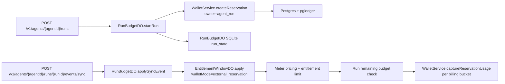

# Agent Run Budget Durable Object Implementation Plan

> **For agentic workers:** REQUIRED SUB-SKILL: Use superpowers:subagent-driven-development (recommended) or superpowers:executing-plans to implement this plan task-by-task. Steps use checkbox (`- [ ]`) syntax for tracking.

**Goal:** Add project-owned agents and customer-scoped agent runs with a run-level budget gate enforced by a new `RunBudgetDO`.

**Architecture:** Postgres and pgledger remain the source of truth for reserved funds; Durable Objects serialize hot-path run decisions. `EntitlementWindowDO` still owns feature usage, pricing, entitlement limits, and normal wallet behavior. `RunBudgetDO` owns run admission, run idempotency, run-level budget checks, and reservation capture only for `POST /v1/agents/{agentId}/runs/{runId}/events/sync`.

**Tech Stack:** TypeScript, Hono, Zod OpenAPI, Cloudflare Durable Objects, Drizzle Postgres, Drizzle durable SQLite, pgledger, Vitest, `pnpm`.

---

## First Principles

The run budget is a wrapper around priced entitlement usage, not a replacement for entitlements.



Normal ingestion routes keep their existing pipeline:

```text
POST /v1/events/ingest
POST /v1/events/ingest/sync
```

Those routes must not accept `runId`, must not call `RunBudgetDO`, and must continue to use `IngestionService`.

## Scope Check

This plan is one cohesive backend subsystem: agent templates, agent runs, run-budget reservation ownership, one Durable Object, one agent-route family, and the generated public SDK surface. Dashboard UI, tRPC, Tinybird analytics, async run ingestion, model-provider proxying, nested budgets, and workflow scheduling are outside this plan.

## File Structure

### Database

- Modify `internal/db/src/utils/id.ts`
  - Add `agent: "agt"` and `agent_run: "arun"` prefixes.

- Create `internal/db/src/schema/agents.ts`
  - Owns `agents` and `agent_runs` tables.
  - `agents` is a project-owned template table.
  - `agent_runs` is a customer-scoped execution table with budget, reservation, trace, and lifecycle fields.
  - `parentRunId` is reporting metadata only; do not add a self-FK in v1.

- Modify `internal/db/src/schema/entitlementReservations.ts`
  - Add reservation owner columns: `ownerType` and `ownerId`.
  - Keep `entitlementId` nullable for compatibility with agent-run reservations.
  - Change active uniqueness from entitlement-only to owner-period.

- Create `internal/db/src/validators/agents.ts`
  - Zod schemas for agent rows, agent-run rows, and API/use-case input contracts.

- Modify `internal/db/src/schema.ts` and `internal/db/src/validators.ts`
  - Export the new schema and validators.

### Services

- Modify `internal/services/src/wallet/service.ts`
  - Extend `createReservation` with `owner` and `minimumAllocationAmount`.
  - Preserve current entitlement-window callers by defaulting owner to `{ type: "entitlement_window", id: entitlementId }`.
  - Fail strict reservation creation before ledger movement when available balance is below `minimumAllocationAmount`.

- Create `internal/services/src/agents/service.ts`
  - Owns CRUD-style access for agent templates and run rows.

- Create `internal/services/src/agents/index.ts`
  - Exports `AgentService` and related types.

- Create `internal/services/src/use-cases/agents/run-budget-client.ts`
  - Service-layer port implemented by `apps/api`.

- Create `internal/services/src/use-cases/agents/start-run.ts`
  - Validates agent ownership and delegates run admission to `RunBudgetClient`.

- Create `internal/services/src/use-cases/agents/apply-run-sync-event.ts`
  - Validates agent/run ownership and delegates run-budgeted sync ingestion to `RunBudgetClient`.

- Create `internal/services/src/use-cases/agents/end-run.ts`
  - Validates agent/run ownership and delegates final flush/release to `RunBudgetClient`.

- Modify `internal/services/src/context.ts`, `internal/services/src/index.ts`, `internal/services/src/use-cases/index.ts`, and `internal/services/package.json`
  - Wire and export `AgentService` and the new use cases.

### API And Durable Objects

- Create `apps/api/src/ingestion/run-budget/contracts.ts`
  - RPC input/output schemas for `startRun`, `applySyncEvent`, `endRun`, and `getRunStatus`.

- Create `apps/api/src/ingestion/run-budget/db/schema.ts`
  - Durable SQLite tables: `run_state`, `run_spend_buckets`, `run_capture_intents`, `run_idempotency`.

- Create `apps/api/drizzle.ingestion.run-budget.config.ts`
  - Drizzle durable SQLite config for `RunBudgetDO`.

- Create `apps/api/src/ingestion/run-budget/drizzle/**`
  - Generated durable SQLite migration output.

- Create `apps/api/src/ingestion/run-budget/RunBudgetDO.ts`
  - Public RPC methods await migration readiness.
  - Uses `ctx.blockConcurrencyWhile` for migration and state hydration.
  - Persists capture intents before wallet I/O.
  - Handles alarms for pending capture retry and expiry.

- Create `apps/api/src/ingestion/run-budget/client.ts`
  - Cloudflare implementation of `RunBudgetClient`.
  - Durable Object stub name includes project, customer, and run id.

- Modify `apps/api/src/env.ts`, `apps/api/src/index.ts`, `apps/api/src/hono/env.ts`, `apps/api/src/middleware/init.ts`, `apps/api/wrangler.jsonc`, and `apps/api/package.json`
  - Add binding, export, service wiring, and migration scripts.

### Entitlement Window

- Modify `apps/api/src/ingestion/entitlements/contracts.ts`
  - Add `walletMode: "standard" | "external_reservation"` to `applyInputSchema`.
  - Add `externalReservation: { remainingAmount: number }` for external reservation mode.
  - Add denial reason `RUN_BUDGET_EXCEEDED` only for external reservation mode.

- Modify `apps/api/src/ingestion/entitlements/EntitlementWindowDO.ts`
  - Standard mode behavior remains byte-for-byte equivalent from the caller perspective.
  - External reservation mode prices and enforces entitlement limits, skips entitlement-window wallet reservation/capture, compares priced cost against the provided run remaining amount, and returns persisted meter facts.

### Agent API Routes

- Create `apps/api/src/routes/agents/createAgentV1.ts`
- Create `apps/api/src/routes/agents/listAgentsV1.ts`
- Create `apps/api/src/routes/agents/startAgentRunV1.ts`
- Create `apps/api/src/routes/agents/applyAgentRunSyncEventV1.ts`
- Create `apps/api/src/routes/agents/endAgentRunV1.ts`
- Create `apps/api/src/routes/agents/getAgentRunV1.ts`
- Create tests next to those route files.
- Register routes in `apps/api/src/index.ts`.

### Public SDK

- Modify `packages/api/src/openapi.d.ts`
  - Generated from the running API OpenAPI document.

- Modify generated build output only through `pnpm --filter @unprice/api build`.

## Non-Negotiable Invariants

- `RunBudgetDO` is reachable only from agent-run endpoints.
- Existing `/v1/events/ingest` and `/v1/events/ingest/sync` behavior is unchanged.
- Hono routes do not create reservations, instantiate DO stubs directly, or run multi-step business orchestration.
- Use cases depend on a service-layer `RunBudgetClient` port; `apps/api` provides the Cloudflare implementation.
- A run-budgeted sync event requires an idempotency key.
- `RunBudgetDO` checks its own idempotency table before mutating local spend.
- A retried event returns the stored run-budget decision without increasing run spend twice.
- A retry after `EntitlementWindowDO` success but before `RunBudgetDO` local commit derives the same bucket deltas from persisted entitlement meter facts.
- Captures are grouped by entitlement billing bucket, not as one opaque run total.
- Pending capture intents are persisted before wallet I/O.
- Final run totals are read after final flush.
- Missing `RunBudgetDO` binding is an infrastructure error, not a customer budget denial.
- Postgres migrations are generated with `bin/migrate.dev`; do not hand-write migration SQL.

## Task 1: Database Contracts

**Files:**
- Modify: `internal/db/src/utils/id.ts`
- Modify: `internal/db/src/utils/id.test.ts`
- Create: `internal/db/src/schema/agents.ts`
- Modify: `internal/db/src/schema/entitlementReservations.ts`
- Create: `internal/db/src/validators/agents.ts`
- Create: `internal/db/src/validators/agents.test.ts`
- Modify: `internal/db/src/schema.ts`
- Modify: `internal/db/src/validators.ts`
- Generated by command: `internal/db/src/migrations/*`
- Generated by command: `internal/db/src/migrations/meta/*`

- [ ] **Step 1: Write failing ID prefix tests**

Add this test case to `internal/db/src/utils/id.test.ts`:

```ts
import { describe, expect, it } from "vitest"
import { newId } from "./id"

describe("newId agent prefixes", () => {
  it("generates sortable ids for agents and agent runs", () => {
    expect(newId("agent")).toMatch(/^agt_[1-9A-HJ-NP-Za-km-z]{22}$/)
    expect(newId("agent_run")).toMatch(/^arun_[1-9A-HJ-NP-Za-km-z]{22}$/)
  })
})
```

- [ ] **Step 2: Run ID test to verify it fails**

Run:

```bash
rtk pnpm --filter @unprice/db test src/utils/id.test.ts
```

Expected: FAIL with a TypeScript error that `"agent"` and `"agent_run"` are not assignable to `keyof typeof prefixes`.

- [ ] **Step 3: Add the ID prefixes**

In `internal/db/src/utils/id.ts`, add these entries to `prefixes`:

```ts
  agent: "agt",
  agent_run: "arun",
```

- [ ] **Step 4: Write failing agent validator tests**

Create `internal/db/src/validators/agents.test.ts`:

```ts
import { describe, expect, it } from "vitest"
import {
  agentRunStatusSchema,
  createAgentInputSchema,
  startAgentRunInputSchema,
} from "./agents"

describe("agent validators", () => {
  it("accepts the minimal agent creation contract", () => {
    expect(
      createAgentInputSchema.parse({
        projectId: "proj_123",
        name: "Support agent",
      })
    ).toEqual({
      projectId: "proj_123",
      name: "Support agent",
      description: null,
      metadata: {},
    })
  })

  it("accepts the run start contract with a strict run budget", () => {
    expect(
      startAgentRunInputSchema.parse({
        agentId: "agt_123",
        customerId: "cus_123",
        projectId: "proj_123",
        currency: "USD",
        budgetAmount: 25_000_000,
        idempotencyKey: "run-start-123",
        traceId: "trace_123",
      })
    ).toMatchObject({
      agentId: "agt_123",
      customerId: "cus_123",
      projectId: "proj_123",
      currency: "USD",
      budgetAmount: 25_000_000,
      metadata: {},
    })
  })

  it("keeps run lifecycle values explicit", () => {
    expect(agentRunStatusSchema.options).toEqual([
      "running",
      "completed",
      "expired",
      "canceled",
      "budget_exceeded",
      "failed",
    ])
  })
})
```

- [ ] **Step 5: Run validator test to verify it fails**

Run:

```bash
rtk pnpm --filter @unprice/db test src/validators/agents.test.ts
```

Expected: FAIL because `internal/db/src/validators/agents.ts` does not exist.

- [ ] **Step 6: Create agent schema**

Create `internal/db/src/schema/agents.ts` with these exported table names and columns:

```ts
import { relations, sql } from "drizzle-orm"
import { bigint, index, json, primaryKey, text, timestamp } from "drizzle-orm/pg-core"
import { pgTableProject } from "../utils/_table"
import { cuid } from "../utils/fields"
import { projectID } from "../utils/sql"
import { customers } from "./customers"
import { projects } from "./projects"

export type AgentMetadata = Record<string, unknown>
export type AgentRunMetadata = Record<string, unknown>
export type AgentRunStatus =
  | "running"
  | "completed"
  | "expired"
  | "canceled"
  | "budget_exceeded"
  | "failed"

export const agents = pgTableProject(
  "agents",
  {
    ...projectID,
    name: text("name").notNull(),
    description: text("description"),
    metadata: json("metadata").$type<AgentMetadata>().notNull().default({}),
    active: text("active").$type<"true" | "false">().notNull().default("true"),
    createdAt: timestamp("created_at", { withTimezone: true }).notNull().default(sql`now()`),
    updatedAt: timestamp("updated_at", { withTimezone: true }).notNull().default(sql`now()`),
    deletedAt: timestamp("deleted_at", { withTimezone: true }),
  },
  (table) => ({
    primary: primaryKey({ columns: [table.id, table.projectId], name: "agents_pkey" }),
    projectActive: index("agents_project_active_idx").on(table.projectId, table.active),
  })
)

export const agentRuns = pgTableProject(
  "agent_runs",
  {
    ...projectID,
    agentId: cuid("agent_id").notNull(),
    customerId: cuid("customer_id").notNull(),
    parentRunId: cuid("parent_run_id"),
    status: text("status").$type<AgentRunStatus>().notNull().default("running"),
    currency: text("currency").notNull(),
    requestedBudgetAmount: bigint("requested_budget_amount", { mode: "number" }).notNull(),
    reservedAmount: bigint("reserved_amount", { mode: "number" }).notNull().default(0),
    consumedAmount: bigint("consumed_amount", { mode: "number" }).notNull().default(0),
    flushedAmount: bigint("flushed_amount", { mode: "number" }).notNull().default(0),
    reservationId: cuid("reservation_id"),
    traceId: text("trace_id"),
    idempotencyKey: text("idempotency_key").notNull(),
    metadata: json("metadata").$type<AgentRunMetadata>().notNull().default({}),
    startedAt: timestamp("started_at", { withTimezone: true }).notNull(),
    endedAt: timestamp("ended_at", { withTimezone: true }),
    expiresAt: timestamp("expires_at", { withTimezone: true }),
    createdAt: timestamp("created_at", { withTimezone: true }).notNull().default(sql`now()`),
    updatedAt: timestamp("updated_at", { withTimezone: true }).notNull().default(sql`now()`),
  },
  (table) => ({
    primary: primaryKey({ columns: [table.id, table.projectId], name: "agent_runs_pkey" }),
    agent: index("agent_runs_agent_idx").on(table.projectId, table.agentId),
    customer: index("agent_runs_customer_idx").on(table.projectId, table.customerId),
    activeExpiry: index("agent_runs_active_expiry_idx").on(table.projectId, table.status, table.expiresAt),
    trace: index("agent_runs_trace_idx").on(table.projectId, table.traceId),
    idempotency: index("agent_runs_idempotency_idx").on(table.projectId, table.agentId, table.idempotencyKey),
  })
)

export const agentsRelations = relations(agents, ({ many, one }) => ({
  project: one(projects, { fields: [agents.projectId], references: [projects.id] }),
  runs: many(agentRuns),
}))

export const agentRunsRelations = relations(agentRuns, ({ one }) => ({
  agent: one(agents, {
    fields: [agentRuns.agentId, agentRuns.projectId],
    references: [agents.id, agents.projectId],
  }),
  customer: one(customers, {
    fields: [agentRuns.customerId, agentRuns.projectId],
    references: [customers.id, customers.projectId],
  }),
  project: one(projects, { fields: [agentRuns.projectId], references: [projects.id] }),
}))
```

Implementation note: use `boolean("active")` instead of text if this repo's current Drizzle helper style supports boolean columns cleanly. Keep the validator contract as `active: boolean`.

- [ ] **Step 7: Modify reservation schema for owner support**

In `internal/db/src/schema/entitlementReservations.ts`, make these changes:

```ts
export type EntitlementReservationOwnerType = "entitlement_window" | "agent_run"
```

Add columns:

```ts
    ownerType: text("owner_type").$type<EntitlementReservationOwnerType>().notNull().default("entitlement_window"),
    ownerId: cuid("owner_id").notNull(),
```

Change:

```ts
    entitlementId: cuid("entitlement_id").notNull(),
```

to:

```ts
    entitlementId: cuid("entitlement_id"),
```

Replace the active unique index with:

```ts
    ownerPeriod: uniqueIndex("entitlement_reservations_owner_period_idx")
      .on(table.projectId, table.ownerType, table.ownerId, table.periodStartAt)
      .where(sql`${table.reconciledAt} IS NULL`),
```

Keep the old customer and active period indexes.

- [ ] **Step 8: Create agent validators and exports**

Create `internal/db/src/validators/agents.ts`:

```ts
import { createInsertSchema, createSelectSchema } from "drizzle-zod"
import { z } from "zod"
import { agentRuns, agents } from "../schema/agents"

export const agentRunStatusSchema = z.enum([
  "running",
  "completed",
  "expired",
  "canceled",
  "budget_exceeded",
  "failed",
])

export const agentMetadataSchema = z.record(z.unknown()).default({})

export const agentSelectSchema = createSelectSchema(agents)
export const agentRunSelectSchema = createSelectSchema(agentRuns).extend({
  status: agentRunStatusSchema,
})

export const createAgentInputSchema = z.object({
  projectId: z.string().min(1),
  name: z.string().min(1),
  description: z.string().nullable().default(null),
  metadata: agentMetadataSchema,
})

export const startAgentRunInputSchema = z.object({
  agentId: z.string().min(1),
  customerId: z.string().min(1),
  projectId: z.string().min(1),
  parentRunId: z.string().min(1).nullable().optional(),
  currency: z.string().length(3),
  budgetAmount: z.number().int().positive(),
  idempotencyKey: z.string().min(1),
  traceId: z.string().min(1).nullable().optional(),
  metadata: agentMetadataSchema,
  expiresAt: z.date().nullable().optional(),
})

export const applyAgentRunSyncEventInputSchema = z.object({
  agentId: z.string().min(1),
  runId: z.string().min(1),
  customerId: z.string().min(1),
  projectId: z.string().min(1),
  featureSlug: z.string().min(1),
  idempotencyKey: z.string().min(1),
  event: z.object({
    id: z.string().min(1),
    slug: z.string().min(1),
    timestamp: z.number().finite(),
    properties: z.record(z.unknown()),
  }),
  source: z.object({
    workspaceId: z.string().min(1),
    environment: z.string().min(1),
    apiKeyId: z.string().nullable(),
    sourceType: z.enum(["api_key", "system", "unknown"]),
    sourceId: z.string().min(1),
    sourceName: z.string().nullable(),
  }),
  now: z.number().finite(),
})

export const endAgentRunInputSchema = z.object({
  agentId: z.string().min(1),
  runId: z.string().min(1),
  customerId: z.string().min(1),
  projectId: z.string().min(1),
  endedAt: z.date(),
  status: z.enum(["completed", "expired", "canceled"]).default("completed"),
})

export type Agent = z.infer<typeof agentSelectSchema>
export type AgentRun = z.infer<typeof agentRunSelectSchema>
export type CreateAgentInput = z.infer<typeof createAgentInputSchema>
export type StartAgentRunInput = z.infer<typeof startAgentRunInputSchema>
export type ApplyAgentRunSyncEventInput = z.infer<typeof applyAgentRunSyncEventInputSchema>
export type EndAgentRunInput = z.infer<typeof endAgentRunInputSchema>
```

Export the new schema file from `internal/db/src/schema.ts` and validators from `internal/db/src/validators.ts`:

```ts
export * from "./schema/agents"
```

```ts
export * from "./validators/agents"
```

- [ ] **Step 9: Run focused DB tests**

Run:

```bash
rtk pnpm --filter @unprice/db test src/utils/id.test.ts src/validators/agents.test.ts
```

Expected: PASS.

- [ ] **Step 10: Generate Postgres migration**

Run:

```bash
rtk bin/migrate.dev
```

Expected: a new migration appears under `internal/db/src/migrations` and the migration journal changes.

- [ ] **Step 11: Typecheck DB package**

Run:

```bash
rtk pnpm --filter @unprice/db typecheck
```

Expected: PASS.

- [ ] **Step 12: Commit database contracts**

Run:

```bash
rtk git add internal/db/src/utils/id.ts internal/db/src/utils/id.test.ts internal/db/src/schema/agents.ts internal/db/src/schema/entitlementReservations.ts internal/db/src/validators/agents.ts internal/db/src/validators/agents.test.ts internal/db/src/schema.ts internal/db/src/validators.ts internal/db/src/migrations internal/db/src/migrations/meta
rtk git commit -m "feat: add agent run database contracts"
```

Expected: commit created.

## Task 2: Wallet Reservation Ownership

**Files:**
- Modify: `internal/services/src/wallet/service.ts`
- Modify: `internal/services/src/wallet/service.test.ts`
- Modify if exported there: `internal/services/src/wallet/index.ts`

- [ ] **Step 1: Add failing wallet owner tests**

Add these tests under `describe("WalletService.createReservation", ...)` in `internal/services/src/wallet/service.test.ts`:

```ts
it("creates an agent-run-owned reservation without an entitlement id", async () => {
  const { state, wallet } = createWalletServiceTestHarness({
    grantedBalance: 10_000,
    purchasedBalance: 0,
  })

  const result = await wallet.createReservation({
    projectId: "proj_123",
    customerId: "cus_123",
    currency: "USD",
    entitlementId: null,
    owner: { type: "agent_run", id: "arun_123" },
    requestedAmount: 5_000,
    minimumAllocationAmount: 5_000,
    refillThresholdBps: 2000,
    refillChunkAmount: 1_000,
    periodStartAt: new Date("2026-06-15T00:00:00.000Z"),
    periodEndAt: new Date("2026-06-16T00:00:00.000Z"),
    idempotencyKey: "reserve-agent-run-123",
  })

  expect(result.err).toBeUndefined()
  expect(result.val).toMatchObject({
    allocationAmount: 5_000,
    reused: "created",
  })
  expect(state.inserts).toContainEqual(
    expect.objectContaining({
      table: "entitlementReservations",
      values: expect.objectContaining({
        entitlementId: null,
        ownerType: "agent_run",
        ownerId: "arun_123",
      }),
    })
  )
})

it("fails a strict reservation before moving funds when available balance is short", async () => {
  const { state, wallet } = createWalletServiceTestHarness({
    grantedBalance: 2_000,
    purchasedBalance: 0,
  })

  const result = await wallet.createReservation({
    projectId: "proj_123",
    customerId: "cus_123",
    currency: "USD",
    entitlementId: null,
    owner: { type: "agent_run", id: "arun_strict" },
    requestedAmount: 5_000,
    minimumAllocationAmount: 5_000,
    refillThresholdBps: 2000,
    refillChunkAmount: 1_000,
    periodStartAt: new Date("2026-06-15T00:00:00.000Z"),
    periodEndAt: new Date("2026-06-16T00:00:00.000Z"),
    idempotencyKey: "reserve-agent-run-short",
  })

  expect(result.err?.message).toBe("WALLET_EMPTY")
  expect(state.ledgerTransfers).toHaveLength(0)
  expect(state.inserts.filter((insert) => insert.table === "entitlementReservations")).toHaveLength(0)
})

it("dedupes active reservations by owner and period", async () => {
  const { wallet } = createWalletServiceTestHarness({
    grantedBalance: 10_000,
    purchasedBalance: 0,
    existingReservation: {
      id: "eres_existing",
      projectId: "proj_123",
      customerId: "cus_123",
      entitlementId: null,
      ownerType: "agent_run",
      ownerId: "arun_existing",
      allocationAmount: 5_000,
      periodStartAt: new Date("2026-06-15T00:00:00.000Z"),
      reconciledAt: null,
    },
  })

  const result = await wallet.createReservation({
    projectId: "proj_123",
    customerId: "cus_123",
    currency: "USD",
    entitlementId: null,
    owner: { type: "agent_run", id: "arun_existing" },
    requestedAmount: 5_000,
    minimumAllocationAmount: 5_000,
    refillThresholdBps: 2000,
    refillChunkAmount: 1_000,
    periodStartAt: new Date("2026-06-15T00:00:00.000Z"),
    periodEndAt: new Date("2026-06-16T00:00:00.000Z"),
    idempotencyKey: "reserve-agent-run-existing",
  })

  expect(result.val).toEqual({
    reservationId: "eres_existing",
    allocationAmount: 5_000,
    reused: "active",
  })
})
```

Adapt only the harness property names to match the existing fake state in `service.test.ts`; keep the assertions and inputs unchanged.

- [ ] **Step 2: Run wallet tests to verify they fail**

Run:

```bash
rtk pnpm --filter @unprice/services test src/wallet/service.test.ts -t "agent-run-owned|strict reservation|owner and period"
```

Expected: FAIL because `CreateReservationInput` does not support `owner`, `minimumAllocationAmount`, or nullable `entitlementId`.

- [ ] **Step 3: Extend reservation input contract**

In `internal/services/src/wallet/service.ts`, change the reservation input type to include:

```ts
export type ReservationOwner =
  | { type: "entitlement_window"; id: string }
  | { type: "agent_run"; id: string }

export type CreateReservationInput = {
  projectId: string
  customerId: string
  currency: string
  entitlementId: string | null
  owner?: ReservationOwner
  requestedAmount: number
  minimumAllocationAmount?: number
  refillThresholdBps: number
  refillChunkAmount: number
  periodStartAt: Date
  periodEndAt: Date
  effectiveAt?: Date
  idempotencyKey: string
  metadata?: Record<string, unknown>
}
```

Resolve owner at the top of `createReservation`:

```ts
const owner =
  input.owner ??
  (input.entitlementId
    ? ({ type: "entitlement_window", id: input.entitlementId } as const)
    : null)

if (!owner) {
  return Err(new UnPriceWalletError({ message: "WALLET_INVALID_RESERVATION_OWNER" }))
}
```

If `UnPriceWalletError` does not currently accept `WALLET_INVALID_RESERVATION_OWNER`, add that message to the local wallet error union or use the existing invalid-input message used by this service.

- [ ] **Step 4: Change reservation lookup and insert**

In `createReservation`, replace the existing active lookup predicates:

```ts
eq(entitlementReservations.entitlementId, input.entitlementId),
eq(entitlementReservations.periodStartAt, input.periodStartAt),
```

with:

```ts
eq(entitlementReservations.ownerType, owner.type),
eq(entitlementReservations.ownerId, owner.id),
eq(entitlementReservations.periodStartAt, input.periodStartAt),
```

When inserting, set:

```ts
ownerType: owner.type,
ownerId: owner.id,
entitlementId: input.entitlementId,
```

In ledger metadata, include both owner fields:

```ts
reservation_owner_type: owner.type,
reservation_owner_id: owner.id,
entitlement_id: input.entitlementId,
```

- [ ] **Step 5: Add strict minimum allocation check before ledger movement**

After computing `allocationAmount` and before building transfers, add:

```ts
const minimumAllocationAmount = input.minimumAllocationAmount ?? 0
if (minimumAllocationAmount > 0 && allocationAmount < minimumAllocationAmount) {
  return Err(new UnPriceWalletError({ message: "WALLET_EMPTY" }))
}
```

This check must run before `ledger.createTransfers` and before `tx.insert(entitlementReservations)`.

- [ ] **Step 6: Preserve entitlement-window callers**

Search:

```bash
rtk rg -n "createReservation\\(" internal apps packages
```

For every existing entitlement-window caller, keep the current input shape valid by passing the existing `entitlementId`; do not require a new `owner` field at those call sites.

- [ ] **Step 7: Run wallet tests**

Run:

```bash
rtk pnpm --filter @unprice/services test src/wallet/service.test.ts
```

Expected: PASS.

- [ ] **Step 8: Typecheck services**

Run:

```bash
rtk pnpm --filter @unprice/services typecheck
```

Expected: PASS.

- [ ] **Step 9: Commit wallet reservation ownership**

Run:

```bash
rtk git add internal/services/src/wallet/service.ts internal/services/src/wallet/service.test.ts internal/services/src/wallet/index.ts
rtk git commit -m "feat: support reservation ownership"
```

Expected: commit created.

## Task 3: Agent Service And Use Cases

**Files:**
- Create: `internal/services/src/agents/service.ts`
- Create: `internal/services/src/agents/service.test.ts`
- Create: `internal/services/src/agents/index.ts`
- Create: `internal/services/src/use-cases/agents/run-budget-client.ts`
- Create: `internal/services/src/use-cases/agents/start-run.ts`
- Create: `internal/services/src/use-cases/agents/start-run.test.ts`
- Create: `internal/services/src/use-cases/agents/apply-run-sync-event.ts`
- Create: `internal/services/src/use-cases/agents/apply-run-sync-event.test.ts`
- Create: `internal/services/src/use-cases/agents/end-run.ts`
- Create: `internal/services/src/use-cases/agents/end-run.test.ts`
- Create: `internal/services/src/use-cases/agents/index.ts`
- Modify: `internal/services/src/context.ts`
- Modify: `internal/services/src/index.ts`
- Modify: `internal/services/src/use-cases/index.ts`
- Modify: `internal/services/package.json`

- [ ] **Step 1: Write failing AgentService tests**

Create `internal/services/src/agents/service.test.ts`:

```ts
import { beforeEach, describe, expect, it, vi } from "vitest"
import { AgentService } from "./service"

const db = {
  insert: vi.fn(),
  update: vi.fn(),
  query: {
    agents: { findFirst: vi.fn(), findMany: vi.fn() },
    agentRuns: { findFirst: vi.fn(), findMany: vi.fn() },
  },
}

const logger = { error: vi.fn(), info: vi.fn(), warn: vi.fn(), child: vi.fn(() => logger) }

beforeEach(() => {
  vi.clearAllMocks()
})

describe("AgentService", () => {
  it("returns null when an active agent is not found for a project", async () => {
    db.query.agents.findFirst.mockResolvedValue(null)
    const service = new AgentService({ db: db as never, logger: logger as never })

    const result = await service.getActiveAgent({
      agentId: "agt_123",
      projectId: "proj_123",
    })

    expect(result).toBeNull()
  })

  it("reads a run by project agent customer and run id", async () => {
    db.query.agentRuns.findFirst.mockResolvedValue({
      id: "arun_123",
      agentId: "agt_123",
      customerId: "cus_123",
      projectId: "proj_123",
      status: "running",
    })
    const service = new AgentService({ db: db as never, logger: logger as never })

    const result = await service.getRunForAgent({
      agentId: "agt_123",
      customerId: "cus_123",
      projectId: "proj_123",
      runId: "arun_123",
    })

    expect(result).toMatchObject({ id: "arun_123", status: "running" })
  })
})
```

- [ ] **Step 2: Run AgentService tests to verify they fail**

Run:

```bash
rtk pnpm --filter @unprice/services test src/agents/service.test.ts
```

Expected: FAIL because `internal/services/src/agents/service.ts` does not exist.

- [ ] **Step 3: Implement AgentService**

Create `internal/services/src/agents/service.ts`:

```ts
import { and, desc, eq, isNull } from "drizzle-orm"
import { agentRuns, agents } from "@unprice/db/schema"
import { newId } from "@unprice/db/utils"
import type { Agent, AgentRun, CreateAgentInput } from "@unprice/db/validators"
import type { Logger } from "@unprice/logs"
import type { Database } from "@unprice/db"

export class AgentService {
  constructor(private readonly deps: { db: Database; logger: Logger }) {}

  async createAgent(input: CreateAgentInput): Promise<Agent> {
    const id = newId("agent")
    const [agent] = await this.deps.db
      .insert(agents)
      .values({
        id,
        projectId: input.projectId,
        name: input.name,
        description: input.description,
        metadata: input.metadata,
      })
      .returning()

    if (!agent) {
      throw new Error("Failed to create agent")
    }

    return agent
  }

  async listAgents(input: { projectId: string }): Promise<Agent[]> {
    return this.deps.db.query.agents.findMany({
      where: and(eq(agents.projectId, input.projectId), isNull(agents.deletedAt)),
      orderBy: [desc(agents.createdAt)],
    })
  }

  async getActiveAgent(input: { agentId: string; projectId: string }): Promise<Agent | null> {
    return (
      (await this.deps.db.query.agents.findFirst({
        where: and(
          eq(agents.id, input.agentId),
          eq(agents.projectId, input.projectId),
          isNull(agents.deletedAt)
        ),
      })) ?? null
    )
  }

  async getRunForAgent(input: {
    agentId: string
    customerId: string
    projectId: string
    runId: string
  }): Promise<AgentRun | null> {
    return (
      (await this.deps.db.query.agentRuns.findFirst({
        where: and(
          eq(agentRuns.id, input.runId),
          eq(agentRuns.agentId, input.agentId),
          eq(agentRuns.customerId, input.customerId),
          eq(agentRuns.projectId, input.projectId)
        ),
      })) ?? null
    )
  }
}
```

Create `internal/services/src/agents/index.ts`:

```ts
export * from "./service"
```

- [ ] **Step 4: Write failing use-case tests**

Create `internal/services/src/use-cases/agents/start-run.test.ts`:

```ts
import { describe, expect, it, vi } from "vitest"
import { startAgentRun } from "./start-run"

describe("startAgentRun", () => {
  it("denies when the agent is not active in the project", async () => {
    const result = await startAgentRun(
      {
        services: {
          agents: { getActiveAgent: vi.fn().mockResolvedValue(null) },
        },
        runBudget: { startRun: vi.fn() },
      } as never,
      {
        agentId: "agt_123",
        customerId: "cus_123",
        projectId: "proj_123",
        currency: "USD",
        budgetAmount: 100_000_000,
        idempotencyKey: "start-1",
        metadata: {},
      }
    )

    expect(result.err?.message).toBe("AGENT_NOT_FOUND")
  })

  it("delegates run admission to the run budget port", async () => {
    const runBudget = {
      startRun: vi.fn().mockResolvedValue({
        runId: "arun_123",
        status: "running",
        budgetAmount: 100_000_000,
        consumedAmount: 0,
        remainingAmount: 100_000_000,
      }),
    }

    const result = await startAgentRun(
      {
        services: {
          agents: {
            getActiveAgent: vi.fn().mockResolvedValue({ id: "agt_123", projectId: "proj_123" }),
          },
        },
        runBudget,
      } as never,
      {
        agentId: "agt_123",
        customerId: "cus_123",
        projectId: "proj_123",
        currency: "USD",
        budgetAmount: 100_000_000,
        idempotencyKey: "start-1",
        metadata: {},
      }
    )

    expect(result.val?.runId).toBe("arun_123")
    expect(runBudget.startRun).toHaveBeenCalledWith(
      expect.objectContaining({
        agentId: "agt_123",
        customerId: "cus_123",
        projectId: "proj_123",
      })
    )
  })
})
```

Create `internal/services/src/use-cases/agents/apply-run-sync-event.test.ts`:

```ts
import { describe, expect, it, vi } from "vitest"
import { applyAgentRunSyncEvent } from "./apply-run-sync-event"

const input = {
  agentId: "agt_123",
  runId: "arun_123",
  customerId: "cus_123",
  projectId: "proj_123",
  featureSlug: "tokens",
  idempotencyKey: "idem_123",
  event: {
    id: "evt_123",
    slug: "tokens_used",
    timestamp: 1_781_503_200_000,
    properties: { amount: 1 },
  },
  source: {
    workspaceId: "ws_123",
    environment: "development",
    apiKeyId: "api_123",
    sourceType: "api_key" as const,
    sourceId: "api_123",
    sourceName: null,
  },
  now: 1_781_503_200_100,
}

describe("applyAgentRunSyncEvent", () => {
  it("denies when the run does not belong to the agent customer and project", async () => {
    const result = await applyAgentRunSyncEvent(
      {
        services: {
          agents: { getRunForAgent: vi.fn().mockResolvedValue(null) },
        },
        runBudget: { applySyncEvent: vi.fn() },
      } as never,
      input
    )

    expect(result.err?.message).toBe("RUN_NOT_FOUND")
  })

  it("delegates sync ingestion to the run budget port", async () => {
    const runBudget = {
      applySyncEvent: vi.fn().mockResolvedValue({
        allowed: true,
        state: "processed",
        budget: {
          runId: "arun_123",
          status: "running",
          budgetAmount: 100_000_000,
          consumedAmount: 1_000_000,
          remainingAmount: 99_000_000,
        },
      }),
    }

    const result = await applyAgentRunSyncEvent(
      {
        services: {
          agents: {
            getRunForAgent: vi.fn().mockResolvedValue({
              id: "arun_123",
              agentId: "agt_123",
              customerId: "cus_123",
              projectId: "proj_123",
              status: "running",
            }),
          },
        },
        runBudget,
      } as never,
      input
    )

    expect(result.val?.state).toBe("processed")
    expect(runBudget.applySyncEvent).toHaveBeenCalledWith(input)
  })
})
```

Create `internal/services/src/use-cases/agents/end-run.test.ts`:

```ts
import { describe, expect, it, vi } from "vitest"
import { endAgentRun } from "./end-run"

const input = {
  agentId: "agt_123",
  runId: "arun_123",
  customerId: "cus_123",
  projectId: "proj_123",
  endedAt: new Date("2026-06-15T12:00:00.000Z"),
  status: "completed" as const,
}

describe("endAgentRun", () => {
  it("denies when the run does not belong to the agent customer and project", async () => {
    const result = await endAgentRun(
      {
        services: {
          agents: { getRunForAgent: vi.fn().mockResolvedValue(null) },
        },
        runBudget: { endRun: vi.fn() },
      } as never,
      input
    )

    expect(result.err?.message).toBe("RUN_NOT_FOUND")
  })

  it("delegates finalization to the run budget port", async () => {
    const runBudget = {
      endRun: vi.fn().mockResolvedValue({
        runId: "arun_123",
        status: "completed",
        budgetAmount: 100_000_000,
        consumedAmount: 25_000_000,
        remainingAmount: 75_000_000,
      }),
    }

    const result = await endAgentRun(
      {
        services: {
          agents: {
            getRunForAgent: vi.fn().mockResolvedValue({
              id: "arun_123",
              agentId: "agt_123",
              customerId: "cus_123",
              projectId: "proj_123",
              status: "running",
            }),
          },
        },
        runBudget,
      } as never,
      input
    )

    expect(result.val?.status).toBe("completed")
    expect(runBudget.endRun).toHaveBeenCalledWith(input)
  })
})
```

- [ ] **Step 5: Run use-case tests to verify they fail**

Run:

```bash
rtk pnpm --filter @unprice/services test src/use-cases/agents
```

Expected: FAIL because the use-case files do not exist.

- [ ] **Step 6: Implement run-budget port**

Create `internal/services/src/use-cases/agents/run-budget-client.ts`:

```ts
import type { ApplyAgentRunSyncEventInput, EndAgentRunInput, StartAgentRunInput } from "@unprice/db/validators"

export type AgentRunBudgetSummary = {
  runId: string
  status: "running" | "completed" | "expired" | "canceled" | "budget_exceeded" | "failed"
  budgetAmount: number
  consumedAmount: number
  remainingAmount: number
}

export type AgentRunSyncDecision = {
  allowed: boolean
  state: "processed" | "rejected"
  rejectionReason?: "LIMIT_EXCEEDED" | "WALLET_EMPTY" | "LATE_EVENT_CLOSED_PERIOD" | "RUN_BUDGET_EXCEEDED"
  message?: string
  budget: AgentRunBudgetSummary
}

export interface RunBudgetClient {
  startRun(input: StartAgentRunInput): Promise<AgentRunBudgetSummary>
  applySyncEvent(input: ApplyAgentRunSyncEventInput): Promise<AgentRunSyncDecision>
  endRun(input: EndAgentRunInput): Promise<AgentRunBudgetSummary>
  getRunStatus(input: {
    agentId: string
    customerId: string
    projectId: string
    runId: string
  }): Promise<AgentRunBudgetSummary>
}
```

- [ ] **Step 7: Implement use cases**

Create `internal/services/src/use-cases/agents/start-run.ts`:

```ts
import { Err, Ok, type Result } from "@unprice/error"
import type { StartAgentRunInput } from "@unprice/db/validators"
import type { AgentService } from "../../agents"
import type { AgentRunBudgetSummary, RunBudgetClient } from "./run-budget-client"

export class AgentRunUseCaseError extends Error {
  constructor(message: "AGENT_NOT_FOUND" | "RUN_NOT_FOUND") {
    super(message)
    this.name = AgentRunUseCaseError.name
  }
}

export async function startAgentRun(
  deps: { services: { agents: Pick<AgentService, "getActiveAgent"> }; runBudget: Pick<RunBudgetClient, "startRun"> },
  input: StartAgentRunInput
): Promise<Result<AgentRunBudgetSummary, AgentRunUseCaseError>> {
  const agent = await deps.services.agents.getActiveAgent({
    agentId: input.agentId,
    projectId: input.projectId,
  })

  if (!agent) {
    return Err(new AgentRunUseCaseError("AGENT_NOT_FOUND"))
  }

  return Ok(await deps.runBudget.startRun(input))
}
```

Create `apply-run-sync-event.ts` and `end-run.ts` with the same ownership check pattern, using `services.agents.getRunForAgent(...)` before delegating to `runBudget.applySyncEvent` or `runBudget.endRun`.

Create `internal/services/src/use-cases/agents/index.ts`:

```ts
export * from "./apply-run-sync-event"
export * from "./end-run"
export * from "./run-budget-client"
export * from "./start-run"
```

- [ ] **Step 8: Wire service context and exports**

In `internal/services/src/context.ts`, import and add `AgentService`:

```ts
import { AgentService } from "./agents/service"
```

Add to `ServiceContext`:

```ts
  agents: AgentService
```

Construct after leaf services:

```ts
  const agents = new AgentService({
    db: deps.db,
    logger: deps.logger,
  })
```

Return it:

```ts
    agents,
```

Export from `internal/services/src/index.ts`:

```ts
export * from "./agents"
```

Export from `internal/services/src/use-cases/index.ts`:

```ts
export * from "./agents"
```

Add `./agents` to `internal/services/package.json` exports:

```json
"./agents": "./src/agents/index.ts"
```

- [ ] **Step 9: Run service tests**

Run:

```bash
rtk pnpm --filter @unprice/services test src/agents/service.test.ts src/use-cases/agents
```

Expected: PASS.

- [ ] **Step 10: Typecheck services**

Run:

```bash
rtk pnpm --filter @unprice/services typecheck
```

Expected: PASS.

- [ ] **Step 11: Commit agent service and use cases**

Run:

```bash
rtk git add internal/services/src/agents internal/services/src/use-cases/agents internal/services/src/context.ts internal/services/src/index.ts internal/services/src/use-cases/index.ts internal/services/package.json
rtk git commit -m "feat: add agent run use cases"
```

Expected: commit created.

## Task 4: RunBudgetDO Contracts, Storage, Binding, And Client

**Files:**
- Create: `apps/api/src/ingestion/run-budget/contracts.ts`
- Create: `apps/api/src/ingestion/run-budget/contracts.test.ts`
- Create: `apps/api/src/ingestion/run-budget/db/schema.ts`
- Create: `apps/api/drizzle.ingestion.run-budget.config.ts`
- Modify: `apps/api/package.json`
- Modify: `apps/api/src/env.ts`
- Modify: `apps/api/src/index.ts`
- Modify: `apps/api/src/hono/env.ts`
- Modify: `apps/api/src/middleware/init.ts`
- Modify: `apps/api/wrangler.jsonc`
- Create: `apps/api/src/ingestion/run-budget/client.ts`
- Generated by command: `apps/api/src/ingestion/run-budget/drizzle/**`

- [ ] **Step 1: Write failing contract tests**

Create `apps/api/src/ingestion/run-budget/contracts.test.ts`:

```ts
import { describe, expect, it } from "vitest"
import {
  applyRunSyncEventInputSchema,
  runBudgetDecisionSchema,
  startRunInputSchema,
} from "./contracts"

describe("run budget contracts", () => {
  it("parses startRun input", () => {
    expect(
      startRunInputSchema.parse({
        agentId: "agt_123",
        runId: "arun_123",
        customerId: "cus_123",
        projectId: "proj_123",
        currency: "USD",
        budgetAmount: 100_000_000,
        idempotencyKey: "start-1",
        now: 1_781_503_200_000,
        metadata: {},
      })
    ).toMatchObject({ runId: "arun_123", budgetAmount: 100_000_000 })
  })

  it("requires an idempotency key for run sync events", () => {
    const result = applyRunSyncEventInputSchema.safeParse({
      agentId: "agt_123",
      runId: "arun_123",
      customerId: "cus_123",
      projectId: "proj_123",
      featureSlug: "tokens",
      event: { id: "evt_123", slug: "tokens_used", timestamp: 1, properties: {} },
      source: {
        workspaceId: "ws_123",
        environment: "development",
        apiKeyId: "api_123",
        sourceType: "api_key",
        sourceId: "api_123",
        sourceName: null,
      },
      now: 1,
    })

    expect(result.success).toBe(false)
  })

  it("allows run budget exceeded as a sync denial reason", () => {
    expect(
      runBudgetDecisionSchema.parse({
        allowed: false,
        state: "rejected",
        rejectionReason: "RUN_BUDGET_EXCEEDED",
        message: "Run budget exceeded",
        budget: {
          runId: "arun_123",
          status: "budget_exceeded",
          budgetAmount: 100,
          consumedAmount: 100,
          remainingAmount: 0,
        },
      })
    ).toMatchObject({ rejectionReason: "RUN_BUDGET_EXCEEDED" })
  })
})
```

- [ ] **Step 2: Run contract tests to verify they fail**

Run:

```bash
rtk pnpm --filter api test -- src/ingestion/run-budget/contracts.test.ts
```

Expected: FAIL because `contracts.ts` does not exist.

- [ ] **Step 3: Implement contracts**

Create `apps/api/src/ingestion/run-budget/contracts.ts`:

```ts
import { z } from "zod"

export const runStatusSchema = z.enum([
  "running",
  "completed",
  "expired",
  "canceled",
  "budget_exceeded",
  "failed",
])

export const runBudgetSummarySchema = z.object({
  runId: z.string().min(1),
  status: runStatusSchema,
  budgetAmount: z.number().int().nonnegative(),
  consumedAmount: z.number().int().nonnegative(),
  remainingAmount: z.number().int().nonnegative(),
})

const sourceSchema = z.object({
  workspaceId: z.string().min(1),
  environment: z.string().min(1),
  apiKeyId: z.string().nullable(),
  sourceType: z.enum(["api_key", "system", "unknown"]),
  sourceId: z.string().min(1),
  sourceName: z.string().nullable(),
})

const eventSchema = z.object({
  id: z.string().min(1),
  slug: z.string().min(1),
  timestamp: z.number().finite(),
  properties: z.record(z.unknown()),
})

export const startRunInputSchema = z.object({
  agentId: z.string().min(1),
  runId: z.string().min(1),
  customerId: z.string().min(1),
  projectId: z.string().min(1),
  parentRunId: z.string().min(1).nullable().optional(),
  currency: z.string().length(3),
  budgetAmount: z.number().int().positive(),
  idempotencyKey: z.string().min(1),
  traceId: z.string().min(1).nullable().optional(),
  metadata: z.record(z.unknown()).default({}),
  expiresAt: z.number().finite().nullable().optional(),
  now: z.number().finite(),
})

export const applyRunSyncEventInputSchema = z.object({
  agentId: z.string().min(1),
  runId: z.string().min(1),
  customerId: z.string().min(1),
  projectId: z.string().min(1),
  featureSlug: z.string().min(1),
  idempotencyKey: z.string().min(1),
  event: eventSchema,
  source: sourceSchema,
  now: z.number().finite(),
})

export const endRunInputSchema = z.object({
  agentId: z.string().min(1),
  runId: z.string().min(1),
  customerId: z.string().min(1),
  projectId: z.string().min(1),
  status: z.enum(["completed", "expired", "canceled"]),
  endedAt: z.number().finite(),
})

export const getRunStatusInputSchema = z.object({
  agentId: z.string().min(1),
  runId: z.string().min(1),
  customerId: z.string().min(1),
  projectId: z.string().min(1),
})

export const runBudgetDecisionSchema = z.object({
  allowed: z.boolean(),
  state: z.enum(["processed", "rejected"]),
  rejectionReason: z
    .enum(["LIMIT_EXCEEDED", "WALLET_EMPTY", "LATE_EVENT_CLOSED_PERIOD", "RUN_BUDGET_EXCEEDED"])
    .optional(),
  message: z.string().optional(),
  budget: runBudgetSummarySchema,
})

export type StartRunInput = z.infer<typeof startRunInputSchema>
export type ApplyRunSyncEventInput = z.infer<typeof applyRunSyncEventInputSchema>
export type EndRunInput = z.infer<typeof endRunInputSchema>
export type GetRunStatusInput = z.infer<typeof getRunStatusInputSchema>
export type RunBudgetDecision = z.infer<typeof runBudgetDecisionSchema>
export type RunBudgetSummary = z.infer<typeof runBudgetSummarySchema>
```

- [ ] **Step 4: Create durable SQLite schema**

Create `apps/api/src/ingestion/run-budget/db/schema.ts`:

```ts
import { integer, sqliteTable, text, uniqueIndex } from "drizzle-orm/sqlite-core"

export const runState = sqliteTable("run_state", {
  runId: text("run_id").primaryKey(),
  projectId: text("project_id").notNull(),
  customerId: text("customer_id").notNull(),
  agentId: text("agent_id").notNull(),
  reservationId: text("reservation_id"),
  status: text("status").notNull(),
  currency: text("currency").notNull(),
  budgetAmount: integer("budget_amount").notNull(),
  reservedAmount: integer("reserved_amount").notNull().default(0),
  consumedAmount: integer("consumed_amount").notNull().default(0),
  flushedAmount: integer("flushed_amount").notNull().default(0),
  startedAt: integer("started_at").notNull(),
  endedAt: integer("ended_at"),
  expiresAt: integer("expires_at"),
  lastEventAt: integer("last_event_at"),
  traceId: text("trace_id"),
  metadataJson: text("metadata_json").notNull().default("{}"),
})

export const runSpendBuckets = sqliteTable(
  "run_spend_buckets",
  {
    bucketKey: text("bucket_key").primaryKey(),
    runId: text("run_id").notNull(),
    entitlementId: text("entitlement_id").notNull(),
    featureId: text("feature_id"),
    statementKey: text("statement_key").notNull(),
    periodStartAt: integer("period_start_at").notNull(),
    periodEndAt: integer("period_end_at").notNull(),
    currency: text("currency").notNull(),
    consumedAmount: integer("consumed_amount").notNull().default(0),
    flushedAmount: integer("flushed_amount").notNull().default(0),
    pendingAmount: integer("pending_amount").notNull().default(0),
  },
  (table) => ({
    run: uniqueIndex("run_spend_buckets_run_bucket_idx").on(table.runId, table.bucketKey),
  })
)

export const runCaptureIntents = sqliteTable("run_capture_intents", {
  intentKey: text("intent_key").primaryKey(),
  runId: text("run_id").notNull(),
  bucketKey: text("bucket_key").notNull(),
  amount: integer("amount").notNull(),
  status: text("status").notNull(),
  attemptCount: integer("attempt_count").notNull().default(0),
  lastError: text("last_error"),
  createdAt: integer("created_at").notNull(),
  updatedAt: integer("updated_at").notNull(),
})

export const runIdempotency = sqliteTable("run_idempotency", {
  idempotencyKey: text("idempotency_key").primaryKey(),
  runId: text("run_id").notNull(),
  decisionJson: text("decision_json").notNull(),
  pricedAmount: integer("priced_amount").notNull().default(0),
  bucketDeltasJson: text("bucket_deltas_json").notNull().default("[]"),
  createdAt: integer("created_at").notNull(),
})
```

- [ ] **Step 5: Add run-budget Drizzle config and scripts**

Create `apps/api/drizzle.ingestion.run-budget.config.ts`:

```ts
import { defineConfig } from "drizzle-kit"

export default defineConfig({
  out: "./src/ingestion/run-budget/drizzle",
  schema: "./src/ingestion/run-budget/db/schema.ts",
  dialect: "sqlite",
  driver: "durable-sqlite",
})
```

In `apps/api/package.json`, add:

```json
"db:generate:ingestion:run-budget": "drizzle-kit generate --config=drizzle.ingestion.run-budget.config.ts",
"db:check:ingestion:run-budget": "pnpm db:generate:ingestion:run-budget && git diff --exit-code -- src/ingestion/run-budget/drizzle",
"db:check:ingestion:migrations": "pnpm db:generate:ingestion:entitlements && pnpm db:generate:ingestion:run-budget && git diff --exit-code -- src/ingestion/entitlements/drizzle src/ingestion/run-budget/drizzle"
```

Replace the existing `db:check:ingestion:migrations` script with the combined command above.

- [ ] **Step 6: Generate durable SQLite migration**

Run:

```bash
rtk pnpm --filter api db:generate:ingestion:run-budget
```

Expected: migration files appear under `apps/api/src/ingestion/run-budget/drizzle`.

- [ ] **Step 7: Wire Cloudflare binding types**

In `apps/api/src/env.ts`, import `RunBudgetDO` and add the binding:

```ts
import type { RunBudgetDO } from "~/ingestion/run-budget/RunBudgetDO"
```

```ts
      runbudget: z.custom<DurableObjectNamespace<RunBudgetDO>>((ns) => typeof ns === "object"),
```

In `apps/api/src/index.ts`, export the class:

```ts
export { RunBudgetDO } from "~/ingestion/run-budget/RunBudgetDO"
```

In `apps/api/wrangler.jsonc`, add a durable object binding named `runbudget` in dev, preview, and production environments and add `RunBudgetDO` to `new_sqlite_classes` for the next migration entry in each environment.

- [ ] **Step 8: Implement Cloudflare client**

Create `apps/api/src/ingestion/run-budget/client.ts`:

```ts
import type { RunBudgetClient } from "@unprice/services/use-cases"
import type {
  ApplyRunSyncEventInput,
  EndRunInput,
  GetRunStatusInput,
  RunBudgetDecision,
  RunBudgetSummary,
  StartRunInput,
} from "./contracts"
import type { Env } from "~/env"

export class CloudflareRunBudgetClient implements RunBudgetClient {
  constructor(private readonly env: Pick<Env, "runbudget">) {}

  async startRun(input: StartRunInput): Promise<RunBudgetSummary> {
    return this.stub(input).startRun(input)
  }

  async applySyncEvent(input: ApplyRunSyncEventInput): Promise<RunBudgetDecision> {
    return this.stub(input).applySyncEvent(input)
  }

  async endRun(input: EndRunInput): Promise<RunBudgetSummary> {
    return this.stub(input).endRun(input)
  }

  async getRunStatus(input: GetRunStatusInput): Promise<RunBudgetSummary> {
    return this.stub(input).getRunStatus(input)
  }

  private stub(input: { projectId: string; customerId: string; runId: string }) {
    const id = this.env.runbudget.idFromName(
      `${input.projectId}:${input.customerId}:${input.runId}`
    )
    return this.env.runbudget.get(id)
  }
}
```

Export this interface from `apps/api/src/ingestion/run-budget/RunBudgetDO.ts` and use it as the stub type in `client.ts`:

```ts
export interface RunBudgetDOStub {
  startRun(input: StartRunInput): Promise<RunBudgetSummary>
  applySyncEvent(input: ApplyRunSyncEventInput): Promise<RunBudgetDecision>
  endRun(input: EndRunInput): Promise<RunBudgetSummary>
  getRunStatus(input: GetRunStatusInput): Promise<RunBudgetSummary>
}
```

- [ ] **Step 9: Run contract tests and migration check**

Run:

```bash
rtk pnpm --filter api test -- src/ingestion/run-budget/contracts.test.ts
rtk pnpm --filter api db:check:ingestion:migrations
```

Expected: PASS.

- [ ] **Step 10: Commit contracts and binding**

Run:

```bash
rtk git add apps/api/src/ingestion/run-budget apps/api/drizzle.ingestion.run-budget.config.ts apps/api/package.json apps/api/src/env.ts apps/api/src/index.ts apps/api/src/hono/env.ts apps/api/src/middleware/init.ts apps/api/wrangler.jsonc
rtk git commit -m "feat: add run budget durable contracts"
```

Expected: commit created.

## Task 5: EntitlementWindow External Reservation Mode

**Files:**
- Modify: `apps/api/src/ingestion/entitlements/contracts.ts`
- Modify: `apps/api/src/ingestion/entitlements/EntitlementWindowDO.ts`
- Modify: `apps/api/src/ingestion/entitlements/EntitlementWindowDO.test.ts`

- [ ] **Step 1: Add failing external reservation tests**

Add these tests to `apps/api/src/ingestion/entitlements/EntitlementWindowDO.test.ts` near the existing apply tests:

```ts
it("external reservation mode does not create or capture entitlement wallet reservations", async () => {
  const EntitlementWindowDO = await loadEntitlementWindowDO()
  const state = createState()
  const durableObject = new EntitlementWindowDO(state, createEnv())

  const result = await durableObject.apply({
    ...createApplyInput({ eventId: "evt_external_1", cost: 500 }),
    walletMode: "external_reservation",
    externalReservation: { remainingAmount: 1_000 },
  })

  expect(result.allowed).toBe(true)
  expect(testState.createReservation).not.toHaveBeenCalled()
  expect(testState.captureReservationUsage).not.toHaveBeenCalled()
})

it("external reservation mode denies when priced usage exceeds run remaining amount", async () => {
  const EntitlementWindowDO = await loadEntitlementWindowDO()
  const state = createState()
  const durableObject = new EntitlementWindowDO(state, createEnv())

  const result = await durableObject.apply({
    ...createApplyInput({ eventId: "evt_external_over", cost: 1_500 }),
    walletMode: "external_reservation",
    externalReservation: { remainingAmount: 1_000 },
  })

  expect(result).toMatchObject({
    allowed: false,
    deniedReason: "RUN_BUDGET_EXCEEDED",
  })
  expect(testState.createReservation).not.toHaveBeenCalled()
  expect(testState.captureReservationUsage).not.toHaveBeenCalled()
})

it("standard mode keeps existing wallet reservation behavior", async () => {
  const EntitlementWindowDO = await loadEntitlementWindowDO()
  const state = createState()
  const durableObject = new EntitlementWindowDO(state, createEnv())

  await durableObject.apply(createApplyInput({ eventId: "evt_standard_wallet", cost: 500 }))

  expect(testState.createReservation).toHaveBeenCalledTimes(1)
})
```

Keep the three assertions unchanged: external mode does not call reservation methods, over-budget external mode returns `RUN_BUDGET_EXCEEDED`, and standard mode still calls reservation creation once.

- [ ] **Step 2: Run entitlement tests to verify they fail**

Run:

```bash
rtk pnpm --filter api test -- src/ingestion/entitlements/EntitlementWindowDO.test.ts -t "external reservation|standard mode keeps"
```

Expected: FAIL because `walletMode` and `externalReservation` are not accepted.

- [ ] **Step 3: Extend entitlement contracts**

In `apps/api/src/ingestion/entitlements/contracts.ts`, change `DeniedReason` to include `"RUN_BUDGET_EXCEEDED"`:

```ts
export type DeniedReason =
  | Extract<IngestionRejectionReason, "LIMIT_EXCEEDED" | "WALLET_EMPTY" | "LATE_EVENT_CLOSED_PERIOD">
  | "RUN_BUDGET_EXCEEDED"
```

Extend `applyInputSchema`:

```ts
  walletMode: z.enum(["standard", "external_reservation"]).default("standard"),
  externalReservation: z
    .object({
      remainingAmount: z.number().int().nonnegative(),
    })
    .optional(),
```

- [ ] **Step 4: Implement external reservation branch**

In `apps/api/src/ingestion/entitlements/EntitlementWindowDO.ts`, keep the standard flow as the default. For `walletMode === "external_reservation"`:

```ts
const walletMode = input.walletMode ?? "standard"
const externalRemainingAmount = input.externalReservation?.remainingAmount

if (walletMode === "external_reservation" && externalRemainingAmount === undefined) {
  throw new Error("externalReservation.remainingAmount is required for external reservation mode")
}
```

After pricing and limit checks but before local commit, compare event cost:

```ts
if (walletMode === "external_reservation" && pricedAmount > externalRemainingAmount) {
  const denied = {
    allowed: false,
    deniedReason: "RUN_BUDGET_EXCEEDED" as const,
    message: "Run budget exceeded",
    meterFacts: [],
  }
  await this.persistIdempotencyResult(input.idempotencyKey, denied)
  return denied
}
```

Route wallet-reservation calls through a guard:

```ts
if (walletMode === "standard") {
  // existing createReservation, refill, capture, and release behavior
}
```

Do not add run-specific fields to entitlement idempotency. Any field needed by `RunBudgetDO` must be part of the generic persisted `meterFacts` result.

- [ ] **Step 5: Run entitlement tests**

Run:

```bash
rtk pnpm --filter api test -- src/ingestion/entitlements/EntitlementWindowDO.test.ts -t "external reservation|standard mode keeps"
```

Expected: PASS.

- [ ] **Step 6: Run full entitlement DO tests**

Run:

```bash
rtk pnpm --filter api test -- src/ingestion/entitlements/EntitlementWindowDO.test.ts
```

Expected: PASS.

- [ ] **Step 7: Commit external reservation mode**

Run:

```bash
rtk git add apps/api/src/ingestion/entitlements/contracts.ts apps/api/src/ingestion/entitlements/EntitlementWindowDO.ts apps/api/src/ingestion/entitlements/EntitlementWindowDO.test.ts
rtk git commit -m "feat: add external entitlement reservation mode"
```

Expected: commit created.

## Task 6: RunBudgetDO Behavior

**Files:**
- Create: `apps/api/src/ingestion/run-budget/RunBudgetDO.ts`
- Create: `apps/api/src/ingestion/run-budget/RunBudgetDO.test.ts`
- Modify: `apps/api/src/ingestion/run-budget/contracts.ts`

- [ ] **Step 1: Write failing start-run tests**

Create `apps/api/src/ingestion/run-budget/RunBudgetDO.test.ts` with the first behavior tests:

```ts
import { describe, expect, it, vi } from "vitest"
import { RunBudgetDO } from "./RunBudgetDO"

describe("RunBudgetDO", () => {
  it("startRun creates a strict agent-run reservation and local run state", async () => {
    const { durableObject, wallet } = createRunBudgetHarness()
    wallet.createReservation.mockResolvedValue({
      val: {
        reservationId: "eres_run_123",
        allocationAmount: 100_000_000,
        reused: "created",
      },
    })

    const result = await durableObject.startRun({
      agentId: "agt_123",
      runId: "arun_123",
      customerId: "cus_123",
      projectId: "proj_123",
      currency: "USD",
      budgetAmount: 100_000_000,
      idempotencyKey: "start-1",
      metadata: {},
      now: 1_781_503_200_000,
    })

    expect(result).toEqual({
      runId: "arun_123",
      status: "running",
      budgetAmount: 100_000_000,
      consumedAmount: 0,
      remainingAmount: 100_000_000,
    })
    expect(wallet.createReservation).toHaveBeenCalledWith(
      expect.objectContaining({
        owner: { type: "agent_run", id: "arun_123" },
        entitlementId: null,
        minimumAllocationAmount: 100_000_000,
      })
    )
  })

  it("startRun is idempotent for an existing run", async () => {
    const { durableObject, wallet } = createRunBudgetHarness({
      runState: {
        runId: "arun_existing",
        projectId: "proj_123",
        customerId: "cus_123",
        agentId: "agt_123",
        reservationId: "eres_existing",
        status: "running",
        currency: "USD",
        budgetAmount: 100_000_000,
        reservedAmount: 100_000_000,
        consumedAmount: 20_000_000,
        flushedAmount: 0,
        startedAt: 1,
        metadataJson: "{}",
      },
    })

    const result = await durableObject.startRun({
      agentId: "agt_123",
      runId: "arun_existing",
      customerId: "cus_123",
      projectId: "proj_123",
      currency: "USD",
      budgetAmount: 100_000_000,
      idempotencyKey: "start-1",
      metadata: {},
      now: 2,
    })

    expect(result.remainingAmount).toBe(80_000_000)
    expect(wallet.createReservation).not.toHaveBeenCalled()
  })
})
```

Add `createRunBudgetHarness` in the same file using the existing fake Durable Object storage style from `EntitlementWindowDO.test.ts`. The harness must provide fake `wallet`, fake `entitlementWindow`, fake SQLite storage, and an instance of `RunBudgetDO`.

- [ ] **Step 2: Run start-run tests to verify they fail**

Run:

```bash
rtk pnpm --filter api test -- src/ingestion/run-budget/RunBudgetDO.test.ts -t "startRun"
```

Expected: FAIL because `RunBudgetDO.ts` does not exist or lacks `startRun`.

- [ ] **Step 3: Implement migration readiness and startRun**

Create `apps/api/src/ingestion/run-budget/RunBudgetDO.ts` with:

```ts
import { DurableObject } from "cloudflare:workers"
import { createConnection } from "@unprice/db"
import { newId } from "@unprice/db/utils"
import { createServiceContext } from "@unprice/services/context"
import { Analytics } from "@unprice/analytics"
import { CacheService } from "@unprice/services/cache"
import { NoopMetrics } from "@unprice/services/metrics"
import { drizzle, type DrizzleSqliteDODatabase } from "drizzle-orm/durable-sqlite"
import { migrate } from "drizzle-orm/durable-sqlite/migrator"
import type { Env } from "~/env"
import { createDoLogger } from "~/observability"
import * as schema from "./db/schema"
import migrations from "./drizzle/migrations"
import {
  type ApplyRunSyncEventInput,
  type EndRunInput,
  type GetRunStatusInput,
  type RunBudgetDecision,
  type RunBudgetSummary,
  type StartRunInput,
  applyRunSyncEventInputSchema,
  endRunInputSchema,
  getRunStatusInputSchema,
  startRunInputSchema,
} from "./contracts"

export class RunBudgetDO extends DurableObject {
  private readonly ready: Promise<void>
  private readonly db: DrizzleSqliteDODatabase<typeof schema>
  private readonly logger = createDoLogger(this.ctx.id.toString())

  constructor(
    state: DurableObjectState,
    private readonly runtimeEnv: Env
  ) {
    super(state, runtimeEnv as unknown as Cloudflare.Env)
    this.db = drizzle(this.ctx.storage, { schema, logger: false })
    this.ready = this.ctx.blockConcurrencyWhile(async () => {
      await migrate(this.db, migrations)
    })
  }

  async startRun(rawInput: StartRunInput): Promise<RunBudgetSummary> {
    await this.ready
    const input = startRunInputSchema.parse(rawInput)
    const existing = await this.loadRun(input.runId)
    if (existing) return this.toSummary(existing)

    const services = createServiceContext(this.createServiceDeps())
    const reservation = await services.wallet.createReservation({
      projectId: input.projectId,
      customerId: input.customerId,
      currency: input.currency,
      entitlementId: null,
      owner: { type: "agent_run", id: input.runId },
      requestedAmount: input.budgetAmount,
      minimumAllocationAmount: input.budgetAmount,
      refillThresholdBps: 2000,
      refillChunkAmount: input.budgetAmount,
      periodStartAt: new Date(input.now),
      periodEndAt: new Date(input.expiresAt ?? input.now + 24 * 60 * 60 * 1000),
      idempotencyKey: input.idempotencyKey,
      metadata: {
        agent_id: input.agentId,
        run_id: input.runId,
        trace_id: input.traceId ?? null,
      },
    })

    if (reservation.err) throw reservation.err

    await this.db.insert(schema.runState).values({
      runId: input.runId || newId("agent_run"),
      projectId: input.projectId,
      customerId: input.customerId,
      agentId: input.agentId,
      reservationId: reservation.val.reservationId,
      status: "running",
      currency: input.currency,
      budgetAmount: input.budgetAmount,
      reservedAmount: reservation.val.allocationAmount,
      consumedAmount: 0,
      flushedAmount: 0,
      startedAt: input.now,
      expiresAt: input.expiresAt ?? null,
      traceId: input.traceId ?? null,
      metadataJson: JSON.stringify(input.metadata),
    })

    const run = await this.loadRun(input.runId)
    if (!run) throw new Error("Run state missing after startRun")
    return this.toSummary(run)
  }

  async applySyncEvent(rawInput: ApplyRunSyncEventInput): Promise<RunBudgetDecision> {
    await this.ready
    const input = applyRunSyncEventInputSchema.parse(rawInput)
    throw new Error(`applySyncEvent not wired for ${input.runId}`)
  }

  async endRun(rawInput: EndRunInput): Promise<RunBudgetSummary> {
    await this.ready
    const input = endRunInputSchema.parse(rawInput)
    throw new Error(`endRun not wired for ${input.runId}`)
  }

  async getRunStatus(rawInput: GetRunStatusInput): Promise<RunBudgetSummary> {
    await this.ready
    const input = getRunStatusInputSchema.parse(rawInput)
    const run = await this.loadRun(input.runId)
    if (!run) throw new Error("RUN_NOT_FOUND")
    return this.toSummary(run)
  }

  private createServiceDeps() {
    const db = createConnection({
      env: this.runtimeEnv.APP_ENV,
      primaryDatabaseUrl: this.runtimeEnv.DATABASE_URL,
      read1DatabaseUrl: this.runtimeEnv.DATABASE_READ1_URL,
      read2DatabaseUrl: this.runtimeEnv.DATABASE_READ2_URL,
      logger: this.runtimeEnv.DRIZZLE_LOG.toString() === "true",
      singleton: false,
    })
    const analytics = new Analytics({
      emit: true,
      tinybirdToken: this.runtimeEnv.TINYBIRD_TOKEN,
      tinybirdUrl: this.runtimeEnv.TINYBIRD_URL,
      logger: this.logger,
    })
    const metrics = new NoopMetrics()
    const cacheService = new CacheService(
      {
        waitUntil: (promise) => this.ctx.waitUntil(promise),
      },
      metrics,
      false
    )
    cacheService.init([])

    return {
      db,
      logger: this.logger,
      analytics,
      waitUntil: (promise) => this.ctx.waitUntil(promise),
      cache: cacheService.getCache(),
      metrics,
    }
  }

  private async loadRun(runId: string) {
    return this.db.query.runState.findFirst({
      where: (table, { eq }) => eq(table.runId, runId),
    })
  }

  private toSummary(run: typeof schema.runState.$inferSelect): RunBudgetSummary {
    return {
      runId: run.runId,
      status: run.status as RunBudgetSummary["status"],
      budgetAmount: run.budgetAmount,
      consumedAmount: run.consumedAmount,
      remainingAmount: Math.max(0, run.budgetAmount - run.consumedAmount),
    }
  }
}
```

This first implementation intentionally leaves `applySyncEvent` and `endRun` throwing because later steps add tests before those behaviors.

- [ ] **Step 4: Add failing apply idempotency and budget tests**

Add tests to `RunBudgetDO.test.ts`:

```ts
it("applySyncEvent returns a cached decision without increasing spend twice", async () => {
  const { durableObject, entitlementWindow } = createRunBudgetHarness({
    runState: runningRun({ consumedAmount: 0, budgetAmount: 1_000 }),
  })
  entitlementWindow.apply.mockResolvedValue({
    allowed: true,
    meterFacts: [meterFact({ amount: 400, statement_key: "stmt_1" })],
  })

  const first = await durableObject.applySyncEvent(syncEvent({ idempotencyKey: "idem_1" }))
  const second = await durableObject.applySyncEvent(syncEvent({ idempotencyKey: "idem_1" }))

  expect(first).toEqual(second)
  expect(entitlementWindow.apply).toHaveBeenCalledTimes(1)
  await expect(durableObject.getRunStatus(statusInput())).resolves.toMatchObject({
    consumedAmount: 400,
    remainingAmount: 600,
  })
})

it("applySyncEvent stores run budget denials idempotently", async () => {
  const { durableObject, entitlementWindow } = createRunBudgetHarness({
    runState: runningRun({ consumedAmount: 900, budgetAmount: 1_000 }),
  })
  entitlementWindow.apply.mockResolvedValue({
    allowed: false,
    deniedReason: "RUN_BUDGET_EXCEEDED",
    message: "Run budget exceeded",
    meterFacts: [],
  })

  const result = await durableObject.applySyncEvent(syncEvent({ idempotencyKey: "idem_over" }))

  expect(result).toMatchObject({
    allowed: false,
    state: "rejected",
    rejectionReason: "RUN_BUDGET_EXCEEDED",
  })
  await durableObject.applySyncEvent(syncEvent({ idempotencyKey: "idem_over" }))
  expect(entitlementWindow.apply).toHaveBeenCalledTimes(1)
})
```

- [ ] **Step 5: Implement applySyncEvent**

In `RunBudgetDO.ts`, implement this order:

```text
1. Await ready and parse input.
2. Read run_idempotency by idempotency key; return stored decision if found.
3. Read run_state and require status "running".
4. Compute remainingAmount = budgetAmount - consumedAmount.
5. Call EntitlementWindowDO.apply with walletMode "external_reservation" and externalReservation.remainingAmount.
6. If denied, insert run_idempotency with the denial decision and return it.
7. If allowed, derive bucket deltas from returned meterFacts.
8. In one SQLite transaction, update run_state.consumedAmount, upsert run_spend_buckets, and insert run_idempotency.
9. Schedule alarm when there is unflushed bucket spend.
```

Use this decision shape:

```ts
const decision: RunBudgetDecision = {
  allowed: entitlementResult.allowed,
  state: entitlementResult.allowed ? "processed" : "rejected",
  rejectionReason: entitlementResult.deniedReason,
  message: entitlementResult.message,
  budget: this.toSummary(updatedRun),
}
```

Bucket key format:

```ts
const bucketKey = [
  input.runId,
  fact.customer_entitlement_id,
  fact.statement_key,
  fact.period_key,
].join(":")
```

- [ ] **Step 6: Add failing capture and end-run tests**

Add tests:

```ts
it("flushes captures by spend bucket with stable intent keys", async () => {
  const { durableObject, wallet } = createRunBudgetHarness({
    runState: runningRun({ consumedAmount: 0, budgetAmount: 2_000, reservationId: "eres_run" }),
  })

  await durableObject.applySyncEvent(syncEvent({ idempotencyKey: "idem_bucket_a", amount: 700 }))
  await durableObject.flushCaptures()

  expect(wallet.captureReservationUsage).toHaveBeenCalledWith(
    expect.objectContaining({
      reservationId: "eres_run",
      amount: 700,
      idempotencyKey: expect.stringContaining("arun_123:"),
    })
  )
})

it("endRun final flushes then releases unused funds from reloaded totals", async () => {
  const { durableObject, wallet } = createRunBudgetHarness({
    runState: runningRun({ consumedAmount: 700, flushedAmount: 0, budgetAmount: 2_000, reservationId: "eres_run" }),
  })

  const result = await durableObject.endRun({
    agentId: "agt_123",
    runId: "arun_123",
    customerId: "cus_123",
    projectId: "proj_123",
    status: "completed",
    endedAt: 1_781_503_260_000,
  })

  expect(wallet.captureReservationUsage).toHaveBeenCalled()
  expect(wallet.releaseReservation).toHaveBeenCalledWith(
    expect.objectContaining({
      reservationId: "eres_run",
    })
  )
  expect(result).toMatchObject({
    status: "completed",
    consumedAmount: 700,
    remainingAmount: 1_300,
  })
})
```

- [ ] **Step 7: Implement capture flushing, endRun, alarm**

Implement:

- `flushCaptures()`: public for tests and called by `alarm()`.
- Capture intent insert before `wallet.captureReservationUsage`.
- Intent status transitions: `pending`, `captured`, `failed`.
- Stable idempotency key: `run-capture:${runId}:${bucketKey}:${amount}:${flushedAmountBefore}`.
- `endRun()`: mark ending, call `flushCaptures()`, reload state, call wallet release, update final status, return `toSummary`.
- `alarm()`: retry pending/failed capture intents and expire runs where `expiresAt <= Date.now()`.

- [ ] **Step 8: Run RunBudgetDO tests**

Run:

```bash
rtk pnpm --filter api test -- src/ingestion/run-budget/RunBudgetDO.test.ts
```

Expected: PASS.

- [ ] **Step 9: Typecheck API**

Run:

```bash
rtk pnpm --filter api type-check
```

Expected: PASS.

- [ ] **Step 10: Commit RunBudgetDO behavior**

Run:

```bash
rtk git add apps/api/src/ingestion/run-budget/RunBudgetDO.ts apps/api/src/ingestion/run-budget/RunBudgetDO.test.ts apps/api/src/ingestion/run-budget/contracts.ts
rtk git commit -m "feat: enforce agent run budgets"
```

Expected: commit created.

## Task 7: Agent API Routes

**Files:**
- Create: `apps/api/src/routes/agents/createAgentV1.ts`
- Create: `apps/api/src/routes/agents/createAgentV1.test.ts`
- Create: `apps/api/src/routes/agents/listAgentsV1.ts`
- Create: `apps/api/src/routes/agents/listAgentsV1.test.ts`
- Create: `apps/api/src/routes/agents/startAgentRunV1.ts`
- Create: `apps/api/src/routes/agents/startAgentRunV1.test.ts`
- Create: `apps/api/src/routes/agents/applyAgentRunSyncEventV1.ts`
- Create: `apps/api/src/routes/agents/applyAgentRunSyncEventV1.test.ts`
- Create: `apps/api/src/routes/agents/endAgentRunV1.ts`
- Create: `apps/api/src/routes/agents/endAgentRunV1.test.ts`
- Create: `apps/api/src/routes/agents/getAgentRunV1.ts`
- Create: `apps/api/src/routes/agents/getAgentRunV1.test.ts`
- Modify: `apps/api/src/index.ts`
- Modify: `apps/api/src/routes/events/ingestEventsSyncV1.test.ts`
- Modify: `apps/api/src/routes/events/ingestEventsV1.test.ts`

- [ ] **Step 1: Write failing route tests for start and sync**

Create `apps/api/src/routes/agents/startAgentRunV1.test.ts`:

```ts
import { OpenAPIHono } from "@hono/zod-openapi"
import { describe, expect, it, vi } from "vitest"
import type { HonoEnv } from "~/hono/env"
import { registerStartAgentRunV1 } from "./startAgentRunV1"

describe("startAgentRunV1", () => {
  it("calls the start-run use case through the route adapter", async () => {
    const startAgentRun = vi.fn().mockResolvedValue({
      val: {
        runId: "arun_123",
        status: "running",
        budgetAmount: 100_000_000,
        consumedAmount: 0,
        remainingAmount: 100_000_000,
      },
    })
    const app = createAgentRouteTestApp({ startAgentRun })
    registerStartAgentRunV1(app)

    const response = await app.request("/v1/agents/agt_123/runs", {
      method: "POST",
      headers: { "content-type": "application/json", authorization: "Bearer test" },
      body: JSON.stringify({
        customerId: "cus_123",
        currency: "USD",
        budgetAmount: 100_000_000,
        idempotencyKey: "start-1",
      }),
    })

    expect(response.status).toBe(200)
    expect(startAgentRun).toHaveBeenCalledWith(
      expect.anything(),
      expect.objectContaining({
        agentId: "agt_123",
        customerId: "cus_123",
        projectId: "proj_123",
      })
    )
  })
})
```

Create `apps/api/src/routes/agents/applyAgentRunSyncEventV1.test.ts`:

```ts
import { describe, expect, it, vi } from "vitest"
import { registerApplyAgentRunSyncEventV1 } from "./applyAgentRunSyncEventV1"

describe("applyAgentRunSyncEventV1", () => {
  it("calls the run-budgeted sync use case and returns sync-style decision", async () => {
    const applyAgentRunSyncEvent = vi.fn().mockResolvedValue({
      val: {
        allowed: false,
        state: "rejected",
        rejectionReason: "RUN_BUDGET_EXCEEDED",
        message: "Run budget exceeded",
        budget: {
          runId: "arun_123",
          status: "budget_exceeded",
          budgetAmount: 100,
          consumedAmount: 100,
          remainingAmount: 0,
        },
      },
    })
    const app = createAgentRouteTestApp({ applyAgentRunSyncEvent })
    registerApplyAgentRunSyncEventV1(app)

    const response = await app.request("/v1/agents/agt_123/runs/arun_123/events/sync", {
      method: "POST",
      headers: { "content-type": "application/json", authorization: "Bearer test" },
      body: JSON.stringify({
        id: "evt_123",
        idempotencyKey: "idem_123",
        eventSlug: "tokens_used",
        featureSlug: "tokens",
        customerId: "cus_123",
        timestamp: 1_781_503_200_000,
        properties: { amount: 1 },
      }),
    })

    expect(response.status).toBe(200)
    await expect(response.json()).resolves.toMatchObject({
      allowed: false,
      state: "rejected",
      rejectionReason: "RUN_BUDGET_EXCEEDED",
    })
  })
})
```

Place `createAgentRouteTestApp` in the first route test file or a local `test-utils.ts` under `apps/api/src/routes/agents`. It should mirror existing route tests: mock `keyAuth`, set `services`, `logger`, `requestId`, `requestStartedAt`, `waitUntil`, and a `CloudflareRunBudgetClient`.

- [ ] **Step 2: Run route tests to verify they fail**

Run:

```bash
rtk pnpm --filter api test -- src/routes/agents/startAgentRunV1.test.ts src/routes/agents/applyAgentRunSyncEventV1.test.ts
```

Expected: FAIL because route files do not exist.

- [ ] **Step 3: Implement route schemas and adapters**

For each route:

- Use `createRoute` from `@hono/zod-openapi`.
- Use `keyAuth` and `resolveContextProjectId` like `ingestEventsSyncV1.ts`.
- Parse path/body with Zod.
- Instantiate `CloudflareRunBudgetClient` in middleware or route dependency wiring, then pass it to the use case.
- Map `AgentRunUseCaseError("AGENT_NOT_FOUND")` and `("RUN_NOT_FOUND")` to `UnpriceApiError` with `NOT_FOUND`.
- Map expected budget denials to `200` sync-style responses.
- Let missing binding and unexpected DO failures become infrastructure errors.

Route paths and operation IDs:

```ts
// createAgentV1.ts
path: "/v1/agents"
method: "post"
operationId: "agents.create"

// listAgentsV1.ts
path: "/v1/agents"
method: "get"
operationId: "agents.list"

// startAgentRunV1.ts
path: "/v1/agents/{agentId}/runs"
method: "post"
operationId: "agents.runs.start"

// applyAgentRunSyncEventV1.ts
path: "/v1/agents/{agentId}/runs/{runId}/events/sync"
method: "post"
operationId: "agents.runs.ingestSync"

// endAgentRunV1.ts
path: "/v1/agents/{agentId}/runs/{runId}/end"
method: "post"
operationId: "agents.runs.end"

// getAgentRunV1.ts
path: "/v1/agents/{agentId}/runs/{runId}"
method: "get"
operationId: "agents.runs.get"
```

- [ ] **Step 4: Add tests for create/list/end/get routes**

Create tests that assert:

- `createAgentV1` calls `services.agents.createAgent`.
- `listAgentsV1` calls `services.agents.listAgents`.
- `endAgentRunV1` calls `endAgentRun` use case.
- `getAgentRunV1` calls `runBudget.getRunStatus` after ownership check.

Use `expect(response.status).toBe(200)` and `expect(mock).toHaveBeenCalledWith(...)` in each file.

- [ ] **Step 5: Register routes**

In `apps/api/src/index.ts`, import:

```ts
import { registerApplyAgentRunSyncEventV1 } from "./routes/agents/applyAgentRunSyncEventV1"
import { registerCreateAgentV1 } from "./routes/agents/createAgentV1"
import { registerEndAgentRunV1 } from "./routes/agents/endAgentRunV1"
import { registerGetAgentRunV1 } from "./routes/agents/getAgentRunV1"
import { registerListAgentsV1 } from "./routes/agents/listAgentsV1"
import { registerStartAgentRunV1 } from "./routes/agents/startAgentRunV1"
```

Register before event routes:

```ts
registerCreateAgentV1(app)
registerListAgentsV1(app)
registerStartAgentRunV1(app)
registerApplyAgentRunSyncEventV1(app)
registerEndAgentRunV1(app)
registerGetAgentRunV1(app)
```

- [ ] **Step 6: Add regression tests that normal ingestion routes do not use RunBudgetDO**

In `apps/api/src/routes/events/ingestEventsSyncV1.test.ts`, add:

```ts
it("does not use RunBudgetDO for normal sync ingestion", async () => {
  const { app, env, executionCtx, ingestFeatureSync } = createTestApp()
  env.runbudget = {
    idFromName: vi.fn(() => ({ toString: () => "runbudget-id" })),
    get: vi.fn(() => {
      throw new Error("RunBudgetDO must not be called")
    }),
  } as never

  const response = await app.fetch(buildRequest(), env, executionCtx)

  expect(response.status).toBe(200)
  expect(ingestFeatureSync).toHaveBeenCalled()
  expect(env.runbudget.get).not.toHaveBeenCalled()
})
```

In `apps/api/src/routes/events/ingestEventsV1.test.ts`, add the same assertion for async ingestion.

- [ ] **Step 7: Run route tests**

Run:

```bash
rtk pnpm --filter api test -- src/routes/agents src/routes/events/ingestEventsSyncV1.test.ts src/routes/events/ingestEventsV1.test.ts
```

Expected: PASS.

- [ ] **Step 8: Typecheck API**

Run:

```bash
rtk pnpm --filter api type-check
```

Expected: PASS.

- [ ] **Step 9: Commit agent routes**

Run:

```bash
rtk git add apps/api/src/routes/agents apps/api/src/routes/events/ingestEventsSyncV1.test.ts apps/api/src/routes/events/ingestEventsV1.test.ts apps/api/src/index.ts
rtk git commit -m "feat: add agent run API routes"
```

Expected: commit created.

## Task 8: Public SDK And Final Verification

**Files:**
- Modify generated: `packages/api/src/openapi.d.ts`
- Modify generated: `packages/api/dist/**`
- Modify if learned: `lessons.md`

- [ ] **Step 1: Start local API for OpenAPI generation**

Run in one terminal:

```bash
rtk pnpm --filter api dev
```

Expected: API serves OpenAPI at `http://localhost:8787/openapi.json`.

- [ ] **Step 2: Generate SDK types**

Run from the repo root in a second terminal:

```bash
rtk pnpm --filter @unprice/api generate
```

Expected: `packages/api/src/openapi.d.ts` changes and includes:

```ts
"/v1/agents"
"/v1/agents/{agentId}/runs"
"/v1/agents/{agentId}/runs/{runId}/events/sync"
"/v1/agents/{agentId}/runs/{runId}/end"
"/v1/agents/{agentId}/runs/{runId}"
```

- [ ] **Step 3: Build SDK**

Run:

```bash
rtk pnpm --filter @unprice/api build
```

Expected: PASS and `packages/api/dist/**` updates.

- [ ] **Step 4: Run focused verification**

Run:

```bash
rtk pnpm --filter @unprice/db typecheck
rtk pnpm --filter @unprice/services test src/wallet/service.test.ts src/agents/service.test.ts src/use-cases/agents
rtk pnpm --filter @unprice/services typecheck
rtk pnpm --filter api test -- src/ingestion/run-budget/RunBudgetDO.test.ts src/ingestion/entitlements/EntitlementWindowDO.test.ts src/routes/agents src/routes/events/ingestEventsSyncV1.test.ts src/routes/events/ingestEventsV1.test.ts
rtk pnpm --filter api db:check:ingestion:migrations
rtk pnpm --filter api type-check
rtk pnpm --filter @unprice/api build
```

Expected: PASS.

- [ ] **Step 5: Run full validation**

Run:

```bash
rtk pnpm validate
```

Expected: PASS.

- [ ] **Step 6: Update lessons only if a new repeatable rule was discovered**

If implementation uncovered a repo-specific rule not already in `lessons.md`, add one dated entry with 1-3 bullets. Use this shape:

```md
- 2026-06-15: Agent-run budget reservations use `ownerType/ownerId`; entitlement-window reservations keep `ownerType="entitlement_window"` and `ownerId=entitlementId`, so active reservation dedupe stays owner-period scoped.
```

- [ ] **Step 7: Commit SDK and verification updates**

Run:

```bash
rtk git add packages/api/src/openapi.d.ts packages/api/dist lessons.md
rtk git commit -m "feat: expose agent run SDK contract"
```

Expected: commit created. If `lessons.md` did not change, omit it from `git add`.

## Required Tests

- `internal/db/src/utils/id.test.ts`: `agent` and `agent_run` prefixes.
- `internal/db/src/validators/agents.test.ts`: agent and run contract parsing.
- `internal/services/src/wallet/service.test.ts`: owner compatibility, agent-run reservation without entitlement id, strict reservation failure without ledger movement, active owner-period dedupe.
- `internal/services/src/agents/service.test.ts`: agent lookup and run ownership lookup.
- `internal/services/src/use-cases/agents/*.test.ts`: use-case ownership checks and `RunBudgetClient` delegation.
- `apps/api/src/ingestion/entitlements/EntitlementWindowDO.test.ts`: standard wallet behavior unchanged, external reservation mode skips wallet I/O, external reservation mode denies `RUN_BUDGET_EXCEEDED`.
- `apps/api/src/ingestion/run-budget/RunBudgetDO.test.ts`: start idempotency, apply idempotency, retry after entitlement success, capture intent retry, end-run final flush and release, expiry release.
- `apps/api/src/routes/agents/*.test.ts`: route validation, use-case calls, error mapping, sync-style denial response.
- `apps/api/src/routes/events/ingestEventsSyncV1.test.ts`: normal sync ingestion does not call `RunBudgetDO`.
- `apps/api/src/routes/events/ingestEventsV1.test.ts`: normal async ingestion does not call `RunBudgetDO`.

## Self-Review

- Spec coverage: The plan covers database contracts, wallet reservation ownership, agent service/use cases, service-layer `RunBudgetClient`, Cloudflare `RunBudgetDO`, entitlement external reservation mode, agent Hono routes, existing ingestion route regressions, public SDK generation, and final verification.
- Placeholder scan: No task depends on unspecified files or unnamed tests; each code-changing task includes concrete file paths, code shapes, commands, expected results, and a commit checkpoint.
- Type consistency: The run statuses are consistent across DB validators, service use-case port, API contracts, and Durable Object summaries. The owner union is consistent across wallet input, reservation schema, and run reservation calls.

## Execution Handoff

Plan complete and saved to `docs/superpowers/plans/2026-06-15-agent-run-budget-do.md`. Two execution options:

1. **Subagent-Driven (recommended)** - Dispatch a fresh subagent per task, review between tasks, fast iteration.
2. **Inline Execution** - Execute tasks in this session using executing-plans, batch execution with checkpoints.

Which approach?
