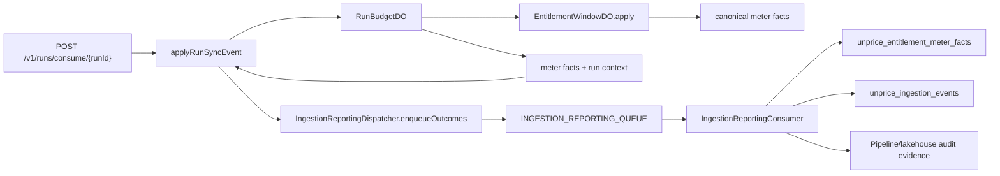

# Budget Run Analytics Attribution Implementation Plan

> **For agentic workers:** REQUIRED SUB-SKILL: Use superpowers:subagent-driven-development (recommended) or superpowers:executing-plans to implement this plan task-by-task. Steps use checkbox (`- [ ]`) syntax for tracking.

**Goal:** Make budget-run sync usage report through the same reporting queue, Tinybird meter-fact path, and ingestion status path as normal usage sync, while adding durable run attribution fields.

**Architecture:** `RunBudgetDO` stays the synchronous budget gate and delegates rating to `EntitlementWindowDO`, which already produces canonical usage meter facts. The run consume use case decorates those facts with run context, then awaits `IngestionReportingDispatcher.enqueueOutcomes` exactly like `/v1/usage/consume`; the reporting consumer remains the only Tinybird writer. Run sync events must not enter the raw async ingestion queue or raw R2 archival path.

**Tech Stack:** TypeScript, Hono, Zod, Drizzle Postgres, Cloudflare Durable Objects with SQLite, Cloudflare Queues, Tinybird, generated OpenAPI SDK resources.

---

## Product Decisions

1. `source_id` keeps its current meaning: the submitter identity, usually the API key id.
2. `workload_id` is the caller-owned producer label. It replaces public `agentId` and analytics `agent_id`.
3. `workload_type` is optional low-cardinality classification: `"agent" | "workflow" | "job" | "tool" | "custom"`.
4. `trace_id` groups all runs in one business flow.
5. `parent_run_id` expresses run tree structure. `trace_id` alone cannot tell parent/child relationships.
6. Run sync events create normal reporting audit records for processed and rejected outcomes with `payload_json = null` and `replayable = false`.
7. The public run API keeps the current route paths:
   - `POST /v1/runs/start`
   - `POST /v1/runs/consume/{runId}`
   - `POST /v1/runs/end/{runId}`
   - `GET /v1/runs/get/{runId}`
8. `startRunInputSchema` must not accept `currency`; `apps/api/src/routes/runs/startRunV1.ts` derives currency from the customer active subscription.
9. The SDK already exposes generated `client.runs.*` resources. Do not hand-write run methods in `packages/api/src/client.ts`; regenerate OpenAPI and SDK resources.

## Target Shape



No edge should exist from a run route or run use case to `QUEUE_SHARD_*`, raw async ingestion, raw R2 storage, or direct Tinybird ingestion.

## File Structure

### Run Identity

- `internal/db/src/schema/budget-runs.ts`
  Owns Postgres persisted run fields: `workloadType`, `workloadId`, `traceId`, `parentRunId`.

- `internal/db/src/validators/budget-runs.ts`
  Owns public run request and response schemas. It must expose workload fields and must not expose `agentId`.

- `internal/db/src/validators/budget-runs.test.ts`
  Locks public validator behavior.

- `internal/services/src/budget-runs/service.ts`
  Persists and loads run identity fields.

- `internal/services/src/use-cases/runs/start-run.ts`
  Creates the Postgres row, starts `RunBudgetDO`, and returns public run summaries.

- `internal/services/src/use-cases/runs/get-run.ts`
  Returns public run summaries with workload attribution.

- `internal/services/src/use-cases/runs/end-run.ts`
  Ends runs and returns public run summaries with workload attribution.

- `internal/services/src/use-cases/runs/apply-run-sync-event.ts`
  Resolves entitlement, calls `RunBudgetDO`, updates stored summary, and reports final run sync outcomes.

- `internal/services/src/use-cases/runs/run-budget-client.ts`
  Defines the service-side `RunBudgetClient` contract, including returned meter facts.

- `apps/api/src/ingestion/run-budget/db/schema.ts`
  Owns Durable Object SQLite hot run state fields.

- `apps/api/src/ingestion/run-budget/contracts.ts`
  Owns Durable Object input/output Zod contracts.

- `apps/api/src/ingestion/run-budget/RunBudgetDO.ts`
  Gates budget, delegates rating, decorates returned meter facts with run context, and persists idempotent decisions.

- `apps/api/src/ingestion/run-budget/client.ts`
  Calls the Cloudflare Durable Object and preserves returned meter facts.

### Analytics Contracts

- `internal/analytics/src/validators.ts`
  Adds nullable run attribution to `entitlementMeterFactSchemaV1` and `ingestionEventSchemaV1`.

- `internal/analytics/datasources/unprice_entitlement_meter_facts.datasource`
  Adds nullable run attribution columns for priced meter facts.

- `internal/analytics/datasources/unprice_ingestion_events.datasource`
  Adds nullable run attribution columns for status rows.

- `internal/analytics/fixtures/unprice_entitlement_meter_facts.ndjson`
  Adds null run fields for existing rows and one non-null run fact row.

- `internal/analytics/fixtures/unprice_ingestion_events.ndjson`
  Adds null run fields for existing rows and one non-null run status row.

### Reporting Pipeline

- `internal/services/src/ingestion/message.ts`
  Adds optional `runContext` to `IngestionQueueMessage`. Normal usage messages omit it.

- `internal/services/src/ingestion/reporting.ts`
  Adds nullable run context fields to `IngestionReportingAuditRecord`.

- `internal/services/src/ingestion/reporting-envelope.ts`
  Copies `message.runContext` into audit records and audit payload JSON.

- `apps/api/src/ingestion/reporting/consumer.ts`
  Copies reporting audit run fields into Tinybird ingestion status rows.

### Public Routes And SDK

- `apps/api/src/routes/runs/startRunV1.ts`
  Accepts `workloadId`, `workloadType`, `traceId`, and `parentRunId`; still derives currency from subscription.

- `apps/api/src/routes/runs/applyRunSyncEventV1.ts`
  Builds `requestId`, `receivedAt`, source, timestamp validation, entitlement resolver, run budget client, and reporting dispatcher dependencies.

- `apps/api/src/routes/runs/runs.test.ts`
  Locks route wiring and raw queue/R2 guardrails.

- `packages/api/src/openapi.d.ts`
  Generated OpenAPI types.

- `packages/api/src/generated/sdk-resources.ts`
  Generated SDK operation map and resource surface.

- `packages/api/src/client.test.ts`
  Locks generated `client.runs.*` behavior and absence of stale agent fields.

- `docs/budgeted-runs.md`
  Documents the reporting and replay boundary.

---

### Task 1: Lock The Current Public Run Contract With Failing Tests

**Files:**
- Create: `internal/db/src/validators/budget-runs.test.ts`
- Modify: `apps/api/src/routes/runs/runs.test.ts`

- [ ] **Step 1: Create the validator contract test**

Create `internal/db/src/validators/budget-runs.test.ts`:

```ts
import { describe, expect, it } from "vitest"
import { runSummarySchema, startRunInputSchema } from "./budget-runs"

describe("budget run validators", () => {
  it("accepts workload, trace, and parent attribution on start without currency", () => {
    const input = startRunInputSchema.parse({
      budgetAmount: 100,
      idempotencyKey: "idem_run_attr",
      workloadType: "workflow",
      workloadId: "checkout-flow",
      traceId: "trace_123",
      parentRunId: "brun_parent_123",
    })

    expect(input).toEqual({
      budgetAmount: 100,
      idempotencyKey: "idem_run_attr",
      workloadType: "workflow",
      workloadId: "checkout-flow",
      traceId: "trace_123",
      parentRunId: "brun_parent_123",
    })
  })

  it("does not expose agentId in the run summary contract", () => {
    const summary = runSummarySchema.parse({
      runId: "brun_123",
      status: "running",
      customerId: "cus_123",
      budgetAmount: 100,
      consumedAmount: 0,
      remainingAmount: 100,
      currency: "USD",
      workloadType: "agent",
      workloadId: "research-assistant",
      traceId: "trace_123",
      parentRunId: null,
    })

    expect(summary).toMatchObject({
      workloadType: "agent",
      workloadId: "research-assistant",
      traceId: "trace_123",
      parentRunId: null,
    })
    expect(summary).not.toHaveProperty("agentId")
  })
})
```

- [ ] **Step 2: Add a route contract test for current `/v1/runs/start` wiring**

Append this test inside the `describe("budgeted runs API", () => { ... })` block in `apps/api/src/routes/runs/runs.test.ts`:

```ts
it("starts a run with workload, trace, and parent attribution", async () => {
  authMocks.keyAuth.mockResolvedValue(verifiedKeyWithDefault)
  authMocks.resolveCustomerIdForApiKey.mockReturnValue({
    success: true,
    customerId: "cus_default",
  })

  useCaseMocks.startRun.mockResolvedValue({
    val: {
      runId: "brun_attr123",
      status: "running",
      customerId: "cus_default",
      budgetAmount: 500_000_000,
      consumedAmount: 0,
      remainingAmount: 500_000_000,
      currency: "USD",
      workloadType: "agent",
      workloadId: "research-assistant-v2",
      traceId: "trace_checkout_123",
      parentRunId: "brun_parent_123",
    },
    err: undefined,
  })

  const { app, env, executionCtx } = createTestApp()

  const response = await app.fetch(
    new Request("https://example.com/v1/runs/start", {
      method: "POST",
      headers: {
        authorization: "Bearer sk_test",
        "content-type": "application/json",
      },
      body: JSON.stringify({
        budgetAmount: 500,
        idempotencyKey: "run_attr_1",
        workloadType: "agent",
        workloadId: "research-assistant-v2",
        traceId: "trace_checkout_123",
        parentRunId: "brun_parent_123",
        metadata: {
          scenario: "checkout",
        },
      }),
    }),
    env,
    executionCtx
  )

  expect(response.status).toBe(200)
  expect(useCaseMocks.startRun).toHaveBeenCalledWith(
    expect.anything(),
    expect.objectContaining({
      workloadType: "agent",
      workloadId: "research-assistant-v2",
      traceId: "trace_checkout_123",
      parentRunId: "brun_parent_123",
    })
  )

  const body = await response.json()
  expect(body).toMatchObject({
    runId: "brun_attr123",
    workloadType: "agent",
    workloadId: "research-assistant-v2",
    traceId: "trace_checkout_123",
    parentRunId: "brun_parent_123",
  })
  expect(body).not.toHaveProperty("agentId")
})
```

- [ ] **Step 3: Run tests to verify they fail**

Run:

```bash
rtk pnpm --filter @unprice/db test src/validators/budget-runs.test.ts
rtk pnpm --filter api test src/routes/runs/runs.test.ts -t "workload, trace, and parent attribution"
```

Expected:

- The validator test fails because `workloadType`, `workloadId`, and `parentRunId` are not in `startRunInputSchema` or `runSummarySchema`.
- The route test fails because `startRunV1.ts` does not pass workload fields to `startRun`.

- [ ] **Step 4: Commit the failing tests**

```bash
rtk git add internal/db/src/validators/budget-runs.test.ts apps/api/src/routes/runs/runs.test.ts
rtk git commit -m "test: lock budget run workload contract"
```

---

### Task 2: Replace Public Agent Attribution With Workload Run Identity

**Files:**
- Modify: `internal/db/src/schema/budget-runs.ts`
- Modify: `internal/db/src/validators/budget-runs.ts`
- Modify: `internal/services/src/budget-runs/service.ts`
- Modify: `internal/services/src/use-cases/runs/start-run.ts`
- Modify: `internal/services/src/use-cases/runs/get-run.ts`
- Modify: `internal/services/src/use-cases/runs/end-run.ts`
- Modify: `internal/services/src/use-cases/runs/apply-run-sync-event.ts`
- Modify: `apps/api/src/routes/runs/startRunV1.ts`
- Modify: `apps/api/src/ingestion/run-budget/contracts.ts`
- Modify: `apps/api/src/ingestion/run-budget/db/schema.ts`
- Modify: `apps/api/src/ingestion/run-budget/RunBudgetDO.ts`
- Modify: `apps/api/src/ingestion/run-budget/client.ts`
- Modify: `apps/api/src/ingestion/run-budget/RunBudgetDO.test.ts`
- Generate: `internal/db/src/migrations/*`
- Generate: `apps/api/src/ingestion/run-budget/drizzle/*`

- [ ] **Step 1: Update the Postgres budget run schema**

In `internal/db/src/schema/budget-runs.ts`, replace `agentId` with workload fields and add indexes:

```ts
export type BudgetRunWorkloadType = "agent" | "workflow" | "job" | "tool" | "custom"

export const budgetRuns = pgTableProject(
  "budget_runs",
  {
    ...projectID,
    customerId: cuid("customer_id").notNull(),
    status: text("status").$type<BudgetRunStatus>().notNull().default("running"),
    statusReason: text("status_reason"),
    budgetAmount: bigint("budget_amount", { mode: "number" }).notNull(),
    consumedAmount: bigint("consumed_amount", { mode: "number" }).notNull().default(0),
    remainingAmount: bigint("remaining_amount", { mode: "number" }).notNull(),
    currency: text("currency").notNull(),
    walletReservationId: text("wallet_reservation_id"),
    idempotencyKey: text("idempotency_key").notNull(),
    workloadType: text("workload_type").$type<BudgetRunWorkloadType>(),
    workloadId: text("workload_id"),
    traceId: text("trace_id"),
    parentRunId: cuid("parent_run_id"),
    metadata: json("metadata").$type<Record<string, unknown>>().notNull().default({}),
    expiresAt: timestamp("expires_at", { withTimezone: true }),
    startedAt: timestamp("started_at", { withTimezone: true }).notNull().default(sql`now()`),
    endedAt: timestamp("ended_at", { withTimezone: true }),
    createdAt: timestamp("created_at", { withTimezone: true }).notNull().default(sql`now()`),
    updatedAt: timestamp("updated_at", { withTimezone: true }).notNull().default(sql`now()`),
  },
  (table) => ({
    primary: primaryKey({ columns: [table.id, table.projectId], name: "budget_runs_pkey" }),
    projectCustomerIdx: index("budget_runs_project_customer_idx").on(
      table.projectId,
      table.customerId
    ),
    projectStatusIdx: index("budget_runs_project_status_idx").on(table.projectId, table.status),
    projectTraceIdx: index("budget_runs_project_trace_idx").on(table.projectId, table.traceId),
    projectParentIdx: index("budget_runs_project_parent_idx").on(table.projectId, table.parentRunId),
    projectWorkloadIdx: index("budget_runs_project_workload_idx").on(
      table.projectId,
      table.workloadType,
      table.workloadId
    ),
    idempotencyIdx: uniqueIndex("budget_runs_project_customer_idempotency_idx").on(
      table.projectId,
      table.customerId,
      table.idempotencyKey
    ),
  })
)
```

- [ ] **Step 2: Update public run validators**

In `internal/db/src/validators/budget-runs.ts`, replace the start and summary schemas with this shape. Keep `currency` out of the start request:

```ts
export const workloadTypeSchema = z.enum(["agent", "workflow", "job", "tool", "custom"])

export const startRunInputSchema = z.object({
  customerId: z.string().min(1).optional(),
  /** Budget in currency minor units (cents). e.g. 500 = $5.00 USD. */
  budgetAmount: z.number().int().positive(),
  idempotencyKey: z.string().min(1),
  workloadType: workloadTypeSchema.nullable().optional(),
  workloadId: z.string().min(1).nullable().optional(),
  traceId: z.string().min(1).nullable().optional(),
  parentRunId: z.string().min(1).nullable().optional(),
  metadata: z.record(z.string(), z.unknown()).optional(),
  expiresAt: z.number().int().positive().nullable().optional(),
})

export const runSummarySchema = z.object({
  runId: z.string(),
  status: runStatusSchema,
  customerId: z.string(),
  /** Budget in currency minor units (cents). */
  budgetAmount: z.number().int(),
  /** Consumed in currency minor units (cents). */
  consumedAmount: z.number().int(),
  /** Remaining in currency minor units (cents). */
  remainingAmount: z.number().int(),
  currency: z.string(),
  workloadType: workloadTypeSchema.nullable(),
  workloadId: z.string().nullable(),
  traceId: z.string().nullable(),
  parentRunId: z.string().nullable(),
})
```

- [ ] **Step 3: Update the budget run service create input**

In `internal/services/src/budget-runs/service.ts`, update `createRun` input and insert values:

```ts
async createRun(input: {
  projectId: string
  customerId: string
  budgetAmount: number
  remainingAmount: number
  currency: string
  idempotencyKey: string
  workloadType?: "agent" | "workflow" | "job" | "tool" | "custom" | null
  workloadId?: string | null
  traceId?: string | null
  parentRunId?: string | null
  metadata?: Record<string, unknown>
  expiresAt?: Date | null
}): Promise<Result<BudgetRunRow, BudgetRunServiceError>> {
  try {
    const id = newId("budget_run")
    const [row] = await this.deps.db
      .insert(budgetRuns)
      .values({
        id,
        projectId: input.projectId,
        customerId: input.customerId,
        status: "running",
        budgetAmount: input.budgetAmount,
        consumedAmount: 0,
        remainingAmount: input.remainingAmount,
        currency: input.currency,
        idempotencyKey: input.idempotencyKey,
        workloadType: input.workloadType ?? null,
        workloadId: input.workloadId ?? null,
        traceId: input.traceId ?? null,
        parentRunId: input.parentRunId ?? null,
        metadata: input.metadata ?? {},
        expiresAt: input.expiresAt ?? null,
      })
      .onConflictDoNothing({
        target: [budgetRuns.projectId, budgetRuns.customerId, budgetRuns.idempotencyKey],
      })
      .returning()

    if (!row) {
      return this.getRunByIdempotencyKey({
        projectId: input.projectId,
        customerId: input.customerId,
        idempotencyKey: input.idempotencyKey,
      })
    }

    return Ok(row)
  } catch (_error) {
    return Err(new BudgetRunServiceError({ message: "Failed to create budget run" }))
  }
}
```

- [ ] **Step 4: Update run use-case input and returned summaries**

In `internal/services/src/use-cases/runs/start-run.ts`, update `StartRunResolvedInput`:

```ts
export type StartRunResolvedInput = {
  projectId: string
  customerId: string
  budgetAmount: number
  currency: string
  idempotencyKey: string
  workloadType?: "agent" | "workflow" | "job" | "tool" | "custom" | null
  workloadId?: string | null
  traceId?: string | null
  parentRunId?: string | null
  metadata?: Record<string, unknown>
  expiresAt?: number | null
}
```

Pass those fields into `budgetRuns.createRun` and `runBudget.startRun`. Return this summary shape from `start-run.ts`, `get-run.ts`, `end-run.ts`, and `apply-run-sync-event.ts`:

```ts
{
  runId: run.id,
  status: doResult.val.summary.status,
  customerId: run.customerId,
  budgetAmount: doResult.val.summary.budgetAmount,
  consumedAmount: doResult.val.summary.consumedAmount,
  remainingAmount: doResult.val.summary.remainingAmount,
  currency: run.currency,
  workloadType: run.workloadType ?? null,
  workloadId: run.workloadId ?? null,
  traceId: run.traceId ?? null,
  parentRunId: run.parentRunId ?? null,
}
```

For `get-run.ts` and entitlement-resolution rejection paths that do not have a `doResult`, use the stored row values:

```ts
{
  runId: run.id,
  status: run.status,
  customerId: run.customerId,
  budgetAmount: run.budgetAmount,
  consumedAmount: run.consumedAmount,
  remainingAmount: run.remainingAmount,
  currency: run.currency,
  workloadType: run.workloadType ?? null,
  workloadId: run.workloadId ?? null,
  traceId: run.traceId ?? null,
  parentRunId: run.parentRunId ?? null,
}
```

- [ ] **Step 5: Update `startRunV1.ts` to pass workload fields**

In `apps/api/src/routes/runs/startRunV1.ts`, replace the run use-case input object fields:

```ts
const result = await startRun(
  { services: { budgetRuns }, runBudget },
  {
    projectId: key.projectId,
    customerId: customer.customerId,
    budgetAmount: budgetAmountLedger,
    currency,
    idempotencyKey: body.idempotencyKey,
    workloadType: body.workloadType,
    workloadId: body.workloadId,
    traceId: body.traceId,
    parentRunId: body.parentRunId,
    metadata: body.metadata,
    expiresAt: body.expiresAt,
  }
)
```

- [ ] **Step 6: Update Durable Object contracts and SQLite schema**

In `apps/api/src/ingestion/run-budget/contracts.ts`, add the shared workload type and update `startRunInputSchema`:

```ts
const workloadTypeSchema = z.enum(["agent", "workflow", "job", "tool", "custom"])

export const startRunInputSchema = z.object({
  projectId: z.string().min(1),
  customerId: z.string().min(1),
  runId: z.string().min(1),
  budgetAmount: z.number().int().positive(),
  currency: z.string().min(3).max(12),
  idempotencyKey: z.string().min(1),
  workloadType: workloadTypeSchema.nullable().optional(),
  workloadId: z.string().min(1).nullable().optional(),
  traceId: z.string().min(1).nullable().optional(),
  parentRunId: z.string().min(1).nullable().optional(),
  metadata: z.record(z.unknown()).default({}),
  expiresAt: z.number().finite().nullable().optional(),
  now: z.number().finite(),
})
```

In `apps/api/src/ingestion/run-budget/db/schema.ts`, replace `agentId`:

```ts
workloadType: text("workload_type"),
workloadId: text("workload_id"),
traceId: text("trace_id"),
parentRunId: text("parent_run_id"),
```

- [ ] **Step 7: Update `RunBudgetDO` run state and wallet metadata**

In `apps/api/src/ingestion/run-budget/RunBudgetDO.ts`, insert workload fields into `runState`:

```ts
await this.db.insert(schema.runState).values({
  runId: input.runId,
  projectId: input.projectId,
  customerId: input.customerId,
  workloadType: input.workloadType ?? null,
  workloadId: input.workloadId ?? null,
  parentRunId: input.parentRunId ?? null,
  reservationId: walletResult.reservationId,
  status: "running",
  currency: input.currency,
  budgetAmount: input.budgetAmount,
  reservedAmount: walletResult.allocationAmount,
  consumedAmount: 0,
  flushedAmount: 0,
  startedAt: input.now,
  expiresAt: input.expiresAt ?? null,
  traceId: input.traceId ?? null,
  metadataJson: JSON.stringify(input.metadata),
})
```

Replace reservation metadata:

```ts
metadata: {
  run_id: input.runId,
  trace_id: input.traceId ?? null,
  parent_run_id: input.parentRunId ?? null,
  workload_type: input.workloadType ?? null,
  workload_id: input.workloadId ?? null,
},
```

Replace release metadata:

```ts
metadata: {
  run_id: run.runId,
  trace_id: run.traceId,
  parent_run_id: run.parentRunId,
  workload_type: run.workloadType,
  workload_id: run.workloadId,
},
```

- [ ] **Step 8: Regenerate migrations**

Run:

```bash
rtk bin/migrate.dev
rtk pnpm --filter api db:generate:ingestion:run-budget
rtk pnpm --filter api db:check:ingestion:migrations
```

Expected:

- Postgres migration replaces `agent_id` with `workload_type`, `workload_id`, and `parent_run_id`, while preserving `trace_id`.
- RunBudgetDO SQLite migration adds `workload_type`, `workload_id`, and `parent_run_id`.
- Ingestion migration check exits 0.

- [ ] **Step 9: Run focused tests**

```bash
rtk pnpm --filter @unprice/db test src/validators/budget-runs.test.ts
rtk pnpm --filter api test src/routes/runs/runs.test.ts -t "workload, trace, and parent attribution"
rtk pnpm --filter api test src/ingestion/run-budget/RunBudgetDO.test.ts
```

Expected: all pass.

- [ ] **Step 10: Commit**

```bash
rtk git add internal/db apps/api/src/ingestion/run-budget internal/services/src/budget-runs internal/services/src/use-cases/runs apps/api/src/routes/runs/startRunV1.ts apps/api/src/routes/runs/runs.test.ts
rtk git commit -m "refactor: replace agent run attribution with workload context"
```

---

### Task 3: Add Run Attribution Columns To Analytics Contracts

**Files:**
- Modify: `internal/analytics/src/validators.ts`
- Modify: `internal/analytics/datasources/unprice_entitlement_meter_facts.datasource`
- Modify: `internal/analytics/datasources/unprice_ingestion_events.datasource`
- Modify: `internal/analytics/fixtures/unprice_entitlement_meter_facts.ndjson`
- Modify: `internal/analytics/fixtures/unprice_ingestion_events.ndjson`
- Modify: `internal/analytics/tests/v1_get_ingestion_live.yaml`
- Modify: `internal/analytics/tests/v1_get_ingestion_recent.yaml`
- Modify: `internal/analytics/tests/v1_get_feature_usage*.yaml` if those tests assert full meter fact rows

- [ ] **Step 1: Add shared analytics run fields**

In `internal/analytics/src/validators.ts`, add this helper near the entitlement/ingestion schemas:

```ts
const analyticsRunContextShape = {
  run_id: z.string().nullable().optional(),
  trace_id: z.string().nullable().optional(),
  parent_run_id: z.string().nullable().optional(),
  workload_type: z.enum(["agent", "workflow", "job", "tool", "custom"]).nullable().optional(),
  workload_id: z.string().nullable().optional(),
}
```

Extend `entitlementMeterFactSchemaV1` immediately after `source_name`:

```ts
source_name: z.string().nullable().optional(),
...analyticsRunContextShape,
customer_entitlement_id: z.string(),
```

Extend `ingestionEventSchemaV1` immediately after `source_name`:

```ts
source_name: z.string().nullable().optional(),
...analyticsRunContextShape,
event_slug: z.string(),
```

- [ ] **Step 2: Add Tinybird datasource columns**

In `internal/analytics/datasources/unprice_entitlement_meter_facts.datasource`, add after `source_name`:

```sql
    `run_id` Nullable(String) `json:$.run_id`,
    `trace_id` Nullable(String) `json:$.trace_id`,
    `parent_run_id` Nullable(String) `json:$.parent_run_id`,
    `workload_type` LowCardinality(Nullable(String)) `json:$.workload_type`,
    `workload_id` Nullable(String) `json:$.workload_id`,
```

In `internal/analytics/datasources/unprice_ingestion_events.datasource`, add after `source_name`:

```sql
    `run_id` Nullable(String) `json:$.run_id`,
    `trace_id` Nullable(String) `json:$.trace_id`,
    `parent_run_id` Nullable(String) `json:$.parent_run_id`,
    `workload_type` LowCardinality(Nullable(String)) `json:$.workload_type`,
    `workload_id` Nullable(String) `json:$.workload_id`,
```

Do not add these columns to sorting keys in this task.

- [ ] **Step 3: Update fixtures**

For every existing row in `internal/analytics/fixtures/unprice_entitlement_meter_facts.ndjson` and `internal/analytics/fixtures/unprice_ingestion_events.ndjson`, add these keys with null values:

```json
"run_id":null,"trace_id":null,"parent_run_id":null,"workload_type":null,"workload_id":null
```

Append this exact run meter fact row to `internal/analytics/fixtures/unprice_entitlement_meter_facts.ndjson`:

```json
{"event_id":"evt_run_001","idempotency_key":"idem_run_001:ew","workspace_id":"ws_1","project_id":"proj_1","customer_id":"cus_1","environment":"test","api_key_id":"key_1","source_type":"api_key","source_id":"key_1","source_name":"Production key","run_id":"brun_001","trace_id":"trace_checkout_001","parent_run_id":null,"workload_type":"agent","workload_id":"research-assistant","customer_entitlement_id":"ce_1","grant_id":"grnt_1","feature_plan_version_id":"fpv_1","feature_slug":"llm-tokens","period_key":"2026-06","event_slug":"llm-tokens","aggregation_method":"sum","timestamp":4070908801000,"created_at":4070908801100,"delta":1200,"value_after":1200,"amount":250000,"amount_after":250000,"amount_scale":8,"currency":"USD","priced_at":4070908801100,"tier_index":0,"tier_mode":"volume","pricing_component_count":1}
```

Append this exact run status row to `internal/analytics/fixtures/unprice_ingestion_events.ndjson`:

```json
{"event_id":"evt_run_001","canonical_audit_id":"audit_run_001","payload_hash":"hash_run_001","workspace_id":"ws_1","project_id":"proj_1","customer_id":"cus_1","environment":"test","api_key_id":"key_1","source_type":"api_key","source_id":"key_1","source_name":"Production key","run_id":"brun_001","trace_id":"trace_checkout_001","parent_run_id":null,"workload_type":"agent","workload_id":"research-assistant","event_slug":"llm-tokens","idempotency_key":"idem_run_001","state":"processed","rejection_reason":null,"failure_stage":null,"failure_reason":null,"failure_message":null,"replayable":false,"payload_json":null,"timestamp":4070908801000,"received_at":4070908801000,"handled_at":4070908801100,"created_at":4070908801200}
```

- [ ] **Step 4: Update Tinybird test expectations**

For ingestion recent/live endpoint tests that assert full rows, add these fields to the expected run row:

```json
{"run_id":"brun_001","trace_id":"trace_checkout_001","parent_run_id":null,"workload_type":"agent","workload_id":"research-assistant"}
```

For existing non-run rows asserted as full objects, add these fields:

```json
{"run_id":null,"trace_id":null,"parent_run_id":null,"workload_type":null,"workload_id":null}
```

- [ ] **Step 5: Run analytics checks**

```bash
rtk pnpm --filter @unprice/analytics typecheck
rtk tb test run
```

Expected:

- Analytics TypeScript passes.
- Tinybird tests pass after schemas, fixtures, and expectations align.

- [ ] **Step 6: Commit**

```bash
rtk git add internal/analytics
rtk git commit -m "feat: add run attribution to analytics rows"
```

---

### Task 4: Carry Run Context Through Reporting Envelopes

**Files:**
- Modify: `internal/services/src/ingestion/message.ts`
- Modify: `internal/services/src/ingestion/reporting.ts`
- Modify: `internal/services/src/ingestion/reporting-envelope.ts`
- Modify: `internal/services/src/ingestion/reporting-envelope.test.ts`
- Modify: `apps/api/src/ingestion/reporting/consumer.ts`
- Modify: `apps/api/src/ingestion/reporting/consumer.test.ts`

- [ ] **Step 1: Add optional run context to ingestion messages**

In `internal/services/src/ingestion/message.ts`, add:

```ts
export const ingestionRunContextSchema = z.object({
  runId: z.string().min(1),
  traceId: z.string().min(1).nullable().optional(),
  parentRunId: z.string().min(1).nullable().optional(),
  workloadType: z.enum(["agent", "workflow", "job", "tool", "custom"]).nullable().optional(),
  workloadId: z.string().min(1).nullable().optional(),
})
```

Extend `ingestionQueueMessageSchema`:

```ts
runContext: ingestionRunContextSchema.optional(),
```

- [ ] **Step 2: Add run fields to reporting audit records**

In `internal/services/src/ingestion/reporting.ts`, extend `ingestionReportingAuditRecordSchema`:

```ts
runId: z.string().nullable(),
traceId: z.string().nullable(),
parentRunId: z.string().nullable(),
workloadType: z.enum(["agent", "workflow", "job", "tool", "custom"]).nullable(),
workloadId: z.string().nullable(),
```

- [ ] **Step 3: Copy run context into audit records and audit payload JSON**

In `internal/services/src/ingestion/reporting-envelope.ts`, add this helper:

```ts
function getMessageRunContext(message: IngestionQueueMessage): {
  runId: string | null
  traceId: string | null
  parentRunId: string | null
  workloadType: "agent" | "workflow" | "job" | "tool" | "custom" | null
  workloadId: string | null
} {
  const runContext = message.runContext ?? null

  return {
    runId: runContext?.runId ?? null,
    traceId: runContext?.traceId ?? null,
    parentRunId: runContext?.parentRunId ?? null,
    workloadType: runContext?.workloadType ?? null,
    workloadId: runContext?.workloadId ?? null,
  }
}
```

In `buildIngestionReportingAuditRecord`, add the copied fields:

```ts
const runContext = getMessageRunContext(message)

return {
  idempotencyKey: message.idempotencyKey,
  canonicalAuditId,
  payloadHash,
  workspaceId: message.workspaceId,
  projectId,
  customerId,
  environment: message.source.environment,
  apiKeyId: message.source.apiKeyId,
  sourceType: message.source.sourceType,
  sourceId: message.source.sourceId,
  sourceName: message.source.sourceName,
  runId: runContext.runId,
  traceId: runContext.traceId,
  parentRunId: runContext.parentRunId,
  workloadType: runContext.workloadType,
  workloadId: runContext.workloadId,
  status: outcome.state,
  rejectionReason: outcome.state === "rejected" ? outcome.rejectionReason : undefined,
  failureStage: failed ? outcome.failureStage : null,
  failureReason: failed ? outcome.failureReason : null,
  failureMessage: failed ? (outcome.failureMessage ?? null) : null,
  replayable: failed ? outcome.replayable : false,
  payloadJson,
  auditPayloadJson: JSON.stringify(
    buildIngestionAuditPayload(message, outcome, canonicalAuditId, payloadHash, handledAt)
  ),
  firstSeenAt: message.receivedAt,
  handledAt,
}
```

In `buildIngestionAuditPayload`, add snake-case fields:

```ts
const runContext = getMessageRunContext(message)

return {
  event_date: toEventDate(message.timestamp),
  schema_version: EVENTS_SCHEMA_VERSION,
  id: message.id,
  workspace_id: message.workspaceId,
  project_id: message.projectId,
  customer_id: message.customerId,
  environment: message.source.environment,
  api_key_id: message.source.apiKeyId,
  source_type: message.source.sourceType,
  source_id: message.source.sourceId,
  source_name: message.source.sourceName,
  run_id: runContext.runId,
  trace_id: runContext.traceId,
  parent_run_id: runContext.parentRunId,
  workload_type: runContext.workloadType,
  workload_id: runContext.workloadId,
  request_id: message.requestId,
  idempotency_key: message.idempotencyKey,
  slug: message.slug,
  timestamp: message.timestamp,
  received_at: message.receivedAt,
  handled_at: handledAt,
  state: outcome.state,
  rejection_reason: outcome.state === "rejected" ? outcome.rejectionReason : undefined,
  properties: message.properties,
  canonical_audit_id: canonicalAuditId,
  payload_hash: payloadHash,
}
```

- [ ] **Step 4: Publish run fields to Tinybird ingestion status rows**

In `apps/api/src/ingestion/reporting/consumer.ts`, update `buildIngestionEvent`:

```ts
return {
  event_id: payload.id,
  canonical_audit_id: record.canonicalAuditId,
  payload_hash: record.payloadHash,
  workspace_id: record.workspaceId,
  project_id: record.projectId,
  customer_id: record.customerId,
  environment: record.environment,
  api_key_id: record.apiKeyId,
  source_type: record.sourceType,
  source_id: record.sourceId,
  source_name: record.sourceName,
  run_id: record.runId,
  trace_id: record.traceId,
  parent_run_id: record.parentRunId,
  workload_type: record.workloadType,
  workload_id: record.workloadId,
  event_slug: payload.slug,
  idempotency_key: record.idempotencyKey,
  state: record.status,
  rejection_reason: record.rejectionReason ?? null,
  failure_stage: record.failureStage ?? null,
  failure_reason: record.failureReason ?? null,
  failure_message: record.failureMessage ?? null,
  replayable: record.replayable ?? false,
  payload_json: record.payloadJson ?? null,
  timestamp: payload.timestamp,
  received_at: record.firstSeenAt,
  handled_at: record.handledAt,
  created_at: Date.now(),
}
```

- [ ] **Step 5: Update reporting test builders with null run defaults**

In `apps/api/src/ingestion/reporting/consumer.test.ts`, update `createAuditRecord` to include nullable run fields after `sourceName`:

```ts
runId: null,
traceId: null,
parentRunId: null,
workloadType: null,
workloadId: null,
```

Update `createAuditRecord`'s `auditPayloadJson` default object to include snake-case null fields after `source_name`:

```ts
run_id: null,
trace_id: null,
parent_run_id: null,
workload_type: null,
workload_id: null,
```

Update `createIngestionEvent` to include nullable run fields after `source_name`:

```ts
run_id: null,
trace_id: null,
parent_run_id: null,
workload_type: null,
workload_id: null,
```

Update `createMeterFact` in both `apps/api/src/ingestion/reporting/consumer.test.ts` and `internal/services/src/ingestion/reporting-envelope.test.ts` to include nullable run fields after `source_name`:

```ts
run_id: null,
trace_id: null,
parent_run_id: null,
workload_type: null,
workload_id: null,
```

- [ ] **Step 6: Add reporting envelope test**

In `internal/services/src/ingestion/reporting-envelope.test.ts`, add:

```ts
it("copies run context into reporting audit records without making processed rows replayable", async () => {
  const message = createMessage({
    runContext: {
      runId: "brun_001",
      traceId: "trace_001",
      parentRunId: "brun_parent_001",
      workloadType: "agent",
      workloadId: "research-assistant",
    },
  })

  const record = await buildIngestionReportingAuditRecord({
    customerId: "cus_1",
    message,
    now: () => 4070908801100,
    outcome: { state: "processed" },
    projectId: "proj_1",
  })

  expect(record).toMatchObject({
    runId: "brun_001",
    traceId: "trace_001",
    parentRunId: "brun_parent_001",
    workloadType: "agent",
    workloadId: "research-assistant",
    replayable: false,
    payloadJson: null,
  })
  expect(JSON.parse(record.auditPayloadJson)).toMatchObject({
    run_id: "brun_001",
    trace_id: "trace_001",
    parent_run_id: "brun_parent_001",
    workload_type: "agent",
    workload_id: "research-assistant",
  })
})
```

- [ ] **Step 7: Add reporting consumer test**

In `apps/api/src/ingestion/reporting/consumer.test.ts`, add:

```ts
it("publishes run attribution to Tinybird ingestion status rows", async () => {
  const ingestIngestionEvents = vi.fn().mockResolvedValue({ successful_rows: 1, quarantined_rows: 0 })
  const ingestMeterFacts = vi.fn().mockResolvedValue({ successful_rows: 0, quarantined_rows: 0 })
  const consumer = new IngestionReportingConsumer({
    ingestIngestionEvents,
    ingestMeterFacts,
    publishAuditRecords: vi.fn().mockResolvedValue(undefined),
    logger: createLogger(),
  })

  await consumer.consumeBatch({
    messages: [
      {
        body: createEnvelope({
          auditRecords: [
            createAuditRecord({
              runId: "brun_001",
              traceId: "trace_001",
              parentRunId: "brun_parent_001",
              workloadType: "agent",
              workloadId: "research-assistant",
            }),
          ],
          meterFacts: [],
        }),
        ack: vi.fn(),
        retry: vi.fn(),
      },
    ],
  })

  expect(ingestIngestionEvents).toHaveBeenCalledWith([
    expect.objectContaining({
      run_id: "brun_001",
      trace_id: "trace_001",
      parent_run_id: "brun_parent_001",
      workload_type: "agent",
      workload_id: "research-assistant",
      payload_json: null,
      replayable: false,
    }),
  ])
})
```

- [ ] **Step 8: Run reporting tests**

```bash
rtk pnpm --filter @unprice/services test src/ingestion/reporting-envelope.test.ts
rtk pnpm --filter api test src/ingestion/reporting/consumer.test.ts
```

Expected: all pass.

- [ ] **Step 9: Commit**

```bash
rtk git add internal/services/src/ingestion apps/api/src/ingestion/reporting
rtk git commit -m "feat: propagate run context through reporting envelopes"
```

---

### Task 5: Return Run-Attributed Meter Facts From `RunBudgetDO`

**Files:**
- Modify: `apps/api/src/ingestion/run-budget/contracts.ts`
- Modify: `apps/api/src/ingestion/run-budget/RunBudgetDO.ts`
- Modify: `apps/api/src/ingestion/run-budget/client.ts`
- Modify: `internal/services/src/use-cases/runs/run-budget-client.ts`
- Modify: `apps/api/src/ingestion/run-budget/RunBudgetDO.test.ts`
- Modify: `apps/api/src/ingestion/run-budget/contracts.test.ts`

- [ ] **Step 1: Extend run budget decision contracts**

In `apps/api/src/ingestion/run-budget/contracts.ts`, import the analytics schema:

```ts
import { entitlementMeterFactSchemaV1 } from "@unprice/analytics"
```

Extend `runBudgetDecisionSchema`:

```ts
export const runBudgetDecisionSchema = z.object({
  allowed: z.boolean(),
  state: z.enum(["processed", "rejected"]),
  rejectionReason: z
    .enum(["LIMIT_EXCEEDED", "WALLET_EMPTY", "LATE_EVENT_CLOSED_PERIOD", "RUN_BUDGET_EXCEEDED"])
    .optional(),
  message: z.string().optional(),
  budget: runBudgetSummarySchema,
  meterFacts: z.array(entitlementMeterFactSchemaV1).default([]),
})
```

In `internal/services/src/use-cases/runs/run-budget-client.ts`, add the import and extend `RunSyncDecision`:

```ts
import type { AnalyticsEntitlementMeterFact } from "@unprice/analytics"

export type RunSyncDecision = {
  allowed: boolean
  state: "processed" | "rejected"
  rejectionReason?:
    | "LIMIT_EXCEEDED"
    | "WALLET_EMPTY"
    | "LATE_EVENT_CLOSED_PERIOD"
    | "RUN_BUDGET_EXCEEDED"
  message?: string
  budget: RunBudgetSummary
  meterFacts: AnalyticsEntitlementMeterFact[]
}
```

- [ ] **Step 2: Decorate returned meter facts with run context**

In `apps/api/src/ingestion/run-budget/RunBudgetDO.ts`, add:

```ts
private withRunContext(
  run: RunStateRow,
  meterFacts: Array<Record<string, unknown>>
): Array<Record<string, unknown>> {
  return meterFacts.map((fact) => ({
    ...fact,
    run_id: run.runId,
    trace_id: run.traceId ?? null,
    parent_run_id: run.parentRunId ?? null,
    workload_type: run.workloadType ?? null,
    workload_id: run.workloadId ?? null,
  }))
}
```

- [ ] **Step 3: Return decorated facts on accepted and duplicate decisions**

In `RunBudgetDO.applySyncEvent`, replace the accepted path facts handling:

```ts
const rawMeterFacts = entitlementResult.meterFacts ?? []
const meterFacts = this.withRunContext(run, rawMeterFacts)
const pricedAmount = this.sumPricedAmount(meterFacts)
const bucketDeltas = this.deriveBucketDeltas(input.runId, meterFacts)

const updatedRun = await this.commitSpend(run, pricedAmount, bucketDeltas, input.now)

const decision: RunBudgetDecision = {
  allowed: true,
  state: "processed",
  budget: this.toSummary(updatedRun),
  meterFacts,
}
```

For every rejected `RunBudgetDecision` constructed in `RunBudgetDO.applySyncEvent`, include:

```ts
meterFacts: [],
```

Because the decision is persisted in `run_idempotency.decisionJson`, duplicate requests will replay the same `meterFacts` array from the cached decision.

- [ ] **Step 4: Preserve facts in the Cloudflare client**

In `apps/api/src/ingestion/run-budget/client.ts`, return facts from `applySyncEvent`:

```ts
return Ok({
  allowed: decision.allowed,
  state: decision.state,
  rejectionReason: decision.rejectionReason,
  message: decision.message,
  budget: decision.budget,
  meterFacts: decision.meterFacts ?? [],
})
```

- [ ] **Step 5: Add RunBudgetDO test**

In `apps/api/src/ingestion/run-budget/RunBudgetDO.test.ts`, add:

```ts
it("returns meter facts decorated with run analytics context", async () => {
  const RunBudgetDO = await loadRunBudgetDO()
  const state = createDurableObjectState()
  const env = createEnv()
  const durable = new RunBudgetDO(state, env)

  await durable.startRun({
    runId: "run_1",
    customerId: "cus_1",
    projectId: "proj_1",
    currency: "USD",
    budgetAmount: 100_000,
    idempotencyKey: "idem_start_1",
    workloadType: "agent",
    workloadId: "research-assistant",
    traceId: "trace_001",
    parentRunId: "brun_parent_001",
    metadata: {},
    now: BASE_NOW,
  })

  testState.entitlementWindowApply.mockResolvedValue({
    allowed: true,
    meterFacts: [
      {
        event_id: "evt_001",
        idempotency_key: "apply_001:ew",
        workspace_id: "ws_1",
        project_id: "proj_1",
        customer_id: "cus_1",
        environment: "test",
        api_key_id: "key_1",
        source_type: "api_key",
        source_id: "key_1",
        source_name: null,
        customer_entitlement_id: "ce_test_1",
        grant_id: "grant_1",
        feature_plan_version_id: "fpv_1",
        feature_slug: "tokens",
        period_key: "period_1",
        event_slug: "tokens_used",
        aggregation_method: "sum",
        timestamp: BASE_NOW,
        created_at: BASE_NOW,
        delta: 5,
        value_after: 5,
        amount: 250,
        amount_after: 250,
        amount_scale: 8,
        currency: "USD",
        priced_at: BASE_NOW,
        tier_index: 0,
        tier_mode: "volume",
        pricing_component_count: 1,
        statement_key: "stmt_1",
        period_start_at: BASE_NOW - 60_000,
        period_end_at: BASE_NOW + 60_000,
      },
    ],
  })

  const result = await durable.applySyncEvent({
    projectId: "proj_1",
    customerId: "cus_1",
    runId: "run_1",
    featureSlug: "tokens",
    idempotencyKey: "apply_001",
    event: {
      id: "evt_001",
      slug: "tokens_used",
      timestamp: BASE_NOW,
      properties: { amount: 5 },
    },
    source: {
      workspaceId: "ws_1",
      environment: "test",
      apiKeyId: "key_1",
      sourceType: "api_key",
      sourceId: "key_1",
      sourceName: null,
    },
    now: BASE_NOW,
    ...TEST_ENTITLEMENT_FIELDS,
  })

  expect((result as { meterFacts: Record<string, unknown>[] }).meterFacts).toEqual([
    expect.objectContaining({
      run_id: "run_1",
      trace_id: "trace_001",
      parent_run_id: "brun_parent_001",
      workload_type: "agent",
      workload_id: "research-assistant",
    }),
  ])
})
```

- [ ] **Step 6: Run RunBudgetDO tests**

```bash
rtk pnpm --filter api test src/ingestion/run-budget/RunBudgetDO.test.ts -t "meter facts decorated with run analytics context"
rtk pnpm --filter api test src/ingestion/run-budget/contracts.test.ts
```

Expected: all pass.

- [ ] **Step 7: Commit**

```bash
rtk git add apps/api/src/ingestion/run-budget internal/services/src/use-cases/runs/run-budget-client.ts
rtk git commit -m "feat: return run-attributed meter facts from run budget"
```

---

### Task 6: Enqueue Run Consume Outcomes Through Existing Reporting

**Files:**
- Modify: `internal/services/src/use-cases/runs/apply-run-sync-event.ts`
- Create: `internal/services/src/use-cases/runs/apply-run-sync-event.test.ts`
- Modify: `apps/api/src/routes/runs/applyRunSyncEventV1.ts`
- Modify: `apps/api/src/routes/runs/runs.test.ts`

- [ ] **Step 1: Extend use-case dependencies and input**

In `internal/services/src/use-cases/runs/apply-run-sync-event.ts`, import reporting types:

```ts
import type {
  IngestionOutcome,
  IngestionQueueMessage,
  IngestionReportingOutcomeDispatcher,
} from "../../ingestion"
```

Update deps while keeping the entitlement resolver:

```ts
export type ApplyRunSyncEventDeps = {
  services: Pick<{ budgetRuns: BudgetRunService }, "budgetRuns">
  runBudget: RunBudgetClient
  entitlementResolver: RunEntitlementResolver
  reportingDispatcher: IngestionReportingOutcomeDispatcher
}
```

Update input:

```ts
export type ApplyRunSyncEventInput = {
  projectId: string
  runId: string
  keyCustomerId: string | null
  featureSlug: string
  idempotencyKey: string
  requestId: string
  receivedAt: number
  event: {
    id: string
    slug: string
    timestamp: number
    properties: Record<string, unknown>
  }
  source: {
    workspaceId: string
    environment: string
    apiKeyId: string | null
    sourceType: "api_key" | "system" | "unknown"
    sourceId: string
    sourceName: string | null
  }
  now: number
}
```

- [ ] **Step 2: Add reporting message helper**

In `internal/services/src/use-cases/runs/apply-run-sync-event.ts`, add:

```ts
function buildRunReportingMessage(input: ApplyRunSyncEventInput, run: {
  id: string
  projectId: string
  customerId: string
  workloadType: "agent" | "workflow" | "job" | "tool" | "custom" | null
  workloadId: string | null
  traceId: string | null
  parentRunId: string | null
}): IngestionQueueMessage {
  return {
    version: 1,
    workspaceId: input.source.workspaceId,
    projectId: run.projectId,
    customerId: run.customerId,
    requestId: input.requestId,
    receivedAt: input.receivedAt,
    idempotencyKey: input.idempotencyKey,
    id: input.event.id,
    slug: input.event.slug,
    timestamp: input.event.timestamp,
    properties: input.event.properties,
    source: input.source,
    runContext: {
      runId: run.id,
      traceId: run.traceId,
      parentRunId: run.parentRunId,
      workloadType: run.workloadType,
      workloadId: run.workloadId,
    },
  }
}
```

- [ ] **Step 3: Report entitlement-resolution rejections**

In the `if (!resolution.ok)` branch, enqueue a rejected outcome before returning:

```ts
const reportingMessage = buildRunReportingMessage(input, run)
await deps.reportingDispatcher.enqueueOutcomes({
  customerId: run.customerId,
  projectId: run.projectId,
  outcomes: [
    {
      message: reportingMessage,
      outcome: { state: "rejected", rejectionReason: resolution.reason },
      meterFacts: [],
    },
  ],
})
```

The returned public decision should keep its current public reason mapping:

```ts
return Ok({
  accepted: false,
  reason: mapEntitlementRejection(resolution.reason),
  run: {
    runId: run.id,
    status: run.status,
    customerId: run.customerId,
    budgetAmount: run.budgetAmount,
    consumedAmount: run.consumedAmount,
    remainingAmount: run.remainingAmount,
    currency: run.currency,
    workloadType: run.workloadType ?? null,
    workloadId: run.workloadId ?? null,
    traceId: run.traceId ?? null,
    parentRunId: run.parentRunId ?? null,
  },
})
```

- [ ] **Step 4: Report RunBudgetDO processed and rejected decisions**

After `doResult` succeeds and after `updateRunSummary`, enqueue the final outcome:

```ts
const reportingMessage = buildRunReportingMessage(input, run)
const reportingOutcome: IngestionOutcome = decision.allowed
  ? { state: "processed" }
  : {
      state: "rejected",
      rejectionReason: decision.rejectionReason ?? "RUN_BUDGET_EXCEEDED",
    }

await deps.reportingDispatcher.enqueueOutcomes({
  customerId: run.customerId,
  projectId: run.projectId,
  outcomes: [
    {
      message: reportingMessage,
      outcome: reportingOutcome,
      meterFacts: decision.meterFacts,
    },
  ],
})
```

This `await` is intentional. Sync ingestion already waits for reporting enqueue durability before returning; run sync must do the same.

- [ ] **Step 5: Add use-case test for processed reporting**

Create `internal/services/src/use-cases/runs/apply-run-sync-event.test.ts` with:

```ts
import { describe, expect, it, vi } from "vitest"
import { Ok } from "@unprice/error"
import { applyRunSyncEvent } from "./apply-run-sync-event"

describe("applyRunSyncEvent", () => {
  it("enqueues processed run usage through ingestion reporting with run context", async () => {
    const enqueueOutcomes = vi.fn().mockResolvedValue(undefined)
    const budgetRuns = {
      getRun: vi.fn().mockResolvedValue(
        Ok({
          id: "brun_001",
          projectId: "proj_1",
          customerId: "cus_1",
          status: "running",
          budgetAmount: 1000,
          consumedAmount: 0,
          remainingAmount: 1000,
          currency: "USD",
          workloadType: "agent",
          workloadId: "research-assistant",
          traceId: "trace_001",
          parentRunId: "brun_parent_001",
        })
      ),
      updateRunSummary: vi.fn().mockResolvedValue(Ok({ id: "brun_001" })),
    }
    const entitlementResolver = {
      resolveForFeature: vi.fn().mockResolvedValue({
        ok: true,
        entitlement: {
          customerEntitlementId: "ce_1",
          meterConfig: { aggregationMethod: "sum", aggregationField: "tokens" },
        },
        grants: [{ id: "grant_1" }],
      }),
    }
    const runBudget = {
      applySyncEvent: vi.fn().mockResolvedValue(
        Ok({
          allowed: true,
          state: "processed",
          budget: {
            runId: "brun_001",
            status: "running",
            budgetAmount: 1000,
            consumedAmount: 250,
            remainingAmount: 750,
          },
          meterFacts: [
            {
              event_id: "evt_001",
              idempotency_key: "idem_001:ew",
              workspace_id: "ws_1",
              project_id: "proj_1",
              customer_id: "cus_1",
              environment: "test",
              api_key_id: "key_1",
              source_type: "api_key",
              source_id: "key_1",
              source_name: null,
              run_id: "brun_001",
              trace_id: "trace_001",
              parent_run_id: "brun_parent_001",
              workload_type: "agent",
              workload_id: "research-assistant",
              customer_entitlement_id: "ce_1",
              grant_id: "grnt_1",
              feature_plan_version_id: "fpv_1",
              feature_slug: "llm-tokens",
              period_key: "2026-06",
              event_slug: "llm-tokens",
              aggregation_method: "sum",
              timestamp: 4070908800100,
              created_at: 4070908800200,
              delta: 1200,
              value_after: 1200,
              amount: 250,
              amount_after: 250,
              amount_scale: 8,
              currency: "USD",
              priced_at: 4070908800200,
              tier_index: 0,
              tier_mode: "volume",
              pricing_component_count: 1,
            },
          ],
        })
      ),
    }

    await applyRunSyncEvent(
      {
        services: { budgetRuns: budgetRuns as never },
        runBudget: runBudget as never,
        entitlementResolver: entitlementResolver as never,
        reportingDispatcher: { enqueueOutcomes },
      },
      {
        projectId: "proj_1",
        runId: "brun_001",
        keyCustomerId: "cus_1",
        featureSlug: "llm-tokens",
        idempotencyKey: "idem_001",
        requestId: "req_001",
        receivedAt: 4070908800000,
        event: {
          id: "evt_001",
          slug: "llm-tokens",
          timestamp: 4070908800100,
          properties: { tokens: 1200 },
        },
        source: {
          workspaceId: "ws_1",
          environment: "test",
          apiKeyId: "key_1",
          sourceType: "api_key",
          sourceId: "key_1",
          sourceName: null,
        },
        now: 4070908800200,
      }
    )

    expect(enqueueOutcomes).toHaveBeenCalledWith({
      customerId: "cus_1",
      projectId: "proj_1",
      outcomes: [
        expect.objectContaining({
          outcome: { state: "processed" },
          message: expect.objectContaining({
            runContext: {
              runId: "brun_001",
              traceId: "trace_001",
              parentRunId: "brun_parent_001",
              workloadType: "agent",
              workloadId: "research-assistant",
            },
          }),
          meterFacts: expect.arrayContaining([
            expect.objectContaining({
              run_id: "brun_001",
              workload_id: "research-assistant",
            }),
          ]),
        }),
      ],
    })
  })
})
```

- [ ] **Step 6: Add use-case test for entitlement rejection reporting**

Append to `internal/services/src/use-cases/runs/apply-run-sync-event.test.ts`:

```ts
it("enqueues entitlement rejections through ingestion reporting with run context", async () => {
  const enqueueOutcomes = vi.fn().mockResolvedValue(undefined)
  const budgetRuns = {
    getRun: vi.fn().mockResolvedValue(
      Ok({
        id: "brun_002",
        projectId: "proj_1",
        customerId: "cus_1",
        status: "running",
        budgetAmount: 1000,
        consumedAmount: 0,
        remainingAmount: 1000,
        currency: "USD",
        workloadType: "workflow",
        workloadId: "checkout-flow",
        traceId: "trace_002",
        parentRunId: null,
      })
    ),
    updateRunSummary: vi.fn(),
  }
  const entitlementResolver = {
    resolveForFeature: vi.fn().mockResolvedValue({
      ok: false,
      reason: "NO_MATCHING_ENTITLEMENT",
    }),
  }
  const runBudget = {
    applySyncEvent: vi.fn(),
  }

  const result = await applyRunSyncEvent(
    {
      services: { budgetRuns: budgetRuns as never },
      runBudget: runBudget as never,
      entitlementResolver: entitlementResolver as never,
      reportingDispatcher: { enqueueOutcomes },
    },
    {
      projectId: "proj_1",
      runId: "brun_002",
      keyCustomerId: "cus_1",
      featureSlug: "llm-tokens",
      idempotencyKey: "idem_002",
      requestId: "req_002",
      receivedAt: 4070908800000,
      event: {
        id: "evt_002",
        slug: "llm-tokens",
        timestamp: 4070908800100,
        properties: { tokens: 1200 },
      },
      source: {
        workspaceId: "ws_1",
        environment: "test",
        apiKeyId: "key_1",
        sourceType: "api_key",
        sourceId: "key_1",
        sourceName: null,
      },
      now: 4070908800200,
    }
  )

  expect(result.val).toMatchObject({
    accepted: false,
    reason: "entitlement_denied",
  })
  expect(runBudget.applySyncEvent).not.toHaveBeenCalled()
  expect(enqueueOutcomes).toHaveBeenCalledWith({
    customerId: "cus_1",
    projectId: "proj_1",
    outcomes: [
      expect.objectContaining({
        outcome: { state: "rejected", rejectionReason: "NO_MATCHING_ENTITLEMENT" },
        meterFacts: [],
        message: expect.objectContaining({
          runContext: {
            runId: "brun_002",
            traceId: "trace_002",
            parentRunId: null,
            workloadType: "workflow",
            workloadId: "checkout-flow",
          },
        }),
      }),
    ],
  })
})
```

- [ ] **Step 7: Build reporting dispatcher and timestamp validation in the Hono route**

In `apps/api/src/routes/runs/applyRunSyncEventV1.ts`, add imports:

```ts
import {
  EventTimestampTooFarInFutureError,
  EventTimestampTooOldError,
  validateEventTimestamp,
} from "@unprice/services/entitlements"
import { IngestionReportingDispatcher } from "@unprice/services/ingestion"
import { CloudflareReportingQueueClient } from "~/ingestion/reporting/client"
```

Inside the route, derive request timing and validate the event timestamp before calling the use case:

```ts
const requestId = c.get("requestId")
const receivedAt = c.get("requestStartedAt")
const timestamp = body.timestamp ?? receivedAt

try {
  validateEventTimestamp(timestamp, receivedAt)
} catch (error) {
  if (
    error instanceof EventTimestampTooFarInFutureError ||
    error instanceof EventTimestampTooOldError
  ) {
    throw new UnpriceApiError({
      code: "BAD_REQUEST",
      message: error.message,
    })
  }

  throw error
}

const reportingDispatcher = new IngestionReportingDispatcher({
  logger,
  now: () => Date.now(),
  reportingClient: new CloudflareReportingQueueClient(c.env),
})
```

Pass the dispatcher, `requestId`, and `receivedAt` into `applyRunSyncEvent`:

```ts
const result = await applyRunSyncEvent(
  { services: { budgetRuns }, runBudget, entitlementResolver, reportingDispatcher },
  {
    projectId: key.projectId,
    runId,
    keyCustomerId: key.defaultCustomerId ?? null,
    featureSlug: body.featureSlug,
    idempotencyKey: body.idempotencyKey,
    requestId,
    receivedAt,
    event: {
      id: body.id ?? newId("event"),
      slug: body.eventSlug ?? body.featureSlug,
      timestamp,
      properties: body.properties ?? {},
    },
    source: {
      workspaceId: key.project.workspaceId,
      environment: c.env.APP_ENV,
      apiKeyId: key.id,
      sourceType: "api_key",
      sourceId: key.id,
      sourceName: null,
    },
    now: Date.now(),
  }
)
```

- [ ] **Step 8: Add route test for reporting dependency wiring**

In `apps/api/src/routes/runs/runs.test.ts`, update `createTestApp` to set request variables used by the route:

```ts
c.set("requestId", "req_test_123")
c.set("requestStartedAt", 4070908800000)
```

Add this route test:

```ts
it("passes reporting timing fields into run sync use case", async () => {
  authMocks.keyAuth.mockResolvedValue(verifiedKeyWithDefault)
  useCaseMocks.applyRunSyncEvent.mockResolvedValue({
    val: {
      accepted: true,
      reason: "accepted",
      run: {
        runId: "brun_abc123",
        status: "running",
        customerId: "cus_default",
        budgetAmount: 1_000_000_000,
        consumedAmount: 100_000_000,
        remainingAmount: 900_000_000,
        currency: "USD",
        workloadType: "agent",
        workloadId: "research-assistant",
        traceId: "trace_001",
        parentRunId: null,
      },
    },
    err: undefined,
  })

  const { app, env, executionCtx } = createTestApp()

  const response = await app.fetch(
    new Request("https://example.com/v1/runs/consume/brun_abc123", {
      method: "POST",
      headers: {
        authorization: "Bearer sk_test",
        "content-type": "application/json",
      },
      body: JSON.stringify({
        featureSlug: "tokens",
        idempotencyKey: "idem_sync_1",
        id: "evt_1",
        eventSlug: "token_usage",
        timestamp: 4070908800100,
        properties: { tokens: 100 },
      }),
    }),
    env,
    executionCtx
  )

  expect(response.status).toBe(200)
  expect(useCaseMocks.applyRunSyncEvent).toHaveBeenCalledWith(
    expect.objectContaining({
      reportingDispatcher: expect.objectContaining({
        enqueueOutcomes: expect.any(Function),
      }),
    }),
    expect.objectContaining({
      requestId: "req_test_123",
      receivedAt: 4070908800000,
      event: expect.objectContaining({
        timestamp: 4070908800100,
      }),
    })
  )
})
```

- [ ] **Step 9: Run focused tests**

```bash
rtk pnpm --filter @unprice/services test src/use-cases/runs/apply-run-sync-event.test.ts
rtk pnpm --filter api test src/routes/runs/runs.test.ts -t "reporting timing fields"
```

Expected: all pass.

- [ ] **Step 10: Commit**

```bash
rtk git add internal/services/src/use-cases/runs apps/api/src/routes/runs
rtk git commit -m "feat: report budget run sync outcomes through ingestion reporting"
```

---

### Task 7: Keep Raw R2 And Raw Async Queue Out Of Run Sync

**Files:**
- Modify: `docs/budgeted-runs.md`
- Modify: `apps/api/src/routes/runs/runs.test.ts`

- [ ] **Step 1: Document the reporting and replay boundary**

Add this section to `docs/budgeted-runs.md`:

```md
## Reporting And Replay

Budget-run sync events use the ingestion reporting queue for analytics. The route waits until the reporting envelope is accepted by `INGESTION_REPORTING_QUEUE`; then the reporting consumer writes status rows and meter facts to Tinybird.

Budget-run sync events do not write the raw request payload to the raw async ingestion R2 path. Raw payload archival belongs to `/v1/usage/record`, where accepted events are queued for asynchronous processing and may need replay from raw storage. Run sync events are already synchronously applied behind a run idempotency key. Processed and rejected run sync outcomes are not replayable and therefore use `payload_json = null`.

If a run sync request fails before a final processed or rejected decision is returned, the client should retry with the same run id and idempotency key. `RunBudgetDO` and `EntitlementWindowDO` replay their idempotent result.
```

- [ ] **Step 2: Add static guard test**

In `apps/api/src/routes/runs/runs.test.ts`, add:

```ts
it("keeps run sync routes out of raw async ingestion and raw R2 archival", async () => {
  const routeSource = await import("node:fs/promises").then((fs) =>
    fs.readFile(new URL("./applyRunSyncEventV1.ts", import.meta.url), "utf8")
  )

  expect(routeSource).not.toContain("QUEUE_SHARD")
  expect(routeSource).not.toContain("INGESTION_QUEUE")
  expect(routeSource).not.toContain("rawStorage")
  expect(routeSource).not.toContain("RAW_EVENTS")
  expect(routeSource).not.toContain("R2")
  expect(routeSource).toContain("CloudflareReportingQueueClient")
  expect(routeSource).toContain("IngestionReportingDispatcher")
})
```

- [ ] **Step 3: Run guard test**

```bash
rtk pnpm --filter api test src/routes/runs/runs.test.ts -t "raw async ingestion and raw R2 archival"
```

Expected: pass.

- [ ] **Step 4: Commit**

```bash
rtk git add docs/budgeted-runs.md apps/api/src/routes/runs/runs.test.ts
rtk git commit -m "docs: define budget run reporting boundary"
```

---

### Task 8: Regenerate OpenAPI And Generated SDK Resources

**Files:**
- Modify: `packages/api/src/openapi.d.ts`
- Modify: `packages/api/src/generated/sdk-resources.ts`
- Modify: `packages/api/src/client.test.ts`

- [ ] **Step 1: Regenerate public API types and generated resources**

Run:

```bash
rtk pnpm --filter @unprice/api generate
```

Expected:

- `packages/api/src/openapi.d.ts` contains `/v1/runs/start`, `/v1/runs/consume/{runId}`, `/v1/runs/end/{runId}`, and `/v1/runs/get/{runId}`.
- Run start request includes `workloadType`, `workloadId`, `traceId`, and `parentRunId`.
- Run responses do not include `agentId`.
- `packages/api/src/generated/sdk-resources.ts` still exposes `runs.start`, `runs.consume`, `runs.end`, and `runs.get`.

- [ ] **Step 2: Update SDK tests**

In `packages/api/src/client.test.ts`, update the run SDK test to assert generated run methods and workload types:

```ts
it("exposes generated run SDK methods with workload attribution and no agents namespace", () => {
  const client = new Unprice({ token: "unprice_dev_test" })

  expect(typeof client.runs.start).toBe("function")
  expect(typeof client.runs.consume).toBe("function")
  expect(typeof client.runs.end).toBe("function")
  expect(typeof client.runs.get).toBe("function")
  expect("agents" in client).toBe(false)

  expectTypeOf(client.runs.start).parameter(0).toMatchTypeOf<{
    budgetAmount: number
    idempotencyKey: string
    workloadType?: "agent" | "workflow" | "job" | "tool" | "custom" | null
    workloadId?: string | null
    traceId?: string | null
    parentRunId?: string | null
  }>()
})
```

Update the run request test that currently expects `agentId` so it sends workload fields:

```ts
const { result, error } = await client.runs.start({
  budgetAmount: 500,
  idempotencyKey: "idem_run_1",
  workloadType: "agent",
  workloadId: "research-assistant",
  traceId: "trace_001",
  parentRunId: null,
})
```

For the consume request URL assertion, keep the current generated path:

```ts
expect(requests[0]?.url).toBe("https://example.com/v1/runs/consume/run_123")
```

- [ ] **Step 3: Build package**

```bash
rtk pnpm --filter @unprice/api build
```

Expected: pass.

- [ ] **Step 4: Commit**

```bash
rtk git add packages/api
rtk git commit -m "feat: expose workload run attribution in sdk"
```

---

### Task 9: End-To-End Verification

**Files:**
- Inspect: `internal/analytics/src/validators.ts`
- Inspect: `internal/services/src/ingestion/reporting-envelope.ts`
- Inspect: `apps/api/src/ingestion/run-budget/RunBudgetDO.ts`
- Inspect: `apps/api/src/routes/runs/applyRunSyncEventV1.ts`
- Inspect: `packages/api/src/openapi.d.ts`
- Inspect: `packages/api/src/generated/sdk-resources.ts`

- [ ] **Step 1: Search for stale agent attribution in active run code**

Run:

```bash
rtk rg -n "agentId|agent_id|/v1/agents|agents\\.runs|unprice_agent_runs|agent_runs" apps internal packages docs/budgeted-runs.md
```

Expected remaining matches:

- Historical migrations under `internal/db/src/migrations/**`.
- Historical docs under `docs/superpowers/plans/**`.
- No matches in `apps/api/src/routes/runs`.
- No matches in `internal/db/src/schema/budget-runs.ts`.
- No matches in `internal/db/src/validators/budget-runs.ts`.
- No matches in `packages/api/src/openapi.d.ts`.

- [ ] **Step 2: Search for raw async queue or R2 usage in run code**

Run:

```bash
rtk rg -n "QUEUE_SHARD|INGESTION_QUEUE|rawStorage|RAW_EVENTS|R2" apps/api/src/routes/runs internal/services/src/use-cases/runs apps/api/src/ingestion/run-budget
```

Expected: no matches.

- [ ] **Step 3: Search for reporting queue usage in run consume code**

Run:

```bash
rtk rg -n "IngestionReportingDispatcher|CloudflareReportingQueueClient|enqueueOutcomes" apps/api/src/routes/runs internal/services/src/use-cases/runs
```

Expected:

- `apps/api/src/routes/runs/applyRunSyncEventV1.ts` constructs `IngestionReportingDispatcher`.
- `internal/services/src/use-cases/runs/apply-run-sync-event.ts` awaits `enqueueOutcomes`.

- [ ] **Step 4: Run focused verification**

Run:

```bash
rtk pnpm --filter @unprice/db test src/validators/budget-runs.test.ts
rtk pnpm --filter @unprice/services test src/ingestion/reporting-envelope.test.ts
rtk pnpm --filter @unprice/services test src/use-cases/runs/apply-run-sync-event.test.ts
rtk pnpm --filter api test src/ingestion/reporting/consumer.test.ts
rtk pnpm --filter api test src/ingestion/run-budget/RunBudgetDO.test.ts
rtk pnpm --filter api test src/routes/runs/runs.test.ts
rtk pnpm --filter @unprice/analytics typecheck
rtk pnpm --filter @unprice/api build
```

Expected: all pass.

- [ ] **Step 5: Run broad validation**

Run:

```bash
rtk pnpm validate
```

Expected: pass.

- [ ] **Step 6: Commit final verification cleanup**

Only commit if Step 1 through Step 5 required cleanup changes:

```bash
rtk git add .
rtk git commit -m "chore: verify budget run analytics attribution"
```

---

## Self-Review

### Spec Coverage

- Keep run analytics the same as usage: Task 6 awaits `IngestionReportingDispatcher.enqueueOutcomes`, matching `IngestionSyncProcessor`.
- Run sync meter facts use the usage flow: Task 5 preserves `EntitlementWindowDO` meter facts and Task 6 sends them through reporting envelopes.
- Extra usage fields are nullable run attribution: Task 3 adds only nullable run fields to both Tinybird row families.
- Workload replaces agent naming: Task 2 changes storage, contracts, routes, DO state, and summaries from `agentId` to workload fields.
- Trace and parent grouping: Task 2 persists them; Task 3 and Task 4 carry them into analytics.
- Raw R2 boundary: Task 7 documents and tests that run sync does not touch raw async ingestion or raw R2 archival.
- Current route paths: Task 1, Task 6, and Task 8 use `/v1/runs/start`, `/v1/runs/consume/{runId}`, `/v1/runs/end/{runId}`, and `/v1/runs/get/{runId}`.
- Generated SDK reality: Task 8 updates generated OpenAPI and `generated/sdk-resources.ts` rather than hand-writing client methods.

### Placeholder Scan

This plan avoids forbidden placeholder markers and unspecified method names. The only generated artifacts are explicitly produced by repo commands.

### Type Consistency

- Public camelCase fields: `runId`, `traceId`, `parentRunId`, `workloadType`, `workloadId`.
- Analytics snake_case fields: `run_id`, `trace_id`, `parent_run_id`, `workload_type`, `workload_id`.
- Submitter identity remains `sourceId` / `source_id`.
- `RunBudgetClient.applySyncEvent` returns `meterFacts` as `AnalyticsEntitlementMeterFact[]`.
- Public run start requests do not include `currency`.
