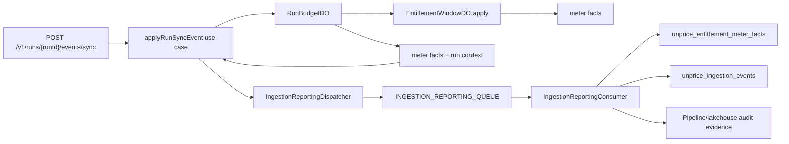

# Budget Run Analytics Attribution Implementation Plan

> **For agentic workers:** REQUIRED SUB-SKILL: Use superpowers:subagent-driven-development (recommended) or superpowers:executing-plans to implement this plan task-by-task. Steps use checkbox (`- [ ]`) syntax for tracking.

**Goal:** Wire budget-run sync usage into the existing reporting queue and Tinybird analytics path, while adding durable run attribution fields for trace grouping, parent-child run trees, and workload identity.

**Architecture:** Keep `RunBudgetDO` as the synchronous budget gate, but make it return run-enriched meter facts to the run use case. The run use case must enqueue an `IngestionReportingEnvelope` through the same reporting queue used by normal sync ingestion; the reporting consumer remains the only Tinybird writer. Do not send run sync events through the raw async ingestion queue or the raw R2 write-before-queue path.

**Tech Stack:** TypeScript, Hono, Zod, Drizzle Postgres, Cloudflare Durable Objects with SQLite, Cloudflare Queues, Tinybird, `@unprice/services/ingestion` reporting envelopes.

---

## Product Decisions

1. `source_id` keeps its current meaning: the submitter identity, usually the API key id.
2. `workload_id` is the caller-owned producer label. It replaces `agent_id`.
3. `workload_type` is optional low-cardinality classification: `"agent" | "workflow" | "job" | "tool" | "custom"`.
4. `trace_id` groups all runs in one business flow.
5. `parent_run_id` expresses run tree structure. `trace_id` alone cannot tell parent/child relationships.
6. Budget-run sync events do not use raw R2 archival. They do create normal reporting audit records with `payload_json = null` and `replayable = false` for processed/rejected outcomes.

## Target Shape



No edge should exist from the run sync route to the raw async ingestion queue or raw R2 storage.

## File Structure

### Run Identity

- `internal/db/src/schema/budget-runs.ts`  
  Owns Postgres persisted run fields: `workloadId`, `workloadType`, `traceId`, `parentRunId`.

- `internal/db/src/validators/budget-runs.ts`  
  Owns public API schemas and response contracts for budget runs.

- `internal/services/src/budget-runs/service.ts`  
  Persists and loads budget run identity fields.

- `apps/api/src/ingestion/run-budget/db/schema.ts`  
  Owns Durable Object SQLite hot run state fields.

- `apps/api/src/ingestion/run-budget/contracts.ts`  
  Owns Durable Object input/output contracts.

### Analytics Contracts

- `internal/analytics/src/validators.ts`  
  Owns Tinybird ingest row validation for meter facts and ingestion status events.

- `internal/analytics/datasources/unprice_entitlement_meter_facts.datasource`  
  Adds nullable run attribution columns for priced facts.

- `internal/analytics/datasources/unprice_ingestion_events.datasource`  
  Adds nullable run attribution columns for status/audit rows.

- `internal/analytics/fixtures/unprice_entitlement_meter_facts.ndjson`  
  Fixtures include null run attribution for existing rows and non-null attribution for at least one run row.

- `internal/analytics/fixtures/unprice_ingestion_events.ndjson`  
  Fixtures include null run attribution for existing rows and non-null attribution for at least one run row.

### Reporting Pipeline

- `internal/services/src/ingestion/message.ts`  
  Adds optional `runContext` to `IngestionQueueMessage`.

- `internal/services/src/ingestion/reporting.ts`  
  Adds optional run context fields to `IngestionReportingAuditRecord`.

- `internal/services/src/ingestion/reporting-envelope.ts`  
  Copies `message.runContext` into audit records and audit payload JSON.

- `apps/api/src/ingestion/reporting/consumer.ts`  
  Copies reporting audit run fields into Tinybird ingestion status rows.

### Run Apply Wire-Up

- `internal/services/src/use-cases/runs/run-budget-client.ts`  
  Adds `meterFacts` to the run budget apply decision.

- `internal/services/src/use-cases/runs/apply-run-sync-event.ts`  
  Awaits the reporting queue enqueue before returning the sync decision.

- `apps/api/src/routes/runs/applyRunSyncEventV1.ts`  
  Builds `requestId`, `receivedAt`, source, and reporting dispatcher dependencies.

- `apps/api/src/routes/runs/startRunV1.ts`  
  Accepts `workloadId`, `workloadType`, `traceId`, and `parentRunId`.

### Public Contracts And Docs

- `packages/api/src/openapi.d.ts`
- `packages/api/src/client.ts`
- `docs/budgeted-runs.md`

The SDK must expose `runs`, not `agents`.

---

### Task 1: Lock The Public Run Attribution Contract With Failing Tests

**Files:**
- Modify: `apps/api/src/routes/runs/runs.test.ts`
- Modify: `internal/db/src/validators/budget-runs.ts`

- [ ] **Step 1: Add a failing route contract test for workload and parent run fields**

Append this test in `apps/api/src/routes/runs/runs.test.ts` inside the existing budgeted runs describe block:

```ts
it("starts a run with workload, trace, and parent attribution", async () => {
  const response = await app.request("/v1/runs", {
    method: "POST",
    headers: {
      authorization: "Bearer unprice_dev_test",
      "content-type": "application/json",
    },
    body: JSON.stringify({
      budgetAmount: 500,
      currency: "USD",
      idempotencyKey: "run_attr_1",
      workloadType: "agent",
      workloadId: "research-assistant-v2",
      traceId: "trace_checkout_123",
      parentRunId: "brun_parent_123",
      metadata: {
        scenario: "checkout",
      },
    }),
  })

  expect(response.status).toBe(200)
  const body = await response.json()
  expect(body).toMatchObject({
    runId: expect.stringMatching(/^brun_/),
    workloadType: "agent",
    workloadId: "research-assistant-v2",
    traceId: "trace_checkout_123",
    parentRunId: "brun_parent_123",
  })
  expect(body).not.toHaveProperty("agentId")
})
```

- [ ] **Step 2: Add a failing validator contract test**

Create `internal/db/src/validators/budget-runs.test.ts`:

```ts
import { describe, expect, it } from "vitest"
import { runSummarySchema, startRunInputSchema } from "./budget-runs"

describe("budget run validators", () => {
  it("accepts workload, trace, and parent attribution on start", () => {
    const input = startRunInputSchema.parse({
      budgetAmount: 100,
      currency: "USD",
      idempotencyKey: "idem_run_attr",
      workloadType: "workflow",
      workloadId: "checkout-flow",
      traceId: "trace_123",
      parentRunId: "brun_parent_123",
    })

    expect(input).toMatchObject({
      workloadType: "workflow",
      workloadId: "checkout-flow",
      traceId: "trace_123",
      parentRunId: "brun_parent_123",
    })
  })

  it("does not expose agentId in the run summary contract", () => {
    const summary = runSummarySchema.parse({
      runId: "brun_123",
      status: "running",
      customerId: "cus_123",
      budgetAmount: 100,
      consumedAmount: 0,
      remainingAmount: 100,
      currency: "USD",
      workloadType: "agent",
      workloadId: "research-assistant",
      traceId: "trace_123",
      parentRunId: null,
    })

    expect(summary).not.toHaveProperty("agentId")
  })
})
```

- [ ] **Step 3: Run tests to verify they fail**

Run:

```bash
pnpm --filter api test src/routes/runs/runs.test.ts -t "workload, trace, and parent attribution"
pnpm --filter @unprice/db test src/validators/budget-runs.test.ts
```

Expected:

- The route test fails because `workloadType`, `workloadId`, and `parentRunId` are not in the response.
- The validator test fails because the schema still accepts `agentId` and does not expose the new fields.

- [ ] **Step 4: Commit the failing tests**

```bash
git add apps/api/src/routes/runs/runs.test.ts internal/db/src/validators/budget-runs.test.ts
git commit -m "test: lock budget run attribution contract"
```

---

### Task 2: Replace Agent Attribution With Workload Attribution In Run Storage

**Files:**
- Modify: `internal/db/src/schema/budget-runs.ts`
- Modify: `internal/db/src/validators/budget-runs.ts`
- Modify: `internal/services/src/budget-runs/service.ts`
- Modify: `internal/services/src/use-cases/runs/start-run.ts`
- Modify: `internal/services/src/use-cases/runs/apply-run-sync-event.ts`
- Modify: `internal/services/src/use-cases/runs/end-run.ts`
- Modify: `internal/services/src/use-cases/runs/get-run.ts`
- Modify: `apps/api/src/routes/runs/startRunV1.ts`
- Modify: `apps/api/src/ingestion/run-budget/contracts.ts`
- Modify: `apps/api/src/ingestion/run-budget/db/schema.ts`
- Modify: `apps/api/src/ingestion/run-budget/RunBudgetDO.ts`
- Modify: `apps/api/src/ingestion/run-budget/client.ts`
- Generated: `internal/db/src/migrations/*`
- Generated: `apps/api/src/ingestion/run-budget/drizzle/*`

- [ ] **Step 1: Update Postgres run schema fields**

In `internal/db/src/schema/budget-runs.ts`, replace `agentId` with `workloadType`, `workloadId`, and `parentRunId`.

```ts
export type BudgetRunStatus =
  | "running"
  | "completed"
  | "expired"
  | "canceled"
  | "budget_exceeded"
  | "failed"

export type BudgetRunWorkloadType = "agent" | "workflow" | "job" | "tool" | "custom"

export const budgetRuns = pgTableProject(
  "budget_runs",
  {
    ...projectID,
    customerId: cuid("customer_id").notNull(),
    status: text("status").$type<BudgetRunStatus>().notNull().default("running"),
    budgetAmount: bigint("budget_amount", { mode: "number" }).notNull(),
    consumedAmount: bigint("consumed_amount", { mode: "number" }).notNull().default(0),
    remainingAmount: bigint("remaining_amount", { mode: "number" }).notNull(),
    currency: text("currency").notNull(),
    walletReservationId: text("wallet_reservation_id"),
    idempotencyKey: text("idempotency_key").notNull(),
    workloadType: text("workload_type").$type<BudgetRunWorkloadType>(),
    workloadId: text("workload_id"),
    traceId: text("trace_id"),
    parentRunId: cuid("parent_run_id"),
    metadata: json("metadata").$type<Record<string, unknown>>().notNull().default({}),
    expiresAt: timestamp("expires_at", { withTimezone: true }),
    startedAt: timestamp("started_at", { withTimezone: true }).notNull().default(sql`now()`),
    endedAt: timestamp("ended_at", { withTimezone: true }),
    createdAt: timestamp("created_at", { withTimezone: true }).notNull().default(sql`now()`),
    updatedAt: timestamp("updated_at", { withTimezone: true }).notNull().default(sql`now()`),
  },
  (table) => ({
    primary: primaryKey({ columns: [table.id, table.projectId], name: "budget_runs_pkey" }),
    projectCustomerIdx: index("budget_runs_project_customer_idx").on(
      table.projectId,
      table.customerId
    ),
    projectStatusIdx: index("budget_runs_project_status_idx").on(table.projectId, table.status),
    projectTraceIdx: index("budget_runs_project_trace_idx").on(table.projectId, table.traceId),
    projectParentIdx: index("budget_runs_project_parent_idx").on(table.projectId, table.parentRunId),
    projectWorkloadIdx: index("budget_runs_project_workload_idx").on(
      table.projectId,
      table.workloadType,
      table.workloadId
    ),
    idempotencyIdx: uniqueIndex("budget_runs_project_customer_idempotency_idx").on(
      table.projectId,
      table.customerId,
      table.idempotencyKey
    ),
  })
)
```

- [ ] **Step 2: Update public validators**

In `internal/db/src/validators/budget-runs.ts`, use this schema shape:

```ts
export const workloadTypeSchema = z.enum(["agent", "workflow", "job", "tool", "custom"])

export const startRunInputSchema = z.object({
  customerId: z.string().min(1).optional(),
  budgetAmount: z.number().positive(),
  currency: z.string().min(3).max(12),
  idempotencyKey: z.string().min(1),
  workloadType: workloadTypeSchema.nullable().optional(),
  workloadId: z.string().min(1).nullable().optional(),
  traceId: z.string().min(1).nullable().optional(),
  parentRunId: z.string().min(1).nullable().optional(),
  metadata: z.record(z.string(), z.unknown()).optional(),
  expiresAt: z.number().int().positive().nullable().optional(),
})

export const runSummarySchema = z.object({
  runId: z.string(),
  status: runStatusSchema,
  customerId: z.string(),
  budgetAmount: z.number(),
  consumedAmount: z.number(),
  remainingAmount: z.number(),
  currency: z.string(),
  workloadType: workloadTypeSchema.nullable(),
  workloadId: z.string().nullable(),
  traceId: z.string().nullable(),
  parentRunId: z.string().nullable(),
})
```

- [ ] **Step 3: Update service create input**

In `internal/services/src/budget-runs/service.ts`, change `createRun` input fields and insert values:

```ts
async createRun(input: {
  projectId: string
  customerId: string
  budgetAmount: number
  remainingAmount: number
  currency: string
  idempotencyKey: string
  workloadType?: "agent" | "workflow" | "job" | "tool" | "custom" | null
  workloadId?: string | null
  traceId?: string | null
  parentRunId?: string | null
  metadata?: Record<string, unknown>
  expiresAt?: Date | null
}): Promise<Result<BudgetRunRow, BudgetRunServiceError>> {
  try {
    const id = newId("budget_run")
    const [row] = await this.deps.db
      .insert(budgetRuns)
      .values({
        id,
        projectId: input.projectId,
        customerId: input.customerId,
        status: "running",
        budgetAmount: input.budgetAmount,
        consumedAmount: 0,
        remainingAmount: input.remainingAmount,
        currency: input.currency,
        idempotencyKey: input.idempotencyKey,
        workloadType: input.workloadType ?? null,
        workloadId: input.workloadId ?? null,
        traceId: input.traceId ?? null,
        parentRunId: input.parentRunId ?? null,
        metadata: input.metadata ?? {},
        expiresAt: input.expiresAt ?? null,
      })
      .onConflictDoNothing({
        target: [budgetRuns.projectId, budgetRuns.customerId, budgetRuns.idempotencyKey],
      })
      .returning()

    if (!row) {
      return this.getRunByIdempotencyKey({
        projectId: input.projectId,
        customerId: input.customerId,
        idempotencyKey: input.idempotencyKey,
      })
    }

    return Ok(row)
  } catch (_error) {
    return Err(new BudgetRunServiceError({ message: "Failed to create budget run" }))
  }
}
```

- [ ] **Step 4: Update run use-case summaries**

In `internal/services/src/use-cases/runs/start-run.ts`, update `StartRunResolvedInput`:

```ts
export type StartRunResolvedInput = {
  projectId: string
  customerId: string
  budgetAmount: number
  currency: string
  idempotencyKey: string
  workloadType?: "agent" | "workflow" | "job" | "tool" | "custom" | null
  workloadId?: string | null
  traceId?: string | null
  parentRunId?: string | null
  metadata?: Record<string, unknown>
  expiresAt?: number | null
}
```

Pass those fields into `budgetRuns.createRun` and `runBudget.startRun`. Return this summary shape:

```ts
return Ok({
  runId: run.id,
  status: doResult.val.summary.status,
  customerId: run.customerId,
  budgetAmount: doResult.val.summary.budgetAmount,
  consumedAmount: doResult.val.summary.consumedAmount,
  remainingAmount: doResult.val.summary.remainingAmount,
  currency: run.currency,
  workloadType: run.workloadType,
  workloadId: run.workloadId,
  traceId: run.traceId,
  parentRunId: run.parentRunId,
})
```

Apply the same return shape in:

- `internal/services/src/use-cases/runs/apply-run-sync-event.ts`
- `internal/services/src/use-cases/runs/end-run.ts`
- `internal/services/src/use-cases/runs/get-run.ts`

- [ ] **Step 5: Update Durable Object contracts and SQLite schema**

In `apps/api/src/ingestion/run-budget/contracts.ts`, replace `agentId`:

```ts
const workloadTypeSchema = z.enum(["agent", "workflow", "job", "tool", "custom"])

export const startRunInputSchema = z.object({
  projectId: z.string().min(1),
  customerId: z.string().min(1),
  runId: z.string().min(1),
  budgetAmount: z.number().int().positive(),
  currency: z.string().min(3).max(12),
  idempotencyKey: z.string().min(1),
  workloadType: workloadTypeSchema.nullable().optional(),
  workloadId: z.string().min(1).nullable().optional(),
  traceId: z.string().min(1).nullable().optional(),
  parentRunId: z.string().min(1).nullable().optional(),
  metadata: z.record(z.unknown()).default({}),
  expiresAt: z.number().finite().nullable().optional(),
  now: z.number().finite(),
})
```

In `apps/api/src/ingestion/run-budget/db/schema.ts`, replace `agentId`:

```ts
workloadType: text("workload_type"),
workloadId: text("workload_id"),
traceId: text("trace_id"),
parentRunId: text("parent_run_id"),
```

- [ ] **Step 6: Update RunBudgetDO start state and wallet metadata**

In `apps/api/src/ingestion/run-budget/RunBudgetDO.ts`, update the insert:

```ts
await this.db.insert(schema.runState).values({
  runId: input.runId,
  projectId: input.projectId,
  customerId: input.customerId,
  workloadType: input.workloadType ?? null,
  workloadId: input.workloadId ?? null,
  parentRunId: input.parentRunId ?? null,
  reservationId: walletResult.reservationId,
  status: "running",
  currency: input.currency,
  budgetAmount: input.budgetAmount,
  reservedAmount: walletResult.allocationAmount,
  consumedAmount: 0,
  flushedAmount: 0,
  startedAt: input.now,
  expiresAt: input.expiresAt ?? null,
  traceId: input.traceId ?? null,
  metadataJson: JSON.stringify(input.metadata),
})
```

Update wallet reservation metadata:

```ts
metadata: {
  run_id: input.runId,
  trace_id: input.traceId ?? null,
  parent_run_id: input.parentRunId ?? null,
  workload_type: input.workloadType ?? null,
  workload_id: input.workloadId ?? null,
},
```

Update release metadata:

```ts
metadata: {
  run_id: run.runId,
  trace_id: run.traceId,
  parent_run_id: run.parentRunId,
  workload_type: run.workloadType,
  workload_id: run.workloadId,
},
```

- [ ] **Step 7: Regenerate migrations**

Run:

```bash
bin/migrate.dev
pnpm --filter api db:generate:ingestion:run-budget
pnpm --filter api db:check:ingestion:migrations
```

Expected:

- Postgres migration renames or recreates the current budget-run attribution columns.
- RunBudgetDO SQLite migration adds `workload_type`, `workload_id`, and `parent_run_id`.
- `pnpm --filter api db:check:ingestion:migrations` exits 0.

- [ ] **Step 8: Run tests**

Run:

```bash
pnpm --filter @unprice/db test src/validators/budget-runs.test.ts
pnpm --filter api test src/routes/runs/runs.test.ts -t "workload, trace, and parent attribution"
pnpm --filter api test src/ingestion/run-budget/RunBudgetDO.test.ts
```

Expected: all pass.

- [ ] **Step 9: Commit**

```bash
git add internal/db apps/api/src/ingestion/run-budget internal/services/src/budget-runs internal/services/src/use-cases/runs apps/api/src/routes/runs
git commit -m "refactor: replace agent attribution with workload run context"
```

---

### Task 3: Add Run Attribution Columns To Tinybird Analytics Contracts

**Files:**
- Modify: `internal/analytics/src/validators.ts`
- Modify: `internal/analytics/datasources/unprice_entitlement_meter_facts.datasource`
- Modify: `internal/analytics/datasources/unprice_ingestion_events.datasource`
- Modify: `internal/analytics/fixtures/unprice_entitlement_meter_facts.ndjson`
- Modify: `internal/analytics/fixtures/unprice_ingestion_events.ndjson`
- Modify: `internal/analytics/tests/*.yaml`

- [ ] **Step 1: Add shared analytics run fields**

In `internal/analytics/src/validators.ts`, add this near the other reusable schema helpers:

```ts
const analyticsRunContextShape = {
  run_id: z.string().nullable().optional(),
  trace_id: z.string().nullable().optional(),
  parent_run_id: z.string().nullable().optional(),
  workload_type: z.enum(["agent", "workflow", "job", "tool", "custom"]).nullable().optional(),
  workload_id: z.string().nullable().optional(),
}
```

Extend `entitlementMeterFactSchemaV1`:

```ts
export const entitlementMeterFactSchemaV1 = z.object({
  event_id: z.string(),
  idempotency_key: z.string(),
  workspace_id: z.string(),
  project_id: z.string(),
  customer_id: z.string(),
  environment: z.string(),
  api_key_id: z.string().nullable().optional(),
  source_type: z.enum(["api_key", "system", "unknown"]),
  source_id: z.string(),
  source_name: z.string().nullable().optional(),
  ...analyticsRunContextShape,
  customer_entitlement_id: z.string(),
  feature_slug: z.string(),
  period_key: z.string(),
  event_slug: z.string(),
  aggregation_method: z.string(),
  timestamp: z.number().describe("timestamp of the ingested event"),
  created_at: z.number().describe("timestamp of when the fact row was created"),
  delta: z.number(),
  value_after: z.number(),
  grant_id: z.string(),
  feature_plan_version_id: z.string().nullable().optional(),
  amount: z.number().int(),
  amount_after: z.number().int(),
  amount_scale: z.literal(LEDGER_SCALE),
  currency: z.string().length(3),
  priced_at: z.number().int(),
  tier_index: z.number().int().nullable(),
  tier_mode: z.union([z.enum(["volume", "graduated"]), z.null()]),
  pricing_component_count: z.number().int().nonnegative(),
})
```

Extend `ingestionEventSchemaV1` the same way after `source_name`:

```ts
source_name: z.string().nullable().optional(),
...analyticsRunContextShape,
event_slug: z.string(),
```

- [ ] **Step 2: Add Tinybird datasource columns**

In `internal/analytics/datasources/unprice_entitlement_meter_facts.datasource`, add after `source_name`:

```sql
    `run_id` Nullable(String) `json:$.run_id`,
    `trace_id` Nullable(String) `json:$.trace_id`,
    `parent_run_id` Nullable(String) `json:$.parent_run_id`,
    `workload_type` LowCardinality(Nullable(String)) `json:$.workload_type`,
    `workload_id` Nullable(String) `json:$.workload_id`,
```

In `internal/analytics/datasources/unprice_ingestion_events.datasource`, add after `source_name`:

```sql
    `run_id` Nullable(String) `json:$.run_id`,
    `trace_id` Nullable(String) `json:$.trace_id`,
    `parent_run_id` Nullable(String) `json:$.parent_run_id`,
    `workload_type` LowCardinality(Nullable(String)) `json:$.workload_type`,
    `workload_id` Nullable(String) `json:$.workload_id`,
```

Do not add these fields to the sorting key in this task. Current project/customer/time keys should stay stable.

- [ ] **Step 3: Add fixtures with null and non-null attribution**

For existing fixture rows in both fixture files, add:

```json
"run_id":null,"trace_id":null,"parent_run_id":null,"workload_type":null,"workload_id":null
```

Add one run meter fact row to `internal/analytics/fixtures/unprice_entitlement_meter_facts.ndjson`:

```json
{"event_id":"evt_run_001","idempotency_key":"idem_run_001:ew","workspace_id":"ws_1","project_id":"proj_1","customer_id":"cus_1","environment":"test","api_key_id":"key_1","source_type":"api_key","source_id":"key_1","source_name":"Production key","run_id":"brun_001","trace_id":"trace_checkout_001","parent_run_id":null,"workload_type":"agent","workload_id":"research-assistant","customer_entitlement_id":"ce_1","grant_id":"grnt_1","feature_plan_version_id":"fpv_1","feature_slug":"llm-tokens","period_key":"2026-06","event_slug":"llm-tokens","aggregation_method":"sum","timestamp":4070908801000,"created_at":4070908801100,"delta":1200,"value_after":1200,"amount":250000,"amount_after":250000,"amount_scale":8,"currency":"USD","priced_at":4070908801100,"tier_index":0,"tier_mode":"volume","pricing_component_count":1}
```

Add one run ingestion status row to `internal/analytics/fixtures/unprice_ingestion_events.ndjson`:

```json
{"event_id":"evt_run_001","canonical_audit_id":"audit_run_001","payload_hash":"hash_run_001","workspace_id":"ws_1","project_id":"proj_1","customer_id":"cus_1","environment":"test","api_key_id":"key_1","source_type":"api_key","source_id":"key_1","source_name":"Production key","run_id":"brun_001","trace_id":"trace_checkout_001","parent_run_id":null,"workload_type":"agent","workload_id":"research-assistant","event_slug":"llm-tokens","idempotency_key":"idem_run_001","state":"processed","rejection_reason":null,"failure_stage":null,"failure_reason":null,"failure_message":null,"replayable":false,"payload_json":null,"timestamp":4070908801000,"received_at":4070908801000,"handled_at":4070908801100,"created_at":4070908801200}
```

- [ ] **Step 4: Add Tinybird test expectations**

For existing Tinybird endpoint tests that assert full rows, add the five nullable fields. For ingestion status tests, add this row expectation where recent/live rows are asserted:

```json
{"event_id":"evt_run_001","canonical_audit_id":"audit_run_001","customer_id":"cus_1","event_slug":"llm-tokens","source_type":"api_key","source_id":"key_1","run_id":"brun_001","trace_id":"trace_checkout_001","parent_run_id":null,"workload_type":"agent","workload_id":"research-assistant","state":"processed","rejection_reason":null,"failure_stage":null,"failure_reason":null,"replayable":false,"timestamp":4070908801000,"received_at":4070908801000,"handled_at":4070908801100}
```

- [ ] **Step 5: Run analytics checks**

Run:

```bash
pnpm --filter @unprice/analytics typecheck
tb test run
```

Expected:

- TypeScript passes.
- Tinybird tests pass after fixtures and schemas align.

- [ ] **Step 6: Commit**

```bash
git add internal/analytics
git commit -m "feat: add run attribution to analytics rows"
```

---

### Task 4: Carry Run Context Through Reporting Envelopes

**Files:**
- Modify: `internal/services/src/ingestion/message.ts`
- Modify: `internal/services/src/ingestion/reporting.ts`
- Modify: `internal/services/src/ingestion/reporting-envelope.ts`
- Modify: `internal/services/src/ingestion/reporting-envelope.test.ts`
- Modify: `apps/api/src/ingestion/reporting/consumer.ts`
- Modify: `apps/api/src/ingestion/reporting/consumer.test.ts`

- [ ] **Step 1: Add optional run context to ingestion messages**

In `internal/services/src/ingestion/message.ts`, add:

```ts
export const ingestionRunContextSchema = z.object({
  runId: z.string().min(1),
  traceId: z.string().min(1).nullable().optional(),
  parentRunId: z.string().min(1).nullable().optional(),
  workloadType: z.enum(["agent", "workflow", "job", "tool", "custom"]).nullable().optional(),
  workloadId: z.string().min(1).nullable().optional(),
})
```

Extend `ingestionQueueMessageSchema`:

```ts
runContext: ingestionRunContextSchema.optional(),
```

- [ ] **Step 2: Add run fields to reporting audit record schema**

In `internal/services/src/ingestion/reporting.ts`, extend `ingestionReportingAuditRecordSchema`:

```ts
runId: z.string().nullable(),
traceId: z.string().nullable(),
parentRunId: z.string().nullable(),
workloadType: z.enum(["agent", "workflow", "job", "tool", "custom"]).nullable(),
workloadId: z.string().nullable(),
```

- [ ] **Step 3: Copy run context into reporting audit records**

In `internal/services/src/ingestion/reporting-envelope.ts`, update `buildIngestionReportingAuditRecord`:

```ts
const runContext = message.runContext ?? null

return {
  idempotencyKey: message.idempotencyKey,
  canonicalAuditId,
  payloadHash,
  workspaceId: message.workspaceId,
  projectId,
  customerId,
  environment: message.source.environment,
  apiKeyId: message.source.apiKeyId,
  sourceType: message.source.sourceType,
  sourceId: message.source.sourceId,
  sourceName: message.source.sourceName,
  runId: runContext?.runId ?? null,
  traceId: runContext?.traceId ?? null,
  parentRunId: runContext?.parentRunId ?? null,
  workloadType: runContext?.workloadType ?? null,
  workloadId: runContext?.workloadId ?? null,
  status: outcome.state,
  rejectionReason: outcome.state === "rejected" ? outcome.rejectionReason : undefined,
  failureStage: failed ? outcome.failureStage : null,
  failureReason: failed ? outcome.failureReason : null,
  failureMessage: failed ? (outcome.failureMessage ?? null) : null,
  replayable: failed ? outcome.replayable : false,
  payloadJson,
  auditPayloadJson: JSON.stringify(
    buildIngestionAuditPayload(message, outcome, canonicalAuditId, payloadHash, handledAt)
  ),
  firstSeenAt: message.receivedAt,
  handledAt,
}
```

Update `buildIngestionAuditPayload`:

```ts
const runContext = message.runContext ?? null

return {
  event_date: toEventDate(message.timestamp),
  schema_version: EVENTS_SCHEMA_VERSION,
  id: message.id,
  workspace_id: message.workspaceId,
  project_id: message.projectId,
  customer_id: message.customerId,
  environment: message.source.environment,
  api_key_id: message.source.apiKeyId,
  source_type: message.source.sourceType,
  source_id: message.source.sourceId,
  source_name: message.source.sourceName,
  run_id: runContext?.runId ?? null,
  trace_id: runContext?.traceId ?? null,
  parent_run_id: runContext?.parentRunId ?? null,
  workload_type: runContext?.workloadType ?? null,
  workload_id: runContext?.workloadId ?? null,
  request_id: message.requestId,
  idempotency_key: message.idempotencyKey,
  slug: message.slug,
  timestamp: message.timestamp,
  received_at: message.receivedAt,
  handled_at: handledAt,
  state: outcome.state,
  rejection_reason: outcome.state === "rejected" ? outcome.rejectionReason : undefined,
  properties: message.properties,
  canonical_audit_id: canonicalAuditId,
  payload_hash: payloadHash,
}
```

- [ ] **Step 4: Copy reporting audit fields into Tinybird ingestion events**

In `apps/api/src/ingestion/reporting/consumer.ts`, update `buildIngestionEvent`:

```ts
return {
  event_id: payload.id,
  canonical_audit_id: record.canonicalAuditId,
  payload_hash: record.payloadHash,
  workspace_id: record.workspaceId,
  project_id: record.projectId,
  customer_id: record.customerId,
  environment: record.environment,
  api_key_id: record.apiKeyId,
  source_type: record.sourceType,
  source_id: record.sourceId,
  source_name: record.sourceName,
  run_id: record.runId,
  trace_id: record.traceId,
  parent_run_id: record.parentRunId,
  workload_type: record.workloadType,
  workload_id: record.workloadId,
  event_slug: payload.slug,
  idempotency_key: record.idempotencyKey,
  state: record.status,
  rejection_reason: record.rejectionReason ?? null,
  failure_stage: record.failureStage ?? null,
  failure_reason: record.failureReason ?? null,
  failure_message: record.failureMessage ?? null,
  replayable: record.replayable ?? false,
  payload_json: record.payloadJson ?? null,
  timestamp: payload.timestamp,
  received_at: record.firstSeenAt,
  handled_at: record.handledAt,
  created_at: Date.now(),
}
```

- [ ] **Step 5: Add reporting envelope tests**

In `internal/services/src/ingestion/reporting-envelope.test.ts`, add:

```ts
it("copies run context into reporting audit records without making processed rows replayable", async () => {
  const message = buildMessage({
    runContext: {
      runId: "brun_001",
      traceId: "trace_001",
      parentRunId: "brun_parent_001",
      workloadType: "agent",
      workloadId: "research-assistant",
    },
  })

  const record = await buildIngestionReportingAuditRecord({
    customerId: "cus_1",
    message,
    now: () => 4070908801100,
    outcome: { state: "processed" },
    projectId: "proj_1",
  })

  expect(record).toMatchObject({
    runId: "brun_001",
    traceId: "trace_001",
    parentRunId: "brun_parent_001",
    workloadType: "agent",
    workloadId: "research-assistant",
    replayable: false,
    payloadJson: null,
  })
  expect(JSON.parse(record.auditPayloadJson)).toMatchObject({
    run_id: "brun_001",
    trace_id: "trace_001",
    parent_run_id: "brun_parent_001",
    workload_type: "agent",
    workload_id: "research-assistant",
  })
})
```

- [ ] **Step 6: Add reporting consumer tests**

In `apps/api/src/ingestion/reporting/consumer.test.ts`, add a test that creates an `auditRecord` with run fields and asserts `ingestIngestionEvents` receives snake-case run fields:

```ts
it("publishes run attribution to Tinybird ingestion status rows", async () => {
  const ingestIngestionEvents = vi.fn().mockResolvedValue({ successful_rows: 1, quarantined_rows: 0 })
  const ingestMeterFacts = vi.fn().mockResolvedValue({ successful_rows: 0, quarantined_rows: 0 })
  const consumer = new IngestionReportingConsumer({
    ingestIngestionEvents,
    ingestMeterFacts,
    publishAuditRecords: vi.fn().mockResolvedValue(undefined),
    logger: testLogger,
  })

  await consumer.consumeBatch({
    messages: [
      {
        body: buildEnvelope({
          auditRecords: [
            buildAuditRecord({
              runId: "brun_001",
              traceId: "trace_001",
              parentRunId: "brun_parent_001",
              workloadType: "agent",
              workloadId: "research-assistant",
            }),
          ],
          meterFacts: [],
        }),
        ack: vi.fn(),
        retry: vi.fn(),
      },
    ],
  })

  expect(ingestIngestionEvents).toHaveBeenCalledWith([
    expect.objectContaining({
      run_id: "brun_001",
      trace_id: "trace_001",
      parent_run_id: "brun_parent_001",
      workload_type: "agent",
      workload_id: "research-assistant",
      payload_json: null,
      replayable: false,
    }),
  ])
})
```

- [ ] **Step 7: Run reporting tests**

Run:

```bash
pnpm --filter @unprice/services test src/ingestion/reporting-envelope.test.ts
pnpm --filter api test src/ingestion/reporting/consumer.test.ts
```

Expected: all pass.

- [ ] **Step 8: Commit**

```bash
git add internal/services/src/ingestion apps/api/src/ingestion/reporting
git commit -m "feat: propagate run context through reporting envelopes"
```

---

### Task 5: Return Run-Enriched Meter Facts From RunBudgetDO

**Files:**
- Modify: `apps/api/src/ingestion/run-budget/contracts.ts`
- Modify: `apps/api/src/ingestion/run-budget/RunBudgetDO.ts`
- Modify: `apps/api/src/ingestion/run-budget/client.ts`
- Modify: `internal/services/src/use-cases/runs/run-budget-client.ts`
- Modify: `apps/api/src/ingestion/run-budget/RunBudgetDO.test.ts`

- [ ] **Step 1: Extend run budget decision contracts**

In `apps/api/src/ingestion/run-budget/contracts.ts`, import the analytics schema:

```ts
import { entitlementMeterFactSchemaV1 } from "@unprice/analytics"
```

Extend `runBudgetDecisionSchema`:

```ts
export const runBudgetDecisionSchema = z.object({
  allowed: z.boolean(),
  state: z.enum(["processed", "rejected"]),
  rejectionReason: z
    .enum(["LIMIT_EXCEEDED", "WALLET_EMPTY", "LATE_EVENT_CLOSED_PERIOD", "RUN_BUDGET_EXCEEDED"])
    .optional(),
  message: z.string().optional(),
  budget: runBudgetSummarySchema,
  meterFacts: z.array(entitlementMeterFactSchemaV1).default([]),
})
```

In `internal/services/src/use-cases/runs/run-budget-client.ts`, import the type and extend `RunSyncDecision`:

```ts
import type { AnalyticsEntitlementMeterFact } from "@unprice/analytics"

export type RunSyncDecision = {
  allowed: boolean
  state: "processed" | "rejected"
  rejectionReason?:
    | "LIMIT_EXCEEDED"
    | "WALLET_EMPTY"
    | "LATE_EVENT_CLOSED_PERIOD"
    | "RUN_BUDGET_EXCEEDED"
  message?: string
  budget: RunBudgetSummary
  meterFacts: AnalyticsEntitlementMeterFact[]
}
```

- [ ] **Step 2: Add helper to decorate meter facts**

In `apps/api/src/ingestion/run-budget/RunBudgetDO.ts`, add:

```ts
private withRunContext(
  run: RunStateRow,
  meterFacts: Array<Record<string, unknown>>
): Array<Record<string, unknown>> {
  return meterFacts.map((fact) => ({
    ...fact,
    run_id: run.runId,
    trace_id: run.traceId ?? null,
    parent_run_id: run.parentRunId ?? null,
    workload_type: run.workloadType ?? null,
    workload_id: run.workloadId ?? null,
  }))
}
```

- [ ] **Step 3: Return decorated facts on accepted apply**

In `RunBudgetDO.applySyncEvent`, replace the accepted path with:

```ts
const rawMeterFacts = entitlementResult.meterFacts ?? []
const meterFacts = this.withRunContext(run, rawMeterFacts)
const pricedAmount = this.sumPricedAmount(meterFacts)
const bucketDeltas = this.deriveBucketDeltas(input.runId, meterFacts)

const updatedRun = await this.commitSpend(run, pricedAmount, bucketDeltas, input.now)

const decision: RunBudgetDecision = {
  allowed: true,
  state: "processed",
  budget: this.toSummary(updatedRun),
  meterFacts,
}
```

For rejected decisions, include `meterFacts: []`:

```ts
const decision: RunBudgetDecision = {
  allowed: false,
  state: "rejected",
  rejectionReason: entitlementResult.deniedReason as RunBudgetDecision["rejectionReason"],
  message: entitlementResult.message,
  budget: this.toSummary(run),
  meterFacts: [],
}
```

Also include `meterFacts: []` for non-running run rejection.

- [ ] **Step 4: Parse returned decision in the Cloudflare client**

In `apps/api/src/ingestion/run-budget/client.ts`, keep the returned facts:

```ts
return Ok({
  allowed: decision.allowed,
  state: decision.state,
  rejectionReason: decision.rejectionReason,
  message: decision.message,
  budget: decision.budget,
  meterFacts: decision.meterFacts ?? [],
})
```

- [ ] **Step 5: Add RunBudgetDO test**

In `apps/api/src/ingestion/run-budget/RunBudgetDO.test.ts`, add:

```ts
it("returns meter facts decorated with run analytics context", async () => {
  const durableObject = createRunBudgetDO()

  await durableObject.startRun({
    projectId: "proj_1",
    customerId: "cus_1",
    runId: "brun_001",
    budgetAmount: 1000,
    currency: "USD",
    idempotencyKey: "start_001",
    workloadType: "agent",
    workloadId: "research-assistant",
    traceId: "trace_001",
    parentRunId: "brun_parent_001",
    metadata: {},
    now: 4070908800000,
  })

  mockEntitlementApply.mockResolvedValue({
    allowed: true,
    meterFacts: [
      buildMeterFact({
        event_id: "evt_001",
        idempotency_key: "apply_001:ew",
        amount: 250,
        amount_after: 250,
      }),
    ],
  })

  const result = await durableObject.applySyncEvent({
    projectId: "proj_1",
    customerId: "cus_1",
    runId: "brun_001",
    featureSlug: "llm-tokens",
    idempotencyKey: "apply_001",
    event: {
      id: "evt_001",
      slug: "llm-tokens",
      timestamp: 4070908800100,
      properties: { tokens: 1200 },
    },
    source: {
      workspaceId: "ws_1",
      environment: "test",
      apiKeyId: "key_1",
      sourceType: "api_key",
      sourceId: "key_1",
      sourceName: "Production key",
    },
    now: 4070908800200,
  })

  expect(result.meterFacts).toEqual([
    expect.objectContaining({
      run_id: "brun_001",
      trace_id: "trace_001",
      parent_run_id: "brun_parent_001",
      workload_type: "agent",
      workload_id: "research-assistant",
    }),
  ])
})
```

- [ ] **Step 6: Run RunBudgetDO tests**

Run:

```bash
pnpm --filter api test src/ingestion/run-budget/RunBudgetDO.test.ts -t "meter facts decorated with run analytics context"
pnpm --filter api test src/ingestion/run-budget/contracts.test.ts
```

Expected: all pass.

- [ ] **Step 7: Commit**

```bash
git add apps/api/src/ingestion/run-budget internal/services/src/use-cases/runs/run-budget-client.ts
git commit -m "feat: return run-attributed meter facts from run budget"
```

---

### Task 6: Enqueue Run Sync Outcomes Through The Existing Reporting Queue

**Files:**
- Modify: `internal/services/src/use-cases/runs/apply-run-sync-event.ts`
- Modify: `internal/services/src/use-cases/runs/apply-run-sync-event.test.ts`
- Modify: `apps/api/src/routes/runs/applyRunSyncEventV1.ts`
- Modify: `apps/api/src/routes/runs/runs.test.ts`

- [ ] **Step 1: Extend use-case dependencies and input**

In `internal/services/src/use-cases/runs/apply-run-sync-event.ts`, import:

```ts
import type {
  IngestionOutcome,
  IngestionQueueMessage,
  IngestionReportingOutcomeDispatcher,
} from "../../ingestion"
```

Update deps:

```ts
export type ApplyRunSyncEventDeps = {
  services: Pick<{ budgetRuns: BudgetRunService }, "budgetRuns">
  runBudget: RunBudgetClient
  reportingDispatcher: IngestionReportingOutcomeDispatcher
}
```

Update input:

```ts
export type ApplyRunSyncEventInput = {
  projectId: string
  runId: string
  keyCustomerId: string | null
  featureSlug: string
  idempotencyKey: string
  requestId: string
  receivedAt: number
  event: {
    id: string
    slug: string
    timestamp: number
    properties: Record<string, unknown>
  }
  source: {
    workspaceId: string
    environment: string
    apiKeyId: string | null
    sourceType: "api_key" | "system" | "unknown"
    sourceId: string
    sourceName: string | null
  }
  now: number
}
```

- [ ] **Step 2: Build reporting message and outcome**

After `doResult` succeeds and before returning `Ok`, add:

```ts
const reportingMessage: IngestionQueueMessage = {
  version: 1,
  workspaceId: input.source.workspaceId,
  projectId: run.projectId,
  customerId: run.customerId,
  requestId: input.requestId,
  receivedAt: input.receivedAt,
  idempotencyKey: input.idempotencyKey,
  id: input.event.id,
  slug: input.event.slug,
  timestamp: input.event.timestamp,
  properties: input.event.properties,
  source: input.source,
  runContext: {
    runId: run.id,
    traceId: run.traceId,
    parentRunId: run.parentRunId,
    workloadType: run.workloadType,
    workloadId: run.workloadId,
  },
}

const reportingOutcome: IngestionOutcome = decision.allowed
  ? { state: "processed" }
  : {
      state: "rejected",
      rejectionReason: decision.rejectionReason ?? "RUN_BUDGET_EXCEEDED",
    }

await deps.reportingDispatcher.enqueueOutcomes({
  customerId: run.customerId,
  projectId: run.projectId,
  outcomes: [
    {
      message: reportingMessage,
      outcome: reportingOutcome,
      meterFacts: decision.meterFacts,
    },
  ],
})
```

This await is intentional. Sync ingestion must not return success before the reporting enqueue is durable.

- [ ] **Step 3: Add use-case test for reporting enqueue**

Create `internal/services/src/use-cases/runs/apply-run-sync-event.test.ts`:

```ts
import { describe, expect, it, vi } from "vitest"
import { Ok } from "@unprice/error"
import { applyRunSyncEvent } from "./apply-run-sync-event"

describe("applyRunSyncEvent", () => {
  it("enqueues processed run usage through ingestion reporting with run context", async () => {
    const enqueueOutcomes = vi.fn().mockResolvedValue(undefined)
    const budgetRuns = {
      getRun: vi.fn().mockResolvedValue(
        Ok({
          id: "brun_001",
          projectId: "proj_1",
          customerId: "cus_1",
          currency: "USD",
          workloadType: "agent",
          workloadId: "research-assistant",
          traceId: "trace_001",
          parentRunId: "brun_parent_001",
        })
      ),
      updateRunSummary: vi.fn().mockResolvedValue(Ok({ id: "brun_001" })),
    }
    const runBudget = {
      applySyncEvent: vi.fn().mockResolvedValue(
        Ok({
          allowed: true,
          state: "processed",
          budget: {
            runId: "brun_001",
            status: "running",
            budgetAmount: 1000,
            consumedAmount: 250,
            remainingAmount: 750,
          },
          meterFacts: [
            {
              event_id: "evt_001",
              idempotency_key: "idem_001:ew",
              workspace_id: "ws_1",
              project_id: "proj_1",
              customer_id: "cus_1",
              environment: "test",
              api_key_id: "key_1",
              source_type: "api_key",
              source_id: "key_1",
              source_name: null,
              run_id: "brun_001",
              trace_id: "trace_001",
              parent_run_id: "brun_parent_001",
              workload_type: "agent",
              workload_id: "research-assistant",
              customer_entitlement_id: "ce_1",
              grant_id: "grnt_1",
              feature_plan_version_id: "fpv_1",
              feature_slug: "llm-tokens",
              period_key: "2026-06",
              event_slug: "llm-tokens",
              aggregation_method: "sum",
              timestamp: 4070908800100,
              created_at: 4070908800200,
              delta: 1200,
              value_after: 1200,
              amount: 250,
              amount_after: 250,
              amount_scale: 8,
              currency: "USD",
              priced_at: 4070908800200,
              tier_index: 0,
              tier_mode: "volume",
              pricing_component_count: 1,
            },
          ],
        })
      ),
    }

    await applyRunSyncEvent(
      {
        services: { budgetRuns },
        runBudget,
        reportingDispatcher: { enqueueOutcomes },
      },
      {
        projectId: "proj_1",
        runId: "brun_001",
        keyCustomerId: "cus_1",
        featureSlug: "llm-tokens",
        idempotencyKey: "idem_001",
        requestId: "req_001",
        receivedAt: 4070908800000,
        event: {
          id: "evt_001",
          slug: "llm-tokens",
          timestamp: 4070908800100,
          properties: { tokens: 1200 },
        },
        source: {
          workspaceId: "ws_1",
          environment: "test",
          apiKeyId: "key_1",
          sourceType: "api_key",
          sourceId: "key_1",
          sourceName: null,
        },
        now: 4070908800200,
      }
    )

    expect(enqueueOutcomes).toHaveBeenCalledWith({
      customerId: "cus_1",
      projectId: "proj_1",
      outcomes: [
        expect.objectContaining({
          outcome: { state: "processed" },
          message: expect.objectContaining({
            runContext: {
              runId: "brun_001",
              traceId: "trace_001",
              parentRunId: "brun_parent_001",
              workloadType: "agent",
              workloadId: "research-assistant",
            },
          }),
          meterFacts: expect.arrayContaining([
            expect.objectContaining({
              run_id: "brun_001",
              workload_id: "research-assistant",
            }),
          ]),
        }),
      ],
    })
  })
})
```

- [ ] **Step 4: Build reporting dispatcher in the Hono route**

In `apps/api/src/routes/runs/applyRunSyncEventV1.ts`, add imports:

```ts
import { IngestionReportingDispatcher } from "@unprice/services/ingestion"
import { CloudflareReportingQueueClient } from "~/ingestion/reporting/client"
```

Inside the route:

```ts
const requestId = c.get("requestId")
const receivedAt = c.get("requestStartedAt")
const logger = c.get("logger")
const reportingDispatcher = new IngestionReportingDispatcher({
  logger,
  now: () => Date.now(),
  reportingClient: new CloudflareReportingQueueClient(c.env),
})
```

Pass it to the use case:

```ts
const result = await applyRunSyncEvent(
  { services: { budgetRuns }, runBudget, reportingDispatcher },
  {
    projectId: key.projectId,
    runId,
    keyCustomerId: key.defaultCustomerId ?? null,
    featureSlug: body.featureSlug,
    idempotencyKey: body.idempotencyKey,
    requestId,
    receivedAt,
    event: {
      id: body.id ?? `evt_${Date.now()}`,
      slug: body.eventSlug ?? body.featureSlug,
      timestamp: body.timestamp ?? Date.now(),
      properties: body.properties ?? {},
    },
    source: {
      workspaceId: key.project.workspaceId,
      environment: c.env.APP_ENV,
      apiKeyId: key.id,
      sourceType: "api_key",
      sourceId: key.id,
      sourceName: null,
    },
    now: Date.now(),
  }
)
```

- [ ] **Step 5: Add route test proving reporting queue is used**

In `apps/api/src/routes/runs/runs.test.ts`, add:

```ts
it("enqueues run sync outcomes to the reporting queue and does not use raw async ingestion", async () => {
  const reportingSend = vi.fn().mockResolvedValue(undefined)
  testEnv.INGESTION_REPORTING_QUEUE = { send: reportingSend }
  testEnv.INGESTION_QUEUE = { send: vi.fn() }

  const response = await app.request("/v1/runs/brun_001/events/sync", {
    method: "POST",
    headers: {
      authorization: "Bearer unprice_dev_test",
      "content-type": "application/json",
    },
    body: JSON.stringify({
      featureSlug: "llm-tokens",
      idempotencyKey: "idem_run_sync_001",
      id: "evt_run_sync_001",
      eventSlug: "llm-tokens",
      timestamp: 4070908800100,
      properties: { tokens: 1200 },
    }),
  })

  expect(response.status).toBe(200)
  expect(reportingSend).toHaveBeenCalledWith(
    expect.objectContaining({
      auditRecords: [
        expect.objectContaining({
          runId: "brun_001",
          payloadJson: null,
          replayable: false,
        }),
      ],
      meterFacts: expect.arrayContaining([
        expect.objectContaining({
          run_id: "brun_001",
        }),
      ]),
    })
  )
  expect(testEnv.INGESTION_QUEUE.send).not.toHaveBeenCalled()
})
```

- [ ] **Step 6: Run tests**

Run:

```bash
pnpm --filter @unprice/services test src/use-cases/runs/apply-run-sync-event.test.ts
pnpm --filter api test src/routes/runs/runs.test.ts -t "reporting queue"
```

Expected: all pass.

- [ ] **Step 7: Commit**

```bash
git add internal/services/src/use-cases/runs apps/api/src/routes/runs
git commit -m "feat: report budget run sync outcomes asynchronously"
```

---

### Task 7: Keep Raw R2 Out Of Budget-Run Sync Events

**Files:**
- Modify: `docs/budgeted-runs.md`
- Modify: `apps/api/src/routes/runs/runs.test.ts`
- Inspect: `apps/api/src/routes/events/ingestEventsV1.ts`
- Inspect: `apps/api/src/routes/events/ingestEventsSyncV1.ts`

- [ ] **Step 1: Document the R2 boundary**

Add this section to `docs/budgeted-runs.md`:

```md
## Reporting And Replay

Budget-run sync events use the ingestion reporting queue for analytics. The route waits until the reporting envelope is accepted by `INGESTION_REPORTING_QUEUE`, then the reporting consumer writes status rows and meter facts to Tinybird.

Budget-run sync events do not write the raw request payload to the raw async ingestion R2 path. R2 raw payload archival belongs to `/v1/events/ingest`, where accepted events are queued for asynchronous processing and may need replay from raw storage. Run sync events are already synchronously applied behind a run idempotency key; processed and rejected outcomes are not replayable and therefore use `payload_json = null`.

If a run sync request fails before a final processed/rejected decision is returned, the client should retry with the same run id and idempotency key. `RunBudgetDO` and `EntitlementWindowDO` replay their idempotent result.
```

- [ ] **Step 2: Add a static guard test**

In `apps/api/src/routes/runs/runs.test.ts`, add:

```ts
it("keeps run sync routes out of raw R2 archival code", async () => {
  const routeSource = await import("node:fs/promises").then((fs) =>
    fs.readFile(new URL("./applyRunSyncEventV1.ts", import.meta.url), "utf8")
  )

  expect(routeSource).not.toContain("rawStorage")
  expect(routeSource).not.toContain("RAW_EVENTS")
  expect(routeSource).not.toContain("R2")
  expect(routeSource).not.toContain("INGESTION_QUEUE")
  expect(routeSource).toContain("INGESTION_REPORTING_QUEUE")
})
```

- [ ] **Step 3: Run route tests**

Run:

```bash
pnpm --filter api test src/routes/runs/runs.test.ts -t "raw R2 archival"
```

Expected: pass.

- [ ] **Step 4: Commit**

```bash
git add docs/budgeted-runs.md apps/api/src/routes/runs/runs.test.ts
git commit -m "docs: define budget run reporting boundary"
```

---

### Task 8: Regenerate Public SDK And Remove Stale Agent Contract

**Files:**
- Modify: `packages/api/src/openapi.d.ts`
- Modify: `packages/api/src/client.ts`
- Modify: `packages/api/src/client.test.ts`

- [ ] **Step 1: Regenerate OpenAPI types**

Run:

```bash
pnpm --filter @unprice/api generate
```

Expected:

- `/v1/runs` paths exist.
- `/v1/agents` paths are absent.
- Run request types include `workloadType`, `workloadId`, `traceId`, and `parentRunId`.
- Run response types do not include `agentId`.

- [ ] **Step 2: Add SDK runs resource**

In `packages/api/src/client.ts`, add a `runs` resource:

```ts
public get runs() {
  return {
    start: async (
      req: PostBody<"/v1/runs">
    ): Promise<ApiResult<PostResponse<"/v1/runs">>> => {
      return this.handleResponse(
        this.openapi.POST("/v1/runs", {
          body: req,
        })
      )
    },

    applySyncEvent: async (
      runId: string,
      req: PostBody<"/v1/runs/{runId}/events/sync">
    ): Promise<ApiResult<PostResponse<"/v1/runs/{runId}/events/sync">>> => {
      return this.handleResponse(
        this.openapi.POST("/v1/runs/{runId}/events/sync", {
          params: { path: { runId } },
          body: req,
        })
      )
    },

    end: async (
      runId: string,
      req: PostBody<"/v1/runs/{runId}/end">
    ): Promise<ApiResult<PostResponse<"/v1/runs/{runId}/end">>> => {
      return this.handleResponse(
        this.openapi.POST("/v1/runs/{runId}/end", {
          params: { path: { runId } },
          body: req,
        })
      )
    },

    get: async (runId: string): Promise<ApiResult<GetResponse<"/v1/runs/{runId}">>> => {
      return this.handleResponse(
        this.openapi.GET("/v1/runs/{runId}", {
          params: { path: { runId } },
        })
      )
    },
  }
}
```

- [ ] **Step 3: Add SDK type test**

In `packages/api/src/client.test.ts`, add:

```ts
it("exposes run SDK methods with workload attribution and no agent namespace", () => {
  const client = new Unprice({ token: "unprice_dev_test" })

  expect(typeof client.runs.start).toBe("function")
  expect(typeof client.runs.applySyncEvent).toBe("function")
  expect(typeof client.runs.end).toBe("function")
  expect(typeof client.runs.get).toBe("function")
  expect("agents" in client).toBe(false)

  expectTypeOf(client.runs.start).parameter(0).toMatchTypeOf<{
    budgetAmount: number
    currency: string
    idempotencyKey: string
    workloadType?: "agent" | "workflow" | "job" | "tool" | "custom" | null
    workloadId?: string | null
    traceId?: string | null
    parentRunId?: string | null
  }>()
})
```

- [ ] **Step 4: Build package**

Run:

```bash
pnpm --filter @unprice/api build
```

Expected: pass.

- [ ] **Step 5: Commit**

```bash
git add packages/api
git commit -m "feat: expose budget runs in public sdk"
```

---

### Task 9: End-To-End Verification

**Files:**
- Inspect: `internal/analytics/src/validators.ts`
- Inspect: `internal/services/src/ingestion/reporting-envelope.ts`
- Inspect: `apps/api/src/ingestion/run-budget/RunBudgetDO.ts`
- Inspect: `apps/api/src/routes/runs/applyRunSyncEventV1.ts`
- Inspect: `packages/api/src/openapi.d.ts`

- [ ] **Step 1: Search for stale agent attribution in run code**

Run:

```bash
rg -n "agentId|agent_id|/v1/agents|agents\\.runs|unprice_agent_runs|agent_runs" apps internal packages docs/budgeted-runs.md
```

Expected remaining matches:

- Historical docs under `docs/superpowers/plans/**` or `docs/plans/**`.
- No matches in `apps/api/src/routes/runs`.
- No matches in `internal/db/src/schema/budget-runs.ts`.
- No matches in `packages/api/src/openapi.d.ts`.

- [ ] **Step 2: Search for raw async queue usage in run route**

Run:

```bash
rg -n "INGESTION_QUEUE|rawStorage|RAW_EVENTS|R2" apps/api/src/routes/runs internal/services/src/use-cases/runs apps/api/src/ingestion/run-budget
```

Expected:

- No matches.

- [ ] **Step 3: Search for reporting queue usage in run route**

Run:

```bash
rg -n "IngestionReportingDispatcher|CloudflareReportingQueueClient|INGESTION_REPORTING_QUEUE|enqueueOutcomes" apps/api/src/routes/runs internal/services/src/use-cases/runs
```

Expected:

- `applyRunSyncEventV1.ts` constructs `IngestionReportingDispatcher`.
- `apply-run-sync-event.ts` awaits `enqueueOutcomes`.

- [ ] **Step 4: Run focused verification**

Run:

```bash
pnpm --filter @unprice/db test src/validators/budget-runs.test.ts
pnpm --filter @unprice/services test src/ingestion/reporting-envelope.test.ts
pnpm --filter @unprice/services test src/use-cases/runs/apply-run-sync-event.test.ts
pnpm --filter api test src/ingestion/reporting/consumer.test.ts
pnpm --filter api test src/ingestion/run-budget/RunBudgetDO.test.ts
pnpm --filter api test src/routes/runs/runs.test.ts
pnpm --filter @unprice/analytics typecheck
pnpm --filter @unprice/api build
```

Expected: all pass.

- [ ] **Step 5: Run broad validation**

Run:

```bash
pnpm validate
```

Expected: pass.

- [ ] **Step 6: Commit final cleanup**

```bash
git add .
git commit -m "chore: verify budget run analytics attribution"
```

---

## Self-Review

### Spec Coverage

- Analytics wire-up: Task 6 routes run sync outcomes through `IngestionReportingDispatcher`, and Task 3/4 update Tinybird schemas and reporting records.
- Same async fact ingestion to Tinybird: Task 6 uses `INGESTION_REPORTING_QUEUE`; Task 4/consumer keep the reporting consumer as the Tinybird writer.
- Parent grouping: Task 2 adds `parentRunId` in Postgres, DO SQLite, route contracts, and summaries.
- Trace grouping: Task 2 preserves `traceId`, Task 3/4 carry it to analytics.
- Agent naming concern: Task 2 replaces `agentId` with `workloadId` and `workloadType`.
- R2 question: Task 7 documents and tests that run sync events do not use the raw R2 archival path.

### Placeholder Scan

The plan contains no forbidden placeholder markers or unspecified implementation steps. Commands and expected outcomes are included for each task.

### Type Consistency

The plan uses these names consistently:

- Public camelCase: `runId`, `traceId`, `parentRunId`, `workloadType`, `workloadId`.
- Analytics snake_case: `run_id`, `trace_id`, `parent_run_id`, `workload_type`, `workload_id`.
- Submitter identity remains `sourceId` / `source_id`.
