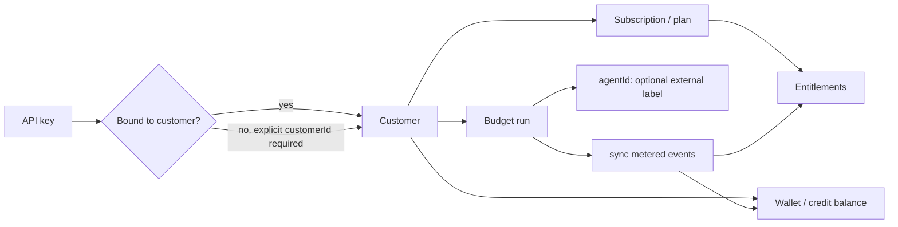
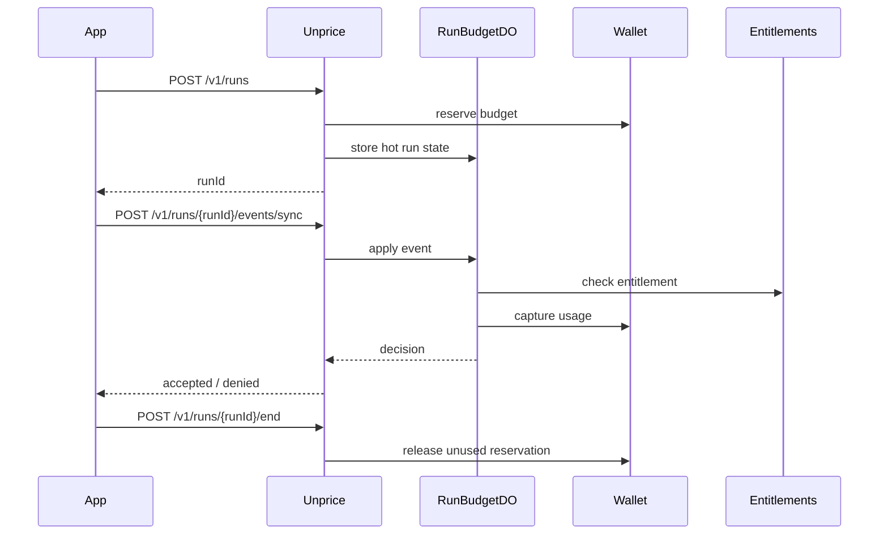

# Run-First Budgeted Metering Plan

> Status: ready for implementation  
> Date: 2026-06-19  
> Scope: delete agent-platform surface area; keep metering, entitlements, reservations, and budgeted runs  
> Owner: Codex handoff plan

## Objective

Replace the current `agents` product model with a smaller run-first metering API:

- A customer owns entitlements, wallet balance, API-key scope, and spend limits.
- A run is a temporary budget reservation against that customer.
- `agentId` is optional attribution supplied by the caller, not a first-class Unprice resource.
- API keys may be bound to one default customer. A bound key can spend only for that customer.
- Unprice remains the metering, billing, entitlement, and budget layer. It does not become an agent hosting or agent registry platform.

The delete target is everything that implies Unprice owns agent templates, agent lifecycle, or agent entitlement plans.

## Non-Goals

- Do not build an agent marketplace, registry, template store, model config store, tool store, orchestration framework, memory service, deployment service, or tracing product.
- Do not make plans attach to agents. Plans attach to customers/subscriptions; runs spend against customer entitlements.
- Do not require customers to create agents before they can meter usage.
- Do not support async/background run ingestion in this pass. Keep v1 synchronous.
- Do not preserve backwards compatibility for the current experimental `/v1/agents` API unless a release note explicitly says it is public.

## Current Problems To Delete

The current implementation has a split-brain model:

- `agents` are templates stored in Postgres.
- `agent_runs` exist in Postgres, but `startAgentRun` does not create an `agent_runs` row.
- `RunBudgetDO` keeps the hot run state and wallet reservation.
- `apply/end/get` paths query Postgres for a run before calling `RunBudgetDO`, so a run started through the current API can be unfindable later.
- `CloudflareRunBudgetClient.startRun` appears to key the Durable Object with `input.runId ?? "unknown"` and sends `runId: input.agentId`, so the object identity and the public run identity are wrong.
- API keys already support `defaultCustomerId`, but default customer behavior is a fallback, not a hard scope.
- The public surface says "agent", but the valuable primitive is "budgeted run metering".

The fix is to make "run" the canonical resource and make "agent" a caller-owned label.

## Target Mental Model



First principle:

> The customer is the economic actor. The run is a temporary spending envelope. The agent is metadata.

## Target API

### Start a budgeted run

`POST /v1/runs`

Request:

```ts
const startRunInputSchema = z.object({
  customerId: z.string().min(1).optional(),
  budgetAmount: z.number().positive(),
  currency: z.string().min(3).max(12),
  idempotencyKey: z.string().min(1),
  agentId: z.string().min(1).nullable().optional(),
  traceId: z.string().min(1).nullable().optional(),
  metadata: z.record(z.string(), z.unknown()).optional(),
  expiresAt: z.number().int().positive().nullable().optional(),
});
```

Customer resolution:

- If API key has `defaultCustomerId`, use that customer.
- If request includes the same `customerId`, accept it.
- If request includes a different `customerId`, reject with `403`.
- If API key has no `defaultCustomerId`, require request `customerId`.

Response:

```ts
const runSummarySchema = z.object({
  runId: z.string(),
  status: z.enum(["running", "completed", "expired", "canceled", "budget_exceeded", "failed"]),
  customerId: z.string(),
  budgetAmount: z.number(),
  consumedAmount: z.number(),
  remainingAmount: z.number(),
  currency: z.string(),
  agentId: z.string().nullable(),
});
```

### Apply a sync metered event

`POST /v1/runs/{runId}/events/sync`

Request:

```ts
const applyRunSyncEventInputSchema = z.object({
  featureSlug: z.string().min(1),
  idempotencyKey: z.string().min(1),
  id: z.string().min(1).optional(),
  eventSlug: z.string().min(1).optional(),
  timestamp: z.number().int().positive().optional(),
  properties: z.record(z.string(), z.unknown()).optional(),
});
```

The request does not include `customerId` or `agentId`. The run owns those values.

Response:

```ts
const runSyncDecisionSchema = z.object({
  accepted: z.boolean(),
  reason: z.enum([
    "accepted",
    "duplicate",
    "insufficient_budget",
    "expired",
    "not_running",
    "entitlement_denied",
  ]),
  run: runSummarySchema,
});
```

### End a run

`POST /v1/runs/{runId}/end`

Request:

```ts
const endRunInputSchema = z.object({
  status: z.enum(["completed", "canceled", "failed"]).default("completed"),
});
```

Response: `runSummarySchema`.

### Get a run

`GET /v1/runs/{runId}`

Response: `runSummarySchema`.

## Data Model

Delete the `agents` table and replace `agent_runs` with one canonical table:

```ts
export const budgetRuns = pgTable(
  "budget_runs",
  {
    id: cuid("id").primaryKey(),
    projectId: cuid("project_id")
      .notNull()
      .references(() => projects.id, { onDelete: "cascade" }),
    customerId: cuid("customer_id")
      .notNull()
      .references(() => customers.id, { onDelete: "cascade" }),
    status: text("status").notNull().default("running"),
    budgetAmount: real("budget_amount").notNull(),
    consumedAmount: real("consumed_amount").notNull().default(0),
    remainingAmount: real("remaining_amount").notNull(),
    currency: text("currency").notNull(),
    walletReservationId: text("wallet_reservation_id"),
    idempotencyKey: text("idempotency_key").notNull(),
    agentId: text("agent_id"),
    traceId: text("trace_id"),
    metadata: jsonb("metadata").$type<Record<string, unknown>>().default({}).notNull(),
    expiresAt: timestamp("expires_at", { withTimezone: true }),
    startedAt: timestamp("started_at", { withTimezone: true }).defaultNow().notNull(),
    endedAt: timestamp("ended_at", { withTimezone: true }),
    createdAt: timestamp("created_at", { withTimezone: true }).defaultNow().notNull(),
    updatedAt: timestamp("updated_at", { withTimezone: true }).defaultNow().notNull(),
  },
  (table) => ({
    projectCustomerIdx: index("budget_runs_project_customer_idx").on(
      table.projectId,
      table.customerId,
    ),
    projectStatusIdx: index("budget_runs_project_status_idx").on(table.projectId, table.status),
    idempotencyIdx: uniqueIndex("budget_runs_project_customer_idempotency_idx").on(
      table.projectId,
      table.customerId,
      table.idempotencyKey,
    ),
  }),
);
```

Use `bin/migrate.dev` to generate the migration. Do not hand-write SQL migrations.

Decision: use a new public id prefix `brun` for budget runs.

```ts
budget_run: "brun",
```

Remove `agent` and `agent_run` prefixes after no code references remain.

## Implementation Plan

### Step 1: Add failing contract tests for the new run-first surface

Create route contract tests before implementation.

Files:

- `apps/api/src/routes/runs/runs.test.ts`

Test cases:

```ts
describe("budgeted runs API", () => {
  it("starts a run for the API key default customer without agent creation", async () => {
    // Given an API key with defaultCustomerId
    // When POST /v1/runs is called without customerId and with optional agentId
    // Then response is 200, runId starts with brun_, customerId is the key default, status is running
  });

  it("rejects a mismatched customerId for a customer-bound API key", async () => {
    // Given an API key bound to customer A
    // When POST /v1/runs includes customer B
    // Then response is 403
  });

  it("requires customerId for an unbound API key", async () => {
    // Given an API key without defaultCustomerId
    // When POST /v1/runs omits customerId
    // Then response is 400
  });

  it("applies sync usage without customerId or agentId in the request body", async () => {
    // Given a running budget run
    // When POST /v1/runs/:runId/events/sync is called
    // Then the route resolves customer/project from the stored run and returns a decision
  });

  it("does not allow a bound customer key to access another customer's run", async () => {
    // Given a run for customer A and a key bound to customer B
    // When GET /v1/runs/:runId is called
    // Then response is 404 or 403 according to existing API error conventions
  });

  it("ends a run and releases the unused reservation", async () => {
    // Given a running budget run with unused budget
    // When POST /v1/runs/:runId/end is called
    // Then status is completed and remaining budget is not captured
  });
});
```

Use the existing `agents.test.ts` fixtures as source material, but do not keep agent creation setup.

Expected result:

```bash
pnpm --filter api test -- runs.test.ts
```

fails because `/v1/runs` does not exist.

Commit after this step:

```bash
git add apps/api/src/routes/runs/runs.test.ts
git commit -m "test: define run-first budgeted metering api"
```

### Step 2: Introduce strict customer resolution for API keys

Add one shared helper for routes that accept optional `customerId`.

File:

- `apps/api/src/auth/key.ts`

Add:

```ts
export type CustomerResolutionResult =
  | { success: true; customerId: string }
  | {
      success: false;
      code: "customer_required" | "customer_forbidden";
      message: string;
    };

export function resolveCustomerIdForApiKey(input: {
  explicitCustomerId?: string | null;
  defaultCustomerId?: string | null;
}): CustomerResolutionResult {
  const explicitCustomerId = input.explicitCustomerId ?? null;
  const defaultCustomerId = input.defaultCustomerId ?? null;

  if (defaultCustomerId !== null) {
    if (explicitCustomerId !== null && explicitCustomerId !== defaultCustomerId) {
      return {
        success: false,
        code: "customer_forbidden",
        message: "This API key is bound to a different customer",
      };
    }

    return { success: true, customerId: defaultCustomerId };
  }

  if (explicitCustomerId === null) {
    return {
      success: false,
      code: "customer_required",
      message: "customerId is required when the API key has no default customer binding",
    };
  }

  return { success: true, customerId: explicitCustomerId };
}
```

Update these routes to use it:

- `apps/api/src/routes/events/ingestEventsV1.ts`
- `apps/api/src/routes/events/ingestEventsSyncV1.ts`
- New run routes added later in this plan

Expected behavior change:

- Existing event ingestion still works for default-customer keys.
- A caller cannot override a customer-bound key by passing another `customerId`.

Add or update tests:

- Existing event ingestion route tests should cover the `403` mismatch case.
- New run route tests from Step 1 cover the same rule for `/v1/runs`.

Expected result:

```bash
pnpm --filter api test -- ingestEvents
```

passes after route updates.

Commit after this step:

```bash
git add apps/api/src/auth/key.ts apps/api/src/routes/events
git commit -m "fix: enforce customer-bound api key scope"
```

### Step 3: Replace agent schemas with budget run schemas

Delete:

- `internal/db/src/schema/agents.ts`
- `internal/db/src/validators/agents.ts`

Create:

- `internal/db/src/schema/budget-runs.ts`
- `internal/db/src/validators/budget-runs.ts`

Update exports:

- `internal/db/src/schema.ts`
- `internal/db/src/validators.ts`
- `internal/db/src/utils/id.ts`

Validator file should export:

```ts
export const runStatusSchema = z.enum([
  "running",
  "completed",
  "expired",
  "canceled",
  "budget_exceeded",
  "failed",
]);

export const startRunInputSchema = z.object({
  customerId: z.string().min(1).optional(),
  budgetAmount: z.number().positive(),
  currency: z.string().min(3).max(12),
  idempotencyKey: z.string().min(1),
  agentId: z.string().min(1).nullable().optional(),
  traceId: z.string().min(1).nullable().optional(),
  metadata: z.record(z.string(), z.unknown()).optional(),
  expiresAt: z.number().int().positive().nullable().optional(),
});

export const applyRunSyncEventInputSchema = z.object({
  featureSlug: z.string().min(1),
  idempotencyKey: z.string().min(1),
  id: z.string().min(1).optional(),
  eventSlug: z.string().min(1).optional(),
  timestamp: z.number().int().positive().optional(),
  properties: z.record(z.string(), z.unknown()).optional(),
});

export const endRunInputSchema = z.object({
  status: z.enum(["completed", "canceled", "failed"]).default("completed"),
});

export const budgetRunSelectSchema = createSelectSchema(budgetRuns);
export const budgetRunInsertSchema = createInsertSchema(budgetRuns);
```

Generate migration:

```bash
bin/migrate.dev
```

Migration intent:

- Drop `agent_runs`.
- Drop `agents`.
- Create `budget_runs`.

If existing development data must be preserved, make the migration data-copying:

```sql
insert into budget_runs (...)
select ... from agent_runs;
```

For a clean experimental feature, prefer deletion over compatibility.

Expected result:

```bash
pnpm --filter @unprice/db typecheck
```

passes.

Commit after this step:

```bash
git add internal/db
git commit -m "refactor: replace agent tables with budget runs"
```

### Step 4: Replace the agent service with a budget run service

Delete:

- `internal/services/src/agents/service.ts`
- `internal/services/src/agents/index.ts`

Create:

- `internal/services/src/budget-runs/service.ts`
- `internal/services/src/budget-runs/index.ts`

Service shape:

```ts
export class BudgetRunService {
  constructor(private readonly deps: BudgetRunServiceDeps) {}

  async createRun(input: CreateBudgetRunInput): Promise<Result<BudgetRun, BudgetRunServiceError>> {
    // Insert by projectId, customerId, idempotencyKey.
    // If unique conflict finds an existing row for the same idempotency key, return it.
  }

  async getRun(input: {
    projectId: string;
    runId: string;
  }): Promise<Result<BudgetRun, BudgetRunServiceError>> {
    // Query budget_runs by id and projectId.
  }

  async updateRunReservation(input: {
    projectId: string;
    runId: string;
    walletReservationId: string;
  }): Promise<Result<BudgetRun, BudgetRunServiceError>> {
    // Persist reservation id after RunBudgetDO creates it.
  }

  async updateRunSummary(input: {
    projectId: string;
    runId: string;
    status: BudgetRunStatus;
    consumedAmount: number;
    remainingAmount: number;
    endedAt?: Date | null;
  }): Promise<Result<BudgetRun, BudgetRunServiceError>> {
    // Persist hot-state summary after DO operations.
  }
}
```

Use existing repo patterns:

- Return `Result`.
- Use `wrapResult` for thrown DB calls if that matches nearby service style.
- Keep direct DB access in the service.
- Do not create a repository layer.

Update service context:

- `internal/services/src/context.ts`
- `apps/api/src/hono/env.ts`
- `apps/api/src/middleware/init.ts`

Replace `agents: AgentService` with `budgetRuns: BudgetRunService`.

Update package exports:

- `internal/services/src/index.ts`

Expected result:

```bash
pnpm --filter @unprice/services typecheck
```

fails until use cases are migrated in the next step.

Commit after this step only if the repo compiles at package boundary. If not, combine with Step 5 in one commit.

### Step 5: Replace agent use cases with run use cases

Delete:

- `internal/services/src/use-cases/agents/start-run.ts`
- `internal/services/src/use-cases/agents/apply-run-sync-event.ts`
- `internal/services/src/use-cases/agents/end-run.ts`
- `internal/services/src/use-cases/agents/run-budget-client.ts`
- `internal/services/src/use-cases/agents/index.ts`

Create:

- `internal/services/src/use-cases/runs/start-run.ts`
- `internal/services/src/use-cases/runs/apply-run-sync-event.ts`
- `internal/services/src/use-cases/runs/end-run.ts`
- `internal/services/src/use-cases/runs/get-run.ts`
- `internal/services/src/use-cases/runs/run-budget-client.ts`
- `internal/services/src/use-cases/runs/index.ts`

Update:

- `internal/services/src/use-cases/index.ts`

Key behavior:

1. `startRun` generates the run id before calling the Durable Object.
2. `startRun` creates or fetches the Postgres `budget_runs` row by idempotency key.
3. `startRun` passes the canonical run id into `RunBudgetDO`.
4. `startRun` persists the wallet reservation id returned by the DO.
5. `applyRunSyncEvent`, `endRun`, and `getRun` load the run from Postgres by `projectId` and `runId`.
6. All run operations enforce customer scope before touching the DO.

Use-case dependency shape:

```ts
export type StartRunDeps = {
  services: Pick<ServiceContext, "budgetRuns">;
  runBudget: RunBudgetClient;
  logger?: Logger;
};
```

Run access guard:

```ts
function canAccessRun(input: {
  keyCustomerId: string | null;
  runCustomerId: string;
}): boolean {
  return input.keyCustomerId === null || input.keyCustomerId === input.runCustomerId;
}
```

Start input after route customer resolution:

```ts
export const startRunResolvedInputSchema = startRunInputSchema.extend({
  projectId: z.string().min(1),
  customerId: z.string().min(1),
});
```

`RunBudgetClient` should no longer use agent-named types:

```ts
export type RunBudgetStartResult = {
  summary: RunBudgetSummary;
  walletReservationId: string;
};

export interface RunBudgetClient {
  startRun(input: StartRunBudgetInput): Promise<Result<RunBudgetStartResult, RunBudgetError>>;
  applySyncEvent(input: ApplyRunSyncEventBudgetInput): Promise<Result<RunSyncDecision, RunBudgetError>>;
  endRun(input: EndRunBudgetInput): Promise<Result<RunBudgetSummary, RunBudgetError>>;
  getRunStatus(input: GetRunBudgetStatusInput): Promise<Result<RunBudgetSummary, RunBudgetError>>;
}
```

Expected tests:

- `start-run.test.ts`: starts without agent lookup; preserves external `agentId` as metadata.
- `start-run.test.ts`: idempotent start returns same `runId`.
- `apply-run-sync-event.test.ts`: rejects access when key customer does not match run customer.
- `end-run.test.ts`: updates stored summary after DO end.

Expected result:

```bash
pnpm --filter @unprice/services test -- runs
pnpm --filter @unprice/services typecheck
```

passes.

Commit:

```bash
git add internal/services
git commit -m "refactor: make budget runs the canonical metering use case"
```

### Step 6: Fix and rename RunBudgetDO contracts

Update:

- `apps/api/src/ingestion/run-budget/contracts.ts`
- `apps/api/src/ingestion/run-budget/client.ts`
- `apps/api/src/ingestion/run-budget/RunBudgetDO.ts`

Contract changes:

- Remove required `agentId` from DO identity.
- Keep optional `agentId` as stored metadata.
- Require `runId` on start.
- Return `walletReservationId` from `startRun`.

The start schema should become:

```ts
export const startRunBudgetInputSchema = z.object({
  projectId: z.string().min(1),
  customerId: z.string().min(1),
  runId: z.string().min(1),
  budgetAmount: z.number().positive(),
  currency: z.string().min(3).max(12),
  idempotencyKey: z.string().min(1),
  agentId: z.string().min(1).nullable().optional(),
  traceId: z.string().min(1).nullable().optional(),
  metadata: z.record(z.string(), z.unknown()).optional(),
  expiresAt: z.number().int().positive().nullable().optional(),
  now: z.number().int().positive(),
});
```

Fix `CloudflareRunBudgetClient.startRun`:

```ts
async startRun(input: StartRunBudgetInput) {
  return this.stub(input).startRun({
    ...input,
    now: Date.now(),
    waitUntil: this.waitUntil,
  });
}
```

The `stub` method should use `runId`, never `"unknown"`:

```ts
private stub(input: { projectId: string; customerId: string; runId: string }) {
  const id = this.namespace.idFromName(`${input.projectId}:${input.customerId}:${input.runId}`);
  return this.namespace.get(id);
}
```

If `runId` is unavailable, that is a programming error. Do not silently fall back to `"unknown"`.

Expected result:

```bash
pnpm --filter api test -- run-budget
pnpm --filter api type-check
```

passes.

Commit:

```bash
git add apps/api/src/ingestion/run-budget
git commit -m "fix: key run budget objects by canonical run id"
```

### Step 7: Replace `/v1/agents` routes with `/v1/runs` routes

Delete:

- `apps/api/src/routes/agents/createAgentV1.ts`
- `apps/api/src/routes/agents/listAgentsV1.ts`
- `apps/api/src/routes/agents/startAgentRunV1.ts`
- `apps/api/src/routes/agents/applyAgentRunSyncEventV1.ts`
- `apps/api/src/routes/agents/endAgentRunV1.ts`
- `apps/api/src/routes/agents/getAgentRunV1.ts`
- `apps/api/src/routes/agents/agents.test.ts`

Create:

- `apps/api/src/routes/runs/startRunV1.ts`
- `apps/api/src/routes/runs/applyRunSyncEventV1.ts`
- `apps/api/src/routes/runs/endRunV1.ts`
- `apps/api/src/routes/runs/getRunV1.ts`
- `apps/api/src/routes/runs/runs.test.ts`

Update:

- `apps/api/src/index.ts`

Remove:

```ts
registerCreateAgentV1(app);
registerListAgentsV1(app);
registerStartAgentRunV1(app);
registerApplyAgentRunSyncEventV1(app);
registerEndAgentRunV1(app);
registerGetAgentRunV1(app);
```

Add:

```ts
registerStartRunV1(app);
registerApplyRunSyncEventV1(app);
registerEndRunV1(app);
registerGetRunV1(app);
```

Route ownership:

- Routes parse HTTP input.
- Routes authenticate API keys.
- Routes resolve customer scope.
- Routes call run use cases.
- Routes map expected failures to `UnpriceApiError`.
- Routes do not query Drizzle directly.

Start route outline:

```ts
export function registerStartRunV1(app: App) {
  app.openapi(
    createRoute({
      method: "post",
      path: "/v1/runs",
      tags: ["runs"],
      request: {
        body: {
          content: {
            "application/json": {
              schema: resolver(startRunInputSchema),
            },
          },
        },
      },
      responses: {
        200: jsonContent(runSummarySchema, "Budget run"),
      },
    }),
    async (c) => {
      const key = await keyAuth(c);
      const body = c.req.valid("json");
      const customer = resolveCustomerIdForApiKey({
        explicitCustomerId: body.customerId,
        defaultCustomerId: key.defaultCustomerId,
      });

      if (!customer.success) {
        throw new UnpriceApiError({
          code: customer.code === "customer_forbidden" ? "FORBIDDEN" : "BAD_REQUEST",
          message: customer.message,
        });
      }

      const result = await startRun({
        input: {
          ...body,
          projectId: key.projectId,
          customerId: customer.customerId,
        },
        services: c.get("services"),
        runBudget: c.get("runBudget"),
        logger: c.get("logger"),
      });

      if (!result.success) {
        throw toUnpriceApiError(result.error);
      }

      return c.json(result.data);
    },
  );
}
```

Expected result:

```bash
pnpm --filter api test -- runs.test.ts
pnpm --filter api type-check
```

passes.

Commit:

```bash
git add apps/api/src/index.ts apps/api/src/routes/runs
git rm apps/api/src/routes/agents
git commit -m "refactor: expose budget runs instead of agents"
```

### Step 8: Remove agent references from public package surfaces

Search:

```bash
rg -n "agent|Agent|agents|agent_runs|agentRuns|agt_|arun_" .
```

Expected remaining matches:

- Documentation explaining the deleted concept.
- Optional request field `agentId`.
- Tests proving `agentId` is attribution only.

Update public SDK if OpenAPI/client generation includes the old routes.

Files to inspect:

- `packages/api/src/client.ts`
- `packages/api/src/resources`
- `packages/api/src/generated`
- `packages/react`
- `apps/nextjs`

Target developer experience:

```ts
const run = await unprice.runs.start({
  customerId: "cus_...",
  budgetAmount: 10,
  currency: "USD",
  idempotencyKey: requestId,
  agentId: "support-agent-v3",
});

const decision = await unprice.runs.applySyncEvent(run.runId, {
  featureSlug: "llm-tokens",
  idempotencyKey: eventId,
  properties: {
    inputTokens: 1200,
    outputTokens: 350,
  },
});

await unprice.runs.end(run.runId);
```

Do not add an `agents` SDK namespace.

Expected result:

```bash
pnpm --filter @unprice/api generate
pnpm --filter @unprice/api build
```

passes if the SDK is generated from OpenAPI.

Commit:

```bash
git add packages/api packages/react apps/nextjs
git commit -m "chore: remove agent sdk surface"
```

### Step 9: Update docs and examples

Create or update the minimal public docs:

- API key customer binding
- Budgeted run lifecycle
- Entitlement denial behavior
- Wallet reservation behavior
- `agentId` as attribution only

Suggested docs:

- `docs/budgeted-runs.md`
- Any existing API docs generated from OpenAPI

Use this wording:

> Unprice does not own your agents. Use `agentId` to label usage from your own system. Entitlements, budgets, invoices, and wallet reservations are evaluated at the customer level.

Include one sequence diagram:



Expected result:

```bash
pnpm validate
```

passes.

Commit:

```bash
git add docs
git commit -m "docs: describe budgeted run metering"
```

### Step 10: Final deletion audit

Run:

```bash
rg -n "createAgent|listAgents|startAgentRun|AgentService|agents:" apps internal packages
rg -n "agent_runs|agentRuns|agents" internal/db apps/api internal/services
rg -n "runId: input.agentId|unknown" apps/api/src/ingestion/run-budget
```

Expected:

- No `createAgent`, `listAgents`, `startAgentRun`, or `AgentService` references.
- No `agents` route registration.
- No `agent_runs` schema/table references.
- No `runId: input.agentId`.
- No `RunBudgetDO` object id fallback to `"unknown"`.

Allowed:

- `agentId` optional string in run schemas.
- Docs explaining `agentId` attribution.
- Tests for optional `agentId`.

Run full validation:

```bash
pnpm validate
```

If full validation is too broad for local iteration, run the minimum gate before opening a PR:

```bash
pnpm --filter @unprice/db typecheck
pnpm --filter @unprice/services test
pnpm --filter @unprice/services typecheck
pnpm --filter api test
pnpm --filter api type-check
pnpm --filter @unprice/api build
```

Commit:

```bash
git add .
git commit -m "chore: audit agent deletion"
```

## Ruthless Deletion Checklist

Delete:

- `POST /v1/agents`
- `GET /v1/agents`
- `POST /v1/agents/{agentId}/runs`
- `POST /v1/agents/{agentId}/runs/{runId}/events/sync`
- `POST /v1/agents/{agentId}/runs/{runId}/end`
- `GET /v1/agents/{agentId}/runs/{runId}`
- `agents` table
- `agent_runs` table
- `AgentService`
- `CreateAgent` use case if one exists
- Agent OpenAPI tags and SDK namespaces
- Agent dashboard UI if present
- Agent docs that imply Unprice stores templates

Keep:

- `RunBudgetDO`
- Wallet reservation flow
- Entitlement checks
- Metered event ingestion
- API key `defaultCustomerId`
- Optional `agentId` attribution on budget runs
- Customer-level plans and subscriptions

## Product Decision Log

### Decision: runs are first-class, agents are not

Reason:

- The market already has agent frameworks, deployment products, tracing products, and model gateways.
- Unprice's differentiated layer is economic control: meter, entitle, reserve, enforce, bill.
- Making agents first-class creates customer confusion: users will ask whether Unprice owns prompts, tools, models, memory, auth, deployment, and observability.

Tradeoff:

- Losing an "agent dashboard" may feel less trendy.
- The API becomes easier to adopt because customers can bring any agent framework.

### Decision: API-key customer binding is a hard scope

Reason:

- A default customer fallback is convenient but unsafe.
- If a key is issued for one customer, callers should not be able to spend for another customer by passing a body field.

Tradeoff:

- Some server-side integrations with one project-level key must pass explicit `customerId`.
- This is acceptable because unbound keys remain available for trusted server-side use.

### Decision: `agentId` is a string label

Reason:

- Developers already have agent ids in their own systems.
- Requiring Unprice agent creation adds state, lifecycle, and naming friction without improving billing correctness.

Tradeoff:

- Unprice cannot validate whether `agentId` exists.
- That is correct because Unprice should not own agent identity.

### Decision: one synchronous run event API for v1

Reason:

- Budget enforcement needs immediate accept/deny feedback.
- Async ingestion is useful for analytics, but it is not sufficient for real-time spend control.

Tradeoff:

- Higher request latency than fire-and-forget ingestion.
- Correct for budget gates.

## Developer Experience Bar

The final API should pass this test:

> A developer can protect an agent run with a customer budget without creating any Unprice-side agent resource.

Minimal integration:

```ts
const run = await unprice.runs.start({
  budgetAmount: 5,
  currency: "USD",
  idempotencyKey: requestId,
  agentId: "research-assistant",
});

for await (const usage of modelUsageStream) {
  const decision = await unprice.runs.applySyncEvent(run.runId, {
    featureSlug: "llm-output-tokens",
    idempotencyKey: usage.id,
    properties: usage,
  });

  if (!decision.accepted) {
    break;
  }
}

await unprice.runs.end(run.runId);
```

With a customer-bound API key, `customerId` is not needed in the request. With a project-level server key, it is required.

## Execution Order

Recommended order:

1. Tests for desired API.
2. Customer-bound key enforcement.
3. DB schema and validators.
4. Service context replacement.
5. Use case replacement.
6. `RunBudgetDO` contract fix.
7. API route replacement.
8. SDK/docs cleanup.
9. Deletion audit.
10. Full validation.

The most important invariant is:

> no request path should require an Unprice agent record to meter, reserve, entitle, or bill usage.

