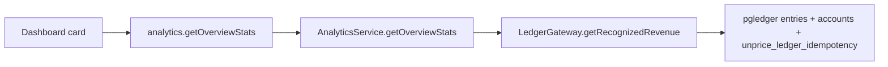

# Project Dashboard Revenue Design

## Goal

Show real project revenue on the main dashboard by reading recognized, invoice-visible revenue from the ledger instead of estimating revenue from subscription plan prices.

## Decision

`Total Revenue` means recognized/billed revenue for the selected dashboard interval. It is the sum of positive ledger entries that credit `customer.*.consumed` for the current project, default currency, and interval.

This deliberately does not mean cash collected. Cash collection can include prepaid wallet top-ups before usage is consumed, and it can therefore overstate revenue.

## Data Flow

## Filters

- `unprice_ledger_idempotency.project_id` equals the current project.
- Ledger entry is a positive credit leg.
- Ledger account name matches `customer.%.consumed`.
- Account currency equals the project default currency.
- Ledger metadata has `kind`.
- `invoice_visible` is either absent or `true`.
- `event_at` or `created_at` falls within the selected interval.

## Tradeoffs

- This reports earned/billed value, not raw payment inflow.
- Prepaid wallet top-ups do not count until consumed, which avoids overstating dashboard revenue.
- Granted credits can count when they become invoice-visible consumed value, because the card answers recognized project value rather than cash-only collections.

## Verification

Add a focused ledger gateway unit test for the aggregate SQL contract, then run the services test for `internal/services/src/ledger/gateway.test.ts`.
