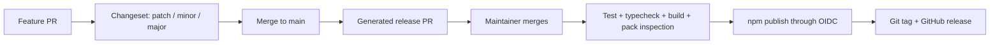

# API Package Release Pipeline Design

Date: 2026-07-28

Status: approved

## Goal

Publish `@unprice/api` to the public npm registry through a reviewable Changesets release flow,
using npm Trusted Publishing with GitHub OIDC and no long-lived npm write token.

Merging the generated release PR is the release decision. After that merge, targeted API checks
run and the package publishes immediately without another manual approval.

Delete `packages/react` from the repository and retire `@unprice/react` on npm without breaking
existing installations.

## First Principles

The release system separates three decisions:

- The feature author declares consumer impact while the change is still understood.
- The maintainer chooses release timing by merging the generated release PR.
- GitHub Actions holds publishing authority through a short-lived OIDC identity.

The repository keeps source control as the release-intent ledger and npm as the published-artifact
ledger. A version is never inferred from vague commit text and never published from a developer
machine as the normal path.

## Selected Approach

Use the existing Changesets installation and add one GitHub Actions release workflow.

Each consumer-visible API change includes a changeset for `@unprice/api`. Changesets aggregates
those files into a generated release PR that:

- increments `packages/api/package.json`;
- updates `packages/api/CHANGELOG.md`;
- consumes the pending changeset files;
- updates the pnpm lockfile through the repository's version script.

The workflow runs on pushes to `main`:

- If changesets are present, `changesets/action` creates or updates the release PR.
- When the release PR is merged, the version changes are on `main` with no remaining changesets.
- The action invokes the release command, which validates and publishes the unpublished API
  version.

No scheduled, tag-triggered, or `workflow_dispatch` release path is added. There is no GitHub
environment approval gate in the initial design.

## Version Policy

`@unprice/api` remains pre-1.0 while its public contract is still evolving:

- `patch`: backwards-compatible bug fixes and packaging corrections;
- `minor`: new public functionality or an intentionally breaking public API change;
- `major`: the deliberate stability milestone that publishes `1.0.0`.

Breaking pre-1.0 changes must say `BREAKING` in the changeset summary and provide migration
guidance. After `1.0.0`, normal Semantic Versioning applies: breaking changes require a major bump.

Repository-only work does not require a changeset when it cannot affect the published artifact or
its consumers. The release documentation should give contributors this rule instead of requiring
empty changesets for every PR.

## Release Workflow

Add `.github/workflows/release.yml` with these properties:

- Trigger only on pushes to `main`.
- Use a single concurrency group with cancellation disabled so publishes cannot overlap.
- Reuse the repository's pinned Node 24 and pnpm 10.28 installation path.
- Give the job only the permissions needed to update the release PR, create release metadata, and
  request an npm OIDC token:
  - `contents: write`;
  - `pull-requests: write`;
  - `id-token: write`.
- Pass the repository `GITHUB_TOKEN` to `changesets/action`.
- Use the root version script so Changesets version updates also refresh the lockfile.
- Use the root release script for targeted verification and publication.
- Create the package Git tag and GitHub release after a successful npm publish.

The release job must not receive `NPM_TOKEN`, `NODE_AUTH_TOKEN`, or another npm write credential.
The npm CLI must be at least the version required by npm Trusted Publishing; the workflow should
print and validate its version before publishing rather than silently falling back to token
authentication.

## npm Trusted Publishing

Configure `@unprice/api` on npm with a GitHub Actions trusted publisher matching:

- GitHub owner: `jhonsfran1165`;
- repository: `unprice`;
- workflow filename: `release.yml`;
- allowed action: `npm publish`.

Do not configure an npm environment name because this design has no GitHub environment approval
gate. The workflow identity and npm configuration must match exactly.

Add canonical repository metadata to `packages/api/package.json`, including the repository URL and
the `packages/api` directory. Keep `publishConfig.access` set to `public`. Trusted Publishing
provides package provenance automatically.

The npm trusted-publisher configuration is an npm-owner setup step. It must be completed after
`release.yml` exists on the default branch and before the generated release PR is merged.

## Targeted API Release Command

Replace the whole-repository release build with a package-owned release sequence:

1. Assert that `@unprice/api` is the only non-private package visible to Changesets.
2. Run the `@unprice/api` tests.
3. Run the `@unprice/api` typecheck.
4. Build `@unprice/api`.
5. Run an npm pack dry run and inspect the publish file list.
6. Run `changeset publish`.

The package dry run must show the intended package metadata plus `dist`, README, and LICENSE, with
no source credentials, workspace files, or unrelated artifacts.

`apps/api/package.json` currently omits `"private": true` even though it is a deployed application,
not an npm package. Add that field. Add a release guard that reads the workspaces visible to
Changesets and fails unless every workspace except `@unprice/api` is private. This makes accidental
publication fail closed when a future app or package is added without the correct metadata.

The release workflow does not regenerate the SDK from a running API server. Generated OpenAPI and
SDK resources remain committed inputs, and the existing API contract tests guard their drift.

## Package Version Integrity

Before enabling the first automated publish:

- Query npm for the current `@unprice/api` versions and `latest` dist-tag.
- Ensure the first automated release version is greater than npm's current `latest`; never move the
  `latest` tag backwards.
- Rename the changelog heading to `@unprice/api`.
- Move the existing `@jhonsfran/unprice` entries under a clearly labeled legacy-history section so
  they cannot be mistaken for active `@unprice/api` releases.

Remove the hard-coded `@unprice/api@0.0.1` telemetry value. The SDK build should read the version
from `packages/api/package.json` so Changesets remains the single source of truth. Add a focused
test proving the emitted telemetry header contains the package version.

## React Package Retirement

Delete the tracked `packages/react` directory. Also:

- remove its workspace entries from the pnpm lockfile by running the pinned pnpm install;
- remove live `@unprice/react` claims and installation guidance from the root README and current
  documentation;
- remove `@unprice/react` from `.changeset/tidy-sdk-licenses.md` and rewrite that summary to cover
  only `@unprice/api`;
- verify no live source or package manifest imports `@unprice/react`;
- leave historical plans and ADR statements unchanged when they only document past scope.

Deleting the repository directory does not delete a registry artifact. If `@unprice/react` exists
on npm, deprecate all published versions with:

> Package retired and no longer maintained. Use `@unprice/api`.

Do not unpublish it. Existing lockfiles and installations must continue to resolve, while new
installs receive a clear retirement warning.

The registry deprecation is a one-time npm-owner operation, not part of every release workflow.

## Failure Handling

- A failed test, typecheck, build, or pack inspection stops publication.
- A second non-private workspace stops publication before npm authentication or package upload.
- An OIDC mismatch or npm rejection fails the workflow without falling back to a stored token.
- Concurrent main pushes serialize; a newer run does not cancel a publish in progress.
- Re-running the workflow is safe because Changesets publishes only unpublished package versions.
- npm is the source of truth if publication succeeds but Git tag or GitHub release creation fails.
  Recovery creates the missing tag/release for the already-published version and never attempts to
  republish that version.
- A partial multi-package release is impossible after React deletion because `@unprice/api` is the
  only public package in the release set.

## Verification

Repository verification:

- run the focused API tests;
- run the focused API typecheck;
- build `@unprice/api`;
- inspect `npm pack --dry-run --json`;
- run the publishable-workspace guard and confirm it reports only `@unprice/api`;
- run `changeset status`;
- run the workspace consistency check after deleting React;
- confirm repository searches find no live `@unprice/react` references;
- validate the release workflow syntax and permissions.

First-release verification:

- confirm npm trusted-publisher settings match `release.yml`;
- merge a real Changesets release PR;
- confirm targeted checks finish before publication;
- confirm the new version appears under npm's `latest` tag with provenance;
- confirm the matching Git tag and GitHub release exist;
- confirm installing `@unprice/react` shows its deprecation warning if the package exists on npm.

## Non-Goals

- Prerelease, snapshot, beta, or canary publishing.
- Publishing packages other than `@unprice/api`.
- Inferring versions from conventional commits.
- Adding a second manual or tag-based release path.
- Adding a GitHub environment approval gate.
- Unpublishing `@unprice/react`.
- Regenerating OpenAPI contracts during the release job.
