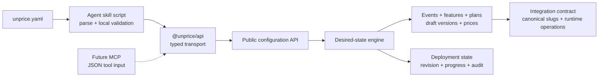

# Agent-Native Monetization Configuration Design

Date: 2026-08-01

Status: approved in conversation

## Goal

Make Unprice the monetization control plane for agent-built applications.

A coding agent should be able to inspect an application, express how it makes money in one
reviewable `unprice.yaml` file, preview the commercial consequences, configure Unprice through the
public TypeScript SDK, and integrate the application's runtime money path. The human remains the
authority for applying and publishing monetary behavior.

The product promise is:

> Describe how your app makes money; Unprice turns it into safe, enforceable billing.

## Success Criteria

- An agent can describe events, features, meters, plans, limits, and prices in one versioned
  manifest without using database IDs.
- The agent can preview a semantic diff before any mutation.
- Reapplying an identical manifest is a no-op.
- Retrying a timed-out or partially failed apply or publish resumes the same operation without
  creating duplicate resources or plan versions.
- Applying configuration creates drafts; publishing remains a separate, explicit action.
- Published plan versions are never modified in place.
- The SDK accepts a plain manifest object and has no dependency on YAML, filesystems, or agent
  runtimes.
- The agent skill owns YAML parsing, local validation, diff presentation, and approval workflow.
- Configuration credentials and deployed runtime credentials have distinct permissions.
- The API returns stable slugs and an integration contract that tells the agent which runtime SDK
  calls to add.
- A future MCP server can expose the same operations and JSON Schema without changing the domain,
  API, or SDK.
- The AI chatbot proves the complete story as a follow-on slice: customer provisioning, dynamic
  model access, pre-cost usage denial, and token-spend evidence.

## First Principles

### Desired state, not remote-control clicks

Raw CRUD exposes storage mechanics. An agent needs to express a commercial outcome. Unprice should
accept one desired-state document, calculate the dependency graph, and converge the project toward
that state.

### One authoritative engine

The API owns business validation, canonicalization, diffing, idempotency, dependency ordering, and
publication safety. SDKs, skills, CLIs, dashboards, and MCP servers are adapters; none reimplement
the monetization engine.

### Human-readable source, transport-neutral contract

`unprice.yaml` is the reviewed repository artifact. YAML is only an authoring format. The public
contract is a versioned JSON-compatible `MonetizationManifest`, sent through the SDK and validated
again by the API.

### Stable names at the boundary

The manifest references events, features, and plans by project-scoped slugs. Unprice resolves and
returns internal IDs. Agents never persist internal database IDs in application configuration.

### Money mutations require an explicit boundary

Reading and previewing are safe. Applying drafts and publishing monetary behavior are separate
operations with separate approvals, expected revisions, idempotency keys, and audit records.

## Current State

The repository already contains most of the domain behavior required behind the new boundary:

- `@unprice/api` is an OpenAPI-generated TypeScript SDK with explicit `{ result, error }` results;
- the public SDK can list features and plan versions, provision customers, check access, consume or
  record usage, manage budgeted runs, and inspect money-path evidence;
- the public API does not expose creation of events, features, plans, plan versions, prices, or
  publication;
- the dashboard performs those mutations through internal tRPC procedures;
- `applyPlanTemplate` already creates or reuses events, features, plans, and versions, detects
  compatible tagged versions, resumes incomplete materialization, and optionally publishes;
- the API-key model supports project keys, an `isRoot` flag, expiry, revocation, and optional
  customer binding, but it has no explicit configuration/runtime scopes;
- `skills/integrate-unprice-sdk` currently guides runtime integration only and intentionally tells
  agents not to invent missing product configuration.

This design extends the existing skill and SDK rather than creating a parallel billing client or
duplicating dashboard tRPC procedures as public APIs.

## Scope Decomposition

The initiative has three implementation tracks with explicit boundaries:

1. **Configuration control plane:** manifest schema, desired-state service, durable deployment
   state, API endpoints, key scopes, OpenAPI, and generated SDK methods.
2. **Agent experience:** `unprice.yaml`, the bundled skill script, workflow references, approval
   rules, local diagnostics, and runtime-integration handoff.
3. **Proof application:** configure and integrate the AI chatbot using only the public skill and
   SDK.

Tracks 1 and 2 belong to the Unprice repository and form the first implementation plan. Track 3 is
a separate implementation plan in the AI chatbot repository after the new SDK version is
available. A future MCP adapter is intentionally deferred.

## Considered Approaches

### Raw configuration CRUD

Expose create/update/delete methods for every event, feature, plan, plan version, meter, and price.

Trade-off: maximum low-level flexibility, but poor agent reliability. A multi-call sequence can
fail halfway, retries can duplicate immutable versions, the tool surface is large, and a future MCP
would expose too many dangerous tools.

### Declarative desired state — selected

Expose `get`, `preview`, `apply`, and `publish` around one `MonetizationManifest`.

Trade-off: the server must own a real diff and reconciliation engine, but callers receive a small,
idempotent, auditable surface. SDK, skill, CI, and MCP all reuse the same contract.

### Recipes only

Offer presets such as AI credits, per-seat SaaS, or workflow runs.

Trade-off: excellent first-run speed but insufficient flexibility. Recipes may be added as
client-side helpers that compile to the same manifest; they are not a second configuration model.
The first release may include one AI-app recipe only after the manifest contract is stable.

### TypeScript or JSON as the repository file

TypeScript provides autocomplete but executes code, couples configuration to Node.js, and is
awkward for MCP and non-TypeScript clients. JSON is deterministic but unpleasant for humans and
agents to author. YAML is selected for the repository artifact, with a restricted parser and
server-side JSON as the actual transport.

## Architecture



The layers have one-way ownership:

- The skill owns repository discovery, YAML ergonomics, local diagnostics, and agent approvals.
- The SDK owns authentication, retries, typed transport, and result/error normalization.
- The API owns authorization and maps HTTP operations to the desired-state service.
- The desired-state service owns all commercial validation and reconciliation.
- Existing event, feature, plan, publication, and payment-provider use cases remain the mutation
  primitives.
- Durable deployment state makes retries and partial recovery observable.

## Manifest Contract

### Canonical shape

The public manifest is JSON-compatible and versioned independently from the SDK:

```yaml
apiVersion: unprice.dev/v1alpha1
kind: Monetization

metadata:
  name: ai-chatbot

events:
  chat_request:
    name: Chat request

  ai_completion:
    name: AI completion
    properties:
      input_tokens: number
      output_tokens: number

features:
  chat-messages:
    title: Chat messages
    unit: message
    meter:
      event: chat_request
      aggregate: count

  reasoning-model:
    title: Reasoning model
    unit: access

  input-tokens:
    title: Input tokens
    unit: token
    meter:
      event: ai_completion
      aggregate: sum
      field: input_tokens

plans:
  free:
    title: Free
    default: true
    version:
      currency: USD
      interval: month
      features:
        chat-messages:
          type: usage
          limit: 20
          reset: day
          unitPrice: "0.00"

  pro:
    title: Pro
    version:
      currency: USD
      interval: month
      features:
        chat-messages:
          type: usage
          limit: 1000
          reset: month
          unitPrice: "0.01"
        reasoning-model:
          type: flat
          included: true
        input-tokens:
          type: usage
          unitPrice: "0.000002"
```

This example defines the hierarchy and user vocabulary. The implementation schema must map onto
the current Unprice validators for billing configuration, `flat`, `usage`, `package`, and tiered
prices rather than creating a second internal pricing model.

### Contract rules

- `apiVersion` and `kind` are required.
- The project is derived from the configuration token and never appears in the manifest.
- Map keys are stable slugs; duplicate YAML keys are rejected.
- Internal IDs, Dinero objects, generated timestamps, and publication status are not accepted.
- Monetary values are canonical decimal strings, never binary floating-point numbers.
- Events declare the numeric properties available for aggregation.
- Usage features reference events by slug and declare `count`, `sum`, `max`, or `latest` using the
  existing meter rules. Aggregations other than `count` require a field.
- Plan features use a discriminated union matching the existing Unprice pricing types.
- Exactly one plan must be the default when customer signup is expected to omit `planSlug`.
- References must resolve inside the same manifest or to compatible resources already owned by the
  project.
- Unknown fields fail validation for `v1alpha1`; they are not silently discarded.

### YAML safety profile

The skill parser accepts a restricted YAML subset:

- duplicate mapping keys fail;
- anchors, aliases, merge keys, and custom tags fail;
- implicit timestamps are disabled;
- scalar coercion is deterministic;
- document count is exactly one;
- file size, alias expansion, and nesting depth are bounded;
- diagnostics include the YAML line/column and manifest JSON path.

After parsing, the script validates the object against the generated manifest JSON Schema. The API
repeats validation with the authoritative application schema.

## API Surface

The public API adds four operations. The exact request and response types are generated into
`@unprice/api` from OpenAPI.

### `monetization.get`

Returns the current normalized manifest, configuration revision, publication state, managed
resource mappings, and detected drift for the token's project.

This is a read operation. It does not infer that manually created resources are managed by a
manifest unless they were explicitly adopted by a successful apply.

### `monetization.preview`

Input:

- the normalized manifest.

Output:

- `manifestHash`: SHA-256 of canonical manifest JSON;
- `baseRevision`: revision of the current successfully applied configuration;
- structured semantic changes grouped by events, features, plans, prices, and publication;
- human-readable summaries and warnings;
- conflicts that must be resolved before apply;
- a proposed integration contract containing canonical slugs and runtime operation guidance.

Preview is side-effect free. The API recalculates every value; it does not trust a client-provided
hash or diff.

### `monetization.apply`

Input:

- the full manifest;
- the previewed `manifestHash`;
- `baseRevision`;
- a stable idempotency key.

Behavior:

- recanonicalize and verify the hash;
- reject a stale base revision before starting a new operation;
- resume the existing deployment when the same idempotency key and manifest hash are retried;
- reject reuse of the idempotency key for a different manifest;
- materialize or adopt events, features, plans, draft versions, meters, and prices in deterministic
  dependency order;
- never edit a published plan version;
- stop at a fully validated draft configuration.

Output:

- deployment ID and state;
- applied draft revision;
- created, reused, adopted, and unchanged resource mappings;
- draft plan-version IDs;
- integration contract.

### `monetization.publish`

Input:

- deployment ID;
- expected draft revision;
- a stable publication idempotency key.

Behavior:

- require explicit `monetization:publish` authority;
- require a completely applied and validated draft deployment;
- rerun publication and payment-provider preconditions;
- publish each plan version through the existing publication use case;
- persist progress after every published plan version;
- resume the same deployment on retry.

Publication across several plans cannot honestly be described as one atomic database transaction
because payment-provider validation may be external and published versions are immutable. A
partial publish is recorded explicitly, blocks unrelated publication for the project, and is
resumed with the same deployment and idempotency key. It is never rolled back by mutating an
already published version.

Output:

- deployment and publication state;
- published configuration revision;
- published plan-version IDs;
- final integration contract.

## Desired-State Reconciliation

The server performs these steps:

1. Parse the typed request and validate cross-resource references.
2. Canonicalize maps, decimal values, optional defaults, and ordering.
3. Compute the manifest hash and current project revision.
4. Build a dependency graph: events, features, plans, draft versions, then plan-feature prices.
5. Classify every resource as create, reuse, adopt, replace-by-new-version, unchanged, conflict, or
   delete candidate.
6. Reject conflicts and destructive removals that lack an explicit acknowledgement.
7. Persist or resume the deployment record.
8. Execute steps in deterministic order, persisting progress after each step.
9. Validate the complete draft graph using existing publication preconditions.
10. Mark the applied revision and return the canonical integration contract.

### Ownership and drift

The first successful apply records the manifest-to-resource mapping. A compatible existing event,
feature, or plan may be adopted only when preview reports the adoption and apply includes the
reviewed manifest hash. An incompatible slug collision is a conflict.

The engine does not silently overwrite dashboard changes. `get` and `preview` report drift between
the last applied manifest and current resources. The next apply either restores the manifest,
adopts the new compatible state through an updated manifest, or fails with an actionable conflict.

### Deletion policy

The initial release is additive and version-producing by default:

- removing a feature from a new plan version does not delete the reusable project feature;
- removing an event, feature, or plan from the manifest produces a warning, not a physical delete;
- destructive archival or deletion is out of scope until ownership, active-subscription impact,
  and rollback semantics are designed explicitly.

## Durable Deployment State

Add one project-scoped monetization deployment record that stores:

- deployment ID;
- canonical manifest and hash;
- base, draft, and published revisions as applicable;
- apply and publish idempotency keys;
- state: applying, draft, publishing, published, failed, or partially published;
- deterministic step progress and resource mappings;
- structured failure details and retryability;
- initiating API-key ID and request IDs;
- creation and update timestamps.

Only one mutating deployment may be active for a project. Preview remains concurrent and
read-only. A new apply must use the current base revision and is rejected while a different
deployment is applying or publishing.

The deployment record is the recovery journal and audit source. It does not replace the existing
events, features, plans, or plan-version tables.

## Authentication and Authorization

### Connection

The skill and application instantiate the same SDK with different server-side credentials:

```ts
const unprice = new Unprice({
  token: process.env.UNPRICE_CONFIG_TOKEN!,
})
```

The SDK sends the credential as a bearer token. The API resolves the project from the token. The
token is never stored in `unprice.yaml`, application source, prompts, logs, fixtures, or browser
bundles.

### Key presets

Add explicit API-key capabilities and expose two simple dashboard presets:

| Preset | Intended owner | Capabilities |
| --- | --- | --- |
| Configuration | local agent or trusted CI | monetization read, preview, apply, publish |
| Runtime | deployed application server | customer provisioning, access checks, usage, runs, and required money-path reads |

Internally, permissions are capabilities rather than a hard-coded token-type branch so future
hosted agents and MCP OAuth grants can request least privilege. The dashboard presents presets to
avoid making users assemble scope strings.

Existing keys retain their existing runtime behavior but do not automatically gain the new
monetization mutation capabilities. Users intentionally create a configuration credential.

`apply` and `publish` require different capabilities. This preserves the option for CI to prepare
drafts while a more privileged process or explicit local approval publishes them.

## SDK Design

The SDK remains file-format and runtime neutral:

```ts
const preview = await unprice.monetization.preview({ manifest })

const applied = await unprice.monetization.apply({
  manifest,
  manifestHash: preview.result.manifestHash,
  baseRevision: preview.result.baseRevision,
  idempotencyKey,
})

const published = await unprice.monetization.publish({
  deploymentId: applied.result.deploymentId,
  expectedDraftRevision: applied.result.draftRevision,
  idempotencyKey: publishIdempotencyKey,
})
```

The generated resource is `unprice.monetization`. No YAML parser, filesystem helper, CLI argument
parser, or agent-specific approval logic is added to `@unprice/api`.

The SDK continues returning `{ result, error }`. New calls inherit transport retry behavior, but
retries are safe only because the application supplies stable idempotency keys. SDK retries do not
invent new mutation identifiers.

## Agent Skill Design

Extend the existing canonical skill instead of creating a second skill in the first release:

```text
skills/integrate-unprice-sdk/
├── SKILL.md
├── agents/
│   └── openai.yaml
├── scripts/
│   ├── monetization.ts
│   └── monetization.mjs
└── references/
    ├── configuration-workflow.md
    ├── monetization.schema.json
    ├── operation-selection.md
    ├── integration-patterns.md
    └── verification.md
```

`SKILL.md` routes configuration requests to the configuration workflow and runtime requests to the
existing operation-selection workflow. It remains a compact router rather than embedding the
manifest specification.

### Skill script responsibilities

The source script is reviewable TypeScript. The checked-in `.mjs` artifact bundles the safe YAML
parser and JSON Schema validator so host projects do not install parser dependencies. It
dynamically resolves the host project's installed `@unprice/api`; it does not bundle a second SDK
copy.

The script:

- reads one `unprice.yaml` file;
- enforces the YAML safety profile;
- validates against the generated manifest JSON Schema;
- verifies that the installed SDK exposes the required monetization methods and minimum contract;
- reads `UNPRICE_CONFIG_TOKEN` and optional intentional base URL from the environment;
- calls SDK `get`, `preview`, `apply`, or `publish`;
- emits concise human text plus stable machine-readable JSON;
- redacts credentials and sensitive headers;
- maps JSON paths back to YAML line/column diagnostics;
- requires the reviewed hash/revision as confirmation for apply and publish.

Example invocations:

```bash
node "$UNPRICE_SKILL_DIR/scripts/monetization.mjs" preview unprice.yaml
node "$UNPRICE_SKILL_DIR/scripts/monetization.mjs" apply unprice.yaml \
  --confirm-manifest "$MANIFEST_HASH" \
  --base-revision "$BASE_REVISION"
node "$UNPRICE_SKILL_DIR/scripts/monetization.mjs" publish \
  --deployment "$DEPLOYMENT_ID" \
  --confirm-revision "$DRAFT_REVISION"
```

The skill requires explicit user approval between preview and apply and again before publish. A
command-line confirmation value reduces accidental execution but is not presented as cryptographic
proof of human intent; agent hosts and MCP clients must provide their own destructive-tool approval
UX.

### Schema generation and drift

The API request schema is authoritative. The manifest JSON Schema in the skill and the SDK request
type are generated from the same checked-in API contract. CI regenerates them and fails on drift.
Agents never maintain a handwritten second schema.

The skill's bundled script is rebuilt deterministically in the repository. CI fails if its source,
embedded schema, and committed bundle disagree.

## Agent Workflow

The configured skill guides an agent through this sequence:

1. Inspect the application for customer identity, paid actions, provider costs, existing limits,
   existing Unprice integration, and durable request IDs.
2. Explain the proposed commercial model and its trade-offs before authoring configuration.
3. Create or update `unprice.yaml` with stable slugs and no credentials.
4. Run local validation and `monetization.preview`.
5. Present the semantic diff in business language: who can use what, what is limited, what is
   charged, and when.
6. Obtain explicit approval to apply drafts.
7. Run `monetization.apply` using the preview hash and base revision.
8. Present the concrete draft resources and publication consequences.
9. Obtain explicit approval to publish.
10. Run `monetization.publish` and capture the integration contract.
11. Install or update the SDK in the host app and implement customer provisioning, access checks,
    consumption, usage evidence, and budgeted runs at the correct server boundaries.
12. Add focused tests and report any remaining live dashboard or payment-provider verification.

## Integration Contract

Preview, apply, and publish return a machine-readable integration contract derived from the
manifest. It contains:

- event slugs and required numeric properties;
- feature slugs and whether they are flat access, synchronous usage gates, asynchronous evidence,
  or run-budget inputs;
- default plan and published plan-version identifiers;
- recommended runtime SDK operation per paid action;
- stable idempotency-key requirements;
- customer-provisioning policy, including whether omitting `planSlug` selects the default plan;
- warnings when actual usage is unknown before work and therefore requires `usage.record` or a
  budgeted run rather than guessed `usage.consume` properties.

The contract does not generate framework code on the server. The skill uses it to produce
host-appropriate code while preserving the application's architecture.

## Error Model and UX

API errors remain distinct from valid commercial or configuration outcomes. New structured error
codes include:

- invalid manifest, with JSON paths and remediation;
- unresolved or incompatible reference;
- unmanaged slug collision;
- stale base or draft revision;
- idempotency-key reuse with a different payload;
- deployment already active;
- incomplete or invalid draft;
- payment-provider publication precondition;
- insufficient capability;
- partially published deployment requiring resume;
- non-retryable domain conflict;
- retryable infrastructure failure.

Every error includes the Unprice request ID. Mutation errors also include the deployment ID and
last completed step when available. The skill maps JSON paths to YAML line/column locations and
renders a concrete next action. It never collapses an API failure into a fake validation denial.

The semantic preview emphasizes consequences instead of storage operations. For example:

```text
Free
  + Allow 20 chat messages per day
  - Reasoning model remains unavailable

Pro
  + Allow 1,000 chat messages per month
  + Include reasoning-model access
  + Charge $0.000002 per input token
```

## Observability and Audit

Configuration operations emit one wide event containing:

- operation and deployment IDs;
- project, workspace, API-key ID, and key capability preset;
- manifest hash, base revision, and target revision;
- counts of create, reuse, adopt, replace, conflict, and unchanged decisions;
- current step, final state, retryability, and duration;
- payment-provider validation result;
- request ID and SDK source/version.

Never log the token, complete manifest, customer PII, or unredacted arbitrary metadata. Store the
canonical manifest in the project-scoped deployment record with the same access control as plan
configuration.

## Verification

### Manifest and parser

- Valid manifests round-trip through YAML, normalized JSON, and canonical hashing.
- Map ordering, whitespace, and equivalent decimal formatting produce the same hash.
- Duplicate keys, aliases, tags, multiple documents, excessive depth, and oversized files fail.
- Invalid cross-references report the correct YAML location.
- Unknown `apiVersion`, `kind`, fields, pricing variants, and aggregations fail clearly.

### Preview

- Preview is read-only.
- Empty-project creation, compatible adoption, unchanged state, drift, slug collision, price
  change, limit change, feature removal, and default-plan change produce correct semantic diffs.
- Reordering the manifest does not produce changes.
- The integration contract selects `access.check`, `usage.consume`, `usage.record`, or runs from
  commercial behavior rather than method-name similarity.

### Apply

- Applying an identical manifest is a no-op.
- Retrying with the same idempotency key and manifest resumes or returns the existing result.
- Reusing an idempotency key with a different manifest fails.
- A stale base revision fails before a new deployment mutates resources.
- Failure after each dependency step can be retried without duplicates.
- Published versions are replaced with new drafts, never edited.
- Compatible unmanaged resources require reviewed adoption; incompatible collisions fail.
- Only one mutating deployment runs per project.

### Publish

- Missing capability, stale draft revision, invalid draft, and provider-precondition failures stop
  publication.
- Retry after timeout returns or resumes the same publication.
- Failure after publishing one of several plans records partial state and resumes remaining plans.
- An already published version is treated idempotently only when it belongs to the same
  deployment.
- Published revision and integration contract match the resulting plan versions.

### Credentials

- Configuration credentials can access monetization operations but are rejected from unauthorized
  customer-bound contexts.
- Runtime credentials cannot preview, apply, or publish configuration.
- Existing keys retain existing runtime behavior without gaining configuration authority.
- Tokens never appear in script output, errors, telemetry, browser bundles, or fixtures.

### SDK and skill

- Generated SDK methods match OpenAPI operation IDs and exact request/response types.
- The skill script resolves the host SDK and produces an actionable upgrade error when missing or
  incompatible.
- The committed bundle and JSON Schema are reproducible from source.
- Preview output has both stable JSON and readable text.
- Apply and publish refuse to run without reviewed hash/revision confirmations.
- Skill structural validation and discovery still pass.

### End-to-end proof

In a non-production Unprice project, the AI chatbot follow-on must prove:

1. the agent creates and publishes the model from `unprice.yaml`;
2. registration calls `customers.signUp` without `planSlug` and persists the returned customer ID;
3. signup fails without creating the local account when Unprice provisioning fails;
4. current entitlements control model visibility without a deploy;
5. `usage.consume` denies an exhausted message allowance before model cost;
6. `usage.record` reports actual input and output token evidence after completion;
7. wallet, usage, or charge evidence explains the resulting spend;
8. SDK/API errors and commercial denials have different UX.

No production customer, usage, payment, or publication is created by automated repository tests.

## Rollout

1. Land the manifest schema, durable deployment state, desired-state service, and focused service
   tests behind no public route.
2. Add capability-aware keys and dashboard presets without changing existing runtime-key behavior.
3. Add the four public API routes, OpenAPI contract tests, generated SDK resources, and an SDK
   release changeset.
4. Extend the agent skill, generate the JSON Schema, build the bundled script, and add skill tests.
5. Validate the workflow against a local or non-production Unprice project.
6. Publish the new `@unprice/api` version.
7. Create the separate AI-chatbot implementation plan and prove the end-to-end demo.
8. Use observed agent failures to stabilize the manifest before promoting `v1alpha1` to `v1beta1`.

## Future MCP Boundary

An MCP server is a thin adapter over the same SDK operations:

| MCP tool | SDK method |
| --- | --- |
| `monetization_get` | `monetization.get` |
| `monetization_preview` | `monetization.preview` |
| `monetization_apply` | `monetization.apply` |
| `monetization_publish` | `monetization.publish` |

MCP tool inputs use the normalized JSON manifest and generated JSON Schema. The MCP process stores
the credential; the model never receives it. A local MCP may begin with an environment-provided
configuration token. Hosted MCP authorization should use OAuth with least-privilege capability
grants, but OAuth and the MCP server are not part of this implementation.

## Non-Goals

- Building or publishing an MCP server in this project.
- Adding OAuth before a hosted MCP exists.
- Exposing public raw CRUD for configuration resources.
- Putting YAML parsing, filesystem access, agent prompts, or approval UX in `@unprice/api`.
- Letting an agent publish without an explicit user approval step.
- Physically deleting removed events, features, plans, or published versions.
- Editing published plan versions in place.
- Automatically choosing prices without explaining assumptions and trade-offs to the user.
- Supporting arbitrary executable logic, environment interpolation, secrets, anchors, or imports in
  `unprice.yaml`.
- Implementing the AI chatbot integration in the Unprice control-plane plan.
- Treating a command-line confirmation string as cryptographic proof of human approval.

## Decision Summary

- Canonical repository artifact: `unprice.yaml`.
- Canonical transport: versioned JSON-compatible `MonetizationManifest`.
- Public surface: `monetization.get`, `preview`, `apply`, and `publish`.
- Reconciliation: declarative, revision-aware, idempotent, and resumable.
- Publication: separate, explicit, immutable, and honest about partial multi-plan progress.
- SDK: typed transport only.
- YAML parsing and agent workflow: bundled skill script.
- Credentials: distinct configuration and runtime capability presets.
- Skill strategy: extend the existing canonical skill for the first release.
- MCP: thin future adapter over the same schema and SDK methods.
- Proof: separate AI-chatbot implementation after the SDK release.
