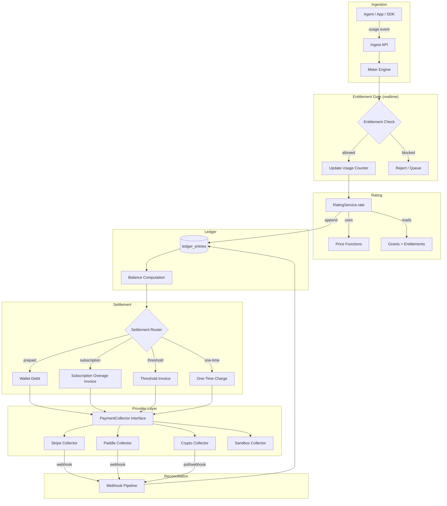

# Unprice Unified Billing Architecture Plan

> Merged plan: payment provider abstraction + agent billing architecture.
> Sequenced so each phase builds on the last without rework.

---

## Part 0 — Future Trends (Detailed Analysis)

Before diving into the plan, here is a detailed analysis of each trend that
informs the architectural decisions below. Every claim is validated against what
exists in the Unprice codebase today.

### Trend 1: Ledger-First Billing Architecture

**What it is.** Instead of treating invoices as the source of truth, the system
writes every financial event (debit, credit, reversal, settlement) to an
append-only ledger. Invoices become *derived views* computed from the ledger,
not the canonical record.

**How production systems implement it.** Metronome, Orb, and Lago all follow
the same core model:

```
Raw Event (immutable, timestamped)
  → Billable Metric (aggregation rule: SUM of `tokens` where model=gpt-4)
    → Charge / Price (pricing rule: $0.03/unit, tiered, package)
      → Ledger Entry (debit: $12.47 for 415 tokens)
        → Invoice Line Item (derived at billing cycle close)
```

The key property: **the invoice is always recomputable** from events + pricing
rules. You never need to ask "why does this invoice say $47?" — you replay
events through pricing to get there.

**What this enables that invoice-first can't:**

- **Retroactive repricing.** Customer negotiates a new rate mid-month. Replay
  all events against the new rate, issue a credit note for the difference. In
  an invoice-first system, the old invoice is the source of truth — you'd need
  manual adjustments.
- **Corrections without mutation.** You never edit a ledger entry. You append a
  corrective entry (credit memo, void, reversal). Full audit trail.
- **Real-time balance visibility.** The ledger balance is always current. You
  don't need to wait for invoice finalization to know what a customer owes.
- **Multi-settlement support.** The same ledger entries can be settled via
  different mechanisms (prepaid balance, subscription overage, threshold
  invoice) because the ledger is independent of how money moves.

**Where Unprice stands today.** The invoice IS the source of truth. In
`BillingService._finalizeInvoice()` (billing/service.ts:838), the system:

1. Fetches open invoice data
2. Computes prices inline via `_computeInvoiceItems()`
3. Updates invoice items directly in the DB
4. Applies credits in the same transaction
5. Sets the invoice status to `unpaid`

There is no intermediate ledger step. The computation and the persistence are
the same operation. This means:

- You can't retroactively reprice without re-finalizing
- You can't split a charge across multiple settlement modes
- You can't answer "what happened financially" without reading invoices

```
CURRENT (invoice-first):
  billing_period → _computeInvoiceItems() → UPDATE invoice_items → invoice.status = "unpaid"
                   ^^^^^^^^^^^^^^^^^^^^^^^^^^^^^^^^^^^^^^^^^^^^^^^^
                   computation and persistence are fused together

TARGET (ledger-first):
  usage_event → RatingService.rate() → ledger_entry (append-only)
  ledger_entry → SettlementRouter → invoice | wallet_debit | threshold_invoice
                                    ^^^^^^^^^^^^^^^^^^^^^^^^^^^^^^^^^^^^^^^^^
                                    invoice is one of many settlement outputs
```

---

### Trend 2: Multi-Dimensional Metering for Agents

**What it is.** A single agent task produces multiple billable dimensions
simultaneously: tokens consumed, tool calls made, compute seconds used, external
API costs incurred. The billing system must meter all dimensions from one event.

**Concrete example.** An AI agent task that calls GPT-4, runs a web search, and
writes to a database:

```json
{
  "event_name": "agent_task_completed",
  "customer_id": "cust_123",
  "timestamp": 1712188800000,
  "properties": {
    "task_id": "task_abc",
    "trace_id": "trace_xyz",
    "llm_tokens_in": 1200,
    "llm_tokens_out": 3000,
    "llm_model": "gpt-4",
    "search_queries": 3,
    "db_writes": 7,
    "wall_clock_ms": 14200
  }
}
```

**How Metronome and Orb handle this.** They define multiple billable metrics
pointing at different properties of the same event. One meter sums
`properties.llm_tokens_in`, another counts `properties.search_queries`, a third
sums `properties.wall_clock_ms`. Each meter feeds its own pricing rule. The
event is ingested once but metered N times.

**One event vs multiple events.** One event with multiple dimensions is
strictly better for:

- **Attribution** — you know all costs came from one task
- **Atomicity** — either all dimensions are recorded or none
- **Correlation** — no need for a `task_id` join key

Multiple events per task is simpler to implement but loses correlation and
creates partial-failure scenarios.

**Where Unprice stands today.** The `AsyncMeterAggregationEngine`
(entitlements/engine.ts:25) processes one `RawEvent` through multiple
`MeterConfig`s:

```typescript
// engine.ts — already supports multiple meters per event
const applicableMeters = this.meterConfigs.filter(
  (meterConfig) => meterConfig.eventSlug === event.slug
)
// each meter picks its own aggregationField from event.properties
```

This is the right foundation. Each `MeterConfig` has its own `aggregationField`
and `aggregationMethod` (count, sum, max, latest). To support multi-dimensional
agent events, you define one feature per billable dimension, each with its own
meter config pointing to a different property field.

**What's missing:**

- No `traceId` or `parentEventId` on usage events (needed for hierarchical
  attribution, see Trend 6)
- The `RawEvent` type at `domain.ts:8` has a flat `properties: Record<string, unknown>` — this is fine, but there's no validation that expected properties
  exist for a given meter config
- Meter configs are currently tied to `planVersionFeatures` — for agent billing,
  you might want meters defined at the feature level independent of plan
  versions

---

### Trend 3: Prepaid Wallets with Overage

**What it is.** Customer deposits money (or credits) upfront. Each usage event
debits the balance in real time. When the balance depletes, the system either
blocks (hard limit) or falls back to charging the payment method on file
(overage).

**How production systems work:**

| Provider | Model | Overage behavior |
|----------|-------|------------------|
| **OpenAI** | Prepaid credits, auto-top-up available | Blocks when depleted unless auto-reload is on |
| **Anthropic** | Prepaid + postpaid enterprise | Credits consumed FIFO with expiration dates |
| **Replicate** | Pure prepaid, no overage | Hard block when credits run out |
| **Vercel** | Subscription + usage overage | Bill overage to card monthly |

**The technical flow:**

```
1. Receive API request
2. Estimate cost (e.g., ~2000 tokens × $0.03/1K = ~$0.06)
3. Check wallet balance ≥ estimated cost
4. Optimistic debit (reserve the estimated amount)
5. Execute expensive compute
6. Reconcile actual cost vs reserved amount
   - If actual < reserved → release difference back to wallet
   - If actual > reserved → debit the remainder (or flag overage)
7. If balance was insufficient at step 3:
   - overageStrategy "none" → reject request (hard block)
   - overageStrategy "always" → allow, bill overage to payment method
   - overageStrategy "last-call" → allow this one, then block
```

**Concurrency control.** When two requests arrive simultaneously and only $0.10
remains, you need atomic balance decrements. The standard approach:

```sql
-- Atomic compare-and-swap (Postgres)
UPDATE credit_grants
SET amount_used = amount_used + $cost
WHERE id = $grant_id
  AND (total_amount - amount_used) >= $cost
RETURNING (total_amount - amount_used) as remaining;
-- If 0 rows returned → insufficient balance
```

**Where Unprice stands today.** The system already has `credit_grants` and
`invoice_credit_applications` tables. But credits are only applied at invoice
finalization time inside `_applyCredits()` (billing/service.ts:969), not at
request time. The `overageStrategy` field exists on grants (`none`,
`unit_multiplier`, `percentage_rate`, `flat_fee`) — but this controls pricing
behavior, not wallet debit behavior.

The entitlement engine's `overageStrategy` at the access-control layer (in the
Durable Objects) does implement the hard/soft/last-call pattern for rate
limiting. This is the right mechanism — it just needs to be connected to a
wallet balance, not just a unit count.

**What's missing:**

- No `wallets` or `wallet_transactions` table
- No real-time balance debit on usage events
- Credits are batch-applied at invoice time, not consumed per-event
- No auto-top-up mechanism
- No wallet-to-provider reconciliation

---

### Trend 4: Dynamic Settlement Routing

**What it is.** When a rated charge is ready to be settled, the system decides
*how* to collect the money based on the customer's funding configuration:

```
rated_charge ($12.47)
  ├─ Check prepaid wallet → $8.00 available → debit $8.00
  ├─ Remainder: $4.47
  ├─ Check subscription commitment → $0 remaining this cycle
  ├─ Remainder: $4.47
  └─ Charge to default payment method → $4.47
```

**Why it doesn't exist in production yet.** No billing platform offers a generic
settlement router because:

1. **Payment orchestration is business-logic-heavy.** The rules for "how to
   settle" vary wildly between businesses. Some want prepaid-first, others want
   subscription-first. Some allow split-tender, others don't.
2. **Partial settlement creates accounting complexity.** A single charge split
   across prepaid + card means two ledger entries, two reconciliation paths,
   and potential partial failure handling.
3. **The ROI hasn't justified the complexity.** Most companies have one
   settlement path per customer. Multi-path is rare enough that manual
   configuration suffices.

**Why it matters for agent billing.** Agents consume resources unpredictably.
A customer might have:

- A subscription with 10,000 included API calls
- A prepaid USDC balance of $50
- A Stripe card on file for overages

The settlement router decides: first deduct from subscription allocation, then
from prepaid balance, then charge the card. Without it, you'd need separate
billing flows for each path.

**Where Unprice stands today.** The only settlement path is:

```
subscription → billing_period → invoice → payment_provider
```

The `_collectInvoicePayment()` method (billing/service.ts:358) takes an invoice
and tries to collect from the provider. There's no intermediate step where the
system considers alternative funding sources. Credits are applied before
provider collection, but only as a fixed deduction, not as a routing decision.

**What building blocks already exist:**

- `credit_grants` table with `amountUsed` tracking
- `invoice_credit_applications` for recording credit usage
- `amountCreditUsed` on invoices
- `overageStrategy` on grants

The pieces are there for a basic settlement router — it's mostly an
orchestration layer on top.

---

### Trend 5: Entitlement-Gating at the Edge Before Expensive Compute

**What it is.** Before an agent runs (consuming GPU time, LLM tokens, API
calls), the system checks: "is this customer allowed to do this, and can they
pay for it?" The check must happen *before* the expensive work, not after.

**Latency requirements.** The gate must respond in <50ms, ideally <10ms. If the
entitlement check takes 200ms, that's 200ms added to every API call. For
high-frequency agent operations (hundreds of calls per task), this compounds
into seconds of latency.

**The TOCTOU problem.** Between checking "customer has 50 tokens remaining" and
the LLM call consuming 200 tokens, another request might consume the remaining
balance. This is the Time-of-Check-to-Time-of-Use (TOCTOU) race condition.

Solutions:

```
PESSIMISTIC (hard block):
  1. Atomic check-and-reserve: UPDATE balance SET reserved += estimate WHERE remaining >= estimate
  2. Execute compute
  3. Reconcile: UPDATE balance SET reserved -= estimate, used += actual

OPTIMISTIC (soft limit):
  1. Check balance (non-atomic read)
  2. Execute compute
  3. Debit actual amount
  4. If overdraft → bill overage on next settlement cycle

LAST-CALL (pragmatic middle ground — what OpenAI/Anthropic do):
  1. Check: does the customer have ANY remaining balance?
  2. If yes → allow the request (even if it will exceed the limit)
  3. After execution → debit actual amount
  4. Next check will see the overdraft and block
```

**Where Unprice stands today.** This is genuinely strong. The `EntitlementService`
(entitlements/service.ts) uses cache-backed queries with smart revalidation.
The `EntitlementWindowDO` (Cloudflare Durable Object) maintains real-time usage
counters with sub-millisecond local reads. The access control check
(`accessControlList`) combines usage limits, customer status, and subscription
state in a single cached check.

The `overageStrategy` on grants already implements `none` (hard block),
`always` (soft limit), and the limit-exceeded detection via
`findLimitExceededFact` in the meter engine.

**This is Unprice's strongest competitive advantage.** Most billing platforms
(Metronome, Orb, Lago) are POST-HOC — they meter after the fact. Unprice gates
BEFORE the compute. For agent billing, this is the critical path.

**What's missing for agent billing specifically:**

- The entitlement check currently resolves grants from subscription phases. For
  agent billing, grants should also resolve from manual/promotion/API-key
  sources without a subscription.
- No cost-estimation hook — the gate checks "are you within your usage limit?"
  but not "can you afford this specific operation?"
- Connecting the entitlement gate to a wallet balance (Trend 3) would give you
  "can you pay?" checks, not just "are you within limits?" checks.

---

### Trend 6: Nested/Hierarchical Agent Usage and Cost Attribution

**What it is.** Agent A calls Sub-Agent B which calls Sub-Agent C. Each
generates LLM tokens and tool calls. The billing system must:

1. Attribute costs to the correct root task
2. Optionally show cost breakdown per sub-agent
3. Bill the customer for the total, not per sub-call

```
Customer "Acme Corp"
  └─ Agent Task "analyze-repo" (trace_id: trace_001)
       ├─ LLM Call: Claude Opus, 5000 tokens      → $0.15
       ├─ Sub-Agent "code-search" (parent: trace_001)
       │    ├─ LLM Call: Claude Haiku, 2000 tokens → $0.01
       │    └─ Vector DB query                     → $0.002
       └─ Sub-Agent "test-runner" (parent: trace_001)
            ├─ LLM Call: Claude Sonnet, 3000 tokens → $0.03
            └─ Compute: 45 seconds GPU              → $0.12
       ─────────────────────────────────────────────────────
       Total: $0.312 billed to Acme Corp
```

**Relation to OpenTelemetry.** The cost attribution problem is structurally
identical to distributed tracing. Each operation is a span with `trace_id`,
`span_id`, and `parent_span_id`. You attach cost metadata as span attributes.
After execution, walk the span tree to roll up costs.

Langsmith and Langfuse already implement this for LLM observability — they
track cost per span. But they're observability tools, not billing systems.

**The approach: TraceAggregationDO.** Instead of expecting the client to
aggregate costs per root task, Unprice handles it natively with a Durable
Object keyed by `traceId`. This follows the same pattern as EntitlementWindowDO
and fits naturally into the existing DO architecture.

**How it works:**

```
Main Agent emits:  { traceId: "trace_001", slug: "llm-tokens", properties: { value: 5000 } }
Sub-Agent A emits: { traceId: "trace_001", slug: "llm-tokens", properties: { value: 2000 } }
Sub-Agent B emits: { traceId: "trace_001", slug: "compute-sec", properties: { value: 45 } }
Main Agent emits:  { traceId: "trace_001", slug: "__trace_complete" }  ← sentinel

All events with traceId route to:
  TraceAggregationDO key: "trace:{appEnv}:{projectId}:{customerId}:{traceId}"

DO collects events until sentinel or timeout (configurable, e.g., 5 min)
  → Aggregates: { llm-tokens: 7000, compute-sec: 45 }
  → Emits aggregated events BACK THROUGH the ingestion pipeline
  → Normal path: EntitlementWindowDO → Tinybird → Billing
  → Self-destructs
```

**Why back through the pipeline (not direct to EntitlementWindowDO):**

- Idempotency is preserved (aggregated event gets its own idempotency key)
- EntitlementWindowDO handles limit enforcement as usual
- PIPELINE_EVENTS captures the aggregated event in R2 for audit
- The normal fact-flush-to-Tinybird path handles analytics
- No special bypass paths to maintain

**This is also the foundation for value-based pricing.** The
TraceAggregationDO collects component costs and produces a single "task
completed" event. You can then price based on the outcome — flat per task,
cost-plus markup, or any other model — using the normal pricing path.

**Where Unprice stands today.** The `RawEvent` type has a flat `properties`
map — a `trace_id` property works fine. The DO architecture (SQLite + outbox
+ alarm flush) is proven with EntitlementWindowDO and IngestionIdempotencyDO.
TraceAggregationDO is a new DO using the same patterns.

**What's needed:**

- New `TraceAggregationDO` with SQLite tables for collected events and state
- Routing logic in IngestionService: if event has `traceId` and is not
  `__trace_complete`, route to TraceAggregationDO instead of normal path
- On completion: emit aggregated events via `IngestionService.ingestFeatureSync()`
- `traceId` as a first-class optional field on usage events for correlation

---

## Part 1 — Architecture Overview

### Target Flow



### What Changes vs What Stays

```
STAYS (proven, well-architected):
  ├─ AsyncMeterAggregationEngine     — storage-adapter-based, multi-meter
  ├─ GrantsManager                   — priority-based, multi-type grants
  ├─ EntitlementService + DO cache   — realtime access control
  ├─ SubscriptionMachine (xstate)    — state transitions, lifecycle
  ├─ Price calculation functions      — pure, Dinero.js, well-tested
  └─ Billing period generation       — cycle window math

REFACTORED (good bones, wrong coupling):
  ├─ BillingService._finalizeInvoice → splits into RatingService + LedgerService
  ├─ BillingService._upsertPaymentProviderInvoice → uses PaymentCollector
  ├─ PaymentProviderInterface → replaced by PaymentCollector (smaller contract)
  ├─ PaymentProviderService (switch router) → replaced by resolveCollector()
  └─ customer.stripeCustomerId → customer_provider_ids table

NEW (doesn't exist yet):
  ├─ RatingService                  — standalone, reusable rating
  ├─ LedgerService + ledger_entries — append-only financial log (Postgres)
  ├─ SettlementRouter               — funding source dispatch
  ├─ WalletDO + wallet tables       — prepaid balance with real-time debit
  ├─ TraceAggregationDO             — nested agent event collection
  ├─ Webhook pipeline               — normalized, idempotent
  ├─ customer_provider_ids table    — multi-provider customer mapping
  └─ apikey_customers table         — API key → customer mapping for agents
```

### Data Flow: Where Each Piece of Data Lives

Understanding where data lives is critical. There are four storage layers, each
serving a different purpose:

```
┌─────────────────────────────────────────────────────────────────────┐
│ STORAGE LAYER      │ WHAT LIVES HERE        │ WHY HERE             │
├─────────────────────────────────────────────────────────────────────┤
│ Durable Objects    │ Real-time counters:    │ Sub-ms reads,        │
│ (SQLite in DO)     │ - meter state          │ single-threaded      │
│                    │   (value_after per     │ concurrency,         │
│                    │    feature per period) │ no race conditions.  │
│                    │ - wallet balance       │ Hot path.            │
│                    │ - trace accumulator    │                      │
│                    │ - idempotency keys     │                      │
├─────────────────────────────────────────────────────────────────────┤
│ Tinybird           │ Billable meter facts:  │ OLAP aggregation,    │
│ (ClickHouse)       │ - delta per event      │ time-windowed        │
│                    │ - value_after snapshot │ queries,             │
│                    │ Materialized views:    │ billing period       │
│                    │ - hourly/daily/monthly │ totals.              │
│                    │   aggregates           │                      │
├─────────────────────────────────────────────────────────────────────┤
│ R2 Data Catalog    │ Raw events (full):     │ Cold storage,        │
│ (Iceberg/Parquet)  │ - all properties       │ audit trail,         │
│                    │ - processing state     │ replay capability.   │
│                    │ - rejection reasons    │ Not queried in       │
│                    │                        │ billing hot path.    │
├─────────────────────────────────────────────────────────────────────┤
│ Postgres           │ Transactional state:   │ ACID transactions,   │
│                    │ - ledger_entries       │ FK integrity,        │
│                    │ - invoices             │ complex joins for    │
│                    │ - grants/entitlements  │ settlement and       │
│                    │ - subscriptions        │ reconciliation.      │
│                    │ - customer_provider_ids│                      │
│                    │ - webhook_events       │                      │
└─────────────────────────────────────────────────────────────────────┘
```

**The complete event lifecycle:**

```
Raw event arrives at Ingest API
  │
  ├─→ R2 (via PIPELINE_EVENTS queue → Cloudflare Pipeline → R2 Data Catalog)
  │   Cold storage. Full event with all properties. Partitioned by
  │   project_id/customer_id/event_date. Iceberg format. Query via lakehouse-api.
  │
  ├─→ EntitlementWindowDO (via IngestionService)
  │   Real-time. Applies event to meter, updates value_after in SQLite.
  │   Stores fact in outbox table.
  │   │
  │   └─→ Tinybird (via DO alarm, every 30 seconds, outbox pattern)
  │       Billable meter facts only: { delta, value_after, feature_slug,
  │       aggregation_method, timestamp }. NO raw properties.
  │       Compacted into hourly → daily → monthly materialized views.
  │       Queried by BillingService at invoice finalization for period totals.
  │
  └─→ (For agent real-time billing, NEW path):
      RatingService.rateIncrementalUsage()
        Input: { quantity: delta, currentUsage: value_after - delta } from DO
        Output: RatedCharge { amountAtomic, currency, ... }
        │
        └─→ Postgres ledger_entries (append-only debit)
            Transactional. Running balance. Settlement tracking.
            │
            └─→ SettlementRouter (wallet debit, subscription overage, or one-time)
```

**Key insight: the DO's `value_after` is the real-time usage counter.** For
periodic billing, Tinybird's `argMax(value_after, timestamp)` returns the same
number — it's the authoritative total for the billing period. For real-time
agent billing, the DO provides `value_after` directly without a Tinybird query.
The ledger in Postgres tracks the financial side (rated charges, settlements),
not the usage counters.

**Reconciliation at period end:**

```
Tinybird total (authoritative)  vs  sum of ledger debits (real-time rated)
  $47.18                              $47.23
  ─────────────────────────────────────────────
  Adjustment ledger entry: -$0.05 credit
```

The real-time rated charges are "good enough" for wallet debits and balance
visibility. The periodic reconciliation via Tinybird is the source of truth.

### Tiered Pricing in Real-Time (The Total-Usage Problem)

For periodic billing, this is already solved: `BillingService` queries Tinybird
for the total usage in the period and calls `calculateTierPrice` with the
complete quantity. Graduated tiers work correctly because the total is known.

For real-time agent billing, the DO already has the running total. The rating
service computes the **marginal cost** of adding N units to the current total:

```typescript
// The DO returns: { delta: 50, value_after: 1030 }
// So currentUsage before this event was: 1030 - 50 = 980

// Graduated tiers: 0-1000 @ $0.10, 1001-5000 @ $0.05
// The marginal cost of going from 980 to 1030:

const totalCostBefore = calculateTierPrice({ tiers, quantity: 980, tierMode: "graduated" })
// = (980 × $0.10) = $98.00

const totalCostAfter = calculateTierPrice({ tiers, quantity: 1030, tierMode: "graduated" })
// = (1000 × $0.10) + (30 × $0.05) = $101.50

const marginalCost = totalCostAfter.amount - totalCostBefore.amount
// = $101.50 - $98.00 = $3.50
// Correct: 20 units at $0.10 + 30 units at $0.05
```

This reuses the existing `calculateTierPrice` function as-is — call it twice
(before and after) and take the difference. For volume pricing (where crossing
a tier boundary reprices ALL units), the marginal cost can be large or even
negative, which the ledger handles naturally via credit entries.

### Agent Grant Model

Agents authenticate via API keys. The billing entity is the **customer**, not
the API key. An organization might have 10 API keys for 10 agents, all drawing
from the same token pool and wallet.

**New table: `apikey_customers`**

```sql
CREATE TABLE apikey_customers (
  id          TEXT PRIMARY KEY,
  project_id  TEXT NOT NULL,
  apikey_id   TEXT NOT NULL,
  customer_id TEXT NOT NULL,
  created_at  BIGINT NOT NULL,

  UNIQUE (project_id, apikey_id),
  FOREIGN KEY (apikey_id, project_id) REFERENCES apikeys(id, project_id),
  FOREIGN KEY (customer_id, project_id) REFERENCES customers(id, project_id)
);
```

**No new grant subject type needed.** The current subject types
(`project`, `plan`, `plan_version`, `customer`) are sufficient. Grants
for agents use `subjectType: "customer"` with `type: "manual"`:

```
1. Admin creates customer "Acme Corp" (no subscription)
2. Admin creates API key for the project
3. Admin links API key → customer via apikey_customers
4. Admin creates manual grant:
   - subjectType: "customer", subjectId: "cus_acme"
   - type: "manual" (priority: 80)
   - featurePlanVersionId: references pricing config for "llm-tokens"
   - limit: 100000 tokens
   - effectiveAt: now, expiresAt: +30 days
5. Agent authenticates with API key
6. IngestionService resolves: API key → customer (via apikey_customers)
7. getGrantsForCustomer({ customerId: "cus_acme" }) finds the manual grant
8. EntitlementWindowDO enforces limits as usual
```

**Why `customer` and not a new `apikey` subject type:**

- Entitlements and wallet balance are per-customer, not per-key
- Multiple API keys share the same grants (10 agents, one pool)
- The existing `getGrantsForCustomer()` already queries by
  `{ subjectId: customerId, subjectType: "customer" }`
- No changes to GrantsManager, EntitlementService, or BillingService

**The grant references a `featurePlanVersionId`** — this is how the system
knows the pricing config and meter config. The plan version feature is
immutable once published (existing design). To iterate on pricing, publish a
new plan version and create new grants pointing to it. Old grants on old
versions keep their pricing until they expire.

### E2E Cycles: Human vs Agent

**Human with Stripe (subscription):**

```
┌─ SIGNUP ─────────────────────────────────────────────────────────┐
│ 1. Human selects "Pro Plan" on pricing page                      │
│ 2. SDK: signUp({ planSlug: "pro", email, provider: "stripe" })  │
│ 3. Unprice: create customer + subscription (status: pending)     │
│ 4. StripeCollector.setupPaymentMethod()                          │
│    → { type: "redirect", url: "checkout.stripe.com/cs_xxx" }    │
│ 5. Frontend: window.location.href = url                          │
│ 6. Human enters card, submits                                    │
│ 7. Stripe redirects → /v1/checkout/complete/stripe               │
│ 8. Store providerCustomerId in customer_provider_ids             │
│ 9. Activate subscription, provision grants                       │
└──────────────────────────────────────────────────────────────────┘
┌─ USAGE ──────────────────────────────────────────────────────────┐
│ 10. Human uses product                                           │
│     → Sync ingestion for gated features (EntitlementWindowDO)    │
│     → Async ingestion for batch metering (queue → DO → Tinybird) │
│     → Raw events → R2 Data Catalog (via PIPELINE_EVENTS)         │
└──────────────────────────────────────────────────────────────────┘
┌─ BILLING (periodic) ────────────────────────────────────────────┐
│ 11. Billing job fires at period end                              │
│ 12. RatingService.rateBillingPeriod()                            │
│     → queries Tinybird for total usage (authoritative)           │
│     → applies grants waterfall + calculateTierPrice              │
│ 13. LedgerService.postDebit() for each rated charge              │
│ 14. Create invoice from ledger entries                           │
│ 15. StripeCollector.createInvoice() + collectPayment()           │
│ 16. Webhook: payment.succeeded → ledger settlement entry         │
└──────────────────────────────────────────────────────────────────┘
```

**Human with Coinbase/crypto (prepaid wallet):**

```
┌─ SIGNUP ─────────────────────────────────────────────────────────┐
│ 1. Human selects "Pay with USDC"                                 │
│ 2. SDK: signUp({ planSlug: "pro", email, provider: "crypto" })  │
│ 3. Unprice: create customer + subscription (status: pending)     │
│ 4. CryptoCollector.setupPaymentMethod()                          │
│    → { type: "wallet_connect", chainId: 8453, token: "..." }    │
│ 5. Frontend: await connectWallet(result.chainId, result.token)   │
│ 6. Human connects MetaMask/Coinbase Wallet, approves allowance   │
│ 7. Callback → store wallet address in customer_provider_ids      │
└──────────────────────────────────────────────────────────────────┘
┌─ DEPOSIT ────────────────────────────────────────────────────────┐
│ 8. CryptoCollector.createInvoice() for initial deposit ($100)    │
│    → Coinbase Commerce charge or Request Network invoice         │
│ 9. Human sends 100 USDC                                         │
│ 10. Webhook/poll: deposit confirmed                              │
│ 11. LedgerService.postCredit({ source: "wallet_topup", $100 })  │
│ 12. WalletDO balance: +$100                                     │
│ 13. Activate subscription, provision grants                      │
└──────────────────────────────────────────────────────────────────┘
┌─ USAGE ──────────────────────────────────────────────────────────┐
│ 14. Human uses product                                           │
│     → EntitlementWindowDO gates access                           │
│     → WalletDO debits balance in real-time                       │
│     → Raw events → R2, meter facts → Tinybird                   │
│ 15. Balance at 20% → notification: "top up your wallet"          │
│ 16. Balance at 0%  → block (overageStrategy: "none")             │
│     OR allow overage (overageStrategy: "always") → bill later    │
└──────────────────────────────────────────────────────────────────┘
```

**Agent with API key (no human checkout):**

```
┌─ SETUP (admin, one-time) ────────────────────────────────────────┐
│ 1. Admin creates customer "Acme Corp" via dashboard/API          │
│ 2. Admin creates API key for the project                         │
│ 3. Admin links API key → customer via apikey_customers           │
│ 4. Admin creates manual grants:                                  │
│    - "llm-tokens": 100K units, manual type, 30-day expiry       │
│    - "compute-sec": unlimited, manual type                       │
│ 5. Admin tops up wallet: $50 via Stripe or crypto deposit        │
│    → LedgerService.postCredit(), WalletDO balance: +$50         │
│                                                                  │
│ NO subscription. NO checkout. NO payment method required yet.    │
│ Grants + wallet are provisioned directly.                        │
└──────────────────────────────────────────────────────────────────┘
┌─ AGENT USAGE (automated, per-task) ─────────────────────────────┐
│ 6. Agent authenticates: Authorization: Bearer sk_xxx             │
│ 7. API resolves: sk_xxx → apikey → apikey_customers → cus_acme  │
│ 8. Agent calls: POST /v1/events/ingest/sync                     │
│    { featureSlug: "llm-tokens", properties: { value: 5000 } }   │
│                                                                  │
│ 9. EntitlementWindowDO.apply(enforceLimit: true)                 │
│    → grant found (manual, subjectType: customer)                 │
│    → value_after: 55000 / limit: 100000 → allowed               │
│                                                                  │
│ 10. WalletDO.debit({ amount: estimated $0.15 })                 │
│     → balance: $49.85 → allowed                                 │
│                                                                  │
│ 11. Agent makes LLM call (expensive compute happens NOW)         │
│                                                                  │
│ 12. Agent reports actual: 5,847 tokens                           │
│     → reconcile event through ingestion                          │
│     → WalletDO reconcile: debit additional $0.025                │
│                                                                  │
│ 13. RatingService.rateIncrementalUsage()                         │
│     → currentUsage from DO, marginal cost via calculateTierPrice │
│     → RatedCharge: $0.175                                        │
│                                                                  │
│ 14. LedgerService.postDebit()                                    │
│     → Postgres: ledger_entry { debit, $0.175, unsettled }       │
│                                                                  │
│ 15. WalletDO outbox → Postgres ledger (async, every 30 sec)     │
│     Raw event → R2 (via PIPELINE_EVENTS)                         │
│     Meter fact → Tinybird (via DO outbox)                        │
└──────────────────────────────────────────────────────────────────┘
┌─ NESTED AGENT (with trace aggregation) ─────────────────────────┐
│ Same as above, but:                                              │
│ 8b. Events include traceId → routed to TraceAggregationDO       │
│ 9b. DO collects sub-agent events until __trace_complete          │
│ 10b. Aggregated events emitted back through ingestion pipeline   │
│ 11b. Normal path: EntitlementWindowDO → rate → ledger → settle  │
└──────────────────────────────────────────────────────────────────┘
```

**Normalized checkout — the interface is the same, the UX differs:**

```typescript
// Every provider returns one of:
type SetupResult =
  | { type: "redirect"; url: string }           // Stripe, Paddle
  | { type: "wallet_connect"; chainId: number }  // Crypto
  | { type: "none" }                             // Sandbox, agent-only

// Frontend handles the UX:
if (result.type === "redirect") window.location.href = result.url
if (result.type === "wallet_connect") await connectWallet(result.chainId)
if (result.type === "none") /* already activated */

// Backend callback is one generic endpoint:
// GET /v1/checkout/complete/:provider
// → stores provider mapping, activates subscription (if applicable)
```

For agents, there is no checkout. Grants and wallet are provisioned by the
admin. The agent just authenticates and uses. The `SetupResult` type of `"none"`
covers this case.

---

## Part 2 — Implementation Phases

### Phase 1: Extract the Rating Service

**Why first:** Everything downstream (ledger, settlement, agent billing) needs
the ability to rate a usage event independently. Today, rating is buried inside
`_computeInvoiceItems` and `calculateFeaturePrice` inside `BillingService`.

**What exists today** (billing/service.ts:1034-1233):

```typescript
// CURRENT: Rating is fused with invoice item computation
private async _computeInvoiceItems(payload: {
  invoice: SubscriptionInvoice       // ← requires an invoice
  items: InvoiceItemExtended[]        // ← requires invoice items
}): Promise<Result<{ items: ComputeInvoiceItemsResult[] }, UnPriceBillingError>> {
  // 1. Fetch grants for customer
  const allGrants = await this.grantsManager.getGrantsForCustomer(...)

  // 2. Group by feature, compute entitlement state
  const entitlement = await this.grantsManager.computeEntitlementState(...)

  // 3. Batch fetch usage data from analytics
  const usageData = await this.analytics.getUsageBillingFeatures(...)

  // 4. Calculate price per feature
  const calcResult = await this.calculateFeaturePrice(...)

  // 5. Return computed quantities and amounts
  // These are then DIRECTLY written to invoice_items in _finalizeInvoice()
}
```

**The problem:** Steps 1-4 are pure rating logic. Step 5 couples it to
invoices. You can't rate a single agent usage event without first creating an
invoice and invoice items.

**Target: `RatingService`**

```typescript
// NEW: internal/services/src/rating/service.ts

import type { CalculatedPrice } from "@unprice/db/validators"
import type { GrantsManager } from "../entitlements"
import type { Analytics } from "@unprice/analytics"

export interface RatedCharge {
  /** What triggered this charge */
  sourceType: "usage_event" | "billing_period" | "one_time"
  sourceId: string                    // usage event ID or billing period ID

  /** What was consumed */
  customerId: string
  projectId: string
  featureSlug: string
  quantity: number
  usage: number                       // raw usage value from meter

  /** What it costs */
  amountAtomic: number                // total in smallest currency unit (cents)
  currency: string
  unitAmountAtomic: number
  prorate: number                     // 0-1, for mid-cycle charges

  /** Context */
  grantId?: string | null             // which grant covered included usage
  included: number                    // how many units were included (free)
  limit: number | null                // entitlement limit
  isTrial: boolean
  cycleStartAt: number
  cycleEndAt: number

  /** Optional trace info for agent billing */
  traceId?: string
  metadata?: Record<string, unknown>
}

export class RatingService {
  constructor(
    private readonly grantsManager: GrantsManager,
    private readonly analytics: Analytics,
    private readonly logger: Logger,
  ) {}

  /**
   * Rate a single usage event incrementally using DO state.
   * Used for: agent tasks, realtime rating, one-time charges.
   *
   * The key difference from periodic billing: this uses the DO's
   * value_after (running total) to compute MARGINAL cost, not total cost.
   * This handles graduated tiers correctly without querying Tinybird.
   */
  async rateIncrementalUsage(event: {
    customerId: string
    projectId: string
    featureSlug: string
    quantity: number             // delta from this event (from DO Fact.delta)
    currentUsage: number         // value_after BEFORE this event (from DO)
    timestamp: number
    traceId?: string
    metadata?: Record<string, unknown>
  }): Promise<Result<RatedCharge, RatingError>> {
    // 1. Get grants (reuses existing GrantsManager)
    const { val: allGrants, err } = await this.grantsManager.getGrantsForCustomer({
      customerId: event.customerId,
      projectId: event.projectId,
      now: event.timestamp,
    })
    if (err) return Err(new RatingError({ message: err.message }))

    // 2. Filter grants for this feature
    const featureGrants = allGrants.grants.filter(
      (g) => g.featurePlanVersion.feature.slug === event.featureSlug
    )

    // 3. Compute entitlement state (reuses existing logic)
    const { val: entitlement, err: entErr } =
      await this.grantsManager.computeEntitlementState({
        grants: featureGrants,
        customerId: event.customerId,
        projectId: event.projectId,
      })
    if (entErr) return Err(new RatingError({ message: entErr.message }))

    // 4. Calculate MARGINAL price using the DO's running total
    //    For tiered pricing, we need to know where we are in the tiers.
    //    The DO gives us currentUsage (before this event).
    //    We compute: cost(currentUsage + quantity) - cost(currentUsage)
    const config = entitlement.config
    const featureType = entitlement.featureType

    const { val: priceBefore } = calculatePricePerFeature({
      config, featureType, quantity: event.currentUsage,
    })
    const { val: priceAfter, err: priceErr } = calculatePricePerFeature({
      config, featureType, quantity: event.currentUsage + event.quantity,
    })
    if (priceErr) return Err(new RatingError({ message: priceErr.message }))

    // Marginal cost = total cost after - total cost before
    const marginalCost = (priceBefore && priceAfter)
      ? formatAmountDinero(priceAfter.totalPrice.dinero).amount
        - formatAmountDinero(priceBefore.totalPrice.dinero).amount
      : 0

    // 5. Return rated charge (NO invoice coupling)
    return Ok({
      sourceType: "usage_event",
      sourceId: event.id ?? newId("rated"),
      customerId: event.customerId,
      projectId: event.projectId,
      featureSlug: event.featureSlug,
      quantity: event.quantity,
      usage: event.currentUsage + event.quantity,
      amountAtomic: marginalCost,
      currency: entitlement.currency,
      unitAmountAtomic: event.quantity > 0 ? Math.round(marginalCost / event.quantity) : 0,
      prorate: 1,
      included: entitlement.included ?? 0,
      limit: entitlement.limit,
      isTrial: false,
      cycleStartAt: event.timestamp,
      cycleEndAt: event.timestamp,
      traceId: event.traceId,
      metadata: event.metadata,
    })
  }

  /**
   * Rate a batch of invoice items for a billing period.
   * Used for: subscription billing (replaces _computeInvoiceItems internals).
   *
   * This is the EXTRACTED version of existing logic.
   */
  async rateBillingPeriod(input: {
    customerId: string
    projectId: string
    features: Array<{
      featureSlug: string
      featureType: FeatureType
      config: FeatureConfig
      cycleStartAt: number
      cycleEndAt: number
      prorate: number
    }>
    now: number
  }): Promise<Result<RatedCharge[], RatingError>> {
    // Same logic as _computeInvoiceItems but returns RatedCharge[]
    // instead of directly updating invoice_items rows
    // ... (extracted from billing/service.ts:1034-1233)
  }
}
```

**How `BillingService` changes:**

```typescript
// BEFORE (billing/service.ts:838):
private async _finalizeInvoice({ subscriptionId, projectId, now, invoiceId }) {
  const billableItems = await this._computeInvoiceItems({ invoice, items })
  // directly updates invoice_items in DB
}

// AFTER:
private async _finalizeInvoice({ subscriptionId, projectId, now, invoiceId }) {
  // 1. Rate via RatingService (pure computation, no DB writes)
  const ratedCharges = await this.ratingService.rateBillingPeriod({
    customerId: invoice.customerId,
    projectId,
    features: invoiceItemsToRatingInput(items),
    now,
  })

  // 2. Post to ledger (append-only)
  for (const charge of ratedCharges.val) {
    await this.ledgerService.postDebit(charge)
  }

  // 3. Update invoice items from rated charges (simple mapping)
  await this.updateInvoiceItemsFromCharges(invoice, ratedCharges.val)
}
```

The key insight: **steps 1-4 of `_computeInvoiceItems` become
`RatingService.rateBillingPeriod()`**, and the invoice update becomes a thin
mapping layer. The rating logic is now callable from anywhere — billing periods,
agent tasks, one-time charges.

---

### Phase 2: Add the Ledger

**Why second:** The ledger is the bridge between rating and settlement. Without
it, every settlement mode needs to understand how to compute charges. With it,
settlement modes just need to know how to move money for ledger entries.

**Schema:**

```sql
-- The ledger itself (one per customer per project)
CREATE TABLE ledgers (
  id          TEXT PRIMARY KEY,
  project_id  TEXT NOT NULL REFERENCES projects(id) ON DELETE CASCADE,
  customer_id TEXT NOT NULL,
  currency    currency NOT NULL,
  created_at  BIGINT NOT NULL,
  updated_at  BIGINT NOT NULL,

  UNIQUE (project_id, customer_id, currency)
);

-- Immutable, append-only entries
CREATE TABLE ledger_entries (
  id              TEXT PRIMARY KEY,
  project_id      TEXT NOT NULL,
  ledger_id       TEXT NOT NULL,
  -- What kind of entry
  entry_type      TEXT NOT NULL,  -- 'debit' | 'credit' | 'reversal' | 'settlement'
  -- Source tracking
  source_type     TEXT NOT NULL,  -- 'usage_event' | 'billing_period' | 'manual' | 'wallet_topup' | 'refund'
  source_id       TEXT NOT NULL,  -- ID of the usage event, billing period, etc.
  -- Financial
  amount_atomic   INTEGER NOT NULL,  -- positive for debits, negative for credits
  currency        currency NOT NULL,
  balance_after   INTEGER NOT NULL,  -- running balance after this entry
  -- Context
  feature_slug    TEXT,
  customer_id     TEXT NOT NULL,
  description     TEXT,
  -- Settlement tracking
  settlement_id   TEXT,           -- NULL until settled, then points to the settlement record
  settled_at      BIGINT,
  -- Metadata
  metadata        JSONB,
  created_at      BIGINT NOT NULL,

  FOREIGN KEY (ledger_id, project_id) REFERENCES ledgers(id, project_id)
);

-- Index for unsettled entries (the settlement router reads these)
CREATE INDEX ledger_entries_unsettled_idx
  ON ledger_entries (project_id, customer_id, settlement_id)
  WHERE settlement_id IS NULL;

-- Index for running balance computation
CREATE INDEX ledger_entries_balance_idx
  ON ledger_entries (ledger_id, created_at);
```

**How entries flow:**

```
┌──────────────────────────────────────────────────────────────────┐
│                        LEDGER TIMELINE                           │
├──────────┬──────────────┬────────────────┬───────────┬───────────┤
│ Time     │ Entry Type   │ Source         │ Amount    │ Balance   │
├──────────┼──────────────┼────────────────┼───────────┼───────────┤
│ 10:00:01 │ debit        │ usage_event    │ +$0.15    │ $0.15     │
│ 10:00:02 │ debit        │ usage_event    │ +$0.03    │ $0.18     │
│ 10:00:05 │ debit        │ usage_event    │ +$0.12    │ $0.30     │
│ 10:01:00 │ credit       │ wallet_topup   │ -$10.00   │ -$9.70    │
│ 10:15:00 │ debit        │ usage_event    │ +$0.45    │ -$9.25    │
│ ...      │ ...          │ ...            │ ...       │ ...       │
│ 23:59:59 │ settlement   │ threshold_inv  │ $0.00     │ $0.00     │
│          │              │ (settles all   │ (resets)  │           │
│          │              │  unsettled)    │           │           │
└──────────┴──────────────┴────────────────┴───────────┴───────────┘

Negative balance = customer has credit (prepaid)
Positive balance = customer owes money
Settlement zeroes the balance by moving money
```

**`LedgerService`:**

```typescript
// NEW: internal/services/src/ledger/service.ts

export class LedgerService {
  constructor(
    private readonly db: Database,
    private readonly logger: Logger,
  ) {}

  /**
   * Post a debit for a rated charge.
   * Called by: RatingService after rating, or BillingService during invoice finalization.
   */
  async postDebit(charge: RatedCharge): Promise<Result<LedgerEntry, LedgerError>> {
    return this.db.transaction(async (tx) => {
      // Get or create ledger for this customer
      const ledger = await this.ensureLedger(tx, {
        projectId: charge.projectId,
        customerId: charge.customerId,
        currency: charge.currency,
      })

      // Get current balance (last entry's balance_after)
      const lastEntry = await tx.query.ledgerEntries.findFirst({
        where: (t, { eq }) => eq(t.ledgerId, ledger.id),
        orderBy: (t, { desc }) => desc(t.createdAt),
      })
      const currentBalance = lastEntry?.balanceAfter ?? 0

      // Append entry (immutable — no updates ever)
      const entry = await tx.insert(ledgerEntries).values({
        id: newId("le"),
        projectId: charge.projectId,
        ledgerId: ledger.id,
        entryType: "debit",
        sourceType: charge.sourceType,
        sourceId: charge.sourceId,
        amountAtomic: charge.amountAtomic,
        currency: charge.currency,
        balanceAfter: currentBalance + charge.amountAtomic,
        featureSlug: charge.featureSlug,
        customerId: charge.customerId,
        description: `${charge.featureSlug}: ${charge.quantity} units`,
        metadata: charge.metadata ?? null,
        createdAt: Date.now(),
      }).returning().then(r => r[0]!)

      return Ok(entry)
    })
  }

  /**
   * Post a credit (wallet top-up, refund, manual adjustment).
   */
  async postCredit(input: {
    projectId: string
    customerId: string
    amountAtomic: number
    currency: string
    sourceType: string
    sourceId: string
    description: string
  }): Promise<Result<LedgerEntry, LedgerError>> {
    // Similar to postDebit but amount is negative (credit)
    // ...
  }

  /**
   * Get unsettled balance for a customer.
   * Used by: SettlementRouter to decide what needs settlement.
   */
  async getUnsettledBalance(input: {
    projectId: string
    customerId: string
  }): Promise<Result<{ balance: number; entries: LedgerEntry[] }, LedgerError>> {
    const entries = await this.db.query.ledgerEntries.findMany({
      where: (t, { and, eq, isNull }) => and(
        eq(t.projectId, input.projectId),
        eq(t.customerId, input.customerId),
        isNull(t.settlementId),
      ),
    })

    const balance = entries.reduce((sum, e) => sum + e.amountAtomic, 0)
    return Ok({ balance, entries })
  }

  /**
   * Mark entries as settled (after successful payment collection).
   * Called by: SettlementRouter after provider confirms payment.
   */
  async markSettled(input: {
    entryIds: string[]
    settlementId: string
  }): Promise<Result<void, LedgerError>> {
    await this.db.update(ledgerEntries)
      .set({ settlementId: input.settlementId, settledAt: Date.now() })
      .where(inArray(ledgerEntries.id, input.entryIds))
    return Ok(undefined)
  }
}
```

**How this connects to existing billing:**

```
BEFORE:
  _computeInvoiceItems() → UPDATE invoice_items → _upsertPaymentProviderInvoice()
  (rating)                 (persistence)           (settlement)
  ─────────────── all inside BillingService ───────────────────

AFTER:
  RatingService.rate()  → LedgerService.postDebit()  → SettlementRouter.settle()
  (rating)                (ledger)                      (settlement)
  ─── independent ────    ─── independent ──────────    ─── independent ───────

  For subscription billing:
    rateBillingPeriod() → postDebit() → createInvoiceFromLedger() → collectPayment()

  For agent usage:
    rateUsageEvent()    → postDebit() → walletDebit() or thresholdCheck()
```

---

### Phase 3: Schema Changes (Provider Abstraction)

**Why third:** Now that rating and ledger are independent, the provider layer
can be redesigned without affecting billing logic.

**3a. New table: `customer_provider_ids`**

```sql
CREATE TABLE customer_provider_ids (
  id                    TEXT PRIMARY KEY,
  project_id            TEXT NOT NULL REFERENCES projects(id) ON DELETE CASCADE,
  customer_id           TEXT NOT NULL,
  provider              payment_providers NOT NULL,
  provider_customer_id  TEXT NOT NULL,
  created_at            BIGINT NOT NULL,
  updated_at            BIGINT NOT NULL,

  UNIQUE (project_id, customer_id, provider),
  UNIQUE (project_id, provider, provider_customer_id)
);

-- Migration: copy existing data
INSERT INTO customer_provider_ids (id, project_id, customer_id, provider, provider_customer_id, created_at, updated_at)
SELECT gen_random_uuid(), project_id, id, 'stripe', stripe_customer_id, created_at, updated_at
FROM customers
WHERE stripe_customer_id IS NOT NULL;
```

**3b. Move `paymentProvider` from `plan_versions` to `subscription_phases`**

```sql
ALTER TABLE subscription_phases
  ADD COLUMN payment_provider payment_providers NOT NULL DEFAULT 'stripe';

-- Copy from plan version to phase
UPDATE subscription_phases sp
SET payment_provider = pv.payment_provider
FROM plan_versions pv
WHERE sp.plan_version_id = pv.id;
```

**3c. Add `webhook_events` table**

```sql
CREATE TABLE webhook_events (
  id                TEXT PRIMARY KEY,
  project_id        TEXT NOT NULL,
  provider          payment_providers NOT NULL,
  provider_event_id TEXT NOT NULL,
  event_type        TEXT NOT NULL,
  status            TEXT NOT NULL DEFAULT 'pending',
  payload           JSONB,
  error             TEXT,
  created_at        BIGINT NOT NULL,
  processed_at      BIGINT,

  UNIQUE (project_id, provider, provider_event_id)
);
```

---

### Phase 4: PaymentCollector Interface

**Why fourth:** With the ledger in place, the provider interface becomes
simpler — it just needs to move money for settled charges.

```typescript
// NEW: internal/services/src/payment-provider/collector.ts

/**
 * This replaces PaymentProviderInterface.
 *
 * Key differences from the current interface:
 * - No Stripe types anywhere (current interface.ts:149 has Stripe.ProductCreateParams)
 * - No upsertProduct (providers that need products handle it internally)
 * - Smaller surface area (11 methods → 8 methods)
 * - Webhook parsing is a first-class operation
 * - Capabilities declaration prevents "not implemented" runtime errors
 */
export interface PaymentCollector {
  readonly providerId: string

  // ── Customer ──
  ensureCustomer(input: {
    email: string
    name: string
    metadata?: Record<string, string>
  }): Promise<Result<{ providerCustomerId: string }, CollectorError>>

  // ── Payment method setup ──
  setupPaymentMethod(input: {
    providerCustomerId: string
    returnUrl: string
    cancelUrl: string
  }): Promise<Result<SetupResult, CollectorError>>

  listPaymentMethods(input: {
    providerCustomerId: string
    limit?: number
  }): Promise<Result<NormalizedPaymentMethod[], CollectorError>>

  // ── Invoice & collect ──
  createInvoice(input: {
    providerCustomerId: string
    currency: string
    items: Array<{
      description: string
      amountAtomic: number
      quantity: number
      metadata?: Record<string, string>
    }>
    description: string
    dueDate?: number
    collectionMethod: "charge_automatically" | "send_invoice"
  }): Promise<Result<{ providerInvoiceId: string; invoiceUrl: string }, CollectorError>>

  collectPayment(input: {
    providerInvoiceId: string
    paymentMethodId: string
  }): Promise<Result<NormalizedPaymentResult, CollectorError>>

  getPaymentStatus(input: {
    providerInvoiceId: string
  }): Promise<Result<NormalizedPaymentResult, CollectorError>>

  // ── Webhooks ──
  parseWebhook(input: {
    body: string
    headers: Record<string, string>
    signingSecret: string
  }): Promise<Result<NormalizedWebhookEvent[], CollectorError>>

  // ── Capabilities ──
  readonly capabilities: ProviderCapabilities
}

// ── Normalized types (no provider-specific types leak) ──

type SetupResult =
  | { type: "redirect"; url: string }
  | { type: "wallet_connect"; chainId: number; token: string }
  | { type: "none" }

type NormalizedPaymentMethod = {
  id: string
  type: "card" | "bank" | "wallet" | "crypto_wallet"
  label: string
  isDefault: boolean
  expiresAt?: number
}

type NormalizedPaymentResult = {
  status: "paid" | "pending" | "failed" | "void"
  paidAt?: number
  providerInvoiceUrl?: string
  failureReason?: string
}

type NormalizedWebhookEvent = {
  providerEventId: string
  type: "payment.succeeded" | "payment.failed" | "payment.refunded"
      | "payment_method.expired" | "dispute.created"
  data: WebhookEventData  // discriminated union per type
}

type ProviderCapabilities = {
  supportsAutoCharge: boolean
  supportsSendInvoice: boolean
  supportsRefunds: boolean
  supportsWebhooks: boolean
  supportedCurrencies: string[]
  settlementType: "fiat" | "crypto"
}

// ── Resolution (replaces PaymentProviderService with its 14 switch blocks) ──

function resolveCollector(
  provider: PaymentProvider,
  token: string,
  providerCustomerId: string | undefined,
  logger: Logger,
): PaymentCollector {
  switch (provider) {
    case "stripe":
      return new StripeCollector({ token, providerCustomerId, logger })
    case "paddle":
      return new PaddleCollector({ token, providerCustomerId, logger })
    case "sandbox":
      return new SandboxCollector({ providerCustomerId, logger })
    default:
      throw new Error(`Unknown provider: ${provider}`)
  }
}
```

**How `_upsertPaymentProviderInvoice` changes:**

```typescript
// BEFORE (billing/service.ts:1372-1471):
const { val: paymentProviderService } = await this.customerService.getPaymentProvider({
  customerId: invoice.customer.id,
  projectId: invoice.projectId,
  provider: invoice.paymentProvider,  // ← read from invoice (set at plan level)
})
const created = await paymentProviderService.createInvoice(basePayload)
// then addInvoiceItem() for each item, one at a time, with p-limit(10)

// AFTER:
const collector = await this.customerService.getPaymentCollector({
  customerId: invoice.customer.id,
  projectId: invoice.projectId,
  provider: phase.paymentProvider,    // ← read from subscription phase
})
// Single call with all items (collector batches internally if needed)
const created = await collector.createInvoice({
  providerCustomerId: mapping.providerCustomerId,
  currency: invoice.currency,
  items: invoice.invoiceItems.map(item => ({
    description: item.description,
    amountAtomic: item.amountTotal,
    quantity: item.quantity,
  })),
  description: `Invoice ${invoice.statementDateString}`,
  collectionMethod: invoice.collectionMethod,
})
```

---

### Phase 5: Settlement Router

**Why fifth:** With the ledger tracking unsettled charges and the provider layer
abstracted, the settlement router is a thin dispatch layer.

**Scope:** Design the type system for all four modes. Implement three now
(`wallet`, `subscription`, `one_time`). `threshold_invoice` is a future
addition — the type is defined so the interface is stable.

```typescript
// NEW: internal/services/src/settlement/router.ts

export type FundingSource =
  | { kind: "wallet"; walletId: string }
  | { kind: "subscription"; subscriptionId: string; phaseId: string }
  | { kind: "one_time" }
  | { kind: "threshold_invoice"; thresholdCents: number }  // FUTURE: not implemented yet

export class SettlementRouter {
  constructor(
    private readonly ledger: LedgerService,
    private readonly collector: PaymentCollector,
    private readonly logger: Logger,
  ) {}

  /**
   * Settle unsettled ledger entries for a customer.
   *
   * Decision tree:
   *
   *   ┌─ Has prepaid wallet with balance?
   *   │   YES → Debit wallet (up to balance)
   *   │         Remainder continues ↓
   *   │   NO  → continues ↓
   *   │
   *   ├─ Has active subscription?
   *   │   YES → Attach to next subscription invoice
   *   │   NO  → continues ↓
   *   │
   *   ├─ Has threshold invoice configured?
   *   │   YES → Accumulate until threshold, then create invoice
   *   │   NO  → continues ↓
   *   │
   *   └─ Create one-time charge
   */
  async settle(input: {
    projectId: string
    customerId: string
    funding: FundingSource
  }): Promise<Result<SettlementResult, SettlementError>> {
    const { val: unsettled } = await this.ledger.getUnsettledBalance({
      projectId: input.projectId,
      customerId: input.customerId,
    })

    if (unsettled.balance <= 0) {
      return Ok({ settled: true, amount: 0 })
    }

    switch (input.funding.kind) {
      case "wallet":
        return this.settleFromWallet(unsettled, input.funding)

      case "subscription":
        return this.attachToSubscriptionInvoice(unsettled, input.funding)

      case "one_time":
        return this.settleOneTime(unsettled)

      case "threshold_invoice":
        // FUTURE: accumulate until threshold, then create invoice
        throw new Error("threshold_invoice settlement not yet implemented")
    }
  }

  private async settleFromWallet(
    unsettled: { balance: number; entries: LedgerEntry[] },
    funding: Extract<FundingSource, { kind: "wallet" }>,
  ): Promise<Result<SettlementResult, SettlementError>> {
    // 1. Check wallet balance
    const walletBalance = await this.getWalletBalance(funding.walletId)

    // 2. Debit up to available balance
    const debitAmount = Math.min(unsettled.balance, walletBalance)
    await this.debitWallet(funding.walletId, debitAmount)

    // 3. Post credit entry to ledger
    await this.ledger.postCredit({
      // ... wallet debit as a credit entry
    })

    // 4. Mark entries as settled
    await this.ledger.markSettled({
      entryIds: unsettled.entries.map(e => e.id),
      settlementId: newId("stl"),
    })

    // 5. If remainder, the caller can chain another funding source
    const remainder = unsettled.balance - debitAmount
    return Ok({ settled: remainder === 0, amount: debitAmount, remainder })
  }

  private async settleViaThreshold(
    unsettled: { balance: number; entries: LedgerEntry[] },
    funding: Extract<FundingSource, { kind: "threshold_invoice" }>,
  ): Promise<Result<SettlementResult, SettlementError>> {
    // Only create invoice if balance exceeds threshold
    if (unsettled.balance < funding.thresholdCents) {
      return Ok({ settled: false, amount: 0, reason: "below_threshold" })
    }

    // Create provider invoice for the full unsettled amount
    const invoice = await this.collector.createInvoice({
      // ... create invoice from unsettled entries
    })

    // Attempt collection
    const payment = await this.collector.collectPayment({
      providerInvoiceId: invoice.val.providerInvoiceId,
      paymentMethodId: defaultPaymentMethodId,
    })

    // Mark settled in ledger
    if (payment.val.status === "paid") {
      await this.ledger.markSettled({
        entryIds: unsettled.entries.map(e => e.id),
        settlementId: newId("stl"),
      })
    }

    return Ok({ settled: payment.val.status === "paid", amount: unsettled.balance })
  }
}
```

**How this connects to the full flow:**

```
AGENT USAGE (realtime, wallet settlement):
  ingestEvent() → EntitlementWindowDO.apply()
                  returns { delta, value_after }
                → ratingService.rateIncrementalUsage({ quantity: delta, currentUsage })
                  uses calculateTierPrice twice (before/after) for marginal cost
                → ledgerService.postDebit() → Postgres
                → settlementRouter.settle({ funding: { kind: "wallet" } })
                  WalletDO.debit() → atomic balance decrement
  (async)       → DO outbox → Tinybird (meter facts, every 30 sec)
                → PIPELINE_EVENTS → R2 (raw events, cold storage)

SUBSCRIPTION BILLING (periodic):
  billingJob() → ratingService.rateBillingPeriod()
                 queries Tinybird for authoritative total usage
                 calls calculateTierPrice with full period quantity
              → ledgerService.postDebit() for each rated charge
              → createInvoiceFromLedger() (invoice is a derived view)
              → settlementRouter.settle({ funding: { kind: "subscription" } })
                PaymentCollector.createInvoice() + collectPayment()

ONE-TIME CHARGE (agent without wallet):
  same as agent usage, but:
  → settlementRouter.settle({ funding: { kind: "one_time" } })
    creates provider invoice immediately and attempts collection

THRESHOLD BILLING (FUTURE, not implemented yet):
  thresholdJob() → ledgerService.getUnsettledBalance()
                 → if balance > threshold:
                     settlementRouter.settle({ funding: { kind: "threshold_invoice" } })
```

---

### Phase 6: Webhook Pipeline

**Why sixth:** With the provider layer abstracted and the ledger in place,
webhooks can write directly to the ledger for reconciliation.

```typescript
// NEW: apps/api/src/routes/webhooks/providerWebhookV1.ts

app.post("/v1/webhooks/:provider/:projectId", async (c) => {
  const { provider, projectId } = c.req.param()
  const body = await c.req.text()
  const headers = Object.fromEntries(c.req.raw.headers.entries())

  // 1. Resolve collector for this provider
  const config = await getProviderConfig(projectId, provider)
  const collector = resolveCollector(provider, config.token, undefined, logger)

  // 2. Parse raw webhook into normalized events
  const { val: events, err } = await collector.parseWebhook({
    body,
    headers,
    signingSecret: config.webhookSecret,
  })
  if (err) return c.json({ error: "Invalid webhook" }, 400)

  // 3. Process each event idempotently
  for (const event of events) {
    // Idempotency check
    const existing = await db.query.webhookEvents.findFirst({
      where: (t, { and, eq }) => and(
        eq(t.providerEventId, event.providerEventId),
        eq(t.provider, provider),
        eq(t.projectId, projectId),
      ),
    })
    if (existing?.status === "processed") continue

    // Process event → writes to ledger
    switch (event.type) {
      case "payment.succeeded":
        // Find invoice → mark paid → post settlement entry to ledger
        await processPaymentSucceeded(event.data, projectId, db, ledgerService)
        break

      case "payment.failed":
        // Update invoice payment attempts → possibly trigger subscription machine
        await processPaymentFailed(event.data, projectId, db)
        break

      case "payment_method.expired":
        // Notify customer → possibly pause subscription
        await processPaymentMethodExpired(event.data, projectId, db)
        break

      case "dispute.created":
        // Flag invoice → alert admin → post reversal to ledger
        await processDispute(event.data, projectId, db, ledgerService)
        break
    }

    // Mark processed
    await db.insert(webhookEvents).values({
      id: newId("whe"),
      projectId,
      provider,
      providerEventId: event.providerEventId,
      eventType: event.type,
      status: "processed",
      createdAt: Date.now(),
      processedAt: Date.now(),
    }).onConflictDoNothing()
  }

  return c.json({ received: true })
})
```

**How webhooks close the reconciliation loop:**

```
┌─────────────────────────────────────────────────────────────────┐
│                    RECONCILIATION FLOW                           │
│                                                                 │
│  Unprice creates invoice ──→ Provider collects payment          │
│       │                            │                            │
│       │  ledger_entry:             │  Provider async events:    │
│       │  debit $36.47              │  - retry succeeds          │
│       │  source: billing_period    │  - card expires            │
│       │  settlement: null          │  - dispute filed           │
│       │                            │                            │
│       │                      ┌─────┴──────┐                     │
│       │                      │  WEBHOOK   │                     │
│       │                      └─────┬──────┘                     │
│       │                            │                            │
│       │  ledger_entry:             │                            │
│       │  settlement $36.47    ◄────┘                            │
│       │  source: provider_webhook                               │
│       │  settlement: stl_xxx                                    │
│       │                                                         │
│  Balance: $0.00 (reconciled)                                    │
└─────────────────────────────────────────────────────────────────┘
```

---

### Phase 7: Agent Billing Flow (End-to-End)

**Why last:** This is the payoff. With all pieces in place, agent billing is
just a new entry point into the same pipeline.

```typescript
// NEW: internal/services/src/agent/usage.ts

/**
 * Complete agent usage flow.
 *
 * This is the equivalent of reportAgentUsage() from the agent billing
 * architecture doc, but wired to real Unprice services.
 */
export class AgentUsageService {
  constructor(
    private readonly entitlementService: EntitlementService,
    private readonly meterEngine: AsyncMeterAggregationEngine,
    private readonly ratingService: RatingService,
    private readonly ledgerService: LedgerService,
    private readonly settlementRouter: SettlementRouter,
    private readonly logger: Logger,
  ) {}

  async reportUsage(event: {
    customerId: string
    projectId: string
    featureSlug: string
    quantity: number
    timestamp: number
    actorId: string       // agent ID
    taskId: string        // agent task ID
    traceId?: string      // for hierarchical attribution
    metadata?: Record<string, unknown>
  }): Promise<Result<AgentUsageResult, AgentUsageError>> {

    // ── Step 1: Entitlement gate (sub-ms via DO cache) ──
    // Reuses existing EntitlementService — no subscription required.
    // Grants can come from: subscription, manual, promotion, trial, addon.
    const access = await this.entitlementService.checkAccess({
      customerId: event.customerId,
      projectId: event.projectId,
      featureSlug: event.featureSlug,
      quantity: event.quantity,
    })

    if (!access.val?.allowed) {
      return Err(new AgentUsageError({
        message: "ENTITLEMENT_EXCEEDED",
        context: { remaining: access.val?.remaining },
      }))
    }

    // ── Step 2: Meter (existing engine, no changes needed) ──
    // The DO returns Facts with { delta, valueAfter }
    const facts = await this.meterEngine.applyEvent({
      id: newId("evt"),
      slug: event.featureSlug,
      timestamp: event.timestamp,
      properties: {
        value: event.quantity,
        actorId: event.actorId,
        taskId: event.taskId,
        ...event.metadata,
      },
    })

    // ── Step 3: Rate using DO state (new RatingService) ──
    // The DO's valueAfter is the running total AFTER this event.
    // currentUsage = valueAfter - delta (the state BEFORE this event).
    // This enables correct marginal pricing for graduated tiers.
    const fact = facts[0]  // primary meter fact
    const { val: charge, err: rateErr } = await this.ratingService.rateIncrementalUsage({
      customerId: event.customerId,
      projectId: event.projectId,
      featureSlug: event.featureSlug,
      quantity: fact?.delta ?? event.quantity,
      currentUsage: (fact?.valueAfter ?? event.quantity) - (fact?.delta ?? event.quantity),
      timestamp: event.timestamp,
      traceId: event.traceId,
    })

    if (rateErr) return Err(new AgentUsageError({ message: rateErr.message }))

    // ── Step 4: Ledger (new LedgerService) ──
    await this.ledgerService.postDebit(charge)

    // ── Step 5: Settle (new SettlementRouter) ──
    // Resolve which funding source to use for this customer
    const funding = await this.resolveFundingSource(event.customerId, event.projectId)
    const settlement = await this.settlementRouter.settle({
      projectId: event.projectId,
      customerId: event.customerId,
      funding,
    })

    return Ok({
      charged: charge.amountAtomic,
      currency: charge.currency,
      settled: settlement.val?.settled ?? false,
      fundingSource: funding.kind,
    })
  }

  /**
   * Resolve funding source for a customer.
   * Priority: wallet → active subscription → one-time
   * (threshold_invoice is future — add here when implemented)
   */
  private async resolveFundingSource(
    customerId: string,
    projectId: string,
  ): Promise<FundingSource> {
    // Check for wallet with balance first
    const wallet = await this.getActiveWallet(customerId, projectId)
    if (wallet && wallet.balance > 0) {
      return { kind: "wallet", walletId: wallet.id }
    }

    // Check for active subscription
    const subscription = await this.getActiveSubscription(customerId, projectId)
    if (subscription) {
      return {
        kind: "subscription",
        subscriptionId: subscription.id,
        phaseId: subscription.currentPhaseId,
      }
    }

    // Default to one-time
    return { kind: "one_time" }
  }
}
```

**The complete data flow for an agent task:**

```
Agent SDK call: reportUsage({ featureSlug: "llm-tokens", quantity: 5000, taskId: "task_abc" })
  │
  ├─ 1. EntitlementService.checkAccess()     ← existing, sub-ms via DO cache
  │     reads: entitlements table + grants    ← no subscription required
  │     returns: { allowed: true, remaining: 45000 }
  │
  ├─ 2. MeterEngine.applyEvent()             ← existing, no changes
  │     writes: meter state (DO storage)
  │     returns: [Fact { delta: 5000, valueAfter: 55000 }]
  │
  ├─ 3. RatingService.rateUsageEvent()       ← NEW (Phase 1)
  │     reads: grants, entitlements, price config
  │     returns: RatedCharge { amountAtomic: 1500, currency: "USD" }  ($15.00)
  │
  ├─ 4. LedgerService.postDebit()            ← NEW (Phase 2)
  │     writes: ledger_entries (append-only)
  │     returns: LedgerEntry { balanceAfter: 4700 }  ($47.00 unsettled)
  │
  └─ 5. SettlementRouter.settle()            ← NEW (Phase 5)
        reads: funding source → wallet (via WalletDO)
        writes: wallet debit (WalletDO), ledger credit entry (Postgres)
        returns: { settled: true, amount: 1500 }
```

---

## Part 3 — Dependency Graph and Sequencing

```
Phase 1: Extract Rating ─────────────────────┐
  (no new tables, refactors existing code)    │
                                              ▼
Phase 2: Add Ledger ──────────────────────────┤
  (new tables: ledgers, ledger_entries)       │
                                              │
Phase 3: Schema Changes ─────────────────┐    │
  (new: customer_provider_ids,           │    │
   webhook_events, phase.paymentProvider)│    │
                                         ▼    ▼
Phase 4: PaymentCollector Interface ──────────┤
  (replaces PaymentProviderInterface)         │
                                              │
Phase 5: Settlement Router ───────────────────┤
  (depends on: Ledger + PaymentCollector)     │
                                              │
Phase 6: Webhook Pipeline ───────────────────┤
  (depends on: PaymentCollector + Ledger)     │
                                              ▼
Phase 7: Agent Billing Flow ──────────────────┘
  (depends on: everything above)

PARALLEL TRACKS:
  Phases 1-2 can run in parallel with Phase 3
  Phase 4 depends on Phase 3
  Phases 5 and 6 can run in parallel (both depend on 2+4)
  Phase 7 depends on all
```

---

## Part 4 — What NOT to Do

1. **Don't build a custom on-chain payment system.** Use Coinbase Commerce or
   Request Network. Write a thin `CryptoCollector` around their API.

2. **Don't create provider subscription objects.** You own the lifecycle via
   `SubscriptionMachine`. Creating a Stripe Subscription alongside yours means
   two sources of truth that will drift.

3. **Don't try to bill per-span in agent trace trees.** Let the customer's
   application aggregate costs per root task. Put `traceId` in event properties
   for drill-down in analytics.

4. **Don't over-engineer the settlement router.** Start with a simple priority
   chain (prepaid → subscription → threshold → one-time). Don't build a rules
   engine until you have real customers asking for custom routing.

5. **Don't abstract away fiat vs crypto currency differences.** USD cents and
   USDC wei are different units. Let each collector handle conversion internally.

6. **Don't remove the sandbox provider.** Make it implement `PaymentCollector`.
   It becomes the reference implementation and testing backend.

7. **Don't add hierarchical billing attribution.** Keep billing flat. Let
   observability tools (Langfuse, OTel) handle trace-level attribution.
   The billing system just needs the total per root task.
